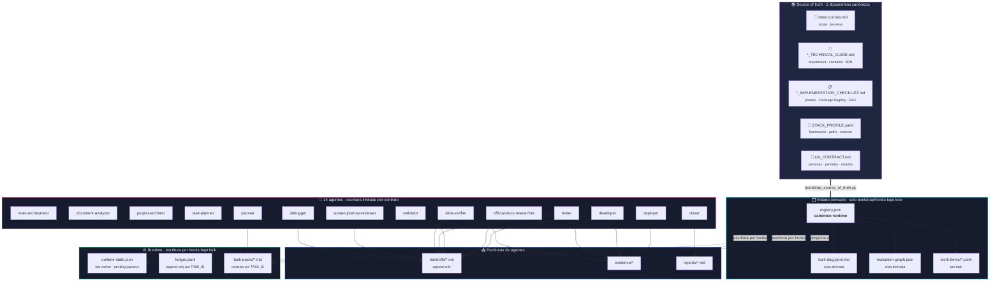
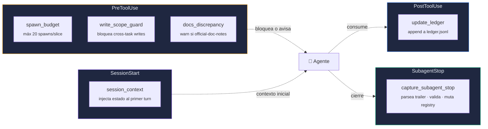
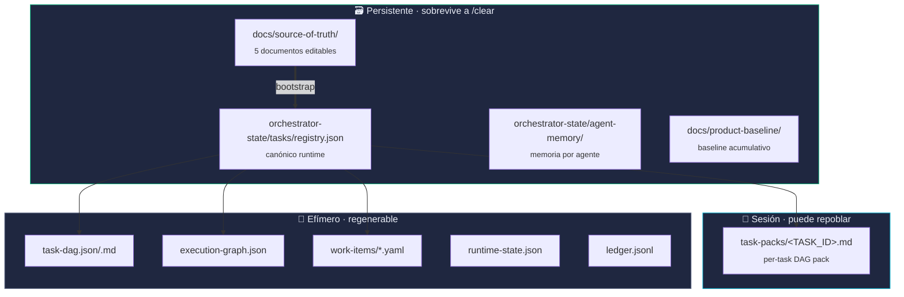
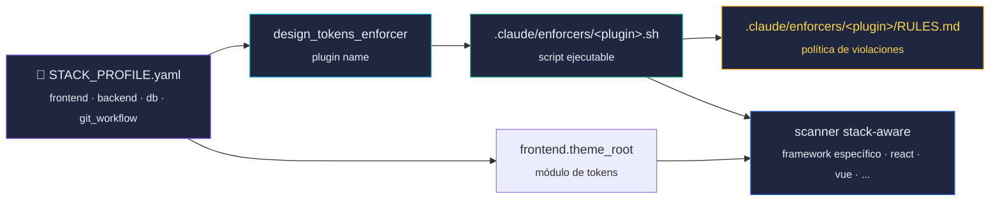
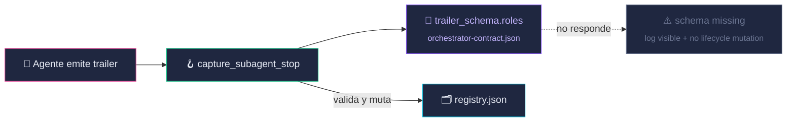
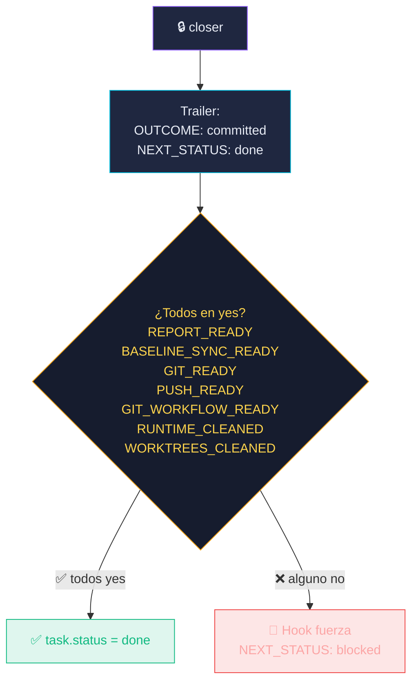
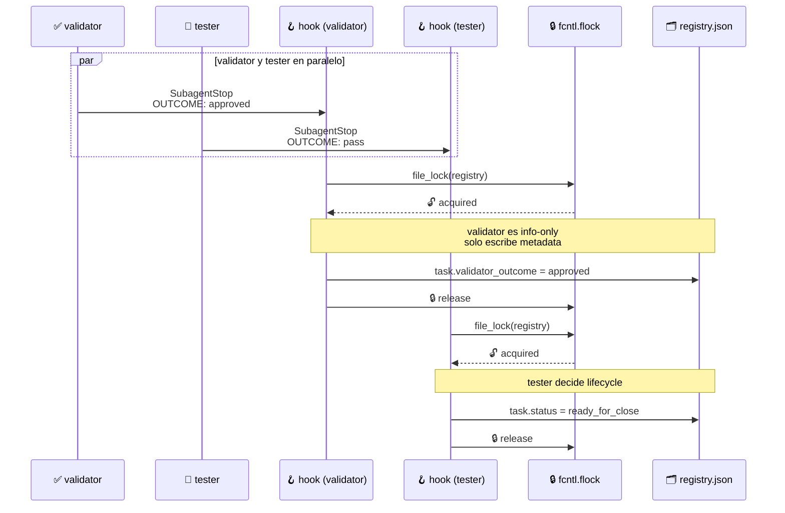

<div align="center">

# 🛠 Arquitectura — AnyStack

### Cinco documentos source-of-truth, hooks, locks, memoria runtime y trailers tipados — agnóstico de stack.

</div>

---

## 1. Vista de alto nivel

A diferencia del orquestador histórico de tres documentos, **AnyStack añade `STACK_PROFILE.yaml` y `UX_CONTRACT.md`** para desacoplar el motor del stack concreto y de la experiencia de usuario.



> [!IMPORTANT]
> **Sólo los 5 documentos en `docs/source-of-truth/` son editables a mano.** Todo lo demás se deriva o lo escriben hooks bajo lock POSIX. El hook `write_scope_guard` bloquea mecánicamente cualquier intento de editar a mano `registry.json`, `task-dag.*`, `runtime-state.json`, `ledger.jsonl` o `execution-graph.json` mientras hay un `TASK_ID` activo.

---

## 2. Hooks — el sistema nervioso



| Hook | Cuándo dispara | Qué hace |
|---|---|---|
| `spawn_budget` | Antes de cualquier `Agent` | Bloquea si la slice ya consumió **20 spawns** (`permissionDecision: deny`). |
| `write_scope_guard` | Antes de `Write/Edit/MultiEdit/NotebookEdit` | Bloquea cross-`TASK_ID`, mutaciones a derivado y edición de source-of-truth con TASK_ID activo. |
| `docs_discrepancy` | Antes de `Write/Edit` | Warn si hay `orchestrator-state/memory/official-doc-notes/*.md` sin `RESOLVED:`. **Nunca bloquea.** |
| `update_ledger` | Después de `Bash/Write/Edit/MultiEdit/NotebookEdit` | Append append-only a `ledger.jsonl` con scope `CLAUDE_ACTIVE_TASK_ID`. |
| `capture_subagent_stop` | Al cerrar un subagente | Parsea trailer, valida `OUTCOME/NEXT_STATUS`, muta `registry.json` + `runtime-state.json` bajo lock POSIX. |
| `session_context` | Al arrancar sesión Claude Code | Inyecta el estado canónico (DAG task, phase, pending journeys, hook errors) al primer turn. |

---

## 3. Memoria runtime — qué vive dónde



> [!TIP]
> En modo DAG explícito, `CLAUDE_ACTIVE_TASK_ID` + `CLAUDE_TASK_PACK=orchestrator-state/tasks/task-packs/<TASK_ID>.md` son la fuente autoritativa. cada terminal usa su task pack por `TASK_ID`.

---

## 4. STACK_PROFILE → enforcer plugin pattern

AnyStack desacopla el motor del stack vía un patrón de plugin: `STACK_PROFILE.yaml` declara qué enforcer de design tokens aplicar y dónde están los paths del proyecto.



> [!NOTE]
> El plugin recomendado por defecto es `design_tokens_v1`, que lee `frontend.framework` y aplica el escaneo específico (framework declarado). `design_tokens_enforcer: none` es válido solo cuando el proyecto deshabilita la enforcement de visual tokens **explícitamente** y deja el trade-off documentado en source-of-truth.

---

## 5. Trailer schema — fuente única de outcomes



El JSON declara para cada agente:

```json
{
  "trailer_schema": {
    "roles": {
      "tester": {
        "outcome_values": ["pass", "fail", "blocked"],
        "next_status_values": ["ready_for_close", "needs_debug", "blocked"],
        "info_only": false,
        "mutates_registry_lifecycle": true,
        "allowed_to_close_task": false,
        "required_keys": ["TASK_ID", "OUTCOME", "NEXT_STATUS"]
      },
      "validator": {
        "outcome_values": ["approved", "changes_requested", "blocked"],
        "info_only": true,
        "mutates_registry_lifecycle": false
      }
    }
  }
}
```

---

## 6. Closer guardrail — por qué no se puede mentir



> [!CAUTION]
> El guardrail está en `enforce_closer_done_guardrail()` en `hook_capture_subagent_stop.py`. Si el closer intenta marcar `done` sin las pruebas, incluido `RUNTIME_CLEANED: yes`, el hook reescribe el trailer a `blocked`. Es **mecánico**, no basado en el prompt del agente. Además, el closer rechaza el commit si en el handoff falta `## verify-slice` completo con `VERIFY_OUTCOME: verified` + MCP/datos/evidencia (o `VERIFY_WAIVED: <motivo>`).

---

## 7. 14 agentes especializados

```mermaid
flowchart LR
    subgraph BOOTSTRAP[Bootstrap · una vez por proyecto]
        DA[document-analyzer]
        PA[project-architect]
        TPL[task-planner]
    end

    subgraph LIFECYCLE[Lifecycle · ciclo del slice]
        PL[planner]
        DEV[developer]
        ODR[official-docs-researcher<br><sub>opcional</sub>]
        VAL[validator]
        TST[tester]
        DBG[debugger]
    end

    subgraph VERIFY[Verify + cierre manual]
        SV[slice-verifier]
        SJR[screen-journey-reviewer<br><sub>si UI/journey</sub>]
        CLO[closer<br><sub>manual</sub>]
    end

    subgraph SPECIAL[Especializado]
        DEP[deployer<br><sub>release/deploy flow</sub>]
        MO[main-orchestrator]
    end

    BOOTSTRAP -.una vez.-> LIFECYCLE
    LIFECYCLE -.tester pass.-> VERIFY
    VERIFY -.cuando aplique.-> SPECIAL

    style BOOTSTRAP fill:#1f2740,stroke:#06b6d4,color:#e8ecf5
    style LIFECYCLE fill:#1f2740,stroke:#10b981,color:#e8ecf5
    style VERIFY fill:#1f2740,stroke:#3b82f6,color:#e8ecf5
    style SPECIAL fill:#1f2740,stroke:#f59e0b,color:#e8ecf5
```



[**→ Ver outcomes y vocabulario por agente**](outcomes.md)

---

## 8. Concurrencia real, no decorativa

Cuando `validator` y `tester` cierran a la vez, hay race condition por defecto. AnyStack la resuelve por contrato: solo uno es lifecycle owner, el otro queda como info-only.



> [!NOTE]
> **El validator no toca `task.status`**. Su `NEXT_STATUS` se guarda como `validator_next_status` (metadata informativa). Esto elimina la race condition cuando ambos cierran a la vez en el par paralelo. El **closer** lee el `OUTCOME` del validator desde el handoff antes de cerrar y rechaza el commit si no es `approved`. La clasificación info-only/lifecycle vive sólo en `.claude/orchestrator-contract.json -> trailer_schema.roles` y el hook la deriva de ese schema; no hay whitelist hardcodeada.

---

<div align="center">
<sub>
🛠 Arquitectura ·
<a href="../../README.md">← README</a> ·
<a href="dag-flujo.md">DAG flujo →</a> ·
<a href="comandos.md">Comandos →</a> ·
<a href="outcomes.md">Outcomes →</a>
</sub>
</div>


## Framework self-check layer

The product still enters through five source-of-truth files only. The extra framework assets are framework validators:

```text
.claude/schemas/                  machine-readable schemas for generated artifacts
scripts/orchestrator-doctor.sh     global framework health check
scripts/validate-orchestrator-schemas.sh
examples/golden-real-app/          dependency-free implementation of the AnyStack golden contract
scripts/run-golden-e2e.sh          golden app + source-of-truth bootstrap smoke
```

The golden app uses Python/SQLite for dependency-free CI, but the contract is stack-agnostic: any stack must prove real/provided data, real product actions, persistence, DR-* verification and clean runtime logs through `STACK_PROFILE.yaml`.
