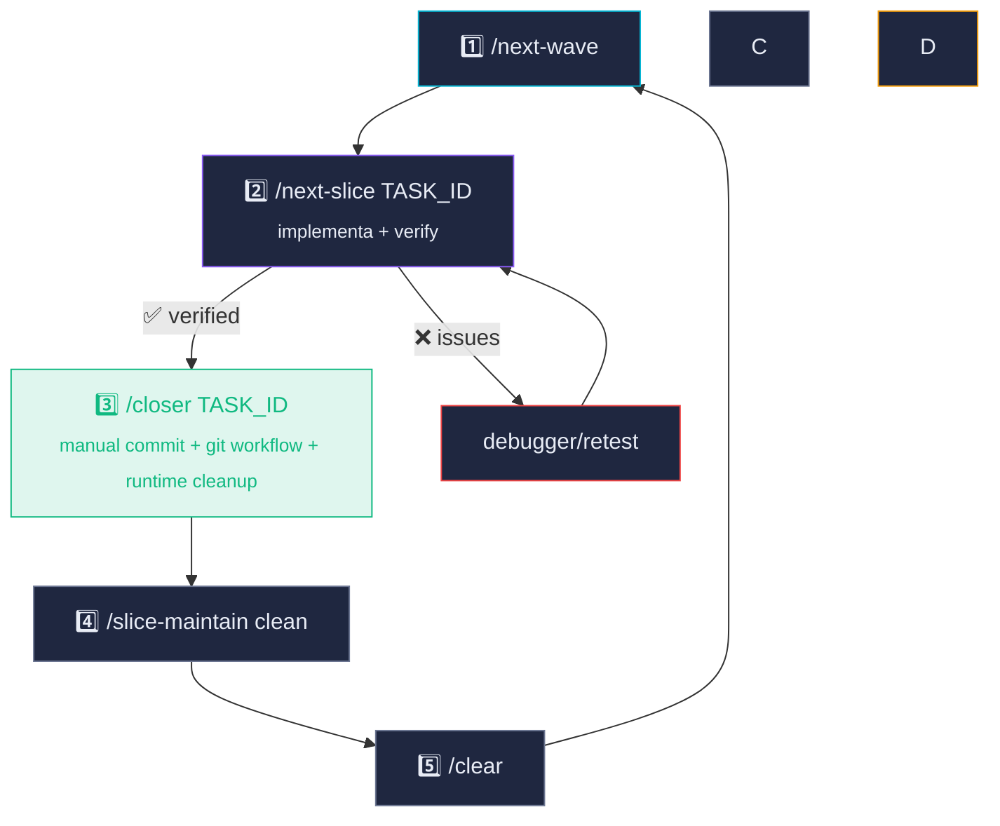
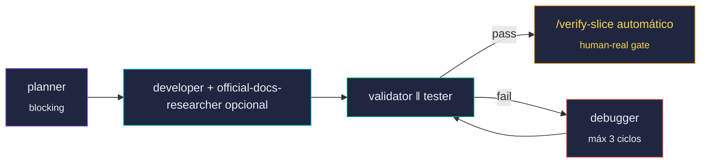
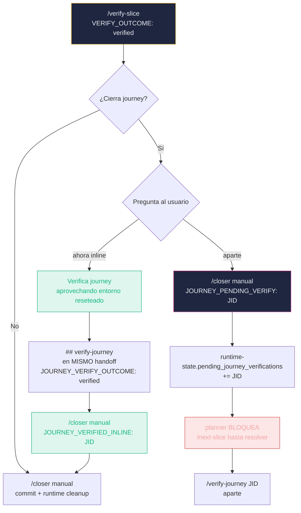
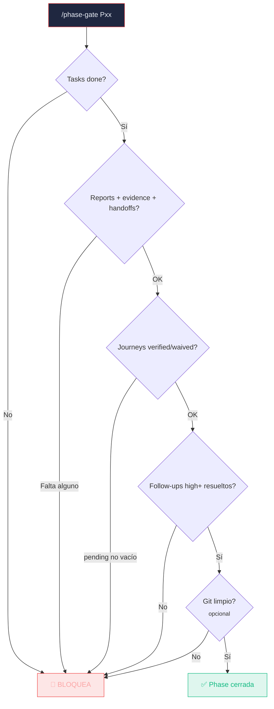
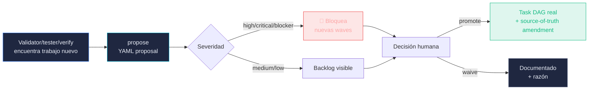
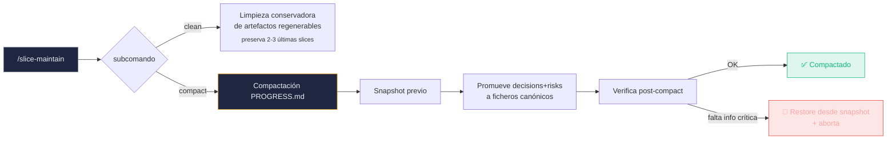

<div align="center">

# 📜 Comandos — AnyStack

### Slash commands del orquestador. Cada uno tiene su lugar en el ciclo del slice.

</div>

---

## Ciclo recomendado por slice



---

## 🌊 Scheduler

### `/next-wave`


Lista nodos `ready` seguros e imprime exports copy/paste por terminal. **No hace claim, no muta estado**.

```bash
./scripts/next-wave.sh --limit 4
```

**Imprime:**
```bash
export CLAUDE_ACTIVE_TASK_ID=P02-S03-T001 \
       CLAUDE_TASK_PACK=orchestrator-state/tasks/task-packs/P02-S03-T001.md
```

> [!TIP]
> Excluye nodos que pisan el mismo `Conflict group` o `Write set` que otro nodo ya activo. Si quieres ver TODOS los ready (incluidos los que se serializarían), añade `--unsafe`.

---

## 🔧 Pipeline de slice

### `/next-slice TASK_ID`


Claim atómico + pipeline completo: planner → developer → validator‖tester y, si todo queda verde, continúa automáticamente con el contrato de `/verify-slice`. **No invoca closer**: deja la task en `verified_pending_close` para que tú lances `/closer <TASK_ID>`. `/verify-slice` delega la verificación humana en `slice-verifier`, que requiere un MCP visual usable según la superficie: browser MCP (`chrome-devtools`, `claude-in-chrome`, `agent360-browser-mcp`/`browser-mcp`) para web/browser, o Dart/Flutter MCP (`MCP_CLIENT: dart|flutter|flutter-driver` + `VISUAL_CHECK_METHOD: simulator|emulator|device`) para Flutter mobile.



> [!NOTE]
> En DAG-only, `runtime-state.pending_journey_verifications` difiere sólo las tasks que referencian esos journeys. Las ramas independientes pueden seguir; las tasks afectadas deben resolver el journey gate inline en `/verify-slice §5.bis` o aparte con `/verify-journey`.

---

## 👤 Gates humanos

### `/verify-slice TASK_ID`


Verificación con datos reales del `Verification Data Contract` definido en el `*_TECHNICAL_GUIDE.md`. Reset controlado, carga de datos reales/proporcionados y reproducción humana usando el método declarado en `STACK_PROFILE.frontend.visual_check` (browser, emulador, simulador, device), logs vivos. Si hay Docker Compose, el reset usa `docker compose -p <compose_project>` y además ejecuta el allocator de puertos: `CLAUDE_FRONTEND_PORT`, `CLAUDE_BACKEND_PORT`, `CLAUDE_DB_PORT`, etc. `-p` no aísla puertos host por sí solo.

**Acciones según resultado:**

| Resultado | Acción |
|---|---|
| ✅ `verified` sin journey | Deja la slice en `verified_pending_close` y muestra `/closer <TASK_ID>` |
| ✅ `verified` cierra journey | Pregunta: verify-journey **inline** o **aparte** (§5.bis) |
| ⚠️ Hallazgos menores en scope | Llama `debugger`, repite `validator ‖ tester`, re-verifica |
| ❌ Hallazgos mayores fuera scope | Registra follow-up formal con `register-followup propose` |

> [!IMPORTANT]
> El closer **no commitea sin** `## verify-slice` completo con `VERIFY_OUTCOME: verified` + MCP/datos/evidencia en el handoff. Único waiver: `VERIFY_WAIVED: <motivo>` firmado por humano explícitamente. `/verify-slice` es resiliente al `/clear`: reconstruye el contexto desde disco (PROGRESS.md, runtime-state, registry, handoff, TECHNICAL_GUIDE).

---

### Journey verify §5.bis — inline vs aparte

Cuando una slice cierra al menos un journey de `registry.journeys[]` y `VERIFY_OUTCOME: verified`, el comando pregunta al usuario qué hacer:



> [!TIP]
> La rama "ahora" evita el doble gate: aprovecha el entorno ya reseteado y los datos reales/proporcionados cargados, apendiza `## verify-journey` al **mismo handoff** del slice (no usa `journey-handoffs/`). El closer reconoce `JOURNEY_VERIFIED_INLINE` y el SubagentStop hook marca el journey como `verified` bajo lock, sin añadirlo a `pending_journey_verifications`.

---

### `/verify-journey JID`


Gate end-to-end multi-pantalla. Reproducción del journey completo + estados marginales (empty, error_network, permission_denied, deep_link, back, reload).

> [!NOTE]
> En el flujo normal, los journeys se verifican **inline** en `/verify-slice §5.bis`. Este comando queda dormido salvo para waivers, re-verificaciones aisladas o cuando el usuario eligió "aparte" en §5.bis.

---

## ⚡ Auto-verify

### `/auto-verify-slice TASK_ID`


Verificación automática **solo si** la slice cumple TODAS las condiciones:

- ✅ `Risk level=low` declarado en Coverage Registry
- ✅ `Verify mode=auto` declarado en Coverage Registry
- ✅ NO cierra journey
- ✅ Tiene comando determinista en `Verify mínimo`
- ✅ Produce handoff y evidence

> [!CAUTION]
> Si el agente intenta auto-verify sobre una slice que cierra journey, toca auth, pagos o PII, **rechaza** y fuerza `/verify-slice` humano. El gate es estructural, no opcional.

---

## 🛑 Phase gate

### `/phase-gate Pxx`


Verifica **mecánicamente** que una phase está cerrada antes de avanzar a la siguiente.



```bash
./scripts/phase-gate.sh P03
./scripts/phase-gate.sh P03 --require-git-clean
```

---

## 📋 Backlog dinámico

### `/register-followup`


Convierte hallazgos de QA en task DAG real persistida en source-of-truth.



**Subcomandos:**

| Subcomando | Qué hace |
|---|---|
| `propose` | Crea YAML en `orchestrator-state/tasks/follow-ups/` |
| `promote` | Promociona a task DAG real, actualiza source-of-truth + registry + DAG |
| `waive` | Documenta decisión de no implementar con razón firmada |
| `list` | Lista propuestas abiertas (con `--json` para machine-readable) |

```bash
./scripts/register-followup-task.sh propose \
  --origin-task P02-S03-T001 \
  --severity high \
  --kind ux \
  --title "Estado empty real en ResultsPage" \
  --acceptance "Empty state con datos reales/proporcionados persistidos" \
  --verify "/verify-slice observa estado empty con cuenta de prueba real/proporcionada"
```

---

## 🔄 Corrección

### `/revise-slice TASK_ID "motivo"`


Reabre slice canónica sin cambiar el DAG ni crear IDs temporales. Útil cuando aparece un bug menor tras el cierre. Mantiene `TASK_ID`, memoria, DAG, journeys y cableado; corrige, revalida, re-verify y closer correctivo con commit + push.

---

## 🧹 Mantenimiento

### `/slice-maintain clean | compact`


Housekeeping entre slices. Dry-run obligatorio por defecto.



| Subcomando | Qué hace |
|---|---|
| `clean` | Limpia worktrees `done`, ledger entries antiguas, orphan task-packs |
| `compact` | Compacta `PROGRESS.md` preservando últimas N slices, decisions, risks, commit SHAs y must-carry bullets |

> [!TIP]
> `compact` se ejecuta solo bajo gate humano y con verificación post-compact obligatoria. Si detecta que algún elemento crítico falta tras compactar, restaura desde snapshot y aborta. **Nunca pierde información crítica.**

---

## Resumen visual

| Comando | Cuándo | Bloquea | Muta estado |
|---|---|---|---|
| `/next-wave` | Antes de empezar slice | — | — |
| `/next-slice` | Empezar pipeline | Si quedan pending journeys o blocking follow-ups | ✅ claim |
| `/verify-slice` | Recovery o re-verificación manual | Si falta MCP browser / datos / evidencia | ✅ `verified_pending_close` via `slice-verifier` |
| `/auto-verify-slice` | Solo low+auto | Si cierra journey o riesgo > low | ✅ deja lista para `/closer` |
| `/verify-journey` | Manual / waiver | — | ✅ status journey |
| `/phase-gate` | Cierre de phase | Si faltan tasks/journeys/evidence | — |
| `/register-followup` | QA descubre trabajo nuevo | Severidad high+ bloquea waves | ✅ source-of-truth |
| `/revise-slice` | Bug post-cierre | — | ✅ revisión |
| `/slice-maintain` | Entre slices | — | Limpieza |

---

<div align="center">
<sub>
📜 Comandos ·
<a href="../../README.md">← README</a> ·
<a href="dag-flujo.md">DAG flujo →</a> ·
<a href="arquitectura.md">Arquitectura →</a> ·
<a href="outcomes.md">Outcomes →</a>
</sub>
</div>


### Flutter mobile verify-slice

Si `STACK_PROFILE.yaml` declara `frontend.framework: flutter` y `frontend.visual_check: simulator|emulator|device`, `/verify-slice` debe usar siempre el Dart/Flutter MCP real: `MCP_CLIENT: dart` (o `flutter`/`flutter-driver`) y `VISUAL_CHECK_METHOD: simulator|emulator|device`. Para Flutter web sigue siendo válido `MCP_BROWSER: chrome-devtools|claude-in-chrome|agent360-browser-mcp|browser-mcp`. No cierres una slice mobile con una verificación sólo web. Configuración MCP recomendada: `claude mcp add --transport stdio dart -- dart mcp-server`.
