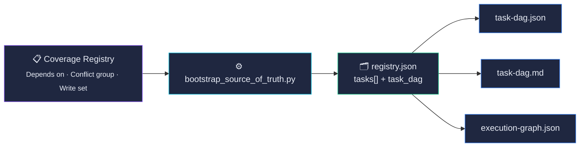
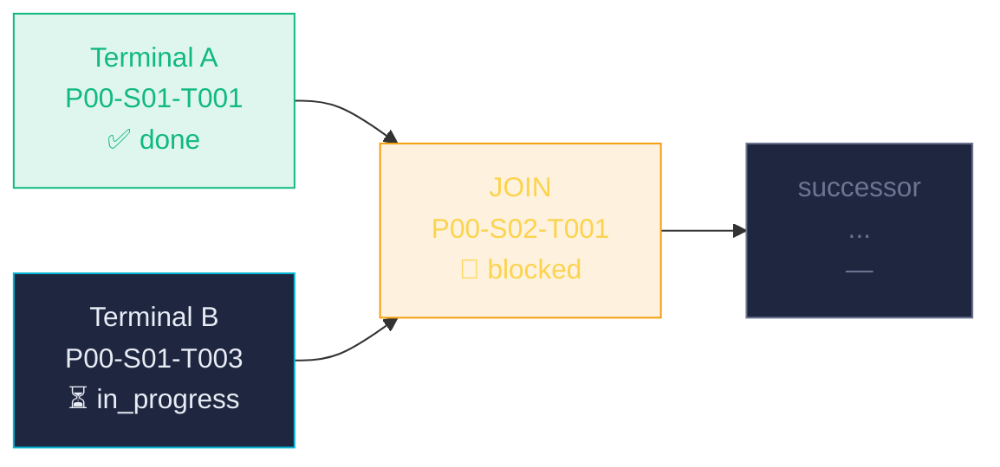
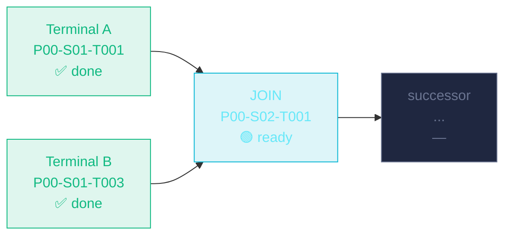
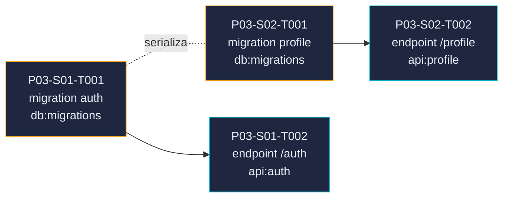
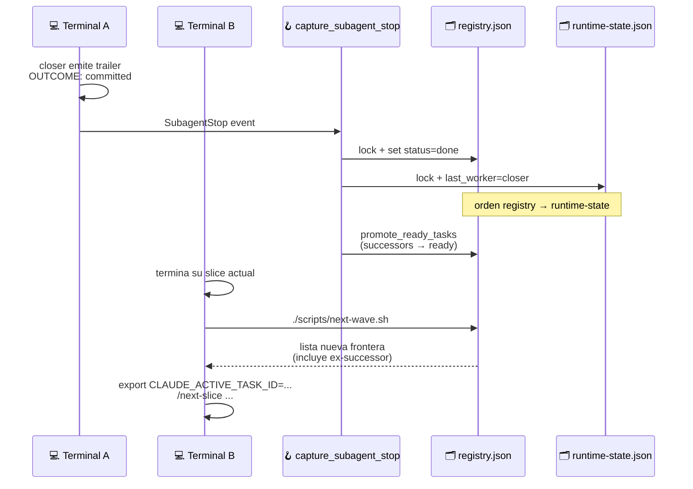
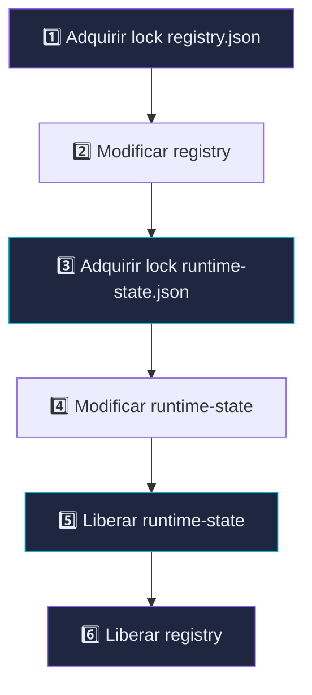
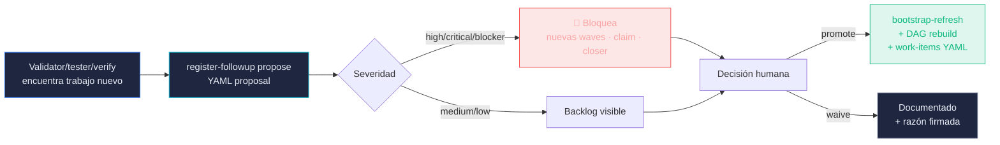

# 🔀 Flujo DAG — AnyStack

### Cómo se desbloquean nodos, qué serializa el scheduler, cómo cooperan terminales paralelos.

---

## 1. El DAG se deriva, no se escribe a mano

> [!IMPORTANT]
> La **única fuente editable** es la columna `Depends on` del Coverage Registry en `*_IMPLEMENTATION_CHECKLIST.md`. Editar a mano `task-dag.json` o `registry.json` está bloqueado por el hook `write_scope_guard`. Para cambiar ordenación o paralelismo: edita `Depends on` / `Conflict group` / `Write set` y rerun `bootstrap_source_of_truth.py --refresh` + `scripts/check-task-dag.sh --strict`.

---

## 2. Join real con dos roots independientes

Un join solo se desbloquea cuando **todos** sus predecessors están `done`.

> [!WARNING]
> Mientras `Terminal B` no cierre `P00-S01-T003`, **`/next-wave` no puede proponer `P00-S02-T001` aunque `Terminal A` ya esté libre**. `claim_task.py` deniega el claim si las deps no están `done` o si hay conflicto activo por `Conflict group` / `Write set`.

Cuando `Terminal B` cierra:

---

## 3. Conflict groups y Write sets — serialización segura

Dos slices **independientes en el grafo** (no comparten `depends_on`) pueden serializarse igualmente si pisan el mismo recurso.

> [!TIP]
> M1 y M2 no dependen una de otra, pero ambas declaran `Conflict group: db:migrations`. `/next-wave` propondrá una sola en cada wave para evitar conflictos en `alembic/versions/` (o el equivalente del stack declarado en `STACK_PROFILE.yaml`).

### Recursos típicos serializados (varían por stack)

| Recurso | Conflict group | Write set típico |
|---|---|---|
| Migraciones DB | `db:migrations` | `api/alembic/versions/**` (o equivalente del stack) |
| Router frontend | `front:router` | `<frontend_router_path>`, `src/router/**` |
| API client global | `front:api-client` | `<frontend_api_client_glob>`, `src/api/**` |
| Theme / design tokens | `front:theme` | rutas declaradas en `STACK_PROFILE.frontend.theme_root` |
| Auth backend | `api:auth` | `<backend_auth_glob>` |
| Workflow CI | `ci` | `.github/workflows/**` |
| Dependencias | `deps` | `<dependency_manifest>`, `<lockfile>` |

---

## 4. Coordinación entre terminales — sin push notifications

> [!NOTE]
> **No hay notificación viva entre terminales.** `Terminal B` no se interrumpe cuando `Terminal A` cierra; debe **volver a invocar `/next-wave`** para ver la nueva frontera del DAG. Cada terminal lleva su propio `CLAUDE_ACTIVE_TASK_ID` en el entorno y los hooks scopean automáticamente ledger / spawn budget / handoffs a ese ID.

---

## 5. Lock order — siempre registry primero

> [!CAUTION]
> El orden global del proyecto es **registry → runtime-state**. Invertirlo abre una ventana de deadlock cuando dos hooks cierran en paralelo (validator + tester finalizando a la vez). `claim_task.py` y `hook_capture_subagent_stop.py` mantienen el mismo orden de adquisición. En Windows, `fcntl.flock` se convierte en no-op — el framework está diseñado para POSIX.

---

## 6. Reglas duras del scheduler

| Regla | Garantizada por |
|---|---|
| Un nodo solo pasa a `ready` si **todas** sus deps están `done` | `promote_ready_tasks` en `common.py` |
| `claim_task.py` deniega claim si hay conflicto activo | Lock POSIX + chequeo de `Conflict group` / `Write set` |
| Joins esperan a **todos** sus predecessors, no a uno solo | Algoritmo de promoción topológica |
| Follow-ups bloqueantes (`high\|critical\|blocker`) bloquean nuevas waves | `register_followup_task.py` + hook |
| `phase-gate` bloquea si quedan tasks sin `done`, journeys sin verificar o evidence ausente | `phase-gate.sh` + `check_phase_gate.py` |
| El closer no puede marcar `done` sin commit + push + cleanup | `enforce_closer_done_guardrail` en hook |
| `pending_journey_verifications` se evalúa por frontera | DAG-only difiere solo tasks con `Journey refs` pendientes |

---

## 7. Follow-ups formales — no hay notas sueltas

Cuando validator/tester/verify descubren trabajo fuera del scope del `TASK_ID` actual, no se queda en el handoff como prosa: se convierte en propuesta YAML que regenera el DAG.

> [!NOTE]
> `promote` apendiza una fila al `Runtime Follow-up Coverage Registry` del checklist, actualiza `registry.json`, regenera la adyacencia DAG, escribe `work-items/<TASK_ID>.yaml`, y actualiza `runtime-state` + `ledger` bajo locks. Las propuestas `high|critical|blocker` bloquean `/next-wave`, `claim_task.py` y closer `done` hasta que estén promotadas o waiveadas con firma humana explícita.

---

🔀 DAG · 🪝 Hooks · 🔒 Locks POSIX ·
<a href="../../README.md">← README</a> ·
<a href="arquitectura.md">Arquitectura →</a> ·
<a href="comandos.md">Comandos →</a> ·
<a href="outcomes.md">Outcomes →</a>

