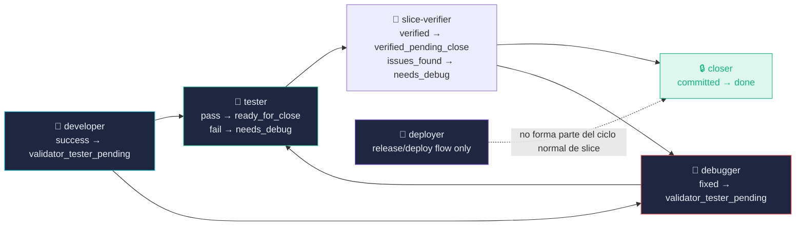
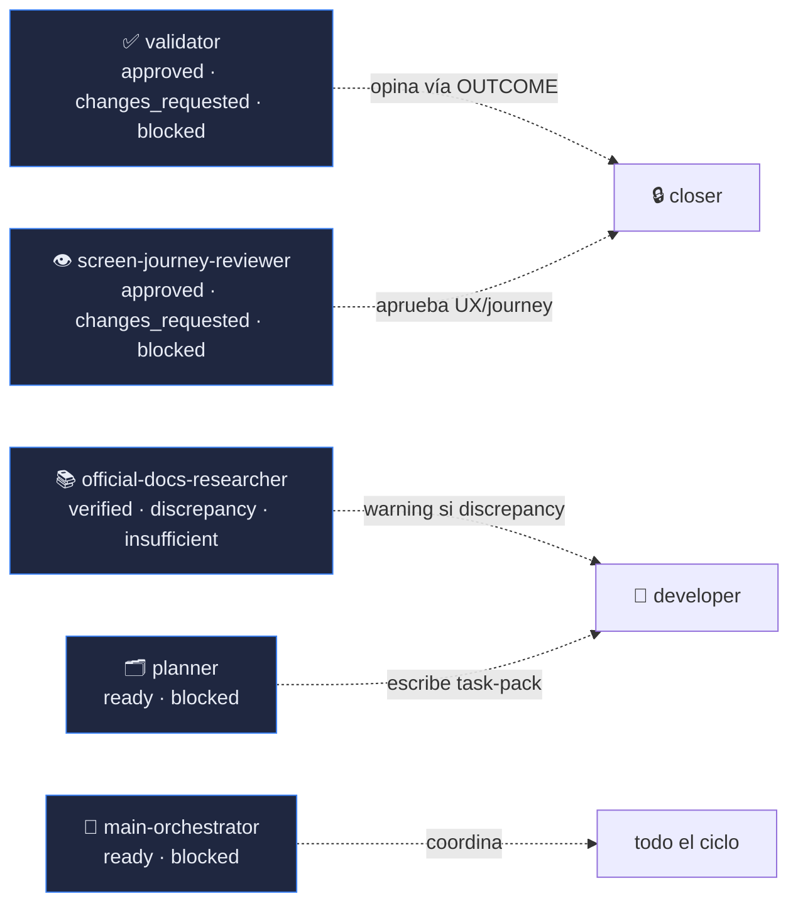
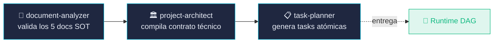
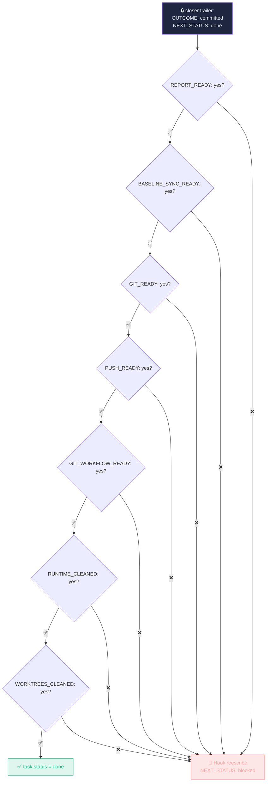
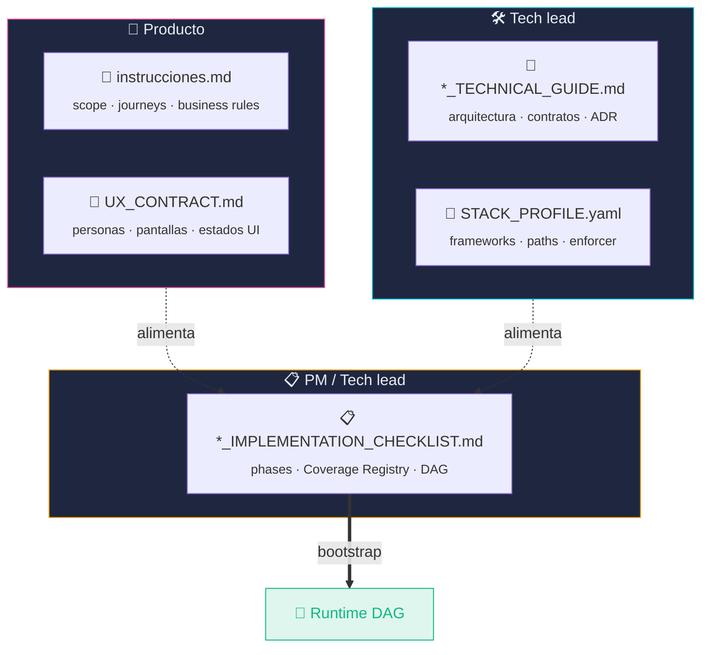
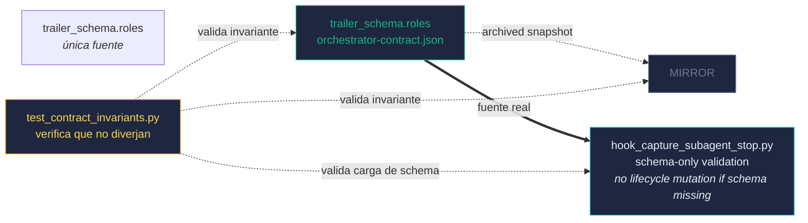

# 🎯 Outcomes — `trailer_schema.roles`

### Vocabulario único por agente. Fuente: `.claude/orchestrator-contract.json`.

---

> [!IMPORTANT]
> Esta tabla refleja `orchestrator-contract.json → trailer_schema.roles`. El hook `capture_subagent_stop` carga el schema y no muta lifecycle si el contrato falta o el rol no existe. El test `test_contract_invariants.py` verifica que los enums no diverjan.

---

## Tabla maestra

| Agente | OUTCOME | NEXT_STATUS | Lifecycle | Info-only | Cierre task |
|---|---|---|:---:|:---:|:---:|
| 🔒 **closer** | `committed` ✅ · `blocked` 🚫 | `done` ✅ · `blocked` 🚫 | ✅ muta | — | ✅ |
| 🐛 **debugger** | `fixed` ✅ · `blocked` 🚫 · `failed` ❌ | `validator_tester_pending` 🔄 · `blocked` 🚫 | ✅ muta | — | — |
| 🚀 **deployer** | `deployed` ✅ · `planned` 📋 · `blocked` 🚫 · `failed` ❌ | `done` ✅ · `blocked` 🚫 | ✅ muta | — | — |
| 🔧 **developer** | `success` ✅ · `blocked` 🚫 · `failed` ❌ | `validator_tester_pending` 🔄 · `blocked` 🚫 | ✅ muta | — | — |
| 📄 **document-analyzer** | `valid` ✅ · `invalid` 🚫 | — | — | — | — |
| 🎼 **main-orchestrator** | `ready` ✅ · `blocked` 🚫 | — | — | ℹ️ | — |
| 📚 **official-docs-researcher** | `verified` ✅ · `discrepancy` ⚠️ · `insufficient` ➖ | — | — | ℹ️ | — |
| 🗂 **planner** | `ready` ✅ · `blocked` 🚫 | — | — | ℹ️ | — |
| 🏛 **project-architect** | `ready` ✅ · `blocked` 🚫 | — | — | — | — |
| 📋 **task-planner** | `ready` ✅ · `blocked` 🚫 | — | — | — | — |
| 🧪 **tester** | `pass` ✅ · `fail` ❌ · `blocked` 🚫 | `ready_for_close` 🟢 · `needs_debug` ⚠️ · `blocked` 🚫 | ✅ muta | — | — |
| 🧭 **slice-verifier** | `verified` ✅ · `issues_found` ⚠️ · `blocked` 🚫 | `verified_pending_close` 🟢 · `needs_debug` ⚠️ · `blocked` 🚫 | ✅ muta | — | — |
| 👁️ **screen-journey-reviewer** | `approved` ✅ · `changes_requested` ⚠️ · `blocked` 🚫 | — | — | ℹ️ | — |
| ✅ **validator** | `approved` ✅ · `changes_requested` ⚠️ · `blocked` 🚫 | `ready_for_close` 🟢 · `needs_debug` ⚠️ · `blocked` 🚫 | — | ℹ️ | — |

---

## Por categoría

### 🟢 Lifecycle owners — pueden mutar `task.status`

### ℹ️ Info-only — NO mutan `task.status`

> [!NOTE]
> **Validator es info-only** intencionalmente. Su `NEXT_STATUS` se guarda como `task.validator_next_status` (metadata) pero NO sobrescribe `task.status`. Esto resuelve la race condition con `tester` cuando ambos cierran a la vez en el par paralelo. El **closer** lee el `OUTCOME` del validator desde el handoff y rechaza el commit si no es `approved`.
>
> **slice-verifier es lifecycle**: `verified` mueve a `verified_pending_close`; `closer` sigue siendo el único rol que puede marcar `done`.

### 📦 Bootstrap — solo se ejecutan al inicio del proyecto

> [!TIP]
> En AnyStack los 5 documentos SOT son: `instrucciones.md`, `*_TECHNICAL_GUIDE.md`, `*_IMPLEMENTATION_CHECKLIST.md`, `STACK_PROFILE.yaml` y `UX_CONTRACT.md`. Los tres bootstrap agents validan, compilan y atomizan estos cinco documentos antes de que arranque el runtime DAG.

---

## Closer guardrail — el cierre tiene 7 candados

> [!CAUTION]
> El guardrail es **mecánico** (`enforce_closer_done_guardrail` en `hook_capture_subagent_stop.py`). No depende de la disciplina del agente. Si el closer intenta `done` sin las pruebas obligatorias, el hook fuerza `blocked`. Además, el closer rechaza el commit upfront si en el handoff falta `## verify-slice` completo con `VERIFY_OUTCOME: verified` + MCP/datos/evidencia (o `VERIFY_WAIVED: <motivo>`).

---

## 5 documentos SOT — quién edita cada uno

AnyStack añade dos documentos al contrato canónico (vs el contrato histórico de 3 documentos). Cada uno tiene un owner semántico claro:

> [!IMPORTANT]
> El bootstrap **falla** si falta cualquiera de los 5 documentos o si presentan contradicciones (p.ej. una pantalla declarada en UX_CONTRACT que no aparece en el Coverage Registry, o un endpoint del TECHNICAL_GUIDE no referenciado por ninguna task). `document-analyzer` verifica esta consistencia.

---

## Outcomes globales del trailer

Líneas reservadas que el hook reconoce además de `OUTCOME` / `NEXT_STATUS`:

| Línea | Quién la emite | Qué dispara |
|---|---|---|
| `JOURNEY_VERIFIED_INLINE: <JID>` | closer | Marca journey `verified` bajo lock (rama "ahora" §5.bis) |
| `JOURNEY_PENDING_VERIFY: <JID>` | closer | Añade a `pending_journey_verifications` (rama "aparte") |
| `JOURNEY_REVERIFY_RECOMMENDED: <JID>` | closer | Warning, no bloqueante |
| `JOURNEY_VERIFY_OUTCOME: verified\|issues_found` | /verify-journey | Mutar `verification_status` |
| `JOURNEY_VERIFY_WAIVED: <reason>` | /verify-journey | Marca `waived` con razón firmada |
| `REPORT_READY: yes\|no` | closer | Parte del guardrail done |
| `BASELINE_SYNC_READY: yes\|no` | closer | Parte del guardrail done |
| `GIT_READY: yes\|no` | closer | Parte del guardrail done |
| `PUSH_READY: yes\|no` | closer | Parte del guardrail done |
| `GIT_WORKFLOW_READY: yes\|no` | closer | Parte del guardrail done: git-workflow plugin completado |
| `RUNTIME_CLEANED: yes\|no` | closer | Parte del guardrail done: runtime Docker/Rancher y puertos de la slice limpios |
| `WORKTREES_CLEANED: yes\|no` | closer | Parte del guardrail done |

---

## Drift protection

> [!TIP]
> Si añades un outcome a un agente, el flujo correcto es:
> 1. Editar `trailer_schema.roles.<agent>.outcome_values` en el JSON
> 2. Editar el agente `.md` para emitir el nuevo outcome
> 3. Correr `pytest .claude/bin/tests/test_contract_invariants.py`
>
> Si el test pasa, todos los espejos están sincronizados.

---

🎯 Outcomes ·
<a href="../../README.md">← README</a> ·
<a href="dag-flujo.md">DAG flujo →</a> ·
<a href="arquitectura.md">Arquitectura →</a> ·
<a href="comandos.md">Comandos →</a>

