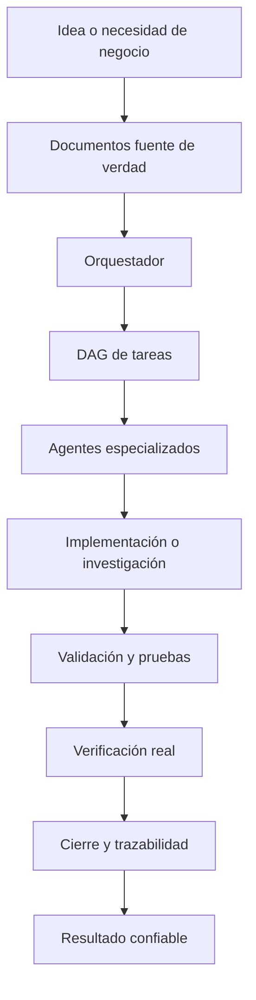
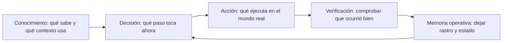
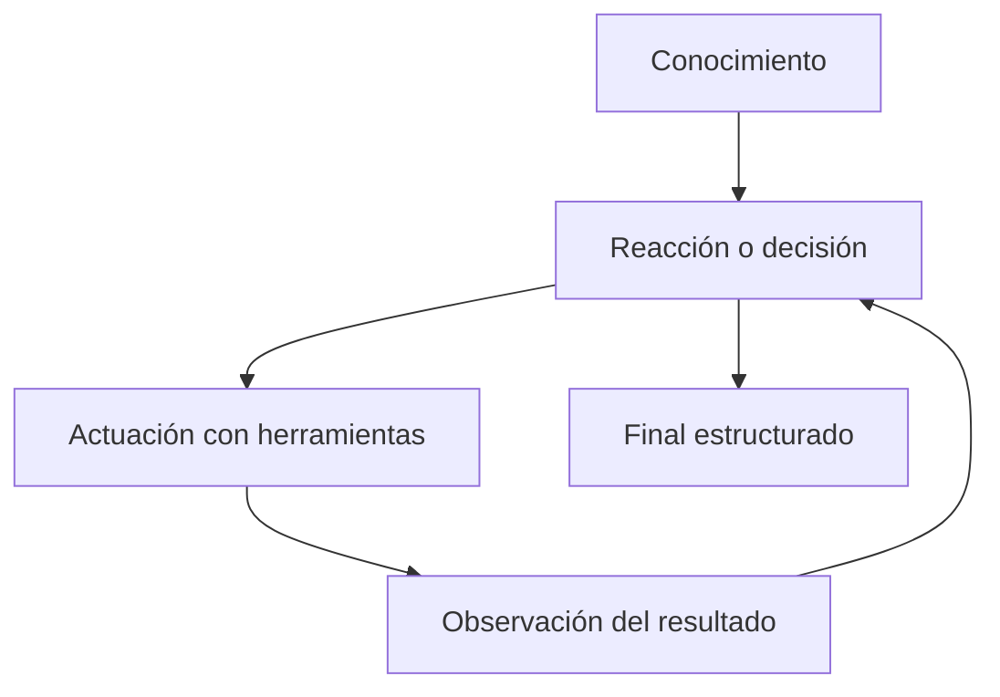
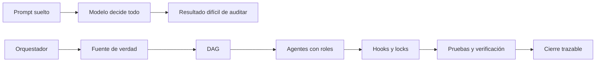
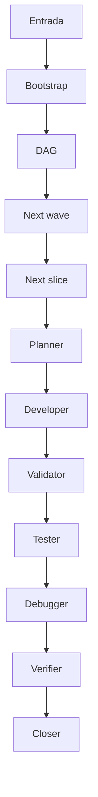
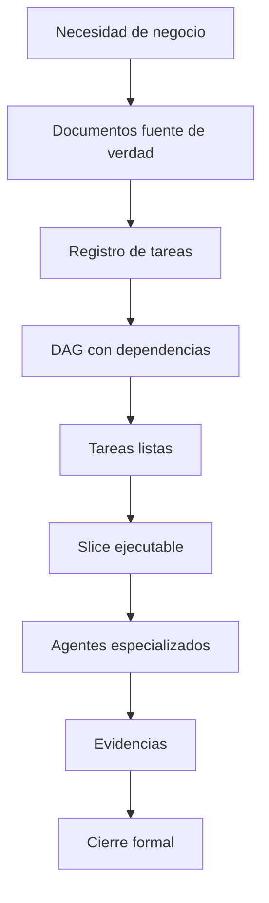
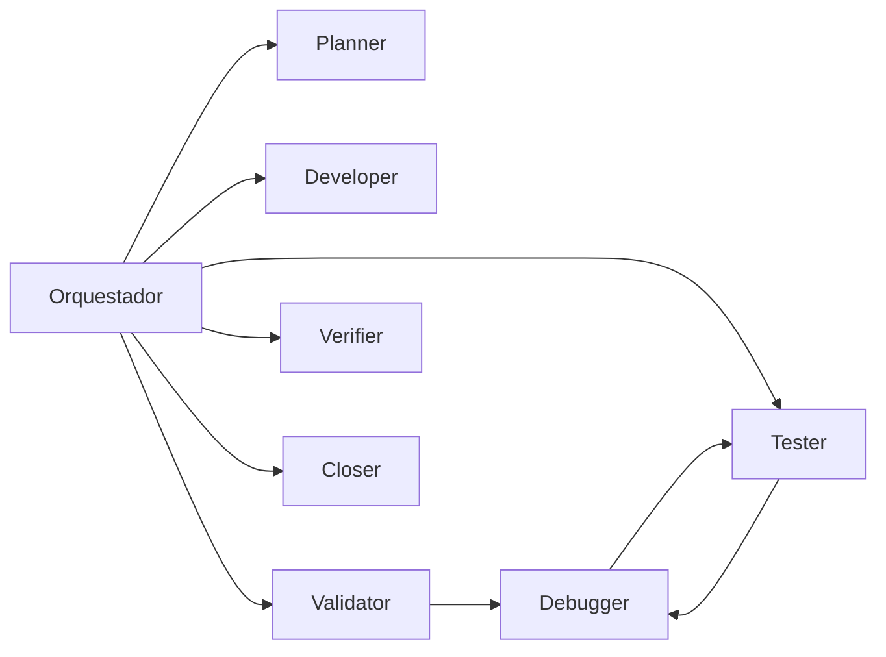
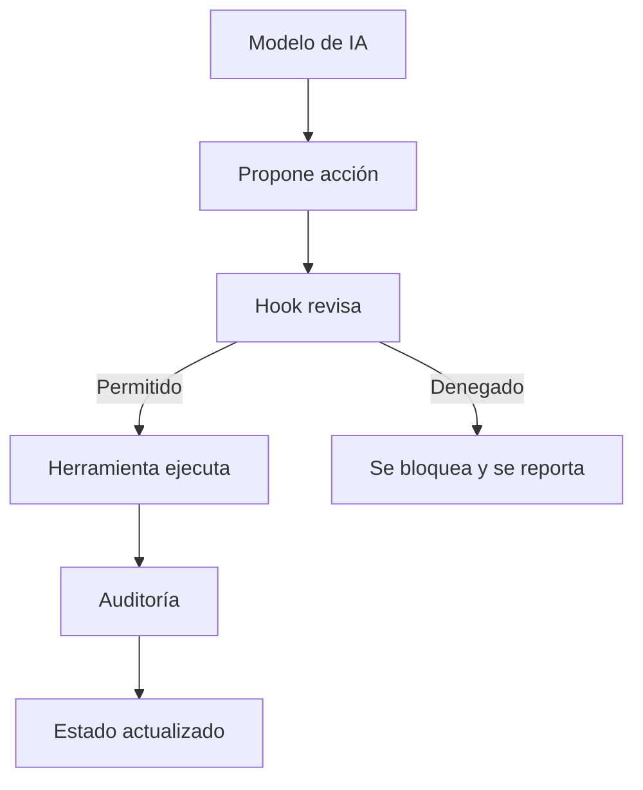
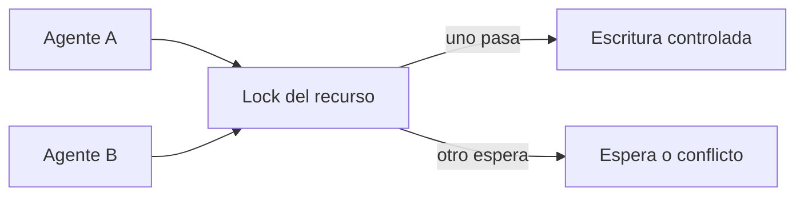
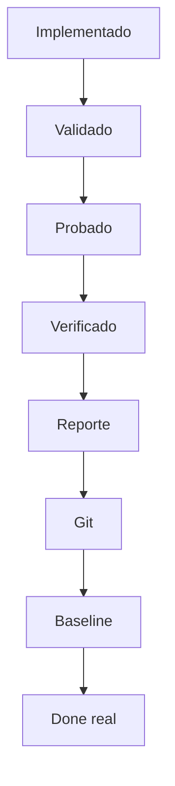

# Preparación para explicar el OrquestadorDAG AnyStack a una persona no técnica

Documento de apoyo para una conversación interna con dirección.
Está escrito para explicar el valor, el motivo, la arquitectura y el funcionamiento sin asumir conocimientos previos de tecnología ni de inteligencia artificial.

Objetivo principal: que la persona entienda que no se ha montado solo un conjunto de prompts, sino una forma gobernada, auditable y reutilizable de convertir trabajo complejo en ejecución controlada.

Resumen de una frase: el orquestador convierte una intención grande en tareas pequeñas, las reparte a agentes especializados, limita lo que cada uno puede tocar, verifica resultados con pruebas reales y deja trazabilidad de todo.

Resumen de negocio: esto permite construir aplicaciones, investigaciones, auditorías, documentación y otros procesos complejos con IA de una forma más repetible, controlada y segura que simplemente pedirle cosas a un chat.

## Cómo usar este documento

- Primero leer el resumen ejecutivo.
- Después revisar el glosario para poder usar palabras técnicas sin miedo.
- Luego usar la narrativa de negocio para explicar por qué se hizo.
- Después enseñar los diagramas Mermaid si se quiere visualizar el flujo.
- Finalmente tener preparada la sección de preguntas difíciles.

## Lo que conviene decir al principio

No he creado solamente un proyecto de programación.
He creado un sistema de coordinación para que la IA trabaje de forma ordenada, con reglas, controles, verificaciones y memoria operativa.
La idea no es confiar ciegamente en una respuesta generada, sino convertir la capacidad probabilística del modelo en un proceso lo más determinista posible.

Cuando una persona usa un agente de programación de forma directa, normalmente le da una instrucción y espera que el modelo haga lo correcto.
Eso funciona en tareas pequeñas, pero en trabajos grandes aparecen problemas: se olvida de detalles, mezcla responsabilidades, toca archivos que no debe, no verifica todo, deja cosas a medias o no deja un rastro claro de por qué hizo cada cambio.

El orquestador resuelve esto separando el trabajo en fases.
Primero entiende la fuente de verdad.
Después crea un mapa de tareas.
Luego ejecuta cada tarea con agentes especializados.
Después valida, prueba, verifica y cierra.
Es parecido a pasar de “un becario muy listo con libertad total” a “un equipo coordinado con jefe de proyecto, checklist, QA, auditoría y cierre formal”.

## Idea central para alguien de negocio

- La IA por sí sola genera respuestas probables.
- Un proceso de empresa necesita resultados controlados.
- El orquestador es la capa que convierte una respuesta probable en un flujo de trabajo verificable.
- No elimina el riesgo al cien por cien, pero lo reduce separando roles, permisos, pasos, validaciones y cierre.
- Sirve para software, investigación, análisis documental, auditorías, generación de papers, revisión de procesos y cualquier trabajo complejo que se pueda dividir en tareas controladas.

## Mapa mental de alto nivel

## Mapa mental con la frase conocimiento, decisión y acción

## Resumen ejecutivo para dirección

### Qué es
Un orquestador es un sistema que coordina agentes de IA como si fueran un equipo de trabajo con roles, tareas, permisos y controles.

### Por qué importa
Porque una IA potente sin coordinación puede producir resultados rápidos pero difíciles de auditar, repetir o cerrar correctamente.

### Qué problema resuelve
Evita que el trabajo complejo dependa de un único prompt largo y frágil.

### Qué valor aporta
Permite transformar una idea grande en tareas pequeñas, controladas y verificables.

### Por qué es reusable
El mismo patrón sirve para crear aplicaciones, estudiar documentación, preparar investigaciones, generar informes, revisar código o producir entregables complejos.

### Qué lo hace distinto
Tiene fuente de verdad, DAG de tareas, agentes especializados, hooks, skills, locks, verificación real, cierre y trazabilidad.

### Qué no es
No es solo una conversación con Claude ni una colección de prompts.

### Qué sí es
Es una metodología técnica convertida en un framework operativo.

## Fuentes conceptuales usadas

El documento se apoya en la documentación interna de GenAI / AI Engineering, que insiste en separar conocimiento, decisión y acción, y en tratar una aplicación GenAI como un sistema con estado, permisos, memoria, observabilidad, evaluación e idempotencia.
También se apoya en documentación oficial de Claude Code, Claude Agent SDK, LangChain, LangGraph, Deep Agents, LlamaIndex, MCP y FastMCP.

- PDF interno GenAI / AI Engineering actualizado multiagentes: documentacion_departamental_genai_ai_engineering_actualizada_multiagentes.pdf
- Claude Code - subagentes personalizados: https://code.claude.com/docs/en/sub-agents
- Claude Agent SDK - subagentes: https://code.claude.com/docs/en/agent-sdk/subagents
- Claude Code - hooks: https://code.claude.com/docs/en/hooks
- Claude Code - skills: https://code.claude.com/docs/en/skills
- Claude Code - memoria CLAUDE.md: https://code.claude.com/docs/en/memory
- Claude Code - permisos: https://code.claude.com/docs/en/permissions
- LangChain - agentes: https://docs.langchain.com/oss/python/langchain/agents
- LangChain - subagentes multiagente: https://docs.langchain.com/oss/python/langchain/multi-agent/subagents
- LangChain - context engineering: https://docs.langchain.com/oss/python/langchain/context-engineering
- LangGraph - overview: https://docs.langchain.com/oss/python/langgraph/overview
- LangGraph - graph API: https://docs.langchain.com/oss/python/langgraph/graph-api
- Deep Agents - overview: https://docs.langchain.com/oss/python/deepagents/overview
- LlamaIndex Workflows: https://developers.llamaindex.ai/typescript/framework/tutorials/workflows/
- FastMCP: https://fastmcp.wiki/en/getting-started/welcome
- Model Context Protocol: https://modelcontextprotocol.io/

## El problema de fondo

- Los modelos de IA generan texto y decisiones probables a partir de contexto.
- Eso no significa que sepan siempre la verdad.
- Tampoco significa que recuerden todo.
- Tampoco significa que ejecuten siempre en el orden correcto.
- Tampoco significa que respeten permisos si solo se lo pedimos con una frase.
- Para convertirlos en un sistema útil de empresa hay que envolverlos con proceso.
- Ese proceso debe decidir qué se puede hacer, cuándo, con qué datos, con qué permisos y cómo se verifica.

## La intuición que hay detrás del orquestador

- Una sola IA puede ser muy buena, pero no deja de ser una sola conversación.
- Un proyecto real necesita planificación, ejecución, revisión, pruebas, cierre y trazabilidad.
- Si dividimos el trabajo en tareas pequeñas y damos a cada tarea un responsable especializado, el sistema se vuelve más robusto.
- El orquestador es la pieza que coordina ese equipo artificial.
- Su trabajo no es programar todo directamente.
- Su trabajo es gobernar el proceso para que cada agente haga lo que toca y no lo que se le ocurra.

## Por qué no basta con tirar prompts

- Un prompt largo puede explicar mucho, pero no garantiza ejecución ordenada.
- El modelo puede olvidar instrucciones antiguas cuando el contexto crece.
- El modelo puede dar por hecho que algo está probado cuando solo lo ha razonado.
- El modelo puede tocar demasiado alcance si no hay límites externos.
- El modelo puede mezclar investigación, implementación y cierre en una misma respuesta.
- El orquestador separa esas funciones en piezas con contrato.

## Qué significa pasar de probabilístico a determinista

- Probabilístico significa que el modelo elige una respuesta plausible.
- Determinista significa que una regla, script o validación produce el mismo resultado esperado ante la misma condición.
- El orquestador no convierte al modelo en una máquina perfecta.
- Lo que hace es rodear al modelo de pasos deterministas.
- Ejemplo: el agente puede proponer un cambio, pero un hook puede bloquear escrituras fuera de alcance.
- Ejemplo: el agente puede decir que terminó, pero el closer no marca terminado si falta verificación.
- Ejemplo: el agente puede investigar, pero debe dejar un handoff estructurado.

## Por qué sirve para más que software

- Cualquier trabajo complejo tiene fuentes de verdad, subtareas, dependencias, validación y cierre.
- Crear una aplicación es solo un caso de uso.
- Hacer un estudio de investigación también puede dividirse en búsqueda, lectura, extracción, contraste, síntesis, revisión y publicación.
- Preparar un paper puede tener agentes de literatura, metodología, redacción, verificación de citas y revisión crítica.
- Auditar un proceso puede tener agentes de normativa, datos, riesgos, evidencias y conclusiones.
- Por eso la idea fuerte no es el código, sino la orquestación.

## Cómo funciona un agente explicado sin tecnicismos

- Un agente es una IA con un objetivo y con herramientas.
- Primero recibe conocimiento: instrucciones, contexto, documentos, memoria y estado actual.
- Después reacciona: decide cuál es el siguiente paso razonable.
- Después actúa: lee archivos, llama una herramienta, ejecuta una prueba o devuelve una respuesta.
- Después observa el resultado de su acción.
- Con esa observación decide si debe continuar, corregir o terminar.
- Ese ciclo se repite hasta completar la tarea o hasta que una regla lo detiene.

## Glosario para alguien que no sabe tecnología

La regla del glosario es simple: cada palabra se explica con una definición, una analogía y su uso dentro del orquestador.

### IA
- Definición sencilla: Sistema capaz de producir respuestas, decisiones o acciones a partir de datos y reglas aprendidas.
- Analogía: Un ayudante que puede razonar, pero que necesita contexto y control.
- En este proyecto: El orquestador usa IA para decidir y ejecutar subtareas, pero no deja todo en manos de la IA.
- Por qué importa: ayuda a convertir trabajo ambiguo en pasos claros.
- Qué riesgo evita: reduce improvisación, olvido, mezcla de responsabilidades o falta de trazabilidad.
- Cómo decirlo en reunión: “IA es una pieza del sistema que permite trabajar con IA de forma más ordenada y controlada”.

### GenAI
- Definición sencilla: Inteligencia artificial generativa: crea texto, código, imágenes o planes.
- Analogía: Una máquina que redacta borradores útiles.
- En este proyecto: El proyecto usa GenAI para generar soluciones, no solo para responder preguntas.
- Por qué importa: ayuda a convertir trabajo ambiguo en pasos claros.
- Qué riesgo evita: reduce improvisación, olvido, mezcla de responsabilidades o falta de trazabilidad.
- Cómo decirlo en reunión: “GenAI es una pieza del sistema que permite trabajar con IA de forma más ordenada y controlada”.

### LLM
- Definición sencilla: Modelo de lenguaje grande que predice texto probable a partir de contexto.
- Analogía: Un escritor muy preparado que completa lo que viene después.
- En este proyecto: Claude es el LLM principal usado por el sistema.
- Por qué importa: ayuda a convertir trabajo ambiguo en pasos claros.
- Qué riesgo evita: reduce improvisación, olvido, mezcla de responsabilidades o falta de trazabilidad.
- Cómo decirlo en reunión: “LLM es una pieza del sistema que permite trabajar con IA de forma más ordenada y controlada”.

### Modelo
- Definición sencilla: El motor de IA que genera respuestas y decide posibles acciones.
- Analogía: El cerebro matemático.
- En este proyecto: El orquestador usa modelos distintos según el tipo de tarea.
- Por qué importa: ayuda a convertir trabajo ambiguo en pasos claros.
- Qué riesgo evita: reduce improvisación, olvido, mezcla de responsabilidades o falta de trazabilidad.
- Cómo decirlo en reunión: “Modelo es una pieza del sistema que permite trabajar con IA de forma más ordenada y controlada”.

### Prompt
- Definición sencilla: Instrucción que se da al modelo para guiar su respuesta.
- Analogía: Una orden escrita con contexto.
- En este proyecto: El orquestador evita depender de un único prompt enorme.
- Por qué importa: ayuda a convertir trabajo ambiguo en pasos claros.
- Qué riesgo evita: reduce improvisación, olvido, mezcla de responsabilidades o falta de trazabilidad.
- Cómo decirlo en reunión: “Prompt es una pieza del sistema que permite trabajar con IA de forma más ordenada y controlada”.

### Contexto
- Definición sencilla: Información que el modelo tiene delante en ese momento.
- Analogía: La mesa de trabajo visible para la IA.
- En este proyecto: El sistema controla qué entra en contexto para no saturarlo.
- Por qué importa: ayuda a convertir trabajo ambiguo en pasos claros.
- Qué riesgo evita: reduce improvisación, olvido, mezcla de responsabilidades o falta de trazabilidad.
- Cómo decirlo en reunión: “Contexto es una pieza del sistema que permite trabajar con IA de forma más ordenada y controlada”.

### Token
- Definición sencilla: Unidad pequeña de texto que el modelo procesa.
- Analogía: Como piezas de una frase.
- En este proyecto: Más tokens suelen implicar más coste y más riesgo de ruido.
- Por qué importa: ayuda a convertir trabajo ambiguo en pasos claros.
- Qué riesgo evita: reduce improvisación, olvido, mezcla de responsabilidades o falta de trazabilidad.
- Cómo decirlo en reunión: “Token es una pieza del sistema que permite trabajar con IA de forma más ordenada y controlada”.

### Agente
- Definición sencilla: IA con objetivo, instrucciones y herramientas para actuar en varios pasos.
- Analogía: Un trabajador digital con una misión.
- En este proyecto: Developer, tester o validator son agentes especializados.
- Por qué importa: ayuda a convertir trabajo ambiguo en pasos claros.
- Qué riesgo evita: reduce improvisación, olvido, mezcla de responsabilidades o falta de trazabilidad.
- Cómo decirlo en reunión: “Agente es una pieza del sistema que permite trabajar con IA de forma más ordenada y controlada”.

### Main orchestrator
- Definición sencilla: Agente principal que coordina el sistema.
- Analogía: El jefe de proyecto.
- En este proyecto: Decide qué tarea se toma y qué agentes participan.
- Por qué importa: ayuda a convertir trabajo ambiguo en pasos claros.
- Qué riesgo evita: reduce improvisación, olvido, mezcla de responsabilidades o falta de trazabilidad.
- Cómo decirlo en reunión: “Main orchestrator es una pieza del sistema que permite trabajar con IA de forma más ordenada y controlada”.

### Subagente
- Definición sencilla: Agente especializado que trabaja en una parte concreta.
- Analogía: Un especialista del equipo.
- En este proyecto: El tester prueba; el validator revisa; el debugger corrige.
- Por qué importa: ayuda a convertir trabajo ambiguo en pasos claros.
- Qué riesgo evita: reduce improvisación, olvido, mezcla de responsabilidades o falta de trazabilidad.
- Cómo decirlo en reunión: “Subagente es una pieza del sistema que permite trabajar con IA de forma más ordenada y controlada”.

### Orquestador
- Definición sencilla: Sistema que coordina tareas, agentes, permisos, validaciones y cierre.
- Analogía: Un director de orquesta.
- En este proyecto: Evita que cada agente vaya por libre.
- Por qué importa: ayuda a convertir trabajo ambiguo en pasos claros.
- Qué riesgo evita: reduce improvisación, olvido, mezcla de responsabilidades o falta de trazabilidad.
- Cómo decirlo en reunión: “Orquestador es una pieza del sistema que permite trabajar con IA de forma más ordenada y controlada”.

### Hook
- Definición sencilla: Punto automático de control que se ejecuta cuando pasa algo.
- Analogía: Un control de seguridad en una puerta.
- En este proyecto: Puede bloquear una escritura o inyectar contexto al subagente.
- Por qué importa: ayuda a convertir trabajo ambiguo en pasos claros.
- Qué riesgo evita: reduce improvisación, olvido, mezcla de responsabilidades o falta de trazabilidad.
- Cómo decirlo en reunión: “Hook es una pieza del sistema que permite trabajar con IA de forma más ordenada y controlada”.

### Skill
- Definición sencilla: Procedimiento reutilizable que Claude puede cargar cuando lo necesita.
- Analogía: Una receta de trabajo.
- En este proyecto: Hay skills para bootstrap, cierre, verificación y ejecución.
- Por qué importa: ayuda a convertir trabajo ambiguo en pasos claros.
- Qué riesgo evita: reduce improvisación, olvido, mezcla de responsabilidades o falta de trazabilidad.
- Cómo decirlo en reunión: “Skill es una pieza del sistema que permite trabajar con IA de forma más ordenada y controlada”.

### YAML
- Definición sencilla: Formato de texto para configuración legible por humanos.
- Analogía: Una ficha ordenada con campos.
- En este proyecto: Se usa en perfiles y en frontmatter de agentes/skills.
- Por qué importa: ayuda a convertir trabajo ambiguo en pasos claros.
- Qué riesgo evita: reduce improvisación, olvido, mezcla de responsabilidades o falta de trazabilidad.
- Cómo decirlo en reunión: “YAML es una pieza del sistema que permite trabajar con IA de forma más ordenada y controlada”.

### JSON
- Definición sencilla: Formato estructurado para datos que leen scripts y sistemas.
- Analogía: Una tabla con llaves y valores.
- En este proyecto: registry.json contiene el estado de tareas.
- Por qué importa: ayuda a convertir trabajo ambiguo en pasos claros.
- Qué riesgo evita: reduce improvisación, olvido, mezcla de responsabilidades o falta de trazabilidad.
- Cómo decirlo en reunión: “JSON es una pieza del sistema que permite trabajar con IA de forma más ordenada y controlada”.

### Memoria
- Definición sencilla: Información guardada para usarla más adelante.
- Analogía: Notas de trabajo.
- En este proyecto: El sistema tiene memoria runtime y memoria de agentes.
- Por qué importa: ayuda a convertir trabajo ambiguo en pasos claros.
- Qué riesgo evita: reduce improvisación, olvido, mezcla de responsabilidades o falta de trazabilidad.
- Cómo decirlo en reunión: “Memoria es una pieza del sistema que permite trabajar con IA de forma más ordenada y controlada”.

### Estado
- Definición sencilla: Situación actual de una tarea o del sistema.
- Analogía: El tablero donde se ve qué está pendiente y qué está terminado.
- En este proyecto: orchestrator-state guarda estado vivo.
- Por qué importa: ayuda a convertir trabajo ambiguo en pasos claros.
- Qué riesgo evita: reduce improvisación, olvido, mezcla de responsabilidades o falta de trazabilidad.
- Cómo decirlo en reunión: “Estado es una pieza del sistema que permite trabajar con IA de forma más ordenada y controlada”.

### DAG
- Definición sencilla: Grafo de tareas sin ciclos; permite saber qué depende de qué.
- Analogía: Una ruta de trabajo donde no puedes pintar paredes antes de levantar muros.
- En este proyecto: El proyecto genera tareas con dependencias explícitas.
- Por qué importa: ayuda a convertir trabajo ambiguo en pasos claros.
- Qué riesgo evita: reduce improvisación, olvido, mezcla de responsabilidades o falta de trazabilidad.
- Cómo decirlo en reunión: “DAG es una pieza del sistema que permite trabajar con IA de forma más ordenada y controlada”.

### Nodo
- Definición sencilla: Una tarea dentro del DAG.
- Analogía: Una ficha del tablero.
- En este proyecto: Cada TASK_ID es un nodo operativo.
- Por qué importa: ayuda a convertir trabajo ambiguo en pasos claros.
- Qué riesgo evita: reduce improvisación, olvido, mezcla de responsabilidades o falta de trazabilidad.
- Cómo decirlo en reunión: “Nodo es una pieza del sistema que permite trabajar con IA de forma más ordenada y controlada”.

### Arista
- Definición sencilla: Relación de dependencia entre dos tareas.
- Analogía: Una flecha que dice “esto va antes que aquello”.
- En este proyecto: Impide ejecutar tareas en orden incorrecto.
- Por qué importa: ayuda a convertir trabajo ambiguo en pasos claros.
- Qué riesgo evita: reduce improvisación, olvido, mezcla de responsabilidades o falta de trazabilidad.
- Cómo decirlo en reunión: “Arista es una pieza del sistema que permite trabajar con IA de forma más ordenada y controlada”.

### Dependencia
- Definición sencilla: Condición que debe cumplirse antes de empezar otra tarea.
- Analogía: Una puerta que no se abre hasta tener la llave.
- En este proyecto: Si una API depende de la base de datos, la base debe ir antes.
- Por qué importa: ayuda a convertir trabajo ambiguo en pasos claros.
- Qué riesgo evita: reduce improvisación, olvido, mezcla de responsabilidades o falta de trazabilidad.
- Cómo decirlo en reunión: “Dependencia es una pieza del sistema que permite trabajar con IA de forma más ordenada y controlada”.

### Task
- Definición sencilla: Tarea concreta que el orquestador puede ejecutar.
- Analogía: Un paquete de trabajo.
- En este proyecto: El sistema reclama y ejecuta una task cada vez.
- Por qué importa: ayuda a convertir trabajo ambiguo en pasos claros.
- Qué riesgo evita: reduce improvisación, olvido, mezcla de responsabilidades o falta de trazabilidad.
- Cómo decirlo en reunión: “Task es una pieza del sistema que permite trabajar con IA de forma más ordenada y controlada”.

### Slice
- Definición sencilla: Porción vertical y comprobable del producto.
- Analogía: Una rebanada completa de funcionalidad.
- En este proyecto: Una slice debe poder verificarse de extremo a extremo.
- Por qué importa: ayuda a convertir trabajo ambiguo en pasos claros.
- Qué riesgo evita: reduce improvisación, olvido, mezcla de responsabilidades o falta de trazabilidad.
- Cómo decirlo en reunión: “Slice es una pieza del sistema que permite trabajar con IA de forma más ordenada y controlada”.

### Wave
- Definición sencilla: Conjunto de tareas que pueden avanzar en paralelo.
- Analogía: Una tanda de trabajo.
- En este proyecto: /next-wave muestra qué se puede ejecutar sin pisarse.
- Por qué importa: ayuda a convertir trabajo ambiguo en pasos claros.
- Qué riesgo evita: reduce improvisación, olvido, mezcla de responsabilidades o falta de trazabilidad.
- Cómo decirlo en reunión: “Wave es una pieza del sistema que permite trabajar con IA de forma más ordenada y controlada”.

### Lock
- Definición sencilla: Bloqueo temporal para que dos agentes no escriban lo mismo a la vez.
- Analogía: Reservar una sala para que no entren dos equipos al mismo tiempo.
- En este proyecto: Evita conflictos de concurrencia.
- Por qué importa: ayuda a convertir trabajo ambiguo en pasos claros.
- Qué riesgo evita: reduce improvisación, olvido, mezcla de responsabilidades o falta de trazabilidad.
- Cómo decirlo en reunión: “Lock es una pieza del sistema que permite trabajar con IA de forma más ordenada y controlada”.

### Write set
- Definición sencilla: Lista de archivos o recursos que una tarea puede modificar.
- Analogía: La zona de obra autorizada.
- En este proyecto: Si el agente intenta escribir fuera, el sistema puede bloquearlo.
- Por qué importa: ayuda a convertir trabajo ambiguo en pasos claros.
- Qué riesgo evita: reduce improvisación, olvido, mezcla de responsabilidades o falta de trazabilidad.
- Cómo decirlo en reunión: “Write set es una pieza del sistema que permite trabajar con IA de forma más ordenada y controlada”.

### Conflict group
- Definición sencilla: Grupo de tareas que no conviene ejecutar a la vez.
- Analogía: Dos obras en el mismo pasillo.
- En este proyecto: Evita que varias slices se pisen.
- Por qué importa: ayuda a convertir trabajo ambiguo en pasos claros.
- Qué riesgo evita: reduce improvisación, olvido, mezcla de responsabilidades o falta de trazabilidad.
- Cómo decirlo en reunión: “Conflict group es una pieza del sistema que permite trabajar con IA de forma más ordenada y controlada”.

### Worktree
- Definición sencilla: Copia de trabajo aislada para una tarea.
- Analogía: Una mesa separada para cada equipo.
- En este proyecto: Permite trabajar varias tareas sin mezclar cambios.
- Por qué importa: ayuda a convertir trabajo ambiguo en pasos claros.
- Qué riesgo evita: reduce improvisación, olvido, mezcla de responsabilidades o falta de trazabilidad.
- Cómo decirlo en reunión: “Worktree es una pieza del sistema que permite trabajar con IA de forma más ordenada y controlada”.

### Registry
- Definición sencilla: Registro central de tareas, estados y dependencias.
- Analogía: El libro maestro del proyecto.
- En este proyecto: registry.json es el tablero operativo generado.
- Por qué importa: ayuda a convertir trabajo ambiguo en pasos claros.
- Qué riesgo evita: reduce improvisación, olvido, mezcla de responsabilidades o falta de trazabilidad.
- Cómo decirlo en reunión: “Registry es una pieza del sistema que permite trabajar con IA de forma más ordenada y controlada”.

### Source of truth
- Definición sencilla: Documentos que mandan sobre lo que se debe construir.
- Analogía: El contrato oficial del proyecto.
- En este proyecto: El bootstrap crea tareas desde estos documentos.
- Por qué importa: ayuda a convertir trabajo ambiguo en pasos claros.
- Qué riesgo evita: reduce improvisación, olvido, mezcla de responsabilidades o falta de trazabilidad.
- Cómo decirlo en reunión: “Source of truth es una pieza del sistema que permite trabajar con IA de forma más ordenada y controlada”.

### Bootstrap
- Definición sencilla: Proceso inicial que lee documentos y prepara el sistema.
- Analogía: Montar el tablero antes de empezar la obra.
- En este proyecto: Genera registry, work-items y task packs.
- Por qué importa: ayuda a convertir trabajo ambiguo en pasos claros.
- Qué riesgo evita: reduce improvisación, olvido, mezcla de responsabilidades o falta de trazabilidad.
- Cómo decirlo en reunión: “Bootstrap es una pieza del sistema que permite trabajar con IA de forma más ordenada y controlada”.

### Task pack
- Definición sencilla: Paquete de contexto para que una tarea se ejecute bien.
- Analogía: La carpeta de obra de una tarea.
- En este proyecto: Incluye alcance, dependencias, rutas, pruebas y reglas.
- Por qué importa: ayuda a convertir trabajo ambiguo en pasos claros.
- Qué riesgo evita: reduce improvisación, olvido, mezcla de responsabilidades o falta de trazabilidad.
- Cómo decirlo en reunión: “Task pack es una pieza del sistema que permite trabajar con IA de forma más ordenada y controlada”.

### Handoff
- Definición sencilla: Entrega estructurada de un agente a otro.
- Analogía: Un relevo con notas claras.
- En este proyecto: Evita que el siguiente agente tenga que adivinar.
- Por qué importa: ayuda a convertir trabajo ambiguo en pasos claros.
- Qué riesgo evita: reduce improvisación, olvido, mezcla de responsabilidades o falta de trazabilidad.
- Cómo decirlo en reunión: “Handoff es una pieza del sistema que permite trabajar con IA de forma más ordenada y controlada”.

### Validator
- Definición sencilla: Agente que revisa si la solución respeta contrato y calidad.
- Analogía: Control de calidad.
- En este proyecto: No reemplaza pruebas, pero detecta fallos de diseño.
- Por qué importa: ayuda a convertir trabajo ambiguo en pasos claros.
- Qué riesgo evita: reduce improvisación, olvido, mezcla de responsabilidades o falta de trazabilidad.
- Cómo decirlo en reunión: “Validator es una pieza del sistema que permite trabajar con IA de forma más ordenada y controlada”.

### Tester
- Definición sencilla: Agente que ejecuta pruebas reales.
- Analogía: Equipo de pruebas.
- En este proyecto: Confirma si lo construido funciona.
- Por qué importa: ayuda a convertir trabajo ambiguo en pasos claros.
- Qué riesgo evita: reduce improvisación, olvido, mezcla de responsabilidades o falta de trazabilidad.
- Cómo decirlo en reunión: “Tester es una pieza del sistema que permite trabajar con IA de forma más ordenada y controlada”.

### Debugger
- Definición sencilla: Agente que corrige errores detectados.
- Analogía: Técnico de reparación.
- En este proyecto: Hace cambios mínimos para resolver fallos.
- Por qué importa: ayuda a convertir trabajo ambiguo en pasos claros.
- Qué riesgo evita: reduce improvisación, olvido, mezcla de responsabilidades o falta de trazabilidad.
- Cómo decirlo en reunión: “Debugger es una pieza del sistema que permite trabajar con IA de forma más ordenada y controlada”.

### Verifier
- Definición sencilla: Agente que comprueba que la slice funciona de verdad.
- Analogía: Inspector final.
- En este proyecto: No se fía solo de razonamientos.
- Por qué importa: ayuda a convertir trabajo ambiguo en pasos claros.
- Qué riesgo evita: reduce improvisación, olvido, mezcla de responsabilidades o falta de trazabilidad.
- Cómo decirlo en reunión: “Verifier es una pieza del sistema que permite trabajar con IA de forma más ordenada y controlada”.

### Closer
- Definición sencilla: Agente de cierre que integra, registra y marca terminado.
- Analogía: Responsable de entrega.
- En este proyecto: Solo cierra si hay evidencias y estado correcto.
- Por qué importa: ayuda a convertir trabajo ambiguo en pasos claros.
- Qué riesgo evita: reduce improvisación, olvido, mezcla de responsabilidades o falta de trazabilidad.
- Cómo decirlo en reunión: “Closer es una pieza del sistema que permite trabajar con IA de forma más ordenada y controlada”.

### PR
- Definición sencilla: Solicitud para integrar cambios revisados.
- Analogía: Enviar un expediente para aprobación.
- En este proyecto: En el flujo de Git se usa para merge controlado.
- Por qué importa: ayuda a convertir trabajo ambiguo en pasos claros.
- Qué riesgo evita: reduce improvisación, olvido, mezcla de responsabilidades o falta de trazabilidad.
- Cómo decirlo en reunión: “PR es una pieza del sistema que permite trabajar con IA de forma más ordenada y controlada”.

### Branch
- Definición sencilla: Rama de trabajo separada en Git.
- Analogía: Una línea paralela de edición.
- En este proyecto: Cada tarea puede tener su rama.
- Por qué importa: ayuda a convertir trabajo ambiguo en pasos claros.
- Qué riesgo evita: reduce improvisación, olvido, mezcla de responsabilidades o falta de trazabilidad.
- Cómo decirlo en reunión: “Branch es una pieza del sistema que permite trabajar con IA de forma más ordenada y controlada”.

### Commit
- Definición sencilla: Punto guardado del cambio.
- Analogía: Un sello de “esto queda registrado”.
- En este proyecto: Permite saber qué cambió y cuándo.
- Por qué importa: ayuda a convertir trabajo ambiguo en pasos claros.
- Qué riesgo evita: reduce improvisación, olvido, mezcla de responsabilidades o falta de trazabilidad.
- Cómo decirlo en reunión: “Commit es una pieza del sistema que permite trabajar con IA de forma más ordenada y controlada”.

### Baseline
- Definición sencilla: Fotografía documentada de lo que ya está construido.
- Analogía: Inventario actualizado del producto.
- En este proyecto: Se sincroniza al cerrar tareas.
- Por qué importa: ayuda a convertir trabajo ambiguo en pasos claros.
- Qué riesgo evita: reduce improvisación, olvido, mezcla de responsabilidades o falta de trazabilidad.
- Cómo decirlo en reunión: “Baseline es una pieza del sistema que permite trabajar con IA de forma más ordenada y controlada”.

### Verificación real
- Definición sencilla: Comprobar el resultado ejecutando la app, tests o flujo real.
- Analogía: Probar la máquina encendida.
- En este proyecto: Evita cerrar solo por intuición.
- Por qué importa: ayuda a convertir trabajo ambiguo en pasos claros.
- Qué riesgo evita: reduce improvisación, olvido, mezcla de responsabilidades o falta de trazabilidad.
- Cómo decirlo en reunión: “Verificación real es una pieza del sistema que permite trabajar con IA de forma más ordenada y controlada”.

### Evidencia
- Definición sencilla: Prueba guardada de que algo se comprobó.
- Analogía: Recibo de inspección.
- En este proyecto: Puede ser log, screenshot, test o reporte.
- Por qué importa: ayuda a convertir trabajo ambiguo en pasos claros.
- Qué riesgo evita: reduce improvisación, olvido, mezcla de responsabilidades o falta de trazabilidad.
- Cómo decirlo en reunión: “Evidencia es una pieza del sistema que permite trabajar con IA de forma más ordenada y controlada”.

### MCP
- Definición sencilla: Protocolo para conectar IA con herramientas, recursos y prompts externos.
- Analogía: Un enchufe estándar para capacidades externas.
- En este proyecto: Permite usar herramientas de forma estructurada.
- Por qué importa: ayuda a convertir trabajo ambiguo en pasos claros.
- Qué riesgo evita: reduce improvisación, olvido, mezcla de responsabilidades o falta de trazabilidad.
- Cómo decirlo en reunión: “MCP es una pieza del sistema que permite trabajar con IA de forma más ordenada y controlada”.

### Tool
- Definición sencilla: Herramienta que un agente puede llamar para actuar o consultar.
- Analogía: Un botón de acción.
- En este proyecto: Leer archivos, ejecutar tests o buscar docs son tools.
- Por qué importa: ayuda a convertir trabajo ambiguo en pasos claros.
- Qué riesgo evita: reduce improvisación, olvido, mezcla de responsabilidades o falta de trazabilidad.
- Cómo decirlo en reunión: “Tool es una pieza del sistema que permite trabajar con IA de forma más ordenada y controlada”.

### Resource
- Definición sencilla: Dato externo expuesto para que la IA lo consulte.
- Analogía: Una carpeta de información.
- En este proyecto: En MCP un resource aporta contexto.
- Por qué importa: ayuda a convertir trabajo ambiguo en pasos claros.
- Qué riesgo evita: reduce improvisación, olvido, mezcla de responsabilidades o falta de trazabilidad.
- Cómo decirlo en reunión: “Resource es una pieza del sistema que permite trabajar con IA de forma más ordenada y controlada”.

### Prompt reusable
- Definición sencilla: Plantilla de instrucción reutilizable.
- Analogía: Un formulario de pedido.
- En este proyecto: Evita repetir instrucciones largas.
- Por qué importa: ayuda a convertir trabajo ambiguo en pasos claros.
- Qué riesgo evita: reduce improvisación, olvido, mezcla de responsabilidades o falta de trazabilidad.
- Cómo decirlo en reunión: “Prompt reusable es una pieza del sistema que permite trabajar con IA de forma más ordenada y controlada”.

### RAG
- Definición sencilla: Recuperar información externa para responder con contexto.
- Analogía: Buscar en una biblioteca antes de contestar.
- En este proyecto: Sirve para conocimiento privado o actualizado.
- Por qué importa: ayuda a convertir trabajo ambiguo en pasos claros.
- Qué riesgo evita: reduce improvisación, olvido, mezcla de responsabilidades o falta de trazabilidad.
- Cómo decirlo en reunión: “RAG es una pieza del sistema que permite trabajar con IA de forma más ordenada y controlada”.

### Embedding
- Definición sencilla: Representación numérica de un texto para buscar por significado.
- Analogía: Una huella semántica.
- En este proyecto: Ayuda a encontrar documentos parecidos.
- Por qué importa: ayuda a convertir trabajo ambiguo en pasos claros.
- Qué riesgo evita: reduce improvisación, olvido, mezcla de responsabilidades o falta de trazabilidad.
- Cómo decirlo en reunión: “Embedding es una pieza del sistema que permite trabajar con IA de forma más ordenada y controlada”.

### Vector store
- Definición sencilla: Base de datos para buscar embeddings.
- Analogía: Archivo que busca por significado, no solo por palabra exacta.
- En este proyecto: Útil para RAG documental.
- Por qué importa: ayuda a convertir trabajo ambiguo en pasos claros.
- Qué riesgo evita: reduce improvisación, olvido, mezcla de responsabilidades o falta de trazabilidad.
- Cómo decirlo en reunión: “Vector store es una pieza del sistema que permite trabajar con IA de forma más ordenada y controlada”.

### FastMCP
- Definición sencilla: Framework para crear servidores MCP en Python.
- Analogía: Caja de herramientas para enchufar capacidades a la IA.
- En este proyecto: Permite exponer tools, resources y prompts.
- Por qué importa: ayuda a convertir trabajo ambiguo en pasos claros.
- Qué riesgo evita: reduce improvisación, olvido, mezcla de responsabilidades o falta de trazabilidad.
- Cómo decirlo en reunión: “FastMCP es una pieza del sistema que permite trabajar con IA de forma más ordenada y controlada”.

### FastAPI
- Definición sencilla: Framework para crear APIs web en Python.
- Analogía: Mostrador seguro del producto.
- En este proyecto: En GenAI sirve como frontera determinista.
- Por qué importa: ayuda a convertir trabajo ambiguo en pasos claros.
- Qué riesgo evita: reduce improvisación, olvido, mezcla de responsabilidades o falta de trazabilidad.
- Cómo decirlo en reunión: “FastAPI es una pieza del sistema que permite trabajar con IA de forma más ordenada y controlada”.

### LangChain
- Definición sencilla: Framework para construir agentes, tools y flujos con modelos.
- Analogía: Kit de piezas para agentes.
- En este proyecto: Aporta patrones de agente, contexto y herramientas.
- Por qué importa: ayuda a convertir trabajo ambiguo en pasos claros.
- Qué riesgo evita: reduce improvisación, olvido, mezcla de responsabilidades o falta de trazabilidad.
- Cómo decirlo en reunión: “LangChain es una pieza del sistema que permite trabajar con IA de forma más ordenada y controlada”.

### LangGraph
- Definición sencilla: Framework para controlar agentes con estado y grafos.
- Analogía: Mapa de decisiones con memoria operativa.
- En este proyecto: Útil cuando hay pasos, reanudación y control.
- Por qué importa: ayuda a convertir trabajo ambiguo en pasos claros.
- Qué riesgo evita: reduce improvisación, olvido, mezcla de responsabilidades o falta de trazabilidad.
- Cómo decirlo en reunión: “LangGraph es una pieza del sistema que permite trabajar con IA de forma más ordenada y controlada”.

### Deep Agents
- Definición sencilla: Harness para tareas largas con plan, ficheros, subagentes y skills.
- Analogía: Un supervisor con equipo y cuaderno de trabajo.
- En este proyecto: Se parece conceptualmente a lo que busca el orquestador.
- Por qué importa: ayuda a convertir trabajo ambiguo en pasos claros.
- Qué riesgo evita: reduce improvisación, olvido, mezcla de responsabilidades o falta de trazabilidad.
- Cómo decirlo en reunión: “Deep Agents es una pieza del sistema que permite trabajar con IA de forma más ordenada y controlada”.

### LlamaIndex
- Definición sencilla: Framework orientado a datos y RAG.
- Analogía: Bibliotecario de documentos para IA.
- En este proyecto: Ayuda a ingesta, chunking, índices y recuperación.
- Por qué importa: ayuda a convertir trabajo ambiguo en pasos claros.
- Qué riesgo evita: reduce improvisación, olvido, mezcla de responsabilidades o falta de trazabilidad.
- Cómo decirlo en reunión: “LlamaIndex es una pieza del sistema que permite trabajar con IA de forma más ordenada y controlada”.

### Alembic
- Definición sencilla: Herramienta para cambios controlados en base de datos.
- Analogía: Historial de reformas de la base de datos.
- En este proyecto: Evita tocar datos sin migraciones claras.
- Por qué importa: ayuda a convertir trabajo ambiguo en pasos claros.
- Qué riesgo evita: reduce improvisación, olvido, mezcla de responsabilidades o falta de trazabilidad.
- Cómo decirlo en reunión: “Alembic es una pieza del sistema que permite trabajar con IA de forma más ordenada y controlada”.

### Idempotencia
- Definición sencilla: Hacer que repetir una acción no duplique efectos indeseados.
- Analogía: Pulsar dos veces sin cobrar dos veces.
- En este proyecto: Importante en reintentos y reanudaciones.
- Por qué importa: ayuda a convertir trabajo ambiguo en pasos claros.
- Qué riesgo evita: reduce improvisación, olvido, mezcla de responsabilidades o falta de trazabilidad.
- Cómo decirlo en reunión: “Idempotencia es una pieza del sistema que permite trabajar con IA de forma más ordenada y controlada”.

### Observabilidad
- Definición sencilla: Capacidad de ver qué pasó dentro del sistema.
- Analogía: Cámaras y registros de la fábrica.
- En este proyecto: Logs, trazas y métricas permiten depurar.
- Por qué importa: ayuda a convertir trabajo ambiguo en pasos claros.
- Qué riesgo evita: reduce improvisación, olvido, mezcla de responsabilidades o falta de trazabilidad.
- Cómo decirlo en reunión: “Observabilidad es una pieza del sistema que permite trabajar con IA de forma más ordenada y controlada”.

### Trazabilidad
- Definición sencilla: Saber quién hizo qué, por qué y con qué evidencia.
- Analogía: Cadena de custodia.
- En este proyecto: Es clave para confiar en el resultado.
- Por qué importa: ayuda a convertir trabajo ambiguo en pasos claros.
- Qué riesgo evita: reduce improvisación, olvido, mezcla de responsabilidades o falta de trazabilidad.
- Cómo decirlo en reunión: “Trazabilidad es una pieza del sistema que permite trabajar con IA de forma más ordenada y controlada”.

### Eval
- Definición sencilla: Evaluación sistemática de calidad.
- Analogía: Examen recurrente.
- En este proyecto: Permite detectar regresiones.
- Por qué importa: ayuda a convertir trabajo ambiguo en pasos claros.
- Qué riesgo evita: reduce improvisación, olvido, mezcla de responsabilidades o falta de trazabilidad.
- Cómo decirlo en reunión: “Eval es una pieza del sistema que permite trabajar con IA de forma más ordenada y controlada”.

### Audit log
- Definición sencilla: Registro de acciones importantes.
- Analogía: Libro de auditoría.
- En este proyecto: Ayuda a revisar decisiones y errores.
- Por qué importa: ayuda a convertir trabajo ambiguo en pasos claros.
- Qué riesgo evita: reduce improvisación, olvido, mezcla de responsabilidades o falta de trazabilidad.
- Cómo decirlo en reunión: “Audit log es una pieza del sistema que permite trabajar con IA de forma más ordenada y controlada”.

### Prompt injection
- Definición sencilla: Cuando datos externos intentan manipular instrucciones de la IA.
- Analogía: Un documento que dice “ignora al jefe”.
- En este proyecto: Se mitiga separando datos, permisos y reglas.
- Por qué importa: ayuda a convertir trabajo ambiguo en pasos claros.
- Qué riesgo evita: reduce improvisación, olvido, mezcla de responsabilidades o falta de trazabilidad.
- Cómo decirlo en reunión: “Prompt injection es una pieza del sistema que permite trabajar con IA de forma más ordenada y controlada”.

### Sandbox
- Definición sencilla: Entorno aislado para limitar daños.
- Analogía: Zona de pruebas cerrada.
- En este proyecto: Reduce riesgos al ejecutar comandos.
- Por qué importa: ayuda a convertir trabajo ambiguo en pasos claros.
- Qué riesgo evita: reduce improvisación, olvido, mezcla de responsabilidades o falta de trazabilidad.
- Cómo decirlo en reunión: “Sandbox es una pieza del sistema que permite trabajar con IA de forma más ordenada y controlada”.

### Permisos
- Definición sencilla: Reglas sobre qué puede hacer cada agente.
- Analogía: Llaves de acceso.
- En este proyecto: El sistema puede permitir, pedir o denegar acciones.
- Por qué importa: ayuda a convertir trabajo ambiguo en pasos claros.
- Qué riesgo evita: reduce improvisación, olvido, mezcla de responsabilidades o falta de trazabilidad.
- Cómo decirlo en reunión: “Permisos es una pieza del sistema que permite trabajar con IA de forma más ordenada y controlada”.

### Scope
- Definición sencilla: Alcance autorizado de una tarea.
- Analogía: La parte del proyecto que se puede tocar.
- En este proyecto: Evita cambios laterales.
- Por qué importa: ayuda a convertir trabajo ambiguo en pasos claros.
- Qué riesgo evita: reduce improvisación, olvido, mezcla de responsabilidades o falta de trazabilidad.
- Cómo decirlo en reunión: “Scope es una pieza del sistema que permite trabajar con IA de forma más ordenada y controlada”.

### Follow-up
- Definición sencilla: Tarea futura registrada formalmente.
- Analogía: Apunte de trabajo pendiente.
- En este proyecto: Evita esconder problemas fuera de alcance.
- Por qué importa: ayuda a convertir trabajo ambiguo en pasos claros.
- Qué riesgo evita: reduce improvisación, olvido, mezcla de responsabilidades o falta de trazabilidad.
- Cómo decirlo en reunión: “Follow-up es una pieza del sistema que permite trabajar con IA de forma más ordenada y controlada”.

### Journey
- Definición sencilla: Recorrido funcional de usuario.
- Analogía: Camino de una persona usando la aplicación.
- En este proyecto: Sirve para verificar experiencia real.
- Por qué importa: ayuda a convertir trabajo ambiguo en pasos claros.
- Qué riesgo evita: reduce improvisación, olvido, mezcla de responsabilidades o falta de trazabilidad.
- Cómo decirlo en reunión: “Journey es una pieza del sistema que permite trabajar con IA de forma más ordenada y controlada”.

### Contrato
- Definición sencilla: Reglas explícitas que todos deben cumplir.
- Analogía: Acuerdo escrito.
- En este proyecto: El orquestador-contract define estados y outcomes.
- Por qué importa: ayuda a convertir trabajo ambiguo en pasos claros.
- Qué riesgo evita: reduce improvisación, olvido, mezcla de responsabilidades o falta de trazabilidad.
- Cómo decirlo en reunión: “Contrato es una pieza del sistema que permite trabajar con IA de forma más ordenada y controlada”.

### Schema
- Definición sencilla: Estructura esperada de un dato.
- Analogía: Molde de formulario.
- En este proyecto: Evita que cada agente invente formatos.
- Por qué importa: ayuda a convertir trabajo ambiguo en pasos claros.
- Qué riesgo evita: reduce improvisación, olvido, mezcla de responsabilidades o falta de trazabilidad.
- Cómo decirlo en reunión: “Schema es una pieza del sistema que permite trabajar con IA de forma más ordenada y controlada”.

### Trailer
- Definición sencilla: Resumen estructurado al final de una ejecución de agente.
- Analogía: Parte final obligatorio.
- En este proyecto: Permite capturar estado y resultado automáticamente.
- Por qué importa: ayuda a convertir trabajo ambiguo en pasos claros.
- Qué riesgo evita: reduce improvisación, olvido, mezcla de responsabilidades o falta de trazabilidad.
- Cómo decirlo en reunión: “Trailer es una pieza del sistema que permite trabajar con IA de forma más ordenada y controlada”.

### Runtime
- Definición sencilla: Lo que ocurre durante la ejecución.
- Analogía: La operación en vivo.
- En este proyecto: orchestrator-state guarda el runtime del proyecto.
- Por qué importa: ayuda a convertir trabajo ambiguo en pasos claros.
- Qué riesgo evita: reduce improvisación, olvido, mezcla de responsabilidades o falta de trazabilidad.
- Cómo decirlo en reunión: “Runtime es una pieza del sistema que permite trabajar con IA de forma más ordenada y controlada”.

### Config estática
- Definición sencilla: Reglas y archivos que definen cómo se comporta el sistema.
- Analogía: Manual fijo de operación.
- En este proyecto: .claude contiene esta parte.
- Por qué importa: ayuda a convertir trabajo ambiguo en pasos claros.
- Qué riesgo evita: reduce improvisación, olvido, mezcla de responsabilidades o falta de trazabilidad.
- Cómo decirlo en reunión: “Config estática es una pieza del sistema que permite trabajar con IA de forma más ordenada y controlada”.

### Dev loop
- Definición sencilla: Ciclo de desarrollar, probar, corregir y volver a probar.
- Analogía: Iteración de taller.
- En este proyecto: El sistema tiene scripts para reiniciar y comprobar.
- Por qué importa: ayuda a convertir trabajo ambiguo en pasos claros.
- Qué riesgo evita: reduce improvisación, olvido, mezcla de responsabilidades o falta de trazabilidad.
- Cómo decirlo en reunión: “Dev loop es una pieza del sistema que permite trabajar con IA de forma más ordenada y controlada”.

### Git workflow
- Definición sencilla: Procedimiento para guardar e integrar cambios.
- Analogía: Cadena formal de entrega.
- En este proyecto: Evita cerrar código sin integración.
- Por qué importa: ayuda a convertir trabajo ambiguo en pasos claros.
- Qué riesgo evita: reduce improvisación, olvido, mezcla de responsabilidades o falta de trazabilidad.
- Cómo decirlo en reunión: “Git workflow es una pieza del sistema que permite trabajar con IA de forma más ordenada y controlada”.

### CI
- Definición sencilla: Validación automática al subir cambios.
- Analogía: Control automático de entrada.
- En este proyecto: Complementa tests locales.
- Por qué importa: ayuda a convertir trabajo ambiguo en pasos claros.
- Qué riesgo evita: reduce improvisación, olvido, mezcla de responsabilidades o falta de trazabilidad.
- Cómo decirlo en reunión: “CI es una pieza del sistema que permite trabajar con IA de forma más ordenada y controlada”.

### API
- Definición sencilla: Puerta para que sistemas hablen entre sí.
- Analogía: Mostrador con reglas.
- En este proyecto: Una app suele exponer endpoints API.
- Por qué importa: ayuda a convertir trabajo ambiguo en pasos claros.
- Qué riesgo evita: reduce improvisación, olvido, mezcla de responsabilidades o falta de trazabilidad.
- Cómo decirlo en reunión: “API es una pieza del sistema que permite trabajar con IA de forma más ordenada y controlada”.

### Endpoint
- Definición sencilla: Ruta concreta de una API.
- Analogía: Ventanilla específica.
- En este proyecto: Ejemplo: crear usuario o listar pedidos.
- Por qué importa: ayuda a convertir trabajo ambiguo en pasos claros.
- Qué riesgo evita: reduce improvisación, olvido, mezcla de responsabilidades o falta de trazabilidad.
- Cómo decirlo en reunión: “Endpoint es una pieza del sistema que permite trabajar con IA de forma más ordenada y controlada”.

### UI
- Definición sencilla: Interfaz que ve el usuario.
- Analogía: Pantallas y botones.
- En este proyecto: Las journeys verifican que la UI funcione.
- Por qué importa: ayuda a convertir trabajo ambiguo en pasos claros.
- Qué riesgo evita: reduce improvisación, olvido, mezcla de responsabilidades o falta de trazabilidad.
- Cómo decirlo en reunión: “UI es una pieza del sistema que permite trabajar con IA de forma más ordenada y controlada”.

### CLI
- Definición sencilla: Interfaz de línea de comandos.
- Analogía: Mandos por terminal.
- En este proyecto: Claude Code y scripts se manejan así.
- Por qué importa: ayuda a convertir trabajo ambiguo en pasos claros.
- Qué riesgo evita: reduce improvisación, olvido, mezcla de responsabilidades o falta de trazabilidad.
- Cómo decirlo en reunión: “CLI es una pieza del sistema que permite trabajar con IA de forma más ordenada y controlada”.

### Root canónico
- Definición sencilla: Carpeta principal donde vive la fuente de verdad del proyecto.
- Analogía: La oficina central.
- En este proyecto: Algunas operaciones solo se hacen ahí.
- Por qué importa: ayuda a convertir trabajo ambiguo en pasos claros.
- Qué riesgo evita: reduce improvisación, olvido, mezcla de responsabilidades o falta de trazabilidad.
- Cómo decirlo en reunión: “Root canónico es una pieza del sistema que permite trabajar con IA de forma más ordenada y controlada”.

### Worker
- Definición sencilla: Proceso o sesión que ejecuta trabajo.
- Analogía: Persona trabajando en una mesa.
- En este proyecto: Cada task puede tener su worker.
- Por qué importa: ayuda a convertir trabajo ambiguo en pasos claros.
- Qué riesgo evita: reduce improvisación, olvido, mezcla de responsabilidades o falta de trazabilidad.
- Cómo decirlo en reunión: “Worker es una pieza del sistema que permite trabajar con IA de forma más ordenada y controlada”.

## Por qué hice esto

- Porque al usar IA para construir software se ve rápidamente que el problema no es solo la capacidad del modelo.
- El problema real es cómo coordinar esa capacidad.
- Un modelo potente puede escribir código, explicar una arquitectura o investigar documentación.
- Pero si no se le da una estructura, puede saltarse pasos, repetir trabajo o cerrar mal una tarea.
- Vi que la clave era orquestar.
- Orquestar significa dividir, priorizar, controlar, validar y cerrar.
- Si orquestas bien, no solo puedes crear una aplicación.
- Puedes crear un proceso reusable para cualquier trabajo intelectual complejo.
- Una aplicación fullstack es un ejemplo difícil y completo porque mezcla requisitos, arquitectura, código, pruebas, datos, interfaz, despliegue y cierre.
- Si el orquestador puede manejar eso, también puede adaptarse a investigación, auditoría, generación de documentación o análisis de negocio.
- La ambición no es tener un prompt mágico.
- La ambición es tener una fábrica de trabajo asistido por IA.

## Qué significa “si orquestas bien puedes crear cualquier cosa”

- Crear una aplicación: el orquestador puede convertirlo en requisitos, tareas, arquitectura, desarrollo, pruebas y cierre.
- Hacer investigación para papers: el orquestador puede convertirlo en preguntas, búsqueda bibliográfica, extracción de evidencias, síntesis, revisión y redacción.
- Auditar documentación interna: el orquestador puede convertirlo en lectura, clasificación, riesgos, inconsistencias y recomendaciones.
- Analizar competencia: el orquestador puede convertirlo en fuentes, fichas, comparativa, conclusiones y entregable.
- Revisar procesos de empresa: el orquestador puede convertirlo en mapa de proceso, puntos de fallo, controles y mejoras.
- Construir una base de conocimiento: el orquestador puede convertirlo en ingesta, limpieza, estructura, recuperación y evaluación.
- Preparar informes ejecutivos: el orquestador puede convertirlo en datos, narrativa, evidencias, riesgos y acciones.
- Revisar código heredado: el orquestador puede convertirlo en mapa de módulos, riesgos, pruebas y plan de modernización.
- Generar propuestas comerciales: el orquestador puede convertirlo en necesidad, solución, alcance, riesgos, coste y entregable.
- Diseñar automatizaciones internas: el orquestador puede convertirlo en flujo, permisos, errores, evidencias y mantenimiento.

## Por qué esto es mejor que usar solo un agente de programación y tirar prompt

| Enfoque simple | Riesgo | Orquestador |
|---|---|---|
| Un solo prompt | Depende de que el modelo recuerde todo. | El orquestador guarda reglas y estado en archivos y contratos. |
| Un solo agente | Mezcla planificación, desarrollo, pruebas y cierre. | El orquestador separa roles y responsabilidades. |
| Sin DAG | Puede hacer tareas en orden incorrecto. | El DAG obliga a respetar dependencias. |
| Sin locks | Dos tareas pueden tocar lo mismo. | Los locks y conflict groups reducen pisadas. |
| Sin hooks | Las reglas son solo instrucciones blandas. | Los hooks aplican controles automáticos. |
| Sin source of truth | El modelo puede inventar alcance. | Los documentos fuente mandan. |
| Sin verificación real | Puede decir que funciona sin probar. | Tester y verifier exigen evidencias. |
| Sin closer | La tarea parece acabada pero no queda integrada. | Closer cierra con reporte, Git y baseline. |

## Diagrama: prompt suelto frente a orquestador

## Del mundo probabilístico al mundo determinista

| Momento | Parte probabilística | Capa determinista |
|---|---|---|
| Modelo genera | El modelo produce una propuesta probable. | Scripts validan si cumple formato. |
| Agente decide | El agente decide el siguiente paso. | El DAG limita qué tareas están disponibles. |
| Agente escribe | El agente intenta modificar archivos. | Hooks y write set limitan dónde puede escribir. |
| Agente dice “he terminado” | Puede sonar convincente. | El estado solo cambia si pasa validaciones. |
| Agente prueba | Puede elegir pruebas incompletas. | Tester y comandos obligatorios reducen huecos. |
| Agente verifica | Puede interpretar visualmente. | Verifier exige evidencias y datos reales. |
| Agente cierra | Podría olvidar limpiar o integrar. | Closer tiene pasos de cierre definidos. |

## Cómo lo he construido

- Lo he construido como un framework alrededor de Claude Code.
- La carpeta .claude define cómo se comportan los agentes, comandos, hooks, skills y reglas.
- La carpeta orchestrator-state guarda el estado vivo de ejecución.
- La carpeta docs/source-of-truth recibe los documentos que definen el producto o trabajo a construir.
- La carpeta scripts contiene utilidades para validar, ejecutar, limpiar y cerrar.
- La carpeta site documenta el funcionamiento para humanos.
- La base conceptual viene de estudiar patrones de GenAI productiva: agentes, subagentes, workflows, DAGs, memoria, RAG, hooks, locks, permisos, verificación, trazabilidad y evaluación.
- La documentación de Claude confirma el uso de subagentes, hooks y skills.
- LangChain y LangGraph aportan conceptos de agente, tool, middleware, estado, checkpoints y grafos.
- Deep Agents aporta el patrón de supervisor con plan, filesystem, subagentes, skills y memoria.
- LlamaIndex aporta la visión de datos, RAG y workflows event-driven.
- MCP y FastMCP aportan la forma de conectar herramientas externas de manera estructurada.

## Cómo funciona el orquestador paso a paso

1. Entrada: Se preparan documentos fuente de verdad con requisitos, checklist, guía técnica, stack y contrato UX.
2. Bootstrap: Un script lee esos documentos y genera el registro de tareas.
3. DAG: Las tareas quedan ordenadas por dependencias y conflictos.
4. Next wave: El sistema calcula qué tareas están listas para empezar.
5. Next slice: Se toma una tarea concreta y se prepara contexto operativo.
6. Planner: Planifica cómo abordar esa tarea.
7. Developer: Implementa el cambio o trabajo necesario.
8. Validator: Revisa calidad, contrato y coherencia.
9. Tester: Ejecuta pruebas reales.
10. Debugger: Corrige si algo falla.
11. Verifier: Comprueba la funcionalidad real con evidencias.
12. Closer: Cierra formalmente, integra cambios y actualiza estado.

## Qué es cada carpeta principal

### .claude/CLAUDE.md
- Qué es: Memoria e instrucciones principales del proyecto para Claude Code.
- Analogía: una parte concreta de una fábrica de trabajo.
- Por qué existe: separa responsabilidades para que el sistema no sea una bola de prompts mezclados.
- Qué pasaría sin esto: habría más riesgo de confusión, pérdida de contexto o falta de cierre.

### .claude/agents/
- Qué es: Definición de los agentes especializados.
- Analogía: una parte concreta de una fábrica de trabajo.
- Por qué existe: separa responsabilidades para que el sistema no sea una bola de prompts mezclados.
- Qué pasaría sin esto: habría más riesgo de confusión, pérdida de contexto o falta de cierre.

### .claude/commands/
- Qué es: Comandos operativos para avanzar tareas, verificar, cerrar y mantener.
- Analogía: una parte concreta de una fábrica de trabajo.
- Por qué existe: separa responsabilidades para que el sistema no sea una bola de prompts mezclados.
- Qué pasaría sin esto: habría más riesgo de confusión, pérdida de contexto o falta de cierre.

### .claude/skills/
- Qué es: Procedimientos reutilizables que Claude puede cargar bajo demanda.
- Analogía: una parte concreta de una fábrica de trabajo.
- Por qué existe: separa responsabilidades para que el sistema no sea una bola de prompts mezclados.
- Qué pasaría sin esto: habría más riesgo de confusión, pérdida de contexto o falta de cierre.

### .claude/bin/
- Qué es: Scripts Python que aplican la lógica real del orquestador.
- Analogía: una parte concreta de una fábrica de trabajo.
- Por qué existe: separa responsabilidades para que el sistema no sea una bola de prompts mezclados.
- Qué pasaría sin esto: habría más riesgo de confusión, pérdida de contexto o falta de cierre.

### .claude/rules/
- Qué es: Reglas de ejecución, trazabilidad y calidad.
- Analogía: una parte concreta de una fábrica de trabajo.
- Por qué existe: separa responsabilidades para que el sistema no sea una bola de prompts mezclados.
- Qué pasaría sin esto: habría más riesgo de confusión, pérdida de contexto o falta de cierre.

### .claude/schemas/
- Qué es: Moldes para validar datos estructurados.
- Analogía: una parte concreta de una fábrica de trabajo.
- Por qué existe: separa responsabilidades para que el sistema no sea una bola de prompts mezclados.
- Qué pasaría sin esto: habría más riesgo de confusión, pérdida de contexto o falta de cierre.

### .claude/git-workflows/
- Qué es: Flujos de Git para integrar cambios.
- Analogía: una parte concreta de una fábrica de trabajo.
- Por qué existe: separa responsabilidades para que el sistema no sea una bola de prompts mezclados.
- Qué pasaría sin esto: habría más riesgo de confusión, pérdida de contexto o falta de cierre.

### orchestrator-state/
- Qué es: Estado vivo: tareas, memoria, logs, reports y evidencias.
- Analogía: una parte concreta de una fábrica de trabajo.
- Por qué existe: separa responsabilidades para que el sistema no sea una bola de prompts mezclados.
- Qué pasaría sin esto: habría más riesgo de confusión, pérdida de contexto o falta de cierre.

### docs/source-of-truth/
- Qué es: Documentos que definen qué hay que construir.
- Analogía: una parte concreta de una fábrica de trabajo.
- Por qué existe: separa responsabilidades para que el sistema no sea una bola de prompts mezclados.
- Qué pasaría sin esto: habría más riesgo de confusión, pérdida de contexto o falta de cierre.

### docs/templates/
- Qué es: Plantillas para crear esos documentos fuente.
- Analogía: una parte concreta de una fábrica de trabajo.
- Por qué existe: separa responsabilidades para que el sistema no sea una bola de prompts mezclados.
- Qué pasaría sin esto: habría más riesgo de confusión, pérdida de contexto o falta de cierre.

### scripts/
- Qué es: Wrappers humanos para validar, ejecutar, limpiar y cerrar.
- Analogía: una parte concreta de una fábrica de trabajo.
- Por qué existe: separa responsabilidades para que el sistema no sea una bola de prompts mezclados.
- Qué pasaría sin esto: habría más riesgo de confusión, pérdida de contexto o falta de cierre.

### site/
- Qué es: Documentación explicativa y material de presentación.
- Analogía: una parte concreta de una fábrica de trabajo.
- Por qué existe: separa responsabilidades para que el sistema no sea una bola de prompts mezclados.
- Qué pasaría sin esto: habría más riesgo de confusión, pérdida de contexto o falta de cierre.

### examples/
- Qué es: Ejemplos reales para probar el framework.
- Analogía: una parte concreta de una fábrica de trabajo.
- Por qué existe: separa responsabilidades para que el sistema no sea una bola de prompts mezclados.
- Qué pasaría sin esto: habría más riesgo de confusión, pérdida de contexto o falta de cierre.

## Los agentes explicados como un equipo humano

### main-orchestrator
- Papel humano equivalente: Coordina la sesión y mantiene el flujo general.
- Qué recibe: un objetivo, contexto mínimo, reglas y límites.
- Qué produce: un resultado estructurado que otro agente o el orquestador puede usar.
- Por qué no lo hace todo el mismo agente: porque la especialización reduce ruido y mejora control.
- Riesgo que reduce: mezcla de responsabilidades y pérdida de trazabilidad.
- Cómo se lo explicaría a dirección: “No pedimos a una sola IA que haga todo; montamos un equipo de IAs con roles definidos”.

### planner
- Papel humano equivalente: Organiza cómo abordar la siguiente tarea lista.
- Qué recibe: un objetivo, contexto mínimo, reglas y límites.
- Qué produce: un resultado estructurado que otro agente o el orquestador puede usar.
- Por qué no lo hace todo el mismo agente: porque la especialización reduce ruido y mejora control.
- Riesgo que reduce: mezcla de responsabilidades y pérdida de trazabilidad.
- Cómo se lo explicaría a dirección: “No pedimos a una sola IA que haga todo; montamos un equipo de IAs con roles definidos”.

### developer
- Papel humano equivalente: Implementa el cambio dentro del alcance de la task.
- Qué recibe: un objetivo, contexto mínimo, reglas y límites.
- Qué produce: un resultado estructurado que otro agente o el orquestador puede usar.
- Por qué no lo hace todo el mismo agente: porque la especialización reduce ruido y mejora control.
- Riesgo que reduce: mezcla de responsabilidades y pérdida de trazabilidad.
- Cómo se lo explicaría a dirección: “No pedimos a una sola IA que haga todo; montamos un equipo de IAs con roles definidos”.

### official-docs-researcher
- Papel humano equivalente: Consulta documentación oficial cuando hay dudas técnicas.
- Qué recibe: un objetivo, contexto mínimo, reglas y límites.
- Qué produce: un resultado estructurado que otro agente o el orquestador puede usar.
- Por qué no lo hace todo el mismo agente: porque la especialización reduce ruido y mejora control.
- Riesgo que reduce: mezcla de responsabilidades y pérdida de trazabilidad.
- Cómo se lo explicaría a dirección: “No pedimos a una sola IA que haga todo; montamos un equipo de IAs con roles definidos”.

### validator
- Papel humano equivalente: Revisa que lo hecho respete contrato, calidad y arquitectura.
- Qué recibe: un objetivo, contexto mínimo, reglas y límites.
- Qué produce: un resultado estructurado que otro agente o el orquestador puede usar.
- Por qué no lo hace todo el mismo agente: porque la especialización reduce ruido y mejora control.
- Riesgo que reduce: mezcla de responsabilidades y pérdida de trazabilidad.
- Cómo se lo explicaría a dirección: “No pedimos a una sola IA que haga todo; montamos un equipo de IAs con roles definidos”.

### tester
- Papel humano equivalente: Ejecuta pruebas y confirma si pasan.
- Qué recibe: un objetivo, contexto mínimo, reglas y límites.
- Qué produce: un resultado estructurado que otro agente o el orquestador puede usar.
- Por qué no lo hace todo el mismo agente: porque la especialización reduce ruido y mejora control.
- Riesgo que reduce: mezcla de responsabilidades y pérdida de trazabilidad.
- Cómo se lo explicaría a dirección: “No pedimos a una sola IA que haga todo; montamos un equipo de IAs con roles definidos”.

### debugger
- Papel humano equivalente: Corrige fallos detectados con el mínimo cambio necesario.
- Qué recibe: un objetivo, contexto mínimo, reglas y límites.
- Qué produce: un resultado estructurado que otro agente o el orquestador puede usar.
- Por qué no lo hace todo el mismo agente: porque la especialización reduce ruido y mejora control.
- Riesgo que reduce: mezcla de responsabilidades y pérdida de trazabilidad.
- Cómo se lo explicaría a dirección: “No pedimos a una sola IA que haga todo; montamos un equipo de IAs con roles definidos”.

### slice-verifier
- Papel humano equivalente: Comprueba la slice con datos o ejecución real.
- Qué recibe: un objetivo, contexto mínimo, reglas y límites.
- Qué produce: un resultado estructurado que otro agente o el orquestador puede usar.
- Por qué no lo hace todo el mismo agente: porque la especialización reduce ruido y mejora control.
- Riesgo que reduce: mezcla de responsabilidades y pérdida de trazabilidad.
- Cómo se lo explicaría a dirección: “No pedimos a una sola IA que haga todo; montamos un equipo de IAs con roles definidos”.

### screen-journey-reviewer
- Papel humano equivalente: Revisa recorridos de pantalla cuando aplica.
- Qué recibe: un objetivo, contexto mínimo, reglas y límites.
- Qué produce: un resultado estructurado que otro agente o el orquestador puede usar.
- Por qué no lo hace todo el mismo agente: porque la especialización reduce ruido y mejora control.
- Riesgo que reduce: mezcla de responsabilidades y pérdida de trazabilidad.
- Cómo se lo explicaría a dirección: “No pedimos a una sola IA que haga todo; montamos un equipo de IAs con roles definidos”.

### closer
- Papel humano equivalente: Cierra formalmente la tarea y deja trazabilidad.
- Qué recibe: un objetivo, contexto mínimo, reglas y límites.
- Qué produce: un resultado estructurado que otro agente o el orquestador puede usar.
- Por qué no lo hace todo el mismo agente: porque la especialización reduce ruido y mejora control.
- Riesgo que reduce: mezcla de responsabilidades y pérdida de trazabilidad.
- Cómo se lo explicaría a dirección: “No pedimos a una sola IA que haga todo; montamos un equipo de IAs con roles definidos”.

### document-analyzer
- Papel humano equivalente: Analiza documentos fuente durante preparación.
- Qué recibe: un objetivo, contexto mínimo, reglas y límites.
- Qué produce: un resultado estructurado que otro agente o el orquestador puede usar.
- Por qué no lo hace todo el mismo agente: porque la especialización reduce ruido y mejora control.
- Riesgo que reduce: mezcla de responsabilidades y pérdida de trazabilidad.
- Cómo se lo explicaría a dirección: “No pedimos a una sola IA que haga todo; montamos un equipo de IAs con roles definidos”.

### project-architect
- Papel humano equivalente: Traduce intención de producto en arquitectura.
- Qué recibe: un objetivo, contexto mínimo, reglas y límites.
- Qué produce: un resultado estructurado que otro agente o el orquestador puede usar.
- Por qué no lo hace todo el mismo agente: porque la especialización reduce ruido y mejora control.
- Riesgo que reduce: mezcla de responsabilidades y pérdida de trazabilidad.
- Cómo se lo explicaría a dirección: “No pedimos a una sola IA que haga todo; montamos un equipo de IAs con roles definidos”.

### task-planner
- Papel humano equivalente: Convierte requisitos en tareas y planificación.
- Qué recibe: un objetivo, contexto mínimo, reglas y límites.
- Qué produce: un resultado estructurado que otro agente o el orquestador puede usar.
- Por qué no lo hace todo el mismo agente: porque la especialización reduce ruido y mejora control.
- Riesgo que reduce: mezcla de responsabilidades y pérdida de trazabilidad.
- Cómo se lo explicaría a dirección: “No pedimos a una sola IA que haga todo; montamos un equipo de IAs con roles definidos”.

### deployer
- Papel humano equivalente: Gestiona despliegue cuando el proyecto lo declara.
- Qué recibe: un objetivo, contexto mínimo, reglas y límites.
- Qué produce: un resultado estructurado que otro agente o el orquestador puede usar.
- Por qué no lo hace todo el mismo agente: porque la especialización reduce ruido y mejora control.
- Riesgo que reduce: mezcla de responsabilidades y pérdida de trazabilidad.
- Cómo se lo explicaría a dirección: “No pedimos a una sola IA que haga todo; montamos un equipo de IAs con roles definidos”.

## Comandos y skills explicados

### /next-wave
- Qué hace: muestra qué tareas están listas según dependencias y conflictos.
- Cómo pensarlo: es un botón de operación para el orquestador.
- Por qué importa: permite avanzar el flujo con pasos reconocibles y repetibles.
- Qué riesgo evita: evita depender de memoria humana o improvisación del modelo.
- En el proyecto: existe como comando y como skill wrapper para facilitar uso por Claude Code.

### /next-slice
- Qué hace: toma una tarea concreta y la ejecuta por el pipeline de agentes.
- Cómo pensarlo: es un botón de operación para el orquestador.
- Por qué importa: permite avanzar el flujo con pasos reconocibles y repetibles.
- Qué riesgo evita: evita depender de memoria humana o improvisación del modelo.
- En el proyecto: existe como comando y como skill wrapper para facilitar uso por Claude Code.

### /verify-slice
- Qué hace: verifica una tarea con evidencias antes de cerrar.
- Cómo pensarlo: es un botón de operación para el orquestador.
- Por qué importa: permite avanzar el flujo con pasos reconocibles y repetibles.
- Qué riesgo evita: evita depender de memoria humana o improvisación del modelo.
- En el proyecto: existe como comando y como skill wrapper para facilitar uso por Claude Code.

### /auto-verify-slice
- Qué hace: permite verificación automática en casos de bajo riesgo.
- Cómo pensarlo: es un botón de operación para el orquestador.
- Por qué importa: permite avanzar el flujo con pasos reconocibles y repetibles.
- Qué riesgo evita: evita depender de memoria humana o improvisación del modelo.
- En el proyecto: existe como comando y como skill wrapper para facilitar uso por Claude Code.

### /verify-journey
- Qué hace: verifica recorridos completos de usuario.
- Cómo pensarlo: es un botón de operación para el orquestador.
- Por qué importa: permite avanzar el flujo con pasos reconocibles y repetibles.
- Qué riesgo evita: evita depender de memoria humana o improvisación del modelo.
- En el proyecto: existe como comando y como skill wrapper para facilitar uso por Claude Code.

### /closer
- Qué hace: cierra formalmente una tarea, integra cambios y actualiza estado.
- Cómo pensarlo: es un botón de operación para el orquestador.
- Por qué importa: permite avanzar el flujo con pasos reconocibles y repetibles.
- Qué riesgo evita: evita depender de memoria humana o improvisación del modelo.
- En el proyecto: existe como comando y como skill wrapper para facilitar uso por Claude Code.

### /phase-gate
- Qué hace: comprueba si una fase puede darse por superada.
- Cómo pensarlo: es un botón de operación para el orquestador.
- Por qué importa: permite avanzar el flujo con pasos reconocibles y repetibles.
- Qué riesgo evita: evita depender de memoria humana o improvisación del modelo.
- En el proyecto: existe como comando y como skill wrapper para facilitar uso por Claude Code.

### /register-followup
- Qué hace: registra trabajo pendiente fuera del alcance actual.
- Cómo pensarlo: es un botón de operación para el orquestador.
- Por qué importa: permite avanzar el flujo con pasos reconocibles y repetibles.
- Qué riesgo evita: evita depender de memoria humana o improvisación del modelo.
- En el proyecto: existe como comando y como skill wrapper para facilitar uso por Claude Code.

### /promote-followup
- Qué hace: convierte un pendiente en tarea prioritaria cuando corresponde.
- Cómo pensarlo: es un botón de operación para el orquestador.
- Por qué importa: permite avanzar el flujo con pasos reconocibles y repetibles.
- Qué riesgo evita: evita depender de memoria humana o improvisación del modelo.
- En el proyecto: existe como comando y como skill wrapper para facilitar uso por Claude Code.

### /revise-slice
- Qué hace: reabre o revisa una slice concreta sin inventar trabajo paralelo.
- Cómo pensarlo: es un botón de operación para el orquestador.
- Por qué importa: permite avanzar el flujo con pasos reconocibles y repetibles.
- Qué riesgo evita: evita depender de memoria humana o improvisación del modelo.
- En el proyecto: existe como comando y como skill wrapper para facilitar uso por Claude Code.

### /slice-maintain
- Qué hace: mantiene o limpia estado de una slice.
- Cómo pensarlo: es un botón de operación para el orquestador.
- Por qué importa: permite avanzar el flujo con pasos reconocibles y repetibles.
- Qué riesgo evita: evita depender de memoria humana o improvisación del modelo.
- En el proyecto: existe como comando y como skill wrapper para facilitar uso por Claude Code.

## Diagramas para explicar en reunión

### Diagrama 1: fábrica de tareas

### Diagrama 2: roles de control

### Diagrama 3: reglas externas al modelo

### Diagrama 4: locks

### Diagrama 5: cierre

## Apéndice: qué representa cada fichero del proyecto en lenguaje sencillo

Esta sección no es para leer entera en reunión. Sirve para demostrar que el proyecto está organizado como un sistema y no como un conjunto casual de archivos.

### Fichero 1: `.claude/CLAUDE.md`
- Qué representa: archivo auxiliar del proyecto.
- Cómo explicarlo sin tecnología: es una pieza documentada dentro del sistema de trabajo.
- Por qué está separado: para que cada responsabilidad tenga su sitio y pueda auditarse.
- Qué riesgo evita: desorden, duplicidad y dependencia de memoria informal.

### Fichero 2: `.claude/agents/closer.md`
- Qué representa: define el comportamiento de un agente especializado.
- Cómo explicarlo sin tecnología: es una pieza documentada dentro del sistema de trabajo.
- Por qué está separado: para que cada responsabilidad tenga su sitio y pueda auditarse.
- Qué riesgo evita: desorden, duplicidad y dependencia de memoria informal.

### Fichero 3: `.claude/agents/debugger.md`
- Qué representa: define el comportamiento de un agente especializado.
- Cómo explicarlo sin tecnología: es una pieza documentada dentro del sistema de trabajo.
- Por qué está separado: para que cada responsabilidad tenga su sitio y pueda auditarse.
- Qué riesgo evita: desorden, duplicidad y dependencia de memoria informal.

### Fichero 4: `.claude/agents/deployer.md`
- Qué representa: define el comportamiento de un agente especializado.
- Cómo explicarlo sin tecnología: es una pieza documentada dentro del sistema de trabajo.
- Por qué está separado: para que cada responsabilidad tenga su sitio y pueda auditarse.
- Qué riesgo evita: desorden, duplicidad y dependencia de memoria informal.

### Fichero 5: `.claude/agents/developer.md`
- Qué representa: define el comportamiento de un agente especializado.
- Cómo explicarlo sin tecnología: es una pieza documentada dentro del sistema de trabajo.
- Por qué está separado: para que cada responsabilidad tenga su sitio y pueda auditarse.
- Qué riesgo evita: desorden, duplicidad y dependencia de memoria informal.

### Fichero 6: `.claude/agents/document-analyzer.md`
- Qué representa: define el comportamiento de un agente especializado.
- Cómo explicarlo sin tecnología: es una pieza documentada dentro del sistema de trabajo.
- Por qué está separado: para que cada responsabilidad tenga su sitio y pueda auditarse.
- Qué riesgo evita: desorden, duplicidad y dependencia de memoria informal.

### Fichero 7: `.claude/agents/main-orchestrator.md`
- Qué representa: define el comportamiento de un agente especializado.
- Cómo explicarlo sin tecnología: es una pieza documentada dentro del sistema de trabajo.
- Por qué está separado: para que cada responsabilidad tenga su sitio y pueda auditarse.
- Qué riesgo evita: desorden, duplicidad y dependencia de memoria informal.

### Fichero 8: `.claude/agents/official-docs-researcher.md`
- Qué representa: define el comportamiento de un agente especializado.
- Cómo explicarlo sin tecnología: es una pieza documentada dentro del sistema de trabajo.
- Por qué está separado: para que cada responsabilidad tenga su sitio y pueda auditarse.
- Qué riesgo evita: desorden, duplicidad y dependencia de memoria informal.

### Fichero 9: `.claude/agents/planner.md`
- Qué representa: define el comportamiento de un agente especializado.
- Cómo explicarlo sin tecnología: es una pieza documentada dentro del sistema de trabajo.
- Por qué está separado: para que cada responsabilidad tenga su sitio y pueda auditarse.
- Qué riesgo evita: desorden, duplicidad y dependencia de memoria informal.

### Fichero 10: `.claude/agents/project-architect.md`
- Qué representa: define el comportamiento de un agente especializado.
- Cómo explicarlo sin tecnología: es una pieza documentada dentro del sistema de trabajo.
- Por qué está separado: para que cada responsabilidad tenga su sitio y pueda auditarse.
- Qué riesgo evita: desorden, duplicidad y dependencia de memoria informal.

### Fichero 11: `.claude/agents/screen-journey-reviewer.md`
- Qué representa: define el comportamiento de un agente especializado.
- Cómo explicarlo sin tecnología: es una pieza documentada dentro del sistema de trabajo.
- Por qué está separado: para que cada responsabilidad tenga su sitio y pueda auditarse.
- Qué riesgo evita: desorden, duplicidad y dependencia de memoria informal.

### Fichero 12: `.claude/agents/slice-verifier.md`
- Qué representa: define el comportamiento de un agente especializado.
- Cómo explicarlo sin tecnología: es una pieza documentada dentro del sistema de trabajo.
- Por qué está separado: para que cada responsabilidad tenga su sitio y pueda auditarse.
- Qué riesgo evita: desorden, duplicidad y dependencia de memoria informal.

### Fichero 13: `.claude/agents/task-planner.md`
- Qué representa: define el comportamiento de un agente especializado.
- Cómo explicarlo sin tecnología: es una pieza documentada dentro del sistema de trabajo.
- Por qué está separado: para que cada responsabilidad tenga su sitio y pueda auditarse.
- Qué riesgo evita: desorden, duplicidad y dependencia de memoria informal.

### Fichero 14: `.claude/agents/tester.md`
- Qué representa: define el comportamiento de un agente especializado.
- Cómo explicarlo sin tecnología: es una pieza documentada dentro del sistema de trabajo.
- Por qué está separado: para que cada responsabilidad tenga su sitio y pueda auditarse.
- Qué riesgo evita: desorden, duplicidad y dependencia de memoria informal.

### Fichero 15: `.claude/agents/validator.md`
- Qué representa: define el comportamiento de un agente especializado.
- Cómo explicarlo sin tecnología: es una pieza documentada dentro del sistema de trabajo.
- Por qué está separado: para que cada responsabilidad tenga su sitio y pueda auditarse.
- Qué riesgo evita: desorden, duplicidad y dependencia de memoria informal.

### Fichero 16: `.claude/bin/allocate_slice_ports.py`
- Qué representa: script Python que ejecuta una parte real del orquestador.
- Cómo explicarlo sin tecnología: es una pieza documentada dentro del sistema de trabajo.
- Por qué está separado: para que cada responsabilidad tenga su sitio y pueda auditarse.
- Qué riesgo evita: desorden, duplicidad y dependencia de memoria informal.

### Fichero 17: `.claude/bin/auto_verify_slice.py`
- Qué representa: script Python que ejecuta una parte real del orquestador.
- Cómo explicarlo sin tecnología: es una pieza documentada dentro del sistema de trabajo.
- Por qué está separado: para que cada responsabilidad tenga su sitio y pueda auditarse.
- Qué riesgo evita: desorden, duplicidad y dependencia de memoria informal.

### Fichero 18: `.claude/bin/bootstrap_source_of_truth.py`
- Qué representa: script Python que ejecuta una parte real del orquestador.
- Cómo explicarlo sin tecnología: es una pieza documentada dentro del sistema de trabajo.
- Por qué está separado: para que cada responsabilidad tenga su sitio y pueda auditarse.
- Qué riesgo evita: desorden, duplicidad y dependencia de memoria informal.

### Fichero 19: `.claude/bin/check_handoff_contract.py`
- Qué representa: script Python que ejecuta una parte real del orquestador.
- Cómo explicarlo sin tecnología: es una pieza documentada dentro del sistema de trabajo.
- Por qué está separado: para que cada responsabilidad tenga su sitio y pueda auditarse.
- Qué riesgo evita: desorden, duplicidad y dependencia de memoria informal.

### Fichero 20: `.claude/bin/check_journey_matrix.py`
- Qué representa: script Python que ejecuta una parte real del orquestador.
- Cómo explicarlo sin tecnología: es una pieza documentada dentro del sistema de trabajo.
- Por qué está separado: para que cada responsabilidad tenga su sitio y pueda auditarse.
- Qué riesgo evita: desorden, duplicidad y dependencia de memoria informal.

### Fichero 21: `.claude/bin/check_phase_gate.py`
- Qué representa: script Python que ejecuta una parte real del orquestador.
- Cómo explicarlo sin tecnología: es una pieza documentada dentro del sistema de trabajo.
- Por qué está separado: para que cada responsabilidad tenga su sitio y pueda auditarse.
- Qué riesgo evita: desorden, duplicidad y dependencia de memoria informal.

### Fichero 22: `.claude/bin/check_runtime_logs.py`
- Qué representa: script Python que ejecuta una parte real del orquestador.
- Cómo explicarlo sin tecnología: es una pieza documentada dentro del sistema de trabajo.
- Por qué está separado: para que cada responsabilidad tenga su sitio y pueda auditarse.
- Qué riesgo evita: desorden, duplicidad y dependencia de memoria informal.

### Fichero 23: `.claude/bin/check_task_dag.py`
- Qué representa: script Python que ejecuta una parte real del orquestador.
- Cómo explicarlo sin tecnología: es una pieza documentada dentro del sistema de trabajo.
- Por qué está separado: para que cada responsabilidad tenga su sitio y pueda auditarse.
- Qué riesgo evita: desorden, duplicidad y dependencia de memoria informal.

### Fichero 24: `.claude/bin/check_wiring_contract.py`
- Qué representa: script Python que ejecuta una parte real del orquestador.
- Cómo explicarlo sin tecnología: es una pieza documentada dentro del sistema de trabajo.
- Por qué está separado: para que cada responsabilidad tenga su sitio y pueda auditarse.
- Qué riesgo evita: desorden, duplicidad y dependencia de memoria informal.

### Fichero 25: `.claude/bin/check_worktree_deps_visible.py`
- Qué representa: script Python que ejecuta una parte real del orquestador.
- Cómo explicarlo sin tecnología: es una pieza documentada dentro del sistema de trabajo.
- Por qué está separado: para que cada responsabilidad tenga su sitio y pueda auditarse.
- Qué riesgo evita: desorden, duplicidad y dependencia de memoria informal.

### Fichero 26: `.claude/bin/claim_task.py`
- Qué representa: script Python que ejecuta una parte real del orquestador.
- Cómo explicarlo sin tecnología: es una pieza documentada dentro del sistema de trabajo.
- Por qué está separado: para que cada responsabilidad tenga su sitio y pueda auditarse.
- Qué riesgo evita: desorden, duplicidad y dependencia de memoria informal.

### Fichero 27: `.claude/bin/common.py`
- Qué representa: script Python que ejecuta una parte real del orquestador.
- Cómo explicarlo sin tecnología: es una pieza documentada dentro del sistema de trabajo.
- Por qué está separado: para que cada responsabilidad tenga su sitio y pueda auditarse.
- Qué riesgo evita: desorden, duplicidad y dependencia de memoria informal.

### Fichero 28: `.claude/bin/generate_api_contracts.py`
- Qué representa: script Python que ejecuta una parte real del orquestador.
- Cómo explicarlo sin tecnología: es una pieza documentada dentro del sistema de trabajo.
- Por qué está separado: para que cada responsabilidad tenga su sitio y pueda auditarse.
- Qué riesgo evita: desorden, duplicidad y dependencia de memoria informal.

### Fichero 29: `.claude/bin/hook_capture_subagent_stop.py`
- Qué representa: script de hook que actúa como control automático.
- Cómo explicarlo sin tecnología: es una pieza documentada dentro del sistema de trabajo.
- Por qué está separado: para que cada responsabilidad tenga su sitio y pueda auditarse.
- Qué riesgo evita: desorden, duplicidad y dependencia de memoria informal.

### Fichero 30: `.claude/bin/hook_docs_discrepancy_check.py`
- Qué representa: script de hook que actúa como control automático.
- Cómo explicarlo sin tecnología: es una pieza documentada dentro del sistema de trabajo.
- Por qué está separado: para que cada responsabilidad tenga su sitio y pueda auditarse.
- Qué riesgo evita: desorden, duplicidad y dependencia de memoria informal.

### Fichero 31: `.claude/bin/hook_finalize_deferred_cleanup.py`
- Qué representa: script de hook que actúa como control automático.
- Cómo explicarlo sin tecnología: es una pieza documentada dentro del sistema de trabajo.
- Por qué está separado: para que cada responsabilidad tenga su sitio y pueda auditarse.
- Qué riesgo evita: desorden, duplicidad y dependencia de memoria informal.

### Fichero 32: `.claude/bin/hook_session_context.py`
- Qué representa: script de hook que actúa como control automático.
- Cómo explicarlo sin tecnología: es una pieza documentada dentro del sistema de trabajo.
- Por qué está separado: para que cada responsabilidad tenga su sitio y pueda auditarse.
- Qué riesgo evita: desorden, duplicidad y dependencia de memoria informal.

### Fichero 33: `.claude/bin/hook_spawn_budget.py`
- Qué representa: script de hook que actúa como control automático.
- Cómo explicarlo sin tecnología: es una pieza documentada dentro del sistema de trabajo.
- Por qué está separado: para que cada responsabilidad tenga su sitio y pueda auditarse.
- Qué riesgo evita: desorden, duplicidad y dependencia de memoria informal.

### Fichero 34: `.claude/bin/hook_update_ledger.py`
- Qué representa: script de hook que actúa como control automático.
- Cómo explicarlo sin tecnología: es una pieza documentada dentro del sistema de trabajo.
- Por qué está separado: para que cada responsabilidad tenga su sitio y pueda auditarse.
- Qué riesgo evita: desorden, duplicidad y dependencia de memoria informal.

### Fichero 35: `.claude/bin/hook_write_scope_guard.py`
- Qué representa: script de hook que actúa como control automático.
- Cómo explicarlo sin tecnología: es una pieza documentada dentro del sistema de trabajo.
- Por qué está separado: para que cada responsabilidad tenga su sitio y pueda auditarse.
- Qué riesgo evita: desorden, duplicidad y dependencia de memoria informal.

### Fichero 36: `.claude/bin/init_verify_slice_handoff.py`
- Qué representa: script Python que ejecuta una parte real del orquestador.
- Cómo explicarlo sin tecnología: es una pieza documentada dentro del sistema de trabajo.
- Por qué está separado: para que cada responsabilidad tenga su sitio y pueda auditarse.
- Qué riesgo evita: desorden, duplicidad y dependencia de memoria informal.

### Fichero 37: `.claude/bin/inspect_task_state.py`
- Qué representa: script Python que ejecuta una parte real del orquestador.
- Cómo explicarlo sin tecnología: es una pieza documentada dentro del sistema de trabajo.
- Por qué está separado: para que cada responsabilidad tenga su sitio y pueda auditarse.
- Qué riesgo evita: desorden, duplicidad y dependencia de memoria informal.

### Fichero 38: `.claude/bin/list_journey_closures.py`
- Qué representa: script Python que ejecuta una parte real del orquestador.
- Cómo explicarlo sin tecnología: es una pieza documentada dentro del sistema de trabajo.
- Por qué está separado: para que cada responsabilidad tenga su sitio y pueda auditarse.
- Qué riesgo evita: desorden, duplicidad y dependencia de memoria informal.

### Fichero 39: `.claude/bin/next_wave.py`
- Qué representa: script Python que ejecuta una parte real del orquestador.
- Cómo explicarlo sin tecnología: es una pieza documentada dentro del sistema de trabajo.
- Por qué está separado: para que cada responsabilidad tenga su sitio y pueda auditarse.
- Qué riesgo evita: desorden, duplicidad y dependencia de memoria informal.

### Fichero 40: `.claude/bin/orchestrator_doctor.py`
- Qué representa: script Python que ejecuta una parte real del orquestador.
- Cómo explicarlo sin tecnología: es una pieza documentada dentro del sistema de trabajo.
- Por qué está separado: para que cada responsabilidad tenga su sitio y pueda auditarse.
- Qué riesgo evita: desorden, duplicidad y dependencia de memoria informal.

### Fichero 41: `.claude/bin/register_followup_task.py`
- Qué representa: script Python que ejecuta una parte real del orquestador.
- Cómo explicarlo sin tecnología: es una pieza documentada dentro del sistema de trabajo.
- Por qué está separado: para que cada responsabilidad tenga su sitio y pueda auditarse.
- Qué riesgo evita: desorden, duplicidad y dependencia de memoria informal.

### Fichero 42: `.claude/bin/reset_orchestrator_state.py`
- Qué representa: script Python que ejecuta una parte real del orquestador.
- Cómo explicarlo sin tecnología: es una pieza documentada dentro del sistema de trabajo.
- Por qué está separado: para que cada responsabilidad tenga su sitio y pueda auditarse.
- Qué riesgo evita: desorden, duplicidad y dependencia de memoria informal.

### Fichero 43: `.claude/bin/run_tests_async.py`
- Qué representa: script Python que ejecuta una parte real del orquestador.
- Cómo explicarlo sin tecnología: es una pieza documentada dentro del sistema de trabajo.
- Por qué está separado: para que cada responsabilidad tenga su sitio y pueda auditarse.
- Qué riesgo evita: desorden, duplicidad y dependencia de memoria informal.

### Fichero 44: `.claude/bin/runtime_context.py`
- Qué representa: script Python que ejecuta una parte real del orquestador.
- Cómo explicarlo sin tecnología: es una pieza documentada dentro del sistema de trabajo.
- Por qué está separado: para que cada responsabilidad tenga su sitio y pueda auditarse.
- Qué riesgo evita: desorden, duplicidad y dependencia de memoria informal.

### Fichero 45: `.claude/bin/runtime_git_guard.py`
- Qué representa: script Python que ejecuta una parte real del orquestador.
- Cómo explicarlo sin tecnología: es una pieza documentada dentro del sistema de trabajo.
- Por qué está separado: para que cada responsabilidad tenga su sitio y pueda auditarse.
- Qué riesgo evita: desorden, duplicidad y dependencia de memoria informal.

### Fichero 46: `.claude/bin/stack_profile.py`
- Qué representa: script Python que ejecuta una parte real del orquestador.
- Cómo explicarlo sin tecnología: es una pieza documentada dentro del sistema de trabajo.
- Por qué está separado: para que cada responsabilidad tenga su sitio y pueda auditarse.
- Qué riesgo evita: desorden, duplicidad y dependencia de memoria informal.

### Fichero 47: `.claude/bin/sync_lifecycle_events.py`
- Qué representa: script Python que ejecuta una parte real del orquestador.
- Cómo explicarlo sin tecnología: es una pieza documentada dentro del sistema de trabajo.
- Por qué está separado: para que cada responsabilidad tenga su sitio y pueda auditarse.
- Qué riesgo evita: desorden, duplicidad y dependencia de memoria informal.

### Fichero 48: `.claude/bin/sync_product_baseline.py`
- Qué representa: script Python que ejecuta una parte real del orquestador.
- Cómo explicarlo sin tecnología: es una pieza documentada dentro del sistema de trabajo.
- Por qué está separado: para que cada responsabilidad tenga su sitio y pueda auditarse.
- Qué riesgo evita: desorden, duplicidad y dependencia de memoria informal.

### Fichero 49: `.claude/bin/tests/README.md`
- Qué representa: script Python que ejecuta una parte real del orquestador.
- Cómo explicarlo sin tecnología: es una pieza documentada dentro del sistema de trabajo.
- Por qué está separado: para que cada responsabilidad tenga su sitio y pueda auditarse.
- Qué riesgo evita: desorden, duplicidad y dependencia de memoria informal.

### Fichero 50: `.claude/bin/tests/__init__.py`
- Qué representa: script Python que ejecuta una parte real del orquestador.
- Cómo explicarlo sin tecnología: es una pieza documentada dentro del sistema de trabajo.
- Por qué está separado: para que cada responsabilidad tenga su sitio y pueda auditarse.
- Qué riesgo evita: desorden, duplicidad y dependencia de memoria informal.

### Fichero 51: `.claude/bin/tests/_helpers.py`
- Qué representa: script Python que ejecuta una parte real del orquestador.
- Cómo explicarlo sin tecnología: es una pieza documentada dentro del sistema de trabajo.
- Por qué está separado: para que cada responsabilidad tenga su sitio y pueda auditarse.
- Qué riesgo evita: desorden, duplicidad y dependencia de memoria informal.

### Fichero 52: `.claude/bin/tests/conftest.py`
- Qué representa: script Python que ejecuta una parte real del orquestador.
- Cómo explicarlo sin tecnología: es una pieza documentada dentro del sistema de trabajo.
- Por qué está separado: para que cada responsabilidad tenga su sitio y pueda auditarse.
- Qué riesgo evita: desorden, duplicidad y dependencia de memoria informal.

### Fichero 53: `.claude/bin/tests/test_agent_memory_compaction.py`
- Qué representa: script Python que ejecuta una parte real del orquestador.
- Cómo explicarlo sin tecnología: es una pieza documentada dentro del sistema de trabajo.
- Por qué está separado: para que cada responsabilidad tenga su sitio y pueda auditarse.
- Qué riesgo evita: desorden, duplicidad y dependencia de memoria informal.

### Fichero 54: `.claude/bin/tests/test_agent_prompt_layout.py`
- Qué representa: script Python que ejecuta una parte real del orquestador.
- Cómo explicarlo sin tecnología: es una pieza documentada dentro del sistema de trabajo.
- Por qué está separado: para que cada responsabilidad tenga su sitio y pueda auditarse.
- Qué riesgo evita: desorden, duplicidad y dependencia de memoria informal.

### Fichero 55: `.claude/bin/tests/test_agent_reality_audit.py`
- Qué representa: script Python que ejecuta una parte real del orquestador.
- Cómo explicarlo sin tecnología: es una pieza documentada dentro del sistema de trabajo.
- Por qué está separado: para que cada responsabilidad tenga su sitio y pueda auditarse.
- Qué riesgo evita: desorden, duplicidad y dependencia de memoria informal.

### Fichero 56: `.claude/bin/tests/test_agent_trailer_guidance.py`
- Qué representa: script Python que ejecuta una parte real del orquestador.
- Cómo explicarlo sin tecnología: es una pieza documentada dentro del sistema de trabajo.
- Por qué está separado: para que cada responsabilidad tenga su sitio y pueda auditarse.
- Qué riesgo evita: desorden, duplicidad y dependencia de memoria informal.

### Fichero 57: `.claude/bin/tests/test_api_contract_codegen.py`
- Qué representa: script Python que ejecuta una parte real del orquestador.
- Cómo explicarlo sin tecnología: es una pieza documentada dentro del sistema de trabajo.
- Por qué está separado: para que cada responsabilidad tenga su sitio y pueda auditarse.
- Qué riesgo evita: desorden, duplicidad y dependencia de memoria informal.

### Fichero 58: `.claude/bin/tests/test_bootstrap_journey_matrix.py`
- Qué representa: script Python que ejecuta una parte real del orquestador.
- Cómo explicarlo sin tecnología: es una pieza documentada dentro del sistema de trabajo.
- Por qué está separado: para que cada responsabilidad tenga su sitio y pueda auditarse.
- Qué riesgo evita: desorden, duplicidad y dependencia de memoria informal.

### Fichero 59: `.claude/bin/tests/test_bootstrap_registry_driven.py`
- Qué representa: script Python que ejecuta una parte real del orquestador.
- Cómo explicarlo sin tecnología: es una pieza documentada dentro del sistema de trabajo.
- Por qué está separado: para que cada responsabilidad tenga su sitio y pueda auditarse.
- Qué riesgo evita: desorden, duplicidad y dependencia de memoria informal.

### Fichero 60: `.claude/bin/tests/test_cleanup_hook_interaction.py`
- Qué representa: script Python que ejecuta una parte real del orquestador.
- Cómo explicarlo sin tecnología: es una pieza documentada dentro del sistema de trabajo.
- Por qué está separado: para que cada responsabilidad tenga su sitio y pueda auditarse.
- Qué riesgo evita: desorden, duplicidad y dependencia de memoria informal.

### Fichero 61: `.claude/bin/tests/test_cleanup_merged_pr_branches.py`
- Qué representa: script Python que ejecuta una parte real del orquestador.
- Cómo explicarlo sin tecnología: es una pieza documentada dentro del sistema de trabajo.
- Por qué está separado: para que cada responsabilidad tenga su sitio y pueda auditarse.
- Qué riesgo evita: desorden, duplicidad y dependencia de memoria informal.

### Fichero 62: `.claude/bin/tests/test_cleanup_worktrees.py`
- Qué representa: script Python que ejecuta una parte real del orquestador.
- Cómo explicarlo sin tecnología: es una pieza documentada dentro del sistema de trabajo.
- Por qué está separado: para que cada responsabilidad tenga su sitio y pueda auditarse.
- Qué riesgo evita: desorden, duplicidad y dependencia de memoria informal.

### Fichero 63: `.claude/bin/tests/test_conflict_guardrails.py`
- Qué representa: script Python que ejecuta una parte real del orquestador.
- Cómo explicarlo sin tecnología: es una pieza documentada dentro del sistema de trabajo.
- Por qué está separado: para que cada responsabilidad tenga su sitio y pueda auditarse.
- Qué riesgo evita: desorden, duplicidad y dependencia de memoria informal.

### Fichero 64: `.claude/bin/tests/test_contract_invariants.py`
- Qué representa: script Python que ejecuta una parte real del orquestador.
- Cómo explicarlo sin tecnología: es una pieza documentada dentro del sistema de trabajo.
- Por qué está separado: para que cada responsabilidad tenga su sitio y pueda auditarse.
- Qué riesgo evita: desorden, duplicidad y dependencia de memoria informal.

### Fichero 65: `.claude/bin/tests/test_dag_journey_runtime.py`
- Qué representa: script Python que ejecuta una parte real del orquestador.
- Cómo explicarlo sin tecnología: es una pieza documentada dentro del sistema de trabajo.
- Por qué está separado: para que cada responsabilidad tenga su sitio y pueda auditarse.
- Qué riesgo evita: desorden, duplicidad y dependencia de memoria informal.

### Fichero 66: `.claude/bin/tests/test_dag_worker_context.py`
- Qué representa: script Python que ejecuta una parte real del orquestador.
- Cómo explicarlo sin tecnología: es una pieza documentada dentro del sistema de trabajo.
- Por qué está separado: para que cada responsabilidad tenga su sitio y pueda auditarse.
- Qué riesgo evita: desorden, duplicidad y dependencia de memoria informal.

### Fichero 67: `.claude/bin/tests/test_design_tokens_guard.py`
- Qué representa: script Python que ejecuta una parte real del orquestador.
- Cómo explicarlo sin tecnología: es una pieza documentada dentro del sistema de trabajo.
- Por qué está separado: para que cada responsabilidad tenga su sitio y pueda auditarse.
- Qué riesgo evita: desorden, duplicidad y dependencia de memoria informal.

### Fichero 68: `.claude/bin/tests/test_doc_discrepancy_resolution.py`
- Qué representa: script Python que ejecuta una parte real del orquestador.
- Cómo explicarlo sin tecnología: es una pieza documentada dentro del sistema de trabajo.
- Por qué está separado: para que cada responsabilidad tenga su sitio y pueda auditarse.
- Qué riesgo evita: desorden, duplicidad y dependencia de memoria informal.

### Fichero 69: `.claude/bin/tests/test_docs_discrepancy_resolution_marker.py`
- Qué representa: script Python que ejecuta una parte real del orquestador.
- Cómo explicarlo sin tecnología: es una pieza documentada dentro del sistema de trabajo.
- Por qué está separado: para que cada responsabilidad tenga su sitio y pueda auditarse.
- Qué riesgo evita: desorden, duplicidad y dependencia de memoria informal.

### Fichero 70: `.claude/bin/tests/test_domain_logic_contract.py`
- Qué representa: script Python que ejecuta una parte real del orquestador.
- Cómo explicarlo sin tecnología: es una pieza documentada dentro del sistema de trabajo.
- Por qué está separado: para que cada responsabilidad tenga su sitio y pueda auditarse.
- Qué riesgo evita: desorden, duplicidad y dependencia de memoria informal.

### Fichero 71: `.claude/bin/tests/test_file_lock.py`
- Qué representa: script Python que ejecuta una parte real del orquestador.
- Cómo explicarlo sin tecnología: es una pieza documentada dentro del sistema de trabajo.
- Por qué está separado: para que cada responsabilidad tenga su sitio y pueda auditarse.
- Qué riesgo evita: desorden, duplicidad y dependencia de memoria informal.

### Fichero 72: `.claude/bin/tests/test_flutter_mobile_verify_contract.py`
- Qué representa: script Python que ejecuta una parte real del orquestador.
- Cómo explicarlo sin tecnología: es una pieza documentada dentro del sistema de trabajo.
- Por qué está separado: para que cada responsabilidad tenga su sitio y pueda auditarse.
- Qué riesgo evita: desorden, duplicidad y dependencia de memoria informal.

### Fichero 73: `.claude/bin/tests/test_followup_task_registration.py`
- Qué representa: script Python que ejecuta una parte real del orquestador.
- Cómo explicarlo sin tecnología: es una pieza documentada dentro del sistema de trabajo.
- Por qué está separado: para que cada responsabilidad tenga su sitio y pueda auditarse.
- Qué riesgo evita: desorden, duplicidad y dependencia de memoria informal.

### Fichero 74: `.claude/bin/tests/test_followup_triage_policy.py`
- Qué representa: script Python que ejecuta una parte real del orquestador.
- Cómo explicarlo sin tecnología: es una pieza documentada dentro del sistema de trabajo.
- Por qué está separado: para que cada responsabilidad tenga su sitio y pueda auditarse.
- Qué riesgo evita: desorden, duplicidad y dependencia de memoria informal.

### Fichero 75: `.claude/bin/tests/test_git_add_slice_followups.py`
- Qué representa: script Python que ejecuta una parte real del orquestador.
- Cómo explicarlo sin tecnología: es una pieza documentada dentro del sistema de trabajo.
- Por qué está separado: para que cada responsabilidad tenga su sitio y pueda auditarse.
- Qué riesgo evita: desorden, duplicidad y dependencia de memoria informal.

### Fichero 76: `.claude/bin/tests/test_git_identity_guard.py`
- Qué representa: script Python que ejecuta una parte real del orquestador.
- Cómo explicarlo sin tecnología: es una pieza documentada dentro del sistema de trabajo.
- Por qué está separado: para que cada responsabilidad tenga su sitio y pueda auditarse.
- Qué riesgo evita: desorden, duplicidad y dependencia de memoria informal.

### Fichero 77: `.claude/bin/tests/test_handoff_contract.py`
- Qué representa: script Python que ejecuta una parte real del orquestador.
- Cómo explicarlo sin tecnología: es una pieza documentada dentro del sistema de trabajo.
- Por qué está separado: para que cada responsabilidad tenga su sitio y pueda auditarse.
- Qué riesgo evita: desorden, duplicidad y dependencia de memoria informal.

### Fichero 78: `.claude/bin/tests/test_hook_settings_root_resolution.py`
- Qué representa: script Python que ejecuta una parte real del orquestador.
- Cómo explicarlo sin tecnología: es una pieza documentada dentro del sistema de trabajo.
- Por qué está separado: para que cada responsabilidad tenga su sitio y pueda auditarse.
- Qué riesgo evita: desorden, duplicidad y dependencia de memoria informal.

### Fichero 79: `.claude/bin/tests/test_init_verify_slice_handoff.py`
- Qué representa: script Python que ejecuta una parte real del orquestador.
- Cómo explicarlo sin tecnología: es una pieza documentada dentro del sistema de trabajo.
- Por qué está separado: para que cada responsabilidad tenga su sitio y pueda auditarse.
- Qué riesgo evita: desorden, duplicidad y dependencia de memoria informal.

### Fichero 80: `.claude/bin/tests/test_inspect_task_state.py`
- Qué representa: script Python que ejecuta una parte real del orquestador.
- Cómo explicarlo sin tecnología: es una pieza documentada dentro del sistema de trabajo.
- Por qué está separado: para que cada responsabilidad tenga su sitio y pueda auditarse.
- Qué riesgo evita: desorden, duplicidad y dependencia de memoria informal.

### Fichero 81: `.claude/bin/tests/test_journey_state.py`
- Qué representa: script Python que ejecuta una parte real del orquestador.
- Cómo explicarlo sin tecnología: es una pieza documentada dentro del sistema de trabajo.
- Por qué está separado: para que cada responsabilidad tenga su sitio y pueda auditarse.
- Qué riesgo evita: desorden, duplicidad y dependencia de memoria informal.

### Fichero 82: `.claude/bin/tests/test_ledger_git_workflow_cleanliness.py`
- Qué representa: script Python que ejecuta una parte real del orquestador.
- Cómo explicarlo sin tecnología: es una pieza documentada dentro del sistema de trabajo.
- Por qué está separado: para que cada responsabilidad tenga su sitio y pueda auditarse.
- Qué riesgo evita: desorden, duplicidad y dependencia de memoria informal.

### Fichero 83: `.claude/bin/tests/test_lifecycle_events_sync.py`
- Qué representa: script Python que ejecuta una parte real del orquestador.
- Cómo explicarlo sin tecnología: es una pieza documentada dentro del sistema de trabajo.
- Por qué está separado: para que cada responsabilidad tenga su sitio y pueda auditarse.
- Qué riesgo evita: desorden, duplicidad y dependencia de memoria informal.

### Fichero 84: `.claude/bin/tests/test_main_orchestrator_main_thread.py`
- Qué representa: script Python que ejecuta una parte real del orquestador.
- Cómo explicarlo sin tecnología: es una pieza documentada dentro del sistema de trabajo.
- Por qué está separado: para que cada responsabilidad tenga su sitio y pueda auditarse.
- Qué riesgo evita: desorden, duplicidad y dependencia de memoria informal.

### Fichero 85: `.claude/bin/tests/test_main_sync_and_zombie_cleanup.py`
- Qué representa: script Python que ejecuta una parte real del orquestador.
- Cómo explicarlo sin tecnología: es una pieza documentada dentro del sistema de trabajo.
- Por qué está separado: para que cada responsabilidad tenga su sitio y pueda auditarse.
- Qué riesgo evita: desorden, duplicidad y dependencia de memoria informal.

### Fichero 86: `.claude/bin/tests/test_mcp_browser_contract.py`
- Qué representa: script Python que ejecuta una parte real del orquestador.
- Cómo explicarlo sin tecnología: es una pieza documentada dentro del sistema de trabajo.
- Por qué está separado: para que cada responsabilidad tenga su sitio y pueda auditarse.
- Qué riesgo evita: desorden, duplicidad y dependencia de memoria informal.

### Fichero 87: `.claude/bin/tests/test_next_slice_dag_and_templates.py`
- Qué representa: script Python que ejecuta una parte real del orquestador.
- Cómo explicarlo sin tecnología: es una pieza documentada dentro del sistema de trabajo.
- Por qué está separado: para que cada responsabilidad tenga su sitio y pueda auditarse.
- Qué riesgo evita: desorden, duplicidad y dependencia de memoria informal.

### Fichero 88: `.claude/bin/tests/test_next_slice_followup_debugger_flow.py`
- Qué representa: script Python que ejecuta una parte real del orquestador.
- Cómo explicarlo sin tecnología: es una pieza documentada dentro del sistema de trabajo.
- Por qué está separado: para que cada responsabilidad tenga su sitio y pueda auditarse.
- Qué riesgo evita: desorden, duplicidad y dependencia de memoria informal.

### Fichero 89: `.claude/bin/tests/test_next_slice_followup_registration_and_docs.py`
- Qué representa: script Python que ejecuta una parte real del orquestador.
- Cómo explicarlo sin tecnología: es una pieza documentada dentro del sistema de trabajo.
- Por qué está separado: para que cada responsabilidad tenga su sitio y pueda auditarse.
- Qué riesgo evita: desorden, duplicidad y dependencia de memoria informal.

### Fichero 90: `.claude/bin/tests/test_next_wave.py`
- Qué representa: script Python que ejecuta una parte real del orquestador.
- Cómo explicarlo sin tecnología: es una pieza documentada dentro del sistema de trabajo.
- Por qué está separado: para que cada responsabilidad tenga su sitio y pueda auditarse.
- Qué riesgo evita: desorden, duplicidad y dependencia de memoria informal.

### Fichero 91: `.claude/bin/tests/test_orchestrator_choreography.py`
- Qué representa: script Python que ejecuta una parte real del orquestador.
- Cómo explicarlo sin tecnología: es una pieza documentada dentro del sistema de trabajo.
- Por qué está separado: para que cada responsabilidad tenga su sitio y pueda auditarse.
- Qué riesgo evita: desorden, duplicidad y dependencia de memoria informal.

### Fichero 92: `.claude/bin/tests/test_orchestrator_doctor_and_golden.py`
- Qué representa: script Python que ejecuta una parte real del orquestador.
- Cómo explicarlo sin tecnología: es una pieza documentada dentro del sistema de trabajo.
- Por qué está separado: para que cada responsabilidad tenga su sitio y pueda auditarse.
- Qué riesgo evita: desorden, duplicidad y dependencia de memoria informal.

### Fichero 93: `.claude/bin/tests/test_orchestrator_lessons_policy.py`
- Qué representa: script Python que ejecuta una parte real del orquestador.
- Cómo explicarlo sin tecnología: es una pieza documentada dentro del sistema de trabajo.
- Por qué está separado: para que cada responsabilidad tenga su sitio y pueda auditarse.
- Qué riesgo evita: desorden, duplicidad y dependencia de memoria informal.

### Fichero 94: `.claude/bin/tests/test_orchestrator_refactor_consistency.py`
- Qué representa: script Python que ejecuta una parte real del orquestador.
- Cómo explicarlo sin tecnología: es una pieza documentada dentro del sistema de trabajo.
- Por qué está separado: para que cada responsabilidad tenga su sitio y pueda auditarse.
- Qué riesgo evita: desorden, duplicidad y dependencia de memoria informal.

### Fichero 95: `.claude/bin/tests/test_parse_trailer.py`
- Qué representa: script Python que ejecuta una parte real del orquestador.
- Cómo explicarlo sin tecnología: es una pieza documentada dentro del sistema de trabajo.
- Por qué está separado: para que cada responsabilidad tenga su sitio y pueda auditarse.
- Qué riesgo evita: desorden, duplicidad y dependencia de memoria informal.

### Fichero 96: `.claude/bin/tests/test_phase_gate.py`
- Qué representa: script Python que ejecuta una parte real del orquestador.
- Cómo explicarlo sin tecnología: es una pieza documentada dentro del sistema de trabajo.
- Por qué está separado: para que cada responsabilidad tenga su sitio y pueda auditarse.
- Qué riesgo evita: desorden, duplicidad y dependencia de memoria informal.

### Fichero 97: `.claude/bin/tests/test_product_version_baseline.py`
- Qué representa: script Python que ejecuta una parte real del orquestador.
- Cómo explicarlo sin tecnología: es una pieza documentada dentro del sistema de trabajo.
- Por qué está separado: para que cada responsabilidad tenga su sitio y pueda auditarse.
- Qué riesgo evita: desorden, duplicidad y dependencia de memoria informal.

### Fichero 98: `.claude/bin/tests/test_production_hardening.py`
- Qué representa: script Python que ejecuta una parte real del orquestador.
- Cómo explicarlo sin tecnología: es una pieza documentada dentro del sistema de trabajo.
- Por qué está separado: para que cada responsabilidad tenga su sitio y pueda auditarse.
- Qué riesgo evita: desorden, duplicidad y dependencia de memoria informal.

### Fichero 99: `.claude/bin/tests/test_project_root_worktree.py`
- Qué representa: script Python que ejecuta una parte real del orquestador.
- Cómo explicarlo sin tecnología: es una pieza documentada dentro del sistema de trabajo.
- Por qué está separado: para que cada responsabilidad tenga su sitio y pueda auditarse.
- Qué riesgo evita: desorden, duplicidad y dependencia de memoria informal.

### Fichero 100: `.claude/bin/tests/test_promote_followup_command.py`
- Qué representa: script Python que ejecuta una parte real del orquestador.
- Cómo explicarlo sin tecnología: es una pieza documentada dentro del sistema de trabajo.
- Por qué está separado: para que cada responsabilidad tenga su sitio y pueda auditarse.
- Qué riesgo evita: desorden, duplicidad y dependencia de memoria informal.

### Fichero 101: `.claude/bin/tests/test_promote_ready_tasks.py`
- Qué representa: script Python que ejecuta una parte real del orquestador.
- Cómo explicarlo sin tecnología: es una pieza documentada dentro del sistema de trabajo.
- Por qué está separado: para que cada responsabilidad tenga su sitio y pueda auditarse.
- Qué riesgo evita: desorden, duplicidad y dependencia de memoria informal.

### Fichero 102: `.claude/bin/tests/test_reset_orchestrator_state.py`
- Qué representa: script Python que ejecuta una parte real del orquestador.
- Cómo explicarlo sin tecnología: es una pieza documentada dentro del sistema de trabajo.
- Por qué está separado: para que cada responsabilidad tenga su sitio y pueda auditarse.
- Qué riesgo evita: desorden, duplicidad y dependencia de memoria informal.

### Fichero 103: `.claude/bin/tests/test_runtime_log_checker.py`
- Qué representa: script Python que ejecuta una parte real del orquestador.
- Cómo explicarlo sin tecnología: es una pieza documentada dentro del sistema de trabajo.
- Por qué está separado: para que cada responsabilidad tenga su sitio y pueda auditarse.
- Qué riesgo evita: desorden, duplicidad y dependencia de memoria informal.

### Fichero 104: `.claude/bin/tests/test_runtime_reality_contract.py`
- Qué representa: script Python que ejecuta una parte real del orquestador.
- Cómo explicarlo sin tecnología: es una pieza documentada dentro del sistema de trabajo.
- Por qué está separado: para que cada responsabilidad tenga su sitio y pueda auditarse.
- Qué riesgo evita: desorden, duplicidad y dependencia de memoria informal.

### Fichero 105: `.claude/bin/tests/test_screen_journey_reviewer_flow.py`
- Qué representa: script Python que ejecuta una parte real del orquestador.
- Cómo explicarlo sin tecnología: es una pieza documentada dentro del sistema de trabajo.
- Por qué está separado: para que cada responsabilidad tenga su sitio y pueda auditarse.
- Qué riesgo evita: desorden, duplicidad y dependencia de memoria informal.

### Fichero 106: `.claude/bin/tests/test_simple_app_full_flow.py`
- Qué representa: script Python que ejecuta una parte real del orquestador.
- Cómo explicarlo sin tecnología: es una pieza documentada dentro del sistema de trabajo.
- Por qué está separado: para que cada responsabilidad tenga su sitio y pueda auditarse.
- Qué riesgo evita: desorden, duplicidad y dependencia de memoria informal.

### Fichero 107: `.claude/bin/tests/test_slice_port_allocator.py`
- Qué representa: script Python que ejecuta una parte real del orquestador.
- Cómo explicarlo sin tecnología: es una pieza documentada dentro del sistema de trabajo.
- Por qué está separado: para que cada responsabilidad tenga su sitio y pueda auditarse.
- Qué riesgo evita: desorden, duplicidad y dependencia de memoria informal.

### Fichero 108: `.claude/bin/tests/test_slice_runtime_cleanup.py`
- Qué representa: script Python que ejecuta una parte real del orquestador.
- Cómo explicarlo sin tecnología: es una pieza documentada dentro del sistema de trabajo.
- Por qué está separado: para que cada responsabilidad tenga su sitio y pueda auditarse.
- Qué riesgo evita: desorden, duplicidad y dependencia de memoria informal.

### Fichero 109: `.claude/bin/tests/test_spawn_budget.py`
- Qué representa: script Python que ejecuta una parte real del orquestador.
- Cómo explicarlo sin tecnología: es una pieza documentada dentro del sistema de trabajo.
- Por qué está separado: para que cada responsabilidad tenga su sitio y pueda auditarse.
- Qué riesgo evita: desorden, duplicidad y dependencia de memoria informal.

### Fichero 110: `.claude/bin/tests/test_stack_agnostic_contract.py`
- Qué representa: script Python que ejecuta una parte real del orquestador.
- Cómo explicarlo sin tecnología: es una pieza documentada dentro del sistema de trabajo.
- Por qué está separado: para que cada responsabilidad tenga su sitio y pueda auditarse.
- Qué riesgo evita: desorden, duplicidad y dependencia de memoria informal.

### Fichero 111: `.claude/bin/tests/test_stack_profile_contract.py`
- Qué representa: script Python que ejecuta una parte real del orquestador.
- Cómo explicarlo sin tecnología: es una pieza documentada dentro del sistema de trabajo.
- Por qué está separado: para que cada responsabilidad tenga su sitio y pueda auditarse.
- Qué riesgo evita: desorden, duplicidad y dependencia de memoria informal.

### Fichero 112: `.claude/bin/tests/test_static_contracts.py`
- Qué representa: script Python que ejecuta una parte real del orquestador.
- Cómo explicarlo sin tecnología: es una pieza documentada dentro del sistema de trabajo.
- Por qué está separado: para que cada responsabilidad tenga su sitio y pueda auditarse.
- Qué riesgo evita: desorden, duplicidad y dependencia de memoria informal.

### Fichero 113: `.claude/bin/tests/test_static_no_bash4_cleanup.py`
- Qué representa: script Python que ejecuta una parte real del orquestador.
- Cómo explicarlo sin tecnología: es una pieza documentada dentro del sistema de trabajo.
- Por qué está separado: para que cada responsabilidad tenga su sitio y pueda auditarse.
- Qué riesgo evita: desorden, duplicidad y dependencia de memoria informal.

### Fichero 114: `.claude/bin/tests/test_subagent_stop_atomicity.py`
- Qué representa: script Python que ejecuta una parte real del orquestador.
- Cómo explicarlo sin tecnología: es una pieza documentada dentro del sistema de trabajo.
- Por qué está separado: para que cada responsabilidad tenga su sitio y pueda auditarse.
- Qué riesgo evita: desorden, duplicidad y dependencia de memoria informal.

### Fichero 115: `.claude/bin/tests/test_task_dag.py`
- Qué representa: script Python que ejecuta una parte real del orquestador.
- Cómo explicarlo sin tecnología: es una pieza documentada dentro del sistema de trabajo.
- Por qué está separado: para que cada responsabilidad tenga su sitio y pueda auditarse.
- Qué riesgo evita: desorden, duplicidad y dependencia de memoria informal.

### Fichero 116: `.claude/bin/tests/test_task_dag_budget_limits.py`
- Qué representa: script Python que ejecuta una parte real del orquestador.
- Cómo explicarlo sin tecnología: es una pieza documentada dentro del sistema de trabajo.
- Por qué está separado: para que cada responsabilidad tenga su sitio y pueda auditarse.
- Qué riesgo evita: desorden, duplicidad y dependencia de memoria informal.

### Fichero 117: `.claude/bin/tests/test_task_worktree_script.py`
- Qué representa: script Python que ejecuta una parte real del orquestador.
- Cómo explicarlo sin tecnología: es una pieza documentada dentro del sistema de trabajo.
- Por qué está separado: para que cada responsabilidad tenga su sitio y pueda auditarse.
- Qué riesgo evita: desorden, duplicidad y dependencia de memoria informal.

### Fichero 118: `.claude/bin/tests/test_template_profiles.py`
- Qué representa: script Python que ejecuta una parte real del orquestador.
- Cómo explicarlo sin tecnología: es una pieza documentada dentro del sistema de trabajo.
- Por qué está separado: para que cada responsabilidad tenga su sitio y pueda auditarse.
- Qué riesgo evita: desorden, duplicidad y dependencia de memoria informal.

### Fichero 119: `.claude/bin/tests/test_template_screen_journey_redactor.py`
- Qué representa: script Python que ejecuta una parte real del orquestador.
- Cómo explicarlo sin tecnología: es una pieza documentada dentro del sistema de trabajo.
- Por qué está separado: para que cada responsabilidad tenga su sitio y pueda auditarse.
- Qué riesgo evita: desorden, duplicidad y dependencia de memoria informal.

### Fichero 120: `.claude/bin/tests/test_trailer_strict.py`
- Qué representa: script Python que ejecuta una parte real del orquestador.
- Cómo explicarlo sin tecnología: es una pieza documentada dentro del sistema de trabajo.
- Por qué está separado: para que cada responsabilidad tenga su sitio y pueda auditarse.
- Qué riesgo evita: desorden, duplicidad y dependencia de memoria informal.

### Fichero 121: `.claude/bin/tests/test_update_journey_verification_cli.py`
- Qué representa: script Python que ejecuta una parte real del orquestador.
- Cómo explicarlo sin tecnología: es una pieza documentada dentro del sistema de trabajo.
- Por qué está separado: para que cada responsabilidad tenga su sitio y pueda auditarse.
- Qué riesgo evita: desorden, duplicidad y dependencia de memoria informal.

### Fichero 122: `.claude/bin/tests/test_validator_tester_race.py`
- Qué representa: script Python que ejecuta una parte real del orquestador.
- Cómo explicarlo sin tecnología: es una pieza documentada dentro del sistema de trabajo.
- Por qué está separado: para que cada responsabilidad tenga su sitio y pueda auditarse.
- Qué riesgo evita: desorden, duplicidad y dependencia de memoria informal.

### Fichero 123: `.claude/bin/tests/test_verify_slice_and_closer_dag_mode.py`
- Qué representa: script Python que ejecuta una parte real del orquestador.
- Cómo explicarlo sin tecnología: es una pieza documentada dentro del sistema de trabajo.
- Por qué está separado: para que cada responsabilidad tenga su sitio y pueda auditarse.
- Qué riesgo evita: desorden, duplicidad y dependencia de memoria informal.

### Fichero 124: `.claude/bin/tests/test_verify_slice_state_router.py`
- Qué representa: script Python que ejecuta una parte real del orquestador.
- Cómo explicarlo sin tecnología: es una pieza documentada dentro del sistema de trabajo.
- Por qué está separado: para que cada responsabilidad tenga su sitio y pueda auditarse.
- Qué riesgo evita: desorden, duplicidad y dependencia de memoria informal.

### Fichero 125: `.claude/bin/tests/test_wiring_contract.py`
- Qué representa: script Python que ejecuta una parte real del orquestador.
- Cómo explicarlo sin tecnología: es una pieza documentada dentro del sistema de trabajo.
- Por qué está separado: para que cada responsabilidad tenga su sitio y pueda auditarse.
- Qué riesgo evita: desorden, duplicidad y dependencia de memoria informal.

### Fichero 126: `.claude/bin/tests/test_worktree_deps_visible.py`
- Qué representa: script Python que ejecuta una parte real del orquestador.
- Cómo explicarlo sin tecnología: es una pieza documentada dentro del sistema de trabajo.
- Por qué está separado: para que cada responsabilidad tenga su sitio y pueda auditarse.
- Qué riesgo evita: desorden, duplicidad y dependencia de memoria informal.

### Fichero 127: `.claude/bin/tests/test_write_scope_guard.py`
- Qué representa: script Python que ejecuta una parte real del orquestador.
- Cómo explicarlo sin tecnología: es una pieza documentada dentro del sistema de trabajo.
- Por qué está separado: para que cada responsabilidad tenga su sitio y pueda auditarse.
- Qué riesgo evita: desorden, duplicidad y dependencia de memoria informal.

### Fichero 128: `.claude/bin/update_journey_verification.py`
- Qué representa: script Python que ejecuta una parte real del orquestador.
- Cómo explicarlo sin tecnología: es una pieza documentada dentro del sistema de trabajo.
- Por qué está separado: para que cada responsabilidad tenga su sitio y pueda auditarse.
- Qué riesgo evita: desorden, duplicidad y dependencia de memoria informal.

### Fichero 129: `.claude/bin/validate_orchestrator_schemas.py`
- Qué representa: script Python que ejecuta una parte real del orquestador.
- Cómo explicarlo sin tecnología: es una pieza documentada dentro del sistema de trabajo.
- Por qué está separado: para que cada responsabilidad tenga su sitio y pueda auditarse.
- Qué riesgo evita: desorden, duplicidad y dependencia de memoria informal.

### Fichero 130: `.claude/bin/verify_slice_state.py`
- Qué representa: script Python que ejecuta una parte real del orquestador.
- Cómo explicarlo sin tecnología: es una pieza documentada dentro del sistema de trabajo.
- Por qué está separado: para que cada responsabilidad tenga su sitio y pueda auditarse.
- Qué riesgo evita: desorden, duplicidad y dependencia de memoria informal.

### Fichero 131: `.claude/bin/write_lifecycle_event.py`
- Qué representa: script Python que ejecuta una parte real del orquestador.
- Cómo explicarlo sin tecnología: es una pieza documentada dentro del sistema de trabajo.
- Por qué está separado: para que cada responsabilidad tenga su sitio y pueda auditarse.
- Qué riesgo evita: desorden, duplicidad y dependencia de memoria informal.

### Fichero 132: `.claude/bin/hook_subagent_start_context.py`
- Qué representa: script de hook que actúa como control automático.
- Cómo explicarlo sin tecnología: es una pieza documentada dentro del sistema de trabajo.
- Por qué está separado: para que cada responsabilidad tenga su sitio y pueda auditarse.
- Qué riesgo evita: desorden, duplicidad y dependencia de memoria informal.

### Fichero 133: `.claude/commands/auto-verify-slice.md`
- Qué representa: define un comando operativo que guía una acción del orquestador.
- Cómo explicarlo sin tecnología: es una pieza documentada dentro del sistema de trabajo.
- Por qué está separado: para que cada responsabilidad tenga su sitio y pueda auditarse.
- Qué riesgo evita: desorden, duplicidad y dependencia de memoria informal.

### Fichero 134: `.claude/commands/closer.md`
- Qué representa: define un comando operativo que guía una acción del orquestador.
- Cómo explicarlo sin tecnología: es una pieza documentada dentro del sistema de trabajo.
- Por qué está separado: para que cada responsabilidad tenga su sitio y pueda auditarse.
- Qué riesgo evita: desorden, duplicidad y dependencia de memoria informal.

### Fichero 135: `.claude/commands/next-slice.md`
- Qué representa: define un comando operativo que guía una acción del orquestador.
- Cómo explicarlo sin tecnología: es una pieza documentada dentro del sistema de trabajo.
- Por qué está separado: para que cada responsabilidad tenga su sitio y pueda auditarse.
- Qué riesgo evita: desorden, duplicidad y dependencia de memoria informal.

### Fichero 136: `.claude/commands/next-wave.md`
- Qué representa: define un comando operativo que guía una acción del orquestador.
- Cómo explicarlo sin tecnología: es una pieza documentada dentro del sistema de trabajo.
- Por qué está separado: para que cada responsabilidad tenga su sitio y pueda auditarse.
- Qué riesgo evita: desorden, duplicidad y dependencia de memoria informal.

### Fichero 137: `.claude/commands/phase-gate.md`
- Qué representa: define un comando operativo que guía una acción del orquestador.
- Cómo explicarlo sin tecnología: es una pieza documentada dentro del sistema de trabajo.
- Por qué está separado: para que cada responsabilidad tenga su sitio y pueda auditarse.
- Qué riesgo evita: desorden, duplicidad y dependencia de memoria informal.

### Fichero 138: `.claude/commands/promote-followup.md`
- Qué representa: define un comando operativo que guía una acción del orquestador.
- Cómo explicarlo sin tecnología: es una pieza documentada dentro del sistema de trabajo.
- Por qué está separado: para que cada responsabilidad tenga su sitio y pueda auditarse.
- Qué riesgo evita: desorden, duplicidad y dependencia de memoria informal.

### Fichero 139: `.claude/commands/register-followup.md`
- Qué representa: define un comando operativo que guía una acción del orquestador.
- Cómo explicarlo sin tecnología: es una pieza documentada dentro del sistema de trabajo.
- Por qué está separado: para que cada responsabilidad tenga su sitio y pueda auditarse.
- Qué riesgo evita: desorden, duplicidad y dependencia de memoria informal.

### Fichero 140: `.claude/commands/revise-slice.md`
- Qué representa: define un comando operativo que guía una acción del orquestador.
- Cómo explicarlo sin tecnología: es una pieza documentada dentro del sistema de trabajo.
- Por qué está separado: para que cada responsabilidad tenga su sitio y pueda auditarse.
- Qué riesgo evita: desorden, duplicidad y dependencia de memoria informal.

### Fichero 141: `.claude/commands/slice-maintain.md`
- Qué representa: define un comando operativo que guía una acción del orquestador.
- Cómo explicarlo sin tecnología: es una pieza documentada dentro del sistema de trabajo.
- Por qué está separado: para que cada responsabilidad tenga su sitio y pueda auditarse.
- Qué riesgo evita: desorden, duplicidad y dependencia de memoria informal.

### Fichero 142: `.claude/commands/verify-journey.md`
- Qué representa: define un comando operativo que guía una acción del orquestador.
- Cómo explicarlo sin tecnología: es una pieza documentada dentro del sistema de trabajo.
- Por qué está separado: para que cada responsabilidad tenga su sitio y pueda auditarse.
- Qué riesgo evita: desorden, duplicidad y dependencia de memoria informal.

### Fichero 143: `.claude/commands/verify-slice.md`
- Qué representa: define un comando operativo que guía una acción del orquestador.
- Cómo explicarlo sin tecnología: es una pieza documentada dentro del sistema de trabajo.
- Por qué está separado: para que cada responsabilidad tenga su sitio y pueda auditarse.
- Qué riesgo evita: desorden, duplicidad y dependencia de memoria informal.

### Fichero 144: `.claude/enforcers/design_tokens_v1/RULES.md`
- Qué representa: archivo auxiliar del proyecto.
- Cómo explicarlo sin tecnología: es una pieza documentada dentro del sistema de trabajo.
- Por qué está separado: para que cada responsabilidad tenga su sitio y pueda auditarse.
- Qué riesgo evita: desorden, duplicidad y dependencia de memoria informal.

### Fichero 145: `.claude/enforcers/design_tokens_v1.sh`
- Qué representa: archivo auxiliar del proyecto.
- Cómo explicarlo sin tecnología: es una pieza documentada dentro del sistema de trabajo.
- Por qué está separado: para que cada responsabilidad tenga su sitio y pueda auditarse.
- Qué riesgo evita: desorden, duplicidad y dependencia de memoria informal.

### Fichero 146: `.claude/enforcers/none.sh`
- Qué representa: archivo auxiliar del proyecto.
- Cómo explicarlo sin tecnología: es una pieza documentada dentro del sistema de trabajo.
- Por qué está separado: para que cada responsabilidad tenga su sitio y pueda auditarse.
- Qué riesgo evita: desorden, duplicidad y dependencia de memoria informal.

### Fichero 147: `.claude/git-workflows/git-flow.sh`
- Qué representa: procedimiento Git para integrar cambios.
- Cómo explicarlo sin tecnología: es una pieza documentada dentro del sistema de trabajo.
- Por qué está separado: para que cada responsabilidad tenga su sitio y pueda auditarse.
- Qué riesgo evita: desorden, duplicidad y dependencia de memoria informal.

### Fichero 148: `.claude/git-workflows/pr-flow.sh`
- Qué representa: procedimiento Git para integrar cambios.
- Cómo explicarlo sin tecnología: es una pieza documentada dentro del sistema de trabajo.
- Por qué está separado: para que cada responsabilidad tenga su sitio y pueda auditarse.
- Qué riesgo evita: desorden, duplicidad y dependencia de memoria informal.

### Fichero 149: `.claude/git-workflows/push-to-main.sh`
- Qué representa: procedimiento Git para integrar cambios.
- Cómo explicarlo sin tecnología: es una pieza documentada dentro del sistema de trabajo.
- Por qué está separado: para que cada responsabilidad tenga su sitio y pueda auditarse.
- Qué riesgo evita: desorden, duplicidad y dependencia de memoria informal.

### Fichero 150: `.claude/orchestrator-contract.json`
- Qué representa: archivo auxiliar del proyecto.
- Cómo explicarlo sin tecnología: es una pieza documentada dentro del sistema de trabajo.
- Por qué está separado: para que cada responsabilidad tenga su sitio y pueda auditarse.
- Qué riesgo evita: desorden, duplicidad y dependencia de memoria informal.

### Fichero 151: `.claude/rules/00-source-of-truth.md`
- Qué representa: regla textual que guía comportamiento y calidad.
- Cómo explicarlo sin tecnología: es una pieza documentada dentro del sistema de trabajo.
- Por qué está separado: para que cada responsabilidad tenga su sitio y pueda auditarse.
- Qué riesgo evita: desorden, duplicidad y dependencia de memoria informal.

### Fichero 152: `.claude/rules/01-non-negotiables.md`
- Qué representa: regla textual que guía comportamiento y calidad.
- Cómo explicarlo sin tecnología: es una pieza documentada dentro del sistema de trabajo.
- Por qué está separado: para que cada responsabilidad tenga su sitio y pueda auditarse.
- Qué riesgo evita: desorden, duplicidad y dependencia de memoria informal.

### Fichero 153: `.claude/rules/02-phase-execution.md`
- Qué representa: regla textual que guía comportamiento y calidad.
- Cómo explicarlo sin tecnología: es una pieza documentada dentro del sistema de trabajo.
- Por qué está separado: para que cada responsabilidad tenga su sitio y pueda auditarse.
- Qué riesgo evita: desorden, duplicidad y dependencia de memoria informal.

### Fichero 154: `.claude/rules/03-dev-loop.md`
- Qué representa: regla textual que guía comportamiento y calidad.
- Cómo explicarlo sin tecnología: es una pieza documentada dentro del sistema de trabajo.
- Por qué está separado: para que cada responsabilidad tenga su sitio y pueda auditarse.
- Qué riesgo evita: desorden, duplicidad y dependencia de memoria informal.

### Fichero 155: `.claude/rules/04-traceability.md`
- Qué representa: regla textual que guía comportamiento y calidad.
- Cómo explicarlo sin tecnología: es una pieza documentada dentro del sistema de trabajo.
- Por qué está separado: para que cada responsabilidad tenga su sitio y pueda auditarse.
- Qué riesgo evita: desorden, duplicidad y dependencia de memoria informal.

### Fichero 156: `.claude/rules/05-runtime-write-contract.md`
- Qué representa: regla textual que guía comportamiento y calidad.
- Cómo explicarlo sin tecnología: es una pieza documentada dentro del sistema de trabajo.
- Por qué está separado: para que cada responsabilidad tenga su sitio y pueda auditarse.
- Qué riesgo evita: desorden, duplicidad y dependencia de memoria informal.

### Fichero 157: `.claude/schemas/domain-rule-index.schema.json`
- Qué representa: molde que valida datos estructurados.
- Cómo explicarlo sin tecnología: es una pieza documentada dentro del sistema de trabajo.
- Por qué está separado: para que cada responsabilidad tenga su sitio y pueda auditarse.
- Qué riesgo evita: desorden, duplicidad y dependencia de memoria informal.

### Fichero 158: `.claude/schemas/orchestrator-doctor-result.schema.json`
- Qué representa: molde que valida datos estructurados.
- Cómo explicarlo sin tecnología: es una pieza documentada dentro del sistema de trabajo.
- Por qué está separado: para que cada responsabilidad tenga su sitio y pueda auditarse.
- Qué riesgo evita: desorden, duplicidad y dependencia de memoria informal.

### Fichero 159: `.claude/schemas/runtime-log-check.schema.json`
- Qué representa: molde que valida datos estructurados.
- Cómo explicarlo sin tecnología: es una pieza documentada dentro del sistema de trabajo.
- Por qué está separado: para que cada responsabilidad tenga su sitio y pueda auditarse.
- Qué riesgo evita: desorden, duplicidad y dependencia de memoria informal.

### Fichero 160: `.claude/schemas/stack-profile.schema.json`
- Qué representa: molde que valida datos estructurados.
- Cómo explicarlo sin tecnología: es una pieza documentada dentro del sistema de trabajo.
- Por qué está separado: para que cada responsabilidad tenga su sitio y pueda auditarse.
- Qué riesgo evita: desorden, duplicidad y dependencia de memoria informal.

### Fichero 161: `.claude/schemas/task-record.schema.json`
- Qué representa: molde que valida datos estructurados.
- Cómo explicarlo sin tecnología: es una pieza documentada dentro del sistema de trabajo.
- Por qué está separado: para que cada responsabilidad tenga su sitio y pueda auditarse.
- Qué riesgo evita: desorden, duplicidad y dependencia de memoria informal.

### Fichero 162: `.claude/schemas/verify-slice-handoff.schema.json`
- Qué representa: molde que valida datos estructurados.
- Cómo explicarlo sin tecnología: es una pieza documentada dentro del sistema de trabajo.
- Por qué está separado: para que cada responsabilidad tenga su sitio y pueda auditarse.
- Qué riesgo evita: desorden, duplicidad y dependencia de memoria informal.

### Fichero 163: `.claude/settings.json`
- Qué representa: archivo auxiliar del proyecto.
- Cómo explicarlo sin tecnología: es una pieza documentada dentro del sistema de trabajo.
- Por qué está separado: para que cada responsabilidad tenga su sitio y pueda auditarse.
- Qué riesgo evita: desorden, duplicidad y dependencia de memoria informal.

### Fichero 164: `.claude/settings.local.example.json`
- Qué representa: archivo auxiliar del proyecto.
- Cómo explicarlo sin tecnología: es una pieza documentada dentro del sistema de trabajo.
- Por qué está separado: para que cada responsabilidad tenga su sitio y pueda auditarse.
- Qué riesgo evita: desorden, duplicidad y dependencia de memoria informal.

### Fichero 165: `.claude/skills/bootstrap-source-of-truth-project/SKILL.md`
- Qué representa: define una skill o procedimiento reutilizable.
- Cómo explicarlo sin tecnología: es una pieza documentada dentro del sistema de trabajo.
- Por qué está separado: para que cada responsabilidad tenga su sitio y pueda auditarse.
- Qué riesgo evita: desorden, duplicidad y dependencia de memoria informal.

### Fichero 166: `.claude/skills/build-task-pack/SKILL.md`
- Qué representa: define una skill o procedimiento reutilizable.
- Cómo explicarlo sin tecnología: es una pieza documentada dentro del sistema de trabajo.
- Por qué está separado: para que cada responsabilidad tenga su sitio y pueda auditarse.
- Qué riesgo evita: desorden, duplicidad y dependencia de memoria informal.

### Fichero 167: `.claude/skills/close-task/SKILL.md`
- Qué representa: define una skill o procedimiento reutilizable.
- Cómo explicarlo sin tecnología: es una pieza documentada dentro del sistema de trabajo.
- Por qué está separado: para que cada responsabilidad tenga su sitio y pueda auditarse.
- Qué riesgo evita: desorden, duplicidad y dependencia de memoria informal.

### Fichero 168: `.claude/skills/deploy-k8s/SKILL.md`
- Qué representa: define una skill o procedimiento reutilizable.
- Cómo explicarlo sin tecnología: es una pieza documentada dentro del sistema de trabajo.
- Por qué está separado: para que cada responsabilidad tenga su sitio y pueda auditarse.
- Qué riesgo evita: desorden, duplicidad y dependencia de memoria informal.

### Fichero 169: `.claude/skills/dev-loop/SKILL.md`
- Qué representa: define una skill o procedimiento reutilizable.
- Cómo explicarlo sin tecnología: es una pieza documentada dentro del sistema de trabajo.
- Por qué está separado: para que cada responsabilidad tenga su sitio y pueda auditarse.
- Qué riesgo evita: desorden, duplicidad y dependencia de memoria informal.

### Fichero 170: `.claude/skills/dev-verify/SKILL.md`
- Qué representa: define una skill o procedimiento reutilizable.
- Cómo explicarlo sin tecnología: es una pieza documentada dentro del sistema de trabajo.
- Por qué está separado: para que cada responsabilidad tenga su sitio y pueda auditarse.
- Qué riesgo evita: desorden, duplicidad y dependencia de memoria informal.

### Fichero 171: `.claude/skills/official-docs-check/SKILL.md`
- Qué representa: define una skill o procedimiento reutilizable.
- Cómo explicarlo sin tecnología: es una pieza documentada dentro del sistema de trabajo.
- Por qué está separado: para que cada responsabilidad tenga su sitio y pueda auditarse.
- Qué riesgo evita: desorden, duplicidad y dependencia de memoria informal.

### Fichero 172: `.claude/skills/phase-execution/SKILL.md`
- Qué representa: define una skill o procedimiento reutilizable.
- Cómo explicarlo sin tecnología: es una pieza documentada dentro del sistema de trabajo.
- Por qué está separado: para que cada responsabilidad tenga su sitio y pueda auditarse.
- Qué riesgo evita: desorden, duplicidad y dependencia de memoria informal.

### Fichero 173: `.claude/skills/validate-source-of-truth-contract/SKILL.md`
- Qué representa: define una skill o procedimiento reutilizable.
- Cómo explicarlo sin tecnología: es una pieza documentada dentro del sistema de trabajo.
- Por qué está separado: para que cada responsabilidad tenga su sitio y pueda auditarse.
- Qué riesgo evita: desorden, duplicidad y dependencia de memoria informal.

### Fichero 174: `.claude/skills/write-handoff/SKILL.md`
- Qué representa: define una skill o procedimiento reutilizable.
- Cómo explicarlo sin tecnología: es una pieza documentada dentro del sistema de trabajo.
- Por qué está separado: para que cada responsabilidad tenga su sitio y pueda auditarse.
- Qué riesgo evita: desorden, duplicidad y dependencia de memoria informal.

### Fichero 175: `.claude/skills/next-wave/SKILL.md`
- Qué representa: define una skill o procedimiento reutilizable.
- Cómo explicarlo sin tecnología: es una pieza documentada dentro del sistema de trabajo.
- Por qué está separado: para que cada responsabilidad tenga su sitio y pueda auditarse.
- Qué riesgo evita: desorden, duplicidad y dependencia de memoria informal.

### Fichero 176: `.claude/skills/next-slice/SKILL.md`
- Qué representa: define una skill o procedimiento reutilizable.
- Cómo explicarlo sin tecnología: es una pieza documentada dentro del sistema de trabajo.
- Por qué está separado: para que cada responsabilidad tenga su sitio y pueda auditarse.
- Qué riesgo evita: desorden, duplicidad y dependencia de memoria informal.

### Fichero 177: `.claude/skills/verify-slice/SKILL.md`
- Qué representa: define una skill o procedimiento reutilizable.
- Cómo explicarlo sin tecnología: es una pieza documentada dentro del sistema de trabajo.
- Por qué está separado: para que cada responsabilidad tenga su sitio y pueda auditarse.
- Qué riesgo evita: desorden, duplicidad y dependencia de memoria informal.

### Fichero 178: `.claude/skills/auto-verify-slice/SKILL.md`
- Qué representa: define una skill o procedimiento reutilizable.
- Cómo explicarlo sin tecnología: es una pieza documentada dentro del sistema de trabajo.
- Por qué está separado: para que cada responsabilidad tenga su sitio y pueda auditarse.
- Qué riesgo evita: desorden, duplicidad y dependencia de memoria informal.

### Fichero 179: `.claude/skills/verify-journey/SKILL.md`
- Qué representa: define una skill o procedimiento reutilizable.
- Cómo explicarlo sin tecnología: es una pieza documentada dentro del sistema de trabajo.
- Por qué está separado: para que cada responsabilidad tenga su sitio y pueda auditarse.
- Qué riesgo evita: desorden, duplicidad y dependencia de memoria informal.

### Fichero 180: `.claude/skills/closer/SKILL.md`
- Qué representa: define una skill o procedimiento reutilizable.
- Cómo explicarlo sin tecnología: es una pieza documentada dentro del sistema de trabajo.
- Por qué está separado: para que cada responsabilidad tenga su sitio y pueda auditarse.
- Qué riesgo evita: desorden, duplicidad y dependencia de memoria informal.

### Fichero 181: `.claude/skills/phase-gate/SKILL.md`
- Qué representa: define una skill o procedimiento reutilizable.
- Cómo explicarlo sin tecnología: es una pieza documentada dentro del sistema de trabajo.
- Por qué está separado: para que cada responsabilidad tenga su sitio y pueda auditarse.
- Qué riesgo evita: desorden, duplicidad y dependencia de memoria informal.

### Fichero 182: `.claude/skills/register-followup/SKILL.md`
- Qué representa: define una skill o procedimiento reutilizable.
- Cómo explicarlo sin tecnología: es una pieza documentada dentro del sistema de trabajo.
- Por qué está separado: para que cada responsabilidad tenga su sitio y pueda auditarse.
- Qué riesgo evita: desorden, duplicidad y dependencia de memoria informal.

### Fichero 183: `.claude/skills/promote-followup/SKILL.md`
- Qué representa: define una skill o procedimiento reutilizable.
- Cómo explicarlo sin tecnología: es una pieza documentada dentro del sistema de trabajo.
- Por qué está separado: para que cada responsabilidad tenga su sitio y pueda auditarse.
- Qué riesgo evita: desorden, duplicidad y dependencia de memoria informal.

### Fichero 184: `.claude/skills/revise-slice/SKILL.md`
- Qué representa: define una skill o procedimiento reutilizable.
- Cómo explicarlo sin tecnología: es una pieza documentada dentro del sistema de trabajo.
- Por qué está separado: para que cada responsabilidad tenga su sitio y pueda auditarse.
- Qué riesgo evita: desorden, duplicidad y dependencia de memoria informal.

### Fichero 185: `.claude/skills/slice-maintain/SKILL.md`
- Qué representa: define una skill o procedimiento reutilizable.
- Cómo explicarlo sin tecnología: es una pieza documentada dentro del sistema de trabajo.
- Por qué está separado: para que cada responsabilidad tenga su sitio y pueda auditarse.
- Qué riesgo evita: desorden, duplicidad y dependencia de memoria informal.

### Fichero 186: `.github/workflows/orchestrator-tests.yml`
- Qué representa: automatización de revisión en GitHub.
- Cómo explicarlo sin tecnología: es una pieza documentada dentro del sistema de trabajo.
- Por qué está separado: para que cada responsabilidad tenga su sitio y pueda auditarse.
- Qué riesgo evita: desorden, duplicidad y dependencia de memoria informal.

### Fichero 187: `.github/workflows/pages.yml`
- Qué representa: automatización de revisión en GitHub.
- Cómo explicarlo sin tecnología: es una pieza documentada dentro del sistema de trabajo.
- Por qué está separado: para que cada responsabilidad tenga su sitio y pueda auditarse.
- Qué riesgo evita: desorden, duplicidad y dependencia de memoria informal.

### Fichero 188: `.gitignore`
- Qué representa: archivo auxiliar del proyecto.
- Cómo explicarlo sin tecnología: es una pieza documentada dentro del sistema de trabajo.
- Por qué está separado: para que cada responsabilidad tenga su sitio y pueda auditarse.
- Qué riesgo evita: desorden, duplicidad y dependencia de memoria informal.

### Fichero 189: `CHEATSHEET.md`
- Qué representa: archivo auxiliar del proyecto.
- Cómo explicarlo sin tecnología: es una pieza documentada dentro del sistema de trabajo.
- Por qué está separado: para que cada responsabilidad tenga su sitio y pueda auditarse.
- Qué riesgo evita: desorden, duplicidad y dependencia de memoria informal.

### Fichero 190: `README.md`
- Qué representa: explicación inicial del proyecto.
- Cómo explicarlo sin tecnología: es una pieza documentada dentro del sistema de trabajo.
- Por qué está separado: para que cada responsabilidad tenga su sitio y pueda auditarse.
- Qué riesgo evita: desorden, duplicidad y dependencia de memoria informal.

### Fichero 191: `docs/CHATGPT_DAG_SOURCE_OF_TRUTH_GUIDE.md`
- Qué representa: archivo auxiliar del proyecto.
- Cómo explicarlo sin tecnología: es una pieza documentada dentro del sistema de trabajo.
- Por qué está separado: para que cada responsabilidad tenga su sitio y pueda auditarse.
- Qué riesgo evita: desorden, duplicidad y dependencia de memoria informal.

### Fichero 192: `docs/README.md`
- Qué representa: archivo auxiliar del proyecto.
- Cómo explicarlo sin tecnología: es una pieza documentada dentro del sistema de trabajo.
- Por qué está separado: para que cada responsabilidad tenga su sitio y pueda auditarse.
- Qué riesgo evita: desorden, duplicidad y dependencia de memoria informal.

### Fichero 193: `docs/guides/CHATGPT_DAG_SOURCE_OF_TRUTH_GUIDE.md`
- Qué representa: guía humana de operación.
- Cómo explicarlo sin tecnología: es una pieza documentada dentro del sistema de trabajo.
- Por qué está separado: para que cada responsabilidad tenga su sitio y pueda auditarse.
- Qué riesgo evita: desorden, duplicidad y dependencia de memoria informal.

### Fichero 194: `docs/guides/CHEATSHEET.md`
- Qué representa: guía humana de operación.
- Cómo explicarlo sin tecnología: es una pieza documentada dentro del sistema de trabajo.
- Por qué está separado: para que cada responsabilidad tenga su sitio y pueda auditarse.
- Qué riesgo evita: desorden, duplicidad y dependencia de memoria informal.

### Fichero 195: `docs/guides/MCP_BROWSER_VERIFY.md`
- Qué representa: guía humana de operación.
- Cómo explicarlo sin tecnología: es una pieza documentada dentro del sistema de trabajo.
- Por qué está separado: para que cada responsabilidad tenga su sitio y pueda auditarse.
- Qué riesgo evita: desorden, duplicidad y dependencia de memoria informal.

### Fichero 196: `docs/product-baseline/.gitkeep`
- Qué representa: archivo auxiliar del proyecto.
- Cómo explicarlo sin tecnología: es una pieza documentada dentro del sistema de trabajo.
- Por qué está separado: para que cada responsabilidad tenga su sitio y pueda auditarse.
- Qué riesgo evita: desorden, duplicidad y dependencia de memoria informal.

### Fichero 197: `docs/prompts/PROMPT_SOURCE_OF_TRUTH_DAG.md`
- Qué representa: archivo auxiliar del proyecto.
- Cómo explicarlo sin tecnología: es una pieza documentada dentro del sistema de trabajo.
- Por qué está separado: para que cada responsabilidad tenga su sitio y pueda auditarse.
- Qué riesgo evita: desorden, duplicidad y dependencia de memoria informal.

### Fichero 198: `docs/reports/.gitkeep`
- Qué representa: archivo auxiliar del proyecto.
- Cómo explicarlo sin tecnología: es una pieza documentada dentro del sistema de trabajo.
- Por qué está separado: para que cada responsabilidad tenga su sitio y pueda auditarse.
- Qué riesgo evita: desorden, duplicidad y dependencia de memoria informal.

### Fichero 199: `docs/reports/TEMPLATE_SMOKE_REPORT.json`
- Qué representa: archivo auxiliar del proyecto.
- Cómo explicarlo sin tecnología: es una pieza documentada dentro del sistema de trabajo.
- Por qué está separado: para que cada responsabilidad tenga su sitio y pueda auditarse.
- Qué riesgo evita: desorden, duplicidad y dependencia de memoria informal.

### Fichero 200: `docs/source-of-truth/.gitkeep`
- Qué representa: lugar donde se colocan los documentos que mandan sobre el producto.
- Cómo explicarlo sin tecnología: es una pieza documentada dentro del sistema de trabajo.
- Por qué está separado: para que cada responsabilidad tenga su sitio y pueda auditarse.
- Qué riesgo evita: desorden, duplicidad y dependencia de memoria informal.

### Fichero 201: `docs/templates/large-with-base/PROJECT_IMPLEMENTATION_CHECKLIST.template.md`
- Qué representa: plantilla de documento fuente.
- Cómo explicarlo sin tecnología: es una pieza documentada dentro del sistema de trabajo.
- Por qué está separado: para que cada responsabilidad tenga su sitio y pueda auditarse.
- Qué riesgo evita: desorden, duplicidad y dependencia de memoria informal.

### Fichero 202: `docs/templates/large-with-base/PROJECT_TECHNICAL_GUIDE.template.md`
- Qué representa: plantilla de documento fuente.
- Cómo explicarlo sin tecnología: es una pieza documentada dentro del sistema de trabajo.
- Por qué está separado: para que cada responsabilidad tenga su sitio y pueda auditarse.
- Qué riesgo evita: desorden, duplicidad y dependencia de memoria informal.

### Fichero 203: `docs/templates/large-with-base/STACK_PROFILE.template.yaml`
- Qué representa: plantilla de documento fuente.
- Cómo explicarlo sin tecnología: es una pieza documentada dentro del sistema de trabajo.
- Por qué está separado: para que cada responsabilidad tenga su sitio y pueda auditarse.
- Qué riesgo evita: desorden, duplicidad y dependencia de memoria informal.

### Fichero 204: `docs/templates/large-with-base/UX_CONTRACT.template.md`
- Qué representa: plantilla de documento fuente.
- Cómo explicarlo sin tecnología: es una pieza documentada dentro del sistema de trabajo.
- Por qué está separado: para que cada responsabilidad tenga su sitio y pueda auditarse.
- Qué riesgo evita: desorden, duplicidad y dependencia de memoria informal.

### Fichero 205: `docs/templates/large-with-base/instrucciones.template.md`
- Qué representa: plantilla de documento fuente.
- Cómo explicarlo sin tecnología: es una pieza documentada dentro del sistema de trabajo.
- Por qué está separado: para que cada responsabilidad tenga su sitio y pueda auditarse.
- Qué riesgo evita: desorden, duplicidad y dependencia de memoria informal.

### Fichero 206: `docs/templates/large-without-base/PROJECT_IMPLEMENTATION_CHECKLIST.template.md`
- Qué representa: plantilla de documento fuente.
- Cómo explicarlo sin tecnología: es una pieza documentada dentro del sistema de trabajo.
- Por qué está separado: para que cada responsabilidad tenga su sitio y pueda auditarse.
- Qué riesgo evita: desorden, duplicidad y dependencia de memoria informal.

### Fichero 207: `docs/templates/large-without-base/PROJECT_TECHNICAL_GUIDE.template.md`
- Qué representa: plantilla de documento fuente.
- Cómo explicarlo sin tecnología: es una pieza documentada dentro del sistema de trabajo.
- Por qué está separado: para que cada responsabilidad tenga su sitio y pueda auditarse.
- Qué riesgo evita: desorden, duplicidad y dependencia de memoria informal.

### Fichero 208: `docs/templates/large-without-base/STACK_PROFILE.template.yaml`
- Qué representa: plantilla de documento fuente.
- Cómo explicarlo sin tecnología: es una pieza documentada dentro del sistema de trabajo.
- Por qué está separado: para que cada responsabilidad tenga su sitio y pueda auditarse.
- Qué riesgo evita: desorden, duplicidad y dependencia de memoria informal.

### Fichero 209: `docs/templates/large-without-base/UX_CONTRACT.template.md`
- Qué representa: plantilla de documento fuente.
- Cómo explicarlo sin tecnología: es una pieza documentada dentro del sistema de trabajo.
- Por qué está separado: para que cada responsabilidad tenga su sitio y pueda auditarse.
- Qué riesgo evita: desorden, duplicidad y dependencia de memoria informal.

### Fichero 210: `docs/templates/large-without-base/instrucciones.template.md`
- Qué representa: plantilla de documento fuente.
- Cómo explicarlo sin tecnología: es una pieza documentada dentro del sistema de trabajo.
- Por qué está separado: para que cada responsabilidad tenga su sitio y pueda auditarse.
- Qué riesgo evita: desorden, duplicidad y dependencia de memoria informal.

### Fichero 211: `docs/templates/minimal/PROJECT_IMPLEMENTATION_CHECKLIST.template.md`
- Qué representa: plantilla de documento fuente.
- Cómo explicarlo sin tecnología: es una pieza documentada dentro del sistema de trabajo.
- Por qué está separado: para que cada responsabilidad tenga su sitio y pueda auditarse.
- Qué riesgo evita: desorden, duplicidad y dependencia de memoria informal.

### Fichero 212: `docs/templates/minimal/PROJECT_TECHNICAL_GUIDE.template.md`
- Qué representa: plantilla de documento fuente.
- Cómo explicarlo sin tecnología: es una pieza documentada dentro del sistema de trabajo.
- Por qué está separado: para que cada responsabilidad tenga su sitio y pueda auditarse.
- Qué riesgo evita: desorden, duplicidad y dependencia de memoria informal.

### Fichero 213: `docs/templates/minimal/STACK_PROFILE.template.yaml`
- Qué representa: plantilla de documento fuente.
- Cómo explicarlo sin tecnología: es una pieza documentada dentro del sistema de trabajo.
- Por qué está separado: para que cada responsabilidad tenga su sitio y pueda auditarse.
- Qué riesgo evita: desorden, duplicidad y dependencia de memoria informal.

### Fichero 214: `docs/templates/minimal/UX_CONTRACT.template.md`
- Qué representa: plantilla de documento fuente.
- Cómo explicarlo sin tecnología: es una pieza documentada dentro del sistema de trabajo.
- Por qué está separado: para que cada responsabilidad tenga su sitio y pueda auditarse.
- Qué riesgo evita: desorden, duplicidad y dependencia de memoria informal.

### Fichero 215: `docs/templates/minimal/instrucciones.template.md`
- Qué representa: plantilla de documento fuente.
- Cómo explicarlo sin tecnología: es una pieza documentada dentro del sistema de trabajo.
- Por qué está separado: para que cada responsabilidad tenga su sitio y pueda auditarse.
- Qué riesgo evita: desorden, duplicidad y dependencia de memoria informal.

### Fichero 216: `examples/README.md`
- Qué representa: ejemplo real usado para validar el framework.
- Cómo explicarlo sin tecnología: es una pieza documentada dentro del sistema de trabajo.
- Por qué está separado: para que cada responsabilidad tenga su sitio y pueda auditarse.
- Qué riesgo evita: desorden, duplicidad y dependencia de memoria informal.

### Fichero 217: `examples/golden-real-app/README.md`
- Qué representa: ejemplo real usado para validar el framework.
- Cómo explicarlo sin tecnología: es una pieza documentada dentro del sistema de trabajo.
- Por qué está separado: para que cada responsabilidad tenga su sitio y pueda auditarse.
- Qué riesgo evita: desorden, duplicidad y dependencia de memoria informal.

### Fichero 218: `examples/golden-real-app/app.py`
- Qué representa: ejemplo real usado para validar el framework.
- Cómo explicarlo sin tecnología: es una pieza documentada dentro del sistema de trabajo.
- Por qué está separado: para que cada responsabilidad tenga su sitio y pueda auditarse.
- Qué riesgo evita: desorden, duplicidad y dependencia de memoria informal.

### Fichero 219: `examples/golden-real-app/fixtures/real_user_payload.json`
- Qué representa: ejemplo real usado para validar el framework.
- Cómo explicarlo sin tecnología: es una pieza documentada dentro del sistema de trabajo.
- Por qué está separado: para que cada responsabilidad tenga su sitio y pueda auditarse.
- Qué riesgo evita: desorden, duplicidad y dependencia de memoria informal.

### Fichero 220: `examples/golden-real-app/source-of-truth/GOLDEN_REAL_APP_IMPLEMENTATION_CHECKLIST.md`
- Qué representa: ejemplo real usado para validar el framework.
- Cómo explicarlo sin tecnología: es una pieza documentada dentro del sistema de trabajo.
- Por qué está separado: para que cada responsabilidad tenga su sitio y pueda auditarse.
- Qué riesgo evita: desorden, duplicidad y dependencia de memoria informal.

### Fichero 221: `examples/golden-real-app/source-of-truth/GOLDEN_REAL_APP_TECHNICAL_GUIDE.md`
- Qué representa: ejemplo real usado para validar el framework.
- Cómo explicarlo sin tecnología: es una pieza documentada dentro del sistema de trabajo.
- Por qué está separado: para que cada responsabilidad tenga su sitio y pueda auditarse.
- Qué riesgo evita: desorden, duplicidad y dependencia de memoria informal.

### Fichero 222: `examples/golden-real-app/source-of-truth/STACK_PROFILE.yaml`
- Qué representa: ejemplo real usado para validar el framework.
- Cómo explicarlo sin tecnología: es una pieza documentada dentro del sistema de trabajo.
- Por qué está separado: para que cada responsabilidad tenga su sitio y pueda auditarse.
- Qué riesgo evita: desorden, duplicidad y dependencia de memoria informal.

### Fichero 223: `examples/golden-real-app/source-of-truth/UX_CONTRACT.md`
- Qué representa: ejemplo real usado para validar el framework.
- Cómo explicarlo sin tecnología: es una pieza documentada dentro del sistema de trabajo.
- Por qué está separado: para que cada responsabilidad tenga su sitio y pueda auditarse.
- Qué riesgo evita: desorden, duplicidad y dependencia de memoria informal.

### Fichero 224: `examples/golden-real-app/source-of-truth/instrucciones.md`
- Qué representa: ejemplo real usado para validar el framework.
- Cómo explicarlo sin tecnología: es una pieza documentada dentro del sistema de trabajo.
- Por qué está separado: para que cada responsabilidad tenga su sitio y pueda auditarse.
- Qué riesgo evita: desorden, duplicidad y dependencia de memoria informal.

### Fichero 225: `examples/golden-real-app/verify_golden_app.py`
- Qué representa: ejemplo real usado para validar el framework.
- Cómo explicarlo sin tecnología: es una pieza documentada dentro del sistema de trabajo.
- Por qué está separado: para que cada responsabilidad tenga su sitio y pueda auditarse.
- Qué riesgo evita: desorden, duplicidad y dependencia de memoria informal.

### Fichero 226: `orchestrator-state/.gitkeep`
- Qué representa: estado runtime, logs o memoria viva del orquestador.
- Cómo explicarlo sin tecnología: es una pieza documentada dentro del sistema de trabajo.
- Por qué está separado: para que cada responsabilidad tenga su sitio y pueda auditarse.
- Qué riesgo evita: desorden, duplicidad y dependencia de memoria informal.

### Fichero 227: `orchestrator-state/README.md`
- Qué representa: estado runtime, logs o memoria viva del orquestador.
- Cómo explicarlo sin tecnología: es una pieza documentada dentro del sistema de trabajo.
- Por qué está separado: para que cada responsabilidad tenga su sitio y pueda auditarse.
- Qué riesgo evita: desorden, duplicidad y dependencia de memoria informal.

### Fichero 228: `orchestrator-state/agent-memory/.gitkeep`
- Qué representa: estado runtime, logs o memoria viva del orquestador.
- Cómo explicarlo sin tecnología: es una pieza documentada dentro del sistema de trabajo.
- Por qué está separado: para que cada responsabilidad tenga su sitio y pueda auditarse.
- Qué riesgo evita: desorden, duplicidad y dependencia de memoria informal.

### Fichero 229: `orchestrator-state/memory/.gitkeep`
- Qué representa: estado runtime, logs o memoria viva del orquestador.
- Cómo explicarlo sin tecnología: es una pieza documentada dentro del sistema de trabajo.
- Por qué está separado: para que cada responsabilidad tenga su sitio y pueda auditarse.
- Qué riesgo evita: desorden, duplicidad y dependencia de memoria informal.

### Fichero 230: `orchestrator-state/tasks/.gitkeep`
- Qué representa: estado runtime, logs o memoria viva del orquestador.
- Cómo explicarlo sin tecnología: es una pieza documentada dentro del sistema de trabajo.
- Por qué está separado: para que cada responsabilidad tenga su sitio y pueda auditarse.
- Qué riesgo evita: desorden, duplicidad y dependencia de memoria informal.

### Fichero 231: `orchestrator-state/tasks/journey-handoffs/.gitkeep`
- Qué representa: estado runtime, logs o memoria viva del orquestador.
- Cómo explicarlo sin tecnología: es una pieza documentada dentro del sistema de trabajo.
- Por qué está separado: para que cada responsabilidad tenga su sitio y pueda auditarse.
- Qué riesgo evita: desorden, duplicidad y dependencia de memoria informal.

### Fichero 232: `orchestrator-state/tasks/phases/.gitkeep`
- Qué representa: estado runtime, logs o memoria viva del orquestador.
- Cómo explicarlo sin tecnología: es una pieza documentada dentro del sistema de trabajo.
- Por qué está separado: para que cada responsabilidad tenga su sitio y pueda auditarse.
- Qué riesgo evita: desorden, duplicidad y dependencia de memoria informal.

### Fichero 233: `orquestador-explicado/agentes.html`
- Qué representa: archivo auxiliar del proyecto.
- Cómo explicarlo sin tecnología: es una pieza documentada dentro del sistema de trabajo.
- Por qué está separado: para que cada responsabilidad tenga su sitio y pueda auditarse.
- Qué riesgo evita: desorden, duplicidad y dependencia de memoria informal.

### Fichero 234: `orquestador-explicado/assets/styles.css`
- Qué representa: archivo auxiliar del proyecto.
- Cómo explicarlo sin tecnología: es una pieza documentada dentro del sistema de trabajo.
- Por qué está separado: para que cada responsabilidad tenga su sitio y pueda auditarse.
- Qué riesgo evita: desorden, duplicidad y dependencia de memoria informal.

### Fichero 235: `orquestador-explicado/buenas-practicas.html`
- Qué representa: archivo auxiliar del proyecto.
- Cómo explicarlo sin tecnología: es una pieza documentada dentro del sistema de trabajo.
- Por qué está separado: para que cada responsabilidad tenga su sitio y pueda auditarse.
- Qué riesgo evita: desorden, duplicidad y dependencia de memoria informal.

### Fichero 236: `orquestador-explicado/dag.html`
- Qué representa: archivo auxiliar del proyecto.
- Cómo explicarlo sin tecnología: es una pieza documentada dentro del sistema de trabajo.
- Por qué está separado: para que cada responsabilidad tenga su sitio y pueda auditarse.
- Qué riesgo evita: desorden, duplicidad y dependencia de memoria informal.

### Fichero 237: `orquestador-explicado/flujo.html`
- Qué representa: archivo auxiliar del proyecto.
- Cómo explicarlo sin tecnología: es una pieza documentada dentro del sistema de trabajo.
- Por qué está separado: para que cada responsabilidad tenga su sitio y pueda auditarse.
- Qué riesgo evita: desorden, duplicidad y dependencia de memoria informal.

### Fichero 238: `orquestador-explicado/hooks-locks.html`
- Qué representa: archivo auxiliar del proyecto.
- Cómo explicarlo sin tecnología: es una pieza documentada dentro del sistema de trabajo.
- Por qué está separado: para que cada responsabilidad tenga su sitio y pueda auditarse.
- Qué riesgo evita: desorden, duplicidad y dependencia de memoria informal.

### Fichero 239: `orquestador-explicado/index.html`
- Qué representa: archivo auxiliar del proyecto.
- Cómo explicarlo sin tecnología: es una pieza documentada dentro del sistema de trabajo.
- Por qué está separado: para que cada responsabilidad tenga su sitio y pueda auditarse.
- Qué riesgo evita: desorden, duplicidad y dependencia de memoria informal.

### Fichero 240: `orquestador-explicado/maquina-estados.html`
- Qué representa: archivo auxiliar del proyecto.
- Cómo explicarlo sin tecnología: es una pieza documentada dentro del sistema de trabajo.
- Por qué está separado: para que cada responsabilidad tenga su sitio y pueda auditarse.
- Qué riesgo evita: desorden, duplicidad y dependencia de memoria informal.

### Fichero 241: `orquestador-explicado/scripts-git.html`
- Qué representa: archivo auxiliar del proyecto.
- Cómo explicarlo sin tecnología: es una pieza documentada dentro del sistema de trabajo.
- Por qué está separado: para que cada responsabilidad tenga su sitio y pueda auditarse.
- Qué riesgo evita: desorden, duplicidad y dependencia de memoria informal.

### Fichero 242: `scripts/allocate-slice-ports.sh`
- Qué representa: wrapper de terminal para ejecutar una operación de forma cómoda.
- Cómo explicarlo sin tecnología: es una pieza documentada dentro del sistema de trabajo.
- Por qué está separado: para que cada responsabilidad tenga su sitio y pueda auditarse.
- Qué riesgo evita: desorden, duplicidad y dependencia de memoria informal.

### Fichero 243: `scripts/audit-agent-reality.py`
- Qué representa: wrapper de terminal para ejecutar una operación de forma cómoda.
- Cómo explicarlo sin tecnología: es una pieza documentada dentro del sistema de trabajo.
- Por qué está separado: para que cada responsabilidad tenga su sitio y pueda auditarse.
- Qué riesgo evita: desorden, duplicidad y dependencia de memoria informal.

### Fichero 244: `scripts/audit-agent-trailer-vocabulary.py`
- Qué representa: wrapper de terminal para ejecutar una operación de forma cómoda.
- Cómo explicarlo sin tecnología: es una pieza documentada dentro del sistema de trabajo.
- Por qué está separado: para que cada responsabilidad tenga su sitio y pueda auditarse.
- Qué riesgo evita: desorden, duplicidad y dependencia de memoria informal.

### Fichero 245: `scripts/audit-orchestrator-refactor-consistency.py`
- Qué representa: wrapper de terminal para ejecutar una operación de forma cómoda.
- Cómo explicarlo sin tecnología: es una pieza documentada dentro del sistema de trabajo.
- Por qué está separado: para que cada responsabilidad tenga su sitio y pueda auditarse.
- Qué riesgo evita: desorden, duplicidad y dependencia de memoria informal.

### Fichero 246: `scripts/audit-template-screen-journey-redactor.py`
- Qué representa: wrapper de terminal para ejecutar una operación de forma cómoda.
- Cómo explicarlo sin tecnología: es una pieza documentada dentro del sistema de trabajo.
- Por qué está separado: para que cada responsabilidad tenga su sitio y pueda auditarse.
- Qué riesgo evita: desorden, duplicidad y dependencia de memoria informal.

### Fichero 247: `scripts/auto-verify-slice.sh`
- Qué representa: wrapper de terminal para ejecutar una operación de forma cómoda.
- Cómo explicarlo sin tecnología: es una pieza documentada dentro del sistema de trabajo.
- Por qué está separado: para que cada responsabilidad tenga su sitio y pueda auditarse.
- Qué riesgo evita: desorden, duplicidad y dependencia de memoria informal.

### Fichero 248: `scripts/check-design-tokens.sh`
- Qué representa: wrapper de terminal para ejecutar una operación de forma cómoda.
- Cómo explicarlo sin tecnología: es una pieza documentada dentro del sistema de trabajo.
- Por qué está separado: para que cada responsabilidad tenga su sitio y pueda auditarse.
- Qué riesgo evita: desorden, duplicidad y dependencia de memoria informal.

### Fichero 249: `scripts/check-git-identity.sh`
- Qué representa: wrapper de terminal para ejecutar una operación de forma cómoda.
- Cómo explicarlo sin tecnología: es una pieza documentada dentro del sistema de trabajo.
- Por qué está separado: para que cada responsabilidad tenga su sitio y pueda auditarse.
- Qué riesgo evita: desorden, duplicidad y dependencia de memoria informal.

### Fichero 250: `scripts/check-handoff-contract.sh`
- Qué representa: wrapper de terminal para ejecutar una operación de forma cómoda.
- Cómo explicarlo sin tecnología: es una pieza documentada dentro del sistema de trabajo.
- Por qué está separado: para que cada responsabilidad tenga su sitio y pueda auditarse.
- Qué riesgo evita: desorden, duplicidad y dependencia de memoria informal.

### Fichero 251: `scripts/check-journey-matrix.sh`
- Qué representa: wrapper de terminal para ejecutar una operación de forma cómoda.
- Cómo explicarlo sin tecnología: es una pieza documentada dentro del sistema de trabajo.
- Por qué está separado: para que cada responsabilidad tenga su sitio y pueda auditarse.
- Qué riesgo evita: desorden, duplicidad y dependencia de memoria informal.

### Fichero 252: `scripts/check-progress-updated.sh`
- Qué representa: wrapper de terminal para ejecutar una operación de forma cómoda.
- Cómo explicarlo sin tecnología: es una pieza documentada dentro del sistema de trabajo.
- Por qué está separado: para que cada responsabilidad tenga su sitio y pueda auditarse.
- Qué riesgo evita: desorden, duplicidad y dependencia de memoria informal.

### Fichero 253: `scripts/check-runtime-logs.sh`
- Qué representa: wrapper de terminal para ejecutar una operación de forma cómoda.
- Cómo explicarlo sin tecnología: es una pieza documentada dentro del sistema de trabajo.
- Por qué está separado: para que cada responsabilidad tenga su sitio y pueda auditarse.
- Qué riesgo evita: desorden, duplicidad y dependencia de memoria informal.

### Fichero 254: `scripts/check-staged-deletions.sh`
- Qué representa: wrapper de terminal para ejecutar una operación de forma cómoda.
- Cómo explicarlo sin tecnología: es una pieza documentada dentro del sistema de trabajo.
- Por qué está separado: para que cada responsabilidad tenga su sitio y pueda auditarse.
- Qué riesgo evita: desorden, duplicidad y dependencia de memoria informal.

### Fichero 255: `scripts/check-task-dag.sh`
- Qué representa: wrapper de terminal para ejecutar una operación de forma cómoda.
- Cómo explicarlo sin tecnología: es una pieza documentada dentro del sistema de trabajo.
- Por qué está separado: para que cada responsabilidad tenga su sitio y pueda auditarse.
- Qué riesgo evita: desorden, duplicidad y dependencia de memoria informal.

### Fichero 256: `scripts/check-wiring-contract.sh`
- Qué representa: wrapper de terminal para ejecutar una operación de forma cómoda.
- Cómo explicarlo sin tecnología: es una pieza documentada dentro del sistema de trabajo.
- Por qué está separado: para que cada responsabilidad tenga su sitio y pueda auditarse.
- Qué riesgo evita: desorden, duplicidad y dependencia de memoria informal.

### Fichero 257: `scripts/check-worktree-deps-visible.sh`
- Qué representa: wrapper de terminal para ejecutar una operación de forma cómoda.
- Cómo explicarlo sin tecnología: es una pieza documentada dentro del sistema de trabajo.
- Por qué está separado: para que cada responsabilidad tenga su sitio y pueda auditarse.
- Qué riesgo evita: desorden, duplicidad y dependencia de memoria informal.

### Fichero 258: `scripts/check_design_tokens.py`
- Qué representa: wrapper de terminal para ejecutar una operación de forma cómoda.
- Cómo explicarlo sin tecnología: es una pieza documentada dentro del sistema de trabajo.
- Por qué está separado: para que cada responsabilidad tenga su sitio y pueda auditarse.
- Qué riesgo evita: desorden, duplicidad y dependencia de memoria informal.

### Fichero 259: `scripts/check_staged_deletions.py`
- Qué representa: wrapper de terminal para ejecutar una operación de forma cómoda.
- Cómo explicarlo sin tecnología: es una pieza documentada dentro del sistema de trabajo.
- Por qué está separado: para que cada responsabilidad tenga su sitio y pueda auditarse.
- Qué riesgo evita: desorden, duplicidad y dependencia de memoria informal.

### Fichero 260: `scripts/check_web_design_tokens.py`
- Qué representa: wrapper de terminal para ejecutar una operación de forma cómoda.
- Cómo explicarlo sin tecnología: es una pieza documentada dentro del sistema de trabajo.
- Por qué está separado: para que cada responsabilidad tenga su sitio y pueda auditarse.
- Qué riesgo evita: desorden, duplicidad y dependencia de memoria informal.

### Fichero 261: `scripts/chrome-devtools-isolated-session.sh`
- Qué representa: wrapper de terminal para ejecutar una operación de forma cómoda.
- Cómo explicarlo sin tecnología: es una pieza documentada dentro del sistema de trabajo.
- Por qué está separado: para que cada responsabilidad tenga su sitio y pueda auditarse.
- Qué riesgo evita: desorden, duplicidad y dependencia de memoria informal.

### Fichero 262: `scripts/chrome-mcp-doctor.sh`
- Qué representa: wrapper de terminal para ejecutar una operación de forma cómoda.
- Cómo explicarlo sin tecnología: es una pieza documentada dentro del sistema de trabajo.
- Por qué está separado: para que cada responsabilidad tenga su sitio y pueda auditarse.
- Qué riesgo evita: desorden, duplicidad y dependencia de memoria informal.

### Fichero 263: `scripts/cleanup-closed-task-worktrees.sh`
- Qué representa: wrapper de terminal para ejecutar una operación de forma cómoda.
- Cómo explicarlo sin tecnología: es una pieza documentada dentro del sistema de trabajo.
- Por qué está separado: para que cada responsabilidad tenga su sitio y pueda auditarse.
- Qué riesgo evita: desorden, duplicidad y dependencia de memoria informal.

### Fichero 264: `scripts/cleanup-deferred-worktrees-loop.sh`
- Qué representa: wrapper de terminal para ejecutar una operación de forma cómoda.
- Cómo explicarlo sin tecnología: es una pieza documentada dentro del sistema de trabajo.
- Por qué está separado: para que cada responsabilidad tenga su sitio y pueda auditarse.
- Qué riesgo evita: desorden, duplicidad y dependencia de memoria informal.

### Fichero 265: `scripts/cleanup-deferred-worktrees.sh`
- Qué representa: wrapper de terminal para ejecutar una operación de forma cómoda.
- Cómo explicarlo sin tecnología: es una pieza documentada dentro del sistema de trabajo.
- Por qué está separado: para que cada responsabilidad tenga su sitio y pueda auditarse.
- Qué riesgo evita: desorden, duplicidad y dependencia de memoria informal.

### Fichero 266: `scripts/cleanup-merged-pr-branches.sh`
- Qué representa: wrapper de terminal para ejecutar una operación de forma cómoda.
- Cómo explicarlo sin tecnología: es una pieza documentada dentro del sistema de trabajo.
- Por qué está separado: para que cada responsabilidad tenga su sitio y pueda auditarse.
- Qué riesgo evita: desorden, duplicidad y dependencia de memoria informal.

### Fichero 267: `scripts/cleanup-slice-runtime.sh`
- Qué representa: wrapper de terminal para ejecutar una operación de forma cómoda.
- Cómo explicarlo sin tecnología: es una pieza documentada dentro del sistema de trabajo.
- Por qué está separado: para que cada responsabilidad tenga su sitio y pueda auditarse.
- Qué riesgo evita: desorden, duplicidad y dependencia de memoria informal.

### Fichero 268: `scripts/cleanup-worktrees.sh`
- Qué representa: wrapper de terminal para ejecutar una operación de forma cómoda.
- Cómo explicarlo sin tecnología: es una pieza documentada dentro del sistema de trabajo.
- Por qué está separado: para que cada responsabilidad tenga su sitio y pueda auditarse.
- Qué riesgo evita: desorden, duplicidad y dependencia de memoria informal.

### Fichero 269: `scripts/cleanup-zombie-task-worktrees.sh`
- Qué representa: wrapper de terminal para ejecutar una operación de forma cómoda.
- Cómo explicarlo sin tecnología: es una pieza documentada dentro del sistema de trabajo.
- Por qué está separado: para que cada responsabilidad tenga su sitio y pueda auditarse.
- Qué riesgo evita: desorden, duplicidad y dependencia de memoria informal.

### Fichero 270: `scripts/cleanup_closed_task_worktrees.py`
- Qué representa: wrapper de terminal para ejecutar una operación de forma cómoda.
- Cómo explicarlo sin tecnología: es una pieza documentada dentro del sistema de trabajo.
- Por qué está separado: para que cada responsabilidad tenga su sitio y pueda auditarse.
- Qué riesgo evita: desorden, duplicidad y dependencia de memoria informal.

### Fichero 271: `scripts/cleanup_merged_pr_branches.py`
- Qué representa: wrapper de terminal para ejecutar una operación de forma cómoda.
- Cómo explicarlo sin tecnología: es una pieza documentada dentro del sistema de trabajo.
- Por qué está separado: para que cada responsabilidad tenga su sitio y pueda auditarse.
- Qué riesgo evita: desorden, duplicidad y dependencia de memoria informal.

### Fichero 272: `scripts/cleanup_zombie_task_worktrees.py`
- Qué representa: wrapper de terminal para ejecutar una operación de forma cómoda.
- Cómo explicarlo sin tecnología: es una pieza documentada dentro del sistema de trabajo.
- Por qué está separado: para que cada responsabilidad tenga su sitio y pueda auditarse.
- Qué riesgo evita: desorden, duplicidad y dependencia de memoria informal.

### Fichero 273: `scripts/compact-agent-memory.py`
- Qué representa: wrapper de terminal para ejecutar una operación de forma cómoda.
- Cómo explicarlo sin tecnología: es una pieza documentada dentro del sistema de trabajo.
- Por qué está separado: para que cada responsabilidad tenga su sitio y pueda auditarse.
- Qué riesgo evita: desorden, duplicidad y dependencia de memoria informal.

### Fichero 274: `scripts/configure-github-pr-cleanup.sh`
- Qué representa: wrapper de terminal para ejecutar una operación de forma cómoda.
- Cómo explicarlo sin tecnología: es una pieza documentada dentro del sistema de trabajo.
- Por qué está separado: para que cada responsabilidad tenga su sitio y pueda auditarse.
- Qué riesgo evita: desorden, duplicidad y dependencia de memoria informal.

### Fichero 275: `scripts/dev-restart.profile.sh`
- Qué representa: wrapper de terminal para ejecutar una operación de forma cómoda.
- Cómo explicarlo sin tecnología: es una pieza documentada dentro del sistema de trabajo.
- Por qué está separado: para que cada responsabilidad tenga su sitio y pueda auditarse.
- Qué riesgo evita: desorden, duplicidad y dependencia de memoria informal.

### Fichero 276: `scripts/dev-restart.sh`
- Qué representa: wrapper de terminal para ejecutar una operación de forma cómoda.
- Cómo explicarlo sin tecnología: es una pieza documentada dentro del sistema de trabajo.
- Por qué está separado: para que cada responsabilidad tenga su sitio y pueda auditarse.
- Qué riesgo evita: desorden, duplicidad y dependencia de memoria informal.

### Fichero 277: `scripts/docker-hard-reset.sh`
- Qué representa: wrapper de terminal para ejecutar una operación de forma cómoda.
- Cómo explicarlo sin tecnología: es una pieza documentada dentro del sistema de trabajo.
- Por qué está separado: para que cada responsabilidad tenga su sitio y pueda auditarse.
- Qué riesgo evita: desorden, duplicidad y dependencia de memoria informal.

### Fichero 278: `scripts/ensure-task-worktree.sh`
- Qué representa: wrapper de terminal para ejecutar una operación de forma cómoda.
- Cómo explicarlo sin tecnología: es una pieza documentada dentro del sistema de trabajo.
- Por qué está separado: para que cada responsabilidad tenga su sitio y pueda auditarse.
- Qué riesgo evita: desorden, duplicidad y dependencia de memoria informal.

### Fichero 279: `scripts/generate-api-contracts.sh`
- Qué representa: wrapper de terminal para ejecutar una operación de forma cómoda.
- Cómo explicarlo sin tecnología: es una pieza documentada dentro del sistema de trabajo.
- Por qué está separado: para que cada responsabilidad tenga su sitio y pueda auditarse.
- Qué riesgo evita: desorden, duplicidad y dependencia de memoria informal.

### Fichero 280: `scripts/git-add-slice.sh`
- Qué representa: wrapper de terminal para ejecutar una operación de forma cómoda.
- Cómo explicarlo sin tecnología: es una pieza documentada dentro del sistema de trabajo.
- Por qué está separado: para que cada responsabilidad tenga su sitio y pueda auditarse.
- Qué riesgo evita: desorden, duplicidad y dependencia de memoria informal.

### Fichero 281: `scripts/git-workflow.sh`
- Qué representa: wrapper de terminal para ejecutar una operación de forma cómoda.
- Cómo explicarlo sin tecnología: es una pieza documentada dentro del sistema de trabajo.
- Por qué está separado: para que cada responsabilidad tenga su sitio y pueda auditarse.
- Qué riesgo evita: desorden, duplicidad y dependencia de memoria informal.

### Fichero 282: `scripts/init-verify-slice-handoff.sh`
- Qué representa: wrapper de terminal para ejecutar una operación de forma cómoda.
- Cómo explicarlo sin tecnología: es una pieza documentada dentro del sistema de trabajo.
- Por qué está separado: para que cada responsabilidad tenga su sitio y pueda auditarse.
- Qué riesgo evita: desorden, duplicidad y dependencia de memoria informal.

### Fichero 283: `scripts/inspect-task-state.sh`
- Qué representa: wrapper de terminal para ejecutar una operación de forma cómoda.
- Cómo explicarlo sin tecnología: es una pieza documentada dentro del sistema de trabajo.
- Por qué está separado: para que cada responsabilidad tenga su sitio y pueda auditarse.
- Qué riesgo evita: desorden, duplicidad y dependencia de memoria informal.

### Fichero 284: `scripts/journey-closures.sh`
- Qué representa: wrapper de terminal para ejecutar una operación de forma cómoda.
- Cómo explicarlo sin tecnología: es una pieza documentada dentro del sistema de trabajo.
- Por qué está separado: para que cada responsabilidad tenga su sitio y pueda auditarse.
- Qué riesgo evita: desorden, duplicidad y dependencia de memoria informal.

### Fichero 285: `scripts/next-wave.sh`
- Qué representa: wrapper de terminal para ejecutar una operación de forma cómoda.
- Cómo explicarlo sin tecnología: es una pieza documentada dentro del sistema de trabajo.
- Por qué está separado: para que cada responsabilidad tenga su sitio y pueda auditarse.
- Qué riesgo evita: desorden, duplicidad y dependencia de memoria informal.

### Fichero 286: `scripts/orchestrator-doctor.sh`
- Qué representa: wrapper de terminal para ejecutar una operación de forma cómoda.
- Cómo explicarlo sin tecnología: es una pieza documentada dentro del sistema de trabajo.
- Por qué está separado: para que cada responsabilidad tenga su sitio y pueda auditarse.
- Qué riesgo evita: desorden, duplicidad y dependencia de memoria informal.

### Fichero 287: `scripts/phase-gate.sh`
- Qué representa: wrapper de terminal para ejecutar una operación de forma cómoda.
- Cómo explicarlo sin tecnología: es una pieza documentada dentro del sistema de trabajo.
- Por qué está separado: para que cada responsabilidad tenga su sitio y pueda auditarse.
- Qué riesgo evita: desorden, duplicidad y dependencia de memoria informal.

### Fichero 288: `scripts/register-followup-task.sh`
- Qué representa: wrapper de terminal para ejecutar una operación de forma cómoda.
- Cómo explicarlo sin tecnología: es una pieza documentada dentro del sistema de trabajo.
- Por qué está separado: para que cada responsabilidad tenga su sitio y pueda auditarse.
- Qué riesgo evita: desorden, duplicidad y dependencia de memoria informal.

### Fichero 289: `scripts/reset-for-new-project.sh`
- Qué representa: wrapper de terminal para ejecutar una operación de forma cómoda.
- Cómo explicarlo sin tecnología: es una pieza documentada dentro del sistema de trabajo.
- Por qué está separado: para que cada responsabilidad tenga su sitio y pueda auditarse.
- Qué riesgo evita: desorden, duplicidad y dependencia de memoria informal.

### Fichero 290: `scripts/run-all-tests.sh`
- Qué representa: wrapper de terminal para ejecutar una operación de forma cómoda.
- Cómo explicarlo sin tecnología: es una pieza documentada dentro del sistema de trabajo.
- Por qué está separado: para que cada responsabilidad tenga su sitio y pueda auditarse.
- Qué riesgo evita: desorden, duplicidad y dependencia de memoria informal.

### Fichero 291: `scripts/run-golden-e2e.sh`
- Qué representa: wrapper de terminal para ejecutar una operación de forma cómoda.
- Cómo explicarlo sin tecnología: es una pieza documentada dentro del sistema de trabajo.
- Por qué está separado: para que cada responsabilidad tenga su sitio y pueda auditarse.
- Qué riesgo evita: desorden, duplicidad y dependencia de memoria informal.

### Fichero 292: `scripts/runtime-git-guard.sh`
- Qué representa: wrapper de terminal para ejecutar una operación de forma cómoda.
- Cómo explicarlo sin tecnología: es una pieza documentada dentro del sistema de trabajo.
- Por qué está separado: para que cada responsabilidad tenga su sitio y pueda auditarse.
- Qué riesgo evita: desorden, duplicidad y dependencia de memoria informal.

### Fichero 293: `scripts/setup-from-scratch.sh`
- Qué representa: wrapper de terminal para ejecutar una operación de forma cómoda.
- Cómo explicarlo sin tecnología: es una pieza documentada dentro del sistema de trabajo.
- Por qué está separado: para que cada responsabilidad tenga su sitio y pueda auditarse.
- Qué riesgo evita: desorden, duplicidad y dependencia de memoria informal.

### Fichero 294: `scripts/slice-clean.sh`
- Qué representa: wrapper de terminal para ejecutar una operación de forma cómoda.
- Cómo explicarlo sin tecnología: es una pieza documentada dentro del sistema de trabajo.
- Por qué está separado: para que cada responsabilidad tenga su sitio y pueda auditarse.
- Qué riesgo evita: desorden, duplicidad y dependencia de memoria informal.

### Fichero 295: `scripts/smoke-template-profiles.py`
- Qué representa: wrapper de terminal para ejecutar una operación de forma cómoda.
- Cómo explicarlo sin tecnología: es una pieza documentada dentro del sistema de trabajo.
- Por qué está separado: para que cada responsabilidad tenga su sitio y pueda auditarse.
- Qué riesgo evita: desorden, duplicidad y dependencia de memoria informal.

### Fichero 296: `scripts/sync-lifecycle-events.sh`
- Qué representa: wrapper de terminal para ejecutar una operación de forma cómoda.
- Cómo explicarlo sin tecnología: es una pieza documentada dentro del sistema de trabajo.
- Por qué está separado: para que cada responsabilidad tenga su sitio y pueda auditarse.
- Qué riesgo evita: desorden, duplicidad y dependencia de memoria informal.

### Fichero 297: `scripts/sync-main-before-wave.sh`
- Qué representa: wrapper de terminal para ejecutar una operación de forma cómoda.
- Cómo explicarlo sin tecnología: es una pieza documentada dentro del sistema de trabajo.
- Por qué está separado: para que cada responsabilidad tenga su sitio y pueda auditarse.
- Qué riesgo evita: desorden, duplicidad y dependencia de memoria informal.

### Fichero 298: `scripts/sync-product-baseline.sh`
- Qué representa: wrapper de terminal para ejecutar una operación de forma cómoda.
- Cómo explicarlo sin tecnología: es una pieza documentada dentro del sistema de trabajo.
- Por qué está separado: para que cada responsabilidad tenga su sitio y pueda auditarse.
- Qué riesgo evita: desorden, duplicidad y dependencia de memoria informal.

### Fichero 299: `scripts/sync_main_before_wave.py`
- Qué representa: wrapper de terminal para ejecutar una operación de forma cómoda.
- Cómo explicarlo sin tecnología: es una pieza documentada dentro del sistema de trabajo.
- Por qué está separado: para que cada responsabilidad tenga su sitio y pueda auditarse.
- Qué riesgo evita: desorden, duplicidad y dependencia de memoria informal.

### Fichero 300: `scripts/update-journey-verification.sh`
- Qué representa: wrapper de terminal para ejecutar una operación de forma cómoda.
- Cómo explicarlo sin tecnología: es una pieza documentada dentro del sistema de trabajo.
- Por qué está separado: para que cada responsabilidad tenga su sitio y pueda auditarse.
- Qué riesgo evita: desorden, duplicidad y dependencia de memoria informal.

### Fichero 301: `scripts/validate-orchestrator-schemas.sh`
- Qué representa: wrapper de terminal para ejecutar una operación de forma cómoda.
- Cómo explicarlo sin tecnología: es una pieza documentada dentro del sistema de trabajo.
- Por qué está separado: para que cada responsabilidad tenga su sitio y pueda auditarse.
- Qué riesgo evita: desorden, duplicidad y dependencia de memoria informal.

### Fichero 302: `scripts/verify-slice-state.sh`
- Qué representa: wrapper de terminal para ejecutar una operación de forma cómoda.
- Cómo explicarlo sin tecnología: es una pieza documentada dentro del sistema de trabajo.
- Por qué está separado: para que cada responsabilidad tenga su sitio y pueda auditarse.
- Qué riesgo evita: desorden, duplicidad y dependencia de memoria informal.

### Fichero 303: `site/diagrams/arquitectura.md`
- Qué representa: documentación visual o explicativa del proyecto.
- Cómo explicarlo sin tecnología: es una pieza documentada dentro del sistema de trabajo.
- Por qué está separado: para que cada responsabilidad tenga su sitio y pueda auditarse.
- Qué riesgo evita: desorden, duplicidad y dependencia de memoria informal.

### Fichero 304: `site/diagrams/comandos.md`
- Qué representa: documentación visual o explicativa del proyecto.
- Cómo explicarlo sin tecnología: es una pieza documentada dentro del sistema de trabajo.
- Por qué está separado: para que cada responsabilidad tenga su sitio y pueda auditarse.
- Qué riesgo evita: desorden, duplicidad y dependencia de memoria informal.

### Fichero 305: `site/diagrams/dag-flujo.md`
- Qué representa: documentación visual o explicativa del proyecto.
- Cómo explicarlo sin tecnología: es una pieza documentada dentro del sistema de trabajo.
- Por qué está separado: para que cada responsabilidad tenga su sitio y pueda auditarse.
- Qué riesgo evita: desorden, duplicidad y dependencia de memoria informal.

### Fichero 306: `site/diagrams/outcomes.md`
- Qué representa: documentación visual o explicativa del proyecto.
- Cómo explicarlo sin tecnología: es una pieza documentada dentro del sistema de trabajo.
- Por qué está separado: para que cada responsabilidad tenga su sitio y pueda auditarse.
- Qué riesgo evita: desorden, duplicidad y dependencia de memoria informal.

### Fichero 307: `site/html-site/README.md`
- Qué representa: documentación visual o explicativa del proyecto.
- Cómo explicarlo sin tecnología: es una pieza documentada dentro del sistema de trabajo.
- Por qué está separado: para que cada responsabilidad tenga su sitio y pueda auditarse.
- Qué riesgo evita: desorden, duplicidad y dependencia de memoria informal.

### Fichero 308: `site/html-site/assets/app.js`
- Qué representa: documentación visual o explicativa del proyecto.
- Cómo explicarlo sin tecnología: es una pieza documentada dentro del sistema de trabajo.
- Por qué está separado: para que cada responsabilidad tenga su sitio y pueda auditarse.
- Qué riesgo evita: desorden, duplicidad y dependencia de memoria informal.

### Fichero 309: `site/html-site/assets/styles.css`
- Qué representa: documentación visual o explicativa del proyecto.
- Cómo explicarlo sin tecnología: es una pieza documentada dentro del sistema de trabajo.
- Por qué está separado: para que cada responsabilidad tenga su sitio y pueda auditarse.
- Qué riesgo evita: desorden, duplicidad y dependencia de memoria informal.

### Fichero 310: `site/html-site/comandos.html`
- Qué representa: documentación visual o explicativa del proyecto.
- Cómo explicarlo sin tecnología: es una pieza documentada dentro del sistema de trabajo.
- Por qué está separado: para que cada responsabilidad tenga su sitio y pueda auditarse.
- Qué riesgo evita: desorden, duplicidad y dependencia de memoria informal.

### Fichero 311: `site/html-site/flujo-dag.html`
- Qué representa: documentación visual o explicativa del proyecto.
- Cómo explicarlo sin tecnología: es una pieza documentada dentro del sistema de trabajo.
- Por qué está separado: para que cada responsabilidad tenga su sitio y pueda auditarse.
- Qué riesgo evita: desorden, duplicidad y dependencia de memoria informal.

### Fichero 312: `site/html-site/index.html`
- Qué representa: documentación visual o explicativa del proyecto.
- Cómo explicarlo sin tecnología: es una pieza documentada dentro del sistema de trabajo.
- Por qué está separado: para que cada responsabilidad tenga su sitio y pueda auditarse.
- Qué riesgo evita: desorden, duplicidad y dependencia de memoria informal.

### Fichero 313: `site/html-site/negocio.html`
- Qué representa: documentación visual o explicativa del proyecto.
- Cómo explicarlo sin tecnología: es una pieza documentada dentro del sistema de trabajo.
- Por qué está separado: para que cada responsabilidad tenga su sitio y pueda auditarse.
- Qué riesgo evita: desorden, duplicidad y dependencia de memoria informal.

### Fichero 314: `site/html-site/outcomes.html`
- Qué representa: documentación visual o explicativa del proyecto.
- Cómo explicarlo sin tecnología: es una pieza documentada dentro del sistema de trabajo.
- Por qué está separado: para que cada responsabilidad tenga su sitio y pueda auditarse.
- Qué riesgo evita: desorden, duplicidad y dependencia de memoria informal.

### Fichero 315: `site/html-site/stack-ux.html`
- Qué representa: documentación visual o explicativa del proyecto.
- Cómo explicarlo sin tecnología: es una pieza documentada dentro del sistema de trabajo.
- Por qué está separado: para que cada responsabilidad tenga su sitio y pueda auditarse.
- Qué riesgo evita: desorden, duplicidad y dependencia de memoria informal.

### Fichero 316: `site/html-site/tecnico.html`
- Qué representa: documentación visual o explicativa del proyecto.
- Cómo explicarlo sin tecnología: es una pieza documentada dentro del sistema de trabajo.
- Por qué está separado: para que cada responsabilidad tenga su sitio y pueda auditarse.
- Qué riesgo evita: desorden, duplicidad y dependencia de memoria informal.

### Fichero 317: `site/html-site/templates.html`
- Qué representa: documentación visual o explicativa del proyecto.
- Cómo explicarlo sin tecnología: es una pieza documentada dentro del sistema de trabajo.
- Por qué está separado: para que cada responsabilidad tenga su sitio y pueda auditarse.
- Qué riesgo evita: desorden, duplicidad y dependencia de memoria informal.

### Fichero 318: `site/html-site/terminales.html`
- Qué representa: documentación visual o explicativa del proyecto.
- Cómo explicarlo sin tecnología: es una pieza documentada dentro del sistema de trabajo.
- Por qué está separado: para que cada responsabilidad tenga su sitio y pueda auditarse.
- Qué riesgo evita: desorden, duplicidad y dependencia de memoria informal.

### Fichero 319: `site/guia-completa-del-proyecto.md`
- Qué representa: documentación visual o explicativa del proyecto.
- Cómo explicarlo sin tecnología: es una pieza documentada dentro del sistema de trabajo.
- Por qué está separado: para que cada responsabilidad tenga su sitio y pueda auditarse.
- Qué riesgo evita: desorden, duplicidad y dependencia de memoria informal.

## Casos de uso explicados para negocio

### Caso de uso 1: crear un panel interno de métricas
- Necesidad de negocio: crear un panel interno de métricas con menos improvisación y más trazabilidad.
- Sin orquestador: se lanzaría una conversación larga y habría que confiar en que el modelo recuerde todo.
- Con orquestador: se crean documentos fuente, tareas, dependencias, agentes y cierre formal.
- Agente principal: decide qué subtarea toca y cuándo.
- Subagentes: investigan, implementan, revisan, prueban o verifican según rol.
- Hooks: aplican controles que no dependen de la memoria del modelo.
- Locks: evitan que dos trabajos modifiquen lo mismo a la vez.
- Skills: cargan procedimientos repetibles cuando hacen falta.
- Resultado: un entregable más controlado, reproducible y auditable.
- Frase para dirección: “El valor no es solo que la IA trabaje; es que trabaje dentro de un proceso gobernado”.

### Caso de uso 2: construir una aplicación de reservas
- Necesidad de negocio: construir una aplicación de reservas con menos improvisación y más trazabilidad.
- Sin orquestador: se lanzaría una conversación larga y habría que confiar en que el modelo recuerde todo.
- Con orquestador: se crean documentos fuente, tareas, dependencias, agentes y cierre formal.
- Agente principal: decide qué subtarea toca y cuándo.
- Subagentes: investigan, implementan, revisan, prueban o verifican según rol.
- Hooks: aplican controles que no dependen de la memoria del modelo.
- Locks: evitan que dos trabajos modifiquen lo mismo a la vez.
- Skills: cargan procedimientos repetibles cuando hacen falta.
- Resultado: un entregable más controlado, reproducible y auditable.
- Frase para dirección: “El valor no es solo que la IA trabaje; es que trabaje dentro de un proceso gobernado”.

### Caso de uso 3: hacer un estudio de mercado
- Necesidad de negocio: hacer un estudio de mercado con menos improvisación y más trazabilidad.
- Sin orquestador: se lanzaría una conversación larga y habría que confiar en que el modelo recuerde todo.
- Con orquestador: se crean documentos fuente, tareas, dependencias, agentes y cierre formal.
- Agente principal: decide qué subtarea toca y cuándo.
- Subagentes: investigan, implementan, revisan, prueban o verifican según rol.
- Hooks: aplican controles que no dependen de la memoria del modelo.
- Locks: evitan que dos trabajos modifiquen lo mismo a la vez.
- Skills: cargan procedimientos repetibles cuando hacen falta.
- Resultado: un entregable más controlado, reproducible y auditable.
- Frase para dirección: “El valor no es solo que la IA trabaje; es que trabaje dentro de un proceso gobernado”.

### Caso de uso 4: preparar un paper técnico
- Necesidad de negocio: preparar un paper técnico con menos improvisación y más trazabilidad.
- Sin orquestador: se lanzaría una conversación larga y habría que confiar en que el modelo recuerde todo.
- Con orquestador: se crean documentos fuente, tareas, dependencias, agentes y cierre formal.
- Agente principal: decide qué subtarea toca y cuándo.
- Subagentes: investigan, implementan, revisan, prueban o verifican según rol.
- Hooks: aplican controles que no dependen de la memoria del modelo.
- Locks: evitan que dos trabajos modifiquen lo mismo a la vez.
- Skills: cargan procedimientos repetibles cuando hacen falta.
- Resultado: un entregable más controlado, reproducible y auditable.
- Frase para dirección: “El valor no es solo que la IA trabaje; es que trabaje dentro de un proceso gobernado”.

### Caso de uso 5: auditar una base documental
- Necesidad de negocio: auditar una base documental con menos improvisación y más trazabilidad.
- Sin orquestador: se lanzaría una conversación larga y habría que confiar en que el modelo recuerde todo.
- Con orquestador: se crean documentos fuente, tareas, dependencias, agentes y cierre formal.
- Agente principal: decide qué subtarea toca y cuándo.
- Subagentes: investigan, implementan, revisan, prueban o verifican según rol.
- Hooks: aplican controles que no dependen de la memoria del modelo.
- Locks: evitan que dos trabajos modifiquen lo mismo a la vez.
- Skills: cargan procedimientos repetibles cuando hacen falta.
- Resultado: un entregable más controlado, reproducible y auditable.
- Frase para dirección: “El valor no es solo que la IA trabaje; es que trabaje dentro de un proceso gobernado”.

### Caso de uso 6: modernizar una app antigua
- Necesidad de negocio: modernizar una app antigua con menos improvisación y más trazabilidad.
- Sin orquestador: se lanzaría una conversación larga y habría que confiar en que el modelo recuerde todo.
- Con orquestador: se crean documentos fuente, tareas, dependencias, agentes y cierre formal.
- Agente principal: decide qué subtarea toca y cuándo.
- Subagentes: investigan, implementan, revisan, prueban o verifican según rol.
- Hooks: aplican controles que no dependen de la memoria del modelo.
- Locks: evitan que dos trabajos modifiquen lo mismo a la vez.
- Skills: cargan procedimientos repetibles cuando hacen falta.
- Resultado: un entregable más controlado, reproducible y auditable.
- Frase para dirección: “El valor no es solo que la IA trabaje; es que trabaje dentro de un proceso gobernado”.

### Caso de uso 7: generar una API segura
- Necesidad de negocio: generar una API segura con menos improvisación y más trazabilidad.
- Sin orquestador: se lanzaría una conversación larga y habría que confiar en que el modelo recuerde todo.
- Con orquestador: se crean documentos fuente, tareas, dependencias, agentes y cierre formal.
- Agente principal: decide qué subtarea toca y cuándo.
- Subagentes: investigan, implementan, revisan, prueban o verifican según rol.
- Hooks: aplican controles que no dependen de la memoria del modelo.
- Locks: evitan que dos trabajos modifiquen lo mismo a la vez.
- Skills: cargan procedimientos repetibles cuando hacen falta.
- Resultado: un entregable más controlado, reproducible y auditable.
- Frase para dirección: “El valor no es solo que la IA trabaje; es que trabaje dentro de un proceso gobernado”.

### Caso de uso 8: revisar un pull request complejo
- Necesidad de negocio: revisar un pull request complejo con menos improvisación y más trazabilidad.
- Sin orquestador: se lanzaría una conversación larga y habría que confiar en que el modelo recuerde todo.
- Con orquestador: se crean documentos fuente, tareas, dependencias, agentes y cierre formal.
- Agente principal: decide qué subtarea toca y cuándo.
- Subagentes: investigan, implementan, revisan, prueban o verifican según rol.
- Hooks: aplican controles que no dependen de la memoria del modelo.
- Locks: evitan que dos trabajos modifiquen lo mismo a la vez.
- Skills: cargan procedimientos repetibles cuando hacen falta.
- Resultado: un entregable más controlado, reproducible y auditable.
- Frase para dirección: “El valor no es solo que la IA trabaje; es que trabaje dentro de un proceso gobernado”.

### Caso de uso 9: crear un chatbot interno con fuentes
- Necesidad de negocio: crear un chatbot interno con fuentes con menos improvisación y más trazabilidad.
- Sin orquestador: se lanzaría una conversación larga y habría que confiar en que el modelo recuerde todo.
- Con orquestador: se crean documentos fuente, tareas, dependencias, agentes y cierre formal.
- Agente principal: decide qué subtarea toca y cuándo.
- Subagentes: investigan, implementan, revisan, prueban o verifican según rol.
- Hooks: aplican controles que no dependen de la memoria del modelo.
- Locks: evitan que dos trabajos modifiquen lo mismo a la vez.
- Skills: cargan procedimientos repetibles cuando hacen falta.
- Resultado: un entregable más controlado, reproducible y auditable.
- Frase para dirección: “El valor no es solo que la IA trabaje; es que trabaje dentro de un proceso gobernado”.

### Caso de uso 10: automatizar informes semanales
- Necesidad de negocio: automatizar informes semanales con menos improvisación y más trazabilidad.
- Sin orquestador: se lanzaría una conversación larga y habría que confiar en que el modelo recuerde todo.
- Con orquestador: se crean documentos fuente, tareas, dependencias, agentes y cierre formal.
- Agente principal: decide qué subtarea toca y cuándo.
- Subagentes: investigan, implementan, revisan, prueban o verifican según rol.
- Hooks: aplican controles que no dependen de la memoria del modelo.
- Locks: evitan que dos trabajos modifiquen lo mismo a la vez.
- Skills: cargan procedimientos repetibles cuando hacen falta.
- Resultado: un entregable más controlado, reproducible y auditable.
- Frase para dirección: “El valor no es solo que la IA trabaje; es que trabaje dentro de un proceso gobernado”.

### Caso de uso 11: analizar incidencias de soporte
- Necesidad de negocio: analizar incidencias de soporte con menos improvisación y más trazabilidad.
- Sin orquestador: se lanzaría una conversación larga y habría que confiar en que el modelo recuerde todo.
- Con orquestador: se crean documentos fuente, tareas, dependencias, agentes y cierre formal.
- Agente principal: decide qué subtarea toca y cuándo.
- Subagentes: investigan, implementan, revisan, prueban o verifican según rol.
- Hooks: aplican controles que no dependen de la memoria del modelo.
- Locks: evitan que dos trabajos modifiquen lo mismo a la vez.
- Skills: cargan procedimientos repetibles cuando hacen falta.
- Resultado: un entregable más controlado, reproducible y auditable.
- Frase para dirección: “El valor no es solo que la IA trabaje; es que trabaje dentro de un proceso gobernado”.

### Caso de uso 12: documentar un producto existente
- Necesidad de negocio: documentar un producto existente con menos improvisación y más trazabilidad.
- Sin orquestador: se lanzaría una conversación larga y habría que confiar en que el modelo recuerde todo.
- Con orquestador: se crean documentos fuente, tareas, dependencias, agentes y cierre formal.
- Agente principal: decide qué subtarea toca y cuándo.
- Subagentes: investigan, implementan, revisan, prueban o verifican según rol.
- Hooks: aplican controles que no dependen de la memoria del modelo.
- Locks: evitan que dos trabajos modifiquen lo mismo a la vez.
- Skills: cargan procedimientos repetibles cuando hacen falta.
- Resultado: un entregable más controlado, reproducible y auditable.
- Frase para dirección: “El valor no es solo que la IA trabaje; es que trabaje dentro de un proceso gobernado”.

### Caso de uso 13: preparar una migración de base de datos
- Necesidad de negocio: preparar una migración de base de datos con menos improvisación y más trazabilidad.
- Sin orquestador: se lanzaría una conversación larga y habría que confiar en que el modelo recuerde todo.
- Con orquestador: se crean documentos fuente, tareas, dependencias, agentes y cierre formal.
- Agente principal: decide qué subtarea toca y cuándo.
- Subagentes: investigan, implementan, revisan, prueban o verifican según rol.
- Hooks: aplican controles que no dependen de la memoria del modelo.
- Locks: evitan que dos trabajos modifiquen lo mismo a la vez.
- Skills: cargan procedimientos repetibles cuando hacen falta.
- Resultado: un entregable más controlado, reproducible y auditable.
- Frase para dirección: “El valor no es solo que la IA trabaje; es que trabaje dentro de un proceso gobernado”.

### Caso de uso 14: hacer una comparativa de proveedores
- Necesidad de negocio: hacer una comparativa de proveedores con menos improvisación y más trazabilidad.
- Sin orquestador: se lanzaría una conversación larga y habría que confiar en que el modelo recuerde todo.
- Con orquestador: se crean documentos fuente, tareas, dependencias, agentes y cierre formal.
- Agente principal: decide qué subtarea toca y cuándo.
- Subagentes: investigan, implementan, revisan, prueban o verifican según rol.
- Hooks: aplican controles que no dependen de la memoria del modelo.
- Locks: evitan que dos trabajos modifiquen lo mismo a la vez.
- Skills: cargan procedimientos repetibles cuando hacen falta.
- Resultado: un entregable más controlado, reproducible y auditable.
- Frase para dirección: “El valor no es solo que la IA trabaje; es que trabaje dentro de un proceso gobernado”.

### Caso de uso 15: diseñar un flujo de aprobación
- Necesidad de negocio: diseñar un flujo de aprobación con menos improvisación y más trazabilidad.
- Sin orquestador: se lanzaría una conversación larga y habría que confiar en que el modelo recuerde todo.
- Con orquestador: se crean documentos fuente, tareas, dependencias, agentes y cierre formal.
- Agente principal: decide qué subtarea toca y cuándo.
- Subagentes: investigan, implementan, revisan, prueban o verifican según rol.
- Hooks: aplican controles que no dependen de la memoria del modelo.
- Locks: evitan que dos trabajos modifiquen lo mismo a la vez.
- Skills: cargan procedimientos repetibles cuando hacen falta.
- Resultado: un entregable más controlado, reproducible y auditable.
- Frase para dirección: “El valor no es solo que la IA trabaje; es que trabaje dentro de un proceso gobernado”.

### Caso de uso 16: crear tests de regresión
- Necesidad de negocio: crear tests de regresión con menos improvisación y más trazabilidad.
- Sin orquestador: se lanzaría una conversación larga y habría que confiar en que el modelo recuerde todo.
- Con orquestador: se crean documentos fuente, tareas, dependencias, agentes y cierre formal.
- Agente principal: decide qué subtarea toca y cuándo.
- Subagentes: investigan, implementan, revisan, prueban o verifican según rol.
- Hooks: aplican controles que no dependen de la memoria del modelo.
- Locks: evitan que dos trabajos modifiquen lo mismo a la vez.
- Skills: cargan procedimientos repetibles cuando hacen falta.
- Resultado: un entregable más controlado, reproducible y auditable.
- Frase para dirección: “El valor no es solo que la IA trabaje; es que trabaje dentro de un proceso gobernado”.

### Caso de uso 17: crear una demo comercial
- Necesidad de negocio: crear una demo comercial con menos improvisación y más trazabilidad.
- Sin orquestador: se lanzaría una conversación larga y habría que confiar en que el modelo recuerde todo.
- Con orquestador: se crean documentos fuente, tareas, dependencias, agentes y cierre formal.
- Agente principal: decide qué subtarea toca y cuándo.
- Subagentes: investigan, implementan, revisan, prueban o verifican según rol.
- Hooks: aplican controles que no dependen de la memoria del modelo.
- Locks: evitan que dos trabajos modifiquen lo mismo a la vez.
- Skills: cargan procedimientos repetibles cuando hacen falta.
- Resultado: un entregable más controlado, reproducible y auditable.
- Frase para dirección: “El valor no es solo que la IA trabaje; es que trabaje dentro de un proceso gobernado”.

### Caso de uso 18: investigar normativa
- Necesidad de negocio: investigar normativa con menos improvisación y más trazabilidad.
- Sin orquestador: se lanzaría una conversación larga y habría que confiar en que el modelo recuerde todo.
- Con orquestador: se crean documentos fuente, tareas, dependencias, agentes y cierre formal.
- Agente principal: decide qué subtarea toca y cuándo.
- Subagentes: investigan, implementan, revisan, prueban o verifican según rol.
- Hooks: aplican controles que no dependen de la memoria del modelo.
- Locks: evitan que dos trabajos modifiquen lo mismo a la vez.
- Skills: cargan procedimientos repetibles cuando hacen falta.
- Resultado: un entregable más controlado, reproducible y auditable.
- Frase para dirección: “El valor no es solo que la IA trabaje; es que trabaje dentro de un proceso gobernado”.

### Caso de uso 19: crear una base de conocimiento
- Necesidad de negocio: crear una base de conocimiento con menos improvisación y más trazabilidad.
- Sin orquestador: se lanzaría una conversación larga y habría que confiar en que el modelo recuerde todo.
- Con orquestador: se crean documentos fuente, tareas, dependencias, agentes y cierre formal.
- Agente principal: decide qué subtarea toca y cuándo.
- Subagentes: investigan, implementan, revisan, prueban o verifican según rol.
- Hooks: aplican controles que no dependen de la memoria del modelo.
- Locks: evitan que dos trabajos modifiquen lo mismo a la vez.
- Skills: cargan procedimientos repetibles cuando hacen falta.
- Resultado: un entregable más controlado, reproducible y auditable.
- Frase para dirección: “El valor no es solo que la IA trabaje; es que trabaje dentro de un proceso gobernado”.

### Caso de uso 20: diseñar un onboarding de equipo
- Necesidad de negocio: diseñar un onboarding de equipo con menos improvisación y más trazabilidad.
- Sin orquestador: se lanzaría una conversación larga y habría que confiar en que el modelo recuerde todo.
- Con orquestador: se crean documentos fuente, tareas, dependencias, agentes y cierre formal.
- Agente principal: decide qué subtarea toca y cuándo.
- Subagentes: investigan, implementan, revisan, prueban o verifican según rol.
- Hooks: aplican controles que no dependen de la memoria del modelo.
- Locks: evitan que dos trabajos modifiquen lo mismo a la vez.
- Skills: cargan procedimientos repetibles cuando hacen falta.
- Resultado: un entregable más controlado, reproducible y auditable.
- Frase para dirección: “El valor no es solo que la IA trabaje; es que trabaje dentro de un proceso gobernado”.

### Caso de uso 21: revisar seguridad de un módulo
- Necesidad de negocio: revisar seguridad de un módulo con menos improvisación y más trazabilidad.
- Sin orquestador: se lanzaría una conversación larga y habría que confiar en que el modelo recuerde todo.
- Con orquestador: se crean documentos fuente, tareas, dependencias, agentes y cierre formal.
- Agente principal: decide qué subtarea toca y cuándo.
- Subagentes: investigan, implementan, revisan, prueban o verifican según rol.
- Hooks: aplican controles que no dependen de la memoria del modelo.
- Locks: evitan que dos trabajos modifiquen lo mismo a la vez.
- Skills: cargan procedimientos repetibles cuando hacen falta.
- Resultado: un entregable más controlado, reproducible y auditable.
- Frase para dirección: “El valor no es solo que la IA trabaje; es que trabaje dentro de un proceso gobernado”.

### Caso de uso 22: crear dashboards de cumplimiento
- Necesidad de negocio: crear dashboards de cumplimiento con menos improvisación y más trazabilidad.
- Sin orquestador: se lanzaría una conversación larga y habría que confiar en que el modelo recuerde todo.
- Con orquestador: se crean documentos fuente, tareas, dependencias, agentes y cierre formal.
- Agente principal: decide qué subtarea toca y cuándo.
- Subagentes: investigan, implementan, revisan, prueban o verifican según rol.
- Hooks: aplican controles que no dependen de la memoria del modelo.
- Locks: evitan que dos trabajos modifiquen lo mismo a la vez.
- Skills: cargan procedimientos repetibles cuando hacen falta.
- Resultado: un entregable más controlado, reproducible y auditable.
- Frase para dirección: “El valor no es solo que la IA trabaje; es que trabaje dentro de un proceso gobernado”.

### Caso de uso 23: generar documentación ejecutiva
- Necesidad de negocio: generar documentación ejecutiva con menos improvisación y más trazabilidad.
- Sin orquestador: se lanzaría una conversación larga y habría que confiar en que el modelo recuerde todo.
- Con orquestador: se crean documentos fuente, tareas, dependencias, agentes y cierre formal.
- Agente principal: decide qué subtarea toca y cuándo.
- Subagentes: investigan, implementan, revisan, prueban o verifican según rol.
- Hooks: aplican controles que no dependen de la memoria del modelo.
- Locks: evitan que dos trabajos modifiquen lo mismo a la vez.
- Skills: cargan procedimientos repetibles cuando hacen falta.
- Resultado: un entregable más controlado, reproducible y auditable.
- Frase para dirección: “El valor no es solo que la IA trabaje; es que trabaje dentro de un proceso gobernado”.

### Caso de uso 24: analizar feedback de usuarios
- Necesidad de negocio: analizar feedback de usuarios con menos improvisación y más trazabilidad.
- Sin orquestador: se lanzaría una conversación larga y habría que confiar en que el modelo recuerde todo.
- Con orquestador: se crean documentos fuente, tareas, dependencias, agentes y cierre formal.
- Agente principal: decide qué subtarea toca y cuándo.
- Subagentes: investigan, implementan, revisan, prueban o verifican según rol.
- Hooks: aplican controles que no dependen de la memoria del modelo.
- Locks: evitan que dos trabajos modifiquen lo mismo a la vez.
- Skills: cargan procedimientos repetibles cuando hacen falta.
- Resultado: un entregable más controlado, reproducible y auditable.
- Frase para dirección: “El valor no es solo que la IA trabaje; es que trabaje dentro de un proceso gobernado”.

### Caso de uso 25: crear prototipos de producto
- Necesidad de negocio: crear prototipos de producto con menos improvisación y más trazabilidad.
- Sin orquestador: se lanzaría una conversación larga y habría que confiar en que el modelo recuerde todo.
- Con orquestador: se crean documentos fuente, tareas, dependencias, agentes y cierre formal.
- Agente principal: decide qué subtarea toca y cuándo.
- Subagentes: investigan, implementan, revisan, prueban o verifican según rol.
- Hooks: aplican controles que no dependen de la memoria del modelo.
- Locks: evitan que dos trabajos modifiquen lo mismo a la vez.
- Skills: cargan procedimientos repetibles cuando hacen falta.
- Resultado: un entregable más controlado, reproducible y auditable.
- Frase para dirección: “El valor no es solo que la IA trabaje; es que trabaje dentro de un proceso gobernado”.

### Caso de uso 26: hacer refactor controlado
- Necesidad de negocio: hacer refactor controlado con menos improvisación y más trazabilidad.
- Sin orquestador: se lanzaría una conversación larga y habría que confiar en que el modelo recuerde todo.
- Con orquestador: se crean documentos fuente, tareas, dependencias, agentes y cierre formal.
- Agente principal: decide qué subtarea toca y cuándo.
- Subagentes: investigan, implementan, revisan, prueban o verifican según rol.
- Hooks: aplican controles que no dependen de la memoria del modelo.
- Locks: evitan que dos trabajos modifiquen lo mismo a la vez.
- Skills: cargan procedimientos repetibles cuando hacen falta.
- Resultado: un entregable más controlado, reproducible y auditable.
- Frase para dirección: “El valor no es solo que la IA trabaje; es que trabaje dentro de un proceso gobernado”.

### Caso de uso 27: preparar un despliegue
- Necesidad de negocio: preparar un despliegue con menos improvisación y más trazabilidad.
- Sin orquestador: se lanzaría una conversación larga y habría que confiar en que el modelo recuerde todo.
- Con orquestador: se crean documentos fuente, tareas, dependencias, agentes y cierre formal.
- Agente principal: decide qué subtarea toca y cuándo.
- Subagentes: investigan, implementan, revisan, prueban o verifican según rol.
- Hooks: aplican controles que no dependen de la memoria del modelo.
- Locks: evitan que dos trabajos modifiquen lo mismo a la vez.
- Skills: cargan procedimientos repetibles cuando hacen falta.
- Resultado: un entregable más controlado, reproducible y auditable.
- Frase para dirección: “El valor no es solo que la IA trabaje; es que trabaje dentro de un proceso gobernado”.

### Caso de uso 28: verificar un journey de usuario
- Necesidad de negocio: verificar un journey de usuario con menos improvisación y más trazabilidad.
- Sin orquestador: se lanzaría una conversación larga y habría que confiar en que el modelo recuerde todo.
- Con orquestador: se crean documentos fuente, tareas, dependencias, agentes y cierre formal.
- Agente principal: decide qué subtarea toca y cuándo.
- Subagentes: investigan, implementan, revisan, prueban o verifican según rol.
- Hooks: aplican controles que no dependen de la memoria del modelo.
- Locks: evitan que dos trabajos modifiquen lo mismo a la vez.
- Skills: cargan procedimientos repetibles cuando hacen falta.
- Resultado: un entregable más controlado, reproducible y auditable.
- Frase para dirección: “El valor no es solo que la IA trabaje; es que trabaje dentro de un proceso gobernado”.

### Caso de uso 29: generar un roadmap técnico
- Necesidad de negocio: generar un roadmap técnico con menos improvisación y más trazabilidad.
- Sin orquestador: se lanzaría una conversación larga y habría que confiar en que el modelo recuerde todo.
- Con orquestador: se crean documentos fuente, tareas, dependencias, agentes y cierre formal.
- Agente principal: decide qué subtarea toca y cuándo.
- Subagentes: investigan, implementan, revisan, prueban o verifican según rol.
- Hooks: aplican controles que no dependen de la memoria del modelo.
- Locks: evitan que dos trabajos modifiquen lo mismo a la vez.
- Skills: cargan procedimientos repetibles cuando hacen falta.
- Resultado: un entregable más controlado, reproducible y auditable.
- Frase para dirección: “El valor no es solo que la IA trabaje; es que trabaje dentro de un proceso gobernado”.

### Caso de uso 30: analizar competencia
- Necesidad de negocio: analizar competencia con menos improvisación y más trazabilidad.
- Sin orquestador: se lanzaría una conversación larga y habría que confiar en que el modelo recuerde todo.
- Con orquestador: se crean documentos fuente, tareas, dependencias, agentes y cierre formal.
- Agente principal: decide qué subtarea toca y cuándo.
- Subagentes: investigan, implementan, revisan, prueban o verifican según rol.
- Hooks: aplican controles que no dependen de la memoria del modelo.
- Locks: evitan que dos trabajos modifiquen lo mismo a la vez.
- Skills: cargan procedimientos repetibles cuando hacen falta.
- Resultado: un entregable más controlado, reproducible y auditable.
- Frase para dirección: “El valor no es solo que la IA trabaje; es que trabaje dentro de un proceso gobernado”.

### Caso de uso 31: hacer extracción de requisitos
- Necesidad de negocio: hacer extracción de requisitos con menos improvisación y más trazabilidad.
- Sin orquestador: se lanzaría una conversación larga y habría que confiar en que el modelo recuerde todo.
- Con orquestador: se crean documentos fuente, tareas, dependencias, agentes y cierre formal.
- Agente principal: decide qué subtarea toca y cuándo.
- Subagentes: investigan, implementan, revisan, prueban o verifican según rol.
- Hooks: aplican controles que no dependen de la memoria del modelo.
- Locks: evitan que dos trabajos modifiquen lo mismo a la vez.
- Skills: cargan procedimientos repetibles cuando hacen falta.
- Resultado: un entregable más controlado, reproducible y auditable.
- Frase para dirección: “El valor no es solo que la IA trabaje; es que trabaje dentro de un proceso gobernado”.

### Caso de uso 32: crear informes de riesgos
- Necesidad de negocio: crear informes de riesgos con menos improvisación y más trazabilidad.
- Sin orquestador: se lanzaría una conversación larga y habría que confiar en que el modelo recuerde todo.
- Con orquestador: se crean documentos fuente, tareas, dependencias, agentes y cierre formal.
- Agente principal: decide qué subtarea toca y cuándo.
- Subagentes: investigan, implementan, revisan, prueban o verifican según rol.
- Hooks: aplican controles que no dependen de la memoria del modelo.
- Locks: evitan que dos trabajos modifiquen lo mismo a la vez.
- Skills: cargan procedimientos repetibles cuando hacen falta.
- Resultado: un entregable más controlado, reproducible y auditable.
- Frase para dirección: “El valor no es solo que la IA trabaje; es que trabaje dentro de un proceso gobernado”.

### Caso de uso 33: investigar papers académicos
- Necesidad de negocio: investigar papers académicos con menos improvisación y más trazabilidad.
- Sin orquestador: se lanzaría una conversación larga y habría que confiar en que el modelo recuerde todo.
- Con orquestador: se crean documentos fuente, tareas, dependencias, agentes y cierre formal.
- Agente principal: decide qué subtarea toca y cuándo.
- Subagentes: investigan, implementan, revisan, prueban o verifican según rol.
- Hooks: aplican controles que no dependen de la memoria del modelo.
- Locks: evitan que dos trabajos modifiquen lo mismo a la vez.
- Skills: cargan procedimientos repetibles cuando hacen falta.
- Resultado: un entregable más controlado, reproducible y auditable.
- Frase para dirección: “El valor no es solo que la IA trabaje; es que trabaje dentro de un proceso gobernado”.

### Caso de uso 34: construir pipelines de datos
- Necesidad de negocio: construir pipelines de datos con menos improvisación y más trazabilidad.
- Sin orquestador: se lanzaría una conversación larga y habría que confiar en que el modelo recuerde todo.
- Con orquestador: se crean documentos fuente, tareas, dependencias, agentes y cierre formal.
- Agente principal: decide qué subtarea toca y cuándo.
- Subagentes: investigan, implementan, revisan, prueban o verifican según rol.
- Hooks: aplican controles que no dependen de la memoria del modelo.
- Locks: evitan que dos trabajos modifiquen lo mismo a la vez.
- Skills: cargan procedimientos repetibles cuando hacen falta.
- Resultado: un entregable más controlado, reproducible y auditable.
- Frase para dirección: “El valor no es solo que la IA trabaje; es que trabaje dentro de un proceso gobernado”.

### Caso de uso 35: diseñar una arquitectura multiagente
- Necesidad de negocio: diseñar una arquitectura multiagente con menos improvisación y más trazabilidad.
- Sin orquestador: se lanzaría una conversación larga y habría que confiar en que el modelo recuerde todo.
- Con orquestador: se crean documentos fuente, tareas, dependencias, agentes y cierre formal.
- Agente principal: decide qué subtarea toca y cuándo.
- Subagentes: investigan, implementan, revisan, prueban o verifican según rol.
- Hooks: aplican controles que no dependen de la memoria del modelo.
- Locks: evitan que dos trabajos modifiquen lo mismo a la vez.
- Skills: cargan procedimientos repetibles cuando hacen falta.
- Resultado: un entregable más controlado, reproducible y auditable.
- Frase para dirección: “El valor no es solo que la IA trabaje; es que trabaje dentro de un proceso gobernado”.

### Caso de uso 36: evaluar un stack tecnológico
- Necesidad de negocio: evaluar un stack tecnológico con menos improvisación y más trazabilidad.
- Sin orquestador: se lanzaría una conversación larga y habría que confiar en que el modelo recuerde todo.
- Con orquestador: se crean documentos fuente, tareas, dependencias, agentes y cierre formal.
- Agente principal: decide qué subtarea toca y cuándo.
- Subagentes: investigan, implementan, revisan, prueban o verifican según rol.
- Hooks: aplican controles que no dependen de la memoria del modelo.
- Locks: evitan que dos trabajos modifiquen lo mismo a la vez.
- Skills: cargan procedimientos repetibles cuando hacen falta.
- Resultado: un entregable más controlado, reproducible y auditable.
- Frase para dirección: “El valor no es solo que la IA trabaje; es que trabaje dentro de un proceso gobernado”.

### Caso de uso 37: crear una biblioteca de prompts gobernados
- Necesidad de negocio: crear una biblioteca de prompts gobernados con menos improvisación y más trazabilidad.
- Sin orquestador: se lanzaría una conversación larga y habría que confiar en que el modelo recuerde todo.
- Con orquestador: se crean documentos fuente, tareas, dependencias, agentes y cierre formal.
- Agente principal: decide qué subtarea toca y cuándo.
- Subagentes: investigan, implementan, revisan, prueban o verifican según rol.
- Hooks: aplican controles que no dependen de la memoria del modelo.
- Locks: evitan que dos trabajos modifiquen lo mismo a la vez.
- Skills: cargan procedimientos repetibles cuando hacen falta.
- Resultado: un entregable más controlado, reproducible y auditable.
- Frase para dirección: “El valor no es solo que la IA trabaje; es que trabaje dentro de un proceso gobernado”.

### Caso de uso 38: automatizar revisión de contratos
- Necesidad de negocio: automatizar revisión de contratos con menos improvisación y más trazabilidad.
- Sin orquestador: se lanzaría una conversación larga y habría que confiar en que el modelo recuerde todo.
- Con orquestador: se crean documentos fuente, tareas, dependencias, agentes y cierre formal.
- Agente principal: decide qué subtarea toca y cuándo.
- Subagentes: investigan, implementan, revisan, prueban o verifican según rol.
- Hooks: aplican controles que no dependen de la memoria del modelo.
- Locks: evitan que dos trabajos modifiquen lo mismo a la vez.
- Skills: cargan procedimientos repetibles cuando hacen falta.
- Resultado: un entregable más controlado, reproducible y auditable.
- Frase para dirección: “El valor no es solo que la IA trabaje; es que trabaje dentro de un proceso gobernado”.

### Caso de uso 39: preparar entregables para clientes
- Necesidad de negocio: preparar entregables para clientes con menos improvisación y más trazabilidad.
- Sin orquestador: se lanzaría una conversación larga y habría que confiar en que el modelo recuerde todo.
- Con orquestador: se crean documentos fuente, tareas, dependencias, agentes y cierre formal.
- Agente principal: decide qué subtarea toca y cuándo.
- Subagentes: investigan, implementan, revisan, prueban o verifican según rol.
- Hooks: aplican controles que no dependen de la memoria del modelo.
- Locks: evitan que dos trabajos modifiquen lo mismo a la vez.
- Skills: cargan procedimientos repetibles cuando hacen falta.
- Resultado: un entregable más controlado, reproducible y auditable.
- Frase para dirección: “El valor no es solo que la IA trabaje; es que trabaje dentro de un proceso gobernado”.

### Caso de uso 40: detectar inconsistencias en documentos
- Necesidad de negocio: detectar inconsistencias en documentos con menos improvisación y más trazabilidad.
- Sin orquestador: se lanzaría una conversación larga y habría que confiar en que el modelo recuerde todo.
- Con orquestador: se crean documentos fuente, tareas, dependencias, agentes y cierre formal.
- Agente principal: decide qué subtarea toca y cuándo.
- Subagentes: investigan, implementan, revisan, prueban o verifican según rol.
- Hooks: aplican controles que no dependen de la memoria del modelo.
- Locks: evitan que dos trabajos modifiquen lo mismo a la vez.
- Skills: cargan procedimientos repetibles cuando hacen falta.
- Resultado: un entregable más controlado, reproducible y auditable.
- Frase para dirección: “El valor no es solo que la IA trabaje; es que trabaje dentro de un proceso gobernado”.

### Caso de uso 41: crear un panel interno de métricas
- Necesidad de negocio: crear un panel interno de métricas con menos improvisación y más trazabilidad.
- Sin orquestador: se lanzaría una conversación larga y habría que confiar en que el modelo recuerde todo.
- Con orquestador: se crean documentos fuente, tareas, dependencias, agentes y cierre formal.
- Agente principal: decide qué subtarea toca y cuándo.
- Subagentes: investigan, implementan, revisan, prueban o verifican según rol.
- Hooks: aplican controles que no dependen de la memoria del modelo.
- Locks: evitan que dos trabajos modifiquen lo mismo a la vez.
- Skills: cargan procedimientos repetibles cuando hacen falta.
- Resultado: un entregable más controlado, reproducible y auditable.
- Frase para dirección: “El valor no es solo que la IA trabaje; es que trabaje dentro de un proceso gobernado”.

### Caso de uso 42: construir una aplicación de reservas
- Necesidad de negocio: construir una aplicación de reservas con menos improvisación y más trazabilidad.
- Sin orquestador: se lanzaría una conversación larga y habría que confiar en que el modelo recuerde todo.
- Con orquestador: se crean documentos fuente, tareas, dependencias, agentes y cierre formal.
- Agente principal: decide qué subtarea toca y cuándo.
- Subagentes: investigan, implementan, revisan, prueban o verifican según rol.
- Hooks: aplican controles que no dependen de la memoria del modelo.
- Locks: evitan que dos trabajos modifiquen lo mismo a la vez.
- Skills: cargan procedimientos repetibles cuando hacen falta.
- Resultado: un entregable más controlado, reproducible y auditable.
- Frase para dirección: “El valor no es solo que la IA trabaje; es que trabaje dentro de un proceso gobernado”.

### Caso de uso 43: hacer un estudio de mercado
- Necesidad de negocio: hacer un estudio de mercado con menos improvisación y más trazabilidad.
- Sin orquestador: se lanzaría una conversación larga y habría que confiar en que el modelo recuerde todo.
- Con orquestador: se crean documentos fuente, tareas, dependencias, agentes y cierre formal.
- Agente principal: decide qué subtarea toca y cuándo.
- Subagentes: investigan, implementan, revisan, prueban o verifican según rol.
- Hooks: aplican controles que no dependen de la memoria del modelo.
- Locks: evitan que dos trabajos modifiquen lo mismo a la vez.
- Skills: cargan procedimientos repetibles cuando hacen falta.
- Resultado: un entregable más controlado, reproducible y auditable.
- Frase para dirección: “El valor no es solo que la IA trabaje; es que trabaje dentro de un proceso gobernado”.

### Caso de uso 44: preparar un paper técnico
- Necesidad de negocio: preparar un paper técnico con menos improvisación y más trazabilidad.
- Sin orquestador: se lanzaría una conversación larga y habría que confiar en que el modelo recuerde todo.
- Con orquestador: se crean documentos fuente, tareas, dependencias, agentes y cierre formal.
- Agente principal: decide qué subtarea toca y cuándo.
- Subagentes: investigan, implementan, revisan, prueban o verifican según rol.
- Hooks: aplican controles que no dependen de la memoria del modelo.
- Locks: evitan que dos trabajos modifiquen lo mismo a la vez.
- Skills: cargan procedimientos repetibles cuando hacen falta.
- Resultado: un entregable más controlado, reproducible y auditable.
- Frase para dirección: “El valor no es solo que la IA trabaje; es que trabaje dentro de un proceso gobernado”.

### Caso de uso 45: auditar una base documental
- Necesidad de negocio: auditar una base documental con menos improvisación y más trazabilidad.
- Sin orquestador: se lanzaría una conversación larga y habría que confiar en que el modelo recuerde todo.
- Con orquestador: se crean documentos fuente, tareas, dependencias, agentes y cierre formal.
- Agente principal: decide qué subtarea toca y cuándo.
- Subagentes: investigan, implementan, revisan, prueban o verifican según rol.
- Hooks: aplican controles que no dependen de la memoria del modelo.
- Locks: evitan que dos trabajos modifiquen lo mismo a la vez.
- Skills: cargan procedimientos repetibles cuando hacen falta.
- Resultado: un entregable más controlado, reproducible y auditable.
- Frase para dirección: “El valor no es solo que la IA trabaje; es que trabaje dentro de un proceso gobernado”.

### Caso de uso 46: modernizar una app antigua
- Necesidad de negocio: modernizar una app antigua con menos improvisación y más trazabilidad.
- Sin orquestador: se lanzaría una conversación larga y habría que confiar en que el modelo recuerde todo.
- Con orquestador: se crean documentos fuente, tareas, dependencias, agentes y cierre formal.
- Agente principal: decide qué subtarea toca y cuándo.
- Subagentes: investigan, implementan, revisan, prueban o verifican según rol.
- Hooks: aplican controles que no dependen de la memoria del modelo.
- Locks: evitan que dos trabajos modifiquen lo mismo a la vez.
- Skills: cargan procedimientos repetibles cuando hacen falta.
- Resultado: un entregable más controlado, reproducible y auditable.
- Frase para dirección: “El valor no es solo que la IA trabaje; es que trabaje dentro de un proceso gobernado”.

### Caso de uso 47: generar una API segura
- Necesidad de negocio: generar una API segura con menos improvisación y más trazabilidad.
- Sin orquestador: se lanzaría una conversación larga y habría que confiar en que el modelo recuerde todo.
- Con orquestador: se crean documentos fuente, tareas, dependencias, agentes y cierre formal.
- Agente principal: decide qué subtarea toca y cuándo.
- Subagentes: investigan, implementan, revisan, prueban o verifican según rol.
- Hooks: aplican controles que no dependen de la memoria del modelo.
- Locks: evitan que dos trabajos modifiquen lo mismo a la vez.
- Skills: cargan procedimientos repetibles cuando hacen falta.
- Resultado: un entregable más controlado, reproducible y auditable.
- Frase para dirección: “El valor no es solo que la IA trabaje; es que trabaje dentro de un proceso gobernado”.

### Caso de uso 48: revisar un pull request complejo
- Necesidad de negocio: revisar un pull request complejo con menos improvisación y más trazabilidad.
- Sin orquestador: se lanzaría una conversación larga y habría que confiar en que el modelo recuerde todo.
- Con orquestador: se crean documentos fuente, tareas, dependencias, agentes y cierre formal.
- Agente principal: decide qué subtarea toca y cuándo.
- Subagentes: investigan, implementan, revisan, prueban o verifican según rol.
- Hooks: aplican controles que no dependen de la memoria del modelo.
- Locks: evitan que dos trabajos modifiquen lo mismo a la vez.
- Skills: cargan procedimientos repetibles cuando hacen falta.
- Resultado: un entregable más controlado, reproducible y auditable.
- Frase para dirección: “El valor no es solo que la IA trabaje; es que trabaje dentro de un proceso gobernado”.

### Caso de uso 49: crear un chatbot interno con fuentes
- Necesidad de negocio: crear un chatbot interno con fuentes con menos improvisación y más trazabilidad.
- Sin orquestador: se lanzaría una conversación larga y habría que confiar en que el modelo recuerde todo.
- Con orquestador: se crean documentos fuente, tareas, dependencias, agentes y cierre formal.
- Agente principal: decide qué subtarea toca y cuándo.
- Subagentes: investigan, implementan, revisan, prueban o verifican según rol.
- Hooks: aplican controles que no dependen de la memoria del modelo.
- Locks: evitan que dos trabajos modifiquen lo mismo a la vez.
- Skills: cargan procedimientos repetibles cuando hacen falta.
- Resultado: un entregable más controlado, reproducible y auditable.
- Frase para dirección: “El valor no es solo que la IA trabaje; es que trabaje dentro de un proceso gobernado”.

### Caso de uso 50: automatizar informes semanales
- Necesidad de negocio: automatizar informes semanales con menos improvisación y más trazabilidad.
- Sin orquestador: se lanzaría una conversación larga y habría que confiar en que el modelo recuerde todo.
- Con orquestador: se crean documentos fuente, tareas, dependencias, agentes y cierre formal.
- Agente principal: decide qué subtarea toca y cuándo.
- Subagentes: investigan, implementan, revisan, prueban o verifican según rol.
- Hooks: aplican controles que no dependen de la memoria del modelo.
- Locks: evitan que dos trabajos modifiquen lo mismo a la vez.
- Skills: cargan procedimientos repetibles cuando hacen falta.
- Resultado: un entregable más controlado, reproducible y auditable.
- Frase para dirección: “El valor no es solo que la IA trabaje; es que trabaje dentro de un proceso gobernado”.

### Caso de uso 51: analizar incidencias de soporte
- Necesidad de negocio: analizar incidencias de soporte con menos improvisación y más trazabilidad.
- Sin orquestador: se lanzaría una conversación larga y habría que confiar en que el modelo recuerde todo.
- Con orquestador: se crean documentos fuente, tareas, dependencias, agentes y cierre formal.
- Agente principal: decide qué subtarea toca y cuándo.
- Subagentes: investigan, implementan, revisan, prueban o verifican según rol.
- Hooks: aplican controles que no dependen de la memoria del modelo.
- Locks: evitan que dos trabajos modifiquen lo mismo a la vez.
- Skills: cargan procedimientos repetibles cuando hacen falta.
- Resultado: un entregable más controlado, reproducible y auditable.
- Frase para dirección: “El valor no es solo que la IA trabaje; es que trabaje dentro de un proceso gobernado”.

### Caso de uso 52: documentar un producto existente
- Necesidad de negocio: documentar un producto existente con menos improvisación y más trazabilidad.
- Sin orquestador: se lanzaría una conversación larga y habría que confiar en que el modelo recuerde todo.
- Con orquestador: se crean documentos fuente, tareas, dependencias, agentes y cierre formal.
- Agente principal: decide qué subtarea toca y cuándo.
- Subagentes: investigan, implementan, revisan, prueban o verifican según rol.
- Hooks: aplican controles que no dependen de la memoria del modelo.
- Locks: evitan que dos trabajos modifiquen lo mismo a la vez.
- Skills: cargan procedimientos repetibles cuando hacen falta.
- Resultado: un entregable más controlado, reproducible y auditable.
- Frase para dirección: “El valor no es solo que la IA trabaje; es que trabaje dentro de un proceso gobernado”.

### Caso de uso 53: preparar una migración de base de datos
- Necesidad de negocio: preparar una migración de base de datos con menos improvisación y más trazabilidad.
- Sin orquestador: se lanzaría una conversación larga y habría que confiar en que el modelo recuerde todo.
- Con orquestador: se crean documentos fuente, tareas, dependencias, agentes y cierre formal.
- Agente principal: decide qué subtarea toca y cuándo.
- Subagentes: investigan, implementan, revisan, prueban o verifican según rol.
- Hooks: aplican controles que no dependen de la memoria del modelo.
- Locks: evitan que dos trabajos modifiquen lo mismo a la vez.
- Skills: cargan procedimientos repetibles cuando hacen falta.
- Resultado: un entregable más controlado, reproducible y auditable.
- Frase para dirección: “El valor no es solo que la IA trabaje; es que trabaje dentro de un proceso gobernado”.

### Caso de uso 54: hacer una comparativa de proveedores
- Necesidad de negocio: hacer una comparativa de proveedores con menos improvisación y más trazabilidad.
- Sin orquestador: se lanzaría una conversación larga y habría que confiar en que el modelo recuerde todo.
- Con orquestador: se crean documentos fuente, tareas, dependencias, agentes y cierre formal.
- Agente principal: decide qué subtarea toca y cuándo.
- Subagentes: investigan, implementan, revisan, prueban o verifican según rol.
- Hooks: aplican controles que no dependen de la memoria del modelo.
- Locks: evitan que dos trabajos modifiquen lo mismo a la vez.
- Skills: cargan procedimientos repetibles cuando hacen falta.
- Resultado: un entregable más controlado, reproducible y auditable.
- Frase para dirección: “El valor no es solo que la IA trabaje; es que trabaje dentro de un proceso gobernado”.

### Caso de uso 55: diseñar un flujo de aprobación
- Necesidad de negocio: diseñar un flujo de aprobación con menos improvisación y más trazabilidad.
- Sin orquestador: se lanzaría una conversación larga y habría que confiar en que el modelo recuerde todo.
- Con orquestador: se crean documentos fuente, tareas, dependencias, agentes y cierre formal.
- Agente principal: decide qué subtarea toca y cuándo.
- Subagentes: investigan, implementan, revisan, prueban o verifican según rol.
- Hooks: aplican controles que no dependen de la memoria del modelo.
- Locks: evitan que dos trabajos modifiquen lo mismo a la vez.
- Skills: cargan procedimientos repetibles cuando hacen falta.
- Resultado: un entregable más controlado, reproducible y auditable.
- Frase para dirección: “El valor no es solo que la IA trabaje; es que trabaje dentro de un proceso gobernado”.

### Caso de uso 56: crear tests de regresión
- Necesidad de negocio: crear tests de regresión con menos improvisación y más trazabilidad.
- Sin orquestador: se lanzaría una conversación larga y habría que confiar en que el modelo recuerde todo.
- Con orquestador: se crean documentos fuente, tareas, dependencias, agentes y cierre formal.
- Agente principal: decide qué subtarea toca y cuándo.
- Subagentes: investigan, implementan, revisan, prueban o verifican según rol.
- Hooks: aplican controles que no dependen de la memoria del modelo.
- Locks: evitan que dos trabajos modifiquen lo mismo a la vez.
- Skills: cargan procedimientos repetibles cuando hacen falta.
- Resultado: un entregable más controlado, reproducible y auditable.
- Frase para dirección: “El valor no es solo que la IA trabaje; es que trabaje dentro de un proceso gobernado”.

### Caso de uso 57: crear una demo comercial
- Necesidad de negocio: crear una demo comercial con menos improvisación y más trazabilidad.
- Sin orquestador: se lanzaría una conversación larga y habría que confiar en que el modelo recuerde todo.
- Con orquestador: se crean documentos fuente, tareas, dependencias, agentes y cierre formal.
- Agente principal: decide qué subtarea toca y cuándo.
- Subagentes: investigan, implementan, revisan, prueban o verifican según rol.
- Hooks: aplican controles que no dependen de la memoria del modelo.
- Locks: evitan que dos trabajos modifiquen lo mismo a la vez.
- Skills: cargan procedimientos repetibles cuando hacen falta.
- Resultado: un entregable más controlado, reproducible y auditable.
- Frase para dirección: “El valor no es solo que la IA trabaje; es que trabaje dentro de un proceso gobernado”.

### Caso de uso 58: investigar normativa
- Necesidad de negocio: investigar normativa con menos improvisación y más trazabilidad.
- Sin orquestador: se lanzaría una conversación larga y habría que confiar en que el modelo recuerde todo.
- Con orquestador: se crean documentos fuente, tareas, dependencias, agentes y cierre formal.
- Agente principal: decide qué subtarea toca y cuándo.
- Subagentes: investigan, implementan, revisan, prueban o verifican según rol.
- Hooks: aplican controles que no dependen de la memoria del modelo.
- Locks: evitan que dos trabajos modifiquen lo mismo a la vez.
- Skills: cargan procedimientos repetibles cuando hacen falta.
- Resultado: un entregable más controlado, reproducible y auditable.
- Frase para dirección: “El valor no es solo que la IA trabaje; es que trabaje dentro de un proceso gobernado”.

### Caso de uso 59: crear una base de conocimiento
- Necesidad de negocio: crear una base de conocimiento con menos improvisación y más trazabilidad.
- Sin orquestador: se lanzaría una conversación larga y habría que confiar en que el modelo recuerde todo.
- Con orquestador: se crean documentos fuente, tareas, dependencias, agentes y cierre formal.
- Agente principal: decide qué subtarea toca y cuándo.
- Subagentes: investigan, implementan, revisan, prueban o verifican según rol.
- Hooks: aplican controles que no dependen de la memoria del modelo.
- Locks: evitan que dos trabajos modifiquen lo mismo a la vez.
- Skills: cargan procedimientos repetibles cuando hacen falta.
- Resultado: un entregable más controlado, reproducible y auditable.
- Frase para dirección: “El valor no es solo que la IA trabaje; es que trabaje dentro de un proceso gobernado”.

### Caso de uso 60: diseñar un onboarding de equipo
- Necesidad de negocio: diseñar un onboarding de equipo con menos improvisación y más trazabilidad.
- Sin orquestador: se lanzaría una conversación larga y habría que confiar en que el modelo recuerde todo.
- Con orquestador: se crean documentos fuente, tareas, dependencias, agentes y cierre formal.
- Agente principal: decide qué subtarea toca y cuándo.
- Subagentes: investigan, implementan, revisan, prueban o verifican según rol.
- Hooks: aplican controles que no dependen de la memoria del modelo.
- Locks: evitan que dos trabajos modifiquen lo mismo a la vez.
- Skills: cargan procedimientos repetibles cuando hacen falta.
- Resultado: un entregable más controlado, reproducible y auditable.
- Frase para dirección: “El valor no es solo que la IA trabaje; es que trabaje dentro de un proceso gobernado”.

### Caso de uso 61: revisar seguridad de un módulo
- Necesidad de negocio: revisar seguridad de un módulo con menos improvisación y más trazabilidad.
- Sin orquestador: se lanzaría una conversación larga y habría que confiar en que el modelo recuerde todo.
- Con orquestador: se crean documentos fuente, tareas, dependencias, agentes y cierre formal.
- Agente principal: decide qué subtarea toca y cuándo.
- Subagentes: investigan, implementan, revisan, prueban o verifican según rol.
- Hooks: aplican controles que no dependen de la memoria del modelo.
- Locks: evitan que dos trabajos modifiquen lo mismo a la vez.
- Skills: cargan procedimientos repetibles cuando hacen falta.
- Resultado: un entregable más controlado, reproducible y auditable.
- Frase para dirección: “El valor no es solo que la IA trabaje; es que trabaje dentro de un proceso gobernado”.

### Caso de uso 62: crear dashboards de cumplimiento
- Necesidad de negocio: crear dashboards de cumplimiento con menos improvisación y más trazabilidad.
- Sin orquestador: se lanzaría una conversación larga y habría que confiar en que el modelo recuerde todo.
- Con orquestador: se crean documentos fuente, tareas, dependencias, agentes y cierre formal.
- Agente principal: decide qué subtarea toca y cuándo.
- Subagentes: investigan, implementan, revisan, prueban o verifican según rol.
- Hooks: aplican controles que no dependen de la memoria del modelo.
- Locks: evitan que dos trabajos modifiquen lo mismo a la vez.
- Skills: cargan procedimientos repetibles cuando hacen falta.
- Resultado: un entregable más controlado, reproducible y auditable.
- Frase para dirección: “El valor no es solo que la IA trabaje; es que trabaje dentro de un proceso gobernado”.

### Caso de uso 63: generar documentación ejecutiva
- Necesidad de negocio: generar documentación ejecutiva con menos improvisación y más trazabilidad.
- Sin orquestador: se lanzaría una conversación larga y habría que confiar en que el modelo recuerde todo.
- Con orquestador: se crean documentos fuente, tareas, dependencias, agentes y cierre formal.
- Agente principal: decide qué subtarea toca y cuándo.
- Subagentes: investigan, implementan, revisan, prueban o verifican según rol.
- Hooks: aplican controles que no dependen de la memoria del modelo.
- Locks: evitan que dos trabajos modifiquen lo mismo a la vez.
- Skills: cargan procedimientos repetibles cuando hacen falta.
- Resultado: un entregable más controlado, reproducible y auditable.
- Frase para dirección: “El valor no es solo que la IA trabaje; es que trabaje dentro de un proceso gobernado”.

### Caso de uso 64: analizar feedback de usuarios
- Necesidad de negocio: analizar feedback de usuarios con menos improvisación y más trazabilidad.
- Sin orquestador: se lanzaría una conversación larga y habría que confiar en que el modelo recuerde todo.
- Con orquestador: se crean documentos fuente, tareas, dependencias, agentes y cierre formal.
- Agente principal: decide qué subtarea toca y cuándo.
- Subagentes: investigan, implementan, revisan, prueban o verifican según rol.
- Hooks: aplican controles que no dependen de la memoria del modelo.
- Locks: evitan que dos trabajos modifiquen lo mismo a la vez.
- Skills: cargan procedimientos repetibles cuando hacen falta.
- Resultado: un entregable más controlado, reproducible y auditable.
- Frase para dirección: “El valor no es solo que la IA trabaje; es que trabaje dentro de un proceso gobernado”.

### Caso de uso 65: crear prototipos de producto
- Necesidad de negocio: crear prototipos de producto con menos improvisación y más trazabilidad.
- Sin orquestador: se lanzaría una conversación larga y habría que confiar en que el modelo recuerde todo.
- Con orquestador: se crean documentos fuente, tareas, dependencias, agentes y cierre formal.
- Agente principal: decide qué subtarea toca y cuándo.
- Subagentes: investigan, implementan, revisan, prueban o verifican según rol.
- Hooks: aplican controles que no dependen de la memoria del modelo.
- Locks: evitan que dos trabajos modifiquen lo mismo a la vez.
- Skills: cargan procedimientos repetibles cuando hacen falta.
- Resultado: un entregable más controlado, reproducible y auditable.
- Frase para dirección: “El valor no es solo que la IA trabaje; es que trabaje dentro de un proceso gobernado”.

### Caso de uso 66: hacer refactor controlado
- Necesidad de negocio: hacer refactor controlado con menos improvisación y más trazabilidad.
- Sin orquestador: se lanzaría una conversación larga y habría que confiar en que el modelo recuerde todo.
- Con orquestador: se crean documentos fuente, tareas, dependencias, agentes y cierre formal.
- Agente principal: decide qué subtarea toca y cuándo.
- Subagentes: investigan, implementan, revisan, prueban o verifican según rol.
- Hooks: aplican controles que no dependen de la memoria del modelo.
- Locks: evitan que dos trabajos modifiquen lo mismo a la vez.
- Skills: cargan procedimientos repetibles cuando hacen falta.
- Resultado: un entregable más controlado, reproducible y auditable.
- Frase para dirección: “El valor no es solo que la IA trabaje; es que trabaje dentro de un proceso gobernado”.

### Caso de uso 67: preparar un despliegue
- Necesidad de negocio: preparar un despliegue con menos improvisación y más trazabilidad.
- Sin orquestador: se lanzaría una conversación larga y habría que confiar en que el modelo recuerde todo.
- Con orquestador: se crean documentos fuente, tareas, dependencias, agentes y cierre formal.
- Agente principal: decide qué subtarea toca y cuándo.
- Subagentes: investigan, implementan, revisan, prueban o verifican según rol.
- Hooks: aplican controles que no dependen de la memoria del modelo.
- Locks: evitan que dos trabajos modifiquen lo mismo a la vez.
- Skills: cargan procedimientos repetibles cuando hacen falta.
- Resultado: un entregable más controlado, reproducible y auditable.
- Frase para dirección: “El valor no es solo que la IA trabaje; es que trabaje dentro de un proceso gobernado”.

### Caso de uso 68: verificar un journey de usuario
- Necesidad de negocio: verificar un journey de usuario con menos improvisación y más trazabilidad.
- Sin orquestador: se lanzaría una conversación larga y habría que confiar en que el modelo recuerde todo.
- Con orquestador: se crean documentos fuente, tareas, dependencias, agentes y cierre formal.
- Agente principal: decide qué subtarea toca y cuándo.
- Subagentes: investigan, implementan, revisan, prueban o verifican según rol.
- Hooks: aplican controles que no dependen de la memoria del modelo.
- Locks: evitan que dos trabajos modifiquen lo mismo a la vez.
- Skills: cargan procedimientos repetibles cuando hacen falta.
- Resultado: un entregable más controlado, reproducible y auditable.
- Frase para dirección: “El valor no es solo que la IA trabaje; es que trabaje dentro de un proceso gobernado”.

### Caso de uso 69: generar un roadmap técnico
- Necesidad de negocio: generar un roadmap técnico con menos improvisación y más trazabilidad.
- Sin orquestador: se lanzaría una conversación larga y habría que confiar en que el modelo recuerde todo.
- Con orquestador: se crean documentos fuente, tareas, dependencias, agentes y cierre formal.
- Agente principal: decide qué subtarea toca y cuándo.
- Subagentes: investigan, implementan, revisan, prueban o verifican según rol.
- Hooks: aplican controles que no dependen de la memoria del modelo.
- Locks: evitan que dos trabajos modifiquen lo mismo a la vez.
- Skills: cargan procedimientos repetibles cuando hacen falta.
- Resultado: un entregable más controlado, reproducible y auditable.
- Frase para dirección: “El valor no es solo que la IA trabaje; es que trabaje dentro de un proceso gobernado”.

### Caso de uso 70: analizar competencia
- Necesidad de negocio: analizar competencia con menos improvisación y más trazabilidad.
- Sin orquestador: se lanzaría una conversación larga y habría que confiar en que el modelo recuerde todo.
- Con orquestador: se crean documentos fuente, tareas, dependencias, agentes y cierre formal.
- Agente principal: decide qué subtarea toca y cuándo.
- Subagentes: investigan, implementan, revisan, prueban o verifican según rol.
- Hooks: aplican controles que no dependen de la memoria del modelo.
- Locks: evitan que dos trabajos modifiquen lo mismo a la vez.
- Skills: cargan procedimientos repetibles cuando hacen falta.
- Resultado: un entregable más controlado, reproducible y auditable.
- Frase para dirección: “El valor no es solo que la IA trabaje; es que trabaje dentro de un proceso gobernado”.

### Caso de uso 71: hacer extracción de requisitos
- Necesidad de negocio: hacer extracción de requisitos con menos improvisación y más trazabilidad.
- Sin orquestador: se lanzaría una conversación larga y habría que confiar en que el modelo recuerde todo.
- Con orquestador: se crean documentos fuente, tareas, dependencias, agentes y cierre formal.
- Agente principal: decide qué subtarea toca y cuándo.
- Subagentes: investigan, implementan, revisan, prueban o verifican según rol.
- Hooks: aplican controles que no dependen de la memoria del modelo.
- Locks: evitan que dos trabajos modifiquen lo mismo a la vez.
- Skills: cargan procedimientos repetibles cuando hacen falta.
- Resultado: un entregable más controlado, reproducible y auditable.
- Frase para dirección: “El valor no es solo que la IA trabaje; es que trabaje dentro de un proceso gobernado”.

### Caso de uso 72: crear informes de riesgos
- Necesidad de negocio: crear informes de riesgos con menos improvisación y más trazabilidad.
- Sin orquestador: se lanzaría una conversación larga y habría que confiar en que el modelo recuerde todo.
- Con orquestador: se crean documentos fuente, tareas, dependencias, agentes y cierre formal.
- Agente principal: decide qué subtarea toca y cuándo.
- Subagentes: investigan, implementan, revisan, prueban o verifican según rol.
- Hooks: aplican controles que no dependen de la memoria del modelo.
- Locks: evitan que dos trabajos modifiquen lo mismo a la vez.
- Skills: cargan procedimientos repetibles cuando hacen falta.
- Resultado: un entregable más controlado, reproducible y auditable.
- Frase para dirección: “El valor no es solo que la IA trabaje; es que trabaje dentro de un proceso gobernado”.

### Caso de uso 73: investigar papers académicos
- Necesidad de negocio: investigar papers académicos con menos improvisación y más trazabilidad.
- Sin orquestador: se lanzaría una conversación larga y habría que confiar en que el modelo recuerde todo.
- Con orquestador: se crean documentos fuente, tareas, dependencias, agentes y cierre formal.
- Agente principal: decide qué subtarea toca y cuándo.
- Subagentes: investigan, implementan, revisan, prueban o verifican según rol.
- Hooks: aplican controles que no dependen de la memoria del modelo.
- Locks: evitan que dos trabajos modifiquen lo mismo a la vez.
- Skills: cargan procedimientos repetibles cuando hacen falta.
- Resultado: un entregable más controlado, reproducible y auditable.
- Frase para dirección: “El valor no es solo que la IA trabaje; es que trabaje dentro de un proceso gobernado”.

### Caso de uso 74: construir pipelines de datos
- Necesidad de negocio: construir pipelines de datos con menos improvisación y más trazabilidad.
- Sin orquestador: se lanzaría una conversación larga y habría que confiar en que el modelo recuerde todo.
- Con orquestador: se crean documentos fuente, tareas, dependencias, agentes y cierre formal.
- Agente principal: decide qué subtarea toca y cuándo.
- Subagentes: investigan, implementan, revisan, prueban o verifican según rol.
- Hooks: aplican controles que no dependen de la memoria del modelo.
- Locks: evitan que dos trabajos modifiquen lo mismo a la vez.
- Skills: cargan procedimientos repetibles cuando hacen falta.
- Resultado: un entregable más controlado, reproducible y auditable.
- Frase para dirección: “El valor no es solo que la IA trabaje; es que trabaje dentro de un proceso gobernado”.

### Caso de uso 75: diseñar una arquitectura multiagente
- Necesidad de negocio: diseñar una arquitectura multiagente con menos improvisación y más trazabilidad.
- Sin orquestador: se lanzaría una conversación larga y habría que confiar en que el modelo recuerde todo.
- Con orquestador: se crean documentos fuente, tareas, dependencias, agentes y cierre formal.
- Agente principal: decide qué subtarea toca y cuándo.
- Subagentes: investigan, implementan, revisan, prueban o verifican según rol.
- Hooks: aplican controles que no dependen de la memoria del modelo.
- Locks: evitan que dos trabajos modifiquen lo mismo a la vez.
- Skills: cargan procedimientos repetibles cuando hacen falta.
- Resultado: un entregable más controlado, reproducible y auditable.
- Frase para dirección: “El valor no es solo que la IA trabaje; es que trabaje dentro de un proceso gobernado”.

### Caso de uso 76: evaluar un stack tecnológico
- Necesidad de negocio: evaluar un stack tecnológico con menos improvisación y más trazabilidad.
- Sin orquestador: se lanzaría una conversación larga y habría que confiar en que el modelo recuerde todo.
- Con orquestador: se crean documentos fuente, tareas, dependencias, agentes y cierre formal.
- Agente principal: decide qué subtarea toca y cuándo.
- Subagentes: investigan, implementan, revisan, prueban o verifican según rol.
- Hooks: aplican controles que no dependen de la memoria del modelo.
- Locks: evitan que dos trabajos modifiquen lo mismo a la vez.
- Skills: cargan procedimientos repetibles cuando hacen falta.
- Resultado: un entregable más controlado, reproducible y auditable.
- Frase para dirección: “El valor no es solo que la IA trabaje; es que trabaje dentro de un proceso gobernado”.

### Caso de uso 77: crear una biblioteca de prompts gobernados
- Necesidad de negocio: crear una biblioteca de prompts gobernados con menos improvisación y más trazabilidad.
- Sin orquestador: se lanzaría una conversación larga y habría que confiar en que el modelo recuerde todo.
- Con orquestador: se crean documentos fuente, tareas, dependencias, agentes y cierre formal.
- Agente principal: decide qué subtarea toca y cuándo.
- Subagentes: investigan, implementan, revisan, prueban o verifican según rol.
- Hooks: aplican controles que no dependen de la memoria del modelo.
- Locks: evitan que dos trabajos modifiquen lo mismo a la vez.
- Skills: cargan procedimientos repetibles cuando hacen falta.
- Resultado: un entregable más controlado, reproducible y auditable.
- Frase para dirección: “El valor no es solo que la IA trabaje; es que trabaje dentro de un proceso gobernado”.

### Caso de uso 78: automatizar revisión de contratos
- Necesidad de negocio: automatizar revisión de contratos con menos improvisación y más trazabilidad.
- Sin orquestador: se lanzaría una conversación larga y habría que confiar en que el modelo recuerde todo.
- Con orquestador: se crean documentos fuente, tareas, dependencias, agentes y cierre formal.
- Agente principal: decide qué subtarea toca y cuándo.
- Subagentes: investigan, implementan, revisan, prueban o verifican según rol.
- Hooks: aplican controles que no dependen de la memoria del modelo.
- Locks: evitan que dos trabajos modifiquen lo mismo a la vez.
- Skills: cargan procedimientos repetibles cuando hacen falta.
- Resultado: un entregable más controlado, reproducible y auditable.
- Frase para dirección: “El valor no es solo que la IA trabaje; es que trabaje dentro de un proceso gobernado”.

### Caso de uso 79: preparar entregables para clientes
- Necesidad de negocio: preparar entregables para clientes con menos improvisación y más trazabilidad.
- Sin orquestador: se lanzaría una conversación larga y habría que confiar en que el modelo recuerde todo.
- Con orquestador: se crean documentos fuente, tareas, dependencias, agentes y cierre formal.
- Agente principal: decide qué subtarea toca y cuándo.
- Subagentes: investigan, implementan, revisan, prueban o verifican según rol.
- Hooks: aplican controles que no dependen de la memoria del modelo.
- Locks: evitan que dos trabajos modifiquen lo mismo a la vez.
- Skills: cargan procedimientos repetibles cuando hacen falta.
- Resultado: un entregable más controlado, reproducible y auditable.
- Frase para dirección: “El valor no es solo que la IA trabaje; es que trabaje dentro de un proceso gobernado”.

### Caso de uso 80: detectar inconsistencias en documentos
- Necesidad de negocio: detectar inconsistencias en documentos con menos improvisación y más trazabilidad.
- Sin orquestador: se lanzaría una conversación larga y habría que confiar en que el modelo recuerde todo.
- Con orquestador: se crean documentos fuente, tareas, dependencias, agentes y cierre formal.
- Agente principal: decide qué subtarea toca y cuándo.
- Subagentes: investigan, implementan, revisan, prueban o verifican según rol.
- Hooks: aplican controles que no dependen de la memoria del modelo.
- Locks: evitan que dos trabajos modifiquen lo mismo a la vez.
- Skills: cargan procedimientos repetibles cuando hacen falta.
- Resultado: un entregable más controlado, reproducible y auditable.
- Frase para dirección: “El valor no es solo que la IA trabaje; es que trabaje dentro de un proceso gobernado”.

### Caso de uso 81: crear un panel interno de métricas
- Necesidad de negocio: crear un panel interno de métricas con menos improvisación y más trazabilidad.
- Sin orquestador: se lanzaría una conversación larga y habría que confiar en que el modelo recuerde todo.
- Con orquestador: se crean documentos fuente, tareas, dependencias, agentes y cierre formal.
- Agente principal: decide qué subtarea toca y cuándo.
- Subagentes: investigan, implementan, revisan, prueban o verifican según rol.
- Hooks: aplican controles que no dependen de la memoria del modelo.
- Locks: evitan que dos trabajos modifiquen lo mismo a la vez.
- Skills: cargan procedimientos repetibles cuando hacen falta.
- Resultado: un entregable más controlado, reproducible y auditable.
- Frase para dirección: “El valor no es solo que la IA trabaje; es que trabaje dentro de un proceso gobernado”.

### Caso de uso 82: construir una aplicación de reservas
- Necesidad de negocio: construir una aplicación de reservas con menos improvisación y más trazabilidad.
- Sin orquestador: se lanzaría una conversación larga y habría que confiar en que el modelo recuerde todo.
- Con orquestador: se crean documentos fuente, tareas, dependencias, agentes y cierre formal.
- Agente principal: decide qué subtarea toca y cuándo.
- Subagentes: investigan, implementan, revisan, prueban o verifican según rol.
- Hooks: aplican controles que no dependen de la memoria del modelo.
- Locks: evitan que dos trabajos modifiquen lo mismo a la vez.
- Skills: cargan procedimientos repetibles cuando hacen falta.
- Resultado: un entregable más controlado, reproducible y auditable.
- Frase para dirección: “El valor no es solo que la IA trabaje; es que trabaje dentro de un proceso gobernado”.

### Caso de uso 83: hacer un estudio de mercado
- Necesidad de negocio: hacer un estudio de mercado con menos improvisación y más trazabilidad.
- Sin orquestador: se lanzaría una conversación larga y habría que confiar en que el modelo recuerde todo.
- Con orquestador: se crean documentos fuente, tareas, dependencias, agentes y cierre formal.
- Agente principal: decide qué subtarea toca y cuándo.
- Subagentes: investigan, implementan, revisan, prueban o verifican según rol.
- Hooks: aplican controles que no dependen de la memoria del modelo.
- Locks: evitan que dos trabajos modifiquen lo mismo a la vez.
- Skills: cargan procedimientos repetibles cuando hacen falta.
- Resultado: un entregable más controlado, reproducible y auditable.
- Frase para dirección: “El valor no es solo que la IA trabaje; es que trabaje dentro de un proceso gobernado”.

### Caso de uso 84: preparar un paper técnico
- Necesidad de negocio: preparar un paper técnico con menos improvisación y más trazabilidad.
- Sin orquestador: se lanzaría una conversación larga y habría que confiar en que el modelo recuerde todo.
- Con orquestador: se crean documentos fuente, tareas, dependencias, agentes y cierre formal.
- Agente principal: decide qué subtarea toca y cuándo.
- Subagentes: investigan, implementan, revisan, prueban o verifican según rol.
- Hooks: aplican controles que no dependen de la memoria del modelo.
- Locks: evitan que dos trabajos modifiquen lo mismo a la vez.
- Skills: cargan procedimientos repetibles cuando hacen falta.
- Resultado: un entregable más controlado, reproducible y auditable.
- Frase para dirección: “El valor no es solo que la IA trabaje; es que trabaje dentro de un proceso gobernado”.

### Caso de uso 85: auditar una base documental
- Necesidad de negocio: auditar una base documental con menos improvisación y más trazabilidad.
- Sin orquestador: se lanzaría una conversación larga y habría que confiar en que el modelo recuerde todo.
- Con orquestador: se crean documentos fuente, tareas, dependencias, agentes y cierre formal.
- Agente principal: decide qué subtarea toca y cuándo.
- Subagentes: investigan, implementan, revisan, prueban o verifican según rol.
- Hooks: aplican controles que no dependen de la memoria del modelo.
- Locks: evitan que dos trabajos modifiquen lo mismo a la vez.
- Skills: cargan procedimientos repetibles cuando hacen falta.
- Resultado: un entregable más controlado, reproducible y auditable.
- Frase para dirección: “El valor no es solo que la IA trabaje; es que trabaje dentro de un proceso gobernado”.

### Caso de uso 86: modernizar una app antigua
- Necesidad de negocio: modernizar una app antigua con menos improvisación y más trazabilidad.
- Sin orquestador: se lanzaría una conversación larga y habría que confiar en que el modelo recuerde todo.
- Con orquestador: se crean documentos fuente, tareas, dependencias, agentes y cierre formal.
- Agente principal: decide qué subtarea toca y cuándo.
- Subagentes: investigan, implementan, revisan, prueban o verifican según rol.
- Hooks: aplican controles que no dependen de la memoria del modelo.
- Locks: evitan que dos trabajos modifiquen lo mismo a la vez.
- Skills: cargan procedimientos repetibles cuando hacen falta.
- Resultado: un entregable más controlado, reproducible y auditable.
- Frase para dirección: “El valor no es solo que la IA trabaje; es que trabaje dentro de un proceso gobernado”.

### Caso de uso 87: generar una API segura
- Necesidad de negocio: generar una API segura con menos improvisación y más trazabilidad.
- Sin orquestador: se lanzaría una conversación larga y habría que confiar en que el modelo recuerde todo.
- Con orquestador: se crean documentos fuente, tareas, dependencias, agentes y cierre formal.
- Agente principal: decide qué subtarea toca y cuándo.
- Subagentes: investigan, implementan, revisan, prueban o verifican según rol.
- Hooks: aplican controles que no dependen de la memoria del modelo.
- Locks: evitan que dos trabajos modifiquen lo mismo a la vez.
- Skills: cargan procedimientos repetibles cuando hacen falta.
- Resultado: un entregable más controlado, reproducible y auditable.
- Frase para dirección: “El valor no es solo que la IA trabaje; es que trabaje dentro de un proceso gobernado”.

### Caso de uso 88: revisar un pull request complejo
- Necesidad de negocio: revisar un pull request complejo con menos improvisación y más trazabilidad.
- Sin orquestador: se lanzaría una conversación larga y habría que confiar en que el modelo recuerde todo.
- Con orquestador: se crean documentos fuente, tareas, dependencias, agentes y cierre formal.
- Agente principal: decide qué subtarea toca y cuándo.
- Subagentes: investigan, implementan, revisan, prueban o verifican según rol.
- Hooks: aplican controles que no dependen de la memoria del modelo.
- Locks: evitan que dos trabajos modifiquen lo mismo a la vez.
- Skills: cargan procedimientos repetibles cuando hacen falta.
- Resultado: un entregable más controlado, reproducible y auditable.
- Frase para dirección: “El valor no es solo que la IA trabaje; es que trabaje dentro de un proceso gobernado”.

### Caso de uso 89: crear un chatbot interno con fuentes
- Necesidad de negocio: crear un chatbot interno con fuentes con menos improvisación y más trazabilidad.
- Sin orquestador: se lanzaría una conversación larga y habría que confiar en que el modelo recuerde todo.
- Con orquestador: se crean documentos fuente, tareas, dependencias, agentes y cierre formal.
- Agente principal: decide qué subtarea toca y cuándo.
- Subagentes: investigan, implementan, revisan, prueban o verifican según rol.
- Hooks: aplican controles que no dependen de la memoria del modelo.
- Locks: evitan que dos trabajos modifiquen lo mismo a la vez.
- Skills: cargan procedimientos repetibles cuando hacen falta.
- Resultado: un entregable más controlado, reproducible y auditable.
- Frase para dirección: “El valor no es solo que la IA trabaje; es que trabaje dentro de un proceso gobernado”.

### Caso de uso 90: automatizar informes semanales
- Necesidad de negocio: automatizar informes semanales con menos improvisación y más trazabilidad.
- Sin orquestador: se lanzaría una conversación larga y habría que confiar en que el modelo recuerde todo.
- Con orquestador: se crean documentos fuente, tareas, dependencias, agentes y cierre formal.
- Agente principal: decide qué subtarea toca y cuándo.
- Subagentes: investigan, implementan, revisan, prueban o verifican según rol.
- Hooks: aplican controles que no dependen de la memoria del modelo.
- Locks: evitan que dos trabajos modifiquen lo mismo a la vez.
- Skills: cargan procedimientos repetibles cuando hacen falta.
- Resultado: un entregable más controlado, reproducible y auditable.
- Frase para dirección: “El valor no es solo que la IA trabaje; es que trabaje dentro de un proceso gobernado”.

### Caso de uso 91: analizar incidencias de soporte
- Necesidad de negocio: analizar incidencias de soporte con menos improvisación y más trazabilidad.
- Sin orquestador: se lanzaría una conversación larga y habría que confiar en que el modelo recuerde todo.
- Con orquestador: se crean documentos fuente, tareas, dependencias, agentes y cierre formal.
- Agente principal: decide qué subtarea toca y cuándo.
- Subagentes: investigan, implementan, revisan, prueban o verifican según rol.
- Hooks: aplican controles que no dependen de la memoria del modelo.
- Locks: evitan que dos trabajos modifiquen lo mismo a la vez.
- Skills: cargan procedimientos repetibles cuando hacen falta.
- Resultado: un entregable más controlado, reproducible y auditable.
- Frase para dirección: “El valor no es solo que la IA trabaje; es que trabaje dentro de un proceso gobernado”.

### Caso de uso 92: documentar un producto existente
- Necesidad de negocio: documentar un producto existente con menos improvisación y más trazabilidad.
- Sin orquestador: se lanzaría una conversación larga y habría que confiar en que el modelo recuerde todo.
- Con orquestador: se crean documentos fuente, tareas, dependencias, agentes y cierre formal.
- Agente principal: decide qué subtarea toca y cuándo.
- Subagentes: investigan, implementan, revisan, prueban o verifican según rol.
- Hooks: aplican controles que no dependen de la memoria del modelo.
- Locks: evitan que dos trabajos modifiquen lo mismo a la vez.
- Skills: cargan procedimientos repetibles cuando hacen falta.
- Resultado: un entregable más controlado, reproducible y auditable.
- Frase para dirección: “El valor no es solo que la IA trabaje; es que trabaje dentro de un proceso gobernado”.

### Caso de uso 93: preparar una migración de base de datos
- Necesidad de negocio: preparar una migración de base de datos con menos improvisación y más trazabilidad.
- Sin orquestador: se lanzaría una conversación larga y habría que confiar en que el modelo recuerde todo.
- Con orquestador: se crean documentos fuente, tareas, dependencias, agentes y cierre formal.
- Agente principal: decide qué subtarea toca y cuándo.
- Subagentes: investigan, implementan, revisan, prueban o verifican según rol.
- Hooks: aplican controles que no dependen de la memoria del modelo.
- Locks: evitan que dos trabajos modifiquen lo mismo a la vez.
- Skills: cargan procedimientos repetibles cuando hacen falta.
- Resultado: un entregable más controlado, reproducible y auditable.
- Frase para dirección: “El valor no es solo que la IA trabaje; es que trabaje dentro de un proceso gobernado”.

### Caso de uso 94: hacer una comparativa de proveedores
- Necesidad de negocio: hacer una comparativa de proveedores con menos improvisación y más trazabilidad.
- Sin orquestador: se lanzaría una conversación larga y habría que confiar en que el modelo recuerde todo.
- Con orquestador: se crean documentos fuente, tareas, dependencias, agentes y cierre formal.
- Agente principal: decide qué subtarea toca y cuándo.
- Subagentes: investigan, implementan, revisan, prueban o verifican según rol.
- Hooks: aplican controles que no dependen de la memoria del modelo.
- Locks: evitan que dos trabajos modifiquen lo mismo a la vez.
- Skills: cargan procedimientos repetibles cuando hacen falta.
- Resultado: un entregable más controlado, reproducible y auditable.
- Frase para dirección: “El valor no es solo que la IA trabaje; es que trabaje dentro de un proceso gobernado”.

### Caso de uso 95: diseñar un flujo de aprobación
- Necesidad de negocio: diseñar un flujo de aprobación con menos improvisación y más trazabilidad.
- Sin orquestador: se lanzaría una conversación larga y habría que confiar en que el modelo recuerde todo.
- Con orquestador: se crean documentos fuente, tareas, dependencias, agentes y cierre formal.
- Agente principal: decide qué subtarea toca y cuándo.
- Subagentes: investigan, implementan, revisan, prueban o verifican según rol.
- Hooks: aplican controles que no dependen de la memoria del modelo.
- Locks: evitan que dos trabajos modifiquen lo mismo a la vez.
- Skills: cargan procedimientos repetibles cuando hacen falta.
- Resultado: un entregable más controlado, reproducible y auditable.
- Frase para dirección: “El valor no es solo que la IA trabaje; es que trabaje dentro de un proceso gobernado”.

### Caso de uso 96: crear tests de regresión
- Necesidad de negocio: crear tests de regresión con menos improvisación y más trazabilidad.
- Sin orquestador: se lanzaría una conversación larga y habría que confiar en que el modelo recuerde todo.
- Con orquestador: se crean documentos fuente, tareas, dependencias, agentes y cierre formal.
- Agente principal: decide qué subtarea toca y cuándo.
- Subagentes: investigan, implementan, revisan, prueban o verifican según rol.
- Hooks: aplican controles que no dependen de la memoria del modelo.
- Locks: evitan que dos trabajos modifiquen lo mismo a la vez.
- Skills: cargan procedimientos repetibles cuando hacen falta.
- Resultado: un entregable más controlado, reproducible y auditable.
- Frase para dirección: “El valor no es solo que la IA trabaje; es que trabaje dentro de un proceso gobernado”.

### Caso de uso 97: crear una demo comercial
- Necesidad de negocio: crear una demo comercial con menos improvisación y más trazabilidad.
- Sin orquestador: se lanzaría una conversación larga y habría que confiar en que el modelo recuerde todo.
- Con orquestador: se crean documentos fuente, tareas, dependencias, agentes y cierre formal.
- Agente principal: decide qué subtarea toca y cuándo.
- Subagentes: investigan, implementan, revisan, prueban o verifican según rol.
- Hooks: aplican controles que no dependen de la memoria del modelo.
- Locks: evitan que dos trabajos modifiquen lo mismo a la vez.
- Skills: cargan procedimientos repetibles cuando hacen falta.
- Resultado: un entregable más controlado, reproducible y auditable.
- Frase para dirección: “El valor no es solo que la IA trabaje; es que trabaje dentro de un proceso gobernado”.

### Caso de uso 98: investigar normativa
- Necesidad de negocio: investigar normativa con menos improvisación y más trazabilidad.
- Sin orquestador: se lanzaría una conversación larga y habría que confiar en que el modelo recuerde todo.
- Con orquestador: se crean documentos fuente, tareas, dependencias, agentes y cierre formal.
- Agente principal: decide qué subtarea toca y cuándo.
- Subagentes: investigan, implementan, revisan, prueban o verifican según rol.
- Hooks: aplican controles que no dependen de la memoria del modelo.
- Locks: evitan que dos trabajos modifiquen lo mismo a la vez.
- Skills: cargan procedimientos repetibles cuando hacen falta.
- Resultado: un entregable más controlado, reproducible y auditable.
- Frase para dirección: “El valor no es solo que la IA trabaje; es que trabaje dentro de un proceso gobernado”.

### Caso de uso 99: crear una base de conocimiento
- Necesidad de negocio: crear una base de conocimiento con menos improvisación y más trazabilidad.
- Sin orquestador: se lanzaría una conversación larga y habría que confiar en que el modelo recuerde todo.
- Con orquestador: se crean documentos fuente, tareas, dependencias, agentes y cierre formal.
- Agente principal: decide qué subtarea toca y cuándo.
- Subagentes: investigan, implementan, revisan, prueban o verifican según rol.
- Hooks: aplican controles que no dependen de la memoria del modelo.
- Locks: evitan que dos trabajos modifiquen lo mismo a la vez.
- Skills: cargan procedimientos repetibles cuando hacen falta.
- Resultado: un entregable más controlado, reproducible y auditable.
- Frase para dirección: “El valor no es solo que la IA trabaje; es que trabaje dentro de un proceso gobernado”.

### Caso de uso 100: diseñar un onboarding de equipo
- Necesidad de negocio: diseñar un onboarding de equipo con menos improvisación y más trazabilidad.
- Sin orquestador: se lanzaría una conversación larga y habría que confiar en que el modelo recuerde todo.
- Con orquestador: se crean documentos fuente, tareas, dependencias, agentes y cierre formal.
- Agente principal: decide qué subtarea toca y cuándo.
- Subagentes: investigan, implementan, revisan, prueban o verifican según rol.
- Hooks: aplican controles que no dependen de la memoria del modelo.
- Locks: evitan que dos trabajos modifiquen lo mismo a la vez.
- Skills: cargan procedimientos repetibles cuando hacen falta.
- Resultado: un entregable más controlado, reproducible y auditable.
- Frase para dirección: “El valor no es solo que la IA trabaje; es que trabaje dentro de un proceso gobernado”.

### Caso de uso 101: revisar seguridad de un módulo
- Necesidad de negocio: revisar seguridad de un módulo con menos improvisación y más trazabilidad.
- Sin orquestador: se lanzaría una conversación larga y habría que confiar en que el modelo recuerde todo.
- Con orquestador: se crean documentos fuente, tareas, dependencias, agentes y cierre formal.
- Agente principal: decide qué subtarea toca y cuándo.
- Subagentes: investigan, implementan, revisan, prueban o verifican según rol.
- Hooks: aplican controles que no dependen de la memoria del modelo.
- Locks: evitan que dos trabajos modifiquen lo mismo a la vez.
- Skills: cargan procedimientos repetibles cuando hacen falta.
- Resultado: un entregable más controlado, reproducible y auditable.
- Frase para dirección: “El valor no es solo que la IA trabaje; es que trabaje dentro de un proceso gobernado”.

### Caso de uso 102: crear dashboards de cumplimiento
- Necesidad de negocio: crear dashboards de cumplimiento con menos improvisación y más trazabilidad.
- Sin orquestador: se lanzaría una conversación larga y habría que confiar en que el modelo recuerde todo.
- Con orquestador: se crean documentos fuente, tareas, dependencias, agentes y cierre formal.
- Agente principal: decide qué subtarea toca y cuándo.
- Subagentes: investigan, implementan, revisan, prueban o verifican según rol.
- Hooks: aplican controles que no dependen de la memoria del modelo.
- Locks: evitan que dos trabajos modifiquen lo mismo a la vez.
- Skills: cargan procedimientos repetibles cuando hacen falta.
- Resultado: un entregable más controlado, reproducible y auditable.
- Frase para dirección: “El valor no es solo que la IA trabaje; es que trabaje dentro de un proceso gobernado”.

### Caso de uso 103: generar documentación ejecutiva
- Necesidad de negocio: generar documentación ejecutiva con menos improvisación y más trazabilidad.
- Sin orquestador: se lanzaría una conversación larga y habría que confiar en que el modelo recuerde todo.
- Con orquestador: se crean documentos fuente, tareas, dependencias, agentes y cierre formal.
- Agente principal: decide qué subtarea toca y cuándo.
- Subagentes: investigan, implementan, revisan, prueban o verifican según rol.
- Hooks: aplican controles que no dependen de la memoria del modelo.
- Locks: evitan que dos trabajos modifiquen lo mismo a la vez.
- Skills: cargan procedimientos repetibles cuando hacen falta.
- Resultado: un entregable más controlado, reproducible y auditable.
- Frase para dirección: “El valor no es solo que la IA trabaje; es que trabaje dentro de un proceso gobernado”.

### Caso de uso 104: analizar feedback de usuarios
- Necesidad de negocio: analizar feedback de usuarios con menos improvisación y más trazabilidad.
- Sin orquestador: se lanzaría una conversación larga y habría que confiar en que el modelo recuerde todo.
- Con orquestador: se crean documentos fuente, tareas, dependencias, agentes y cierre formal.
- Agente principal: decide qué subtarea toca y cuándo.
- Subagentes: investigan, implementan, revisan, prueban o verifican según rol.
- Hooks: aplican controles que no dependen de la memoria del modelo.
- Locks: evitan que dos trabajos modifiquen lo mismo a la vez.
- Skills: cargan procedimientos repetibles cuando hacen falta.
- Resultado: un entregable más controlado, reproducible y auditable.
- Frase para dirección: “El valor no es solo que la IA trabaje; es que trabaje dentro de un proceso gobernado”.

### Caso de uso 105: crear prototipos de producto
- Necesidad de negocio: crear prototipos de producto con menos improvisación y más trazabilidad.
- Sin orquestador: se lanzaría una conversación larga y habría que confiar en que el modelo recuerde todo.
- Con orquestador: se crean documentos fuente, tareas, dependencias, agentes y cierre formal.
- Agente principal: decide qué subtarea toca y cuándo.
- Subagentes: investigan, implementan, revisan, prueban o verifican según rol.
- Hooks: aplican controles que no dependen de la memoria del modelo.
- Locks: evitan que dos trabajos modifiquen lo mismo a la vez.
- Skills: cargan procedimientos repetibles cuando hacen falta.
- Resultado: un entregable más controlado, reproducible y auditable.
- Frase para dirección: “El valor no es solo que la IA trabaje; es que trabaje dentro de un proceso gobernado”.

### Caso de uso 106: hacer refactor controlado
- Necesidad de negocio: hacer refactor controlado con menos improvisación y más trazabilidad.
- Sin orquestador: se lanzaría una conversación larga y habría que confiar en que el modelo recuerde todo.
- Con orquestador: se crean documentos fuente, tareas, dependencias, agentes y cierre formal.
- Agente principal: decide qué subtarea toca y cuándo.
- Subagentes: investigan, implementan, revisan, prueban o verifican según rol.
- Hooks: aplican controles que no dependen de la memoria del modelo.
- Locks: evitan que dos trabajos modifiquen lo mismo a la vez.
- Skills: cargan procedimientos repetibles cuando hacen falta.
- Resultado: un entregable más controlado, reproducible y auditable.
- Frase para dirección: “El valor no es solo que la IA trabaje; es que trabaje dentro de un proceso gobernado”.

### Caso de uso 107: preparar un despliegue
- Necesidad de negocio: preparar un despliegue con menos improvisación y más trazabilidad.
- Sin orquestador: se lanzaría una conversación larga y habría que confiar en que el modelo recuerde todo.
- Con orquestador: se crean documentos fuente, tareas, dependencias, agentes y cierre formal.
- Agente principal: decide qué subtarea toca y cuándo.
- Subagentes: investigan, implementan, revisan, prueban o verifican según rol.
- Hooks: aplican controles que no dependen de la memoria del modelo.
- Locks: evitan que dos trabajos modifiquen lo mismo a la vez.
- Skills: cargan procedimientos repetibles cuando hacen falta.
- Resultado: un entregable más controlado, reproducible y auditable.
- Frase para dirección: “El valor no es solo que la IA trabaje; es que trabaje dentro de un proceso gobernado”.

### Caso de uso 108: verificar un journey de usuario
- Necesidad de negocio: verificar un journey de usuario con menos improvisación y más trazabilidad.
- Sin orquestador: se lanzaría una conversación larga y habría que confiar en que el modelo recuerde todo.
- Con orquestador: se crean documentos fuente, tareas, dependencias, agentes y cierre formal.
- Agente principal: decide qué subtarea toca y cuándo.
- Subagentes: investigan, implementan, revisan, prueban o verifican según rol.
- Hooks: aplican controles que no dependen de la memoria del modelo.
- Locks: evitan que dos trabajos modifiquen lo mismo a la vez.
- Skills: cargan procedimientos repetibles cuando hacen falta.
- Resultado: un entregable más controlado, reproducible y auditable.
- Frase para dirección: “El valor no es solo que la IA trabaje; es que trabaje dentro de un proceso gobernado”.

### Caso de uso 109: generar un roadmap técnico
- Necesidad de negocio: generar un roadmap técnico con menos improvisación y más trazabilidad.
- Sin orquestador: se lanzaría una conversación larga y habría que confiar en que el modelo recuerde todo.
- Con orquestador: se crean documentos fuente, tareas, dependencias, agentes y cierre formal.
- Agente principal: decide qué subtarea toca y cuándo.
- Subagentes: investigan, implementan, revisan, prueban o verifican según rol.
- Hooks: aplican controles que no dependen de la memoria del modelo.
- Locks: evitan que dos trabajos modifiquen lo mismo a la vez.
- Skills: cargan procedimientos repetibles cuando hacen falta.
- Resultado: un entregable más controlado, reproducible y auditable.
- Frase para dirección: “El valor no es solo que la IA trabaje; es que trabaje dentro de un proceso gobernado”.

### Caso de uso 110: analizar competencia
- Necesidad de negocio: analizar competencia con menos improvisación y más trazabilidad.
- Sin orquestador: se lanzaría una conversación larga y habría que confiar en que el modelo recuerde todo.
- Con orquestador: se crean documentos fuente, tareas, dependencias, agentes y cierre formal.
- Agente principal: decide qué subtarea toca y cuándo.
- Subagentes: investigan, implementan, revisan, prueban o verifican según rol.
- Hooks: aplican controles que no dependen de la memoria del modelo.
- Locks: evitan que dos trabajos modifiquen lo mismo a la vez.
- Skills: cargan procedimientos repetibles cuando hacen falta.
- Resultado: un entregable más controlado, reproducible y auditable.
- Frase para dirección: “El valor no es solo que la IA trabaje; es que trabaje dentro de un proceso gobernado”.

### Caso de uso 111: hacer extracción de requisitos
- Necesidad de negocio: hacer extracción de requisitos con menos improvisación y más trazabilidad.
- Sin orquestador: se lanzaría una conversación larga y habría que confiar en que el modelo recuerde todo.
- Con orquestador: se crean documentos fuente, tareas, dependencias, agentes y cierre formal.
- Agente principal: decide qué subtarea toca y cuándo.
- Subagentes: investigan, implementan, revisan, prueban o verifican según rol.
- Hooks: aplican controles que no dependen de la memoria del modelo.
- Locks: evitan que dos trabajos modifiquen lo mismo a la vez.
- Skills: cargan procedimientos repetibles cuando hacen falta.
- Resultado: un entregable más controlado, reproducible y auditable.
- Frase para dirección: “El valor no es solo que la IA trabaje; es que trabaje dentro de un proceso gobernado”.

### Caso de uso 112: crear informes de riesgos
- Necesidad de negocio: crear informes de riesgos con menos improvisación y más trazabilidad.
- Sin orquestador: se lanzaría una conversación larga y habría que confiar en que el modelo recuerde todo.
- Con orquestador: se crean documentos fuente, tareas, dependencias, agentes y cierre formal.
- Agente principal: decide qué subtarea toca y cuándo.
- Subagentes: investigan, implementan, revisan, prueban o verifican según rol.
- Hooks: aplican controles que no dependen de la memoria del modelo.
- Locks: evitan que dos trabajos modifiquen lo mismo a la vez.
- Skills: cargan procedimientos repetibles cuando hacen falta.
- Resultado: un entregable más controlado, reproducible y auditable.
- Frase para dirección: “El valor no es solo que la IA trabaje; es que trabaje dentro de un proceso gobernado”.

### Caso de uso 113: investigar papers académicos
- Necesidad de negocio: investigar papers académicos con menos improvisación y más trazabilidad.
- Sin orquestador: se lanzaría una conversación larga y habría que confiar en que el modelo recuerde todo.
- Con orquestador: se crean documentos fuente, tareas, dependencias, agentes y cierre formal.
- Agente principal: decide qué subtarea toca y cuándo.
- Subagentes: investigan, implementan, revisan, prueban o verifican según rol.
- Hooks: aplican controles que no dependen de la memoria del modelo.
- Locks: evitan que dos trabajos modifiquen lo mismo a la vez.
- Skills: cargan procedimientos repetibles cuando hacen falta.
- Resultado: un entregable más controlado, reproducible y auditable.
- Frase para dirección: “El valor no es solo que la IA trabaje; es que trabaje dentro de un proceso gobernado”.

### Caso de uso 114: construir pipelines de datos
- Necesidad de negocio: construir pipelines de datos con menos improvisación y más trazabilidad.
- Sin orquestador: se lanzaría una conversación larga y habría que confiar en que el modelo recuerde todo.
- Con orquestador: se crean documentos fuente, tareas, dependencias, agentes y cierre formal.
- Agente principal: decide qué subtarea toca y cuándo.
- Subagentes: investigan, implementan, revisan, prueban o verifican según rol.
- Hooks: aplican controles que no dependen de la memoria del modelo.
- Locks: evitan que dos trabajos modifiquen lo mismo a la vez.
- Skills: cargan procedimientos repetibles cuando hacen falta.
- Resultado: un entregable más controlado, reproducible y auditable.
- Frase para dirección: “El valor no es solo que la IA trabaje; es que trabaje dentro de un proceso gobernado”.

### Caso de uso 115: diseñar una arquitectura multiagente
- Necesidad de negocio: diseñar una arquitectura multiagente con menos improvisación y más trazabilidad.
- Sin orquestador: se lanzaría una conversación larga y habría que confiar en que el modelo recuerde todo.
- Con orquestador: se crean documentos fuente, tareas, dependencias, agentes y cierre formal.
- Agente principal: decide qué subtarea toca y cuándo.
- Subagentes: investigan, implementan, revisan, prueban o verifican según rol.
- Hooks: aplican controles que no dependen de la memoria del modelo.
- Locks: evitan que dos trabajos modifiquen lo mismo a la vez.
- Skills: cargan procedimientos repetibles cuando hacen falta.
- Resultado: un entregable más controlado, reproducible y auditable.
- Frase para dirección: “El valor no es solo que la IA trabaje; es que trabaje dentro de un proceso gobernado”.

### Caso de uso 116: evaluar un stack tecnológico
- Necesidad de negocio: evaluar un stack tecnológico con menos improvisación y más trazabilidad.
- Sin orquestador: se lanzaría una conversación larga y habría que confiar en que el modelo recuerde todo.
- Con orquestador: se crean documentos fuente, tareas, dependencias, agentes y cierre formal.
- Agente principal: decide qué subtarea toca y cuándo.
- Subagentes: investigan, implementan, revisan, prueban o verifican según rol.
- Hooks: aplican controles que no dependen de la memoria del modelo.
- Locks: evitan que dos trabajos modifiquen lo mismo a la vez.
- Skills: cargan procedimientos repetibles cuando hacen falta.
- Resultado: un entregable más controlado, reproducible y auditable.
- Frase para dirección: “El valor no es solo que la IA trabaje; es que trabaje dentro de un proceso gobernado”.

### Caso de uso 117: crear una biblioteca de prompts gobernados
- Necesidad de negocio: crear una biblioteca de prompts gobernados con menos improvisación y más trazabilidad.
- Sin orquestador: se lanzaría una conversación larga y habría que confiar en que el modelo recuerde todo.
- Con orquestador: se crean documentos fuente, tareas, dependencias, agentes y cierre formal.
- Agente principal: decide qué subtarea toca y cuándo.
- Subagentes: investigan, implementan, revisan, prueban o verifican según rol.
- Hooks: aplican controles que no dependen de la memoria del modelo.
- Locks: evitan que dos trabajos modifiquen lo mismo a la vez.
- Skills: cargan procedimientos repetibles cuando hacen falta.
- Resultado: un entregable más controlado, reproducible y auditable.
- Frase para dirección: “El valor no es solo que la IA trabaje; es que trabaje dentro de un proceso gobernado”.

### Caso de uso 118: automatizar revisión de contratos
- Necesidad de negocio: automatizar revisión de contratos con menos improvisación y más trazabilidad.
- Sin orquestador: se lanzaría una conversación larga y habría que confiar en que el modelo recuerde todo.
- Con orquestador: se crean documentos fuente, tareas, dependencias, agentes y cierre formal.
- Agente principal: decide qué subtarea toca y cuándo.
- Subagentes: investigan, implementan, revisan, prueban o verifican según rol.
- Hooks: aplican controles que no dependen de la memoria del modelo.
- Locks: evitan que dos trabajos modifiquen lo mismo a la vez.
- Skills: cargan procedimientos repetibles cuando hacen falta.
- Resultado: un entregable más controlado, reproducible y auditable.
- Frase para dirección: “El valor no es solo que la IA trabaje; es que trabaje dentro de un proceso gobernado”.

### Caso de uso 119: preparar entregables para clientes
- Necesidad de negocio: preparar entregables para clientes con menos improvisación y más trazabilidad.
- Sin orquestador: se lanzaría una conversación larga y habría que confiar en que el modelo recuerde todo.
- Con orquestador: se crean documentos fuente, tareas, dependencias, agentes y cierre formal.
- Agente principal: decide qué subtarea toca y cuándo.
- Subagentes: investigan, implementan, revisan, prueban o verifican según rol.
- Hooks: aplican controles que no dependen de la memoria del modelo.
- Locks: evitan que dos trabajos modifiquen lo mismo a la vez.
- Skills: cargan procedimientos repetibles cuando hacen falta.
- Resultado: un entregable más controlado, reproducible y auditable.
- Frase para dirección: “El valor no es solo que la IA trabaje; es que trabaje dentro de un proceso gobernado”.

### Caso de uso 120: detectar inconsistencias en documentos
- Necesidad de negocio: detectar inconsistencias en documentos con menos improvisación y más trazabilidad.
- Sin orquestador: se lanzaría una conversación larga y habría que confiar en que el modelo recuerde todo.
- Con orquestador: se crean documentos fuente, tareas, dependencias, agentes y cierre formal.
- Agente principal: decide qué subtarea toca y cuándo.
- Subagentes: investigan, implementan, revisan, prueban o verifican según rol.
- Hooks: aplican controles que no dependen de la memoria del modelo.
- Locks: evitan que dos trabajos modifiquen lo mismo a la vez.
- Skills: cargan procedimientos repetibles cuando hacen falta.
- Resultado: un entregable más controlado, reproducible y auditable.
- Frase para dirección: “El valor no es solo que la IA trabaje; es que trabaje dentro de un proceso gobernado”.

## Preguntas difíciles que puede hacer dirección

### Pregunta 1: ¿Esto reemplaza a un equipo humano?
- Respuesta corta: No reemplaza criterio humano; automatiza y ordena parte del trabajo para que las personas revisen mejor y dediquen menos tiempo a coordinación repetitiva.
- Respuesta ejecutiva: el orquestador no promete magia; promete proceso, control y reducción de riesgo.
- Concepto del glosario relacionado: agente, DAG, hook, skill, lock, verificación o trazabilidad según el caso.
- Ejemplo: una tarea no queda cerrada solo porque el modelo lo diga; necesita pasar controles.
- Riesgo si no existiera: dependeríamos de confianza subjetiva en una conversación.
- Cierre sugerido: “la IA propone y trabaja, pero el sistema gobierna y verifica”.

### Pregunta 2: ¿Esto es solo Claude con prompts largos?
- Respuesta corta: No. Los prompts son solo instrucciones; el orquestador añade estado, roles, reglas, hooks, locks, verificación y cierre.
- Respuesta ejecutiva: el orquestador no promete magia; promete proceso, control y reducción de riesgo.
- Concepto del glosario relacionado: agente, DAG, hook, skill, lock, verificación o trazabilidad según el caso.
- Ejemplo: una tarea no queda cerrada solo porque el modelo lo diga; necesita pasar controles.
- Riesgo si no existiera: dependeríamos de confianza subjetiva en una conversación.
- Cierre sugerido: “la IA propone y trabaja, pero el sistema gobierna y verifica”.

### Pregunta 3: ¿Por qué hace falta un DAG?
- Respuesta corta: Porque un DAG dice qué debe ir antes y qué puede ir en paralelo, evitando ejecutar pasos en orden incorrecto.
- Respuesta ejecutiva: el orquestador no promete magia; promete proceso, control y reducción de riesgo.
- Concepto del glosario relacionado: agente, DAG, hook, skill, lock, verificación o trazabilidad según el caso.
- Ejemplo: una tarea no queda cerrada solo porque el modelo lo diga; necesita pasar controles.
- Riesgo si no existiera: dependeríamos de confianza subjetiva en una conversación.
- Cierre sugerido: “la IA propone y trabaja, pero el sistema gobierna y verifica”.

### Pregunta 4: ¿Por qué no dejar que el modelo decida todo?
- Respuesta corta: Porque el modelo es flexible pero probabilístico; las acciones de empresa necesitan controles deterministas.
- Respuesta ejecutiva: el orquestador no promete magia; promete proceso, control y reducción de riesgo.
- Concepto del glosario relacionado: agente, DAG, hook, skill, lock, verificación o trazabilidad según el caso.
- Ejemplo: una tarea no queda cerrada solo porque el modelo lo diga; necesita pasar controles.
- Riesgo si no existiera: dependeríamos de confianza subjetiva en una conversación.
- Cierre sugerido: “la IA propone y trabaja, pero el sistema gobierna y verifica”.

### Pregunta 5: ¿Qué pasa si un agente se equivoca?
- Respuesta corta: El sistema lo detecta con validación, pruebas, verificación y puede llamar al debugger o bloquear el cierre.
- Respuesta ejecutiva: el orquestador no promete magia; promete proceso, control y reducción de riesgo.
- Concepto del glosario relacionado: agente, DAG, hook, skill, lock, verificación o trazabilidad según el caso.
- Ejemplo: una tarea no queda cerrada solo porque el modelo lo diga; necesita pasar controles.
- Riesgo si no existiera: dependeríamos de confianza subjetiva en una conversación.
- Cierre sugerido: “la IA propone y trabaja, pero el sistema gobierna y verifica”.

### Pregunta 6: ¿Cómo se sabe que algo está terminado?
- Respuesta corta: Algo está terminado cuando está implementado, probado, verificado, reportado, integrado y cerrado.
- Respuesta ejecutiva: el orquestador no promete magia; promete proceso, control y reducción de riesgo.
- Concepto del glosario relacionado: agente, DAG, hook, skill, lock, verificación o trazabilidad según el caso.
- Ejemplo: una tarea no queda cerrada solo porque el modelo lo diga; necesita pasar controles.
- Riesgo si no existiera: dependeríamos de confianza subjetiva en una conversación.
- Cierre sugerido: “la IA propone y trabaja, pero el sistema gobierna y verifica”.

### Pregunta 7: ¿Qué diferencia hay entre validar y probar?
- Respuesta corta: Validar revisa coherencia y contrato; probar ejecuta comandos o flujos para comprobar comportamiento.
- Respuesta ejecutiva: el orquestador no promete magia; promete proceso, control y reducción de riesgo.
- Concepto del glosario relacionado: agente, DAG, hook, skill, lock, verificación o trazabilidad según el caso.
- Ejemplo: una tarea no queda cerrada solo porque el modelo lo diga; necesita pasar controles.
- Riesgo si no existiera: dependeríamos de confianza subjetiva en una conversación.
- Cierre sugerido: “la IA propone y trabaja, pero el sistema gobierna y verifica”.

### Pregunta 8: ¿Qué gana negocio con esto?
- Respuesta corta: Gana velocidad con control, reutilización del proceso y mejor trazabilidad de entregables.
- Respuesta ejecutiva: el orquestador no promete magia; promete proceso, control y reducción de riesgo.
- Concepto del glosario relacionado: agente, DAG, hook, skill, lock, verificación o trazabilidad según el caso.
- Ejemplo: una tarea no queda cerrada solo porque el modelo lo diga; necesita pasar controles.
- Riesgo si no existiera: dependeríamos de confianza subjetiva en una conversación.
- Cierre sugerido: “la IA propone y trabaja, pero el sistema gobierna y verifica”.

### Pregunta 9: ¿Sirve solo para programar?
- Respuesta corta: No. Programar es un caso; también sirve para investigación, auditoría, documentación y análisis complejo.
- Respuesta ejecutiva: el orquestador no promete magia; promete proceso, control y reducción de riesgo.
- Concepto del glosario relacionado: agente, DAG, hook, skill, lock, verificación o trazabilidad según el caso.
- Ejemplo: una tarea no queda cerrada solo porque el modelo lo diga; necesita pasar controles.
- Riesgo si no existiera: dependeríamos de confianza subjetiva en una conversación.
- Cierre sugerido: “la IA propone y trabaja, pero el sistema gobierna y verifica”.

### Pregunta 10: ¿Puede hacer investigación?
- Respuesta corta: Sí. Un estudio puede dividirse en búsqueda, lectura, extracción, contraste, síntesis y revisión.
- Respuesta ejecutiva: el orquestador no promete magia; promete proceso, control y reducción de riesgo.
- Concepto del glosario relacionado: agente, DAG, hook, skill, lock, verificación o trazabilidad según el caso.
- Ejemplo: una tarea no queda cerrada solo porque el modelo lo diga; necesita pasar controles.
- Riesgo si no existiera: dependeríamos de confianza subjetiva en una conversación.
- Cierre sugerido: “la IA propone y trabaja, pero el sistema gobierna y verifica”.

### Pregunta 11: ¿Cómo se controla el coste?
- Respuesta corta: No reemplaza criterio humano; automatiza y ordena parte del trabajo para que las personas revisen mejor y dediquen menos tiempo a coordinación repetitiva.
- Respuesta ejecutiva: el orquestador no promete magia; promete proceso, control y reducción de riesgo.
- Concepto del glosario relacionado: agente, DAG, hook, skill, lock, verificación o trazabilidad según el caso.
- Ejemplo: una tarea no queda cerrada solo porque el modelo lo diga; necesita pasar controles.
- Riesgo si no existiera: dependeríamos de confianza subjetiva en una conversación.
- Cierre sugerido: “la IA propone y trabaja, pero el sistema gobierna y verifica”.

### Pregunta 12: ¿Cómo se evita que toque lo que no debe?
- Respuesta corta: No. Los prompts son solo instrucciones; el orquestador añade estado, roles, reglas, hooks, locks, verificación y cierre.
- Respuesta ejecutiva: el orquestador no promete magia; promete proceso, control y reducción de riesgo.
- Concepto del glosario relacionado: agente, DAG, hook, skill, lock, verificación o trazabilidad según el caso.
- Ejemplo: una tarea no queda cerrada solo porque el modelo lo diga; necesita pasar controles.
- Riesgo si no existiera: dependeríamos de confianza subjetiva en una conversación.
- Cierre sugerido: “la IA propone y trabaja, pero el sistema gobierna y verifica”.

### Pregunta 13: ¿Qué pasa si dos tareas chocan?
- Respuesta corta: Porque un DAG dice qué debe ir antes y qué puede ir en paralelo, evitando ejecutar pasos en orden incorrecto.
- Respuesta ejecutiva: el orquestador no promete magia; promete proceso, control y reducción de riesgo.
- Concepto del glosario relacionado: agente, DAG, hook, skill, lock, verificación o trazabilidad según el caso.
- Ejemplo: una tarea no queda cerrada solo porque el modelo lo diga; necesita pasar controles.
- Riesgo si no existiera: dependeríamos de confianza subjetiva en una conversación.
- Cierre sugerido: “la IA propone y trabaja, pero el sistema gobierna y verifica”.

### Pregunta 14: ¿Cómo se recupera el contexto?
- Respuesta corta: Porque el modelo es flexible pero probabilístico; las acciones de empresa necesitan controles deterministas.
- Respuesta ejecutiva: el orquestador no promete magia; promete proceso, control y reducción de riesgo.
- Concepto del glosario relacionado: agente, DAG, hook, skill, lock, verificación o trazabilidad según el caso.
- Ejemplo: una tarea no queda cerrada solo porque el modelo lo diga; necesita pasar controles.
- Riesgo si no existiera: dependeríamos de confianza subjetiva en una conversación.
- Cierre sugerido: “la IA propone y trabaja, pero el sistema gobierna y verifica”.

### Pregunta 15: ¿Qué significa fuente de verdad?
- Respuesta corta: El sistema lo detecta con validación, pruebas, verificación y puede llamar al debugger o bloquear el cierre.
- Respuesta ejecutiva: el orquestador no promete magia; promete proceso, control y reducción de riesgo.
- Concepto del glosario relacionado: agente, DAG, hook, skill, lock, verificación o trazabilidad según el caso.
- Ejemplo: una tarea no queda cerrada solo porque el modelo lo diga; necesita pasar controles.
- Riesgo si no existiera: dependeríamos de confianza subjetiva en una conversación.
- Cierre sugerido: “la IA propone y trabaja, pero el sistema gobierna y verifica”.

### Pregunta 16: ¿Por qué hay tantos agentes?
- Respuesta corta: Algo está terminado cuando está implementado, probado, verificado, reportado, integrado y cerrado.
- Respuesta ejecutiva: el orquestador no promete magia; promete proceso, control y reducción de riesgo.
- Concepto del glosario relacionado: agente, DAG, hook, skill, lock, verificación o trazabilidad según el caso.
- Ejemplo: una tarea no queda cerrada solo porque el modelo lo diga; necesita pasar controles.
- Riesgo si no existiera: dependeríamos de confianza subjetiva en una conversación.
- Cierre sugerido: “la IA propone y trabaja, pero el sistema gobierna y verifica”.

### Pregunta 17: ¿Por qué no un agente gigante?
- Respuesta corta: Validar revisa coherencia y contrato; probar ejecuta comandos o flujos para comprobar comportamiento.
- Respuesta ejecutiva: el orquestador no promete magia; promete proceso, control y reducción de riesgo.
- Concepto del glosario relacionado: agente, DAG, hook, skill, lock, verificación o trazabilidad según el caso.
- Ejemplo: una tarea no queda cerrada solo porque el modelo lo diga; necesita pasar controles.
- Riesgo si no existiera: dependeríamos de confianza subjetiva en una conversación.
- Cierre sugerido: “la IA propone y trabaja, pero el sistema gobierna y verifica”.

### Pregunta 18: ¿Cómo se audita?
- Respuesta corta: Gana velocidad con control, reutilización del proceso y mejor trazabilidad de entregables.
- Respuesta ejecutiva: el orquestador no promete magia; promete proceso, control y reducción de riesgo.
- Concepto del glosario relacionado: agente, DAG, hook, skill, lock, verificación o trazabilidad según el caso.
- Ejemplo: una tarea no queda cerrada solo porque el modelo lo diga; necesita pasar controles.
- Riesgo si no existiera: dependeríamos de confianza subjetiva en una conversación.
- Cierre sugerido: “la IA propone y trabaja, pero el sistema gobierna y verifica”.

### Pregunta 19: ¿Qué se mide?
- Respuesta corta: No. Programar es un caso; también sirve para investigación, auditoría, documentación y análisis complejo.
- Respuesta ejecutiva: el orquestador no promete magia; promete proceso, control y reducción de riesgo.
- Concepto del glosario relacionado: agente, DAG, hook, skill, lock, verificación o trazabilidad según el caso.
- Ejemplo: una tarea no queda cerrada solo porque el modelo lo diga; necesita pasar controles.
- Riesgo si no existiera: dependeríamos de confianza subjetiva en una conversación.
- Cierre sugerido: “la IA propone y trabaja, pero el sistema gobierna y verifica”.

### Pregunta 20: ¿Qué limita las alucinaciones?
- Respuesta corta: Sí. Un estudio puede dividirse en búsqueda, lectura, extracción, contraste, síntesis y revisión.
- Respuesta ejecutiva: el orquestador no promete magia; promete proceso, control y reducción de riesgo.
- Concepto del glosario relacionado: agente, DAG, hook, skill, lock, verificación o trazabilidad según el caso.
- Ejemplo: una tarea no queda cerrada solo porque el modelo lo diga; necesita pasar controles.
- Riesgo si no existiera: dependeríamos de confianza subjetiva en una conversación.
- Cierre sugerido: “la IA propone y trabaja, pero el sistema gobierna y verifica”.

### Pregunta 21: ¿Qué es un hook en términos de negocio?
- Respuesta corta: No reemplaza criterio humano; automatiza y ordena parte del trabajo para que las personas revisen mejor y dediquen menos tiempo a coordinación repetitiva.
- Respuesta ejecutiva: el orquestador no promete magia; promete proceso, control y reducción de riesgo.
- Concepto del glosario relacionado: agente, DAG, hook, skill, lock, verificación o trazabilidad según el caso.
- Ejemplo: una tarea no queda cerrada solo porque el modelo lo diga; necesita pasar controles.
- Riesgo si no existiera: dependeríamos de confianza subjetiva en una conversación.
- Cierre sugerido: “la IA propone y trabaja, pero el sistema gobierna y verifica”.

### Pregunta 22: ¿Qué es una skill en términos de negocio?
- Respuesta corta: No. Los prompts son solo instrucciones; el orquestador añade estado, roles, reglas, hooks, locks, verificación y cierre.
- Respuesta ejecutiva: el orquestador no promete magia; promete proceso, control y reducción de riesgo.
- Concepto del glosario relacionado: agente, DAG, hook, skill, lock, verificación o trazabilidad según el caso.
- Ejemplo: una tarea no queda cerrada solo porque el modelo lo diga; necesita pasar controles.
- Riesgo si no existiera: dependeríamos de confianza subjetiva en una conversación.
- Cierre sugerido: “la IA propone y trabaja, pero el sistema gobierna y verifica”.

### Pregunta 23: ¿Qué son los locks?
- Respuesta corta: Porque un DAG dice qué debe ir antes y qué puede ir en paralelo, evitando ejecutar pasos en orden incorrecto.
- Respuesta ejecutiva: el orquestador no promete magia; promete proceso, control y reducción de riesgo.
- Concepto del glosario relacionado: agente, DAG, hook, skill, lock, verificación o trazabilidad según el caso.
- Ejemplo: una tarea no queda cerrada solo porque el modelo lo diga; necesita pasar controles.
- Riesgo si no existiera: dependeríamos de confianza subjetiva en una conversación.
- Cierre sugerido: “la IA propone y trabaja, pero el sistema gobierna y verifica”.

### Pregunta 24: ¿Qué es un closer?
- Respuesta corta: Porque el modelo es flexible pero probabilístico; las acciones de empresa necesitan controles deterministas.
- Respuesta ejecutiva: el orquestador no promete magia; promete proceso, control y reducción de riesgo.
- Concepto del glosario relacionado: agente, DAG, hook, skill, lock, verificación o trazabilidad según el caso.
- Ejemplo: una tarea no queda cerrada solo porque el modelo lo diga; necesita pasar controles.
- Riesgo si no existiera: dependeríamos de confianza subjetiva en una conversación.
- Cierre sugerido: “la IA propone y trabaja, pero el sistema gobierna y verifica”.

### Pregunta 25: ¿Por qué el cierre es manual?
- Respuesta corta: El sistema lo detecta con validación, pruebas, verificación y puede llamar al debugger o bloquear el cierre.
- Respuesta ejecutiva: el orquestador no promete magia; promete proceso, control y reducción de riesgo.
- Concepto del glosario relacionado: agente, DAG, hook, skill, lock, verificación o trazabilidad según el caso.
- Ejemplo: una tarea no queda cerrada solo porque el modelo lo diga; necesita pasar controles.
- Riesgo si no existiera: dependeríamos de confianza subjetiva en una conversación.
- Cierre sugerido: “la IA propone y trabaja, pero el sistema gobierna y verifica”.

### Pregunta 26: ¿Qué hace el baseline?
- Respuesta corta: Algo está terminado cuando está implementado, probado, verificado, reportado, integrado y cerrado.
- Respuesta ejecutiva: el orquestador no promete magia; promete proceso, control y reducción de riesgo.
- Concepto del glosario relacionado: agente, DAG, hook, skill, lock, verificación o trazabilidad según el caso.
- Ejemplo: una tarea no queda cerrada solo porque el modelo lo diga; necesita pasar controles.
- Riesgo si no existiera: dependeríamos de confianza subjetiva en una conversación.
- Cierre sugerido: “la IA propone y trabaja, pero el sistema gobierna y verifica”.

### Pregunta 27: ¿Cómo se integra con Git?
- Respuesta corta: Validar revisa coherencia y contrato; probar ejecuta comandos o flujos para comprobar comportamiento.
- Respuesta ejecutiva: el orquestador no promete magia; promete proceso, control y reducción de riesgo.
- Concepto del glosario relacionado: agente, DAG, hook, skill, lock, verificación o trazabilidad según el caso.
- Ejemplo: una tarea no queda cerrada solo porque el modelo lo diga; necesita pasar controles.
- Riesgo si no existiera: dependeríamos de confianza subjetiva en una conversación.
- Cierre sugerido: “la IA propone y trabaja, pero el sistema gobierna y verifica”.

### Pregunta 28: ¿Puede correr en paralelo?
- Respuesta corta: Gana velocidad con control, reutilización del proceso y mejor trazabilidad de entregables.
- Respuesta ejecutiva: el orquestador no promete magia; promete proceso, control y reducción de riesgo.
- Concepto del glosario relacionado: agente, DAG, hook, skill, lock, verificación o trazabilidad según el caso.
- Ejemplo: una tarea no queda cerrada solo porque el modelo lo diga; necesita pasar controles.
- Riesgo si no existiera: dependeríamos de confianza subjetiva en una conversación.
- Cierre sugerido: “la IA propone y trabaja, pero el sistema gobierna y verifica”.

### Pregunta 29: ¿Cuándo no conviene usarlo?
- Respuesta corta: No. Programar es un caso; también sirve para investigación, auditoría, documentación y análisis complejo.
- Respuesta ejecutiva: el orquestador no promete magia; promete proceso, control y reducción de riesgo.
- Concepto del glosario relacionado: agente, DAG, hook, skill, lock, verificación o trazabilidad según el caso.
- Ejemplo: una tarea no queda cerrada solo porque el modelo lo diga; necesita pasar controles.
- Riesgo si no existiera: dependeríamos de confianza subjetiva en una conversación.
- Cierre sugerido: “la IA propone y trabaja, pero el sistema gobierna y verifica”.

### Pregunta 30: ¿Qué pasa si los documentos fuente están mal?
- Respuesta corta: Sí. Un estudio puede dividirse en búsqueda, lectura, extracción, contraste, síntesis y revisión.
- Respuesta ejecutiva: el orquestador no promete magia; promete proceso, control y reducción de riesgo.
- Concepto del glosario relacionado: agente, DAG, hook, skill, lock, verificación o trazabilidad según el caso.
- Ejemplo: una tarea no queda cerrada solo porque el modelo lo diga; necesita pasar controles.
- Riesgo si no existiera: dependeríamos de confianza subjetiva en una conversación.
- Cierre sugerido: “la IA propone y trabaja, pero el sistema gobierna y verifica”.

### Pregunta 31: ¿Esto reemplaza a un equipo humano?
- Respuesta corta: No reemplaza criterio humano; automatiza y ordena parte del trabajo para que las personas revisen mejor y dediquen menos tiempo a coordinación repetitiva.
- Respuesta ejecutiva: el orquestador no promete magia; promete proceso, control y reducción de riesgo.
- Concepto del glosario relacionado: agente, DAG, hook, skill, lock, verificación o trazabilidad según el caso.
- Ejemplo: una tarea no queda cerrada solo porque el modelo lo diga; necesita pasar controles.
- Riesgo si no existiera: dependeríamos de confianza subjetiva en una conversación.
- Cierre sugerido: “la IA propone y trabaja, pero el sistema gobierna y verifica”.

### Pregunta 32: ¿Esto es solo Claude con prompts largos?
- Respuesta corta: No. Los prompts son solo instrucciones; el orquestador añade estado, roles, reglas, hooks, locks, verificación y cierre.
- Respuesta ejecutiva: el orquestador no promete magia; promete proceso, control y reducción de riesgo.
- Concepto del glosario relacionado: agente, DAG, hook, skill, lock, verificación o trazabilidad según el caso.
- Ejemplo: una tarea no queda cerrada solo porque el modelo lo diga; necesita pasar controles.
- Riesgo si no existiera: dependeríamos de confianza subjetiva en una conversación.
- Cierre sugerido: “la IA propone y trabaja, pero el sistema gobierna y verifica”.

### Pregunta 33: ¿Por qué hace falta un DAG?
- Respuesta corta: Porque un DAG dice qué debe ir antes y qué puede ir en paralelo, evitando ejecutar pasos en orden incorrecto.
- Respuesta ejecutiva: el orquestador no promete magia; promete proceso, control y reducción de riesgo.
- Concepto del glosario relacionado: agente, DAG, hook, skill, lock, verificación o trazabilidad según el caso.
- Ejemplo: una tarea no queda cerrada solo porque el modelo lo diga; necesita pasar controles.
- Riesgo si no existiera: dependeríamos de confianza subjetiva en una conversación.
- Cierre sugerido: “la IA propone y trabaja, pero el sistema gobierna y verifica”.

### Pregunta 34: ¿Por qué no dejar que el modelo decida todo?
- Respuesta corta: Porque el modelo es flexible pero probabilístico; las acciones de empresa necesitan controles deterministas.
- Respuesta ejecutiva: el orquestador no promete magia; promete proceso, control y reducción de riesgo.
- Concepto del glosario relacionado: agente, DAG, hook, skill, lock, verificación o trazabilidad según el caso.
- Ejemplo: una tarea no queda cerrada solo porque el modelo lo diga; necesita pasar controles.
- Riesgo si no existiera: dependeríamos de confianza subjetiva en una conversación.
- Cierre sugerido: “la IA propone y trabaja, pero el sistema gobierna y verifica”.

### Pregunta 35: ¿Qué pasa si un agente se equivoca?
- Respuesta corta: El sistema lo detecta con validación, pruebas, verificación y puede llamar al debugger o bloquear el cierre.
- Respuesta ejecutiva: el orquestador no promete magia; promete proceso, control y reducción de riesgo.
- Concepto del glosario relacionado: agente, DAG, hook, skill, lock, verificación o trazabilidad según el caso.
- Ejemplo: una tarea no queda cerrada solo porque el modelo lo diga; necesita pasar controles.
- Riesgo si no existiera: dependeríamos de confianza subjetiva en una conversación.
- Cierre sugerido: “la IA propone y trabaja, pero el sistema gobierna y verifica”.

### Pregunta 36: ¿Cómo se sabe que algo está terminado?
- Respuesta corta: Algo está terminado cuando está implementado, probado, verificado, reportado, integrado y cerrado.
- Respuesta ejecutiva: el orquestador no promete magia; promete proceso, control y reducción de riesgo.
- Concepto del glosario relacionado: agente, DAG, hook, skill, lock, verificación o trazabilidad según el caso.
- Ejemplo: una tarea no queda cerrada solo porque el modelo lo diga; necesita pasar controles.
- Riesgo si no existiera: dependeríamos de confianza subjetiva en una conversación.
- Cierre sugerido: “la IA propone y trabaja, pero el sistema gobierna y verifica”.

### Pregunta 37: ¿Qué diferencia hay entre validar y probar?
- Respuesta corta: Validar revisa coherencia y contrato; probar ejecuta comandos o flujos para comprobar comportamiento.
- Respuesta ejecutiva: el orquestador no promete magia; promete proceso, control y reducción de riesgo.
- Concepto del glosario relacionado: agente, DAG, hook, skill, lock, verificación o trazabilidad según el caso.
- Ejemplo: una tarea no queda cerrada solo porque el modelo lo diga; necesita pasar controles.
- Riesgo si no existiera: dependeríamos de confianza subjetiva en una conversación.
- Cierre sugerido: “la IA propone y trabaja, pero el sistema gobierna y verifica”.

### Pregunta 38: ¿Qué gana negocio con esto?
- Respuesta corta: Gana velocidad con control, reutilización del proceso y mejor trazabilidad de entregables.
- Respuesta ejecutiva: el orquestador no promete magia; promete proceso, control y reducción de riesgo.
- Concepto del glosario relacionado: agente, DAG, hook, skill, lock, verificación o trazabilidad según el caso.
- Ejemplo: una tarea no queda cerrada solo porque el modelo lo diga; necesita pasar controles.
- Riesgo si no existiera: dependeríamos de confianza subjetiva en una conversación.
- Cierre sugerido: “la IA propone y trabaja, pero el sistema gobierna y verifica”.

### Pregunta 39: ¿Sirve solo para programar?
- Respuesta corta: No. Programar es un caso; también sirve para investigación, auditoría, documentación y análisis complejo.
- Respuesta ejecutiva: el orquestador no promete magia; promete proceso, control y reducción de riesgo.
- Concepto del glosario relacionado: agente, DAG, hook, skill, lock, verificación o trazabilidad según el caso.
- Ejemplo: una tarea no queda cerrada solo porque el modelo lo diga; necesita pasar controles.
- Riesgo si no existiera: dependeríamos de confianza subjetiva en una conversación.
- Cierre sugerido: “la IA propone y trabaja, pero el sistema gobierna y verifica”.

### Pregunta 40: ¿Puede hacer investigación?
- Respuesta corta: Sí. Un estudio puede dividirse en búsqueda, lectura, extracción, contraste, síntesis y revisión.
- Respuesta ejecutiva: el orquestador no promete magia; promete proceso, control y reducción de riesgo.
- Concepto del glosario relacionado: agente, DAG, hook, skill, lock, verificación o trazabilidad según el caso.
- Ejemplo: una tarea no queda cerrada solo porque el modelo lo diga; necesita pasar controles.
- Riesgo si no existiera: dependeríamos de confianza subjetiva en una conversación.
- Cierre sugerido: “la IA propone y trabaja, pero el sistema gobierna y verifica”.

### Pregunta 41: ¿Cómo se controla el coste?
- Respuesta corta: No reemplaza criterio humano; automatiza y ordena parte del trabajo para que las personas revisen mejor y dediquen menos tiempo a coordinación repetitiva.
- Respuesta ejecutiva: el orquestador no promete magia; promete proceso, control y reducción de riesgo.
- Concepto del glosario relacionado: agente, DAG, hook, skill, lock, verificación o trazabilidad según el caso.
- Ejemplo: una tarea no queda cerrada solo porque el modelo lo diga; necesita pasar controles.
- Riesgo si no existiera: dependeríamos de confianza subjetiva en una conversación.
- Cierre sugerido: “la IA propone y trabaja, pero el sistema gobierna y verifica”.

### Pregunta 42: ¿Cómo se evita que toque lo que no debe?
- Respuesta corta: No. Los prompts son solo instrucciones; el orquestador añade estado, roles, reglas, hooks, locks, verificación y cierre.
- Respuesta ejecutiva: el orquestador no promete magia; promete proceso, control y reducción de riesgo.
- Concepto del glosario relacionado: agente, DAG, hook, skill, lock, verificación o trazabilidad según el caso.
- Ejemplo: una tarea no queda cerrada solo porque el modelo lo diga; necesita pasar controles.
- Riesgo si no existiera: dependeríamos de confianza subjetiva en una conversación.
- Cierre sugerido: “la IA propone y trabaja, pero el sistema gobierna y verifica”.

### Pregunta 43: ¿Qué pasa si dos tareas chocan?
- Respuesta corta: Porque un DAG dice qué debe ir antes y qué puede ir en paralelo, evitando ejecutar pasos en orden incorrecto.
- Respuesta ejecutiva: el orquestador no promete magia; promete proceso, control y reducción de riesgo.
- Concepto del glosario relacionado: agente, DAG, hook, skill, lock, verificación o trazabilidad según el caso.
- Ejemplo: una tarea no queda cerrada solo porque el modelo lo diga; necesita pasar controles.
- Riesgo si no existiera: dependeríamos de confianza subjetiva en una conversación.
- Cierre sugerido: “la IA propone y trabaja, pero el sistema gobierna y verifica”.

### Pregunta 44: ¿Cómo se recupera el contexto?
- Respuesta corta: Porque el modelo es flexible pero probabilístico; las acciones de empresa necesitan controles deterministas.
- Respuesta ejecutiva: el orquestador no promete magia; promete proceso, control y reducción de riesgo.
- Concepto del glosario relacionado: agente, DAG, hook, skill, lock, verificación o trazabilidad según el caso.
- Ejemplo: una tarea no queda cerrada solo porque el modelo lo diga; necesita pasar controles.
- Riesgo si no existiera: dependeríamos de confianza subjetiva en una conversación.
- Cierre sugerido: “la IA propone y trabaja, pero el sistema gobierna y verifica”.

### Pregunta 45: ¿Qué significa fuente de verdad?
- Respuesta corta: El sistema lo detecta con validación, pruebas, verificación y puede llamar al debugger o bloquear el cierre.
- Respuesta ejecutiva: el orquestador no promete magia; promete proceso, control y reducción de riesgo.
- Concepto del glosario relacionado: agente, DAG, hook, skill, lock, verificación o trazabilidad según el caso.
- Ejemplo: una tarea no queda cerrada solo porque el modelo lo diga; necesita pasar controles.
- Riesgo si no existiera: dependeríamos de confianza subjetiva en una conversación.
- Cierre sugerido: “la IA propone y trabaja, pero el sistema gobierna y verifica”.

### Pregunta 46: ¿Por qué hay tantos agentes?
- Respuesta corta: Algo está terminado cuando está implementado, probado, verificado, reportado, integrado y cerrado.
- Respuesta ejecutiva: el orquestador no promete magia; promete proceso, control y reducción de riesgo.
- Concepto del glosario relacionado: agente, DAG, hook, skill, lock, verificación o trazabilidad según el caso.
- Ejemplo: una tarea no queda cerrada solo porque el modelo lo diga; necesita pasar controles.
- Riesgo si no existiera: dependeríamos de confianza subjetiva en una conversación.
- Cierre sugerido: “la IA propone y trabaja, pero el sistema gobierna y verifica”.

### Pregunta 47: ¿Por qué no un agente gigante?
- Respuesta corta: Validar revisa coherencia y contrato; probar ejecuta comandos o flujos para comprobar comportamiento.
- Respuesta ejecutiva: el orquestador no promete magia; promete proceso, control y reducción de riesgo.
- Concepto del glosario relacionado: agente, DAG, hook, skill, lock, verificación o trazabilidad según el caso.
- Ejemplo: una tarea no queda cerrada solo porque el modelo lo diga; necesita pasar controles.
- Riesgo si no existiera: dependeríamos de confianza subjetiva en una conversación.
- Cierre sugerido: “la IA propone y trabaja, pero el sistema gobierna y verifica”.

### Pregunta 48: ¿Cómo se audita?
- Respuesta corta: Gana velocidad con control, reutilización del proceso y mejor trazabilidad de entregables.
- Respuesta ejecutiva: el orquestador no promete magia; promete proceso, control y reducción de riesgo.
- Concepto del glosario relacionado: agente, DAG, hook, skill, lock, verificación o trazabilidad según el caso.
- Ejemplo: una tarea no queda cerrada solo porque el modelo lo diga; necesita pasar controles.
- Riesgo si no existiera: dependeríamos de confianza subjetiva en una conversación.
- Cierre sugerido: “la IA propone y trabaja, pero el sistema gobierna y verifica”.

### Pregunta 49: ¿Qué se mide?
- Respuesta corta: No. Programar es un caso; también sirve para investigación, auditoría, documentación y análisis complejo.
- Respuesta ejecutiva: el orquestador no promete magia; promete proceso, control y reducción de riesgo.
- Concepto del glosario relacionado: agente, DAG, hook, skill, lock, verificación o trazabilidad según el caso.
- Ejemplo: una tarea no queda cerrada solo porque el modelo lo diga; necesita pasar controles.
- Riesgo si no existiera: dependeríamos de confianza subjetiva en una conversación.
- Cierre sugerido: “la IA propone y trabaja, pero el sistema gobierna y verifica”.

### Pregunta 50: ¿Qué limita las alucinaciones?
- Respuesta corta: Sí. Un estudio puede dividirse en búsqueda, lectura, extracción, contraste, síntesis y revisión.
- Respuesta ejecutiva: el orquestador no promete magia; promete proceso, control y reducción de riesgo.
- Concepto del glosario relacionado: agente, DAG, hook, skill, lock, verificación o trazabilidad según el caso.
- Ejemplo: una tarea no queda cerrada solo porque el modelo lo diga; necesita pasar controles.
- Riesgo si no existiera: dependeríamos de confianza subjetiva en una conversación.
- Cierre sugerido: “la IA propone y trabaja, pero el sistema gobierna y verifica”.

### Pregunta 51: ¿Qué es un hook en términos de negocio?
- Respuesta corta: No reemplaza criterio humano; automatiza y ordena parte del trabajo para que las personas revisen mejor y dediquen menos tiempo a coordinación repetitiva.
- Respuesta ejecutiva: el orquestador no promete magia; promete proceso, control y reducción de riesgo.
- Concepto del glosario relacionado: agente, DAG, hook, skill, lock, verificación o trazabilidad según el caso.
- Ejemplo: una tarea no queda cerrada solo porque el modelo lo diga; necesita pasar controles.
- Riesgo si no existiera: dependeríamos de confianza subjetiva en una conversación.
- Cierre sugerido: “la IA propone y trabaja, pero el sistema gobierna y verifica”.

### Pregunta 52: ¿Qué es una skill en términos de negocio?
- Respuesta corta: No. Los prompts son solo instrucciones; el orquestador añade estado, roles, reglas, hooks, locks, verificación y cierre.
- Respuesta ejecutiva: el orquestador no promete magia; promete proceso, control y reducción de riesgo.
- Concepto del glosario relacionado: agente, DAG, hook, skill, lock, verificación o trazabilidad según el caso.
- Ejemplo: una tarea no queda cerrada solo porque el modelo lo diga; necesita pasar controles.
- Riesgo si no existiera: dependeríamos de confianza subjetiva en una conversación.
- Cierre sugerido: “la IA propone y trabaja, pero el sistema gobierna y verifica”.

### Pregunta 53: ¿Qué son los locks?
- Respuesta corta: Porque un DAG dice qué debe ir antes y qué puede ir en paralelo, evitando ejecutar pasos en orden incorrecto.
- Respuesta ejecutiva: el orquestador no promete magia; promete proceso, control y reducción de riesgo.
- Concepto del glosario relacionado: agente, DAG, hook, skill, lock, verificación o trazabilidad según el caso.
- Ejemplo: una tarea no queda cerrada solo porque el modelo lo diga; necesita pasar controles.
- Riesgo si no existiera: dependeríamos de confianza subjetiva en una conversación.
- Cierre sugerido: “la IA propone y trabaja, pero el sistema gobierna y verifica”.

### Pregunta 54: ¿Qué es un closer?
- Respuesta corta: Porque el modelo es flexible pero probabilístico; las acciones de empresa necesitan controles deterministas.
- Respuesta ejecutiva: el orquestador no promete magia; promete proceso, control y reducción de riesgo.
- Concepto del glosario relacionado: agente, DAG, hook, skill, lock, verificación o trazabilidad según el caso.
- Ejemplo: una tarea no queda cerrada solo porque el modelo lo diga; necesita pasar controles.
- Riesgo si no existiera: dependeríamos de confianza subjetiva en una conversación.
- Cierre sugerido: “la IA propone y trabaja, pero el sistema gobierna y verifica”.

### Pregunta 55: ¿Por qué el cierre es manual?
- Respuesta corta: El sistema lo detecta con validación, pruebas, verificación y puede llamar al debugger o bloquear el cierre.
- Respuesta ejecutiva: el orquestador no promete magia; promete proceso, control y reducción de riesgo.
- Concepto del glosario relacionado: agente, DAG, hook, skill, lock, verificación o trazabilidad según el caso.
- Ejemplo: una tarea no queda cerrada solo porque el modelo lo diga; necesita pasar controles.
- Riesgo si no existiera: dependeríamos de confianza subjetiva en una conversación.
- Cierre sugerido: “la IA propone y trabaja, pero el sistema gobierna y verifica”.

### Pregunta 56: ¿Qué hace el baseline?
- Respuesta corta: Algo está terminado cuando está implementado, probado, verificado, reportado, integrado y cerrado.
- Respuesta ejecutiva: el orquestador no promete magia; promete proceso, control y reducción de riesgo.
- Concepto del glosario relacionado: agente, DAG, hook, skill, lock, verificación o trazabilidad según el caso.
- Ejemplo: una tarea no queda cerrada solo porque el modelo lo diga; necesita pasar controles.
- Riesgo si no existiera: dependeríamos de confianza subjetiva en una conversación.
- Cierre sugerido: “la IA propone y trabaja, pero el sistema gobierna y verifica”.

### Pregunta 57: ¿Cómo se integra con Git?
- Respuesta corta: Validar revisa coherencia y contrato; probar ejecuta comandos o flujos para comprobar comportamiento.
- Respuesta ejecutiva: el orquestador no promete magia; promete proceso, control y reducción de riesgo.
- Concepto del glosario relacionado: agente, DAG, hook, skill, lock, verificación o trazabilidad según el caso.
- Ejemplo: una tarea no queda cerrada solo porque el modelo lo diga; necesita pasar controles.
- Riesgo si no existiera: dependeríamos de confianza subjetiva en una conversación.
- Cierre sugerido: “la IA propone y trabaja, pero el sistema gobierna y verifica”.

### Pregunta 58: ¿Puede correr en paralelo?
- Respuesta corta: Gana velocidad con control, reutilización del proceso y mejor trazabilidad de entregables.
- Respuesta ejecutiva: el orquestador no promete magia; promete proceso, control y reducción de riesgo.
- Concepto del glosario relacionado: agente, DAG, hook, skill, lock, verificación o trazabilidad según el caso.
- Ejemplo: una tarea no queda cerrada solo porque el modelo lo diga; necesita pasar controles.
- Riesgo si no existiera: dependeríamos de confianza subjetiva en una conversación.
- Cierre sugerido: “la IA propone y trabaja, pero el sistema gobierna y verifica”.

### Pregunta 59: ¿Cuándo no conviene usarlo?
- Respuesta corta: No. Programar es un caso; también sirve para investigación, auditoría, documentación y análisis complejo.
- Respuesta ejecutiva: el orquestador no promete magia; promete proceso, control y reducción de riesgo.
- Concepto del glosario relacionado: agente, DAG, hook, skill, lock, verificación o trazabilidad según el caso.
- Ejemplo: una tarea no queda cerrada solo porque el modelo lo diga; necesita pasar controles.
- Riesgo si no existiera: dependeríamos de confianza subjetiva en una conversación.
- Cierre sugerido: “la IA propone y trabaja, pero el sistema gobierna y verifica”.

### Pregunta 60: ¿Qué pasa si los documentos fuente están mal?
- Respuesta corta: Sí. Un estudio puede dividirse en búsqueda, lectura, extracción, contraste, síntesis y revisión.
- Respuesta ejecutiva: el orquestador no promete magia; promete proceso, control y reducción de riesgo.
- Concepto del glosario relacionado: agente, DAG, hook, skill, lock, verificación o trazabilidad según el caso.
- Ejemplo: una tarea no queda cerrada solo porque el modelo lo diga; necesita pasar controles.
- Riesgo si no existiera: dependeríamos de confianza subjetiva en una conversación.
- Cierre sugerido: “la IA propone y trabaja, pero el sistema gobierna y verifica”.

### Pregunta 61: ¿Esto reemplaza a un equipo humano?
- Respuesta corta: No reemplaza criterio humano; automatiza y ordena parte del trabajo para que las personas revisen mejor y dediquen menos tiempo a coordinación repetitiva.
- Respuesta ejecutiva: el orquestador no promete magia; promete proceso, control y reducción de riesgo.
- Concepto del glosario relacionado: agente, DAG, hook, skill, lock, verificación o trazabilidad según el caso.
- Ejemplo: una tarea no queda cerrada solo porque el modelo lo diga; necesita pasar controles.
- Riesgo si no existiera: dependeríamos de confianza subjetiva en una conversación.
- Cierre sugerido: “la IA propone y trabaja, pero el sistema gobierna y verifica”.

### Pregunta 62: ¿Esto es solo Claude con prompts largos?
- Respuesta corta: No. Los prompts son solo instrucciones; el orquestador añade estado, roles, reglas, hooks, locks, verificación y cierre.
- Respuesta ejecutiva: el orquestador no promete magia; promete proceso, control y reducción de riesgo.
- Concepto del glosario relacionado: agente, DAG, hook, skill, lock, verificación o trazabilidad según el caso.
- Ejemplo: una tarea no queda cerrada solo porque el modelo lo diga; necesita pasar controles.
- Riesgo si no existiera: dependeríamos de confianza subjetiva en una conversación.
- Cierre sugerido: “la IA propone y trabaja, pero el sistema gobierna y verifica”.

### Pregunta 63: ¿Por qué hace falta un DAG?
- Respuesta corta: Porque un DAG dice qué debe ir antes y qué puede ir en paralelo, evitando ejecutar pasos en orden incorrecto.
- Respuesta ejecutiva: el orquestador no promete magia; promete proceso, control y reducción de riesgo.
- Concepto del glosario relacionado: agente, DAG, hook, skill, lock, verificación o trazabilidad según el caso.
- Ejemplo: una tarea no queda cerrada solo porque el modelo lo diga; necesita pasar controles.
- Riesgo si no existiera: dependeríamos de confianza subjetiva en una conversación.
- Cierre sugerido: “la IA propone y trabaja, pero el sistema gobierna y verifica”.

### Pregunta 64: ¿Por qué no dejar que el modelo decida todo?
- Respuesta corta: Porque el modelo es flexible pero probabilístico; las acciones de empresa necesitan controles deterministas.
- Respuesta ejecutiva: el orquestador no promete magia; promete proceso, control y reducción de riesgo.
- Concepto del glosario relacionado: agente, DAG, hook, skill, lock, verificación o trazabilidad según el caso.
- Ejemplo: una tarea no queda cerrada solo porque el modelo lo diga; necesita pasar controles.
- Riesgo si no existiera: dependeríamos de confianza subjetiva en una conversación.
- Cierre sugerido: “la IA propone y trabaja, pero el sistema gobierna y verifica”.

### Pregunta 65: ¿Qué pasa si un agente se equivoca?
- Respuesta corta: El sistema lo detecta con validación, pruebas, verificación y puede llamar al debugger o bloquear el cierre.
- Respuesta ejecutiva: el orquestador no promete magia; promete proceso, control y reducción de riesgo.
- Concepto del glosario relacionado: agente, DAG, hook, skill, lock, verificación o trazabilidad según el caso.
- Ejemplo: una tarea no queda cerrada solo porque el modelo lo diga; necesita pasar controles.
- Riesgo si no existiera: dependeríamos de confianza subjetiva en una conversación.
- Cierre sugerido: “la IA propone y trabaja, pero el sistema gobierna y verifica”.

### Pregunta 66: ¿Cómo se sabe que algo está terminado?
- Respuesta corta: Algo está terminado cuando está implementado, probado, verificado, reportado, integrado y cerrado.
- Respuesta ejecutiva: el orquestador no promete magia; promete proceso, control y reducción de riesgo.
- Concepto del glosario relacionado: agente, DAG, hook, skill, lock, verificación o trazabilidad según el caso.
- Ejemplo: una tarea no queda cerrada solo porque el modelo lo diga; necesita pasar controles.
- Riesgo si no existiera: dependeríamos de confianza subjetiva en una conversación.
- Cierre sugerido: “la IA propone y trabaja, pero el sistema gobierna y verifica”.

### Pregunta 67: ¿Qué diferencia hay entre validar y probar?
- Respuesta corta: Validar revisa coherencia y contrato; probar ejecuta comandos o flujos para comprobar comportamiento.
- Respuesta ejecutiva: el orquestador no promete magia; promete proceso, control y reducción de riesgo.
- Concepto del glosario relacionado: agente, DAG, hook, skill, lock, verificación o trazabilidad según el caso.
- Ejemplo: una tarea no queda cerrada solo porque el modelo lo diga; necesita pasar controles.
- Riesgo si no existiera: dependeríamos de confianza subjetiva en una conversación.
- Cierre sugerido: “la IA propone y trabaja, pero el sistema gobierna y verifica”.

### Pregunta 68: ¿Qué gana negocio con esto?
- Respuesta corta: Gana velocidad con control, reutilización del proceso y mejor trazabilidad de entregables.
- Respuesta ejecutiva: el orquestador no promete magia; promete proceso, control y reducción de riesgo.
- Concepto del glosario relacionado: agente, DAG, hook, skill, lock, verificación o trazabilidad según el caso.
- Ejemplo: una tarea no queda cerrada solo porque el modelo lo diga; necesita pasar controles.
- Riesgo si no existiera: dependeríamos de confianza subjetiva en una conversación.
- Cierre sugerido: “la IA propone y trabaja, pero el sistema gobierna y verifica”.

### Pregunta 69: ¿Sirve solo para programar?
- Respuesta corta: No. Programar es un caso; también sirve para investigación, auditoría, documentación y análisis complejo.
- Respuesta ejecutiva: el orquestador no promete magia; promete proceso, control y reducción de riesgo.
- Concepto del glosario relacionado: agente, DAG, hook, skill, lock, verificación o trazabilidad según el caso.
- Ejemplo: una tarea no queda cerrada solo porque el modelo lo diga; necesita pasar controles.
- Riesgo si no existiera: dependeríamos de confianza subjetiva en una conversación.
- Cierre sugerido: “la IA propone y trabaja, pero el sistema gobierna y verifica”.

### Pregunta 70: ¿Puede hacer investigación?
- Respuesta corta: Sí. Un estudio puede dividirse en búsqueda, lectura, extracción, contraste, síntesis y revisión.
- Respuesta ejecutiva: el orquestador no promete magia; promete proceso, control y reducción de riesgo.
- Concepto del glosario relacionado: agente, DAG, hook, skill, lock, verificación o trazabilidad según el caso.
- Ejemplo: una tarea no queda cerrada solo porque el modelo lo diga; necesita pasar controles.
- Riesgo si no existiera: dependeríamos de confianza subjetiva en una conversación.
- Cierre sugerido: “la IA propone y trabaja, pero el sistema gobierna y verifica”.

### Pregunta 71: ¿Cómo se controla el coste?
- Respuesta corta: No reemplaza criterio humano; automatiza y ordena parte del trabajo para que las personas revisen mejor y dediquen menos tiempo a coordinación repetitiva.
- Respuesta ejecutiva: el orquestador no promete magia; promete proceso, control y reducción de riesgo.
- Concepto del glosario relacionado: agente, DAG, hook, skill, lock, verificación o trazabilidad según el caso.
- Ejemplo: una tarea no queda cerrada solo porque el modelo lo diga; necesita pasar controles.
- Riesgo si no existiera: dependeríamos de confianza subjetiva en una conversación.
- Cierre sugerido: “la IA propone y trabaja, pero el sistema gobierna y verifica”.

### Pregunta 72: ¿Cómo se evita que toque lo que no debe?
- Respuesta corta: No. Los prompts son solo instrucciones; el orquestador añade estado, roles, reglas, hooks, locks, verificación y cierre.
- Respuesta ejecutiva: el orquestador no promete magia; promete proceso, control y reducción de riesgo.
- Concepto del glosario relacionado: agente, DAG, hook, skill, lock, verificación o trazabilidad según el caso.
- Ejemplo: una tarea no queda cerrada solo porque el modelo lo diga; necesita pasar controles.
- Riesgo si no existiera: dependeríamos de confianza subjetiva en una conversación.
- Cierre sugerido: “la IA propone y trabaja, pero el sistema gobierna y verifica”.

### Pregunta 73: ¿Qué pasa si dos tareas chocan?
- Respuesta corta: Porque un DAG dice qué debe ir antes y qué puede ir en paralelo, evitando ejecutar pasos en orden incorrecto.
- Respuesta ejecutiva: el orquestador no promete magia; promete proceso, control y reducción de riesgo.
- Concepto del glosario relacionado: agente, DAG, hook, skill, lock, verificación o trazabilidad según el caso.
- Ejemplo: una tarea no queda cerrada solo porque el modelo lo diga; necesita pasar controles.
- Riesgo si no existiera: dependeríamos de confianza subjetiva en una conversación.
- Cierre sugerido: “la IA propone y trabaja, pero el sistema gobierna y verifica”.

### Pregunta 74: ¿Cómo se recupera el contexto?
- Respuesta corta: Porque el modelo es flexible pero probabilístico; las acciones de empresa necesitan controles deterministas.
- Respuesta ejecutiva: el orquestador no promete magia; promete proceso, control y reducción de riesgo.
- Concepto del glosario relacionado: agente, DAG, hook, skill, lock, verificación o trazabilidad según el caso.
- Ejemplo: una tarea no queda cerrada solo porque el modelo lo diga; necesita pasar controles.
- Riesgo si no existiera: dependeríamos de confianza subjetiva en una conversación.
- Cierre sugerido: “la IA propone y trabaja, pero el sistema gobierna y verifica”.

### Pregunta 75: ¿Qué significa fuente de verdad?
- Respuesta corta: El sistema lo detecta con validación, pruebas, verificación y puede llamar al debugger o bloquear el cierre.
- Respuesta ejecutiva: el orquestador no promete magia; promete proceso, control y reducción de riesgo.
- Concepto del glosario relacionado: agente, DAG, hook, skill, lock, verificación o trazabilidad según el caso.
- Ejemplo: una tarea no queda cerrada solo porque el modelo lo diga; necesita pasar controles.
- Riesgo si no existiera: dependeríamos de confianza subjetiva en una conversación.
- Cierre sugerido: “la IA propone y trabaja, pero el sistema gobierna y verifica”.

### Pregunta 76: ¿Por qué hay tantos agentes?
- Respuesta corta: Algo está terminado cuando está implementado, probado, verificado, reportado, integrado y cerrado.
- Respuesta ejecutiva: el orquestador no promete magia; promete proceso, control y reducción de riesgo.
- Concepto del glosario relacionado: agente, DAG, hook, skill, lock, verificación o trazabilidad según el caso.
- Ejemplo: una tarea no queda cerrada solo porque el modelo lo diga; necesita pasar controles.
- Riesgo si no existiera: dependeríamos de confianza subjetiva en una conversación.
- Cierre sugerido: “la IA propone y trabaja, pero el sistema gobierna y verifica”.

### Pregunta 77: ¿Por qué no un agente gigante?
- Respuesta corta: Validar revisa coherencia y contrato; probar ejecuta comandos o flujos para comprobar comportamiento.
- Respuesta ejecutiva: el orquestador no promete magia; promete proceso, control y reducción de riesgo.
- Concepto del glosario relacionado: agente, DAG, hook, skill, lock, verificación o trazabilidad según el caso.
- Ejemplo: una tarea no queda cerrada solo porque el modelo lo diga; necesita pasar controles.
- Riesgo si no existiera: dependeríamos de confianza subjetiva en una conversación.
- Cierre sugerido: “la IA propone y trabaja, pero el sistema gobierna y verifica”.

### Pregunta 78: ¿Cómo se audita?
- Respuesta corta: Gana velocidad con control, reutilización del proceso y mejor trazabilidad de entregables.
- Respuesta ejecutiva: el orquestador no promete magia; promete proceso, control y reducción de riesgo.
- Concepto del glosario relacionado: agente, DAG, hook, skill, lock, verificación o trazabilidad según el caso.
- Ejemplo: una tarea no queda cerrada solo porque el modelo lo diga; necesita pasar controles.
- Riesgo si no existiera: dependeríamos de confianza subjetiva en una conversación.
- Cierre sugerido: “la IA propone y trabaja, pero el sistema gobierna y verifica”.

### Pregunta 79: ¿Qué se mide?
- Respuesta corta: No. Programar es un caso; también sirve para investigación, auditoría, documentación y análisis complejo.
- Respuesta ejecutiva: el orquestador no promete magia; promete proceso, control y reducción de riesgo.
- Concepto del glosario relacionado: agente, DAG, hook, skill, lock, verificación o trazabilidad según el caso.
- Ejemplo: una tarea no queda cerrada solo porque el modelo lo diga; necesita pasar controles.
- Riesgo si no existiera: dependeríamos de confianza subjetiva en una conversación.
- Cierre sugerido: “la IA propone y trabaja, pero el sistema gobierna y verifica”.

### Pregunta 80: ¿Qué limita las alucinaciones?
- Respuesta corta: Sí. Un estudio puede dividirse en búsqueda, lectura, extracción, contraste, síntesis y revisión.
- Respuesta ejecutiva: el orquestador no promete magia; promete proceso, control y reducción de riesgo.
- Concepto del glosario relacionado: agente, DAG, hook, skill, lock, verificación o trazabilidad según el caso.
- Ejemplo: una tarea no queda cerrada solo porque el modelo lo diga; necesita pasar controles.
- Riesgo si no existiera: dependeríamos de confianza subjetiva en una conversación.
- Cierre sugerido: “la IA propone y trabaja, pero el sistema gobierna y verifica”.

### Pregunta 81: ¿Qué es un hook en términos de negocio?
- Respuesta corta: No reemplaza criterio humano; automatiza y ordena parte del trabajo para que las personas revisen mejor y dediquen menos tiempo a coordinación repetitiva.
- Respuesta ejecutiva: el orquestador no promete magia; promete proceso, control y reducción de riesgo.
- Concepto del glosario relacionado: agente, DAG, hook, skill, lock, verificación o trazabilidad según el caso.
- Ejemplo: una tarea no queda cerrada solo porque el modelo lo diga; necesita pasar controles.
- Riesgo si no existiera: dependeríamos de confianza subjetiva en una conversación.
- Cierre sugerido: “la IA propone y trabaja, pero el sistema gobierna y verifica”.

### Pregunta 82: ¿Qué es una skill en términos de negocio?
- Respuesta corta: No. Los prompts son solo instrucciones; el orquestador añade estado, roles, reglas, hooks, locks, verificación y cierre.
- Respuesta ejecutiva: el orquestador no promete magia; promete proceso, control y reducción de riesgo.
- Concepto del glosario relacionado: agente, DAG, hook, skill, lock, verificación o trazabilidad según el caso.
- Ejemplo: una tarea no queda cerrada solo porque el modelo lo diga; necesita pasar controles.
- Riesgo si no existiera: dependeríamos de confianza subjetiva en una conversación.
- Cierre sugerido: “la IA propone y trabaja, pero el sistema gobierna y verifica”.

### Pregunta 83: ¿Qué son los locks?
- Respuesta corta: Porque un DAG dice qué debe ir antes y qué puede ir en paralelo, evitando ejecutar pasos en orden incorrecto.
- Respuesta ejecutiva: el orquestador no promete magia; promete proceso, control y reducción de riesgo.
- Concepto del glosario relacionado: agente, DAG, hook, skill, lock, verificación o trazabilidad según el caso.
- Ejemplo: una tarea no queda cerrada solo porque el modelo lo diga; necesita pasar controles.
- Riesgo si no existiera: dependeríamos de confianza subjetiva en una conversación.
- Cierre sugerido: “la IA propone y trabaja, pero el sistema gobierna y verifica”.

### Pregunta 84: ¿Qué es un closer?
- Respuesta corta: Porque el modelo es flexible pero probabilístico; las acciones de empresa necesitan controles deterministas.
- Respuesta ejecutiva: el orquestador no promete magia; promete proceso, control y reducción de riesgo.
- Concepto del glosario relacionado: agente, DAG, hook, skill, lock, verificación o trazabilidad según el caso.
- Ejemplo: una tarea no queda cerrada solo porque el modelo lo diga; necesita pasar controles.
- Riesgo si no existiera: dependeríamos de confianza subjetiva en una conversación.
- Cierre sugerido: “la IA propone y trabaja, pero el sistema gobierna y verifica”.

### Pregunta 85: ¿Por qué el cierre es manual?
- Respuesta corta: El sistema lo detecta con validación, pruebas, verificación y puede llamar al debugger o bloquear el cierre.
- Respuesta ejecutiva: el orquestador no promete magia; promete proceso, control y reducción de riesgo.
- Concepto del glosario relacionado: agente, DAG, hook, skill, lock, verificación o trazabilidad según el caso.
- Ejemplo: una tarea no queda cerrada solo porque el modelo lo diga; necesita pasar controles.
- Riesgo si no existiera: dependeríamos de confianza subjetiva en una conversación.
- Cierre sugerido: “la IA propone y trabaja, pero el sistema gobierna y verifica”.

### Pregunta 86: ¿Qué hace el baseline?
- Respuesta corta: Algo está terminado cuando está implementado, probado, verificado, reportado, integrado y cerrado.
- Respuesta ejecutiva: el orquestador no promete magia; promete proceso, control y reducción de riesgo.
- Concepto del glosario relacionado: agente, DAG, hook, skill, lock, verificación o trazabilidad según el caso.
- Ejemplo: una tarea no queda cerrada solo porque el modelo lo diga; necesita pasar controles.
- Riesgo si no existiera: dependeríamos de confianza subjetiva en una conversación.
- Cierre sugerido: “la IA propone y trabaja, pero el sistema gobierna y verifica”.

### Pregunta 87: ¿Cómo se integra con Git?
- Respuesta corta: Validar revisa coherencia y contrato; probar ejecuta comandos o flujos para comprobar comportamiento.
- Respuesta ejecutiva: el orquestador no promete magia; promete proceso, control y reducción de riesgo.
- Concepto del glosario relacionado: agente, DAG, hook, skill, lock, verificación o trazabilidad según el caso.
- Ejemplo: una tarea no queda cerrada solo porque el modelo lo diga; necesita pasar controles.
- Riesgo si no existiera: dependeríamos de confianza subjetiva en una conversación.
- Cierre sugerido: “la IA propone y trabaja, pero el sistema gobierna y verifica”.

### Pregunta 88: ¿Puede correr en paralelo?
- Respuesta corta: Gana velocidad con control, reutilización del proceso y mejor trazabilidad de entregables.
- Respuesta ejecutiva: el orquestador no promete magia; promete proceso, control y reducción de riesgo.
- Concepto del glosario relacionado: agente, DAG, hook, skill, lock, verificación o trazabilidad según el caso.
- Ejemplo: una tarea no queda cerrada solo porque el modelo lo diga; necesita pasar controles.
- Riesgo si no existiera: dependeríamos de confianza subjetiva en una conversación.
- Cierre sugerido: “la IA propone y trabaja, pero el sistema gobierna y verifica”.

### Pregunta 89: ¿Cuándo no conviene usarlo?
- Respuesta corta: No. Programar es un caso; también sirve para investigación, auditoría, documentación y análisis complejo.
- Respuesta ejecutiva: el orquestador no promete magia; promete proceso, control y reducción de riesgo.
- Concepto del glosario relacionado: agente, DAG, hook, skill, lock, verificación o trazabilidad según el caso.
- Ejemplo: una tarea no queda cerrada solo porque el modelo lo diga; necesita pasar controles.
- Riesgo si no existiera: dependeríamos de confianza subjetiva en una conversación.
- Cierre sugerido: “la IA propone y trabaja, pero el sistema gobierna y verifica”.

### Pregunta 90: ¿Qué pasa si los documentos fuente están mal?
- Respuesta corta: Sí. Un estudio puede dividirse en búsqueda, lectura, extracción, contraste, síntesis y revisión.
- Respuesta ejecutiva: el orquestador no promete magia; promete proceso, control y reducción de riesgo.
- Concepto del glosario relacionado: agente, DAG, hook, skill, lock, verificación o trazabilidad según el caso.
- Ejemplo: una tarea no queda cerrada solo porque el modelo lo diga; necesita pasar controles.
- Riesgo si no existiera: dependeríamos de confianza subjetiva en una conversación.
- Cierre sugerido: “la IA propone y trabaja, pero el sistema gobierna y verifica”.

### Pregunta 91: ¿Esto reemplaza a un equipo humano?
- Respuesta corta: No reemplaza criterio humano; automatiza y ordena parte del trabajo para que las personas revisen mejor y dediquen menos tiempo a coordinación repetitiva.
- Respuesta ejecutiva: el orquestador no promete magia; promete proceso, control y reducción de riesgo.
- Concepto del glosario relacionado: agente, DAG, hook, skill, lock, verificación o trazabilidad según el caso.
- Ejemplo: una tarea no queda cerrada solo porque el modelo lo diga; necesita pasar controles.
- Riesgo si no existiera: dependeríamos de confianza subjetiva en una conversación.
- Cierre sugerido: “la IA propone y trabaja, pero el sistema gobierna y verifica”.

### Pregunta 92: ¿Esto es solo Claude con prompts largos?
- Respuesta corta: No. Los prompts son solo instrucciones; el orquestador añade estado, roles, reglas, hooks, locks, verificación y cierre.
- Respuesta ejecutiva: el orquestador no promete magia; promete proceso, control y reducción de riesgo.
- Concepto del glosario relacionado: agente, DAG, hook, skill, lock, verificación o trazabilidad según el caso.
- Ejemplo: una tarea no queda cerrada solo porque el modelo lo diga; necesita pasar controles.
- Riesgo si no existiera: dependeríamos de confianza subjetiva en una conversación.
- Cierre sugerido: “la IA propone y trabaja, pero el sistema gobierna y verifica”.

### Pregunta 93: ¿Por qué hace falta un DAG?
- Respuesta corta: Porque un DAG dice qué debe ir antes y qué puede ir en paralelo, evitando ejecutar pasos en orden incorrecto.
- Respuesta ejecutiva: el orquestador no promete magia; promete proceso, control y reducción de riesgo.
- Concepto del glosario relacionado: agente, DAG, hook, skill, lock, verificación o trazabilidad según el caso.
- Ejemplo: una tarea no queda cerrada solo porque el modelo lo diga; necesita pasar controles.
- Riesgo si no existiera: dependeríamos de confianza subjetiva en una conversación.
- Cierre sugerido: “la IA propone y trabaja, pero el sistema gobierna y verifica”.

### Pregunta 94: ¿Por qué no dejar que el modelo decida todo?
- Respuesta corta: Porque el modelo es flexible pero probabilístico; las acciones de empresa necesitan controles deterministas.
- Respuesta ejecutiva: el orquestador no promete magia; promete proceso, control y reducción de riesgo.
- Concepto del glosario relacionado: agente, DAG, hook, skill, lock, verificación o trazabilidad según el caso.
- Ejemplo: una tarea no queda cerrada solo porque el modelo lo diga; necesita pasar controles.
- Riesgo si no existiera: dependeríamos de confianza subjetiva en una conversación.
- Cierre sugerido: “la IA propone y trabaja, pero el sistema gobierna y verifica”.

### Pregunta 95: ¿Qué pasa si un agente se equivoca?
- Respuesta corta: El sistema lo detecta con validación, pruebas, verificación y puede llamar al debugger o bloquear el cierre.
- Respuesta ejecutiva: el orquestador no promete magia; promete proceso, control y reducción de riesgo.
- Concepto del glosario relacionado: agente, DAG, hook, skill, lock, verificación o trazabilidad según el caso.
- Ejemplo: una tarea no queda cerrada solo porque el modelo lo diga; necesita pasar controles.
- Riesgo si no existiera: dependeríamos de confianza subjetiva en una conversación.
- Cierre sugerido: “la IA propone y trabaja, pero el sistema gobierna y verifica”.

### Pregunta 96: ¿Cómo se sabe que algo está terminado?
- Respuesta corta: Algo está terminado cuando está implementado, probado, verificado, reportado, integrado y cerrado.
- Respuesta ejecutiva: el orquestador no promete magia; promete proceso, control y reducción de riesgo.
- Concepto del glosario relacionado: agente, DAG, hook, skill, lock, verificación o trazabilidad según el caso.
- Ejemplo: una tarea no queda cerrada solo porque el modelo lo diga; necesita pasar controles.
- Riesgo si no existiera: dependeríamos de confianza subjetiva en una conversación.
- Cierre sugerido: “la IA propone y trabaja, pero el sistema gobierna y verifica”.

### Pregunta 97: ¿Qué diferencia hay entre validar y probar?
- Respuesta corta: Validar revisa coherencia y contrato; probar ejecuta comandos o flujos para comprobar comportamiento.
- Respuesta ejecutiva: el orquestador no promete magia; promete proceso, control y reducción de riesgo.
- Concepto del glosario relacionado: agente, DAG, hook, skill, lock, verificación o trazabilidad según el caso.
- Ejemplo: una tarea no queda cerrada solo porque el modelo lo diga; necesita pasar controles.
- Riesgo si no existiera: dependeríamos de confianza subjetiva en una conversación.
- Cierre sugerido: “la IA propone y trabaja, pero el sistema gobierna y verifica”.

### Pregunta 98: ¿Qué gana negocio con esto?
- Respuesta corta: Gana velocidad con control, reutilización del proceso y mejor trazabilidad de entregables.
- Respuesta ejecutiva: el orquestador no promete magia; promete proceso, control y reducción de riesgo.
- Concepto del glosario relacionado: agente, DAG, hook, skill, lock, verificación o trazabilidad según el caso.
- Ejemplo: una tarea no queda cerrada solo porque el modelo lo diga; necesita pasar controles.
- Riesgo si no existiera: dependeríamos de confianza subjetiva en una conversación.
- Cierre sugerido: “la IA propone y trabaja, pero el sistema gobierna y verifica”.

### Pregunta 99: ¿Sirve solo para programar?
- Respuesta corta: No. Programar es un caso; también sirve para investigación, auditoría, documentación y análisis complejo.
- Respuesta ejecutiva: el orquestador no promete magia; promete proceso, control y reducción de riesgo.
- Concepto del glosario relacionado: agente, DAG, hook, skill, lock, verificación o trazabilidad según el caso.
- Ejemplo: una tarea no queda cerrada solo porque el modelo lo diga; necesita pasar controles.
- Riesgo si no existiera: dependeríamos de confianza subjetiva en una conversación.
- Cierre sugerido: “la IA propone y trabaja, pero el sistema gobierna y verifica”.

### Pregunta 100: ¿Puede hacer investigación?
- Respuesta corta: Sí. Un estudio puede dividirse en búsqueda, lectura, extracción, contraste, síntesis y revisión.
- Respuesta ejecutiva: el orquestador no promete magia; promete proceso, control y reducción de riesgo.
- Concepto del glosario relacionado: agente, DAG, hook, skill, lock, verificación o trazabilidad según el caso.
- Ejemplo: una tarea no queda cerrada solo porque el modelo lo diga; necesita pasar controles.
- Riesgo si no existiera: dependeríamos de confianza subjetiva en una conversación.
- Cierre sugerido: “la IA propone y trabaja, pero el sistema gobierna y verifica”.

### Pregunta 101: ¿Cómo se controla el coste?
- Respuesta corta: No reemplaza criterio humano; automatiza y ordena parte del trabajo para que las personas revisen mejor y dediquen menos tiempo a coordinación repetitiva.
- Respuesta ejecutiva: el orquestador no promete magia; promete proceso, control y reducción de riesgo.
- Concepto del glosario relacionado: agente, DAG, hook, skill, lock, verificación o trazabilidad según el caso.
- Ejemplo: una tarea no queda cerrada solo porque el modelo lo diga; necesita pasar controles.
- Riesgo si no existiera: dependeríamos de confianza subjetiva en una conversación.
- Cierre sugerido: “la IA propone y trabaja, pero el sistema gobierna y verifica”.

### Pregunta 102: ¿Cómo se evita que toque lo que no debe?
- Respuesta corta: No. Los prompts son solo instrucciones; el orquestador añade estado, roles, reglas, hooks, locks, verificación y cierre.
- Respuesta ejecutiva: el orquestador no promete magia; promete proceso, control y reducción de riesgo.
- Concepto del glosario relacionado: agente, DAG, hook, skill, lock, verificación o trazabilidad según el caso.
- Ejemplo: una tarea no queda cerrada solo porque el modelo lo diga; necesita pasar controles.
- Riesgo si no existiera: dependeríamos de confianza subjetiva en una conversación.
- Cierre sugerido: “la IA propone y trabaja, pero el sistema gobierna y verifica”.

### Pregunta 103: ¿Qué pasa si dos tareas chocan?
- Respuesta corta: Porque un DAG dice qué debe ir antes y qué puede ir en paralelo, evitando ejecutar pasos en orden incorrecto.
- Respuesta ejecutiva: el orquestador no promete magia; promete proceso, control y reducción de riesgo.
- Concepto del glosario relacionado: agente, DAG, hook, skill, lock, verificación o trazabilidad según el caso.
- Ejemplo: una tarea no queda cerrada solo porque el modelo lo diga; necesita pasar controles.
- Riesgo si no existiera: dependeríamos de confianza subjetiva en una conversación.
- Cierre sugerido: “la IA propone y trabaja, pero el sistema gobierna y verifica”.

### Pregunta 104: ¿Cómo se recupera el contexto?
- Respuesta corta: Porque el modelo es flexible pero probabilístico; las acciones de empresa necesitan controles deterministas.
- Respuesta ejecutiva: el orquestador no promete magia; promete proceso, control y reducción de riesgo.
- Concepto del glosario relacionado: agente, DAG, hook, skill, lock, verificación o trazabilidad según el caso.
- Ejemplo: una tarea no queda cerrada solo porque el modelo lo diga; necesita pasar controles.
- Riesgo si no existiera: dependeríamos de confianza subjetiva en una conversación.
- Cierre sugerido: “la IA propone y trabaja, pero el sistema gobierna y verifica”.

### Pregunta 105: ¿Qué significa fuente de verdad?
- Respuesta corta: El sistema lo detecta con validación, pruebas, verificación y puede llamar al debugger o bloquear el cierre.
- Respuesta ejecutiva: el orquestador no promete magia; promete proceso, control y reducción de riesgo.
- Concepto del glosario relacionado: agente, DAG, hook, skill, lock, verificación o trazabilidad según el caso.
- Ejemplo: una tarea no queda cerrada solo porque el modelo lo diga; necesita pasar controles.
- Riesgo si no existiera: dependeríamos de confianza subjetiva en una conversación.
- Cierre sugerido: “la IA propone y trabaja, pero el sistema gobierna y verifica”.

### Pregunta 106: ¿Por qué hay tantos agentes?
- Respuesta corta: Algo está terminado cuando está implementado, probado, verificado, reportado, integrado y cerrado.
- Respuesta ejecutiva: el orquestador no promete magia; promete proceso, control y reducción de riesgo.
- Concepto del glosario relacionado: agente, DAG, hook, skill, lock, verificación o trazabilidad según el caso.
- Ejemplo: una tarea no queda cerrada solo porque el modelo lo diga; necesita pasar controles.
- Riesgo si no existiera: dependeríamos de confianza subjetiva en una conversación.
- Cierre sugerido: “la IA propone y trabaja, pero el sistema gobierna y verifica”.

### Pregunta 107: ¿Por qué no un agente gigante?
- Respuesta corta: Validar revisa coherencia y contrato; probar ejecuta comandos o flujos para comprobar comportamiento.
- Respuesta ejecutiva: el orquestador no promete magia; promete proceso, control y reducción de riesgo.
- Concepto del glosario relacionado: agente, DAG, hook, skill, lock, verificación o trazabilidad según el caso.
- Ejemplo: una tarea no queda cerrada solo porque el modelo lo diga; necesita pasar controles.
- Riesgo si no existiera: dependeríamos de confianza subjetiva en una conversación.
- Cierre sugerido: “la IA propone y trabaja, pero el sistema gobierna y verifica”.

### Pregunta 108: ¿Cómo se audita?
- Respuesta corta: Gana velocidad con control, reutilización del proceso y mejor trazabilidad de entregables.
- Respuesta ejecutiva: el orquestador no promete magia; promete proceso, control y reducción de riesgo.
- Concepto del glosario relacionado: agente, DAG, hook, skill, lock, verificación o trazabilidad según el caso.
- Ejemplo: una tarea no queda cerrada solo porque el modelo lo diga; necesita pasar controles.
- Riesgo si no existiera: dependeríamos de confianza subjetiva en una conversación.
- Cierre sugerido: “la IA propone y trabaja, pero el sistema gobierna y verifica”.

### Pregunta 109: ¿Qué se mide?
- Respuesta corta: No. Programar es un caso; también sirve para investigación, auditoría, documentación y análisis complejo.
- Respuesta ejecutiva: el orquestador no promete magia; promete proceso, control y reducción de riesgo.
- Concepto del glosario relacionado: agente, DAG, hook, skill, lock, verificación o trazabilidad según el caso.
- Ejemplo: una tarea no queda cerrada solo porque el modelo lo diga; necesita pasar controles.
- Riesgo si no existiera: dependeríamos de confianza subjetiva en una conversación.
- Cierre sugerido: “la IA propone y trabaja, pero el sistema gobierna y verifica”.

### Pregunta 110: ¿Qué limita las alucinaciones?
- Respuesta corta: Sí. Un estudio puede dividirse en búsqueda, lectura, extracción, contraste, síntesis y revisión.
- Respuesta ejecutiva: el orquestador no promete magia; promete proceso, control y reducción de riesgo.
- Concepto del glosario relacionado: agente, DAG, hook, skill, lock, verificación o trazabilidad según el caso.
- Ejemplo: una tarea no queda cerrada solo porque el modelo lo diga; necesita pasar controles.
- Riesgo si no existiera: dependeríamos de confianza subjetiva en una conversación.
- Cierre sugerido: “la IA propone y trabaja, pero el sistema gobierna y verifica”.

### Pregunta 111: ¿Qué es un hook en términos de negocio?
- Respuesta corta: No reemplaza criterio humano; automatiza y ordena parte del trabajo para que las personas revisen mejor y dediquen menos tiempo a coordinación repetitiva.
- Respuesta ejecutiva: el orquestador no promete magia; promete proceso, control y reducción de riesgo.
- Concepto del glosario relacionado: agente, DAG, hook, skill, lock, verificación o trazabilidad según el caso.
- Ejemplo: una tarea no queda cerrada solo porque el modelo lo diga; necesita pasar controles.
- Riesgo si no existiera: dependeríamos de confianza subjetiva en una conversación.
- Cierre sugerido: “la IA propone y trabaja, pero el sistema gobierna y verifica”.

### Pregunta 112: ¿Qué es una skill en términos de negocio?
- Respuesta corta: No. Los prompts son solo instrucciones; el orquestador añade estado, roles, reglas, hooks, locks, verificación y cierre.
- Respuesta ejecutiva: el orquestador no promete magia; promete proceso, control y reducción de riesgo.
- Concepto del glosario relacionado: agente, DAG, hook, skill, lock, verificación o trazabilidad según el caso.
- Ejemplo: una tarea no queda cerrada solo porque el modelo lo diga; necesita pasar controles.
- Riesgo si no existiera: dependeríamos de confianza subjetiva en una conversación.
- Cierre sugerido: “la IA propone y trabaja, pero el sistema gobierna y verifica”.

### Pregunta 113: ¿Qué son los locks?
- Respuesta corta: Porque un DAG dice qué debe ir antes y qué puede ir en paralelo, evitando ejecutar pasos en orden incorrecto.
- Respuesta ejecutiva: el orquestador no promete magia; promete proceso, control y reducción de riesgo.
- Concepto del glosario relacionado: agente, DAG, hook, skill, lock, verificación o trazabilidad según el caso.
- Ejemplo: una tarea no queda cerrada solo porque el modelo lo diga; necesita pasar controles.
- Riesgo si no existiera: dependeríamos de confianza subjetiva en una conversación.
- Cierre sugerido: “la IA propone y trabaja, pero el sistema gobierna y verifica”.

### Pregunta 114: ¿Qué es un closer?
- Respuesta corta: Porque el modelo es flexible pero probabilístico; las acciones de empresa necesitan controles deterministas.
- Respuesta ejecutiva: el orquestador no promete magia; promete proceso, control y reducción de riesgo.
- Concepto del glosario relacionado: agente, DAG, hook, skill, lock, verificación o trazabilidad según el caso.
- Ejemplo: una tarea no queda cerrada solo porque el modelo lo diga; necesita pasar controles.
- Riesgo si no existiera: dependeríamos de confianza subjetiva en una conversación.
- Cierre sugerido: “la IA propone y trabaja, pero el sistema gobierna y verifica”.

### Pregunta 115: ¿Por qué el cierre es manual?
- Respuesta corta: El sistema lo detecta con validación, pruebas, verificación y puede llamar al debugger o bloquear el cierre.
- Respuesta ejecutiva: el orquestador no promete magia; promete proceso, control y reducción de riesgo.
- Concepto del glosario relacionado: agente, DAG, hook, skill, lock, verificación o trazabilidad según el caso.
- Ejemplo: una tarea no queda cerrada solo porque el modelo lo diga; necesita pasar controles.
- Riesgo si no existiera: dependeríamos de confianza subjetiva en una conversación.
- Cierre sugerido: “la IA propone y trabaja, pero el sistema gobierna y verifica”.

### Pregunta 116: ¿Qué hace el baseline?
- Respuesta corta: Algo está terminado cuando está implementado, probado, verificado, reportado, integrado y cerrado.
- Respuesta ejecutiva: el orquestador no promete magia; promete proceso, control y reducción de riesgo.
- Concepto del glosario relacionado: agente, DAG, hook, skill, lock, verificación o trazabilidad según el caso.
- Ejemplo: una tarea no queda cerrada solo porque el modelo lo diga; necesita pasar controles.
- Riesgo si no existiera: dependeríamos de confianza subjetiva en una conversación.
- Cierre sugerido: “la IA propone y trabaja, pero el sistema gobierna y verifica”.

### Pregunta 117: ¿Cómo se integra con Git?
- Respuesta corta: Validar revisa coherencia y contrato; probar ejecuta comandos o flujos para comprobar comportamiento.
- Respuesta ejecutiva: el orquestador no promete magia; promete proceso, control y reducción de riesgo.
- Concepto del glosario relacionado: agente, DAG, hook, skill, lock, verificación o trazabilidad según el caso.
- Ejemplo: una tarea no queda cerrada solo porque el modelo lo diga; necesita pasar controles.
- Riesgo si no existiera: dependeríamos de confianza subjetiva en una conversación.
- Cierre sugerido: “la IA propone y trabaja, pero el sistema gobierna y verifica”.

### Pregunta 118: ¿Puede correr en paralelo?
- Respuesta corta: Gana velocidad con control, reutilización del proceso y mejor trazabilidad de entregables.
- Respuesta ejecutiva: el orquestador no promete magia; promete proceso, control y reducción de riesgo.
- Concepto del glosario relacionado: agente, DAG, hook, skill, lock, verificación o trazabilidad según el caso.
- Ejemplo: una tarea no queda cerrada solo porque el modelo lo diga; necesita pasar controles.
- Riesgo si no existiera: dependeríamos de confianza subjetiva en una conversación.
- Cierre sugerido: “la IA propone y trabaja, pero el sistema gobierna y verifica”.

### Pregunta 119: ¿Cuándo no conviene usarlo?
- Respuesta corta: No. Programar es un caso; también sirve para investigación, auditoría, documentación y análisis complejo.
- Respuesta ejecutiva: el orquestador no promete magia; promete proceso, control y reducción de riesgo.
- Concepto del glosario relacionado: agente, DAG, hook, skill, lock, verificación o trazabilidad según el caso.
- Ejemplo: una tarea no queda cerrada solo porque el modelo lo diga; necesita pasar controles.
- Riesgo si no existiera: dependeríamos de confianza subjetiva en una conversación.
- Cierre sugerido: “la IA propone y trabaja, pero el sistema gobierna y verifica”.

### Pregunta 120: ¿Qué pasa si los documentos fuente están mal?
- Respuesta corta: Sí. Un estudio puede dividirse en búsqueda, lectura, extracción, contraste, síntesis y revisión.
- Respuesta ejecutiva: el orquestador no promete magia; promete proceso, control y reducción de riesgo.
- Concepto del glosario relacionado: agente, DAG, hook, skill, lock, verificación o trazabilidad según el caso.
- Ejemplo: una tarea no queda cerrada solo porque el modelo lo diga; necesita pasar controles.
- Riesgo si no existiera: dependeríamos de confianza subjetiva en una conversación.
- Cierre sugerido: “la IA propone y trabaja, pero el sistema gobierna y verifica”.

### Pregunta 121: ¿Esto reemplaza a un equipo humano?
- Respuesta corta: No reemplaza criterio humano; automatiza y ordena parte del trabajo para que las personas revisen mejor y dediquen menos tiempo a coordinación repetitiva.
- Respuesta ejecutiva: el orquestador no promete magia; promete proceso, control y reducción de riesgo.
- Concepto del glosario relacionado: agente, DAG, hook, skill, lock, verificación o trazabilidad según el caso.
- Ejemplo: una tarea no queda cerrada solo porque el modelo lo diga; necesita pasar controles.
- Riesgo si no existiera: dependeríamos de confianza subjetiva en una conversación.
- Cierre sugerido: “la IA propone y trabaja, pero el sistema gobierna y verifica”.

### Pregunta 122: ¿Esto es solo Claude con prompts largos?
- Respuesta corta: No. Los prompts son solo instrucciones; el orquestador añade estado, roles, reglas, hooks, locks, verificación y cierre.
- Respuesta ejecutiva: el orquestador no promete magia; promete proceso, control y reducción de riesgo.
- Concepto del glosario relacionado: agente, DAG, hook, skill, lock, verificación o trazabilidad según el caso.
- Ejemplo: una tarea no queda cerrada solo porque el modelo lo diga; necesita pasar controles.
- Riesgo si no existiera: dependeríamos de confianza subjetiva en una conversación.
- Cierre sugerido: “la IA propone y trabaja, pero el sistema gobierna y verifica”.

### Pregunta 123: ¿Por qué hace falta un DAG?
- Respuesta corta: Porque un DAG dice qué debe ir antes y qué puede ir en paralelo, evitando ejecutar pasos en orden incorrecto.
- Respuesta ejecutiva: el orquestador no promete magia; promete proceso, control y reducción de riesgo.
- Concepto del glosario relacionado: agente, DAG, hook, skill, lock, verificación o trazabilidad según el caso.
- Ejemplo: una tarea no queda cerrada solo porque el modelo lo diga; necesita pasar controles.
- Riesgo si no existiera: dependeríamos de confianza subjetiva en una conversación.
- Cierre sugerido: “la IA propone y trabaja, pero el sistema gobierna y verifica”.

### Pregunta 124: ¿Por qué no dejar que el modelo decida todo?
- Respuesta corta: Porque el modelo es flexible pero probabilístico; las acciones de empresa necesitan controles deterministas.
- Respuesta ejecutiva: el orquestador no promete magia; promete proceso, control y reducción de riesgo.
- Concepto del glosario relacionado: agente, DAG, hook, skill, lock, verificación o trazabilidad según el caso.
- Ejemplo: una tarea no queda cerrada solo porque el modelo lo diga; necesita pasar controles.
- Riesgo si no existiera: dependeríamos de confianza subjetiva en una conversación.
- Cierre sugerido: “la IA propone y trabaja, pero el sistema gobierna y verifica”.

### Pregunta 125: ¿Qué pasa si un agente se equivoca?
- Respuesta corta: El sistema lo detecta con validación, pruebas, verificación y puede llamar al debugger o bloquear el cierre.
- Respuesta ejecutiva: el orquestador no promete magia; promete proceso, control y reducción de riesgo.
- Concepto del glosario relacionado: agente, DAG, hook, skill, lock, verificación o trazabilidad según el caso.
- Ejemplo: una tarea no queda cerrada solo porque el modelo lo diga; necesita pasar controles.
- Riesgo si no existiera: dependeríamos de confianza subjetiva en una conversación.
- Cierre sugerido: “la IA propone y trabaja, pero el sistema gobierna y verifica”.

### Pregunta 126: ¿Cómo se sabe que algo está terminado?
- Respuesta corta: Algo está terminado cuando está implementado, probado, verificado, reportado, integrado y cerrado.
- Respuesta ejecutiva: el orquestador no promete magia; promete proceso, control y reducción de riesgo.
- Concepto del glosario relacionado: agente, DAG, hook, skill, lock, verificación o trazabilidad según el caso.
- Ejemplo: una tarea no queda cerrada solo porque el modelo lo diga; necesita pasar controles.
- Riesgo si no existiera: dependeríamos de confianza subjetiva en una conversación.
- Cierre sugerido: “la IA propone y trabaja, pero el sistema gobierna y verifica”.

### Pregunta 127: ¿Qué diferencia hay entre validar y probar?
- Respuesta corta: Validar revisa coherencia y contrato; probar ejecuta comandos o flujos para comprobar comportamiento.
- Respuesta ejecutiva: el orquestador no promete magia; promete proceso, control y reducción de riesgo.
- Concepto del glosario relacionado: agente, DAG, hook, skill, lock, verificación o trazabilidad según el caso.
- Ejemplo: una tarea no queda cerrada solo porque el modelo lo diga; necesita pasar controles.
- Riesgo si no existiera: dependeríamos de confianza subjetiva en una conversación.
- Cierre sugerido: “la IA propone y trabaja, pero el sistema gobierna y verifica”.

### Pregunta 128: ¿Qué gana negocio con esto?
- Respuesta corta: Gana velocidad con control, reutilización del proceso y mejor trazabilidad de entregables.
- Respuesta ejecutiva: el orquestador no promete magia; promete proceso, control y reducción de riesgo.
- Concepto del glosario relacionado: agente, DAG, hook, skill, lock, verificación o trazabilidad según el caso.
- Ejemplo: una tarea no queda cerrada solo porque el modelo lo diga; necesita pasar controles.
- Riesgo si no existiera: dependeríamos de confianza subjetiva en una conversación.
- Cierre sugerido: “la IA propone y trabaja, pero el sistema gobierna y verifica”.

### Pregunta 129: ¿Sirve solo para programar?
- Respuesta corta: No. Programar es un caso; también sirve para investigación, auditoría, documentación y análisis complejo.
- Respuesta ejecutiva: el orquestador no promete magia; promete proceso, control y reducción de riesgo.
- Concepto del glosario relacionado: agente, DAG, hook, skill, lock, verificación o trazabilidad según el caso.
- Ejemplo: una tarea no queda cerrada solo porque el modelo lo diga; necesita pasar controles.
- Riesgo si no existiera: dependeríamos de confianza subjetiva en una conversación.
- Cierre sugerido: “la IA propone y trabaja, pero el sistema gobierna y verifica”.

### Pregunta 130: ¿Puede hacer investigación?
- Respuesta corta: Sí. Un estudio puede dividirse en búsqueda, lectura, extracción, contraste, síntesis y revisión.
- Respuesta ejecutiva: el orquestador no promete magia; promete proceso, control y reducción de riesgo.
- Concepto del glosario relacionado: agente, DAG, hook, skill, lock, verificación o trazabilidad según el caso.
- Ejemplo: una tarea no queda cerrada solo porque el modelo lo diga; necesita pasar controles.
- Riesgo si no existiera: dependeríamos de confianza subjetiva en una conversación.
- Cierre sugerido: “la IA propone y trabaja, pero el sistema gobierna y verifica”.

### Pregunta 131: ¿Cómo se controla el coste?
- Respuesta corta: No reemplaza criterio humano; automatiza y ordena parte del trabajo para que las personas revisen mejor y dediquen menos tiempo a coordinación repetitiva.
- Respuesta ejecutiva: el orquestador no promete magia; promete proceso, control y reducción de riesgo.
- Concepto del glosario relacionado: agente, DAG, hook, skill, lock, verificación o trazabilidad según el caso.
- Ejemplo: una tarea no queda cerrada solo porque el modelo lo diga; necesita pasar controles.
- Riesgo si no existiera: dependeríamos de confianza subjetiva en una conversación.
- Cierre sugerido: “la IA propone y trabaja, pero el sistema gobierna y verifica”.

### Pregunta 132: ¿Cómo se evita que toque lo que no debe?
- Respuesta corta: No. Los prompts son solo instrucciones; el orquestador añade estado, roles, reglas, hooks, locks, verificación y cierre.
- Respuesta ejecutiva: el orquestador no promete magia; promete proceso, control y reducción de riesgo.
- Concepto del glosario relacionado: agente, DAG, hook, skill, lock, verificación o trazabilidad según el caso.
- Ejemplo: una tarea no queda cerrada solo porque el modelo lo diga; necesita pasar controles.
- Riesgo si no existiera: dependeríamos de confianza subjetiva en una conversación.
- Cierre sugerido: “la IA propone y trabaja, pero el sistema gobierna y verifica”.

### Pregunta 133: ¿Qué pasa si dos tareas chocan?
- Respuesta corta: Porque un DAG dice qué debe ir antes y qué puede ir en paralelo, evitando ejecutar pasos en orden incorrecto.
- Respuesta ejecutiva: el orquestador no promete magia; promete proceso, control y reducción de riesgo.
- Concepto del glosario relacionado: agente, DAG, hook, skill, lock, verificación o trazabilidad según el caso.
- Ejemplo: una tarea no queda cerrada solo porque el modelo lo diga; necesita pasar controles.
- Riesgo si no existiera: dependeríamos de confianza subjetiva en una conversación.
- Cierre sugerido: “la IA propone y trabaja, pero el sistema gobierna y verifica”.

### Pregunta 134: ¿Cómo se recupera el contexto?
- Respuesta corta: Porque el modelo es flexible pero probabilístico; las acciones de empresa necesitan controles deterministas.
- Respuesta ejecutiva: el orquestador no promete magia; promete proceso, control y reducción de riesgo.
- Concepto del glosario relacionado: agente, DAG, hook, skill, lock, verificación o trazabilidad según el caso.
- Ejemplo: una tarea no queda cerrada solo porque el modelo lo diga; necesita pasar controles.
- Riesgo si no existiera: dependeríamos de confianza subjetiva en una conversación.
- Cierre sugerido: “la IA propone y trabaja, pero el sistema gobierna y verifica”.

### Pregunta 135: ¿Qué significa fuente de verdad?
- Respuesta corta: El sistema lo detecta con validación, pruebas, verificación y puede llamar al debugger o bloquear el cierre.
- Respuesta ejecutiva: el orquestador no promete magia; promete proceso, control y reducción de riesgo.
- Concepto del glosario relacionado: agente, DAG, hook, skill, lock, verificación o trazabilidad según el caso.
- Ejemplo: una tarea no queda cerrada solo porque el modelo lo diga; necesita pasar controles.
- Riesgo si no existiera: dependeríamos de confianza subjetiva en una conversación.
- Cierre sugerido: “la IA propone y trabaja, pero el sistema gobierna y verifica”.

### Pregunta 136: ¿Por qué hay tantos agentes?
- Respuesta corta: Algo está terminado cuando está implementado, probado, verificado, reportado, integrado y cerrado.
- Respuesta ejecutiva: el orquestador no promete magia; promete proceso, control y reducción de riesgo.
- Concepto del glosario relacionado: agente, DAG, hook, skill, lock, verificación o trazabilidad según el caso.
- Ejemplo: una tarea no queda cerrada solo porque el modelo lo diga; necesita pasar controles.
- Riesgo si no existiera: dependeríamos de confianza subjetiva en una conversación.
- Cierre sugerido: “la IA propone y trabaja, pero el sistema gobierna y verifica”.

### Pregunta 137: ¿Por qué no un agente gigante?
- Respuesta corta: Validar revisa coherencia y contrato; probar ejecuta comandos o flujos para comprobar comportamiento.
- Respuesta ejecutiva: el orquestador no promete magia; promete proceso, control y reducción de riesgo.
- Concepto del glosario relacionado: agente, DAG, hook, skill, lock, verificación o trazabilidad según el caso.
- Ejemplo: una tarea no queda cerrada solo porque el modelo lo diga; necesita pasar controles.
- Riesgo si no existiera: dependeríamos de confianza subjetiva en una conversación.
- Cierre sugerido: “la IA propone y trabaja, pero el sistema gobierna y verifica”.

### Pregunta 138: ¿Cómo se audita?
- Respuesta corta: Gana velocidad con control, reutilización del proceso y mejor trazabilidad de entregables.
- Respuesta ejecutiva: el orquestador no promete magia; promete proceso, control y reducción de riesgo.
- Concepto del glosario relacionado: agente, DAG, hook, skill, lock, verificación o trazabilidad según el caso.
- Ejemplo: una tarea no queda cerrada solo porque el modelo lo diga; necesita pasar controles.
- Riesgo si no existiera: dependeríamos de confianza subjetiva en una conversación.
- Cierre sugerido: “la IA propone y trabaja, pero el sistema gobierna y verifica”.

### Pregunta 139: ¿Qué se mide?
- Respuesta corta: No. Programar es un caso; también sirve para investigación, auditoría, documentación y análisis complejo.
- Respuesta ejecutiva: el orquestador no promete magia; promete proceso, control y reducción de riesgo.
- Concepto del glosario relacionado: agente, DAG, hook, skill, lock, verificación o trazabilidad según el caso.
- Ejemplo: una tarea no queda cerrada solo porque el modelo lo diga; necesita pasar controles.
- Riesgo si no existiera: dependeríamos de confianza subjetiva en una conversación.
- Cierre sugerido: “la IA propone y trabaja, pero el sistema gobierna y verifica”.

### Pregunta 140: ¿Qué limita las alucinaciones?
- Respuesta corta: Sí. Un estudio puede dividirse en búsqueda, lectura, extracción, contraste, síntesis y revisión.
- Respuesta ejecutiva: el orquestador no promete magia; promete proceso, control y reducción de riesgo.
- Concepto del glosario relacionado: agente, DAG, hook, skill, lock, verificación o trazabilidad según el caso.
- Ejemplo: una tarea no queda cerrada solo porque el modelo lo diga; necesita pasar controles.
- Riesgo si no existiera: dependeríamos de confianza subjetiva en una conversación.
- Cierre sugerido: “la IA propone y trabaja, pero el sistema gobierna y verifica”.

### Pregunta 141: ¿Qué es un hook en términos de negocio?
- Respuesta corta: No reemplaza criterio humano; automatiza y ordena parte del trabajo para que las personas revisen mejor y dediquen menos tiempo a coordinación repetitiva.
- Respuesta ejecutiva: el orquestador no promete magia; promete proceso, control y reducción de riesgo.
- Concepto del glosario relacionado: agente, DAG, hook, skill, lock, verificación o trazabilidad según el caso.
- Ejemplo: una tarea no queda cerrada solo porque el modelo lo diga; necesita pasar controles.
- Riesgo si no existiera: dependeríamos de confianza subjetiva en una conversación.
- Cierre sugerido: “la IA propone y trabaja, pero el sistema gobierna y verifica”.

### Pregunta 142: ¿Qué es una skill en términos de negocio?
- Respuesta corta: No. Los prompts son solo instrucciones; el orquestador añade estado, roles, reglas, hooks, locks, verificación y cierre.
- Respuesta ejecutiva: el orquestador no promete magia; promete proceso, control y reducción de riesgo.
- Concepto del glosario relacionado: agente, DAG, hook, skill, lock, verificación o trazabilidad según el caso.
- Ejemplo: una tarea no queda cerrada solo porque el modelo lo diga; necesita pasar controles.
- Riesgo si no existiera: dependeríamos de confianza subjetiva en una conversación.
- Cierre sugerido: “la IA propone y trabaja, pero el sistema gobierna y verifica”.

### Pregunta 143: ¿Qué son los locks?
- Respuesta corta: Porque un DAG dice qué debe ir antes y qué puede ir en paralelo, evitando ejecutar pasos en orden incorrecto.
- Respuesta ejecutiva: el orquestador no promete magia; promete proceso, control y reducción de riesgo.
- Concepto del glosario relacionado: agente, DAG, hook, skill, lock, verificación o trazabilidad según el caso.
- Ejemplo: una tarea no queda cerrada solo porque el modelo lo diga; necesita pasar controles.
- Riesgo si no existiera: dependeríamos de confianza subjetiva en una conversación.
- Cierre sugerido: “la IA propone y trabaja, pero el sistema gobierna y verifica”.

### Pregunta 144: ¿Qué es un closer?
- Respuesta corta: Porque el modelo es flexible pero probabilístico; las acciones de empresa necesitan controles deterministas.
- Respuesta ejecutiva: el orquestador no promete magia; promete proceso, control y reducción de riesgo.
- Concepto del glosario relacionado: agente, DAG, hook, skill, lock, verificación o trazabilidad según el caso.
- Ejemplo: una tarea no queda cerrada solo porque el modelo lo diga; necesita pasar controles.
- Riesgo si no existiera: dependeríamos de confianza subjetiva en una conversación.
- Cierre sugerido: “la IA propone y trabaja, pero el sistema gobierna y verifica”.

### Pregunta 145: ¿Por qué el cierre es manual?
- Respuesta corta: El sistema lo detecta con validación, pruebas, verificación y puede llamar al debugger o bloquear el cierre.
- Respuesta ejecutiva: el orquestador no promete magia; promete proceso, control y reducción de riesgo.
- Concepto del glosario relacionado: agente, DAG, hook, skill, lock, verificación o trazabilidad según el caso.
- Ejemplo: una tarea no queda cerrada solo porque el modelo lo diga; necesita pasar controles.
- Riesgo si no existiera: dependeríamos de confianza subjetiva en una conversación.
- Cierre sugerido: “la IA propone y trabaja, pero el sistema gobierna y verifica”.

### Pregunta 146: ¿Qué hace el baseline?
- Respuesta corta: Algo está terminado cuando está implementado, probado, verificado, reportado, integrado y cerrado.
- Respuesta ejecutiva: el orquestador no promete magia; promete proceso, control y reducción de riesgo.
- Concepto del glosario relacionado: agente, DAG, hook, skill, lock, verificación o trazabilidad según el caso.
- Ejemplo: una tarea no queda cerrada solo porque el modelo lo diga; necesita pasar controles.
- Riesgo si no existiera: dependeríamos de confianza subjetiva en una conversación.
- Cierre sugerido: “la IA propone y trabaja, pero el sistema gobierna y verifica”.

### Pregunta 147: ¿Cómo se integra con Git?
- Respuesta corta: Validar revisa coherencia y contrato; probar ejecuta comandos o flujos para comprobar comportamiento.
- Respuesta ejecutiva: el orquestador no promete magia; promete proceso, control y reducción de riesgo.
- Concepto del glosario relacionado: agente, DAG, hook, skill, lock, verificación o trazabilidad según el caso.
- Ejemplo: una tarea no queda cerrada solo porque el modelo lo diga; necesita pasar controles.
- Riesgo si no existiera: dependeríamos de confianza subjetiva en una conversación.
- Cierre sugerido: “la IA propone y trabaja, pero el sistema gobierna y verifica”.

### Pregunta 148: ¿Puede correr en paralelo?
- Respuesta corta: Gana velocidad con control, reutilización del proceso y mejor trazabilidad de entregables.
- Respuesta ejecutiva: el orquestador no promete magia; promete proceso, control y reducción de riesgo.
- Concepto del glosario relacionado: agente, DAG, hook, skill, lock, verificación o trazabilidad según el caso.
- Ejemplo: una tarea no queda cerrada solo porque el modelo lo diga; necesita pasar controles.
- Riesgo si no existiera: dependeríamos de confianza subjetiva en una conversación.
- Cierre sugerido: “la IA propone y trabaja, pero el sistema gobierna y verifica”.

### Pregunta 149: ¿Cuándo no conviene usarlo?
- Respuesta corta: No. Programar es un caso; también sirve para investigación, auditoría, documentación y análisis complejo.
- Respuesta ejecutiva: el orquestador no promete magia; promete proceso, control y reducción de riesgo.
- Concepto del glosario relacionado: agente, DAG, hook, skill, lock, verificación o trazabilidad según el caso.
- Ejemplo: una tarea no queda cerrada solo porque el modelo lo diga; necesita pasar controles.
- Riesgo si no existiera: dependeríamos de confianza subjetiva en una conversación.
- Cierre sugerido: “la IA propone y trabaja, pero el sistema gobierna y verifica”.

### Pregunta 150: ¿Qué pasa si los documentos fuente están mal?
- Respuesta corta: Sí. Un estudio puede dividirse en búsqueda, lectura, extracción, contraste, síntesis y revisión.
- Respuesta ejecutiva: el orquestador no promete magia; promete proceso, control y reducción de riesgo.
- Concepto del glosario relacionado: agente, DAG, hook, skill, lock, verificación o trazabilidad según el caso.
- Ejemplo: una tarea no queda cerrada solo porque el modelo lo diga; necesita pasar controles.
- Riesgo si no existiera: dependeríamos de confianza subjetiva en una conversación.
- Cierre sugerido: “la IA propone y trabaja, pero el sistema gobierna y verifica”.

### Pregunta 151: ¿Esto reemplaza a un equipo humano?
- Respuesta corta: No reemplaza criterio humano; automatiza y ordena parte del trabajo para que las personas revisen mejor y dediquen menos tiempo a coordinación repetitiva.
- Respuesta ejecutiva: el orquestador no promete magia; promete proceso, control y reducción de riesgo.
- Concepto del glosario relacionado: agente, DAG, hook, skill, lock, verificación o trazabilidad según el caso.
- Ejemplo: una tarea no queda cerrada solo porque el modelo lo diga; necesita pasar controles.
- Riesgo si no existiera: dependeríamos de confianza subjetiva en una conversación.
- Cierre sugerido: “la IA propone y trabaja, pero el sistema gobierna y verifica”.

### Pregunta 152: ¿Esto es solo Claude con prompts largos?
- Respuesta corta: No. Los prompts son solo instrucciones; el orquestador añade estado, roles, reglas, hooks, locks, verificación y cierre.
- Respuesta ejecutiva: el orquestador no promete magia; promete proceso, control y reducción de riesgo.
- Concepto del glosario relacionado: agente, DAG, hook, skill, lock, verificación o trazabilidad según el caso.
- Ejemplo: una tarea no queda cerrada solo porque el modelo lo diga; necesita pasar controles.
- Riesgo si no existiera: dependeríamos de confianza subjetiva en una conversación.
- Cierre sugerido: “la IA propone y trabaja, pero el sistema gobierna y verifica”.

### Pregunta 153: ¿Por qué hace falta un DAG?
- Respuesta corta: Porque un DAG dice qué debe ir antes y qué puede ir en paralelo, evitando ejecutar pasos en orden incorrecto.
- Respuesta ejecutiva: el orquestador no promete magia; promete proceso, control y reducción de riesgo.
- Concepto del glosario relacionado: agente, DAG, hook, skill, lock, verificación o trazabilidad según el caso.
- Ejemplo: una tarea no queda cerrada solo porque el modelo lo diga; necesita pasar controles.
- Riesgo si no existiera: dependeríamos de confianza subjetiva en una conversación.
- Cierre sugerido: “la IA propone y trabaja, pero el sistema gobierna y verifica”.

### Pregunta 154: ¿Por qué no dejar que el modelo decida todo?
- Respuesta corta: Porque el modelo es flexible pero probabilístico; las acciones de empresa necesitan controles deterministas.
- Respuesta ejecutiva: el orquestador no promete magia; promete proceso, control y reducción de riesgo.
- Concepto del glosario relacionado: agente, DAG, hook, skill, lock, verificación o trazabilidad según el caso.
- Ejemplo: una tarea no queda cerrada solo porque el modelo lo diga; necesita pasar controles.
- Riesgo si no existiera: dependeríamos de confianza subjetiva en una conversación.
- Cierre sugerido: “la IA propone y trabaja, pero el sistema gobierna y verifica”.

### Pregunta 155: ¿Qué pasa si un agente se equivoca?
- Respuesta corta: El sistema lo detecta con validación, pruebas, verificación y puede llamar al debugger o bloquear el cierre.
- Respuesta ejecutiva: el orquestador no promete magia; promete proceso, control y reducción de riesgo.
- Concepto del glosario relacionado: agente, DAG, hook, skill, lock, verificación o trazabilidad según el caso.
- Ejemplo: una tarea no queda cerrada solo porque el modelo lo diga; necesita pasar controles.
- Riesgo si no existiera: dependeríamos de confianza subjetiva en una conversación.
- Cierre sugerido: “la IA propone y trabaja, pero el sistema gobierna y verifica”.

### Pregunta 156: ¿Cómo se sabe que algo está terminado?
- Respuesta corta: Algo está terminado cuando está implementado, probado, verificado, reportado, integrado y cerrado.
- Respuesta ejecutiva: el orquestador no promete magia; promete proceso, control y reducción de riesgo.
- Concepto del glosario relacionado: agente, DAG, hook, skill, lock, verificación o trazabilidad según el caso.
- Ejemplo: una tarea no queda cerrada solo porque el modelo lo diga; necesita pasar controles.
- Riesgo si no existiera: dependeríamos de confianza subjetiva en una conversación.
- Cierre sugerido: “la IA propone y trabaja, pero el sistema gobierna y verifica”.

### Pregunta 157: ¿Qué diferencia hay entre validar y probar?
- Respuesta corta: Validar revisa coherencia y contrato; probar ejecuta comandos o flujos para comprobar comportamiento.
- Respuesta ejecutiva: el orquestador no promete magia; promete proceso, control y reducción de riesgo.
- Concepto del glosario relacionado: agente, DAG, hook, skill, lock, verificación o trazabilidad según el caso.
- Ejemplo: una tarea no queda cerrada solo porque el modelo lo diga; necesita pasar controles.
- Riesgo si no existiera: dependeríamos de confianza subjetiva en una conversación.
- Cierre sugerido: “la IA propone y trabaja, pero el sistema gobierna y verifica”.

### Pregunta 158: ¿Qué gana negocio con esto?
- Respuesta corta: Gana velocidad con control, reutilización del proceso y mejor trazabilidad de entregables.
- Respuesta ejecutiva: el orquestador no promete magia; promete proceso, control y reducción de riesgo.
- Concepto del glosario relacionado: agente, DAG, hook, skill, lock, verificación o trazabilidad según el caso.
- Ejemplo: una tarea no queda cerrada solo porque el modelo lo diga; necesita pasar controles.
- Riesgo si no existiera: dependeríamos de confianza subjetiva en una conversación.
- Cierre sugerido: “la IA propone y trabaja, pero el sistema gobierna y verifica”.

### Pregunta 159: ¿Sirve solo para programar?
- Respuesta corta: No. Programar es un caso; también sirve para investigación, auditoría, documentación y análisis complejo.
- Respuesta ejecutiva: el orquestador no promete magia; promete proceso, control y reducción de riesgo.
- Concepto del glosario relacionado: agente, DAG, hook, skill, lock, verificación o trazabilidad según el caso.
- Ejemplo: una tarea no queda cerrada solo porque el modelo lo diga; necesita pasar controles.
- Riesgo si no existiera: dependeríamos de confianza subjetiva en una conversación.
- Cierre sugerido: “la IA propone y trabaja, pero el sistema gobierna y verifica”.

### Pregunta 160: ¿Puede hacer investigación?
- Respuesta corta: Sí. Un estudio puede dividirse en búsqueda, lectura, extracción, contraste, síntesis y revisión.
- Respuesta ejecutiva: el orquestador no promete magia; promete proceso, control y reducción de riesgo.
- Concepto del glosario relacionado: agente, DAG, hook, skill, lock, verificación o trazabilidad según el caso.
- Ejemplo: una tarea no queda cerrada solo porque el modelo lo diga; necesita pasar controles.
- Riesgo si no existiera: dependeríamos de confianza subjetiva en una conversación.
- Cierre sugerido: “la IA propone y trabaja, pero el sistema gobierna y verifica”.

### Pregunta 161: ¿Cómo se controla el coste?
- Respuesta corta: No reemplaza criterio humano; automatiza y ordena parte del trabajo para que las personas revisen mejor y dediquen menos tiempo a coordinación repetitiva.
- Respuesta ejecutiva: el orquestador no promete magia; promete proceso, control y reducción de riesgo.
- Concepto del glosario relacionado: agente, DAG, hook, skill, lock, verificación o trazabilidad según el caso.
- Ejemplo: una tarea no queda cerrada solo porque el modelo lo diga; necesita pasar controles.
- Riesgo si no existiera: dependeríamos de confianza subjetiva en una conversación.
- Cierre sugerido: “la IA propone y trabaja, pero el sistema gobierna y verifica”.

### Pregunta 162: ¿Cómo se evita que toque lo que no debe?
- Respuesta corta: No. Los prompts son solo instrucciones; el orquestador añade estado, roles, reglas, hooks, locks, verificación y cierre.
- Respuesta ejecutiva: el orquestador no promete magia; promete proceso, control y reducción de riesgo.
- Concepto del glosario relacionado: agente, DAG, hook, skill, lock, verificación o trazabilidad según el caso.
- Ejemplo: una tarea no queda cerrada solo porque el modelo lo diga; necesita pasar controles.
- Riesgo si no existiera: dependeríamos de confianza subjetiva en una conversación.
- Cierre sugerido: “la IA propone y trabaja, pero el sistema gobierna y verifica”.

### Pregunta 163: ¿Qué pasa si dos tareas chocan?
- Respuesta corta: Porque un DAG dice qué debe ir antes y qué puede ir en paralelo, evitando ejecutar pasos en orden incorrecto.
- Respuesta ejecutiva: el orquestador no promete magia; promete proceso, control y reducción de riesgo.
- Concepto del glosario relacionado: agente, DAG, hook, skill, lock, verificación o trazabilidad según el caso.
- Ejemplo: una tarea no queda cerrada solo porque el modelo lo diga; necesita pasar controles.
- Riesgo si no existiera: dependeríamos de confianza subjetiva en una conversación.
- Cierre sugerido: “la IA propone y trabaja, pero el sistema gobierna y verifica”.

### Pregunta 164: ¿Cómo se recupera el contexto?
- Respuesta corta: Porque el modelo es flexible pero probabilístico; las acciones de empresa necesitan controles deterministas.
- Respuesta ejecutiva: el orquestador no promete magia; promete proceso, control y reducción de riesgo.
- Concepto del glosario relacionado: agente, DAG, hook, skill, lock, verificación o trazabilidad según el caso.
- Ejemplo: una tarea no queda cerrada solo porque el modelo lo diga; necesita pasar controles.
- Riesgo si no existiera: dependeríamos de confianza subjetiva en una conversación.
- Cierre sugerido: “la IA propone y trabaja, pero el sistema gobierna y verifica”.

### Pregunta 165: ¿Qué significa fuente de verdad?
- Respuesta corta: El sistema lo detecta con validación, pruebas, verificación y puede llamar al debugger o bloquear el cierre.
- Respuesta ejecutiva: el orquestador no promete magia; promete proceso, control y reducción de riesgo.
- Concepto del glosario relacionado: agente, DAG, hook, skill, lock, verificación o trazabilidad según el caso.
- Ejemplo: una tarea no queda cerrada solo porque el modelo lo diga; necesita pasar controles.
- Riesgo si no existiera: dependeríamos de confianza subjetiva en una conversación.
- Cierre sugerido: “la IA propone y trabaja, pero el sistema gobierna y verifica”.

### Pregunta 166: ¿Por qué hay tantos agentes?
- Respuesta corta: Algo está terminado cuando está implementado, probado, verificado, reportado, integrado y cerrado.
- Respuesta ejecutiva: el orquestador no promete magia; promete proceso, control y reducción de riesgo.
- Concepto del glosario relacionado: agente, DAG, hook, skill, lock, verificación o trazabilidad según el caso.
- Ejemplo: una tarea no queda cerrada solo porque el modelo lo diga; necesita pasar controles.
- Riesgo si no existiera: dependeríamos de confianza subjetiva en una conversación.
- Cierre sugerido: “la IA propone y trabaja, pero el sistema gobierna y verifica”.

### Pregunta 167: ¿Por qué no un agente gigante?
- Respuesta corta: Validar revisa coherencia y contrato; probar ejecuta comandos o flujos para comprobar comportamiento.
- Respuesta ejecutiva: el orquestador no promete magia; promete proceso, control y reducción de riesgo.
- Concepto del glosario relacionado: agente, DAG, hook, skill, lock, verificación o trazabilidad según el caso.
- Ejemplo: una tarea no queda cerrada solo porque el modelo lo diga; necesita pasar controles.
- Riesgo si no existiera: dependeríamos de confianza subjetiva en una conversación.
- Cierre sugerido: “la IA propone y trabaja, pero el sistema gobierna y verifica”.

### Pregunta 168: ¿Cómo se audita?
- Respuesta corta: Gana velocidad con control, reutilización del proceso y mejor trazabilidad de entregables.
- Respuesta ejecutiva: el orquestador no promete magia; promete proceso, control y reducción de riesgo.
- Concepto del glosario relacionado: agente, DAG, hook, skill, lock, verificación o trazabilidad según el caso.
- Ejemplo: una tarea no queda cerrada solo porque el modelo lo diga; necesita pasar controles.
- Riesgo si no existiera: dependeríamos de confianza subjetiva en una conversación.
- Cierre sugerido: “la IA propone y trabaja, pero el sistema gobierna y verifica”.

### Pregunta 169: ¿Qué se mide?
- Respuesta corta: No. Programar es un caso; también sirve para investigación, auditoría, documentación y análisis complejo.
- Respuesta ejecutiva: el orquestador no promete magia; promete proceso, control y reducción de riesgo.
- Concepto del glosario relacionado: agente, DAG, hook, skill, lock, verificación o trazabilidad según el caso.
- Ejemplo: una tarea no queda cerrada solo porque el modelo lo diga; necesita pasar controles.
- Riesgo si no existiera: dependeríamos de confianza subjetiva en una conversación.
- Cierre sugerido: “la IA propone y trabaja, pero el sistema gobierna y verifica”.

### Pregunta 170: ¿Qué limita las alucinaciones?
- Respuesta corta: Sí. Un estudio puede dividirse en búsqueda, lectura, extracción, contraste, síntesis y revisión.
- Respuesta ejecutiva: el orquestador no promete magia; promete proceso, control y reducción de riesgo.
- Concepto del glosario relacionado: agente, DAG, hook, skill, lock, verificación o trazabilidad según el caso.
- Ejemplo: una tarea no queda cerrada solo porque el modelo lo diga; necesita pasar controles.
- Riesgo si no existiera: dependeríamos de confianza subjetiva en una conversación.
- Cierre sugerido: “la IA propone y trabaja, pero el sistema gobierna y verifica”.

### Pregunta 171: ¿Qué es un hook en términos de negocio?
- Respuesta corta: No reemplaza criterio humano; automatiza y ordena parte del trabajo para que las personas revisen mejor y dediquen menos tiempo a coordinación repetitiva.
- Respuesta ejecutiva: el orquestador no promete magia; promete proceso, control y reducción de riesgo.
- Concepto del glosario relacionado: agente, DAG, hook, skill, lock, verificación o trazabilidad según el caso.
- Ejemplo: una tarea no queda cerrada solo porque el modelo lo diga; necesita pasar controles.
- Riesgo si no existiera: dependeríamos de confianza subjetiva en una conversación.
- Cierre sugerido: “la IA propone y trabaja, pero el sistema gobierna y verifica”.

### Pregunta 172: ¿Qué es una skill en términos de negocio?
- Respuesta corta: No. Los prompts son solo instrucciones; el orquestador añade estado, roles, reglas, hooks, locks, verificación y cierre.
- Respuesta ejecutiva: el orquestador no promete magia; promete proceso, control y reducción de riesgo.
- Concepto del glosario relacionado: agente, DAG, hook, skill, lock, verificación o trazabilidad según el caso.
- Ejemplo: una tarea no queda cerrada solo porque el modelo lo diga; necesita pasar controles.
- Riesgo si no existiera: dependeríamos de confianza subjetiva en una conversación.
- Cierre sugerido: “la IA propone y trabaja, pero el sistema gobierna y verifica”.

### Pregunta 173: ¿Qué son los locks?
- Respuesta corta: Porque un DAG dice qué debe ir antes y qué puede ir en paralelo, evitando ejecutar pasos en orden incorrecto.
- Respuesta ejecutiva: el orquestador no promete magia; promete proceso, control y reducción de riesgo.
- Concepto del glosario relacionado: agente, DAG, hook, skill, lock, verificación o trazabilidad según el caso.
- Ejemplo: una tarea no queda cerrada solo porque el modelo lo diga; necesita pasar controles.
- Riesgo si no existiera: dependeríamos de confianza subjetiva en una conversación.
- Cierre sugerido: “la IA propone y trabaja, pero el sistema gobierna y verifica”.

### Pregunta 174: ¿Qué es un closer?
- Respuesta corta: Porque el modelo es flexible pero probabilístico; las acciones de empresa necesitan controles deterministas.
- Respuesta ejecutiva: el orquestador no promete magia; promete proceso, control y reducción de riesgo.
- Concepto del glosario relacionado: agente, DAG, hook, skill, lock, verificación o trazabilidad según el caso.
- Ejemplo: una tarea no queda cerrada solo porque el modelo lo diga; necesita pasar controles.
- Riesgo si no existiera: dependeríamos de confianza subjetiva en una conversación.
- Cierre sugerido: “la IA propone y trabaja, pero el sistema gobierna y verifica”.

### Pregunta 175: ¿Por qué el cierre es manual?
- Respuesta corta: El sistema lo detecta con validación, pruebas, verificación y puede llamar al debugger o bloquear el cierre.
- Respuesta ejecutiva: el orquestador no promete magia; promete proceso, control y reducción de riesgo.
- Concepto del glosario relacionado: agente, DAG, hook, skill, lock, verificación o trazabilidad según el caso.
- Ejemplo: una tarea no queda cerrada solo porque el modelo lo diga; necesita pasar controles.
- Riesgo si no existiera: dependeríamos de confianza subjetiva en una conversación.
- Cierre sugerido: “la IA propone y trabaja, pero el sistema gobierna y verifica”.

### Pregunta 176: ¿Qué hace el baseline?
- Respuesta corta: Algo está terminado cuando está implementado, probado, verificado, reportado, integrado y cerrado.
- Respuesta ejecutiva: el orquestador no promete magia; promete proceso, control y reducción de riesgo.
- Concepto del glosario relacionado: agente, DAG, hook, skill, lock, verificación o trazabilidad según el caso.
- Ejemplo: una tarea no queda cerrada solo porque el modelo lo diga; necesita pasar controles.
- Riesgo si no existiera: dependeríamos de confianza subjetiva en una conversación.
- Cierre sugerido: “la IA propone y trabaja, pero el sistema gobierna y verifica”.

### Pregunta 177: ¿Cómo se integra con Git?
- Respuesta corta: Validar revisa coherencia y contrato; probar ejecuta comandos o flujos para comprobar comportamiento.
- Respuesta ejecutiva: el orquestador no promete magia; promete proceso, control y reducción de riesgo.
- Concepto del glosario relacionado: agente, DAG, hook, skill, lock, verificación o trazabilidad según el caso.
- Ejemplo: una tarea no queda cerrada solo porque el modelo lo diga; necesita pasar controles.
- Riesgo si no existiera: dependeríamos de confianza subjetiva en una conversación.
- Cierre sugerido: “la IA propone y trabaja, pero el sistema gobierna y verifica”.

### Pregunta 178: ¿Puede correr en paralelo?
- Respuesta corta: Gana velocidad con control, reutilización del proceso y mejor trazabilidad de entregables.
- Respuesta ejecutiva: el orquestador no promete magia; promete proceso, control y reducción de riesgo.
- Concepto del glosario relacionado: agente, DAG, hook, skill, lock, verificación o trazabilidad según el caso.
- Ejemplo: una tarea no queda cerrada solo porque el modelo lo diga; necesita pasar controles.
- Riesgo si no existiera: dependeríamos de confianza subjetiva en una conversación.
- Cierre sugerido: “la IA propone y trabaja, pero el sistema gobierna y verifica”.

### Pregunta 179: ¿Cuándo no conviene usarlo?
- Respuesta corta: No. Programar es un caso; también sirve para investigación, auditoría, documentación y análisis complejo.
- Respuesta ejecutiva: el orquestador no promete magia; promete proceso, control y reducción de riesgo.
- Concepto del glosario relacionado: agente, DAG, hook, skill, lock, verificación o trazabilidad según el caso.
- Ejemplo: una tarea no queda cerrada solo porque el modelo lo diga; necesita pasar controles.
- Riesgo si no existiera: dependeríamos de confianza subjetiva en una conversación.
- Cierre sugerido: “la IA propone y trabaja, pero el sistema gobierna y verifica”.

### Pregunta 180: ¿Qué pasa si los documentos fuente están mal?
- Respuesta corta: Sí. Un estudio puede dividirse en búsqueda, lectura, extracción, contraste, síntesis y revisión.
- Respuesta ejecutiva: el orquestador no promete magia; promete proceso, control y reducción de riesgo.
- Concepto del glosario relacionado: agente, DAG, hook, skill, lock, verificación o trazabilidad según el caso.
- Ejemplo: una tarea no queda cerrada solo porque el modelo lo diga; necesita pasar controles.
- Riesgo si no existiera: dependeríamos de confianza subjetiva en una conversación.
- Cierre sugerido: “la IA propone y trabaja, pero el sistema gobierna y verifica”.

## Ciclo de vida de una tarea explicado con mucho detalle

### Paso operativo 1: Entrada
- Qué ocurre: el orquestador avanza una parte pequeña del flujo.
- Quién participa: el main-orchestrator decide y puede delegar en subagentes.
- Qué se controla: alcance, estado, evidencias y permiso para avanzar.
- Qué se guarda: notas, resultado, logs o transición de estado según corresponda.
- Qué riesgo evita: saltarse un paso, duplicar trabajo o cerrar sin pruebas.
- Cómo explicarlo: cada tarea tiene una cadena de custodia, como un expediente.

### Paso operativo 2: Bootstrap
- Qué ocurre: el orquestador avanza una parte pequeña del flujo.
- Quién participa: el main-orchestrator decide y puede delegar en subagentes.
- Qué se controla: alcance, estado, evidencias y permiso para avanzar.
- Qué se guarda: notas, resultado, logs o transición de estado según corresponda.
- Qué riesgo evita: saltarse un paso, duplicar trabajo o cerrar sin pruebas.
- Cómo explicarlo: cada tarea tiene una cadena de custodia, como un expediente.

### Paso operativo 3: DAG
- Qué ocurre: el orquestador avanza una parte pequeña del flujo.
- Quién participa: el main-orchestrator decide y puede delegar en subagentes.
- Qué se controla: alcance, estado, evidencias y permiso para avanzar.
- Qué se guarda: notas, resultado, logs o transición de estado según corresponda.
- Qué riesgo evita: saltarse un paso, duplicar trabajo o cerrar sin pruebas.
- Cómo explicarlo: cada tarea tiene una cadena de custodia, como un expediente.

### Paso operativo 4: Next wave
- Qué ocurre: el orquestador avanza una parte pequeña del flujo.
- Quién participa: el main-orchestrator decide y puede delegar en subagentes.
- Qué se controla: alcance, estado, evidencias y permiso para avanzar.
- Qué se guarda: notas, resultado, logs o transición de estado según corresponda.
- Qué riesgo evita: saltarse un paso, duplicar trabajo o cerrar sin pruebas.
- Cómo explicarlo: cada tarea tiene una cadena de custodia, como un expediente.

### Paso operativo 5: Next slice
- Qué ocurre: el orquestador avanza una parte pequeña del flujo.
- Quién participa: el main-orchestrator decide y puede delegar en subagentes.
- Qué se controla: alcance, estado, evidencias y permiso para avanzar.
- Qué se guarda: notas, resultado, logs o transición de estado según corresponda.
- Qué riesgo evita: saltarse un paso, duplicar trabajo o cerrar sin pruebas.
- Cómo explicarlo: cada tarea tiene una cadena de custodia, como un expediente.

### Paso operativo 6: Planner
- Qué ocurre: el orquestador avanza una parte pequeña del flujo.
- Quién participa: el main-orchestrator decide y puede delegar en subagentes.
- Qué se controla: alcance, estado, evidencias y permiso para avanzar.
- Qué se guarda: notas, resultado, logs o transición de estado según corresponda.
- Qué riesgo evita: saltarse un paso, duplicar trabajo o cerrar sin pruebas.
- Cómo explicarlo: cada tarea tiene una cadena de custodia, como un expediente.

### Paso operativo 7: Developer
- Qué ocurre: el orquestador avanza una parte pequeña del flujo.
- Quién participa: el main-orchestrator decide y puede delegar en subagentes.
- Qué se controla: alcance, estado, evidencias y permiso para avanzar.
- Qué se guarda: notas, resultado, logs o transición de estado según corresponda.
- Qué riesgo evita: saltarse un paso, duplicar trabajo o cerrar sin pruebas.
- Cómo explicarlo: cada tarea tiene una cadena de custodia, como un expediente.

### Paso operativo 8: Validator
- Qué ocurre: el orquestador avanza una parte pequeña del flujo.
- Quién participa: el main-orchestrator decide y puede delegar en subagentes.
- Qué se controla: alcance, estado, evidencias y permiso para avanzar.
- Qué se guarda: notas, resultado, logs o transición de estado según corresponda.
- Qué riesgo evita: saltarse un paso, duplicar trabajo o cerrar sin pruebas.
- Cómo explicarlo: cada tarea tiene una cadena de custodia, como un expediente.

### Paso operativo 9: Tester
- Qué ocurre: el orquestador avanza una parte pequeña del flujo.
- Quién participa: el main-orchestrator decide y puede delegar en subagentes.
- Qué se controla: alcance, estado, evidencias y permiso para avanzar.
- Qué se guarda: notas, resultado, logs o transición de estado según corresponda.
- Qué riesgo evita: saltarse un paso, duplicar trabajo o cerrar sin pruebas.
- Cómo explicarlo: cada tarea tiene una cadena de custodia, como un expediente.

### Paso operativo 10: Debugger
- Qué ocurre: el orquestador avanza una parte pequeña del flujo.
- Quién participa: el main-orchestrator decide y puede delegar en subagentes.
- Qué se controla: alcance, estado, evidencias y permiso para avanzar.
- Qué se guarda: notas, resultado, logs o transición de estado según corresponda.
- Qué riesgo evita: saltarse un paso, duplicar trabajo o cerrar sin pruebas.
- Cómo explicarlo: cada tarea tiene una cadena de custodia, como un expediente.

### Paso operativo 11: Verifier
- Qué ocurre: el orquestador avanza una parte pequeña del flujo.
- Quién participa: el main-orchestrator decide y puede delegar en subagentes.
- Qué se controla: alcance, estado, evidencias y permiso para avanzar.
- Qué se guarda: notas, resultado, logs o transición de estado según corresponda.
- Qué riesgo evita: saltarse un paso, duplicar trabajo o cerrar sin pruebas.
- Cómo explicarlo: cada tarea tiene una cadena de custodia, como un expediente.

### Paso operativo 12: Closer
- Qué ocurre: el orquestador avanza una parte pequeña del flujo.
- Quién participa: el main-orchestrator decide y puede delegar en subagentes.
- Qué se controla: alcance, estado, evidencias y permiso para avanzar.
- Qué se guarda: notas, resultado, logs o transición de estado según corresponda.
- Qué riesgo evita: saltarse un paso, duplicar trabajo o cerrar sin pruebas.
- Cómo explicarlo: cada tarea tiene una cadena de custodia, como un expediente.

### Paso operativo 13: Entrada
- Qué ocurre: el orquestador avanza una parte pequeña del flujo.
- Quién participa: el main-orchestrator decide y puede delegar en subagentes.
- Qué se controla: alcance, estado, evidencias y permiso para avanzar.
- Qué se guarda: notas, resultado, logs o transición de estado según corresponda.
- Qué riesgo evita: saltarse un paso, duplicar trabajo o cerrar sin pruebas.
- Cómo explicarlo: cada tarea tiene una cadena de custodia, como un expediente.

### Paso operativo 14: Bootstrap
- Qué ocurre: el orquestador avanza una parte pequeña del flujo.
- Quién participa: el main-orchestrator decide y puede delegar en subagentes.
- Qué se controla: alcance, estado, evidencias y permiso para avanzar.
- Qué se guarda: notas, resultado, logs o transición de estado según corresponda.
- Qué riesgo evita: saltarse un paso, duplicar trabajo o cerrar sin pruebas.
- Cómo explicarlo: cada tarea tiene una cadena de custodia, como un expediente.

### Paso operativo 15: DAG
- Qué ocurre: el orquestador avanza una parte pequeña del flujo.
- Quién participa: el main-orchestrator decide y puede delegar en subagentes.
- Qué se controla: alcance, estado, evidencias y permiso para avanzar.
- Qué se guarda: notas, resultado, logs o transición de estado según corresponda.
- Qué riesgo evita: saltarse un paso, duplicar trabajo o cerrar sin pruebas.
- Cómo explicarlo: cada tarea tiene una cadena de custodia, como un expediente.

### Paso operativo 16: Next wave
- Qué ocurre: el orquestador avanza una parte pequeña del flujo.
- Quién participa: el main-orchestrator decide y puede delegar en subagentes.
- Qué se controla: alcance, estado, evidencias y permiso para avanzar.
- Qué se guarda: notas, resultado, logs o transición de estado según corresponda.
- Qué riesgo evita: saltarse un paso, duplicar trabajo o cerrar sin pruebas.
- Cómo explicarlo: cada tarea tiene una cadena de custodia, como un expediente.

### Paso operativo 17: Next slice
- Qué ocurre: el orquestador avanza una parte pequeña del flujo.
- Quién participa: el main-orchestrator decide y puede delegar en subagentes.
- Qué se controla: alcance, estado, evidencias y permiso para avanzar.
- Qué se guarda: notas, resultado, logs o transición de estado según corresponda.
- Qué riesgo evita: saltarse un paso, duplicar trabajo o cerrar sin pruebas.
- Cómo explicarlo: cada tarea tiene una cadena de custodia, como un expediente.

### Paso operativo 18: Planner
- Qué ocurre: el orquestador avanza una parte pequeña del flujo.
- Quién participa: el main-orchestrator decide y puede delegar en subagentes.
- Qué se controla: alcance, estado, evidencias y permiso para avanzar.
- Qué se guarda: notas, resultado, logs o transición de estado según corresponda.
- Qué riesgo evita: saltarse un paso, duplicar trabajo o cerrar sin pruebas.
- Cómo explicarlo: cada tarea tiene una cadena de custodia, como un expediente.

### Paso operativo 19: Developer
- Qué ocurre: el orquestador avanza una parte pequeña del flujo.
- Quién participa: el main-orchestrator decide y puede delegar en subagentes.
- Qué se controla: alcance, estado, evidencias y permiso para avanzar.
- Qué se guarda: notas, resultado, logs o transición de estado según corresponda.
- Qué riesgo evita: saltarse un paso, duplicar trabajo o cerrar sin pruebas.
- Cómo explicarlo: cada tarea tiene una cadena de custodia, como un expediente.

### Paso operativo 20: Validator
- Qué ocurre: el orquestador avanza una parte pequeña del flujo.
- Quién participa: el main-orchestrator decide y puede delegar en subagentes.
- Qué se controla: alcance, estado, evidencias y permiso para avanzar.
- Qué se guarda: notas, resultado, logs o transición de estado según corresponda.
- Qué riesgo evita: saltarse un paso, duplicar trabajo o cerrar sin pruebas.
- Cómo explicarlo: cada tarea tiene una cadena de custodia, como un expediente.

### Paso operativo 21: Tester
- Qué ocurre: el orquestador avanza una parte pequeña del flujo.
- Quién participa: el main-orchestrator decide y puede delegar en subagentes.
- Qué se controla: alcance, estado, evidencias y permiso para avanzar.
- Qué se guarda: notas, resultado, logs o transición de estado según corresponda.
- Qué riesgo evita: saltarse un paso, duplicar trabajo o cerrar sin pruebas.
- Cómo explicarlo: cada tarea tiene una cadena de custodia, como un expediente.

### Paso operativo 22: Debugger
- Qué ocurre: el orquestador avanza una parte pequeña del flujo.
- Quién participa: el main-orchestrator decide y puede delegar en subagentes.
- Qué se controla: alcance, estado, evidencias y permiso para avanzar.
- Qué se guarda: notas, resultado, logs o transición de estado según corresponda.
- Qué riesgo evita: saltarse un paso, duplicar trabajo o cerrar sin pruebas.
- Cómo explicarlo: cada tarea tiene una cadena de custodia, como un expediente.

### Paso operativo 23: Verifier
- Qué ocurre: el orquestador avanza una parte pequeña del flujo.
- Quién participa: el main-orchestrator decide y puede delegar en subagentes.
- Qué se controla: alcance, estado, evidencias y permiso para avanzar.
- Qué se guarda: notas, resultado, logs o transición de estado según corresponda.
- Qué riesgo evita: saltarse un paso, duplicar trabajo o cerrar sin pruebas.
- Cómo explicarlo: cada tarea tiene una cadena de custodia, como un expediente.

### Paso operativo 24: Closer
- Qué ocurre: el orquestador avanza una parte pequeña del flujo.
- Quién participa: el main-orchestrator decide y puede delegar en subagentes.
- Qué se controla: alcance, estado, evidencias y permiso para avanzar.
- Qué se guarda: notas, resultado, logs o transición de estado según corresponda.
- Qué riesgo evita: saltarse un paso, duplicar trabajo o cerrar sin pruebas.
- Cómo explicarlo: cada tarea tiene una cadena de custodia, como un expediente.

### Paso operativo 25: Entrada
- Qué ocurre: el orquestador avanza una parte pequeña del flujo.
- Quién participa: el main-orchestrator decide y puede delegar en subagentes.
- Qué se controla: alcance, estado, evidencias y permiso para avanzar.
- Qué se guarda: notas, resultado, logs o transición de estado según corresponda.
- Qué riesgo evita: saltarse un paso, duplicar trabajo o cerrar sin pruebas.
- Cómo explicarlo: cada tarea tiene una cadena de custodia, como un expediente.

### Paso operativo 26: Bootstrap
- Qué ocurre: el orquestador avanza una parte pequeña del flujo.
- Quién participa: el main-orchestrator decide y puede delegar en subagentes.
- Qué se controla: alcance, estado, evidencias y permiso para avanzar.
- Qué se guarda: notas, resultado, logs o transición de estado según corresponda.
- Qué riesgo evita: saltarse un paso, duplicar trabajo o cerrar sin pruebas.
- Cómo explicarlo: cada tarea tiene una cadena de custodia, como un expediente.

### Paso operativo 27: DAG
- Qué ocurre: el orquestador avanza una parte pequeña del flujo.
- Quién participa: el main-orchestrator decide y puede delegar en subagentes.
- Qué se controla: alcance, estado, evidencias y permiso para avanzar.
- Qué se guarda: notas, resultado, logs o transición de estado según corresponda.
- Qué riesgo evita: saltarse un paso, duplicar trabajo o cerrar sin pruebas.
- Cómo explicarlo: cada tarea tiene una cadena de custodia, como un expediente.

### Paso operativo 28: Next wave
- Qué ocurre: el orquestador avanza una parte pequeña del flujo.
- Quién participa: el main-orchestrator decide y puede delegar en subagentes.
- Qué se controla: alcance, estado, evidencias y permiso para avanzar.
- Qué se guarda: notas, resultado, logs o transición de estado según corresponda.
- Qué riesgo evita: saltarse un paso, duplicar trabajo o cerrar sin pruebas.
- Cómo explicarlo: cada tarea tiene una cadena de custodia, como un expediente.

### Paso operativo 29: Next slice
- Qué ocurre: el orquestador avanza una parte pequeña del flujo.
- Quién participa: el main-orchestrator decide y puede delegar en subagentes.
- Qué se controla: alcance, estado, evidencias y permiso para avanzar.
- Qué se guarda: notas, resultado, logs o transición de estado según corresponda.
- Qué riesgo evita: saltarse un paso, duplicar trabajo o cerrar sin pruebas.
- Cómo explicarlo: cada tarea tiene una cadena de custodia, como un expediente.

### Paso operativo 30: Planner
- Qué ocurre: el orquestador avanza una parte pequeña del flujo.
- Quién participa: el main-orchestrator decide y puede delegar en subagentes.
- Qué se controla: alcance, estado, evidencias y permiso para avanzar.
- Qué se guarda: notas, resultado, logs o transición de estado según corresponda.
- Qué riesgo evita: saltarse un paso, duplicar trabajo o cerrar sin pruebas.
- Cómo explicarlo: cada tarea tiene una cadena de custodia, como un expediente.

### Paso operativo 31: Developer
- Qué ocurre: el orquestador avanza una parte pequeña del flujo.
- Quién participa: el main-orchestrator decide y puede delegar en subagentes.
- Qué se controla: alcance, estado, evidencias y permiso para avanzar.
- Qué se guarda: notas, resultado, logs o transición de estado según corresponda.
- Qué riesgo evita: saltarse un paso, duplicar trabajo o cerrar sin pruebas.
- Cómo explicarlo: cada tarea tiene una cadena de custodia, como un expediente.

### Paso operativo 32: Validator
- Qué ocurre: el orquestador avanza una parte pequeña del flujo.
- Quién participa: el main-orchestrator decide y puede delegar en subagentes.
- Qué se controla: alcance, estado, evidencias y permiso para avanzar.
- Qué se guarda: notas, resultado, logs o transición de estado según corresponda.
- Qué riesgo evita: saltarse un paso, duplicar trabajo o cerrar sin pruebas.
- Cómo explicarlo: cada tarea tiene una cadena de custodia, como un expediente.

### Paso operativo 33: Tester
- Qué ocurre: el orquestador avanza una parte pequeña del flujo.
- Quién participa: el main-orchestrator decide y puede delegar en subagentes.
- Qué se controla: alcance, estado, evidencias y permiso para avanzar.
- Qué se guarda: notas, resultado, logs o transición de estado según corresponda.
- Qué riesgo evita: saltarse un paso, duplicar trabajo o cerrar sin pruebas.
- Cómo explicarlo: cada tarea tiene una cadena de custodia, como un expediente.

### Paso operativo 34: Debugger
- Qué ocurre: el orquestador avanza una parte pequeña del flujo.
- Quién participa: el main-orchestrator decide y puede delegar en subagentes.
- Qué se controla: alcance, estado, evidencias y permiso para avanzar.
- Qué se guarda: notas, resultado, logs o transición de estado según corresponda.
- Qué riesgo evita: saltarse un paso, duplicar trabajo o cerrar sin pruebas.
- Cómo explicarlo: cada tarea tiene una cadena de custodia, como un expediente.

### Paso operativo 35: Verifier
- Qué ocurre: el orquestador avanza una parte pequeña del flujo.
- Quién participa: el main-orchestrator decide y puede delegar en subagentes.
- Qué se controla: alcance, estado, evidencias y permiso para avanzar.
- Qué se guarda: notas, resultado, logs o transición de estado según corresponda.
- Qué riesgo evita: saltarse un paso, duplicar trabajo o cerrar sin pruebas.
- Cómo explicarlo: cada tarea tiene una cadena de custodia, como un expediente.

### Paso operativo 36: Closer
- Qué ocurre: el orquestador avanza una parte pequeña del flujo.
- Quién participa: el main-orchestrator decide y puede delegar en subagentes.
- Qué se controla: alcance, estado, evidencias y permiso para avanzar.
- Qué se guarda: notas, resultado, logs o transición de estado según corresponda.
- Qué riesgo evita: saltarse un paso, duplicar trabajo o cerrar sin pruebas.
- Cómo explicarlo: cada tarea tiene una cadena de custodia, como un expediente.

### Paso operativo 37: Entrada
- Qué ocurre: el orquestador avanza una parte pequeña del flujo.
- Quién participa: el main-orchestrator decide y puede delegar en subagentes.
- Qué se controla: alcance, estado, evidencias y permiso para avanzar.
- Qué se guarda: notas, resultado, logs o transición de estado según corresponda.
- Qué riesgo evita: saltarse un paso, duplicar trabajo o cerrar sin pruebas.
- Cómo explicarlo: cada tarea tiene una cadena de custodia, como un expediente.

### Paso operativo 38: Bootstrap
- Qué ocurre: el orquestador avanza una parte pequeña del flujo.
- Quién participa: el main-orchestrator decide y puede delegar en subagentes.
- Qué se controla: alcance, estado, evidencias y permiso para avanzar.
- Qué se guarda: notas, resultado, logs o transición de estado según corresponda.
- Qué riesgo evita: saltarse un paso, duplicar trabajo o cerrar sin pruebas.
- Cómo explicarlo: cada tarea tiene una cadena de custodia, como un expediente.

### Paso operativo 39: DAG
- Qué ocurre: el orquestador avanza una parte pequeña del flujo.
- Quién participa: el main-orchestrator decide y puede delegar en subagentes.
- Qué se controla: alcance, estado, evidencias y permiso para avanzar.
- Qué se guarda: notas, resultado, logs o transición de estado según corresponda.
- Qué riesgo evita: saltarse un paso, duplicar trabajo o cerrar sin pruebas.
- Cómo explicarlo: cada tarea tiene una cadena de custodia, como un expediente.

### Paso operativo 40: Next wave
- Qué ocurre: el orquestador avanza una parte pequeña del flujo.
- Quién participa: el main-orchestrator decide y puede delegar en subagentes.
- Qué se controla: alcance, estado, evidencias y permiso para avanzar.
- Qué se guarda: notas, resultado, logs o transición de estado según corresponda.
- Qué riesgo evita: saltarse un paso, duplicar trabajo o cerrar sin pruebas.
- Cómo explicarlo: cada tarea tiene una cadena de custodia, como un expediente.

### Paso operativo 41: Next slice
- Qué ocurre: el orquestador avanza una parte pequeña del flujo.
- Quién participa: el main-orchestrator decide y puede delegar en subagentes.
- Qué se controla: alcance, estado, evidencias y permiso para avanzar.
- Qué se guarda: notas, resultado, logs o transición de estado según corresponda.
- Qué riesgo evita: saltarse un paso, duplicar trabajo o cerrar sin pruebas.
- Cómo explicarlo: cada tarea tiene una cadena de custodia, como un expediente.

### Paso operativo 42: Planner
- Qué ocurre: el orquestador avanza una parte pequeña del flujo.
- Quién participa: el main-orchestrator decide y puede delegar en subagentes.
- Qué se controla: alcance, estado, evidencias y permiso para avanzar.
- Qué se guarda: notas, resultado, logs o transición de estado según corresponda.
- Qué riesgo evita: saltarse un paso, duplicar trabajo o cerrar sin pruebas.
- Cómo explicarlo: cada tarea tiene una cadena de custodia, como un expediente.

### Paso operativo 43: Developer
- Qué ocurre: el orquestador avanza una parte pequeña del flujo.
- Quién participa: el main-orchestrator decide y puede delegar en subagentes.
- Qué se controla: alcance, estado, evidencias y permiso para avanzar.
- Qué se guarda: notas, resultado, logs o transición de estado según corresponda.
- Qué riesgo evita: saltarse un paso, duplicar trabajo o cerrar sin pruebas.
- Cómo explicarlo: cada tarea tiene una cadena de custodia, como un expediente.

### Paso operativo 44: Validator
- Qué ocurre: el orquestador avanza una parte pequeña del flujo.
- Quién participa: el main-orchestrator decide y puede delegar en subagentes.
- Qué se controla: alcance, estado, evidencias y permiso para avanzar.
- Qué se guarda: notas, resultado, logs o transición de estado según corresponda.
- Qué riesgo evita: saltarse un paso, duplicar trabajo o cerrar sin pruebas.
- Cómo explicarlo: cada tarea tiene una cadena de custodia, como un expediente.

### Paso operativo 45: Tester
- Qué ocurre: el orquestador avanza una parte pequeña del flujo.
- Quién participa: el main-orchestrator decide y puede delegar en subagentes.
- Qué se controla: alcance, estado, evidencias y permiso para avanzar.
- Qué se guarda: notas, resultado, logs o transición de estado según corresponda.
- Qué riesgo evita: saltarse un paso, duplicar trabajo o cerrar sin pruebas.
- Cómo explicarlo: cada tarea tiene una cadena de custodia, como un expediente.

### Paso operativo 46: Debugger
- Qué ocurre: el orquestador avanza una parte pequeña del flujo.
- Quién participa: el main-orchestrator decide y puede delegar en subagentes.
- Qué se controla: alcance, estado, evidencias y permiso para avanzar.
- Qué se guarda: notas, resultado, logs o transición de estado según corresponda.
- Qué riesgo evita: saltarse un paso, duplicar trabajo o cerrar sin pruebas.
- Cómo explicarlo: cada tarea tiene una cadena de custodia, como un expediente.

### Paso operativo 47: Verifier
- Qué ocurre: el orquestador avanza una parte pequeña del flujo.
- Quién participa: el main-orchestrator decide y puede delegar en subagentes.
- Qué se controla: alcance, estado, evidencias y permiso para avanzar.
- Qué se guarda: notas, resultado, logs o transición de estado según corresponda.
- Qué riesgo evita: saltarse un paso, duplicar trabajo o cerrar sin pruebas.
- Cómo explicarlo: cada tarea tiene una cadena de custodia, como un expediente.

### Paso operativo 48: Closer
- Qué ocurre: el orquestador avanza una parte pequeña del flujo.
- Quién participa: el main-orchestrator decide y puede delegar en subagentes.
- Qué se controla: alcance, estado, evidencias y permiso para avanzar.
- Qué se guarda: notas, resultado, logs o transición de estado según corresponda.
- Qué riesgo evita: saltarse un paso, duplicar trabajo o cerrar sin pruebas.
- Cómo explicarlo: cada tarea tiene una cadena de custodia, como un expediente.

### Paso operativo 49: Entrada
- Qué ocurre: el orquestador avanza una parte pequeña del flujo.
- Quién participa: el main-orchestrator decide y puede delegar en subagentes.
- Qué se controla: alcance, estado, evidencias y permiso para avanzar.
- Qué se guarda: notas, resultado, logs o transición de estado según corresponda.
- Qué riesgo evita: saltarse un paso, duplicar trabajo o cerrar sin pruebas.
- Cómo explicarlo: cada tarea tiene una cadena de custodia, como un expediente.

### Paso operativo 50: Bootstrap
- Qué ocurre: el orquestador avanza una parte pequeña del flujo.
- Quién participa: el main-orchestrator decide y puede delegar en subagentes.
- Qué se controla: alcance, estado, evidencias y permiso para avanzar.
- Qué se guarda: notas, resultado, logs o transición de estado según corresponda.
- Qué riesgo evita: saltarse un paso, duplicar trabajo o cerrar sin pruebas.
- Cómo explicarlo: cada tarea tiene una cadena de custodia, como un expediente.

### Paso operativo 51: DAG
- Qué ocurre: el orquestador avanza una parte pequeña del flujo.
- Quién participa: el main-orchestrator decide y puede delegar en subagentes.
- Qué se controla: alcance, estado, evidencias y permiso para avanzar.
- Qué se guarda: notas, resultado, logs o transición de estado según corresponda.
- Qué riesgo evita: saltarse un paso, duplicar trabajo o cerrar sin pruebas.
- Cómo explicarlo: cada tarea tiene una cadena de custodia, como un expediente.

### Paso operativo 52: Next wave
- Qué ocurre: el orquestador avanza una parte pequeña del flujo.
- Quién participa: el main-orchestrator decide y puede delegar en subagentes.
- Qué se controla: alcance, estado, evidencias y permiso para avanzar.
- Qué se guarda: notas, resultado, logs o transición de estado según corresponda.
- Qué riesgo evita: saltarse un paso, duplicar trabajo o cerrar sin pruebas.
- Cómo explicarlo: cada tarea tiene una cadena de custodia, como un expediente.

### Paso operativo 53: Next slice
- Qué ocurre: el orquestador avanza una parte pequeña del flujo.
- Quién participa: el main-orchestrator decide y puede delegar en subagentes.
- Qué se controla: alcance, estado, evidencias y permiso para avanzar.
- Qué se guarda: notas, resultado, logs o transición de estado según corresponda.
- Qué riesgo evita: saltarse un paso, duplicar trabajo o cerrar sin pruebas.
- Cómo explicarlo: cada tarea tiene una cadena de custodia, como un expediente.

### Paso operativo 54: Planner
- Qué ocurre: el orquestador avanza una parte pequeña del flujo.
- Quién participa: el main-orchestrator decide y puede delegar en subagentes.
- Qué se controla: alcance, estado, evidencias y permiso para avanzar.
- Qué se guarda: notas, resultado, logs o transición de estado según corresponda.
- Qué riesgo evita: saltarse un paso, duplicar trabajo o cerrar sin pruebas.
- Cómo explicarlo: cada tarea tiene una cadena de custodia, como un expediente.

### Paso operativo 55: Developer
- Qué ocurre: el orquestador avanza una parte pequeña del flujo.
- Quién participa: el main-orchestrator decide y puede delegar en subagentes.
- Qué se controla: alcance, estado, evidencias y permiso para avanzar.
- Qué se guarda: notas, resultado, logs o transición de estado según corresponda.
- Qué riesgo evita: saltarse un paso, duplicar trabajo o cerrar sin pruebas.
- Cómo explicarlo: cada tarea tiene una cadena de custodia, como un expediente.

### Paso operativo 56: Validator
- Qué ocurre: el orquestador avanza una parte pequeña del flujo.
- Quién participa: el main-orchestrator decide y puede delegar en subagentes.
- Qué se controla: alcance, estado, evidencias y permiso para avanzar.
- Qué se guarda: notas, resultado, logs o transición de estado según corresponda.
- Qué riesgo evita: saltarse un paso, duplicar trabajo o cerrar sin pruebas.
- Cómo explicarlo: cada tarea tiene una cadena de custodia, como un expediente.

### Paso operativo 57: Tester
- Qué ocurre: el orquestador avanza una parte pequeña del flujo.
- Quién participa: el main-orchestrator decide y puede delegar en subagentes.
- Qué se controla: alcance, estado, evidencias y permiso para avanzar.
- Qué se guarda: notas, resultado, logs o transición de estado según corresponda.
- Qué riesgo evita: saltarse un paso, duplicar trabajo o cerrar sin pruebas.
- Cómo explicarlo: cada tarea tiene una cadena de custodia, como un expediente.

### Paso operativo 58: Debugger
- Qué ocurre: el orquestador avanza una parte pequeña del flujo.
- Quién participa: el main-orchestrator decide y puede delegar en subagentes.
- Qué se controla: alcance, estado, evidencias y permiso para avanzar.
- Qué se guarda: notas, resultado, logs o transición de estado según corresponda.
- Qué riesgo evita: saltarse un paso, duplicar trabajo o cerrar sin pruebas.
- Cómo explicarlo: cada tarea tiene una cadena de custodia, como un expediente.

### Paso operativo 59: Verifier
- Qué ocurre: el orquestador avanza una parte pequeña del flujo.
- Quién participa: el main-orchestrator decide y puede delegar en subagentes.
- Qué se controla: alcance, estado, evidencias y permiso para avanzar.
- Qué se guarda: notas, resultado, logs o transición de estado según corresponda.
- Qué riesgo evita: saltarse un paso, duplicar trabajo o cerrar sin pruebas.
- Cómo explicarlo: cada tarea tiene una cadena de custodia, como un expediente.

### Paso operativo 60: Closer
- Qué ocurre: el orquestador avanza una parte pequeña del flujo.
- Quién participa: el main-orchestrator decide y puede delegar en subagentes.
- Qué se controla: alcance, estado, evidencias y permiso para avanzar.
- Qué se guarda: notas, resultado, logs o transición de estado según corresponda.
- Qué riesgo evita: saltarse un paso, duplicar trabajo o cerrar sin pruebas.
- Cómo explicarlo: cada tarea tiene una cadena de custodia, como un expediente.

### Paso operativo 61: Entrada
- Qué ocurre: el orquestador avanza una parte pequeña del flujo.
- Quién participa: el main-orchestrator decide y puede delegar en subagentes.
- Qué se controla: alcance, estado, evidencias y permiso para avanzar.
- Qué se guarda: notas, resultado, logs o transición de estado según corresponda.
- Qué riesgo evita: saltarse un paso, duplicar trabajo o cerrar sin pruebas.
- Cómo explicarlo: cada tarea tiene una cadena de custodia, como un expediente.

### Paso operativo 62: Bootstrap
- Qué ocurre: el orquestador avanza una parte pequeña del flujo.
- Quién participa: el main-orchestrator decide y puede delegar en subagentes.
- Qué se controla: alcance, estado, evidencias y permiso para avanzar.
- Qué se guarda: notas, resultado, logs o transición de estado según corresponda.
- Qué riesgo evita: saltarse un paso, duplicar trabajo o cerrar sin pruebas.
- Cómo explicarlo: cada tarea tiene una cadena de custodia, como un expediente.

### Paso operativo 63: DAG
- Qué ocurre: el orquestador avanza una parte pequeña del flujo.
- Quién participa: el main-orchestrator decide y puede delegar en subagentes.
- Qué se controla: alcance, estado, evidencias y permiso para avanzar.
- Qué se guarda: notas, resultado, logs o transición de estado según corresponda.
- Qué riesgo evita: saltarse un paso, duplicar trabajo o cerrar sin pruebas.
- Cómo explicarlo: cada tarea tiene una cadena de custodia, como un expediente.

### Paso operativo 64: Next wave
- Qué ocurre: el orquestador avanza una parte pequeña del flujo.
- Quién participa: el main-orchestrator decide y puede delegar en subagentes.
- Qué se controla: alcance, estado, evidencias y permiso para avanzar.
- Qué se guarda: notas, resultado, logs o transición de estado según corresponda.
- Qué riesgo evita: saltarse un paso, duplicar trabajo o cerrar sin pruebas.
- Cómo explicarlo: cada tarea tiene una cadena de custodia, como un expediente.

### Paso operativo 65: Next slice
- Qué ocurre: el orquestador avanza una parte pequeña del flujo.
- Quién participa: el main-orchestrator decide y puede delegar en subagentes.
- Qué se controla: alcance, estado, evidencias y permiso para avanzar.
- Qué se guarda: notas, resultado, logs o transición de estado según corresponda.
- Qué riesgo evita: saltarse un paso, duplicar trabajo o cerrar sin pruebas.
- Cómo explicarlo: cada tarea tiene una cadena de custodia, como un expediente.

### Paso operativo 66: Planner
- Qué ocurre: el orquestador avanza una parte pequeña del flujo.
- Quién participa: el main-orchestrator decide y puede delegar en subagentes.
- Qué se controla: alcance, estado, evidencias y permiso para avanzar.
- Qué se guarda: notas, resultado, logs o transición de estado según corresponda.
- Qué riesgo evita: saltarse un paso, duplicar trabajo o cerrar sin pruebas.
- Cómo explicarlo: cada tarea tiene una cadena de custodia, como un expediente.

### Paso operativo 67: Developer
- Qué ocurre: el orquestador avanza una parte pequeña del flujo.
- Quién participa: el main-orchestrator decide y puede delegar en subagentes.
- Qué se controla: alcance, estado, evidencias y permiso para avanzar.
- Qué se guarda: notas, resultado, logs o transición de estado según corresponda.
- Qué riesgo evita: saltarse un paso, duplicar trabajo o cerrar sin pruebas.
- Cómo explicarlo: cada tarea tiene una cadena de custodia, como un expediente.

### Paso operativo 68: Validator
- Qué ocurre: el orquestador avanza una parte pequeña del flujo.
- Quién participa: el main-orchestrator decide y puede delegar en subagentes.
- Qué se controla: alcance, estado, evidencias y permiso para avanzar.
- Qué se guarda: notas, resultado, logs o transición de estado según corresponda.
- Qué riesgo evita: saltarse un paso, duplicar trabajo o cerrar sin pruebas.
- Cómo explicarlo: cada tarea tiene una cadena de custodia, como un expediente.

### Paso operativo 69: Tester
- Qué ocurre: el orquestador avanza una parte pequeña del flujo.
- Quién participa: el main-orchestrator decide y puede delegar en subagentes.
- Qué se controla: alcance, estado, evidencias y permiso para avanzar.
- Qué se guarda: notas, resultado, logs o transición de estado según corresponda.
- Qué riesgo evita: saltarse un paso, duplicar trabajo o cerrar sin pruebas.
- Cómo explicarlo: cada tarea tiene una cadena de custodia, como un expediente.

### Paso operativo 70: Debugger
- Qué ocurre: el orquestador avanza una parte pequeña del flujo.
- Quién participa: el main-orchestrator decide y puede delegar en subagentes.
- Qué se controla: alcance, estado, evidencias y permiso para avanzar.
- Qué se guarda: notas, resultado, logs o transición de estado según corresponda.
- Qué riesgo evita: saltarse un paso, duplicar trabajo o cerrar sin pruebas.
- Cómo explicarlo: cada tarea tiene una cadena de custodia, como un expediente.

### Paso operativo 71: Verifier
- Qué ocurre: el orquestador avanza una parte pequeña del flujo.
- Quién participa: el main-orchestrator decide y puede delegar en subagentes.
- Qué se controla: alcance, estado, evidencias y permiso para avanzar.
- Qué se guarda: notas, resultado, logs o transición de estado según corresponda.
- Qué riesgo evita: saltarse un paso, duplicar trabajo o cerrar sin pruebas.
- Cómo explicarlo: cada tarea tiene una cadena de custodia, como un expediente.

### Paso operativo 72: Closer
- Qué ocurre: el orquestador avanza una parte pequeña del flujo.
- Quién participa: el main-orchestrator decide y puede delegar en subagentes.
- Qué se controla: alcance, estado, evidencias y permiso para avanzar.
- Qué se guarda: notas, resultado, logs o transición de estado según corresponda.
- Qué riesgo evita: saltarse un paso, duplicar trabajo o cerrar sin pruebas.
- Cómo explicarlo: cada tarea tiene una cadena de custodia, como un expediente.

### Paso operativo 73: Entrada
- Qué ocurre: el orquestador avanza una parte pequeña del flujo.
- Quién participa: el main-orchestrator decide y puede delegar en subagentes.
- Qué se controla: alcance, estado, evidencias y permiso para avanzar.
- Qué se guarda: notas, resultado, logs o transición de estado según corresponda.
- Qué riesgo evita: saltarse un paso, duplicar trabajo o cerrar sin pruebas.
- Cómo explicarlo: cada tarea tiene una cadena de custodia, como un expediente.

### Paso operativo 74: Bootstrap
- Qué ocurre: el orquestador avanza una parte pequeña del flujo.
- Quién participa: el main-orchestrator decide y puede delegar en subagentes.
- Qué se controla: alcance, estado, evidencias y permiso para avanzar.
- Qué se guarda: notas, resultado, logs o transición de estado según corresponda.
- Qué riesgo evita: saltarse un paso, duplicar trabajo o cerrar sin pruebas.
- Cómo explicarlo: cada tarea tiene una cadena de custodia, como un expediente.

### Paso operativo 75: DAG
- Qué ocurre: el orquestador avanza una parte pequeña del flujo.
- Quién participa: el main-orchestrator decide y puede delegar en subagentes.
- Qué se controla: alcance, estado, evidencias y permiso para avanzar.
- Qué se guarda: notas, resultado, logs o transición de estado según corresponda.
- Qué riesgo evita: saltarse un paso, duplicar trabajo o cerrar sin pruebas.
- Cómo explicarlo: cada tarea tiene una cadena de custodia, como un expediente.

### Paso operativo 76: Next wave
- Qué ocurre: el orquestador avanza una parte pequeña del flujo.
- Quién participa: el main-orchestrator decide y puede delegar en subagentes.
- Qué se controla: alcance, estado, evidencias y permiso para avanzar.
- Qué se guarda: notas, resultado, logs o transición de estado según corresponda.
- Qué riesgo evita: saltarse un paso, duplicar trabajo o cerrar sin pruebas.
- Cómo explicarlo: cada tarea tiene una cadena de custodia, como un expediente.

### Paso operativo 77: Next slice
- Qué ocurre: el orquestador avanza una parte pequeña del flujo.
- Quién participa: el main-orchestrator decide y puede delegar en subagentes.
- Qué se controla: alcance, estado, evidencias y permiso para avanzar.
- Qué se guarda: notas, resultado, logs o transición de estado según corresponda.
- Qué riesgo evita: saltarse un paso, duplicar trabajo o cerrar sin pruebas.
- Cómo explicarlo: cada tarea tiene una cadena de custodia, como un expediente.

### Paso operativo 78: Planner
- Qué ocurre: el orquestador avanza una parte pequeña del flujo.
- Quién participa: el main-orchestrator decide y puede delegar en subagentes.
- Qué se controla: alcance, estado, evidencias y permiso para avanzar.
- Qué se guarda: notas, resultado, logs o transición de estado según corresponda.
- Qué riesgo evita: saltarse un paso, duplicar trabajo o cerrar sin pruebas.
- Cómo explicarlo: cada tarea tiene una cadena de custodia, como un expediente.

### Paso operativo 79: Developer
- Qué ocurre: el orquestador avanza una parte pequeña del flujo.
- Quién participa: el main-orchestrator decide y puede delegar en subagentes.
- Qué se controla: alcance, estado, evidencias y permiso para avanzar.
- Qué se guarda: notas, resultado, logs o transición de estado según corresponda.
- Qué riesgo evita: saltarse un paso, duplicar trabajo o cerrar sin pruebas.
- Cómo explicarlo: cada tarea tiene una cadena de custodia, como un expediente.

### Paso operativo 80: Validator
- Qué ocurre: el orquestador avanza una parte pequeña del flujo.
- Quién participa: el main-orchestrator decide y puede delegar en subagentes.
- Qué se controla: alcance, estado, evidencias y permiso para avanzar.
- Qué se guarda: notas, resultado, logs o transición de estado según corresponda.
- Qué riesgo evita: saltarse un paso, duplicar trabajo o cerrar sin pruebas.
- Cómo explicarlo: cada tarea tiene una cadena de custodia, como un expediente.

### Paso operativo 81: Tester
- Qué ocurre: el orquestador avanza una parte pequeña del flujo.
- Quién participa: el main-orchestrator decide y puede delegar en subagentes.
- Qué se controla: alcance, estado, evidencias y permiso para avanzar.
- Qué se guarda: notas, resultado, logs o transición de estado según corresponda.
- Qué riesgo evita: saltarse un paso, duplicar trabajo o cerrar sin pruebas.
- Cómo explicarlo: cada tarea tiene una cadena de custodia, como un expediente.

### Paso operativo 82: Debugger
- Qué ocurre: el orquestador avanza una parte pequeña del flujo.
- Quién participa: el main-orchestrator decide y puede delegar en subagentes.
- Qué se controla: alcance, estado, evidencias y permiso para avanzar.
- Qué se guarda: notas, resultado, logs o transición de estado según corresponda.
- Qué riesgo evita: saltarse un paso, duplicar trabajo o cerrar sin pruebas.
- Cómo explicarlo: cada tarea tiene una cadena de custodia, como un expediente.

### Paso operativo 83: Verifier
- Qué ocurre: el orquestador avanza una parte pequeña del flujo.
- Quién participa: el main-orchestrator decide y puede delegar en subagentes.
- Qué se controla: alcance, estado, evidencias y permiso para avanzar.
- Qué se guarda: notas, resultado, logs o transición de estado según corresponda.
- Qué riesgo evita: saltarse un paso, duplicar trabajo o cerrar sin pruebas.
- Cómo explicarlo: cada tarea tiene una cadena de custodia, como un expediente.

### Paso operativo 84: Closer
- Qué ocurre: el orquestador avanza una parte pequeña del flujo.
- Quién participa: el main-orchestrator decide y puede delegar en subagentes.
- Qué se controla: alcance, estado, evidencias y permiso para avanzar.
- Qué se guarda: notas, resultado, logs o transición de estado según corresponda.
- Qué riesgo evita: saltarse un paso, duplicar trabajo o cerrar sin pruebas.
- Cómo explicarlo: cada tarea tiene una cadena de custodia, como un expediente.

### Paso operativo 85: Entrada
- Qué ocurre: el orquestador avanza una parte pequeña del flujo.
- Quién participa: el main-orchestrator decide y puede delegar en subagentes.
- Qué se controla: alcance, estado, evidencias y permiso para avanzar.
- Qué se guarda: notas, resultado, logs o transición de estado según corresponda.
- Qué riesgo evita: saltarse un paso, duplicar trabajo o cerrar sin pruebas.
- Cómo explicarlo: cada tarea tiene una cadena de custodia, como un expediente.

### Paso operativo 86: Bootstrap
- Qué ocurre: el orquestador avanza una parte pequeña del flujo.
- Quién participa: el main-orchestrator decide y puede delegar en subagentes.
- Qué se controla: alcance, estado, evidencias y permiso para avanzar.
- Qué se guarda: notas, resultado, logs o transición de estado según corresponda.
- Qué riesgo evita: saltarse un paso, duplicar trabajo o cerrar sin pruebas.
- Cómo explicarlo: cada tarea tiene una cadena de custodia, como un expediente.

### Paso operativo 87: DAG
- Qué ocurre: el orquestador avanza una parte pequeña del flujo.
- Quién participa: el main-orchestrator decide y puede delegar en subagentes.
- Qué se controla: alcance, estado, evidencias y permiso para avanzar.
- Qué se guarda: notas, resultado, logs o transición de estado según corresponda.
- Qué riesgo evita: saltarse un paso, duplicar trabajo o cerrar sin pruebas.
- Cómo explicarlo: cada tarea tiene una cadena de custodia, como un expediente.

### Paso operativo 88: Next wave
- Qué ocurre: el orquestador avanza una parte pequeña del flujo.
- Quién participa: el main-orchestrator decide y puede delegar en subagentes.
- Qué se controla: alcance, estado, evidencias y permiso para avanzar.
- Qué se guarda: notas, resultado, logs o transición de estado según corresponda.
- Qué riesgo evita: saltarse un paso, duplicar trabajo o cerrar sin pruebas.
- Cómo explicarlo: cada tarea tiene una cadena de custodia, como un expediente.

### Paso operativo 89: Next slice
- Qué ocurre: el orquestador avanza una parte pequeña del flujo.
- Quién participa: el main-orchestrator decide y puede delegar en subagentes.
- Qué se controla: alcance, estado, evidencias y permiso para avanzar.
- Qué se guarda: notas, resultado, logs o transición de estado según corresponda.
- Qué riesgo evita: saltarse un paso, duplicar trabajo o cerrar sin pruebas.
- Cómo explicarlo: cada tarea tiene una cadena de custodia, como un expediente.

### Paso operativo 90: Planner
- Qué ocurre: el orquestador avanza una parte pequeña del flujo.
- Quién participa: el main-orchestrator decide y puede delegar en subagentes.
- Qué se controla: alcance, estado, evidencias y permiso para avanzar.
- Qué se guarda: notas, resultado, logs o transición de estado según corresponda.
- Qué riesgo evita: saltarse un paso, duplicar trabajo o cerrar sin pruebas.
- Cómo explicarlo: cada tarea tiene una cadena de custodia, como un expediente.

### Paso operativo 91: Developer
- Qué ocurre: el orquestador avanza una parte pequeña del flujo.
- Quién participa: el main-orchestrator decide y puede delegar en subagentes.
- Qué se controla: alcance, estado, evidencias y permiso para avanzar.
- Qué se guarda: notas, resultado, logs o transición de estado según corresponda.
- Qué riesgo evita: saltarse un paso, duplicar trabajo o cerrar sin pruebas.
- Cómo explicarlo: cada tarea tiene una cadena de custodia, como un expediente.

### Paso operativo 92: Validator
- Qué ocurre: el orquestador avanza una parte pequeña del flujo.
- Quién participa: el main-orchestrator decide y puede delegar en subagentes.
- Qué se controla: alcance, estado, evidencias y permiso para avanzar.
- Qué se guarda: notas, resultado, logs o transición de estado según corresponda.
- Qué riesgo evita: saltarse un paso, duplicar trabajo o cerrar sin pruebas.
- Cómo explicarlo: cada tarea tiene una cadena de custodia, como un expediente.

### Paso operativo 93: Tester
- Qué ocurre: el orquestador avanza una parte pequeña del flujo.
- Quién participa: el main-orchestrator decide y puede delegar en subagentes.
- Qué se controla: alcance, estado, evidencias y permiso para avanzar.
- Qué se guarda: notas, resultado, logs o transición de estado según corresponda.
- Qué riesgo evita: saltarse un paso, duplicar trabajo o cerrar sin pruebas.
- Cómo explicarlo: cada tarea tiene una cadena de custodia, como un expediente.

### Paso operativo 94: Debugger
- Qué ocurre: el orquestador avanza una parte pequeña del flujo.
- Quién participa: el main-orchestrator decide y puede delegar en subagentes.
- Qué se controla: alcance, estado, evidencias y permiso para avanzar.
- Qué se guarda: notas, resultado, logs o transición de estado según corresponda.
- Qué riesgo evita: saltarse un paso, duplicar trabajo o cerrar sin pruebas.
- Cómo explicarlo: cada tarea tiene una cadena de custodia, como un expediente.

### Paso operativo 95: Verifier
- Qué ocurre: el orquestador avanza una parte pequeña del flujo.
- Quién participa: el main-orchestrator decide y puede delegar en subagentes.
- Qué se controla: alcance, estado, evidencias y permiso para avanzar.
- Qué se guarda: notas, resultado, logs o transición de estado según corresponda.
- Qué riesgo evita: saltarse un paso, duplicar trabajo o cerrar sin pruebas.
- Cómo explicarlo: cada tarea tiene una cadena de custodia, como un expediente.

### Paso operativo 96: Closer
- Qué ocurre: el orquestador avanza una parte pequeña del flujo.
- Quién participa: el main-orchestrator decide y puede delegar en subagentes.
- Qué se controla: alcance, estado, evidencias y permiso para avanzar.
- Qué se guarda: notas, resultado, logs o transición de estado según corresponda.
- Qué riesgo evita: saltarse un paso, duplicar trabajo o cerrar sin pruebas.
- Cómo explicarlo: cada tarea tiene una cadena de custodia, como un expediente.

### Paso operativo 97: Entrada
- Qué ocurre: el orquestador avanza una parte pequeña del flujo.
- Quién participa: el main-orchestrator decide y puede delegar en subagentes.
- Qué se controla: alcance, estado, evidencias y permiso para avanzar.
- Qué se guarda: notas, resultado, logs o transición de estado según corresponda.
- Qué riesgo evita: saltarse un paso, duplicar trabajo o cerrar sin pruebas.
- Cómo explicarlo: cada tarea tiene una cadena de custodia, como un expediente.

### Paso operativo 98: Bootstrap
- Qué ocurre: el orquestador avanza una parte pequeña del flujo.
- Quién participa: el main-orchestrator decide y puede delegar en subagentes.
- Qué se controla: alcance, estado, evidencias y permiso para avanzar.
- Qué se guarda: notas, resultado, logs o transición de estado según corresponda.
- Qué riesgo evita: saltarse un paso, duplicar trabajo o cerrar sin pruebas.
- Cómo explicarlo: cada tarea tiene una cadena de custodia, como un expediente.

### Paso operativo 99: DAG
- Qué ocurre: el orquestador avanza una parte pequeña del flujo.
- Quién participa: el main-orchestrator decide y puede delegar en subagentes.
- Qué se controla: alcance, estado, evidencias y permiso para avanzar.
- Qué se guarda: notas, resultado, logs o transición de estado según corresponda.
- Qué riesgo evita: saltarse un paso, duplicar trabajo o cerrar sin pruebas.
- Cómo explicarlo: cada tarea tiene una cadena de custodia, como un expediente.

### Paso operativo 100: Next wave
- Qué ocurre: el orquestador avanza una parte pequeña del flujo.
- Quién participa: el main-orchestrator decide y puede delegar en subagentes.
- Qué se controla: alcance, estado, evidencias y permiso para avanzar.
- Qué se guarda: notas, resultado, logs o transición de estado según corresponda.
- Qué riesgo evita: saltarse un paso, duplicar trabajo o cerrar sin pruebas.
- Cómo explicarlo: cada tarea tiene una cadena de custodia, como un expediente.

### Paso operativo 101: Next slice
- Qué ocurre: el orquestador avanza una parte pequeña del flujo.
- Quién participa: el main-orchestrator decide y puede delegar en subagentes.
- Qué se controla: alcance, estado, evidencias y permiso para avanzar.
- Qué se guarda: notas, resultado, logs o transición de estado según corresponda.
- Qué riesgo evita: saltarse un paso, duplicar trabajo o cerrar sin pruebas.
- Cómo explicarlo: cada tarea tiene una cadena de custodia, como un expediente.

### Paso operativo 102: Planner
- Qué ocurre: el orquestador avanza una parte pequeña del flujo.
- Quién participa: el main-orchestrator decide y puede delegar en subagentes.
- Qué se controla: alcance, estado, evidencias y permiso para avanzar.
- Qué se guarda: notas, resultado, logs o transición de estado según corresponda.
- Qué riesgo evita: saltarse un paso, duplicar trabajo o cerrar sin pruebas.
- Cómo explicarlo: cada tarea tiene una cadena de custodia, como un expediente.

### Paso operativo 103: Developer
- Qué ocurre: el orquestador avanza una parte pequeña del flujo.
- Quién participa: el main-orchestrator decide y puede delegar en subagentes.
- Qué se controla: alcance, estado, evidencias y permiso para avanzar.
- Qué se guarda: notas, resultado, logs o transición de estado según corresponda.
- Qué riesgo evita: saltarse un paso, duplicar trabajo o cerrar sin pruebas.
- Cómo explicarlo: cada tarea tiene una cadena de custodia, como un expediente.

### Paso operativo 104: Validator
- Qué ocurre: el orquestador avanza una parte pequeña del flujo.
- Quién participa: el main-orchestrator decide y puede delegar en subagentes.
- Qué se controla: alcance, estado, evidencias y permiso para avanzar.
- Qué se guarda: notas, resultado, logs o transición de estado según corresponda.
- Qué riesgo evita: saltarse un paso, duplicar trabajo o cerrar sin pruebas.
- Cómo explicarlo: cada tarea tiene una cadena de custodia, como un expediente.

### Paso operativo 105: Tester
- Qué ocurre: el orquestador avanza una parte pequeña del flujo.
- Quién participa: el main-orchestrator decide y puede delegar en subagentes.
- Qué se controla: alcance, estado, evidencias y permiso para avanzar.
- Qué se guarda: notas, resultado, logs o transición de estado según corresponda.
- Qué riesgo evita: saltarse un paso, duplicar trabajo o cerrar sin pruebas.
- Cómo explicarlo: cada tarea tiene una cadena de custodia, como un expediente.

### Paso operativo 106: Debugger
- Qué ocurre: el orquestador avanza una parte pequeña del flujo.
- Quién participa: el main-orchestrator decide y puede delegar en subagentes.
- Qué se controla: alcance, estado, evidencias y permiso para avanzar.
- Qué se guarda: notas, resultado, logs o transición de estado según corresponda.
- Qué riesgo evita: saltarse un paso, duplicar trabajo o cerrar sin pruebas.
- Cómo explicarlo: cada tarea tiene una cadena de custodia, como un expediente.

### Paso operativo 107: Verifier
- Qué ocurre: el orquestador avanza una parte pequeña del flujo.
- Quién participa: el main-orchestrator decide y puede delegar en subagentes.
- Qué se controla: alcance, estado, evidencias y permiso para avanzar.
- Qué se guarda: notas, resultado, logs o transición de estado según corresponda.
- Qué riesgo evita: saltarse un paso, duplicar trabajo o cerrar sin pruebas.
- Cómo explicarlo: cada tarea tiene una cadena de custodia, como un expediente.

### Paso operativo 108: Closer
- Qué ocurre: el orquestador avanza una parte pequeña del flujo.
- Quién participa: el main-orchestrator decide y puede delegar en subagentes.
- Qué se controla: alcance, estado, evidencias y permiso para avanzar.
- Qué se guarda: notas, resultado, logs o transición de estado según corresponda.
- Qué riesgo evita: saltarse un paso, duplicar trabajo o cerrar sin pruebas.
- Cómo explicarlo: cada tarea tiene una cadena de custodia, como un expediente.

### Paso operativo 109: Entrada
- Qué ocurre: el orquestador avanza una parte pequeña del flujo.
- Quién participa: el main-orchestrator decide y puede delegar en subagentes.
- Qué se controla: alcance, estado, evidencias y permiso para avanzar.
- Qué se guarda: notas, resultado, logs o transición de estado según corresponda.
- Qué riesgo evita: saltarse un paso, duplicar trabajo o cerrar sin pruebas.
- Cómo explicarlo: cada tarea tiene una cadena de custodia, como un expediente.

### Paso operativo 110: Bootstrap
- Qué ocurre: el orquestador avanza una parte pequeña del flujo.
- Quién participa: el main-orchestrator decide y puede delegar en subagentes.
- Qué se controla: alcance, estado, evidencias y permiso para avanzar.
- Qué se guarda: notas, resultado, logs o transición de estado según corresponda.
- Qué riesgo evita: saltarse un paso, duplicar trabajo o cerrar sin pruebas.
- Cómo explicarlo: cada tarea tiene una cadena de custodia, como un expediente.

### Paso operativo 111: DAG
- Qué ocurre: el orquestador avanza una parte pequeña del flujo.
- Quién participa: el main-orchestrator decide y puede delegar en subagentes.
- Qué se controla: alcance, estado, evidencias y permiso para avanzar.
- Qué se guarda: notas, resultado, logs o transición de estado según corresponda.
- Qué riesgo evita: saltarse un paso, duplicar trabajo o cerrar sin pruebas.
- Cómo explicarlo: cada tarea tiene una cadena de custodia, como un expediente.

### Paso operativo 112: Next wave
- Qué ocurre: el orquestador avanza una parte pequeña del flujo.
- Quién participa: el main-orchestrator decide y puede delegar en subagentes.
- Qué se controla: alcance, estado, evidencias y permiso para avanzar.
- Qué se guarda: notas, resultado, logs o transición de estado según corresponda.
- Qué riesgo evita: saltarse un paso, duplicar trabajo o cerrar sin pruebas.
- Cómo explicarlo: cada tarea tiene una cadena de custodia, como un expediente.

### Paso operativo 113: Next slice
- Qué ocurre: el orquestador avanza una parte pequeña del flujo.
- Quién participa: el main-orchestrator decide y puede delegar en subagentes.
- Qué se controla: alcance, estado, evidencias y permiso para avanzar.
- Qué se guarda: notas, resultado, logs o transición de estado según corresponda.
- Qué riesgo evita: saltarse un paso, duplicar trabajo o cerrar sin pruebas.
- Cómo explicarlo: cada tarea tiene una cadena de custodia, como un expediente.

### Paso operativo 114: Planner
- Qué ocurre: el orquestador avanza una parte pequeña del flujo.
- Quién participa: el main-orchestrator decide y puede delegar en subagentes.
- Qué se controla: alcance, estado, evidencias y permiso para avanzar.
- Qué se guarda: notas, resultado, logs o transición de estado según corresponda.
- Qué riesgo evita: saltarse un paso, duplicar trabajo o cerrar sin pruebas.
- Cómo explicarlo: cada tarea tiene una cadena de custodia, como un expediente.

### Paso operativo 115: Developer
- Qué ocurre: el orquestador avanza una parte pequeña del flujo.
- Quién participa: el main-orchestrator decide y puede delegar en subagentes.
- Qué se controla: alcance, estado, evidencias y permiso para avanzar.
- Qué se guarda: notas, resultado, logs o transición de estado según corresponda.
- Qué riesgo evita: saltarse un paso, duplicar trabajo o cerrar sin pruebas.
- Cómo explicarlo: cada tarea tiene una cadena de custodia, como un expediente.

### Paso operativo 116: Validator
- Qué ocurre: el orquestador avanza una parte pequeña del flujo.
- Quién participa: el main-orchestrator decide y puede delegar en subagentes.
- Qué se controla: alcance, estado, evidencias y permiso para avanzar.
- Qué se guarda: notas, resultado, logs o transición de estado según corresponda.
- Qué riesgo evita: saltarse un paso, duplicar trabajo o cerrar sin pruebas.
- Cómo explicarlo: cada tarea tiene una cadena de custodia, como un expediente.

### Paso operativo 117: Tester
- Qué ocurre: el orquestador avanza una parte pequeña del flujo.
- Quién participa: el main-orchestrator decide y puede delegar en subagentes.
- Qué se controla: alcance, estado, evidencias y permiso para avanzar.
- Qué se guarda: notas, resultado, logs o transición de estado según corresponda.
- Qué riesgo evita: saltarse un paso, duplicar trabajo o cerrar sin pruebas.
- Cómo explicarlo: cada tarea tiene una cadena de custodia, como un expediente.

### Paso operativo 118: Debugger
- Qué ocurre: el orquestador avanza una parte pequeña del flujo.
- Quién participa: el main-orchestrator decide y puede delegar en subagentes.
- Qué se controla: alcance, estado, evidencias y permiso para avanzar.
- Qué se guarda: notas, resultado, logs o transición de estado según corresponda.
- Qué riesgo evita: saltarse un paso, duplicar trabajo o cerrar sin pruebas.
- Cómo explicarlo: cada tarea tiene una cadena de custodia, como un expediente.

### Paso operativo 119: Verifier
- Qué ocurre: el orquestador avanza una parte pequeña del flujo.
- Quién participa: el main-orchestrator decide y puede delegar en subagentes.
- Qué se controla: alcance, estado, evidencias y permiso para avanzar.
- Qué se guarda: notas, resultado, logs o transición de estado según corresponda.
- Qué riesgo evita: saltarse un paso, duplicar trabajo o cerrar sin pruebas.
- Cómo explicarlo: cada tarea tiene una cadena de custodia, como un expediente.

### Paso operativo 120: Closer
- Qué ocurre: el orquestador avanza una parte pequeña del flujo.
- Quién participa: el main-orchestrator decide y puede delegar en subagentes.
- Qué se controla: alcance, estado, evidencias y permiso para avanzar.
- Qué se guarda: notas, resultado, logs o transición de estado según corresponda.
- Qué riesgo evita: saltarse un paso, duplicar trabajo o cerrar sin pruebas.
- Cómo explicarlo: cada tarea tiene una cadena de custodia, como un expediente.

### Paso operativo 121: Entrada
- Qué ocurre: el orquestador avanza una parte pequeña del flujo.
- Quién participa: el main-orchestrator decide y puede delegar en subagentes.
- Qué se controla: alcance, estado, evidencias y permiso para avanzar.
- Qué se guarda: notas, resultado, logs o transición de estado según corresponda.
- Qué riesgo evita: saltarse un paso, duplicar trabajo o cerrar sin pruebas.
- Cómo explicarlo: cada tarea tiene una cadena de custodia, como un expediente.

### Paso operativo 122: Bootstrap
- Qué ocurre: el orquestador avanza una parte pequeña del flujo.
- Quién participa: el main-orchestrator decide y puede delegar en subagentes.
- Qué se controla: alcance, estado, evidencias y permiso para avanzar.
- Qué se guarda: notas, resultado, logs o transición de estado según corresponda.
- Qué riesgo evita: saltarse un paso, duplicar trabajo o cerrar sin pruebas.
- Cómo explicarlo: cada tarea tiene una cadena de custodia, como un expediente.

### Paso operativo 123: DAG
- Qué ocurre: el orquestador avanza una parte pequeña del flujo.
- Quién participa: el main-orchestrator decide y puede delegar en subagentes.
- Qué se controla: alcance, estado, evidencias y permiso para avanzar.
- Qué se guarda: notas, resultado, logs o transición de estado según corresponda.
- Qué riesgo evita: saltarse un paso, duplicar trabajo o cerrar sin pruebas.
- Cómo explicarlo: cada tarea tiene una cadena de custodia, como un expediente.

### Paso operativo 124: Next wave
- Qué ocurre: el orquestador avanza una parte pequeña del flujo.
- Quién participa: el main-orchestrator decide y puede delegar en subagentes.
- Qué se controla: alcance, estado, evidencias y permiso para avanzar.
- Qué se guarda: notas, resultado, logs o transición de estado según corresponda.
- Qué riesgo evita: saltarse un paso, duplicar trabajo o cerrar sin pruebas.
- Cómo explicarlo: cada tarea tiene una cadena de custodia, como un expediente.

### Paso operativo 125: Next slice
- Qué ocurre: el orquestador avanza una parte pequeña del flujo.
- Quién participa: el main-orchestrator decide y puede delegar en subagentes.
- Qué se controla: alcance, estado, evidencias y permiso para avanzar.
- Qué se guarda: notas, resultado, logs o transición de estado según corresponda.
- Qué riesgo evita: saltarse un paso, duplicar trabajo o cerrar sin pruebas.
- Cómo explicarlo: cada tarea tiene una cadena de custodia, como un expediente.

### Paso operativo 126: Planner
- Qué ocurre: el orquestador avanza una parte pequeña del flujo.
- Quién participa: el main-orchestrator decide y puede delegar en subagentes.
- Qué se controla: alcance, estado, evidencias y permiso para avanzar.
- Qué se guarda: notas, resultado, logs o transición de estado según corresponda.
- Qué riesgo evita: saltarse un paso, duplicar trabajo o cerrar sin pruebas.
- Cómo explicarlo: cada tarea tiene una cadena de custodia, como un expediente.

### Paso operativo 127: Developer
- Qué ocurre: el orquestador avanza una parte pequeña del flujo.
- Quién participa: el main-orchestrator decide y puede delegar en subagentes.
- Qué se controla: alcance, estado, evidencias y permiso para avanzar.
- Qué se guarda: notas, resultado, logs o transición de estado según corresponda.
- Qué riesgo evita: saltarse un paso, duplicar trabajo o cerrar sin pruebas.
- Cómo explicarlo: cada tarea tiene una cadena de custodia, como un expediente.

### Paso operativo 128: Validator
- Qué ocurre: el orquestador avanza una parte pequeña del flujo.
- Quién participa: el main-orchestrator decide y puede delegar en subagentes.
- Qué se controla: alcance, estado, evidencias y permiso para avanzar.
- Qué se guarda: notas, resultado, logs o transición de estado según corresponda.
- Qué riesgo evita: saltarse un paso, duplicar trabajo o cerrar sin pruebas.
- Cómo explicarlo: cada tarea tiene una cadena de custodia, como un expediente.

### Paso operativo 129: Tester
- Qué ocurre: el orquestador avanza una parte pequeña del flujo.
- Quién participa: el main-orchestrator decide y puede delegar en subagentes.
- Qué se controla: alcance, estado, evidencias y permiso para avanzar.
- Qué se guarda: notas, resultado, logs o transición de estado según corresponda.
- Qué riesgo evita: saltarse un paso, duplicar trabajo o cerrar sin pruebas.
- Cómo explicarlo: cada tarea tiene una cadena de custodia, como un expediente.

### Paso operativo 130: Debugger
- Qué ocurre: el orquestador avanza una parte pequeña del flujo.
- Quién participa: el main-orchestrator decide y puede delegar en subagentes.
- Qué se controla: alcance, estado, evidencias y permiso para avanzar.
- Qué se guarda: notas, resultado, logs o transición de estado según corresponda.
- Qué riesgo evita: saltarse un paso, duplicar trabajo o cerrar sin pruebas.
- Cómo explicarlo: cada tarea tiene una cadena de custodia, como un expediente.

### Paso operativo 131: Verifier
- Qué ocurre: el orquestador avanza una parte pequeña del flujo.
- Quién participa: el main-orchestrator decide y puede delegar en subagentes.
- Qué se controla: alcance, estado, evidencias y permiso para avanzar.
- Qué se guarda: notas, resultado, logs o transición de estado según corresponda.
- Qué riesgo evita: saltarse un paso, duplicar trabajo o cerrar sin pruebas.
- Cómo explicarlo: cada tarea tiene una cadena de custodia, como un expediente.

### Paso operativo 132: Closer
- Qué ocurre: el orquestador avanza una parte pequeña del flujo.
- Quién participa: el main-orchestrator decide y puede delegar en subagentes.
- Qué se controla: alcance, estado, evidencias y permiso para avanzar.
- Qué se guarda: notas, resultado, logs o transición de estado según corresponda.
- Qué riesgo evita: saltarse un paso, duplicar trabajo o cerrar sin pruebas.
- Cómo explicarlo: cada tarea tiene una cadena de custodia, como un expediente.

### Paso operativo 133: Entrada
- Qué ocurre: el orquestador avanza una parte pequeña del flujo.
- Quién participa: el main-orchestrator decide y puede delegar en subagentes.
- Qué se controla: alcance, estado, evidencias y permiso para avanzar.
- Qué se guarda: notas, resultado, logs o transición de estado según corresponda.
- Qué riesgo evita: saltarse un paso, duplicar trabajo o cerrar sin pruebas.
- Cómo explicarlo: cada tarea tiene una cadena de custodia, como un expediente.

### Paso operativo 134: Bootstrap
- Qué ocurre: el orquestador avanza una parte pequeña del flujo.
- Quién participa: el main-orchestrator decide y puede delegar en subagentes.
- Qué se controla: alcance, estado, evidencias y permiso para avanzar.
- Qué se guarda: notas, resultado, logs o transición de estado según corresponda.
- Qué riesgo evita: saltarse un paso, duplicar trabajo o cerrar sin pruebas.
- Cómo explicarlo: cada tarea tiene una cadena de custodia, como un expediente.

### Paso operativo 135: DAG
- Qué ocurre: el orquestador avanza una parte pequeña del flujo.
- Quién participa: el main-orchestrator decide y puede delegar en subagentes.
- Qué se controla: alcance, estado, evidencias y permiso para avanzar.
- Qué se guarda: notas, resultado, logs o transición de estado según corresponda.
- Qué riesgo evita: saltarse un paso, duplicar trabajo o cerrar sin pruebas.
- Cómo explicarlo: cada tarea tiene una cadena de custodia, como un expediente.

### Paso operativo 136: Next wave
- Qué ocurre: el orquestador avanza una parte pequeña del flujo.
- Quién participa: el main-orchestrator decide y puede delegar en subagentes.
- Qué se controla: alcance, estado, evidencias y permiso para avanzar.
- Qué se guarda: notas, resultado, logs o transición de estado según corresponda.
- Qué riesgo evita: saltarse un paso, duplicar trabajo o cerrar sin pruebas.
- Cómo explicarlo: cada tarea tiene una cadena de custodia, como un expediente.

### Paso operativo 137: Next slice
- Qué ocurre: el orquestador avanza una parte pequeña del flujo.
- Quién participa: el main-orchestrator decide y puede delegar en subagentes.
- Qué se controla: alcance, estado, evidencias y permiso para avanzar.
- Qué se guarda: notas, resultado, logs o transición de estado según corresponda.
- Qué riesgo evita: saltarse un paso, duplicar trabajo o cerrar sin pruebas.
- Cómo explicarlo: cada tarea tiene una cadena de custodia, como un expediente.

### Paso operativo 138: Planner
- Qué ocurre: el orquestador avanza una parte pequeña del flujo.
- Quién participa: el main-orchestrator decide y puede delegar en subagentes.
- Qué se controla: alcance, estado, evidencias y permiso para avanzar.
- Qué se guarda: notas, resultado, logs o transición de estado según corresponda.
- Qué riesgo evita: saltarse un paso, duplicar trabajo o cerrar sin pruebas.
- Cómo explicarlo: cada tarea tiene una cadena de custodia, como un expediente.

### Paso operativo 139: Developer
- Qué ocurre: el orquestador avanza una parte pequeña del flujo.
- Quién participa: el main-orchestrator decide y puede delegar en subagentes.
- Qué se controla: alcance, estado, evidencias y permiso para avanzar.
- Qué se guarda: notas, resultado, logs o transición de estado según corresponda.
- Qué riesgo evita: saltarse un paso, duplicar trabajo o cerrar sin pruebas.
- Cómo explicarlo: cada tarea tiene una cadena de custodia, como un expediente.

### Paso operativo 140: Validator
- Qué ocurre: el orquestador avanza una parte pequeña del flujo.
- Quién participa: el main-orchestrator decide y puede delegar en subagentes.
- Qué se controla: alcance, estado, evidencias y permiso para avanzar.
- Qué se guarda: notas, resultado, logs o transición de estado según corresponda.
- Qué riesgo evita: saltarse un paso, duplicar trabajo o cerrar sin pruebas.
- Cómo explicarlo: cada tarea tiene una cadena de custodia, como un expediente.

### Paso operativo 141: Tester
- Qué ocurre: el orquestador avanza una parte pequeña del flujo.
- Quién participa: el main-orchestrator decide y puede delegar en subagentes.
- Qué se controla: alcance, estado, evidencias y permiso para avanzar.
- Qué se guarda: notas, resultado, logs o transición de estado según corresponda.
- Qué riesgo evita: saltarse un paso, duplicar trabajo o cerrar sin pruebas.
- Cómo explicarlo: cada tarea tiene una cadena de custodia, como un expediente.

### Paso operativo 142: Debugger
- Qué ocurre: el orquestador avanza una parte pequeña del flujo.
- Quién participa: el main-orchestrator decide y puede delegar en subagentes.
- Qué se controla: alcance, estado, evidencias y permiso para avanzar.
- Qué se guarda: notas, resultado, logs o transición de estado según corresponda.
- Qué riesgo evita: saltarse un paso, duplicar trabajo o cerrar sin pruebas.
- Cómo explicarlo: cada tarea tiene una cadena de custodia, como un expediente.

### Paso operativo 143: Verifier
- Qué ocurre: el orquestador avanza una parte pequeña del flujo.
- Quién participa: el main-orchestrator decide y puede delegar en subagentes.
- Qué se controla: alcance, estado, evidencias y permiso para avanzar.
- Qué se guarda: notas, resultado, logs o transición de estado según corresponda.
- Qué riesgo evita: saltarse un paso, duplicar trabajo o cerrar sin pruebas.
- Cómo explicarlo: cada tarea tiene una cadena de custodia, como un expediente.

### Paso operativo 144: Closer
- Qué ocurre: el orquestador avanza una parte pequeña del flujo.
- Quién participa: el main-orchestrator decide y puede delegar en subagentes.
- Qué se controla: alcance, estado, evidencias y permiso para avanzar.
- Qué se guarda: notas, resultado, logs o transición de estado según corresponda.
- Qué riesgo evita: saltarse un paso, duplicar trabajo o cerrar sin pruebas.
- Cómo explicarlo: cada tarea tiene una cadena de custodia, como un expediente.

### Paso operativo 145: Entrada
- Qué ocurre: el orquestador avanza una parte pequeña del flujo.
- Quién participa: el main-orchestrator decide y puede delegar en subagentes.
- Qué se controla: alcance, estado, evidencias y permiso para avanzar.
- Qué se guarda: notas, resultado, logs o transición de estado según corresponda.
- Qué riesgo evita: saltarse un paso, duplicar trabajo o cerrar sin pruebas.
- Cómo explicarlo: cada tarea tiene una cadena de custodia, como un expediente.

### Paso operativo 146: Bootstrap
- Qué ocurre: el orquestador avanza una parte pequeña del flujo.
- Quién participa: el main-orchestrator decide y puede delegar en subagentes.
- Qué se controla: alcance, estado, evidencias y permiso para avanzar.
- Qué se guarda: notas, resultado, logs o transición de estado según corresponda.
- Qué riesgo evita: saltarse un paso, duplicar trabajo o cerrar sin pruebas.
- Cómo explicarlo: cada tarea tiene una cadena de custodia, como un expediente.

### Paso operativo 147: DAG
- Qué ocurre: el orquestador avanza una parte pequeña del flujo.
- Quién participa: el main-orchestrator decide y puede delegar en subagentes.
- Qué se controla: alcance, estado, evidencias y permiso para avanzar.
- Qué se guarda: notas, resultado, logs o transición de estado según corresponda.
- Qué riesgo evita: saltarse un paso, duplicar trabajo o cerrar sin pruebas.
- Cómo explicarlo: cada tarea tiene una cadena de custodia, como un expediente.

### Paso operativo 148: Next wave
- Qué ocurre: el orquestador avanza una parte pequeña del flujo.
- Quién participa: el main-orchestrator decide y puede delegar en subagentes.
- Qué se controla: alcance, estado, evidencias y permiso para avanzar.
- Qué se guarda: notas, resultado, logs o transición de estado según corresponda.
- Qué riesgo evita: saltarse un paso, duplicar trabajo o cerrar sin pruebas.
- Cómo explicarlo: cada tarea tiene una cadena de custodia, como un expediente.

### Paso operativo 149: Next slice
- Qué ocurre: el orquestador avanza una parte pequeña del flujo.
- Quién participa: el main-orchestrator decide y puede delegar en subagentes.
- Qué se controla: alcance, estado, evidencias y permiso para avanzar.
- Qué se guarda: notas, resultado, logs o transición de estado según corresponda.
- Qué riesgo evita: saltarse un paso, duplicar trabajo o cerrar sin pruebas.
- Cómo explicarlo: cada tarea tiene una cadena de custodia, como un expediente.

### Paso operativo 150: Planner
- Qué ocurre: el orquestador avanza una parte pequeña del flujo.
- Quién participa: el main-orchestrator decide y puede delegar en subagentes.
- Qué se controla: alcance, estado, evidencias y permiso para avanzar.
- Qué se guarda: notas, resultado, logs o transición de estado según corresponda.
- Qué riesgo evita: saltarse un paso, duplicar trabajo o cerrar sin pruebas.
- Cómo explicarlo: cada tarea tiene una cadena de custodia, como un expediente.

## Analogías listas para usar

### Analogía 1: Director de orquesta
- Explicación: El orquestador no toca todos los instrumentos; coordina cuándo entra cada uno.
- Cómo usarla: sirve para traducir una pieza técnica a lenguaje de negocio.
- Qué conecta: orquestador, agentes, DAG, hooks, locks o verificación.
- Frase útil: “No confiamos solo en que alguien diga que terminó; hay un proceso que lo comprueba”.

### Analogía 2: Obra de construcción
- Explicación: No se coloca el tejado antes de levantar paredes; el DAG marca el orden.
- Cómo usarla: sirve para traducir una pieza técnica a lenguaje de negocio.
- Qué conecta: orquestador, agentes, DAG, hooks, locks o verificación.
- Frase útil: “No confiamos solo en que alguien diga que terminó; hay un proceso que lo comprueba”.

### Analogía 3: Hospital
- Explicación: Cada especialista hace su parte y deja informe para el siguiente.
- Cómo usarla: sirve para traducir una pieza técnica a lenguaje de negocio.
- Qué conecta: orquestador, agentes, DAG, hooks, locks o verificación.
- Frase útil: “No confiamos solo en que alguien diga que terminó; hay un proceso que lo comprueba”.

### Analogía 4: Aeropuerto
- Explicación: Hay controles antes de despegar; los hooks son esos controles.
- Cómo usarla: sirve para traducir una pieza técnica a lenguaje de negocio.
- Qué conecta: orquestador, agentes, DAG, hooks, locks o verificación.
- Frase útil: “No confiamos solo en que alguien diga que terminó; hay un proceso que lo comprueba”.

### Analogía 5: Caja fuerte
- Explicación: Los permisos deciden quién tiene llave.
- Cómo usarla: sirve para traducir una pieza técnica a lenguaje de negocio.
- Qué conecta: orquestador, agentes, DAG, hooks, locks o verificación.
- Frase útil: “No confiamos solo en que alguien diga que terminó; hay un proceso que lo comprueba”.

### Analogía 6: Semáforo
- Explicación: Los locks evitan que dos coches pasen a la vez por el mismo cruce.
- Cómo usarla: sirve para traducir una pieza técnica a lenguaje de negocio.
- Qué conecta: orquestador, agentes, DAG, hooks, locks o verificación.
- Frase útil: “No confiamos solo en que alguien diga que terminó; hay un proceso que lo comprueba”.

### Analogía 7: Receta de cocina
- Explicación: La skill es la receta que se carga cuando toca cocinar ese plato.
- Cómo usarla: sirve para traducir una pieza técnica a lenguaje de negocio.
- Qué conecta: orquestador, agentes, DAG, hooks, locks o verificación.
- Frase útil: “No confiamos solo en que alguien diga que terminó; hay un proceso que lo comprueba”.

### Analogía 8: Libro de actas
- Explicación: La trazabilidad deja constancia de lo ocurrido.
- Cómo usarla: sirve para traducir una pieza técnica a lenguaje de negocio.
- Qué conecta: orquestador, agentes, DAG, hooks, locks o verificación.
- Frase útil: “No confiamos solo en que alguien diga que terminó; hay un proceso que lo comprueba”.

### Analogía 9: Cadena de montaje
- Explicación: Cada etapa transforma y verifica antes de pasar a la siguiente.
- Cómo usarla: sirve para traducir una pieza técnica a lenguaje de negocio.
- Qué conecta: orquestador, agentes, DAG, hooks, locks o verificación.
- Frase útil: “No confiamos solo en que alguien diga que terminó; hay un proceso que lo comprueba”.

### Analogía 10: Inspector de calidad
- Explicación: El verifier no cree, comprueba.
- Cómo usarla: sirve para traducir una pieza técnica a lenguaje de negocio.
- Qué conecta: orquestador, agentes, DAG, hooks, locks o verificación.
- Frase útil: “No confiamos solo en que alguien diga que terminó; hay un proceso que lo comprueba”.

### Analogía 11: Director de orquesta
- Explicación: El orquestador no toca todos los instrumentos; coordina cuándo entra cada uno.
- Cómo usarla: sirve para traducir una pieza técnica a lenguaje de negocio.
- Qué conecta: orquestador, agentes, DAG, hooks, locks o verificación.
- Frase útil: “No confiamos solo en que alguien diga que terminó; hay un proceso que lo comprueba”.

### Analogía 12: Obra de construcción
- Explicación: No se coloca el tejado antes de levantar paredes; el DAG marca el orden.
- Cómo usarla: sirve para traducir una pieza técnica a lenguaje de negocio.
- Qué conecta: orquestador, agentes, DAG, hooks, locks o verificación.
- Frase útil: “No confiamos solo en que alguien diga que terminó; hay un proceso que lo comprueba”.

### Analogía 13: Hospital
- Explicación: Cada especialista hace su parte y deja informe para el siguiente.
- Cómo usarla: sirve para traducir una pieza técnica a lenguaje de negocio.
- Qué conecta: orquestador, agentes, DAG, hooks, locks o verificación.
- Frase útil: “No confiamos solo en que alguien diga que terminó; hay un proceso que lo comprueba”.

### Analogía 14: Aeropuerto
- Explicación: Hay controles antes de despegar; los hooks son esos controles.
- Cómo usarla: sirve para traducir una pieza técnica a lenguaje de negocio.
- Qué conecta: orquestador, agentes, DAG, hooks, locks o verificación.
- Frase útil: “No confiamos solo en que alguien diga que terminó; hay un proceso que lo comprueba”.

### Analogía 15: Caja fuerte
- Explicación: Los permisos deciden quién tiene llave.
- Cómo usarla: sirve para traducir una pieza técnica a lenguaje de negocio.
- Qué conecta: orquestador, agentes, DAG, hooks, locks o verificación.
- Frase útil: “No confiamos solo en que alguien diga que terminó; hay un proceso que lo comprueba”.

### Analogía 16: Semáforo
- Explicación: Los locks evitan que dos coches pasen a la vez por el mismo cruce.
- Cómo usarla: sirve para traducir una pieza técnica a lenguaje de negocio.
- Qué conecta: orquestador, agentes, DAG, hooks, locks o verificación.
- Frase útil: “No confiamos solo en que alguien diga que terminó; hay un proceso que lo comprueba”.

### Analogía 17: Receta de cocina
- Explicación: La skill es la receta que se carga cuando toca cocinar ese plato.
- Cómo usarla: sirve para traducir una pieza técnica a lenguaje de negocio.
- Qué conecta: orquestador, agentes, DAG, hooks, locks o verificación.
- Frase útil: “No confiamos solo en que alguien diga que terminó; hay un proceso que lo comprueba”.

### Analogía 18: Libro de actas
- Explicación: La trazabilidad deja constancia de lo ocurrido.
- Cómo usarla: sirve para traducir una pieza técnica a lenguaje de negocio.
- Qué conecta: orquestador, agentes, DAG, hooks, locks o verificación.
- Frase útil: “No confiamos solo en que alguien diga que terminó; hay un proceso que lo comprueba”.

### Analogía 19: Cadena de montaje
- Explicación: Cada etapa transforma y verifica antes de pasar a la siguiente.
- Cómo usarla: sirve para traducir una pieza técnica a lenguaje de negocio.
- Qué conecta: orquestador, agentes, DAG, hooks, locks o verificación.
- Frase útil: “No confiamos solo en que alguien diga que terminó; hay un proceso que lo comprueba”.

### Analogía 20: Inspector de calidad
- Explicación: El verifier no cree, comprueba.
- Cómo usarla: sirve para traducir una pieza técnica a lenguaje de negocio.
- Qué conecta: orquestador, agentes, DAG, hooks, locks o verificación.
- Frase útil: “No confiamos solo en que alguien diga que terminó; hay un proceso que lo comprueba”.

### Analogía 21: Director de orquesta
- Explicación: El orquestador no toca todos los instrumentos; coordina cuándo entra cada uno.
- Cómo usarla: sirve para traducir una pieza técnica a lenguaje de negocio.
- Qué conecta: orquestador, agentes, DAG, hooks, locks o verificación.
- Frase útil: “No confiamos solo en que alguien diga que terminó; hay un proceso que lo comprueba”.

### Analogía 22: Obra de construcción
- Explicación: No se coloca el tejado antes de levantar paredes; el DAG marca el orden.
- Cómo usarla: sirve para traducir una pieza técnica a lenguaje de negocio.
- Qué conecta: orquestador, agentes, DAG, hooks, locks o verificación.
- Frase útil: “No confiamos solo en que alguien diga que terminó; hay un proceso que lo comprueba”.

### Analogía 23: Hospital
- Explicación: Cada especialista hace su parte y deja informe para el siguiente.
- Cómo usarla: sirve para traducir una pieza técnica a lenguaje de negocio.
- Qué conecta: orquestador, agentes, DAG, hooks, locks o verificación.
- Frase útil: “No confiamos solo en que alguien diga que terminó; hay un proceso que lo comprueba”.

### Analogía 24: Aeropuerto
- Explicación: Hay controles antes de despegar; los hooks son esos controles.
- Cómo usarla: sirve para traducir una pieza técnica a lenguaje de negocio.
- Qué conecta: orquestador, agentes, DAG, hooks, locks o verificación.
- Frase útil: “No confiamos solo en que alguien diga que terminó; hay un proceso que lo comprueba”.

### Analogía 25: Caja fuerte
- Explicación: Los permisos deciden quién tiene llave.
- Cómo usarla: sirve para traducir una pieza técnica a lenguaje de negocio.
- Qué conecta: orquestador, agentes, DAG, hooks, locks o verificación.
- Frase útil: “No confiamos solo en que alguien diga que terminó; hay un proceso que lo comprueba”.

### Analogía 26: Semáforo
- Explicación: Los locks evitan que dos coches pasen a la vez por el mismo cruce.
- Cómo usarla: sirve para traducir una pieza técnica a lenguaje de negocio.
- Qué conecta: orquestador, agentes, DAG, hooks, locks o verificación.
- Frase útil: “No confiamos solo en que alguien diga que terminó; hay un proceso que lo comprueba”.

### Analogía 27: Receta de cocina
- Explicación: La skill es la receta que se carga cuando toca cocinar ese plato.
- Cómo usarla: sirve para traducir una pieza técnica a lenguaje de negocio.
- Qué conecta: orquestador, agentes, DAG, hooks, locks o verificación.
- Frase útil: “No confiamos solo en que alguien diga que terminó; hay un proceso que lo comprueba”.

### Analogía 28: Libro de actas
- Explicación: La trazabilidad deja constancia de lo ocurrido.
- Cómo usarla: sirve para traducir una pieza técnica a lenguaje de negocio.
- Qué conecta: orquestador, agentes, DAG, hooks, locks o verificación.
- Frase útil: “No confiamos solo en que alguien diga que terminó; hay un proceso que lo comprueba”.

### Analogía 29: Cadena de montaje
- Explicación: Cada etapa transforma y verifica antes de pasar a la siguiente.
- Cómo usarla: sirve para traducir una pieza técnica a lenguaje de negocio.
- Qué conecta: orquestador, agentes, DAG, hooks, locks o verificación.
- Frase útil: “No confiamos solo en que alguien diga que terminó; hay un proceso que lo comprueba”.

### Analogía 30: Inspector de calidad
- Explicación: El verifier no cree, comprueba.
- Cómo usarla: sirve para traducir una pieza técnica a lenguaje de negocio.
- Qué conecta: orquestador, agentes, DAG, hooks, locks o verificación.
- Frase útil: “No confiamos solo en que alguien diga que terminó; hay un proceso que lo comprueba”.

### Analogía 31: Director de orquesta
- Explicación: El orquestador no toca todos los instrumentos; coordina cuándo entra cada uno.
- Cómo usarla: sirve para traducir una pieza técnica a lenguaje de negocio.
- Qué conecta: orquestador, agentes, DAG, hooks, locks o verificación.
- Frase útil: “No confiamos solo en que alguien diga que terminó; hay un proceso que lo comprueba”.

### Analogía 32: Obra de construcción
- Explicación: No se coloca el tejado antes de levantar paredes; el DAG marca el orden.
- Cómo usarla: sirve para traducir una pieza técnica a lenguaje de negocio.
- Qué conecta: orquestador, agentes, DAG, hooks, locks o verificación.
- Frase útil: “No confiamos solo en que alguien diga que terminó; hay un proceso que lo comprueba”.

### Analogía 33: Hospital
- Explicación: Cada especialista hace su parte y deja informe para el siguiente.
- Cómo usarla: sirve para traducir una pieza técnica a lenguaje de negocio.
- Qué conecta: orquestador, agentes, DAG, hooks, locks o verificación.
- Frase útil: “No confiamos solo en que alguien diga que terminó; hay un proceso que lo comprueba”.

### Analogía 34: Aeropuerto
- Explicación: Hay controles antes de despegar; los hooks son esos controles.
- Cómo usarla: sirve para traducir una pieza técnica a lenguaje de negocio.
- Qué conecta: orquestador, agentes, DAG, hooks, locks o verificación.
- Frase útil: “No confiamos solo en que alguien diga que terminó; hay un proceso que lo comprueba”.

### Analogía 35: Caja fuerte
- Explicación: Los permisos deciden quién tiene llave.
- Cómo usarla: sirve para traducir una pieza técnica a lenguaje de negocio.
- Qué conecta: orquestador, agentes, DAG, hooks, locks o verificación.
- Frase útil: “No confiamos solo en que alguien diga que terminó; hay un proceso que lo comprueba”.

### Analogía 36: Semáforo
- Explicación: Los locks evitan que dos coches pasen a la vez por el mismo cruce.
- Cómo usarla: sirve para traducir una pieza técnica a lenguaje de negocio.
- Qué conecta: orquestador, agentes, DAG, hooks, locks o verificación.
- Frase útil: “No confiamos solo en que alguien diga que terminó; hay un proceso que lo comprueba”.

### Analogía 37: Receta de cocina
- Explicación: La skill es la receta que se carga cuando toca cocinar ese plato.
- Cómo usarla: sirve para traducir una pieza técnica a lenguaje de negocio.
- Qué conecta: orquestador, agentes, DAG, hooks, locks o verificación.
- Frase útil: “No confiamos solo en que alguien diga que terminó; hay un proceso que lo comprueba”.

### Analogía 38: Libro de actas
- Explicación: La trazabilidad deja constancia de lo ocurrido.
- Cómo usarla: sirve para traducir una pieza técnica a lenguaje de negocio.
- Qué conecta: orquestador, agentes, DAG, hooks, locks o verificación.
- Frase útil: “No confiamos solo en que alguien diga que terminó; hay un proceso que lo comprueba”.

### Analogía 39: Cadena de montaje
- Explicación: Cada etapa transforma y verifica antes de pasar a la siguiente.
- Cómo usarla: sirve para traducir una pieza técnica a lenguaje de negocio.
- Qué conecta: orquestador, agentes, DAG, hooks, locks o verificación.
- Frase útil: “No confiamos solo en que alguien diga que terminó; hay un proceso que lo comprueba”.

### Analogía 40: Inspector de calidad
- Explicación: El verifier no cree, comprueba.
- Cómo usarla: sirve para traducir una pieza técnica a lenguaje de negocio.
- Qué conecta: orquestador, agentes, DAG, hooks, locks o verificación.
- Frase útil: “No confiamos solo en que alguien diga que terminó; hay un proceso que lo comprueba”.

### Analogía 41: Director de orquesta
- Explicación: El orquestador no toca todos los instrumentos; coordina cuándo entra cada uno.
- Cómo usarla: sirve para traducir una pieza técnica a lenguaje de negocio.
- Qué conecta: orquestador, agentes, DAG, hooks, locks o verificación.
- Frase útil: “No confiamos solo en que alguien diga que terminó; hay un proceso que lo comprueba”.

### Analogía 42: Obra de construcción
- Explicación: No se coloca el tejado antes de levantar paredes; el DAG marca el orden.
- Cómo usarla: sirve para traducir una pieza técnica a lenguaje de negocio.
- Qué conecta: orquestador, agentes, DAG, hooks, locks o verificación.
- Frase útil: “No confiamos solo en que alguien diga que terminó; hay un proceso que lo comprueba”.

### Analogía 43: Hospital
- Explicación: Cada especialista hace su parte y deja informe para el siguiente.
- Cómo usarla: sirve para traducir una pieza técnica a lenguaje de negocio.
- Qué conecta: orquestador, agentes, DAG, hooks, locks o verificación.
- Frase útil: “No confiamos solo en que alguien diga que terminó; hay un proceso que lo comprueba”.

### Analogía 44: Aeropuerto
- Explicación: Hay controles antes de despegar; los hooks son esos controles.
- Cómo usarla: sirve para traducir una pieza técnica a lenguaje de negocio.
- Qué conecta: orquestador, agentes, DAG, hooks, locks o verificación.
- Frase útil: “No confiamos solo en que alguien diga que terminó; hay un proceso que lo comprueba”.

### Analogía 45: Caja fuerte
- Explicación: Los permisos deciden quién tiene llave.
- Cómo usarla: sirve para traducir una pieza técnica a lenguaje de negocio.
- Qué conecta: orquestador, agentes, DAG, hooks, locks o verificación.
- Frase útil: “No confiamos solo en que alguien diga que terminó; hay un proceso que lo comprueba”.

### Analogía 46: Semáforo
- Explicación: Los locks evitan que dos coches pasen a la vez por el mismo cruce.
- Cómo usarla: sirve para traducir una pieza técnica a lenguaje de negocio.
- Qué conecta: orquestador, agentes, DAG, hooks, locks o verificación.
- Frase útil: “No confiamos solo en que alguien diga que terminó; hay un proceso que lo comprueba”.

### Analogía 47: Receta de cocina
- Explicación: La skill es la receta que se carga cuando toca cocinar ese plato.
- Cómo usarla: sirve para traducir una pieza técnica a lenguaje de negocio.
- Qué conecta: orquestador, agentes, DAG, hooks, locks o verificación.
- Frase útil: “No confiamos solo en que alguien diga que terminó; hay un proceso que lo comprueba”.

### Analogía 48: Libro de actas
- Explicación: La trazabilidad deja constancia de lo ocurrido.
- Cómo usarla: sirve para traducir una pieza técnica a lenguaje de negocio.
- Qué conecta: orquestador, agentes, DAG, hooks, locks o verificación.
- Frase útil: “No confiamos solo en que alguien diga que terminó; hay un proceso que lo comprueba”.

### Analogía 49: Cadena de montaje
- Explicación: Cada etapa transforma y verifica antes de pasar a la siguiente.
- Cómo usarla: sirve para traducir una pieza técnica a lenguaje de negocio.
- Qué conecta: orquestador, agentes, DAG, hooks, locks o verificación.
- Frase útil: “No confiamos solo en que alguien diga que terminó; hay un proceso que lo comprueba”.

### Analogía 50: Inspector de calidad
- Explicación: El verifier no cree, comprueba.
- Cómo usarla: sirve para traducir una pieza técnica a lenguaje de negocio.
- Qué conecta: orquestador, agentes, DAG, hooks, locks o verificación.
- Frase útil: “No confiamos solo en que alguien diga que terminó; hay un proceso que lo comprueba”.

### Analogía 51: Director de orquesta
- Explicación: El orquestador no toca todos los instrumentos; coordina cuándo entra cada uno.
- Cómo usarla: sirve para traducir una pieza técnica a lenguaje de negocio.
- Qué conecta: orquestador, agentes, DAG, hooks, locks o verificación.
- Frase útil: “No confiamos solo en que alguien diga que terminó; hay un proceso que lo comprueba”.

### Analogía 52: Obra de construcción
- Explicación: No se coloca el tejado antes de levantar paredes; el DAG marca el orden.
- Cómo usarla: sirve para traducir una pieza técnica a lenguaje de negocio.
- Qué conecta: orquestador, agentes, DAG, hooks, locks o verificación.
- Frase útil: “No confiamos solo en que alguien diga que terminó; hay un proceso que lo comprueba”.

### Analogía 53: Hospital
- Explicación: Cada especialista hace su parte y deja informe para el siguiente.
- Cómo usarla: sirve para traducir una pieza técnica a lenguaje de negocio.
- Qué conecta: orquestador, agentes, DAG, hooks, locks o verificación.
- Frase útil: “No confiamos solo en que alguien diga que terminó; hay un proceso que lo comprueba”.

### Analogía 54: Aeropuerto
- Explicación: Hay controles antes de despegar; los hooks son esos controles.
- Cómo usarla: sirve para traducir una pieza técnica a lenguaje de negocio.
- Qué conecta: orquestador, agentes, DAG, hooks, locks o verificación.
- Frase útil: “No confiamos solo en que alguien diga que terminó; hay un proceso que lo comprueba”.

### Analogía 55: Caja fuerte
- Explicación: Los permisos deciden quién tiene llave.
- Cómo usarla: sirve para traducir una pieza técnica a lenguaje de negocio.
- Qué conecta: orquestador, agentes, DAG, hooks, locks o verificación.
- Frase útil: “No confiamos solo en que alguien diga que terminó; hay un proceso que lo comprueba”.

### Analogía 56: Semáforo
- Explicación: Los locks evitan que dos coches pasen a la vez por el mismo cruce.
- Cómo usarla: sirve para traducir una pieza técnica a lenguaje de negocio.
- Qué conecta: orquestador, agentes, DAG, hooks, locks o verificación.
- Frase útil: “No confiamos solo en que alguien diga que terminó; hay un proceso que lo comprueba”.

### Analogía 57: Receta de cocina
- Explicación: La skill es la receta que se carga cuando toca cocinar ese plato.
- Cómo usarla: sirve para traducir una pieza técnica a lenguaje de negocio.
- Qué conecta: orquestador, agentes, DAG, hooks, locks o verificación.
- Frase útil: “No confiamos solo en que alguien diga que terminó; hay un proceso que lo comprueba”.

### Analogía 58: Libro de actas
- Explicación: La trazabilidad deja constancia de lo ocurrido.
- Cómo usarla: sirve para traducir una pieza técnica a lenguaje de negocio.
- Qué conecta: orquestador, agentes, DAG, hooks, locks o verificación.
- Frase útil: “No confiamos solo en que alguien diga que terminó; hay un proceso que lo comprueba”.

### Analogía 59: Cadena de montaje
- Explicación: Cada etapa transforma y verifica antes de pasar a la siguiente.
- Cómo usarla: sirve para traducir una pieza técnica a lenguaje de negocio.
- Qué conecta: orquestador, agentes, DAG, hooks, locks o verificación.
- Frase útil: “No confiamos solo en que alguien diga que terminó; hay un proceso que lo comprueba”.

### Analogía 60: Inspector de calidad
- Explicación: El verifier no cree, comprueba.
- Cómo usarla: sirve para traducir una pieza técnica a lenguaje de negocio.
- Qué conecta: orquestador, agentes, DAG, hooks, locks o verificación.
- Frase útil: “No confiamos solo en que alguien diga que terminó; hay un proceso que lo comprueba”.

### Analogía 61: Director de orquesta
- Explicación: El orquestador no toca todos los instrumentos; coordina cuándo entra cada uno.
- Cómo usarla: sirve para traducir una pieza técnica a lenguaje de negocio.
- Qué conecta: orquestador, agentes, DAG, hooks, locks o verificación.
- Frase útil: “No confiamos solo en que alguien diga que terminó; hay un proceso que lo comprueba”.

### Analogía 62: Obra de construcción
- Explicación: No se coloca el tejado antes de levantar paredes; el DAG marca el orden.
- Cómo usarla: sirve para traducir una pieza técnica a lenguaje de negocio.
- Qué conecta: orquestador, agentes, DAG, hooks, locks o verificación.
- Frase útil: “No confiamos solo en que alguien diga que terminó; hay un proceso que lo comprueba”.

### Analogía 63: Hospital
- Explicación: Cada especialista hace su parte y deja informe para el siguiente.
- Cómo usarla: sirve para traducir una pieza técnica a lenguaje de negocio.
- Qué conecta: orquestador, agentes, DAG, hooks, locks o verificación.
- Frase útil: “No confiamos solo en que alguien diga que terminó; hay un proceso que lo comprueba”.

### Analogía 64: Aeropuerto
- Explicación: Hay controles antes de despegar; los hooks son esos controles.
- Cómo usarla: sirve para traducir una pieza técnica a lenguaje de negocio.
- Qué conecta: orquestador, agentes, DAG, hooks, locks o verificación.
- Frase útil: “No confiamos solo en que alguien diga que terminó; hay un proceso que lo comprueba”.

### Analogía 65: Caja fuerte
- Explicación: Los permisos deciden quién tiene llave.
- Cómo usarla: sirve para traducir una pieza técnica a lenguaje de negocio.
- Qué conecta: orquestador, agentes, DAG, hooks, locks o verificación.
- Frase útil: “No confiamos solo en que alguien diga que terminó; hay un proceso que lo comprueba”.

### Analogía 66: Semáforo
- Explicación: Los locks evitan que dos coches pasen a la vez por el mismo cruce.
- Cómo usarla: sirve para traducir una pieza técnica a lenguaje de negocio.
- Qué conecta: orquestador, agentes, DAG, hooks, locks o verificación.
- Frase útil: “No confiamos solo en que alguien diga que terminó; hay un proceso que lo comprueba”.

### Analogía 67: Receta de cocina
- Explicación: La skill es la receta que se carga cuando toca cocinar ese plato.
- Cómo usarla: sirve para traducir una pieza técnica a lenguaje de negocio.
- Qué conecta: orquestador, agentes, DAG, hooks, locks o verificación.
- Frase útil: “No confiamos solo en que alguien diga que terminó; hay un proceso que lo comprueba”.

### Analogía 68: Libro de actas
- Explicación: La trazabilidad deja constancia de lo ocurrido.
- Cómo usarla: sirve para traducir una pieza técnica a lenguaje de negocio.
- Qué conecta: orquestador, agentes, DAG, hooks, locks o verificación.
- Frase útil: “No confiamos solo en que alguien diga que terminó; hay un proceso que lo comprueba”.

### Analogía 69: Cadena de montaje
- Explicación: Cada etapa transforma y verifica antes de pasar a la siguiente.
- Cómo usarla: sirve para traducir una pieza técnica a lenguaje de negocio.
- Qué conecta: orquestador, agentes, DAG, hooks, locks o verificación.
- Frase útil: “No confiamos solo en que alguien diga que terminó; hay un proceso que lo comprueba”.

### Analogía 70: Inspector de calidad
- Explicación: El verifier no cree, comprueba.
- Cómo usarla: sirve para traducir una pieza técnica a lenguaje de negocio.
- Qué conecta: orquestador, agentes, DAG, hooks, locks o verificación.
- Frase útil: “No confiamos solo en que alguien diga que terminó; hay un proceso que lo comprueba”.

### Analogía 71: Director de orquesta
- Explicación: El orquestador no toca todos los instrumentos; coordina cuándo entra cada uno.
- Cómo usarla: sirve para traducir una pieza técnica a lenguaje de negocio.
- Qué conecta: orquestador, agentes, DAG, hooks, locks o verificación.
- Frase útil: “No confiamos solo en que alguien diga que terminó; hay un proceso que lo comprueba”.

### Analogía 72: Obra de construcción
- Explicación: No se coloca el tejado antes de levantar paredes; el DAG marca el orden.
- Cómo usarla: sirve para traducir una pieza técnica a lenguaje de negocio.
- Qué conecta: orquestador, agentes, DAG, hooks, locks o verificación.
- Frase útil: “No confiamos solo en que alguien diga que terminó; hay un proceso que lo comprueba”.

### Analogía 73: Hospital
- Explicación: Cada especialista hace su parte y deja informe para el siguiente.
- Cómo usarla: sirve para traducir una pieza técnica a lenguaje de negocio.
- Qué conecta: orquestador, agentes, DAG, hooks, locks o verificación.
- Frase útil: “No confiamos solo en que alguien diga que terminó; hay un proceso que lo comprueba”.

### Analogía 74: Aeropuerto
- Explicación: Hay controles antes de despegar; los hooks son esos controles.
- Cómo usarla: sirve para traducir una pieza técnica a lenguaje de negocio.
- Qué conecta: orquestador, agentes, DAG, hooks, locks o verificación.
- Frase útil: “No confiamos solo en que alguien diga que terminó; hay un proceso que lo comprueba”.

### Analogía 75: Caja fuerte
- Explicación: Los permisos deciden quién tiene llave.
- Cómo usarla: sirve para traducir una pieza técnica a lenguaje de negocio.
- Qué conecta: orquestador, agentes, DAG, hooks, locks o verificación.
- Frase útil: “No confiamos solo en que alguien diga que terminó; hay un proceso que lo comprueba”.

### Analogía 76: Semáforo
- Explicación: Los locks evitan que dos coches pasen a la vez por el mismo cruce.
- Cómo usarla: sirve para traducir una pieza técnica a lenguaje de negocio.
- Qué conecta: orquestador, agentes, DAG, hooks, locks o verificación.
- Frase útil: “No confiamos solo en que alguien diga que terminó; hay un proceso que lo comprueba”.

### Analogía 77: Receta de cocina
- Explicación: La skill es la receta que se carga cuando toca cocinar ese plato.
- Cómo usarla: sirve para traducir una pieza técnica a lenguaje de negocio.
- Qué conecta: orquestador, agentes, DAG, hooks, locks o verificación.
- Frase útil: “No confiamos solo en que alguien diga que terminó; hay un proceso que lo comprueba”.

### Analogía 78: Libro de actas
- Explicación: La trazabilidad deja constancia de lo ocurrido.
- Cómo usarla: sirve para traducir una pieza técnica a lenguaje de negocio.
- Qué conecta: orquestador, agentes, DAG, hooks, locks o verificación.
- Frase útil: “No confiamos solo en que alguien diga que terminó; hay un proceso que lo comprueba”.

### Analogía 79: Cadena de montaje
- Explicación: Cada etapa transforma y verifica antes de pasar a la siguiente.
- Cómo usarla: sirve para traducir una pieza técnica a lenguaje de negocio.
- Qué conecta: orquestador, agentes, DAG, hooks, locks o verificación.
- Frase útil: “No confiamos solo en que alguien diga que terminó; hay un proceso que lo comprueba”.

### Analogía 80: Inspector de calidad
- Explicación: El verifier no cree, comprueba.
- Cómo usarla: sirve para traducir una pieza técnica a lenguaje de negocio.
- Qué conecta: orquestador, agentes, DAG, hooks, locks o verificación.
- Frase útil: “No confiamos solo en que alguien diga que terminó; hay un proceso que lo comprueba”.

### Analogía 81: Director de orquesta
- Explicación: El orquestador no toca todos los instrumentos; coordina cuándo entra cada uno.
- Cómo usarla: sirve para traducir una pieza técnica a lenguaje de negocio.
- Qué conecta: orquestador, agentes, DAG, hooks, locks o verificación.
- Frase útil: “No confiamos solo en que alguien diga que terminó; hay un proceso que lo comprueba”.

### Analogía 82: Obra de construcción
- Explicación: No se coloca el tejado antes de levantar paredes; el DAG marca el orden.
- Cómo usarla: sirve para traducir una pieza técnica a lenguaje de negocio.
- Qué conecta: orquestador, agentes, DAG, hooks, locks o verificación.
- Frase útil: “No confiamos solo en que alguien diga que terminó; hay un proceso que lo comprueba”.

### Analogía 83: Hospital
- Explicación: Cada especialista hace su parte y deja informe para el siguiente.
- Cómo usarla: sirve para traducir una pieza técnica a lenguaje de negocio.
- Qué conecta: orquestador, agentes, DAG, hooks, locks o verificación.
- Frase útil: “No confiamos solo en que alguien diga que terminó; hay un proceso que lo comprueba”.

### Analogía 84: Aeropuerto
- Explicación: Hay controles antes de despegar; los hooks son esos controles.
- Cómo usarla: sirve para traducir una pieza técnica a lenguaje de negocio.
- Qué conecta: orquestador, agentes, DAG, hooks, locks o verificación.
- Frase útil: “No confiamos solo en que alguien diga que terminó; hay un proceso que lo comprueba”.

### Analogía 85: Caja fuerte
- Explicación: Los permisos deciden quién tiene llave.
- Cómo usarla: sirve para traducir una pieza técnica a lenguaje de negocio.
- Qué conecta: orquestador, agentes, DAG, hooks, locks o verificación.
- Frase útil: “No confiamos solo en que alguien diga que terminó; hay un proceso que lo comprueba”.

### Analogía 86: Semáforo
- Explicación: Los locks evitan que dos coches pasen a la vez por el mismo cruce.
- Cómo usarla: sirve para traducir una pieza técnica a lenguaje de negocio.
- Qué conecta: orquestador, agentes, DAG, hooks, locks o verificación.
- Frase útil: “No confiamos solo en que alguien diga que terminó; hay un proceso que lo comprueba”.

### Analogía 87: Receta de cocina
- Explicación: La skill es la receta que se carga cuando toca cocinar ese plato.
- Cómo usarla: sirve para traducir una pieza técnica a lenguaje de negocio.
- Qué conecta: orquestador, agentes, DAG, hooks, locks o verificación.
- Frase útil: “No confiamos solo en que alguien diga que terminó; hay un proceso que lo comprueba”.

### Analogía 88: Libro de actas
- Explicación: La trazabilidad deja constancia de lo ocurrido.
- Cómo usarla: sirve para traducir una pieza técnica a lenguaje de negocio.
- Qué conecta: orquestador, agentes, DAG, hooks, locks o verificación.
- Frase útil: “No confiamos solo en que alguien diga que terminó; hay un proceso que lo comprueba”.

### Analogía 89: Cadena de montaje
- Explicación: Cada etapa transforma y verifica antes de pasar a la siguiente.
- Cómo usarla: sirve para traducir una pieza técnica a lenguaje de negocio.
- Qué conecta: orquestador, agentes, DAG, hooks, locks o verificación.
- Frase útil: “No confiamos solo en que alguien diga que terminó; hay un proceso que lo comprueba”.

### Analogía 90: Inspector de calidad
- Explicación: El verifier no cree, comprueba.
- Cómo usarla: sirve para traducir una pieza técnica a lenguaje de negocio.
- Qué conecta: orquestador, agentes, DAG, hooks, locks o verificación.
- Frase útil: “No confiamos solo en que alguien diga que terminó; hay un proceso que lo comprueba”.

### Analogía 91: Director de orquesta
- Explicación: El orquestador no toca todos los instrumentos; coordina cuándo entra cada uno.
- Cómo usarla: sirve para traducir una pieza técnica a lenguaje de negocio.
- Qué conecta: orquestador, agentes, DAG, hooks, locks o verificación.
- Frase útil: “No confiamos solo en que alguien diga que terminó; hay un proceso que lo comprueba”.

### Analogía 92: Obra de construcción
- Explicación: No se coloca el tejado antes de levantar paredes; el DAG marca el orden.
- Cómo usarla: sirve para traducir una pieza técnica a lenguaje de negocio.
- Qué conecta: orquestador, agentes, DAG, hooks, locks o verificación.
- Frase útil: “No confiamos solo en que alguien diga que terminó; hay un proceso que lo comprueba”.

### Analogía 93: Hospital
- Explicación: Cada especialista hace su parte y deja informe para el siguiente.
- Cómo usarla: sirve para traducir una pieza técnica a lenguaje de negocio.
- Qué conecta: orquestador, agentes, DAG, hooks, locks o verificación.
- Frase útil: “No confiamos solo en que alguien diga que terminó; hay un proceso que lo comprueba”.

### Analogía 94: Aeropuerto
- Explicación: Hay controles antes de despegar; los hooks son esos controles.
- Cómo usarla: sirve para traducir una pieza técnica a lenguaje de negocio.
- Qué conecta: orquestador, agentes, DAG, hooks, locks o verificación.
- Frase útil: “No confiamos solo en que alguien diga que terminó; hay un proceso que lo comprueba”.

### Analogía 95: Caja fuerte
- Explicación: Los permisos deciden quién tiene llave.
- Cómo usarla: sirve para traducir una pieza técnica a lenguaje de negocio.
- Qué conecta: orquestador, agentes, DAG, hooks, locks o verificación.
- Frase útil: “No confiamos solo en que alguien diga que terminó; hay un proceso que lo comprueba”.

### Analogía 96: Semáforo
- Explicación: Los locks evitan que dos coches pasen a la vez por el mismo cruce.
- Cómo usarla: sirve para traducir una pieza técnica a lenguaje de negocio.
- Qué conecta: orquestador, agentes, DAG, hooks, locks o verificación.
- Frase útil: “No confiamos solo en que alguien diga que terminó; hay un proceso que lo comprueba”.

### Analogía 97: Receta de cocina
- Explicación: La skill es la receta que se carga cuando toca cocinar ese plato.
- Cómo usarla: sirve para traducir una pieza técnica a lenguaje de negocio.
- Qué conecta: orquestador, agentes, DAG, hooks, locks o verificación.
- Frase útil: “No confiamos solo en que alguien diga que terminó; hay un proceso que lo comprueba”.

### Analogía 98: Libro de actas
- Explicación: La trazabilidad deja constancia de lo ocurrido.
- Cómo usarla: sirve para traducir una pieza técnica a lenguaje de negocio.
- Qué conecta: orquestador, agentes, DAG, hooks, locks o verificación.
- Frase útil: “No confiamos solo en que alguien diga que terminó; hay un proceso que lo comprueba”.

### Analogía 99: Cadena de montaje
- Explicación: Cada etapa transforma y verifica antes de pasar a la siguiente.
- Cómo usarla: sirve para traducir una pieza técnica a lenguaje de negocio.
- Qué conecta: orquestador, agentes, DAG, hooks, locks o verificación.
- Frase útil: “No confiamos solo en que alguien diga que terminó; hay un proceso que lo comprueba”.

### Analogía 100: Inspector de calidad
- Explicación: El verifier no cree, comprueba.
- Cómo usarla: sirve para traducir una pieza técnica a lenguaje de negocio.
- Qué conecta: orquestador, agentes, DAG, hooks, locks o verificación.
- Frase útil: “No confiamos solo en que alguien diga que terminó; hay un proceso que lo comprueba”.

### Analogía 101: Director de orquesta
- Explicación: El orquestador no toca todos los instrumentos; coordina cuándo entra cada uno.
- Cómo usarla: sirve para traducir una pieza técnica a lenguaje de negocio.
- Qué conecta: orquestador, agentes, DAG, hooks, locks o verificación.
- Frase útil: “No confiamos solo en que alguien diga que terminó; hay un proceso que lo comprueba”.

### Analogía 102: Obra de construcción
- Explicación: No se coloca el tejado antes de levantar paredes; el DAG marca el orden.
- Cómo usarla: sirve para traducir una pieza técnica a lenguaje de negocio.
- Qué conecta: orquestador, agentes, DAG, hooks, locks o verificación.
- Frase útil: “No confiamos solo en que alguien diga que terminó; hay un proceso que lo comprueba”.

### Analogía 103: Hospital
- Explicación: Cada especialista hace su parte y deja informe para el siguiente.
- Cómo usarla: sirve para traducir una pieza técnica a lenguaje de negocio.
- Qué conecta: orquestador, agentes, DAG, hooks, locks o verificación.
- Frase útil: “No confiamos solo en que alguien diga que terminó; hay un proceso que lo comprueba”.

### Analogía 104: Aeropuerto
- Explicación: Hay controles antes de despegar; los hooks son esos controles.
- Cómo usarla: sirve para traducir una pieza técnica a lenguaje de negocio.
- Qué conecta: orquestador, agentes, DAG, hooks, locks o verificación.
- Frase útil: “No confiamos solo en que alguien diga que terminó; hay un proceso que lo comprueba”.

### Analogía 105: Caja fuerte
- Explicación: Los permisos deciden quién tiene llave.
- Cómo usarla: sirve para traducir una pieza técnica a lenguaje de negocio.
- Qué conecta: orquestador, agentes, DAG, hooks, locks o verificación.
- Frase útil: “No confiamos solo en que alguien diga que terminó; hay un proceso que lo comprueba”.

### Analogía 106: Semáforo
- Explicación: Los locks evitan que dos coches pasen a la vez por el mismo cruce.
- Cómo usarla: sirve para traducir una pieza técnica a lenguaje de negocio.
- Qué conecta: orquestador, agentes, DAG, hooks, locks o verificación.
- Frase útil: “No confiamos solo en que alguien diga que terminó; hay un proceso que lo comprueba”.

### Analogía 107: Receta de cocina
- Explicación: La skill es la receta que se carga cuando toca cocinar ese plato.
- Cómo usarla: sirve para traducir una pieza técnica a lenguaje de negocio.
- Qué conecta: orquestador, agentes, DAG, hooks, locks o verificación.
- Frase útil: “No confiamos solo en que alguien diga que terminó; hay un proceso que lo comprueba”.

### Analogía 108: Libro de actas
- Explicación: La trazabilidad deja constancia de lo ocurrido.
- Cómo usarla: sirve para traducir una pieza técnica a lenguaje de negocio.
- Qué conecta: orquestador, agentes, DAG, hooks, locks o verificación.
- Frase útil: “No confiamos solo en que alguien diga que terminó; hay un proceso que lo comprueba”.

### Analogía 109: Cadena de montaje
- Explicación: Cada etapa transforma y verifica antes de pasar a la siguiente.
- Cómo usarla: sirve para traducir una pieza técnica a lenguaje de negocio.
- Qué conecta: orquestador, agentes, DAG, hooks, locks o verificación.
- Frase útil: “No confiamos solo en que alguien diga que terminó; hay un proceso que lo comprueba”.

### Analogía 110: Inspector de calidad
- Explicación: El verifier no cree, comprueba.
- Cómo usarla: sirve para traducir una pieza técnica a lenguaje de negocio.
- Qué conecta: orquestador, agentes, DAG, hooks, locks o verificación.
- Frase útil: “No confiamos solo en que alguien diga que terminó; hay un proceso que lo comprueba”.

### Analogía 111: Director de orquesta
- Explicación: El orquestador no toca todos los instrumentos; coordina cuándo entra cada uno.
- Cómo usarla: sirve para traducir una pieza técnica a lenguaje de negocio.
- Qué conecta: orquestador, agentes, DAG, hooks, locks o verificación.
- Frase útil: “No confiamos solo en que alguien diga que terminó; hay un proceso que lo comprueba”.

### Analogía 112: Obra de construcción
- Explicación: No se coloca el tejado antes de levantar paredes; el DAG marca el orden.
- Cómo usarla: sirve para traducir una pieza técnica a lenguaje de negocio.
- Qué conecta: orquestador, agentes, DAG, hooks, locks o verificación.
- Frase útil: “No confiamos solo en que alguien diga que terminó; hay un proceso que lo comprueba”.

### Analogía 113: Hospital
- Explicación: Cada especialista hace su parte y deja informe para el siguiente.
- Cómo usarla: sirve para traducir una pieza técnica a lenguaje de negocio.
- Qué conecta: orquestador, agentes, DAG, hooks, locks o verificación.
- Frase útil: “No confiamos solo en que alguien diga que terminó; hay un proceso que lo comprueba”.

### Analogía 114: Aeropuerto
- Explicación: Hay controles antes de despegar; los hooks son esos controles.
- Cómo usarla: sirve para traducir una pieza técnica a lenguaje de negocio.
- Qué conecta: orquestador, agentes, DAG, hooks, locks o verificación.
- Frase útil: “No confiamos solo en que alguien diga que terminó; hay un proceso que lo comprueba”.

### Analogía 115: Caja fuerte
- Explicación: Los permisos deciden quién tiene llave.
- Cómo usarla: sirve para traducir una pieza técnica a lenguaje de negocio.
- Qué conecta: orquestador, agentes, DAG, hooks, locks o verificación.
- Frase útil: “No confiamos solo en que alguien diga que terminó; hay un proceso que lo comprueba”.

### Analogía 116: Semáforo
- Explicación: Los locks evitan que dos coches pasen a la vez por el mismo cruce.
- Cómo usarla: sirve para traducir una pieza técnica a lenguaje de negocio.
- Qué conecta: orquestador, agentes, DAG, hooks, locks o verificación.
- Frase útil: “No confiamos solo en que alguien diga que terminó; hay un proceso que lo comprueba”.

### Analogía 117: Receta de cocina
- Explicación: La skill es la receta que se carga cuando toca cocinar ese plato.
- Cómo usarla: sirve para traducir una pieza técnica a lenguaje de negocio.
- Qué conecta: orquestador, agentes, DAG, hooks, locks o verificación.
- Frase útil: “No confiamos solo en que alguien diga que terminó; hay un proceso que lo comprueba”.

### Analogía 118: Libro de actas
- Explicación: La trazabilidad deja constancia de lo ocurrido.
- Cómo usarla: sirve para traducir una pieza técnica a lenguaje de negocio.
- Qué conecta: orquestador, agentes, DAG, hooks, locks o verificación.
- Frase útil: “No confiamos solo en que alguien diga que terminó; hay un proceso que lo comprueba”.

### Analogía 119: Cadena de montaje
- Explicación: Cada etapa transforma y verifica antes de pasar a la siguiente.
- Cómo usarla: sirve para traducir una pieza técnica a lenguaje de negocio.
- Qué conecta: orquestador, agentes, DAG, hooks, locks o verificación.
- Frase útil: “No confiamos solo en que alguien diga que terminó; hay un proceso que lo comprueba”.

### Analogía 120: Inspector de calidad
- Explicación: El verifier no cree, comprueba.
- Cómo usarla: sirve para traducir una pieza técnica a lenguaje de negocio.
- Qué conecta: orquestador, agentes, DAG, hooks, locks o verificación.
- Frase útil: “No confiamos solo en que alguien diga que terminó; hay un proceso que lo comprueba”.

### Analogía 121: Director de orquesta
- Explicación: El orquestador no toca todos los instrumentos; coordina cuándo entra cada uno.
- Cómo usarla: sirve para traducir una pieza técnica a lenguaje de negocio.
- Qué conecta: orquestador, agentes, DAG, hooks, locks o verificación.
- Frase útil: “No confiamos solo en que alguien diga que terminó; hay un proceso que lo comprueba”.

### Analogía 122: Obra de construcción
- Explicación: No se coloca el tejado antes de levantar paredes; el DAG marca el orden.
- Cómo usarla: sirve para traducir una pieza técnica a lenguaje de negocio.
- Qué conecta: orquestador, agentes, DAG, hooks, locks o verificación.
- Frase útil: “No confiamos solo en que alguien diga que terminó; hay un proceso que lo comprueba”.

### Analogía 123: Hospital
- Explicación: Cada especialista hace su parte y deja informe para el siguiente.
- Cómo usarla: sirve para traducir una pieza técnica a lenguaje de negocio.
- Qué conecta: orquestador, agentes, DAG, hooks, locks o verificación.
- Frase útil: “No confiamos solo en que alguien diga que terminó; hay un proceso que lo comprueba”.

### Analogía 124: Aeropuerto
- Explicación: Hay controles antes de despegar; los hooks son esos controles.
- Cómo usarla: sirve para traducir una pieza técnica a lenguaje de negocio.
- Qué conecta: orquestador, agentes, DAG, hooks, locks o verificación.
- Frase útil: “No confiamos solo en que alguien diga que terminó; hay un proceso que lo comprueba”.

### Analogía 125: Caja fuerte
- Explicación: Los permisos deciden quién tiene llave.
- Cómo usarla: sirve para traducir una pieza técnica a lenguaje de negocio.
- Qué conecta: orquestador, agentes, DAG, hooks, locks o verificación.
- Frase útil: “No confiamos solo en que alguien diga que terminó; hay un proceso que lo comprueba”.

### Analogía 126: Semáforo
- Explicación: Los locks evitan que dos coches pasen a la vez por el mismo cruce.
- Cómo usarla: sirve para traducir una pieza técnica a lenguaje de negocio.
- Qué conecta: orquestador, agentes, DAG, hooks, locks o verificación.
- Frase útil: “No confiamos solo en que alguien diga que terminó; hay un proceso que lo comprueba”.

### Analogía 127: Receta de cocina
- Explicación: La skill es la receta que se carga cuando toca cocinar ese plato.
- Cómo usarla: sirve para traducir una pieza técnica a lenguaje de negocio.
- Qué conecta: orquestador, agentes, DAG, hooks, locks o verificación.
- Frase útil: “No confiamos solo en que alguien diga que terminó; hay un proceso que lo comprueba”.

### Analogía 128: Libro de actas
- Explicación: La trazabilidad deja constancia de lo ocurrido.
- Cómo usarla: sirve para traducir una pieza técnica a lenguaje de negocio.
- Qué conecta: orquestador, agentes, DAG, hooks, locks o verificación.
- Frase útil: “No confiamos solo en que alguien diga que terminó; hay un proceso que lo comprueba”.

### Analogía 129: Cadena de montaje
- Explicación: Cada etapa transforma y verifica antes de pasar a la siguiente.
- Cómo usarla: sirve para traducir una pieza técnica a lenguaje de negocio.
- Qué conecta: orquestador, agentes, DAG, hooks, locks o verificación.
- Frase útil: “No confiamos solo en que alguien diga que terminó; hay un proceso que lo comprueba”.

### Analogía 130: Inspector de calidad
- Explicación: El verifier no cree, comprueba.
- Cómo usarla: sirve para traducir una pieza técnica a lenguaje de negocio.
- Qué conecta: orquestador, agentes, DAG, hooks, locks o verificación.
- Frase útil: “No confiamos solo en que alguien diga que terminó; hay un proceso que lo comprueba”.

### Analogía 131: Director de orquesta
- Explicación: El orquestador no toca todos los instrumentos; coordina cuándo entra cada uno.
- Cómo usarla: sirve para traducir una pieza técnica a lenguaje de negocio.
- Qué conecta: orquestador, agentes, DAG, hooks, locks o verificación.
- Frase útil: “No confiamos solo en que alguien diga que terminó; hay un proceso que lo comprueba”.

### Analogía 132: Obra de construcción
- Explicación: No se coloca el tejado antes de levantar paredes; el DAG marca el orden.
- Cómo usarla: sirve para traducir una pieza técnica a lenguaje de negocio.
- Qué conecta: orquestador, agentes, DAG, hooks, locks o verificación.
- Frase útil: “No confiamos solo en que alguien diga que terminó; hay un proceso que lo comprueba”.

### Analogía 133: Hospital
- Explicación: Cada especialista hace su parte y deja informe para el siguiente.
- Cómo usarla: sirve para traducir una pieza técnica a lenguaje de negocio.
- Qué conecta: orquestador, agentes, DAG, hooks, locks o verificación.
- Frase útil: “No confiamos solo en que alguien diga que terminó; hay un proceso que lo comprueba”.

### Analogía 134: Aeropuerto
- Explicación: Hay controles antes de despegar; los hooks son esos controles.
- Cómo usarla: sirve para traducir una pieza técnica a lenguaje de negocio.
- Qué conecta: orquestador, agentes, DAG, hooks, locks o verificación.
- Frase útil: “No confiamos solo en que alguien diga que terminó; hay un proceso que lo comprueba”.

### Analogía 135: Caja fuerte
- Explicación: Los permisos deciden quién tiene llave.
- Cómo usarla: sirve para traducir una pieza técnica a lenguaje de negocio.
- Qué conecta: orquestador, agentes, DAG, hooks, locks o verificación.
- Frase útil: “No confiamos solo en que alguien diga que terminó; hay un proceso que lo comprueba”.

### Analogía 136: Semáforo
- Explicación: Los locks evitan que dos coches pasen a la vez por el mismo cruce.
- Cómo usarla: sirve para traducir una pieza técnica a lenguaje de negocio.
- Qué conecta: orquestador, agentes, DAG, hooks, locks o verificación.
- Frase útil: “No confiamos solo en que alguien diga que terminó; hay un proceso que lo comprueba”.

### Analogía 137: Receta de cocina
- Explicación: La skill es la receta que se carga cuando toca cocinar ese plato.
- Cómo usarla: sirve para traducir una pieza técnica a lenguaje de negocio.
- Qué conecta: orquestador, agentes, DAG, hooks, locks o verificación.
- Frase útil: “No confiamos solo en que alguien diga que terminó; hay un proceso que lo comprueba”.

### Analogía 138: Libro de actas
- Explicación: La trazabilidad deja constancia de lo ocurrido.
- Cómo usarla: sirve para traducir una pieza técnica a lenguaje de negocio.
- Qué conecta: orquestador, agentes, DAG, hooks, locks o verificación.
- Frase útil: “No confiamos solo en que alguien diga que terminó; hay un proceso que lo comprueba”.

### Analogía 139: Cadena de montaje
- Explicación: Cada etapa transforma y verifica antes de pasar a la siguiente.
- Cómo usarla: sirve para traducir una pieza técnica a lenguaje de negocio.
- Qué conecta: orquestador, agentes, DAG, hooks, locks o verificación.
- Frase útil: “No confiamos solo en que alguien diga que terminó; hay un proceso que lo comprueba”.

### Analogía 140: Inspector de calidad
- Explicación: El verifier no cree, comprueba.
- Cómo usarla: sirve para traducir una pieza técnica a lenguaje de negocio.
- Qué conecta: orquestador, agentes, DAG, hooks, locks o verificación.
- Frase útil: “No confiamos solo en que alguien diga que terminó; hay un proceso que lo comprueba”.

### Analogía 141: Director de orquesta
- Explicación: El orquestador no toca todos los instrumentos; coordina cuándo entra cada uno.
- Cómo usarla: sirve para traducir una pieza técnica a lenguaje de negocio.
- Qué conecta: orquestador, agentes, DAG, hooks, locks o verificación.
- Frase útil: “No confiamos solo en que alguien diga que terminó; hay un proceso que lo comprueba”.

### Analogía 142: Obra de construcción
- Explicación: No se coloca el tejado antes de levantar paredes; el DAG marca el orden.
- Cómo usarla: sirve para traducir una pieza técnica a lenguaje de negocio.
- Qué conecta: orquestador, agentes, DAG, hooks, locks o verificación.
- Frase útil: “No confiamos solo en que alguien diga que terminó; hay un proceso que lo comprueba”.

### Analogía 143: Hospital
- Explicación: Cada especialista hace su parte y deja informe para el siguiente.
- Cómo usarla: sirve para traducir una pieza técnica a lenguaje de negocio.
- Qué conecta: orquestador, agentes, DAG, hooks, locks o verificación.
- Frase útil: “No confiamos solo en que alguien diga que terminó; hay un proceso que lo comprueba”.

### Analogía 144: Aeropuerto
- Explicación: Hay controles antes de despegar; los hooks son esos controles.
- Cómo usarla: sirve para traducir una pieza técnica a lenguaje de negocio.
- Qué conecta: orquestador, agentes, DAG, hooks, locks o verificación.
- Frase útil: “No confiamos solo en que alguien diga que terminó; hay un proceso que lo comprueba”.

### Analogía 145: Caja fuerte
- Explicación: Los permisos deciden quién tiene llave.
- Cómo usarla: sirve para traducir una pieza técnica a lenguaje de negocio.
- Qué conecta: orquestador, agentes, DAG, hooks, locks o verificación.
- Frase útil: “No confiamos solo en que alguien diga que terminó; hay un proceso que lo comprueba”.

### Analogía 146: Semáforo
- Explicación: Los locks evitan que dos coches pasen a la vez por el mismo cruce.
- Cómo usarla: sirve para traducir una pieza técnica a lenguaje de negocio.
- Qué conecta: orquestador, agentes, DAG, hooks, locks o verificación.
- Frase útil: “No confiamos solo en que alguien diga que terminó; hay un proceso que lo comprueba”.

### Analogía 147: Receta de cocina
- Explicación: La skill es la receta que se carga cuando toca cocinar ese plato.
- Cómo usarla: sirve para traducir una pieza técnica a lenguaje de negocio.
- Qué conecta: orquestador, agentes, DAG, hooks, locks o verificación.
- Frase útil: “No confiamos solo en que alguien diga que terminó; hay un proceso que lo comprueba”.

### Analogía 148: Libro de actas
- Explicación: La trazabilidad deja constancia de lo ocurrido.
- Cómo usarla: sirve para traducir una pieza técnica a lenguaje de negocio.
- Qué conecta: orquestador, agentes, DAG, hooks, locks o verificación.
- Frase útil: “No confiamos solo en que alguien diga que terminó; hay un proceso que lo comprueba”.

### Analogía 149: Cadena de montaje
- Explicación: Cada etapa transforma y verifica antes de pasar a la siguiente.
- Cómo usarla: sirve para traducir una pieza técnica a lenguaje de negocio.
- Qué conecta: orquestador, agentes, DAG, hooks, locks o verificación.
- Frase útil: “No confiamos solo en que alguien diga que terminó; hay un proceso que lo comprueba”.

### Analogía 150: Inspector de calidad
- Explicación: El verifier no cree, comprueba.
- Cómo usarla: sirve para traducir una pieza técnica a lenguaje de negocio.
- Qué conecta: orquestador, agentes, DAG, hooks, locks o verificación.
- Frase útil: “No confiamos solo en que alguien diga que terminó; hay un proceso que lo comprueba”.

## Riesgos y cómo los mitiga el orquestador

### Riesgo 1: Alucinación
- Problema: El modelo puede inventar algo plausible.
- Mitigación: Fuentes de verdad, verificación, citas y pruebas.
- Mensaje para dirección: el sistema no elimina todo riesgo, pero lo baja con controles específicos.
- Concepto relacionado: ver glosario para el término técnico correspondiente.

### Riesgo 2: Olvido de contexto
- Problema: La conversación crece y se pierden detalles.
- Mitigación: Task packs, memoria y documentos estructurados.
- Mensaje para dirección: el sistema no elimina todo riesgo, pero lo baja con controles específicos.
- Concepto relacionado: ver glosario para el término técnico correspondiente.

### Riesgo 3: Acción fuera de alcance
- Problema: Un agente toca archivos no autorizados.
- Mitigación: Write set, hooks y permisos.
- Mensaje para dirección: el sistema no elimina todo riesgo, pero lo baja con controles específicos.
- Concepto relacionado: ver glosario para el término técnico correspondiente.

### Riesgo 4: Conflicto de tareas
- Problema: Dos tareas modifican lo mismo.
- Mitigación: Conflict groups, locks y worktrees.
- Mensaje para dirección: el sistema no elimina todo riesgo, pero lo baja con controles específicos.
- Concepto relacionado: ver glosario para el término técnico correspondiente.

### Riesgo 5: Cierre falso
- Problema: Algo parece terminado pero no está integrado.
- Mitigación: Closer, reports, Git workflow y baseline.
- Mensaje para dirección: el sistema no elimina todo riesgo, pero lo baja con controles específicos.
- Concepto relacionado: ver glosario para el término técnico correspondiente.

### Riesgo 6: Falta de evidencia
- Problema: No queda prueba de que algo funcione.
- Mitigación: Tester, verifier, logs y reportes.
- Mensaje para dirección: el sistema no elimina todo riesgo, pero lo baja con controles específicos.
- Concepto relacionado: ver glosario para el término técnico correspondiente.

### Riesgo 7: Dependencia mal ordenada
- Problema: Se ejecuta algo antes de su base.
- Mitigación: DAG explícito.
- Mensaje para dirección: el sistema no elimina todo riesgo, pero lo baja con controles específicos.
- Concepto relacionado: ver glosario para el término técnico correspondiente.

### Riesgo 8: Conocimiento obsoleto
- Problema: La IA recuerda documentación antigua.
- Mitigación: Official-docs-researcher y fuentes oficiales.
- Mensaje para dirección: el sistema no elimina todo riesgo, pero lo baja con controles específicos.
- Concepto relacionado: ver glosario para el término técnico correspondiente.

### Riesgo 9: Coste excesivo
- Problema: Se usa demasiada IA para tareas simples.
- Mitigación: Routing por tarea y agentes adecuados.
- Mensaje para dirección: el sistema no elimina todo riesgo, pero lo baja con controles específicos.
- Concepto relacionado: ver glosario para el término técnico correspondiente.

### Riesgo 10: Seguridad débil
- Problema: El prompt intenta ser la única barrera.
- Mitigación: Permisos, sandbox, hooks, auditoría y least privilege.
- Mensaje para dirección: el sistema no elimina todo riesgo, pero lo baja con controles específicos.
- Concepto relacionado: ver glosario para el término técnico correspondiente.

### Riesgo 11: Alucinación
- Problema: El modelo puede inventar algo plausible.
- Mitigación: Fuentes de verdad, verificación, citas y pruebas.
- Mensaje para dirección: el sistema no elimina todo riesgo, pero lo baja con controles específicos.
- Concepto relacionado: ver glosario para el término técnico correspondiente.

### Riesgo 12: Olvido de contexto
- Problema: La conversación crece y se pierden detalles.
- Mitigación: Task packs, memoria y documentos estructurados.
- Mensaje para dirección: el sistema no elimina todo riesgo, pero lo baja con controles específicos.
- Concepto relacionado: ver glosario para el término técnico correspondiente.

### Riesgo 13: Acción fuera de alcance
- Problema: Un agente toca archivos no autorizados.
- Mitigación: Write set, hooks y permisos.
- Mensaje para dirección: el sistema no elimina todo riesgo, pero lo baja con controles específicos.
- Concepto relacionado: ver glosario para el término técnico correspondiente.

### Riesgo 14: Conflicto de tareas
- Problema: Dos tareas modifican lo mismo.
- Mitigación: Conflict groups, locks y worktrees.
- Mensaje para dirección: el sistema no elimina todo riesgo, pero lo baja con controles específicos.
- Concepto relacionado: ver glosario para el término técnico correspondiente.

### Riesgo 15: Cierre falso
- Problema: Algo parece terminado pero no está integrado.
- Mitigación: Closer, reports, Git workflow y baseline.
- Mensaje para dirección: el sistema no elimina todo riesgo, pero lo baja con controles específicos.
- Concepto relacionado: ver glosario para el término técnico correspondiente.

### Riesgo 16: Falta de evidencia
- Problema: No queda prueba de que algo funcione.
- Mitigación: Tester, verifier, logs y reportes.
- Mensaje para dirección: el sistema no elimina todo riesgo, pero lo baja con controles específicos.
- Concepto relacionado: ver glosario para el término técnico correspondiente.

### Riesgo 17: Dependencia mal ordenada
- Problema: Se ejecuta algo antes de su base.
- Mitigación: DAG explícito.
- Mensaje para dirección: el sistema no elimina todo riesgo, pero lo baja con controles específicos.
- Concepto relacionado: ver glosario para el término técnico correspondiente.

### Riesgo 18: Conocimiento obsoleto
- Problema: La IA recuerda documentación antigua.
- Mitigación: Official-docs-researcher y fuentes oficiales.
- Mensaje para dirección: el sistema no elimina todo riesgo, pero lo baja con controles específicos.
- Concepto relacionado: ver glosario para el término técnico correspondiente.

### Riesgo 19: Coste excesivo
- Problema: Se usa demasiada IA para tareas simples.
- Mitigación: Routing por tarea y agentes adecuados.
- Mensaje para dirección: el sistema no elimina todo riesgo, pero lo baja con controles específicos.
- Concepto relacionado: ver glosario para el término técnico correspondiente.

### Riesgo 20: Seguridad débil
- Problema: El prompt intenta ser la única barrera.
- Mitigación: Permisos, sandbox, hooks, auditoría y least privilege.
- Mensaje para dirección: el sistema no elimina todo riesgo, pero lo baja con controles específicos.
- Concepto relacionado: ver glosario para el término técnico correspondiente.

### Riesgo 21: Alucinación
- Problema: El modelo puede inventar algo plausible.
- Mitigación: Fuentes de verdad, verificación, citas y pruebas.
- Mensaje para dirección: el sistema no elimina todo riesgo, pero lo baja con controles específicos.
- Concepto relacionado: ver glosario para el término técnico correspondiente.

### Riesgo 22: Olvido de contexto
- Problema: La conversación crece y se pierden detalles.
- Mitigación: Task packs, memoria y documentos estructurados.
- Mensaje para dirección: el sistema no elimina todo riesgo, pero lo baja con controles específicos.
- Concepto relacionado: ver glosario para el término técnico correspondiente.

### Riesgo 23: Acción fuera de alcance
- Problema: Un agente toca archivos no autorizados.
- Mitigación: Write set, hooks y permisos.
- Mensaje para dirección: el sistema no elimina todo riesgo, pero lo baja con controles específicos.
- Concepto relacionado: ver glosario para el término técnico correspondiente.

### Riesgo 24: Conflicto de tareas
- Problema: Dos tareas modifican lo mismo.
- Mitigación: Conflict groups, locks y worktrees.
- Mensaje para dirección: el sistema no elimina todo riesgo, pero lo baja con controles específicos.
- Concepto relacionado: ver glosario para el término técnico correspondiente.

### Riesgo 25: Cierre falso
- Problema: Algo parece terminado pero no está integrado.
- Mitigación: Closer, reports, Git workflow y baseline.
- Mensaje para dirección: el sistema no elimina todo riesgo, pero lo baja con controles específicos.
- Concepto relacionado: ver glosario para el término técnico correspondiente.

### Riesgo 26: Falta de evidencia
- Problema: No queda prueba de que algo funcione.
- Mitigación: Tester, verifier, logs y reportes.
- Mensaje para dirección: el sistema no elimina todo riesgo, pero lo baja con controles específicos.
- Concepto relacionado: ver glosario para el término técnico correspondiente.

### Riesgo 27: Dependencia mal ordenada
- Problema: Se ejecuta algo antes de su base.
- Mitigación: DAG explícito.
- Mensaje para dirección: el sistema no elimina todo riesgo, pero lo baja con controles específicos.
- Concepto relacionado: ver glosario para el término técnico correspondiente.

### Riesgo 28: Conocimiento obsoleto
- Problema: La IA recuerda documentación antigua.
- Mitigación: Official-docs-researcher y fuentes oficiales.
- Mensaje para dirección: el sistema no elimina todo riesgo, pero lo baja con controles específicos.
- Concepto relacionado: ver glosario para el término técnico correspondiente.

### Riesgo 29: Coste excesivo
- Problema: Se usa demasiada IA para tareas simples.
- Mitigación: Routing por tarea y agentes adecuados.
- Mensaje para dirección: el sistema no elimina todo riesgo, pero lo baja con controles específicos.
- Concepto relacionado: ver glosario para el término técnico correspondiente.

### Riesgo 30: Seguridad débil
- Problema: El prompt intenta ser la única barrera.
- Mitigación: Permisos, sandbox, hooks, auditoría y least privilege.
- Mensaje para dirección: el sistema no elimina todo riesgo, pero lo baja con controles específicos.
- Concepto relacionado: ver glosario para el término técnico correspondiente.

### Riesgo 31: Alucinación
- Problema: El modelo puede inventar algo plausible.
- Mitigación: Fuentes de verdad, verificación, citas y pruebas.
- Mensaje para dirección: el sistema no elimina todo riesgo, pero lo baja con controles específicos.
- Concepto relacionado: ver glosario para el término técnico correspondiente.

### Riesgo 32: Olvido de contexto
- Problema: La conversación crece y se pierden detalles.
- Mitigación: Task packs, memoria y documentos estructurados.
- Mensaje para dirección: el sistema no elimina todo riesgo, pero lo baja con controles específicos.
- Concepto relacionado: ver glosario para el término técnico correspondiente.

### Riesgo 33: Acción fuera de alcance
- Problema: Un agente toca archivos no autorizados.
- Mitigación: Write set, hooks y permisos.
- Mensaje para dirección: el sistema no elimina todo riesgo, pero lo baja con controles específicos.
- Concepto relacionado: ver glosario para el término técnico correspondiente.

### Riesgo 34: Conflicto de tareas
- Problema: Dos tareas modifican lo mismo.
- Mitigación: Conflict groups, locks y worktrees.
- Mensaje para dirección: el sistema no elimina todo riesgo, pero lo baja con controles específicos.
- Concepto relacionado: ver glosario para el término técnico correspondiente.

### Riesgo 35: Cierre falso
- Problema: Algo parece terminado pero no está integrado.
- Mitigación: Closer, reports, Git workflow y baseline.
- Mensaje para dirección: el sistema no elimina todo riesgo, pero lo baja con controles específicos.
- Concepto relacionado: ver glosario para el término técnico correspondiente.

### Riesgo 36: Falta de evidencia
- Problema: No queda prueba de que algo funcione.
- Mitigación: Tester, verifier, logs y reportes.
- Mensaje para dirección: el sistema no elimina todo riesgo, pero lo baja con controles específicos.
- Concepto relacionado: ver glosario para el término técnico correspondiente.

### Riesgo 37: Dependencia mal ordenada
- Problema: Se ejecuta algo antes de su base.
- Mitigación: DAG explícito.
- Mensaje para dirección: el sistema no elimina todo riesgo, pero lo baja con controles específicos.
- Concepto relacionado: ver glosario para el término técnico correspondiente.

### Riesgo 38: Conocimiento obsoleto
- Problema: La IA recuerda documentación antigua.
- Mitigación: Official-docs-researcher y fuentes oficiales.
- Mensaje para dirección: el sistema no elimina todo riesgo, pero lo baja con controles específicos.
- Concepto relacionado: ver glosario para el término técnico correspondiente.

### Riesgo 39: Coste excesivo
- Problema: Se usa demasiada IA para tareas simples.
- Mitigación: Routing por tarea y agentes adecuados.
- Mensaje para dirección: el sistema no elimina todo riesgo, pero lo baja con controles específicos.
- Concepto relacionado: ver glosario para el término técnico correspondiente.

### Riesgo 40: Seguridad débil
- Problema: El prompt intenta ser la única barrera.
- Mitigación: Permisos, sandbox, hooks, auditoría y least privilege.
- Mensaje para dirección: el sistema no elimina todo riesgo, pero lo baja con controles específicos.
- Concepto relacionado: ver glosario para el término técnico correspondiente.

### Riesgo 41: Alucinación
- Problema: El modelo puede inventar algo plausible.
- Mitigación: Fuentes de verdad, verificación, citas y pruebas.
- Mensaje para dirección: el sistema no elimina todo riesgo, pero lo baja con controles específicos.
- Concepto relacionado: ver glosario para el término técnico correspondiente.

### Riesgo 42: Olvido de contexto
- Problema: La conversación crece y se pierden detalles.
- Mitigación: Task packs, memoria y documentos estructurados.
- Mensaje para dirección: el sistema no elimina todo riesgo, pero lo baja con controles específicos.
- Concepto relacionado: ver glosario para el término técnico correspondiente.

### Riesgo 43: Acción fuera de alcance
- Problema: Un agente toca archivos no autorizados.
- Mitigación: Write set, hooks y permisos.
- Mensaje para dirección: el sistema no elimina todo riesgo, pero lo baja con controles específicos.
- Concepto relacionado: ver glosario para el término técnico correspondiente.

### Riesgo 44: Conflicto de tareas
- Problema: Dos tareas modifican lo mismo.
- Mitigación: Conflict groups, locks y worktrees.
- Mensaje para dirección: el sistema no elimina todo riesgo, pero lo baja con controles específicos.
- Concepto relacionado: ver glosario para el término técnico correspondiente.

### Riesgo 45: Cierre falso
- Problema: Algo parece terminado pero no está integrado.
- Mitigación: Closer, reports, Git workflow y baseline.
- Mensaje para dirección: el sistema no elimina todo riesgo, pero lo baja con controles específicos.
- Concepto relacionado: ver glosario para el término técnico correspondiente.

### Riesgo 46: Falta de evidencia
- Problema: No queda prueba de que algo funcione.
- Mitigación: Tester, verifier, logs y reportes.
- Mensaje para dirección: el sistema no elimina todo riesgo, pero lo baja con controles específicos.
- Concepto relacionado: ver glosario para el término técnico correspondiente.

### Riesgo 47: Dependencia mal ordenada
- Problema: Se ejecuta algo antes de su base.
- Mitigación: DAG explícito.
- Mensaje para dirección: el sistema no elimina todo riesgo, pero lo baja con controles específicos.
- Concepto relacionado: ver glosario para el término técnico correspondiente.

### Riesgo 48: Conocimiento obsoleto
- Problema: La IA recuerda documentación antigua.
- Mitigación: Official-docs-researcher y fuentes oficiales.
- Mensaje para dirección: el sistema no elimina todo riesgo, pero lo baja con controles específicos.
- Concepto relacionado: ver glosario para el término técnico correspondiente.

### Riesgo 49: Coste excesivo
- Problema: Se usa demasiada IA para tareas simples.
- Mitigación: Routing por tarea y agentes adecuados.
- Mensaje para dirección: el sistema no elimina todo riesgo, pero lo baja con controles específicos.
- Concepto relacionado: ver glosario para el término técnico correspondiente.

### Riesgo 50: Seguridad débil
- Problema: El prompt intenta ser la única barrera.
- Mitigación: Permisos, sandbox, hooks, auditoría y least privilege.
- Mensaje para dirección: el sistema no elimina todo riesgo, pero lo baja con controles específicos.
- Concepto relacionado: ver glosario para el término técnico correspondiente.

### Riesgo 51: Alucinación
- Problema: El modelo puede inventar algo plausible.
- Mitigación: Fuentes de verdad, verificación, citas y pruebas.
- Mensaje para dirección: el sistema no elimina todo riesgo, pero lo baja con controles específicos.
- Concepto relacionado: ver glosario para el término técnico correspondiente.

### Riesgo 52: Olvido de contexto
- Problema: La conversación crece y se pierden detalles.
- Mitigación: Task packs, memoria y documentos estructurados.
- Mensaje para dirección: el sistema no elimina todo riesgo, pero lo baja con controles específicos.
- Concepto relacionado: ver glosario para el término técnico correspondiente.

### Riesgo 53: Acción fuera de alcance
- Problema: Un agente toca archivos no autorizados.
- Mitigación: Write set, hooks y permisos.
- Mensaje para dirección: el sistema no elimina todo riesgo, pero lo baja con controles específicos.
- Concepto relacionado: ver glosario para el término técnico correspondiente.

### Riesgo 54: Conflicto de tareas
- Problema: Dos tareas modifican lo mismo.
- Mitigación: Conflict groups, locks y worktrees.
- Mensaje para dirección: el sistema no elimina todo riesgo, pero lo baja con controles específicos.
- Concepto relacionado: ver glosario para el término técnico correspondiente.

### Riesgo 55: Cierre falso
- Problema: Algo parece terminado pero no está integrado.
- Mitigación: Closer, reports, Git workflow y baseline.
- Mensaje para dirección: el sistema no elimina todo riesgo, pero lo baja con controles específicos.
- Concepto relacionado: ver glosario para el término técnico correspondiente.

### Riesgo 56: Falta de evidencia
- Problema: No queda prueba de que algo funcione.
- Mitigación: Tester, verifier, logs y reportes.
- Mensaje para dirección: el sistema no elimina todo riesgo, pero lo baja con controles específicos.
- Concepto relacionado: ver glosario para el término técnico correspondiente.

### Riesgo 57: Dependencia mal ordenada
- Problema: Se ejecuta algo antes de su base.
- Mitigación: DAG explícito.
- Mensaje para dirección: el sistema no elimina todo riesgo, pero lo baja con controles específicos.
- Concepto relacionado: ver glosario para el término técnico correspondiente.

### Riesgo 58: Conocimiento obsoleto
- Problema: La IA recuerda documentación antigua.
- Mitigación: Official-docs-researcher y fuentes oficiales.
- Mensaje para dirección: el sistema no elimina todo riesgo, pero lo baja con controles específicos.
- Concepto relacionado: ver glosario para el término técnico correspondiente.

### Riesgo 59: Coste excesivo
- Problema: Se usa demasiada IA para tareas simples.
- Mitigación: Routing por tarea y agentes adecuados.
- Mensaje para dirección: el sistema no elimina todo riesgo, pero lo baja con controles específicos.
- Concepto relacionado: ver glosario para el término técnico correspondiente.

### Riesgo 60: Seguridad débil
- Problema: El prompt intenta ser la única barrera.
- Mitigación: Permisos, sandbox, hooks, auditoría y least privilege.
- Mensaje para dirección: el sistema no elimina todo riesgo, pero lo baja con controles específicos.
- Concepto relacionado: ver glosario para el término técnico correspondiente.

### Riesgo 61: Alucinación
- Problema: El modelo puede inventar algo plausible.
- Mitigación: Fuentes de verdad, verificación, citas y pruebas.
- Mensaje para dirección: el sistema no elimina todo riesgo, pero lo baja con controles específicos.
- Concepto relacionado: ver glosario para el término técnico correspondiente.

### Riesgo 62: Olvido de contexto
- Problema: La conversación crece y se pierden detalles.
- Mitigación: Task packs, memoria y documentos estructurados.
- Mensaje para dirección: el sistema no elimina todo riesgo, pero lo baja con controles específicos.
- Concepto relacionado: ver glosario para el término técnico correspondiente.

### Riesgo 63: Acción fuera de alcance
- Problema: Un agente toca archivos no autorizados.
- Mitigación: Write set, hooks y permisos.
- Mensaje para dirección: el sistema no elimina todo riesgo, pero lo baja con controles específicos.
- Concepto relacionado: ver glosario para el término técnico correspondiente.

### Riesgo 64: Conflicto de tareas
- Problema: Dos tareas modifican lo mismo.
- Mitigación: Conflict groups, locks y worktrees.
- Mensaje para dirección: el sistema no elimina todo riesgo, pero lo baja con controles específicos.
- Concepto relacionado: ver glosario para el término técnico correspondiente.

### Riesgo 65: Cierre falso
- Problema: Algo parece terminado pero no está integrado.
- Mitigación: Closer, reports, Git workflow y baseline.
- Mensaje para dirección: el sistema no elimina todo riesgo, pero lo baja con controles específicos.
- Concepto relacionado: ver glosario para el término técnico correspondiente.

### Riesgo 66: Falta de evidencia
- Problema: No queda prueba de que algo funcione.
- Mitigación: Tester, verifier, logs y reportes.
- Mensaje para dirección: el sistema no elimina todo riesgo, pero lo baja con controles específicos.
- Concepto relacionado: ver glosario para el término técnico correspondiente.

### Riesgo 67: Dependencia mal ordenada
- Problema: Se ejecuta algo antes de su base.
- Mitigación: DAG explícito.
- Mensaje para dirección: el sistema no elimina todo riesgo, pero lo baja con controles específicos.
- Concepto relacionado: ver glosario para el término técnico correspondiente.

### Riesgo 68: Conocimiento obsoleto
- Problema: La IA recuerda documentación antigua.
- Mitigación: Official-docs-researcher y fuentes oficiales.
- Mensaje para dirección: el sistema no elimina todo riesgo, pero lo baja con controles específicos.
- Concepto relacionado: ver glosario para el término técnico correspondiente.

### Riesgo 69: Coste excesivo
- Problema: Se usa demasiada IA para tareas simples.
- Mitigación: Routing por tarea y agentes adecuados.
- Mensaje para dirección: el sistema no elimina todo riesgo, pero lo baja con controles específicos.
- Concepto relacionado: ver glosario para el término técnico correspondiente.

### Riesgo 70: Seguridad débil
- Problema: El prompt intenta ser la única barrera.
- Mitigación: Permisos, sandbox, hooks, auditoría y least privilege.
- Mensaje para dirección: el sistema no elimina todo riesgo, pero lo baja con controles específicos.
- Concepto relacionado: ver glosario para el término técnico correspondiente.

### Riesgo 71: Alucinación
- Problema: El modelo puede inventar algo plausible.
- Mitigación: Fuentes de verdad, verificación, citas y pruebas.
- Mensaje para dirección: el sistema no elimina todo riesgo, pero lo baja con controles específicos.
- Concepto relacionado: ver glosario para el término técnico correspondiente.

### Riesgo 72: Olvido de contexto
- Problema: La conversación crece y se pierden detalles.
- Mitigación: Task packs, memoria y documentos estructurados.
- Mensaje para dirección: el sistema no elimina todo riesgo, pero lo baja con controles específicos.
- Concepto relacionado: ver glosario para el término técnico correspondiente.

### Riesgo 73: Acción fuera de alcance
- Problema: Un agente toca archivos no autorizados.
- Mitigación: Write set, hooks y permisos.
- Mensaje para dirección: el sistema no elimina todo riesgo, pero lo baja con controles específicos.
- Concepto relacionado: ver glosario para el término técnico correspondiente.

### Riesgo 74: Conflicto de tareas
- Problema: Dos tareas modifican lo mismo.
- Mitigación: Conflict groups, locks y worktrees.
- Mensaje para dirección: el sistema no elimina todo riesgo, pero lo baja con controles específicos.
- Concepto relacionado: ver glosario para el término técnico correspondiente.

### Riesgo 75: Cierre falso
- Problema: Algo parece terminado pero no está integrado.
- Mitigación: Closer, reports, Git workflow y baseline.
- Mensaje para dirección: el sistema no elimina todo riesgo, pero lo baja con controles específicos.
- Concepto relacionado: ver glosario para el término técnico correspondiente.

### Riesgo 76: Falta de evidencia
- Problema: No queda prueba de que algo funcione.
- Mitigación: Tester, verifier, logs y reportes.
- Mensaje para dirección: el sistema no elimina todo riesgo, pero lo baja con controles específicos.
- Concepto relacionado: ver glosario para el término técnico correspondiente.

### Riesgo 77: Dependencia mal ordenada
- Problema: Se ejecuta algo antes de su base.
- Mitigación: DAG explícito.
- Mensaje para dirección: el sistema no elimina todo riesgo, pero lo baja con controles específicos.
- Concepto relacionado: ver glosario para el término técnico correspondiente.

### Riesgo 78: Conocimiento obsoleto
- Problema: La IA recuerda documentación antigua.
- Mitigación: Official-docs-researcher y fuentes oficiales.
- Mensaje para dirección: el sistema no elimina todo riesgo, pero lo baja con controles específicos.
- Concepto relacionado: ver glosario para el término técnico correspondiente.

### Riesgo 79: Coste excesivo
- Problema: Se usa demasiada IA para tareas simples.
- Mitigación: Routing por tarea y agentes adecuados.
- Mensaje para dirección: el sistema no elimina todo riesgo, pero lo baja con controles específicos.
- Concepto relacionado: ver glosario para el término técnico correspondiente.

### Riesgo 80: Seguridad débil
- Problema: El prompt intenta ser la única barrera.
- Mitigación: Permisos, sandbox, hooks, auditoría y least privilege.
- Mensaje para dirección: el sistema no elimina todo riesgo, pero lo baja con controles específicos.
- Concepto relacionado: ver glosario para el término técnico correspondiente.

### Riesgo 81: Alucinación
- Problema: El modelo puede inventar algo plausible.
- Mitigación: Fuentes de verdad, verificación, citas y pruebas.
- Mensaje para dirección: el sistema no elimina todo riesgo, pero lo baja con controles específicos.
- Concepto relacionado: ver glosario para el término técnico correspondiente.

### Riesgo 82: Olvido de contexto
- Problema: La conversación crece y se pierden detalles.
- Mitigación: Task packs, memoria y documentos estructurados.
- Mensaje para dirección: el sistema no elimina todo riesgo, pero lo baja con controles específicos.
- Concepto relacionado: ver glosario para el término técnico correspondiente.

### Riesgo 83: Acción fuera de alcance
- Problema: Un agente toca archivos no autorizados.
- Mitigación: Write set, hooks y permisos.
- Mensaje para dirección: el sistema no elimina todo riesgo, pero lo baja con controles específicos.
- Concepto relacionado: ver glosario para el término técnico correspondiente.

### Riesgo 84: Conflicto de tareas
- Problema: Dos tareas modifican lo mismo.
- Mitigación: Conflict groups, locks y worktrees.
- Mensaje para dirección: el sistema no elimina todo riesgo, pero lo baja con controles específicos.
- Concepto relacionado: ver glosario para el término técnico correspondiente.

### Riesgo 85: Cierre falso
- Problema: Algo parece terminado pero no está integrado.
- Mitigación: Closer, reports, Git workflow y baseline.
- Mensaje para dirección: el sistema no elimina todo riesgo, pero lo baja con controles específicos.
- Concepto relacionado: ver glosario para el término técnico correspondiente.

### Riesgo 86: Falta de evidencia
- Problema: No queda prueba de que algo funcione.
- Mitigación: Tester, verifier, logs y reportes.
- Mensaje para dirección: el sistema no elimina todo riesgo, pero lo baja con controles específicos.
- Concepto relacionado: ver glosario para el término técnico correspondiente.

### Riesgo 87: Dependencia mal ordenada
- Problema: Se ejecuta algo antes de su base.
- Mitigación: DAG explícito.
- Mensaje para dirección: el sistema no elimina todo riesgo, pero lo baja con controles específicos.
- Concepto relacionado: ver glosario para el término técnico correspondiente.

### Riesgo 88: Conocimiento obsoleto
- Problema: La IA recuerda documentación antigua.
- Mitigación: Official-docs-researcher y fuentes oficiales.
- Mensaje para dirección: el sistema no elimina todo riesgo, pero lo baja con controles específicos.
- Concepto relacionado: ver glosario para el término técnico correspondiente.

### Riesgo 89: Coste excesivo
- Problema: Se usa demasiada IA para tareas simples.
- Mitigación: Routing por tarea y agentes adecuados.
- Mensaje para dirección: el sistema no elimina todo riesgo, pero lo baja con controles específicos.
- Concepto relacionado: ver glosario para el término técnico correspondiente.

### Riesgo 90: Seguridad débil
- Problema: El prompt intenta ser la única barrera.
- Mitigación: Permisos, sandbox, hooks, auditoría y least privilege.
- Mensaje para dirección: el sistema no elimina todo riesgo, pero lo baja con controles específicos.
- Concepto relacionado: ver glosario para el término técnico correspondiente.

### Riesgo 91: Alucinación
- Problema: El modelo puede inventar algo plausible.
- Mitigación: Fuentes de verdad, verificación, citas y pruebas.
- Mensaje para dirección: el sistema no elimina todo riesgo, pero lo baja con controles específicos.
- Concepto relacionado: ver glosario para el término técnico correspondiente.

### Riesgo 92: Olvido de contexto
- Problema: La conversación crece y se pierden detalles.
- Mitigación: Task packs, memoria y documentos estructurados.
- Mensaje para dirección: el sistema no elimina todo riesgo, pero lo baja con controles específicos.
- Concepto relacionado: ver glosario para el término técnico correspondiente.

### Riesgo 93: Acción fuera de alcance
- Problema: Un agente toca archivos no autorizados.
- Mitigación: Write set, hooks y permisos.
- Mensaje para dirección: el sistema no elimina todo riesgo, pero lo baja con controles específicos.
- Concepto relacionado: ver glosario para el término técnico correspondiente.

### Riesgo 94: Conflicto de tareas
- Problema: Dos tareas modifican lo mismo.
- Mitigación: Conflict groups, locks y worktrees.
- Mensaje para dirección: el sistema no elimina todo riesgo, pero lo baja con controles específicos.
- Concepto relacionado: ver glosario para el término técnico correspondiente.

### Riesgo 95: Cierre falso
- Problema: Algo parece terminado pero no está integrado.
- Mitigación: Closer, reports, Git workflow y baseline.
- Mensaje para dirección: el sistema no elimina todo riesgo, pero lo baja con controles específicos.
- Concepto relacionado: ver glosario para el término técnico correspondiente.

### Riesgo 96: Falta de evidencia
- Problema: No queda prueba de que algo funcione.
- Mitigación: Tester, verifier, logs y reportes.
- Mensaje para dirección: el sistema no elimina todo riesgo, pero lo baja con controles específicos.
- Concepto relacionado: ver glosario para el término técnico correspondiente.

### Riesgo 97: Dependencia mal ordenada
- Problema: Se ejecuta algo antes de su base.
- Mitigación: DAG explícito.
- Mensaje para dirección: el sistema no elimina todo riesgo, pero lo baja con controles específicos.
- Concepto relacionado: ver glosario para el término técnico correspondiente.

### Riesgo 98: Conocimiento obsoleto
- Problema: La IA recuerda documentación antigua.
- Mitigación: Official-docs-researcher y fuentes oficiales.
- Mensaje para dirección: el sistema no elimina todo riesgo, pero lo baja con controles específicos.
- Concepto relacionado: ver glosario para el término técnico correspondiente.

### Riesgo 99: Coste excesivo
- Problema: Se usa demasiada IA para tareas simples.
- Mitigación: Routing por tarea y agentes adecuados.
- Mensaje para dirección: el sistema no elimina todo riesgo, pero lo baja con controles específicos.
- Concepto relacionado: ver glosario para el término técnico correspondiente.

### Riesgo 100: Seguridad débil
- Problema: El prompt intenta ser la única barrera.
- Mitigación: Permisos, sandbox, hooks, auditoría y least privilege.
- Mensaje para dirección: el sistema no elimina todo riesgo, pero lo baja con controles específicos.
- Concepto relacionado: ver glosario para el término técnico correspondiente.

### Riesgo 101: Alucinación
- Problema: El modelo puede inventar algo plausible.
- Mitigación: Fuentes de verdad, verificación, citas y pruebas.
- Mensaje para dirección: el sistema no elimina todo riesgo, pero lo baja con controles específicos.
- Concepto relacionado: ver glosario para el término técnico correspondiente.

### Riesgo 102: Olvido de contexto
- Problema: La conversación crece y se pierden detalles.
- Mitigación: Task packs, memoria y documentos estructurados.
- Mensaje para dirección: el sistema no elimina todo riesgo, pero lo baja con controles específicos.
- Concepto relacionado: ver glosario para el término técnico correspondiente.

### Riesgo 103: Acción fuera de alcance
- Problema: Un agente toca archivos no autorizados.
- Mitigación: Write set, hooks y permisos.
- Mensaje para dirección: el sistema no elimina todo riesgo, pero lo baja con controles específicos.
- Concepto relacionado: ver glosario para el término técnico correspondiente.

### Riesgo 104: Conflicto de tareas
- Problema: Dos tareas modifican lo mismo.
- Mitigación: Conflict groups, locks y worktrees.
- Mensaje para dirección: el sistema no elimina todo riesgo, pero lo baja con controles específicos.
- Concepto relacionado: ver glosario para el término técnico correspondiente.

### Riesgo 105: Cierre falso
- Problema: Algo parece terminado pero no está integrado.
- Mitigación: Closer, reports, Git workflow y baseline.
- Mensaje para dirección: el sistema no elimina todo riesgo, pero lo baja con controles específicos.
- Concepto relacionado: ver glosario para el término técnico correspondiente.

### Riesgo 106: Falta de evidencia
- Problema: No queda prueba de que algo funcione.
- Mitigación: Tester, verifier, logs y reportes.
- Mensaje para dirección: el sistema no elimina todo riesgo, pero lo baja con controles específicos.
- Concepto relacionado: ver glosario para el término técnico correspondiente.

### Riesgo 107: Dependencia mal ordenada
- Problema: Se ejecuta algo antes de su base.
- Mitigación: DAG explícito.
- Mensaje para dirección: el sistema no elimina todo riesgo, pero lo baja con controles específicos.
- Concepto relacionado: ver glosario para el término técnico correspondiente.

### Riesgo 108: Conocimiento obsoleto
- Problema: La IA recuerda documentación antigua.
- Mitigación: Official-docs-researcher y fuentes oficiales.
- Mensaje para dirección: el sistema no elimina todo riesgo, pero lo baja con controles específicos.
- Concepto relacionado: ver glosario para el término técnico correspondiente.

### Riesgo 109: Coste excesivo
- Problema: Se usa demasiada IA para tareas simples.
- Mitigación: Routing por tarea y agentes adecuados.
- Mensaje para dirección: el sistema no elimina todo riesgo, pero lo baja con controles específicos.
- Concepto relacionado: ver glosario para el término técnico correspondiente.

### Riesgo 110: Seguridad débil
- Problema: El prompt intenta ser la única barrera.
- Mitigación: Permisos, sandbox, hooks, auditoría y least privilege.
- Mensaje para dirección: el sistema no elimina todo riesgo, pero lo baja con controles específicos.
- Concepto relacionado: ver glosario para el término técnico correspondiente.

### Riesgo 111: Alucinación
- Problema: El modelo puede inventar algo plausible.
- Mitigación: Fuentes de verdad, verificación, citas y pruebas.
- Mensaje para dirección: el sistema no elimina todo riesgo, pero lo baja con controles específicos.
- Concepto relacionado: ver glosario para el término técnico correspondiente.

### Riesgo 112: Olvido de contexto
- Problema: La conversación crece y se pierden detalles.
- Mitigación: Task packs, memoria y documentos estructurados.
- Mensaje para dirección: el sistema no elimina todo riesgo, pero lo baja con controles específicos.
- Concepto relacionado: ver glosario para el término técnico correspondiente.

### Riesgo 113: Acción fuera de alcance
- Problema: Un agente toca archivos no autorizados.
- Mitigación: Write set, hooks y permisos.
- Mensaje para dirección: el sistema no elimina todo riesgo, pero lo baja con controles específicos.
- Concepto relacionado: ver glosario para el término técnico correspondiente.

### Riesgo 114: Conflicto de tareas
- Problema: Dos tareas modifican lo mismo.
- Mitigación: Conflict groups, locks y worktrees.
- Mensaje para dirección: el sistema no elimina todo riesgo, pero lo baja con controles específicos.
- Concepto relacionado: ver glosario para el término técnico correspondiente.

### Riesgo 115: Cierre falso
- Problema: Algo parece terminado pero no está integrado.
- Mitigación: Closer, reports, Git workflow y baseline.
- Mensaje para dirección: el sistema no elimina todo riesgo, pero lo baja con controles específicos.
- Concepto relacionado: ver glosario para el término técnico correspondiente.

### Riesgo 116: Falta de evidencia
- Problema: No queda prueba de que algo funcione.
- Mitigación: Tester, verifier, logs y reportes.
- Mensaje para dirección: el sistema no elimina todo riesgo, pero lo baja con controles específicos.
- Concepto relacionado: ver glosario para el término técnico correspondiente.

### Riesgo 117: Dependencia mal ordenada
- Problema: Se ejecuta algo antes de su base.
- Mitigación: DAG explícito.
- Mensaje para dirección: el sistema no elimina todo riesgo, pero lo baja con controles específicos.
- Concepto relacionado: ver glosario para el término técnico correspondiente.

### Riesgo 118: Conocimiento obsoleto
- Problema: La IA recuerda documentación antigua.
- Mitigación: Official-docs-researcher y fuentes oficiales.
- Mensaje para dirección: el sistema no elimina todo riesgo, pero lo baja con controles específicos.
- Concepto relacionado: ver glosario para el término técnico correspondiente.

### Riesgo 119: Coste excesivo
- Problema: Se usa demasiada IA para tareas simples.
- Mitigación: Routing por tarea y agentes adecuados.
- Mensaje para dirección: el sistema no elimina todo riesgo, pero lo baja con controles específicos.
- Concepto relacionado: ver glosario para el término técnico correspondiente.

### Riesgo 120: Seguridad débil
- Problema: El prompt intenta ser la única barrera.
- Mitigación: Permisos, sandbox, hooks, auditoría y least privilege.
- Mensaje para dirección: el sistema no elimina todo riesgo, pero lo baja con controles específicos.
- Concepto relacionado: ver glosario para el término técnico correspondiente.

### Riesgo 121: Alucinación
- Problema: El modelo puede inventar algo plausible.
- Mitigación: Fuentes de verdad, verificación, citas y pruebas.
- Mensaje para dirección: el sistema no elimina todo riesgo, pero lo baja con controles específicos.
- Concepto relacionado: ver glosario para el término técnico correspondiente.

### Riesgo 122: Olvido de contexto
- Problema: La conversación crece y se pierden detalles.
- Mitigación: Task packs, memoria y documentos estructurados.
- Mensaje para dirección: el sistema no elimina todo riesgo, pero lo baja con controles específicos.
- Concepto relacionado: ver glosario para el término técnico correspondiente.

### Riesgo 123: Acción fuera de alcance
- Problema: Un agente toca archivos no autorizados.
- Mitigación: Write set, hooks y permisos.
- Mensaje para dirección: el sistema no elimina todo riesgo, pero lo baja con controles específicos.
- Concepto relacionado: ver glosario para el término técnico correspondiente.

### Riesgo 124: Conflicto de tareas
- Problema: Dos tareas modifican lo mismo.
- Mitigación: Conflict groups, locks y worktrees.
- Mensaje para dirección: el sistema no elimina todo riesgo, pero lo baja con controles específicos.
- Concepto relacionado: ver glosario para el término técnico correspondiente.

### Riesgo 125: Cierre falso
- Problema: Algo parece terminado pero no está integrado.
- Mitigación: Closer, reports, Git workflow y baseline.
- Mensaje para dirección: el sistema no elimina todo riesgo, pero lo baja con controles específicos.
- Concepto relacionado: ver glosario para el término técnico correspondiente.

### Riesgo 126: Falta de evidencia
- Problema: No queda prueba de que algo funcione.
- Mitigación: Tester, verifier, logs y reportes.
- Mensaje para dirección: el sistema no elimina todo riesgo, pero lo baja con controles específicos.
- Concepto relacionado: ver glosario para el término técnico correspondiente.

### Riesgo 127: Dependencia mal ordenada
- Problema: Se ejecuta algo antes de su base.
- Mitigación: DAG explícito.
- Mensaje para dirección: el sistema no elimina todo riesgo, pero lo baja con controles específicos.
- Concepto relacionado: ver glosario para el término técnico correspondiente.

### Riesgo 128: Conocimiento obsoleto
- Problema: La IA recuerda documentación antigua.
- Mitigación: Official-docs-researcher y fuentes oficiales.
- Mensaje para dirección: el sistema no elimina todo riesgo, pero lo baja con controles específicos.
- Concepto relacionado: ver glosario para el término técnico correspondiente.

### Riesgo 129: Coste excesivo
- Problema: Se usa demasiada IA para tareas simples.
- Mitigación: Routing por tarea y agentes adecuados.
- Mensaje para dirección: el sistema no elimina todo riesgo, pero lo baja con controles específicos.
- Concepto relacionado: ver glosario para el término técnico correspondiente.

### Riesgo 130: Seguridad débil
- Problema: El prompt intenta ser la única barrera.
- Mitigación: Permisos, sandbox, hooks, auditoría y least privilege.
- Mensaje para dirección: el sistema no elimina todo riesgo, pero lo baja con controles específicos.
- Concepto relacionado: ver glosario para el término técnico correspondiente.

### Riesgo 131: Alucinación
- Problema: El modelo puede inventar algo plausible.
- Mitigación: Fuentes de verdad, verificación, citas y pruebas.
- Mensaje para dirección: el sistema no elimina todo riesgo, pero lo baja con controles específicos.
- Concepto relacionado: ver glosario para el término técnico correspondiente.

### Riesgo 132: Olvido de contexto
- Problema: La conversación crece y se pierden detalles.
- Mitigación: Task packs, memoria y documentos estructurados.
- Mensaje para dirección: el sistema no elimina todo riesgo, pero lo baja con controles específicos.
- Concepto relacionado: ver glosario para el término técnico correspondiente.

### Riesgo 133: Acción fuera de alcance
- Problema: Un agente toca archivos no autorizados.
- Mitigación: Write set, hooks y permisos.
- Mensaje para dirección: el sistema no elimina todo riesgo, pero lo baja con controles específicos.
- Concepto relacionado: ver glosario para el término técnico correspondiente.

### Riesgo 134: Conflicto de tareas
- Problema: Dos tareas modifican lo mismo.
- Mitigación: Conflict groups, locks y worktrees.
- Mensaje para dirección: el sistema no elimina todo riesgo, pero lo baja con controles específicos.
- Concepto relacionado: ver glosario para el término técnico correspondiente.

### Riesgo 135: Cierre falso
- Problema: Algo parece terminado pero no está integrado.
- Mitigación: Closer, reports, Git workflow y baseline.
- Mensaje para dirección: el sistema no elimina todo riesgo, pero lo baja con controles específicos.
- Concepto relacionado: ver glosario para el término técnico correspondiente.

### Riesgo 136: Falta de evidencia
- Problema: No queda prueba de que algo funcione.
- Mitigación: Tester, verifier, logs y reportes.
- Mensaje para dirección: el sistema no elimina todo riesgo, pero lo baja con controles específicos.
- Concepto relacionado: ver glosario para el término técnico correspondiente.

### Riesgo 137: Dependencia mal ordenada
- Problema: Se ejecuta algo antes de su base.
- Mitigación: DAG explícito.
- Mensaje para dirección: el sistema no elimina todo riesgo, pero lo baja con controles específicos.
- Concepto relacionado: ver glosario para el término técnico correspondiente.

### Riesgo 138: Conocimiento obsoleto
- Problema: La IA recuerda documentación antigua.
- Mitigación: Official-docs-researcher y fuentes oficiales.
- Mensaje para dirección: el sistema no elimina todo riesgo, pero lo baja con controles específicos.
- Concepto relacionado: ver glosario para el término técnico correspondiente.

### Riesgo 139: Coste excesivo
- Problema: Se usa demasiada IA para tareas simples.
- Mitigación: Routing por tarea y agentes adecuados.
- Mensaje para dirección: el sistema no elimina todo riesgo, pero lo baja con controles específicos.
- Concepto relacionado: ver glosario para el término técnico correspondiente.

### Riesgo 140: Seguridad débil
- Problema: El prompt intenta ser la única barrera.
- Mitigación: Permisos, sandbox, hooks, auditoría y least privilege.
- Mensaje para dirección: el sistema no elimina todo riesgo, pero lo baja con controles específicos.
- Concepto relacionado: ver glosario para el término técnico correspondiente.

### Riesgo 141: Alucinación
- Problema: El modelo puede inventar algo plausible.
- Mitigación: Fuentes de verdad, verificación, citas y pruebas.
- Mensaje para dirección: el sistema no elimina todo riesgo, pero lo baja con controles específicos.
- Concepto relacionado: ver glosario para el término técnico correspondiente.

### Riesgo 142: Olvido de contexto
- Problema: La conversación crece y se pierden detalles.
- Mitigación: Task packs, memoria y documentos estructurados.
- Mensaje para dirección: el sistema no elimina todo riesgo, pero lo baja con controles específicos.
- Concepto relacionado: ver glosario para el término técnico correspondiente.

### Riesgo 143: Acción fuera de alcance
- Problema: Un agente toca archivos no autorizados.
- Mitigación: Write set, hooks y permisos.
- Mensaje para dirección: el sistema no elimina todo riesgo, pero lo baja con controles específicos.
- Concepto relacionado: ver glosario para el término técnico correspondiente.

### Riesgo 144: Conflicto de tareas
- Problema: Dos tareas modifican lo mismo.
- Mitigación: Conflict groups, locks y worktrees.
- Mensaje para dirección: el sistema no elimina todo riesgo, pero lo baja con controles específicos.
- Concepto relacionado: ver glosario para el término técnico correspondiente.

### Riesgo 145: Cierre falso
- Problema: Algo parece terminado pero no está integrado.
- Mitigación: Closer, reports, Git workflow y baseline.
- Mensaje para dirección: el sistema no elimina todo riesgo, pero lo baja con controles específicos.
- Concepto relacionado: ver glosario para el término técnico correspondiente.

### Riesgo 146: Falta de evidencia
- Problema: No queda prueba de que algo funcione.
- Mitigación: Tester, verifier, logs y reportes.
- Mensaje para dirección: el sistema no elimina todo riesgo, pero lo baja con controles específicos.
- Concepto relacionado: ver glosario para el término técnico correspondiente.

### Riesgo 147: Dependencia mal ordenada
- Problema: Se ejecuta algo antes de su base.
- Mitigación: DAG explícito.
- Mensaje para dirección: el sistema no elimina todo riesgo, pero lo baja con controles específicos.
- Concepto relacionado: ver glosario para el término técnico correspondiente.

### Riesgo 148: Conocimiento obsoleto
- Problema: La IA recuerda documentación antigua.
- Mitigación: Official-docs-researcher y fuentes oficiales.
- Mensaje para dirección: el sistema no elimina todo riesgo, pero lo baja con controles específicos.
- Concepto relacionado: ver glosario para el término técnico correspondiente.

### Riesgo 149: Coste excesivo
- Problema: Se usa demasiada IA para tareas simples.
- Mitigación: Routing por tarea y agentes adecuados.
- Mensaje para dirección: el sistema no elimina todo riesgo, pero lo baja con controles específicos.
- Concepto relacionado: ver glosario para el término técnico correspondiente.

### Riesgo 150: Seguridad débil
- Problema: El prompt intenta ser la única barrera.
- Mitigación: Permisos, sandbox, hooks, auditoría y least privilege.
- Mensaje para dirección: el sistema no elimina todo riesgo, pero lo baja con controles específicos.
- Concepto relacionado: ver glosario para el término técnico correspondiente.

## Guion de 5 minutos para explicarlo

- He montado un orquestador para trabajar con IA de forma controlada.
- No es solo pedirle a Claude que programe.
- La diferencia es que hay un proceso entero alrededor.
- Primero se escriben documentos fuente de verdad.
- Después el sistema genera un mapa de tareas con dependencias.
- Luego un agente principal coordina subagentes especializados.
- Cada subagente hace una función: planificar, programar, revisar, probar, corregir, verificar o cerrar.
- Hay hooks y locks para evitar acciones peligrosas o conflictos.
- Hay pruebas y verificación real antes de marcar algo como terminado.
- Y queda trazabilidad de qué se hizo, por qué y con qué evidencia.
- Esto sirve para crear aplicaciones, pero también para investigación, auditoría o documentación compleja.
- La idea de fondo es pasar de usar IA como chat a usar IA como equipo gobernado por proceso.

## Guion de 15 minutos para explicarlo

1. He montado un orquestador para trabajar con IA de forma controlada.
2. No es solo pedirle a Claude que programe.
3. La diferencia es que hay un proceso entero alrededor.
4. Primero se escriben documentos fuente de verdad.
5. Después el sistema genera un mapa de tareas con dependencias.
6. Luego un agente principal coordina subagentes especializados.
- Pausa sugerida: comprobar si la persona quiere un ejemplo práctico o seguir con arquitectura.
7. Cada subagente hace una función: planificar, programar, revisar, probar, corregir, verificar o cerrar.
8. Hay hooks y locks para evitar acciones peligrosas o conflictos.
9. Hay pruebas y verificación real antes de marcar algo como terminado.
10. Y queda trazabilidad de qué se hizo, por qué y con qué evidencia.
11. Esto sirve para crear aplicaciones, pero también para investigación, auditoría o documentación compleja.
12. La idea de fondo es pasar de usar IA como chat a usar IA como equipo gobernado por proceso.
- Pausa sugerida: comprobar si la persona quiere un ejemplo práctico o seguir con arquitectura.
13. He montado un orquestador para trabajar con IA de forma controlada.
14. No es solo pedirle a Claude que programe.
15. La diferencia es que hay un proceso entero alrededor.
16. Primero se escriben documentos fuente de verdad.
17. Después el sistema genera un mapa de tareas con dependencias.
18. Luego un agente principal coordina subagentes especializados.
- Pausa sugerida: comprobar si la persona quiere un ejemplo práctico o seguir con arquitectura.
19. Cada subagente hace una función: planificar, programar, revisar, probar, corregir, verificar o cerrar.
20. Hay hooks y locks para evitar acciones peligrosas o conflictos.
21. Hay pruebas y verificación real antes de marcar algo como terminado.
22. Y queda trazabilidad de qué se hizo, por qué y con qué evidencia.
23. Esto sirve para crear aplicaciones, pero también para investigación, auditoría o documentación compleja.
24. La idea de fondo es pasar de usar IA como chat a usar IA como equipo gobernado por proceso.
- Pausa sugerida: comprobar si la persona quiere un ejemplo práctico o seguir con arquitectura.
25. He montado un orquestador para trabajar con IA de forma controlada.
26. No es solo pedirle a Claude que programe.
27. La diferencia es que hay un proceso entero alrededor.
28. Primero se escriben documentos fuente de verdad.
29. Después el sistema genera un mapa de tareas con dependencias.
30. Luego un agente principal coordina subagentes especializados.
- Pausa sugerida: comprobar si la persona quiere un ejemplo práctico o seguir con arquitectura.
31. Cada subagente hace una función: planificar, programar, revisar, probar, corregir, verificar o cerrar.
32. Hay hooks y locks para evitar acciones peligrosas o conflictos.
33. Hay pruebas y verificación real antes de marcar algo como terminado.
34. Y queda trazabilidad de qué se hizo, por qué y con qué evidencia.
35. Esto sirve para crear aplicaciones, pero también para investigación, auditoría o documentación compleja.
36. La idea de fondo es pasar de usar IA como chat a usar IA como equipo gobernado por proceso.
- Pausa sugerida: comprobar si la persona quiere un ejemplo práctico o seguir con arquitectura.

## Guion de 30 minutos para explicarlo

### Problema: un agente suelto no basta para trabajos grandes.
- Mensaje principal: explicarlo con una analogía antes que con tecnicismos.
- Ejemplo sugerido: usar una obra de construcción o una cadena de montaje.
- Concepto del glosario que conviene mencionar: depende del capítulo.
- Cierre de capítulo: conectar siempre con riesgo reducido o valor de negocio.

### Solución: crear un orquestador con roles y reglas.
- Mensaje principal: explicarlo con una analogía antes que con tecnicismos.
- Ejemplo sugerido: usar una obra de construcción o una cadena de montaje.
- Concepto del glosario que conviene mencionar: depende del capítulo.
- Cierre de capítulo: conectar siempre con riesgo reducido o valor de negocio.

### Glosario: agente, subagente, DAG, hook, skill, lock, memoria y verificación.
- Mensaje principal: explicarlo con una analogía antes que con tecnicismos.
- Ejemplo sugerido: usar una obra de construcción o una cadena de montaje.
- Concepto del glosario que conviene mencionar: depende del capítulo.
- Cierre de capítulo: conectar siempre con riesgo reducido o valor de negocio.

### Flujo: documentos fuente, bootstrap, DAG, next-wave, next-slice, agentes y closer.
- Mensaje principal: explicarlo con una analogía antes que con tecnicismos.
- Ejemplo sugerido: usar una obra de construcción o una cadena de montaje.
- Concepto del glosario que conviene mencionar: depende del capítulo.
- Cierre de capítulo: conectar siempre con riesgo reducido o valor de negocio.

### Control: hooks, permisos, write set, conflict groups y worktrees.
- Mensaje principal: explicarlo con una analogía antes que con tecnicismos.
- Ejemplo sugerido: usar una obra de construcción o una cadena de montaje.
- Concepto del glosario que conviene mencionar: depende del capítulo.
- Cierre de capítulo: conectar siempre con riesgo reducido o valor de negocio.

### Calidad: validator, tester, debugger y verifier.
- Mensaje principal: explicarlo con una analogía antes que con tecnicismos.
- Ejemplo sugerido: usar una obra de construcción o una cadena de montaje.
- Concepto del glosario que conviene mencionar: depende del capítulo.
- Cierre de capítulo: conectar siempre con riesgo reducido o valor de negocio.

### Cierre: closer, baseline, Git y reports.
- Mensaje principal: explicarlo con una analogía antes que con tecnicismos.
- Ejemplo sugerido: usar una obra de construcción o una cadena de montaje.
- Concepto del glosario que conviene mencionar: depende del capítulo.
- Cierre de capítulo: conectar siempre con riesgo reducido o valor de negocio.

### Reutilización: aplicaciones, investigación, auditoría y papers.
- Mensaje principal: explicarlo con una analogía antes que con tecnicismos.
- Ejemplo sugerido: usar una obra de construcción o una cadena de montaje.
- Concepto del glosario que conviene mencionar: depende del capítulo.
- Cierre de capítulo: conectar siempre con riesgo reducido o valor de negocio.

### Comparativa: prompt suelto frente a sistema gobernado.
- Mensaje principal: explicarlo con una analogía antes que con tecnicismos.
- Ejemplo sugerido: usar una obra de construcción o una cadena de montaje.
- Concepto del glosario que conviene mencionar: depende del capítulo.
- Cierre de capítulo: conectar siempre con riesgo reducido o valor de negocio.

### Conclusión: pasar de IA conversacional a IA operativa.
- Mensaje principal: explicarlo con una analogía antes que con tecnicismos.
- Ejemplo sugerido: usar una obra de construcción o una cadena de montaje.
- Concepto del glosario que conviene mencionar: depende del capítulo.
- Cierre de capítulo: conectar siempre con riesgo reducido o valor de negocio.

## Cómo conecta con la documentación interna GenAI / AI Engineering

### Separar conocimiento, decisión y acción
- Idea del documento interno: Separar conocimiento, decisión y acción.
- Aplicación en el orquestador: El orquestador lo aplica separando source-of-truth, agentes de decisión y tools/scripts de acción.
- Mensaje para dirección: no se improvisó; sigue patrones de AI Engineering productivo.

### El modelo propone; el backend valida y ejecuta
- Idea del documento interno: El modelo propone; el backend valida y ejecuta.
- Aplicación en el orquestador: En este sistema el modelo no es la única barrera; hooks, scripts y contratos validan.
- Mensaje para dirección: no se improvisó; sigue patrones de AI Engineering productivo.

### Limitaciones de LLMs
- Idea del documento interno: Limitaciones de LLMs.
- Aplicación en el orquestador: El orquestador mitiga alucinación, contexto finito, no determinismo, tool misuse y falta de permisos.
- Mensaje para dirección: no se improvisó; sigue patrones de AI Engineering productivo.

### RAG, agentes, workflows y DAG
- Idea del documento interno: RAG, agentes, workflows y DAG.
- Aplicación en el orquestador: El proyecto elige workflow/DAG para procesos críticos y agentes para subtareas flexibles.
- Mensaje para dirección: no se improvisó; sigue patrones de AI Engineering productivo.

### Hooks y ciclo de vida
- Idea del documento interno: Hooks y ciclo de vida.
- Aplicación en el orquestador: Los hooks permiten intervenir automáticamente antes y después de acciones.
- Mensaje para dirección: no se improvisó; sigue patrones de AI Engineering productivo.

### Write set y locks
- Idea del documento interno: Write set y locks.
- Aplicación en el orquestador: Las tareas declaran qué van a tocar y el sistema evita conflictos.
- Mensaje para dirección: no se improvisó; sigue patrones de AI Engineering productivo.

### Memoria por capas
- Idea del documento interno: Memoria por capas.
- Aplicación en el orquestador: Se separa memoria runtime, task packs, handoffs, baseline y logs.
- Mensaje para dirección: no se improvisó; sigue patrones de AI Engineering productivo.

### Observabilidad y trazabilidad
- Idea del documento interno: Observabilidad y trazabilidad.
- Aplicación en el orquestador: Cada tarea deja estado, evidencias y reportes.
- Mensaje para dirección: no se improvisó; sigue patrones de AI Engineering productivo.

### Seguridad GenAI
- Idea del documento interno: Seguridad GenAI.
- Aplicación en el orquestador: Se usan permisos, alcance, hooks, sandbox conceptual, aprobación y auditoría.
- Mensaje para dirección: no se improvisó; sigue patrones de AI Engineering productivo.

## Cómo conecta con documentación oficial

### Claude Code subagentes
- Qué dice la documentación en términos simples: esta pieza existe para hacer agentes más controlables y reutilizables.
- Cómo lo aplica el proyecto: El proyecto define agentes especializados en .claude/agents y los usa para aislar contexto.
- Por qué importa para negocio: reduce dependencia de conocimiento informal y facilita escalar el proceso.

### Claude Agent SDK subagentes
- Qué dice la documentación en términos simples: esta pieza existe para hacer agentes más controlables y reutilizables.
- Cómo lo aplica el proyecto: Refuerza la idea de subagentes como instancias separadas para tareas concretas.
- Por qué importa para negocio: reduce dependencia de conocimiento informal y facilita escalar el proceso.

### Claude Code hooks
- Qué dice la documentación en términos simples: esta pieza existe para hacer agentes más controlables y reutilizables.
- Cómo lo aplica el proyecto: El proyecto usa hooks para inyectar contexto, capturar trailers, controlar escritura y actualizar ledger.
- Por qué importa para negocio: reduce dependencia de conocimiento informal y facilita escalar el proceso.

### Claude Code skills
- Qué dice la documentación en términos simples: esta pieza existe para hacer agentes más controlables y reutilizables.
- Cómo lo aplica el proyecto: El proyecto empaqueta flujos repetibles como skills para que Claude pueda cargarlos cuando correspondan.
- Por qué importa para negocio: reduce dependencia de conocimiento informal y facilita escalar el proceso.

### Claude Code memoria
- Qué dice la documentación en términos simples: esta pieza existe para hacer agentes más controlables y reutilizables.
- Cómo lo aplica el proyecto: El proyecto usa CLAUDE.md, reglas y estado runtime para no depender de una conversación efímera.
- Por qué importa para negocio: reduce dependencia de conocimiento informal y facilita escalar el proceso.

### Claude Code permisos
- Qué dice la documentación en términos simples: esta pieza existe para hacer agentes más controlables y reutilizables.
- Cómo lo aplica el proyecto: El proyecto se apoya en permisos y hooks para gobernar herramientas.
- Por qué importa para negocio: reduce dependencia de conocimiento informal y facilita escalar el proceso.

### LangChain agentes
- Qué dice la documentación en términos simples: esta pieza existe para hacer agentes más controlables y reutilizables.
- Cómo lo aplica el proyecto: El proyecto se alinea con la idea de agente como loop de modelo, tools y estado.
- Por qué importa para negocio: reduce dependencia de conocimiento informal y facilita escalar el proceso.

### LangChain subagentes
- Qué dice la documentación en términos simples: esta pieza existe para hacer agentes más controlables y reutilizables.
- Cómo lo aplica el proyecto: El patrón supervisor-subagentes encaja con un agente principal que delega subtareas.
- Por qué importa para negocio: reduce dependencia de conocimiento informal y facilita escalar el proceso.

### LangGraph
- Qué dice la documentación en términos simples: esta pieza existe para hacer agentes más controlables y reutilizables.
- Cómo lo aplica el proyecto: El DAG y los estados se inspiran en la necesidad de control, persistencia y ejecución durable.
- Por qué importa para negocio: reduce dependencia de conocimiento informal y facilita escalar el proceso.

### Deep Agents
- Qué dice la documentación en términos simples: esta pieza existe para hacer agentes más controlables y reutilizables.
- Cómo lo aplica el proyecto: El proyecto comparte ideas de plan, filesystem, subagentes, skills y memoria.
- Por qué importa para negocio: reduce dependencia de conocimiento informal y facilita escalar el proceso.

### LlamaIndex
- Qué dice la documentación en términos simples: esta pieza existe para hacer agentes más controlables y reutilizables.
- Cómo lo aplica el proyecto: La parte documental y RAG encaja con ingestion, retrieval y workflows orientados a datos.
- Por qué importa para negocio: reduce dependencia de conocimiento informal y facilita escalar el proceso.

### MCP/FastMCP
- Qué dice la documentación en términos simples: esta pieza existe para hacer agentes más controlables y reutilizables.
- Cómo lo aplica el proyecto: La integración futura con tools externas puede seguir el estándar tools/resources/prompts.
- Por qué importa para negocio: reduce dependencia de conocimiento informal y facilita escalar el proceso.

## Tarjetas de explicación rápida

### Tarjeta 1: agente
- Definición breve: agente es una pieza que ayuda a que la IA trabaje con más estructura.
- Analogía: no es una palabra mágica; es una forma de convertir caos en proceso.
- Valor: permite dividir, controlar, verificar o registrar una parte del trabajo.
- Riesgo sin esta pieza: más dependencia de intuición y menos capacidad de auditoría.
- Ejemplo dentro del orquestador: aparece en el flujo de tareas, agentes, estado o cierre.
- Frase para reunión: “Esto existe para que la IA no trabaje sola y sin barandillas”.

### Tarjeta 2: subagente
- Definición breve: subagente es una pieza que ayuda a que la IA trabaje con más estructura.
- Analogía: no es una palabra mágica; es una forma de convertir caos en proceso.
- Valor: permite dividir, controlar, verificar o registrar una parte del trabajo.
- Riesgo sin esta pieza: más dependencia de intuición y menos capacidad de auditoría.
- Ejemplo dentro del orquestador: aparece en el flujo de tareas, agentes, estado o cierre.
- Frase para reunión: “Esto existe para que la IA no trabaje sola y sin barandillas”.

### Tarjeta 3: orquestador
- Definición breve: orquestador es una pieza que ayuda a que la IA trabaje con más estructura.
- Analogía: no es una palabra mágica; es una forma de convertir caos en proceso.
- Valor: permite dividir, controlar, verificar o registrar una parte del trabajo.
- Riesgo sin esta pieza: más dependencia de intuición y menos capacidad de auditoría.
- Ejemplo dentro del orquestador: aparece en el flujo de tareas, agentes, estado o cierre.
- Frase para reunión: “Esto existe para que la IA no trabaje sola y sin barandillas”.

### Tarjeta 4: hook
- Definición breve: hook es una pieza que ayuda a que la IA trabaje con más estructura.
- Analogía: no es una palabra mágica; es una forma de convertir caos en proceso.
- Valor: permite dividir, controlar, verificar o registrar una parte del trabajo.
- Riesgo sin esta pieza: más dependencia de intuición y menos capacidad de auditoría.
- Ejemplo dentro del orquestador: aparece en el flujo de tareas, agentes, estado o cierre.
- Frase para reunión: “Esto existe para que la IA no trabaje sola y sin barandillas”.

### Tarjeta 5: skill
- Definición breve: skill es una pieza que ayuda a que la IA trabaje con más estructura.
- Analogía: no es una palabra mágica; es una forma de convertir caos en proceso.
- Valor: permite dividir, controlar, verificar o registrar una parte del trabajo.
- Riesgo sin esta pieza: más dependencia de intuición y menos capacidad de auditoría.
- Ejemplo dentro del orquestador: aparece en el flujo de tareas, agentes, estado o cierre.
- Frase para reunión: “Esto existe para que la IA no trabaje sola y sin barandillas”.

### Tarjeta 6: DAG
- Definición breve: DAG es una pieza que ayuda a que la IA trabaje con más estructura.
- Analogía: no es una palabra mágica; es una forma de convertir caos en proceso.
- Valor: permite dividir, controlar, verificar o registrar una parte del trabajo.
- Riesgo sin esta pieza: más dependencia de intuición y menos capacidad de auditoría.
- Ejemplo dentro del orquestador: aparece en el flujo de tareas, agentes, estado o cierre.
- Frase para reunión: “Esto existe para que la IA no trabaje sola y sin barandillas”.

### Tarjeta 7: lock
- Definición breve: lock es una pieza que ayuda a que la IA trabaje con más estructura.
- Analogía: no es una palabra mágica; es una forma de convertir caos en proceso.
- Valor: permite dividir, controlar, verificar o registrar una parte del trabajo.
- Riesgo sin esta pieza: más dependencia de intuición y menos capacidad de auditoría.
- Ejemplo dentro del orquestador: aparece en el flujo de tareas, agentes, estado o cierre.
- Frase para reunión: “Esto existe para que la IA no trabaje sola y sin barandillas”.

### Tarjeta 8: write set
- Definición breve: write set es una pieza que ayuda a que la IA trabaje con más estructura.
- Analogía: no es una palabra mágica; es una forma de convertir caos en proceso.
- Valor: permite dividir, controlar, verificar o registrar una parte del trabajo.
- Riesgo sin esta pieza: más dependencia de intuición y menos capacidad de auditoría.
- Ejemplo dentro del orquestador: aparece en el flujo de tareas, agentes, estado o cierre.
- Frase para reunión: “Esto existe para que la IA no trabaje sola y sin barandillas”.

### Tarjeta 9: source of truth
- Definición breve: source of truth es una pieza que ayuda a que la IA trabaje con más estructura.
- Analogía: no es una palabra mágica; es una forma de convertir caos en proceso.
- Valor: permite dividir, controlar, verificar o registrar una parte del trabajo.
- Riesgo sin esta pieza: más dependencia de intuición y menos capacidad de auditoría.
- Ejemplo dentro del orquestador: aparece en el flujo de tareas, agentes, estado o cierre.
- Frase para reunión: “Esto existe para que la IA no trabaje sola y sin barandillas”.

### Tarjeta 10: task pack
- Definición breve: task pack es una pieza que ayuda a que la IA trabaje con más estructura.
- Analogía: no es una palabra mágica; es una forma de convertir caos en proceso.
- Valor: permite dividir, controlar, verificar o registrar una parte del trabajo.
- Riesgo sin esta pieza: más dependencia de intuición y menos capacidad de auditoría.
- Ejemplo dentro del orquestador: aparece en el flujo de tareas, agentes, estado o cierre.
- Frase para reunión: “Esto existe para que la IA no trabaje sola y sin barandillas”.

### Tarjeta 11: validator
- Definición breve: validator es una pieza que ayuda a que la IA trabaje con más estructura.
- Analogía: no es una palabra mágica; es una forma de convertir caos en proceso.
- Valor: permite dividir, controlar, verificar o registrar una parte del trabajo.
- Riesgo sin esta pieza: más dependencia de intuición y menos capacidad de auditoría.
- Ejemplo dentro del orquestador: aparece en el flujo de tareas, agentes, estado o cierre.
- Frase para reunión: “Esto existe para que la IA no trabaje sola y sin barandillas”.

### Tarjeta 12: tester
- Definición breve: tester es una pieza que ayuda a que la IA trabaje con más estructura.
- Analogía: no es una palabra mágica; es una forma de convertir caos en proceso.
- Valor: permite dividir, controlar, verificar o registrar una parte del trabajo.
- Riesgo sin esta pieza: más dependencia de intuición y menos capacidad de auditoría.
- Ejemplo dentro del orquestador: aparece en el flujo de tareas, agentes, estado o cierre.
- Frase para reunión: “Esto existe para que la IA no trabaje sola y sin barandillas”.

### Tarjeta 13: debugger
- Definición breve: debugger es una pieza que ayuda a que la IA trabaje con más estructura.
- Analogía: no es una palabra mágica; es una forma de convertir caos en proceso.
- Valor: permite dividir, controlar, verificar o registrar una parte del trabajo.
- Riesgo sin esta pieza: más dependencia de intuición y menos capacidad de auditoría.
- Ejemplo dentro del orquestador: aparece en el flujo de tareas, agentes, estado o cierre.
- Frase para reunión: “Esto existe para que la IA no trabaje sola y sin barandillas”.

### Tarjeta 14: verifier
- Definición breve: verifier es una pieza que ayuda a que la IA trabaje con más estructura.
- Analogía: no es una palabra mágica; es una forma de convertir caos en proceso.
- Valor: permite dividir, controlar, verificar o registrar una parte del trabajo.
- Riesgo sin esta pieza: más dependencia de intuición y menos capacidad de auditoría.
- Ejemplo dentro del orquestador: aparece en el flujo de tareas, agentes, estado o cierre.
- Frase para reunión: “Esto existe para que la IA no trabaje sola y sin barandillas”.

### Tarjeta 15: closer
- Definición breve: closer es una pieza que ayuda a que la IA trabaje con más estructura.
- Analogía: no es una palabra mágica; es una forma de convertir caos en proceso.
- Valor: permite dividir, controlar, verificar o registrar una parte del trabajo.
- Riesgo sin esta pieza: más dependencia de intuición y menos capacidad de auditoría.
- Ejemplo dentro del orquestador: aparece en el flujo de tareas, agentes, estado o cierre.
- Frase para reunión: “Esto existe para que la IA no trabaje sola y sin barandillas”.

### Tarjeta 16: memoria
- Definición breve: memoria es una pieza que ayuda a que la IA trabaje con más estructura.
- Analogía: no es una palabra mágica; es una forma de convertir caos en proceso.
- Valor: permite dividir, controlar, verificar o registrar una parte del trabajo.
- Riesgo sin esta pieza: más dependencia de intuición y menos capacidad de auditoría.
- Ejemplo dentro del orquestador: aparece en el flujo de tareas, agentes, estado o cierre.
- Frase para reunión: “Esto existe para que la IA no trabaje sola y sin barandillas”.

### Tarjeta 17: trazabilidad
- Definición breve: trazabilidad es una pieza que ayuda a que la IA trabaje con más estructura.
- Analogía: no es una palabra mágica; es una forma de convertir caos en proceso.
- Valor: permite dividir, controlar, verificar o registrar una parte del trabajo.
- Riesgo sin esta pieza: más dependencia de intuición y menos capacidad de auditoría.
- Ejemplo dentro del orquestador: aparece en el flujo de tareas, agentes, estado o cierre.
- Frase para reunión: “Esto existe para que la IA no trabaje sola y sin barandillas”.

### Tarjeta 18: observabilidad
- Definición breve: observabilidad es una pieza que ayuda a que la IA trabaje con más estructura.
- Analogía: no es una palabra mágica; es una forma de convertir caos en proceso.
- Valor: permite dividir, controlar, verificar o registrar una parte del trabajo.
- Riesgo sin esta pieza: más dependencia de intuición y menos capacidad de auditoría.
- Ejemplo dentro del orquestador: aparece en el flujo de tareas, agentes, estado o cierre.
- Frase para reunión: “Esto existe para que la IA no trabaje sola y sin barandillas”.

### Tarjeta 19: RAG
- Definición breve: RAG es una pieza que ayuda a que la IA trabaje con más estructura.
- Analogía: no es una palabra mágica; es una forma de convertir caos en proceso.
- Valor: permite dividir, controlar, verificar o registrar una parte del trabajo.
- Riesgo sin esta pieza: más dependencia de intuición y menos capacidad de auditoría.
- Ejemplo dentro del orquestador: aparece en el flujo de tareas, agentes, estado o cierre.
- Frase para reunión: “Esto existe para que la IA no trabaje sola y sin barandillas”.

### Tarjeta 20: MCP
- Definición breve: MCP es una pieza que ayuda a que la IA trabaje con más estructura.
- Analogía: no es una palabra mágica; es una forma de convertir caos en proceso.
- Valor: permite dividir, controlar, verificar o registrar una parte del trabajo.
- Riesgo sin esta pieza: más dependencia de intuición y menos capacidad de auditoría.
- Ejemplo dentro del orquestador: aparece en el flujo de tareas, agentes, estado o cierre.
- Frase para reunión: “Esto existe para que la IA no trabaje sola y sin barandillas”.

### Tarjeta 21: LangGraph
- Definición breve: LangGraph es una pieza que ayuda a que la IA trabaje con más estructura.
- Analogía: no es una palabra mágica; es una forma de convertir caos en proceso.
- Valor: permite dividir, controlar, verificar o registrar una parte del trabajo.
- Riesgo sin esta pieza: más dependencia de intuición y menos capacidad de auditoría.
- Ejemplo dentro del orquestador: aparece en el flujo de tareas, agentes, estado o cierre.
- Frase para reunión: “Esto existe para que la IA no trabaje sola y sin barandillas”.

### Tarjeta 22: Deep Agents
- Definición breve: Deep Agents es una pieza que ayuda a que la IA trabaje con más estructura.
- Analogía: no es una palabra mágica; es una forma de convertir caos en proceso.
- Valor: permite dividir, controlar, verificar o registrar una parte del trabajo.
- Riesgo sin esta pieza: más dependencia de intuición y menos capacidad de auditoría.
- Ejemplo dentro del orquestador: aparece en el flujo de tareas, agentes, estado o cierre.
- Frase para reunión: “Esto existe para que la IA no trabaje sola y sin barandillas”.

### Tarjeta 23: Claude Code
- Definición breve: Claude Code es una pieza que ayuda a que la IA trabaje con más estructura.
- Analogía: no es una palabra mágica; es una forma de convertir caos en proceso.
- Valor: permite dividir, controlar, verificar o registrar una parte del trabajo.
- Riesgo sin esta pieza: más dependencia de intuición y menos capacidad de auditoría.
- Ejemplo dentro del orquestador: aparece en el flujo de tareas, agentes, estado o cierre.
- Frase para reunión: “Esto existe para que la IA no trabaje sola y sin barandillas”.

### Tarjeta 24: LangChain
- Definición breve: LangChain es una pieza que ayuda a que la IA trabaje con más estructura.
- Analogía: no es una palabra mágica; es una forma de convertir caos en proceso.
- Valor: permite dividir, controlar, verificar o registrar una parte del trabajo.
- Riesgo sin esta pieza: más dependencia de intuición y menos capacidad de auditoría.
- Ejemplo dentro del orquestador: aparece en el flujo de tareas, agentes, estado o cierre.
- Frase para reunión: “Esto existe para que la IA no trabaje sola y sin barandillas”.

### Tarjeta 25: FastMCP
- Definición breve: FastMCP es una pieza que ayuda a que la IA trabaje con más estructura.
- Analogía: no es una palabra mágica; es una forma de convertir caos en proceso.
- Valor: permite dividir, controlar, verificar o registrar una parte del trabajo.
- Riesgo sin esta pieza: más dependencia de intuición y menos capacidad de auditoría.
- Ejemplo dentro del orquestador: aparece en el flujo de tareas, agentes, estado o cierre.
- Frase para reunión: “Esto existe para que la IA no trabaje sola y sin barandillas”.

### Tarjeta 26: permisos
- Definición breve: permisos es una pieza que ayuda a que la IA trabaje con más estructura.
- Analogía: no es una palabra mágica; es una forma de convertir caos en proceso.
- Valor: permite dividir, controlar, verificar o registrar una parte del trabajo.
- Riesgo sin esta pieza: más dependencia de intuición y menos capacidad de auditoría.
- Ejemplo dentro del orquestador: aparece en el flujo de tareas, agentes, estado o cierre.
- Frase para reunión: “Esto existe para que la IA no trabaje sola y sin barandillas”.

### Tarjeta 27: sandbox
- Definición breve: sandbox es una pieza que ayuda a que la IA trabaje con más estructura.
- Analogía: no es una palabra mágica; es una forma de convertir caos en proceso.
- Valor: permite dividir, controlar, verificar o registrar una parte del trabajo.
- Riesgo sin esta pieza: más dependencia de intuición y menos capacidad de auditoría.
- Ejemplo dentro del orquestador: aparece en el flujo de tareas, agentes, estado o cierre.
- Frase para reunión: “Esto existe para que la IA no trabaje sola y sin barandillas”.

### Tarjeta 28: baseline
- Definición breve: baseline es una pieza que ayuda a que la IA trabaje con más estructura.
- Analogía: no es una palabra mágica; es una forma de convertir caos en proceso.
- Valor: permite dividir, controlar, verificar o registrar una parte del trabajo.
- Riesgo sin esta pieza: más dependencia de intuición y menos capacidad de auditoría.
- Ejemplo dentro del orquestador: aparece en el flujo de tareas, agentes, estado o cierre.
- Frase para reunión: “Esto existe para que la IA no trabaje sola y sin barandillas”.

### Tarjeta 29: Git workflow
- Definición breve: Git workflow es una pieza que ayuda a que la IA trabaje con más estructura.
- Analogía: no es una palabra mágica; es una forma de convertir caos en proceso.
- Valor: permite dividir, controlar, verificar o registrar una parte del trabajo.
- Riesgo sin esta pieza: más dependencia de intuición y menos capacidad de auditoría.
- Ejemplo dentro del orquestador: aparece en el flujo de tareas, agentes, estado o cierre.
- Frase para reunión: “Esto existe para que la IA no trabaje sola y sin barandillas”.

### Tarjeta 30: follow-up
- Definición breve: follow-up es una pieza que ayuda a que la IA trabaje con más estructura.
- Analogía: no es una palabra mágica; es una forma de convertir caos en proceso.
- Valor: permite dividir, controlar, verificar o registrar una parte del trabajo.
- Riesgo sin esta pieza: más dependencia de intuición y menos capacidad de auditoría.
- Ejemplo dentro del orquestador: aparece en el flujo de tareas, agentes, estado o cierre.
- Frase para reunión: “Esto existe para que la IA no trabaje sola y sin barandillas”.

### Tarjeta 31: agente
- Definición breve: agente es una pieza que ayuda a que la IA trabaje con más estructura.
- Analogía: no es una palabra mágica; es una forma de convertir caos en proceso.
- Valor: permite dividir, controlar, verificar o registrar una parte del trabajo.
- Riesgo sin esta pieza: más dependencia de intuición y menos capacidad de auditoría.
- Ejemplo dentro del orquestador: aparece en el flujo de tareas, agentes, estado o cierre.
- Frase para reunión: “Esto existe para que la IA no trabaje sola y sin barandillas”.

### Tarjeta 32: subagente
- Definición breve: subagente es una pieza que ayuda a que la IA trabaje con más estructura.
- Analogía: no es una palabra mágica; es una forma de convertir caos en proceso.
- Valor: permite dividir, controlar, verificar o registrar una parte del trabajo.
- Riesgo sin esta pieza: más dependencia de intuición y menos capacidad de auditoría.
- Ejemplo dentro del orquestador: aparece en el flujo de tareas, agentes, estado o cierre.
- Frase para reunión: “Esto existe para que la IA no trabaje sola y sin barandillas”.

### Tarjeta 33: orquestador
- Definición breve: orquestador es una pieza que ayuda a que la IA trabaje con más estructura.
- Analogía: no es una palabra mágica; es una forma de convertir caos en proceso.
- Valor: permite dividir, controlar, verificar o registrar una parte del trabajo.
- Riesgo sin esta pieza: más dependencia de intuición y menos capacidad de auditoría.
- Ejemplo dentro del orquestador: aparece en el flujo de tareas, agentes, estado o cierre.
- Frase para reunión: “Esto existe para que la IA no trabaje sola y sin barandillas”.

### Tarjeta 34: hook
- Definición breve: hook es una pieza que ayuda a que la IA trabaje con más estructura.
- Analogía: no es una palabra mágica; es una forma de convertir caos en proceso.
- Valor: permite dividir, controlar, verificar o registrar una parte del trabajo.
- Riesgo sin esta pieza: más dependencia de intuición y menos capacidad de auditoría.
- Ejemplo dentro del orquestador: aparece en el flujo de tareas, agentes, estado o cierre.
- Frase para reunión: “Esto existe para que la IA no trabaje sola y sin barandillas”.

### Tarjeta 35: skill
- Definición breve: skill es una pieza que ayuda a que la IA trabaje con más estructura.
- Analogía: no es una palabra mágica; es una forma de convertir caos en proceso.
- Valor: permite dividir, controlar, verificar o registrar una parte del trabajo.
- Riesgo sin esta pieza: más dependencia de intuición y menos capacidad de auditoría.
- Ejemplo dentro del orquestador: aparece en el flujo de tareas, agentes, estado o cierre.
- Frase para reunión: “Esto existe para que la IA no trabaje sola y sin barandillas”.

### Tarjeta 36: DAG
- Definición breve: DAG es una pieza que ayuda a que la IA trabaje con más estructura.
- Analogía: no es una palabra mágica; es una forma de convertir caos en proceso.
- Valor: permite dividir, controlar, verificar o registrar una parte del trabajo.
- Riesgo sin esta pieza: más dependencia de intuición y menos capacidad de auditoría.
- Ejemplo dentro del orquestador: aparece en el flujo de tareas, agentes, estado o cierre.
- Frase para reunión: “Esto existe para que la IA no trabaje sola y sin barandillas”.

### Tarjeta 37: lock
- Definición breve: lock es una pieza que ayuda a que la IA trabaje con más estructura.
- Analogía: no es una palabra mágica; es una forma de convertir caos en proceso.
- Valor: permite dividir, controlar, verificar o registrar una parte del trabajo.
- Riesgo sin esta pieza: más dependencia de intuición y menos capacidad de auditoría.
- Ejemplo dentro del orquestador: aparece en el flujo de tareas, agentes, estado o cierre.
- Frase para reunión: “Esto existe para que la IA no trabaje sola y sin barandillas”.

### Tarjeta 38: write set
- Definición breve: write set es una pieza que ayuda a que la IA trabaje con más estructura.
- Analogía: no es una palabra mágica; es una forma de convertir caos en proceso.
- Valor: permite dividir, controlar, verificar o registrar una parte del trabajo.
- Riesgo sin esta pieza: más dependencia de intuición y menos capacidad de auditoría.
- Ejemplo dentro del orquestador: aparece en el flujo de tareas, agentes, estado o cierre.
- Frase para reunión: “Esto existe para que la IA no trabaje sola y sin barandillas”.

### Tarjeta 39: source of truth
- Definición breve: source of truth es una pieza que ayuda a que la IA trabaje con más estructura.
- Analogía: no es una palabra mágica; es una forma de convertir caos en proceso.
- Valor: permite dividir, controlar, verificar o registrar una parte del trabajo.
- Riesgo sin esta pieza: más dependencia de intuición y menos capacidad de auditoría.
- Ejemplo dentro del orquestador: aparece en el flujo de tareas, agentes, estado o cierre.
- Frase para reunión: “Esto existe para que la IA no trabaje sola y sin barandillas”.

### Tarjeta 40: task pack
- Definición breve: task pack es una pieza que ayuda a que la IA trabaje con más estructura.
- Analogía: no es una palabra mágica; es una forma de convertir caos en proceso.
- Valor: permite dividir, controlar, verificar o registrar una parte del trabajo.
- Riesgo sin esta pieza: más dependencia de intuición y menos capacidad de auditoría.
- Ejemplo dentro del orquestador: aparece en el flujo de tareas, agentes, estado o cierre.
- Frase para reunión: “Esto existe para que la IA no trabaje sola y sin barandillas”.

### Tarjeta 41: validator
- Definición breve: validator es una pieza que ayuda a que la IA trabaje con más estructura.
- Analogía: no es una palabra mágica; es una forma de convertir caos en proceso.
- Valor: permite dividir, controlar, verificar o registrar una parte del trabajo.
- Riesgo sin esta pieza: más dependencia de intuición y menos capacidad de auditoría.
- Ejemplo dentro del orquestador: aparece en el flujo de tareas, agentes, estado o cierre.
- Frase para reunión: “Esto existe para que la IA no trabaje sola y sin barandillas”.

### Tarjeta 42: tester
- Definición breve: tester es una pieza que ayuda a que la IA trabaje con más estructura.
- Analogía: no es una palabra mágica; es una forma de convertir caos en proceso.
- Valor: permite dividir, controlar, verificar o registrar una parte del trabajo.
- Riesgo sin esta pieza: más dependencia de intuición y menos capacidad de auditoría.
- Ejemplo dentro del orquestador: aparece en el flujo de tareas, agentes, estado o cierre.
- Frase para reunión: “Esto existe para que la IA no trabaje sola y sin barandillas”.

### Tarjeta 43: debugger
- Definición breve: debugger es una pieza que ayuda a que la IA trabaje con más estructura.
- Analogía: no es una palabra mágica; es una forma de convertir caos en proceso.
- Valor: permite dividir, controlar, verificar o registrar una parte del trabajo.
- Riesgo sin esta pieza: más dependencia de intuición y menos capacidad de auditoría.
- Ejemplo dentro del orquestador: aparece en el flujo de tareas, agentes, estado o cierre.
- Frase para reunión: “Esto existe para que la IA no trabaje sola y sin barandillas”.

### Tarjeta 44: verifier
- Definición breve: verifier es una pieza que ayuda a que la IA trabaje con más estructura.
- Analogía: no es una palabra mágica; es una forma de convertir caos en proceso.
- Valor: permite dividir, controlar, verificar o registrar una parte del trabajo.
- Riesgo sin esta pieza: más dependencia de intuición y menos capacidad de auditoría.
- Ejemplo dentro del orquestador: aparece en el flujo de tareas, agentes, estado o cierre.
- Frase para reunión: “Esto existe para que la IA no trabaje sola y sin barandillas”.

### Tarjeta 45: closer
- Definición breve: closer es una pieza que ayuda a que la IA trabaje con más estructura.
- Analogía: no es una palabra mágica; es una forma de convertir caos en proceso.
- Valor: permite dividir, controlar, verificar o registrar una parte del trabajo.
- Riesgo sin esta pieza: más dependencia de intuición y menos capacidad de auditoría.
- Ejemplo dentro del orquestador: aparece en el flujo de tareas, agentes, estado o cierre.
- Frase para reunión: “Esto existe para que la IA no trabaje sola y sin barandillas”.

### Tarjeta 46: memoria
- Definición breve: memoria es una pieza que ayuda a que la IA trabaje con más estructura.
- Analogía: no es una palabra mágica; es una forma de convertir caos en proceso.
- Valor: permite dividir, controlar, verificar o registrar una parte del trabajo.
- Riesgo sin esta pieza: más dependencia de intuición y menos capacidad de auditoría.
- Ejemplo dentro del orquestador: aparece en el flujo de tareas, agentes, estado o cierre.
- Frase para reunión: “Esto existe para que la IA no trabaje sola y sin barandillas”.

### Tarjeta 47: trazabilidad
- Definición breve: trazabilidad es una pieza que ayuda a que la IA trabaje con más estructura.
- Analogía: no es una palabra mágica; es una forma de convertir caos en proceso.
- Valor: permite dividir, controlar, verificar o registrar una parte del trabajo.
- Riesgo sin esta pieza: más dependencia de intuición y menos capacidad de auditoría.
- Ejemplo dentro del orquestador: aparece en el flujo de tareas, agentes, estado o cierre.
- Frase para reunión: “Esto existe para que la IA no trabaje sola y sin barandillas”.

### Tarjeta 48: observabilidad
- Definición breve: observabilidad es una pieza que ayuda a que la IA trabaje con más estructura.
- Analogía: no es una palabra mágica; es una forma de convertir caos en proceso.
- Valor: permite dividir, controlar, verificar o registrar una parte del trabajo.
- Riesgo sin esta pieza: más dependencia de intuición y menos capacidad de auditoría.
- Ejemplo dentro del orquestador: aparece en el flujo de tareas, agentes, estado o cierre.
- Frase para reunión: “Esto existe para que la IA no trabaje sola y sin barandillas”.

### Tarjeta 49: RAG
- Definición breve: RAG es una pieza que ayuda a que la IA trabaje con más estructura.
- Analogía: no es una palabra mágica; es una forma de convertir caos en proceso.
- Valor: permite dividir, controlar, verificar o registrar una parte del trabajo.
- Riesgo sin esta pieza: más dependencia de intuición y menos capacidad de auditoría.
- Ejemplo dentro del orquestador: aparece en el flujo de tareas, agentes, estado o cierre.
- Frase para reunión: “Esto existe para que la IA no trabaje sola y sin barandillas”.

### Tarjeta 50: MCP
- Definición breve: MCP es una pieza que ayuda a que la IA trabaje con más estructura.
- Analogía: no es una palabra mágica; es una forma de convertir caos en proceso.
- Valor: permite dividir, controlar, verificar o registrar una parte del trabajo.
- Riesgo sin esta pieza: más dependencia de intuición y menos capacidad de auditoría.
- Ejemplo dentro del orquestador: aparece en el flujo de tareas, agentes, estado o cierre.
- Frase para reunión: “Esto existe para que la IA no trabaje sola y sin barandillas”.

### Tarjeta 51: LangGraph
- Definición breve: LangGraph es una pieza que ayuda a que la IA trabaje con más estructura.
- Analogía: no es una palabra mágica; es una forma de convertir caos en proceso.
- Valor: permite dividir, controlar, verificar o registrar una parte del trabajo.
- Riesgo sin esta pieza: más dependencia de intuición y menos capacidad de auditoría.
- Ejemplo dentro del orquestador: aparece en el flujo de tareas, agentes, estado o cierre.
- Frase para reunión: “Esto existe para que la IA no trabaje sola y sin barandillas”.

### Tarjeta 52: Deep Agents
- Definición breve: Deep Agents es una pieza que ayuda a que la IA trabaje con más estructura.
- Analogía: no es una palabra mágica; es una forma de convertir caos en proceso.
- Valor: permite dividir, controlar, verificar o registrar una parte del trabajo.
- Riesgo sin esta pieza: más dependencia de intuición y menos capacidad de auditoría.
- Ejemplo dentro del orquestador: aparece en el flujo de tareas, agentes, estado o cierre.
- Frase para reunión: “Esto existe para que la IA no trabaje sola y sin barandillas”.

### Tarjeta 53: Claude Code
- Definición breve: Claude Code es una pieza que ayuda a que la IA trabaje con más estructura.
- Analogía: no es una palabra mágica; es una forma de convertir caos en proceso.
- Valor: permite dividir, controlar, verificar o registrar una parte del trabajo.
- Riesgo sin esta pieza: más dependencia de intuición y menos capacidad de auditoría.
- Ejemplo dentro del orquestador: aparece en el flujo de tareas, agentes, estado o cierre.
- Frase para reunión: “Esto existe para que la IA no trabaje sola y sin barandillas”.

### Tarjeta 54: LangChain
- Definición breve: LangChain es una pieza que ayuda a que la IA trabaje con más estructura.
- Analogía: no es una palabra mágica; es una forma de convertir caos en proceso.
- Valor: permite dividir, controlar, verificar o registrar una parte del trabajo.
- Riesgo sin esta pieza: más dependencia de intuición y menos capacidad de auditoría.
- Ejemplo dentro del orquestador: aparece en el flujo de tareas, agentes, estado o cierre.
- Frase para reunión: “Esto existe para que la IA no trabaje sola y sin barandillas”.

### Tarjeta 55: FastMCP
- Definición breve: FastMCP es una pieza que ayuda a que la IA trabaje con más estructura.
- Analogía: no es una palabra mágica; es una forma de convertir caos en proceso.
- Valor: permite dividir, controlar, verificar o registrar una parte del trabajo.
- Riesgo sin esta pieza: más dependencia de intuición y menos capacidad de auditoría.
- Ejemplo dentro del orquestador: aparece en el flujo de tareas, agentes, estado o cierre.
- Frase para reunión: “Esto existe para que la IA no trabaje sola y sin barandillas”.

### Tarjeta 56: permisos
- Definición breve: permisos es una pieza que ayuda a que la IA trabaje con más estructura.
- Analogía: no es una palabra mágica; es una forma de convertir caos en proceso.
- Valor: permite dividir, controlar, verificar o registrar una parte del trabajo.
- Riesgo sin esta pieza: más dependencia de intuición y menos capacidad de auditoría.
- Ejemplo dentro del orquestador: aparece en el flujo de tareas, agentes, estado o cierre.
- Frase para reunión: “Esto existe para que la IA no trabaje sola y sin barandillas”.

### Tarjeta 57: sandbox
- Definición breve: sandbox es una pieza que ayuda a que la IA trabaje con más estructura.
- Analogía: no es una palabra mágica; es una forma de convertir caos en proceso.
- Valor: permite dividir, controlar, verificar o registrar una parte del trabajo.
- Riesgo sin esta pieza: más dependencia de intuición y menos capacidad de auditoría.
- Ejemplo dentro del orquestador: aparece en el flujo de tareas, agentes, estado o cierre.
- Frase para reunión: “Esto existe para que la IA no trabaje sola y sin barandillas”.

### Tarjeta 58: baseline
- Definición breve: baseline es una pieza que ayuda a que la IA trabaje con más estructura.
- Analogía: no es una palabra mágica; es una forma de convertir caos en proceso.
- Valor: permite dividir, controlar, verificar o registrar una parte del trabajo.
- Riesgo sin esta pieza: más dependencia de intuición y menos capacidad de auditoría.
- Ejemplo dentro del orquestador: aparece en el flujo de tareas, agentes, estado o cierre.
- Frase para reunión: “Esto existe para que la IA no trabaje sola y sin barandillas”.

### Tarjeta 59: Git workflow
- Definición breve: Git workflow es una pieza que ayuda a que la IA trabaje con más estructura.
- Analogía: no es una palabra mágica; es una forma de convertir caos en proceso.
- Valor: permite dividir, controlar, verificar o registrar una parte del trabajo.
- Riesgo sin esta pieza: más dependencia de intuición y menos capacidad de auditoría.
- Ejemplo dentro del orquestador: aparece en el flujo de tareas, agentes, estado o cierre.
- Frase para reunión: “Esto existe para que la IA no trabaje sola y sin barandillas”.

### Tarjeta 60: follow-up
- Definición breve: follow-up es una pieza que ayuda a que la IA trabaje con más estructura.
- Analogía: no es una palabra mágica; es una forma de convertir caos en proceso.
- Valor: permite dividir, controlar, verificar o registrar una parte del trabajo.
- Riesgo sin esta pieza: más dependencia de intuición y menos capacidad de auditoría.
- Ejemplo dentro del orquestador: aparece en el flujo de tareas, agentes, estado o cierre.
- Frase para reunión: “Esto existe para que la IA no trabaje sola y sin barandillas”.

### Tarjeta 61: agente
- Definición breve: agente es una pieza que ayuda a que la IA trabaje con más estructura.
- Analogía: no es una palabra mágica; es una forma de convertir caos en proceso.
- Valor: permite dividir, controlar, verificar o registrar una parte del trabajo.
- Riesgo sin esta pieza: más dependencia de intuición y menos capacidad de auditoría.
- Ejemplo dentro del orquestador: aparece en el flujo de tareas, agentes, estado o cierre.
- Frase para reunión: “Esto existe para que la IA no trabaje sola y sin barandillas”.

### Tarjeta 62: subagente
- Definición breve: subagente es una pieza que ayuda a que la IA trabaje con más estructura.
- Analogía: no es una palabra mágica; es una forma de convertir caos en proceso.
- Valor: permite dividir, controlar, verificar o registrar una parte del trabajo.
- Riesgo sin esta pieza: más dependencia de intuición y menos capacidad de auditoría.
- Ejemplo dentro del orquestador: aparece en el flujo de tareas, agentes, estado o cierre.
- Frase para reunión: “Esto existe para que la IA no trabaje sola y sin barandillas”.

### Tarjeta 63: orquestador
- Definición breve: orquestador es una pieza que ayuda a que la IA trabaje con más estructura.
- Analogía: no es una palabra mágica; es una forma de convertir caos en proceso.
- Valor: permite dividir, controlar, verificar o registrar una parte del trabajo.
- Riesgo sin esta pieza: más dependencia de intuición y menos capacidad de auditoría.
- Ejemplo dentro del orquestador: aparece en el flujo de tareas, agentes, estado o cierre.
- Frase para reunión: “Esto existe para que la IA no trabaje sola y sin barandillas”.

### Tarjeta 64: hook
- Definición breve: hook es una pieza que ayuda a que la IA trabaje con más estructura.
- Analogía: no es una palabra mágica; es una forma de convertir caos en proceso.
- Valor: permite dividir, controlar, verificar o registrar una parte del trabajo.
- Riesgo sin esta pieza: más dependencia de intuición y menos capacidad de auditoría.
- Ejemplo dentro del orquestador: aparece en el flujo de tareas, agentes, estado o cierre.
- Frase para reunión: “Esto existe para que la IA no trabaje sola y sin barandillas”.

### Tarjeta 65: skill
- Definición breve: skill es una pieza que ayuda a que la IA trabaje con más estructura.
- Analogía: no es una palabra mágica; es una forma de convertir caos en proceso.
- Valor: permite dividir, controlar, verificar o registrar una parte del trabajo.
- Riesgo sin esta pieza: más dependencia de intuición y menos capacidad de auditoría.
- Ejemplo dentro del orquestador: aparece en el flujo de tareas, agentes, estado o cierre.
- Frase para reunión: “Esto existe para que la IA no trabaje sola y sin barandillas”.

### Tarjeta 66: DAG
- Definición breve: DAG es una pieza que ayuda a que la IA trabaje con más estructura.
- Analogía: no es una palabra mágica; es una forma de convertir caos en proceso.
- Valor: permite dividir, controlar, verificar o registrar una parte del trabajo.
- Riesgo sin esta pieza: más dependencia de intuición y menos capacidad de auditoría.
- Ejemplo dentro del orquestador: aparece en el flujo de tareas, agentes, estado o cierre.
- Frase para reunión: “Esto existe para que la IA no trabaje sola y sin barandillas”.

### Tarjeta 67: lock
- Definición breve: lock es una pieza que ayuda a que la IA trabaje con más estructura.
- Analogía: no es una palabra mágica; es una forma de convertir caos en proceso.
- Valor: permite dividir, controlar, verificar o registrar una parte del trabajo.
- Riesgo sin esta pieza: más dependencia de intuición y menos capacidad de auditoría.
- Ejemplo dentro del orquestador: aparece en el flujo de tareas, agentes, estado o cierre.
- Frase para reunión: “Esto existe para que la IA no trabaje sola y sin barandillas”.

### Tarjeta 68: write set
- Definición breve: write set es una pieza que ayuda a que la IA trabaje con más estructura.
- Analogía: no es una palabra mágica; es una forma de convertir caos en proceso.
- Valor: permite dividir, controlar, verificar o registrar una parte del trabajo.
- Riesgo sin esta pieza: más dependencia de intuición y menos capacidad de auditoría.
- Ejemplo dentro del orquestador: aparece en el flujo de tareas, agentes, estado o cierre.
- Frase para reunión: “Esto existe para que la IA no trabaje sola y sin barandillas”.

### Tarjeta 69: source of truth
- Definición breve: source of truth es una pieza que ayuda a que la IA trabaje con más estructura.
- Analogía: no es una palabra mágica; es una forma de convertir caos en proceso.
- Valor: permite dividir, controlar, verificar o registrar una parte del trabajo.
- Riesgo sin esta pieza: más dependencia de intuición y menos capacidad de auditoría.
- Ejemplo dentro del orquestador: aparece en el flujo de tareas, agentes, estado o cierre.
- Frase para reunión: “Esto existe para que la IA no trabaje sola y sin barandillas”.

### Tarjeta 70: task pack
- Definición breve: task pack es una pieza que ayuda a que la IA trabaje con más estructura.
- Analogía: no es una palabra mágica; es una forma de convertir caos en proceso.
- Valor: permite dividir, controlar, verificar o registrar una parte del trabajo.
- Riesgo sin esta pieza: más dependencia de intuición y menos capacidad de auditoría.
- Ejemplo dentro del orquestador: aparece en el flujo de tareas, agentes, estado o cierre.
- Frase para reunión: “Esto existe para que la IA no trabaje sola y sin barandillas”.

### Tarjeta 71: validator
- Definición breve: validator es una pieza que ayuda a que la IA trabaje con más estructura.
- Analogía: no es una palabra mágica; es una forma de convertir caos en proceso.
- Valor: permite dividir, controlar, verificar o registrar una parte del trabajo.
- Riesgo sin esta pieza: más dependencia de intuición y menos capacidad de auditoría.
- Ejemplo dentro del orquestador: aparece en el flujo de tareas, agentes, estado o cierre.
- Frase para reunión: “Esto existe para que la IA no trabaje sola y sin barandillas”.

### Tarjeta 72: tester
- Definición breve: tester es una pieza que ayuda a que la IA trabaje con más estructura.
- Analogía: no es una palabra mágica; es una forma de convertir caos en proceso.
- Valor: permite dividir, controlar, verificar o registrar una parte del trabajo.
- Riesgo sin esta pieza: más dependencia de intuición y menos capacidad de auditoría.
- Ejemplo dentro del orquestador: aparece en el flujo de tareas, agentes, estado o cierre.
- Frase para reunión: “Esto existe para que la IA no trabaje sola y sin barandillas”.

### Tarjeta 73: debugger
- Definición breve: debugger es una pieza que ayuda a que la IA trabaje con más estructura.
- Analogía: no es una palabra mágica; es una forma de convertir caos en proceso.
- Valor: permite dividir, controlar, verificar o registrar una parte del trabajo.
- Riesgo sin esta pieza: más dependencia de intuición y menos capacidad de auditoría.
- Ejemplo dentro del orquestador: aparece en el flujo de tareas, agentes, estado o cierre.
- Frase para reunión: “Esto existe para que la IA no trabaje sola y sin barandillas”.

### Tarjeta 74: verifier
- Definición breve: verifier es una pieza que ayuda a que la IA trabaje con más estructura.
- Analogía: no es una palabra mágica; es una forma de convertir caos en proceso.
- Valor: permite dividir, controlar, verificar o registrar una parte del trabajo.
- Riesgo sin esta pieza: más dependencia de intuición y menos capacidad de auditoría.
- Ejemplo dentro del orquestador: aparece en el flujo de tareas, agentes, estado o cierre.
- Frase para reunión: “Esto existe para que la IA no trabaje sola y sin barandillas”.

### Tarjeta 75: closer
- Definición breve: closer es una pieza que ayuda a que la IA trabaje con más estructura.
- Analogía: no es una palabra mágica; es una forma de convertir caos en proceso.
- Valor: permite dividir, controlar, verificar o registrar una parte del trabajo.
- Riesgo sin esta pieza: más dependencia de intuición y menos capacidad de auditoría.
- Ejemplo dentro del orquestador: aparece en el flujo de tareas, agentes, estado o cierre.
- Frase para reunión: “Esto existe para que la IA no trabaje sola y sin barandillas”.

### Tarjeta 76: memoria
- Definición breve: memoria es una pieza que ayuda a que la IA trabaje con más estructura.
- Analogía: no es una palabra mágica; es una forma de convertir caos en proceso.
- Valor: permite dividir, controlar, verificar o registrar una parte del trabajo.
- Riesgo sin esta pieza: más dependencia de intuición y menos capacidad de auditoría.
- Ejemplo dentro del orquestador: aparece en el flujo de tareas, agentes, estado o cierre.
- Frase para reunión: “Esto existe para que la IA no trabaje sola y sin barandillas”.

### Tarjeta 77: trazabilidad
- Definición breve: trazabilidad es una pieza que ayuda a que la IA trabaje con más estructura.
- Analogía: no es una palabra mágica; es una forma de convertir caos en proceso.
- Valor: permite dividir, controlar, verificar o registrar una parte del trabajo.
- Riesgo sin esta pieza: más dependencia de intuición y menos capacidad de auditoría.
- Ejemplo dentro del orquestador: aparece en el flujo de tareas, agentes, estado o cierre.
- Frase para reunión: “Esto existe para que la IA no trabaje sola y sin barandillas”.

### Tarjeta 78: observabilidad
- Definición breve: observabilidad es una pieza que ayuda a que la IA trabaje con más estructura.
- Analogía: no es una palabra mágica; es una forma de convertir caos en proceso.
- Valor: permite dividir, controlar, verificar o registrar una parte del trabajo.
- Riesgo sin esta pieza: más dependencia de intuición y menos capacidad de auditoría.
- Ejemplo dentro del orquestador: aparece en el flujo de tareas, agentes, estado o cierre.
- Frase para reunión: “Esto existe para que la IA no trabaje sola y sin barandillas”.

### Tarjeta 79: RAG
- Definición breve: RAG es una pieza que ayuda a que la IA trabaje con más estructura.
- Analogía: no es una palabra mágica; es una forma de convertir caos en proceso.
- Valor: permite dividir, controlar, verificar o registrar una parte del trabajo.
- Riesgo sin esta pieza: más dependencia de intuición y menos capacidad de auditoría.
- Ejemplo dentro del orquestador: aparece en el flujo de tareas, agentes, estado o cierre.
- Frase para reunión: “Esto existe para que la IA no trabaje sola y sin barandillas”.

### Tarjeta 80: MCP
- Definición breve: MCP es una pieza que ayuda a que la IA trabaje con más estructura.
- Analogía: no es una palabra mágica; es una forma de convertir caos en proceso.
- Valor: permite dividir, controlar, verificar o registrar una parte del trabajo.
- Riesgo sin esta pieza: más dependencia de intuición y menos capacidad de auditoría.
- Ejemplo dentro del orquestador: aparece en el flujo de tareas, agentes, estado o cierre.
- Frase para reunión: “Esto existe para que la IA no trabaje sola y sin barandillas”.

### Tarjeta 81: LangGraph
- Definición breve: LangGraph es una pieza que ayuda a que la IA trabaje con más estructura.
- Analogía: no es una palabra mágica; es una forma de convertir caos en proceso.
- Valor: permite dividir, controlar, verificar o registrar una parte del trabajo.
- Riesgo sin esta pieza: más dependencia de intuición y menos capacidad de auditoría.
- Ejemplo dentro del orquestador: aparece en el flujo de tareas, agentes, estado o cierre.
- Frase para reunión: “Esto existe para que la IA no trabaje sola y sin barandillas”.

### Tarjeta 82: Deep Agents
- Definición breve: Deep Agents es una pieza que ayuda a que la IA trabaje con más estructura.
- Analogía: no es una palabra mágica; es una forma de convertir caos en proceso.
- Valor: permite dividir, controlar, verificar o registrar una parte del trabajo.
- Riesgo sin esta pieza: más dependencia de intuición y menos capacidad de auditoría.
- Ejemplo dentro del orquestador: aparece en el flujo de tareas, agentes, estado o cierre.
- Frase para reunión: “Esto existe para que la IA no trabaje sola y sin barandillas”.

### Tarjeta 83: Claude Code
- Definición breve: Claude Code es una pieza que ayuda a que la IA trabaje con más estructura.
- Analogía: no es una palabra mágica; es una forma de convertir caos en proceso.
- Valor: permite dividir, controlar, verificar o registrar una parte del trabajo.
- Riesgo sin esta pieza: más dependencia de intuición y menos capacidad de auditoría.
- Ejemplo dentro del orquestador: aparece en el flujo de tareas, agentes, estado o cierre.
- Frase para reunión: “Esto existe para que la IA no trabaje sola y sin barandillas”.

### Tarjeta 84: LangChain
- Definición breve: LangChain es una pieza que ayuda a que la IA trabaje con más estructura.
- Analogía: no es una palabra mágica; es una forma de convertir caos en proceso.
- Valor: permite dividir, controlar, verificar o registrar una parte del trabajo.
- Riesgo sin esta pieza: más dependencia de intuición y menos capacidad de auditoría.
- Ejemplo dentro del orquestador: aparece en el flujo de tareas, agentes, estado o cierre.
- Frase para reunión: “Esto existe para que la IA no trabaje sola y sin barandillas”.

### Tarjeta 85: FastMCP
- Definición breve: FastMCP es una pieza que ayuda a que la IA trabaje con más estructura.
- Analogía: no es una palabra mágica; es una forma de convertir caos en proceso.
- Valor: permite dividir, controlar, verificar o registrar una parte del trabajo.
- Riesgo sin esta pieza: más dependencia de intuición y menos capacidad de auditoría.
- Ejemplo dentro del orquestador: aparece en el flujo de tareas, agentes, estado o cierre.
- Frase para reunión: “Esto existe para que la IA no trabaje sola y sin barandillas”.

### Tarjeta 86: permisos
- Definición breve: permisos es una pieza que ayuda a que la IA trabaje con más estructura.
- Analogía: no es una palabra mágica; es una forma de convertir caos en proceso.
- Valor: permite dividir, controlar, verificar o registrar una parte del trabajo.
- Riesgo sin esta pieza: más dependencia de intuición y menos capacidad de auditoría.
- Ejemplo dentro del orquestador: aparece en el flujo de tareas, agentes, estado o cierre.
- Frase para reunión: “Esto existe para que la IA no trabaje sola y sin barandillas”.

### Tarjeta 87: sandbox
- Definición breve: sandbox es una pieza que ayuda a que la IA trabaje con más estructura.
- Analogía: no es una palabra mágica; es una forma de convertir caos en proceso.
- Valor: permite dividir, controlar, verificar o registrar una parte del trabajo.
- Riesgo sin esta pieza: más dependencia de intuición y menos capacidad de auditoría.
- Ejemplo dentro del orquestador: aparece en el flujo de tareas, agentes, estado o cierre.
- Frase para reunión: “Esto existe para que la IA no trabaje sola y sin barandillas”.

### Tarjeta 88: baseline
- Definición breve: baseline es una pieza que ayuda a que la IA trabaje con más estructura.
- Analogía: no es una palabra mágica; es una forma de convertir caos en proceso.
- Valor: permite dividir, controlar, verificar o registrar una parte del trabajo.
- Riesgo sin esta pieza: más dependencia de intuición y menos capacidad de auditoría.
- Ejemplo dentro del orquestador: aparece en el flujo de tareas, agentes, estado o cierre.
- Frase para reunión: “Esto existe para que la IA no trabaje sola y sin barandillas”.

### Tarjeta 89: Git workflow
- Definición breve: Git workflow es una pieza que ayuda a que la IA trabaje con más estructura.
- Analogía: no es una palabra mágica; es una forma de convertir caos en proceso.
- Valor: permite dividir, controlar, verificar o registrar una parte del trabajo.
- Riesgo sin esta pieza: más dependencia de intuición y menos capacidad de auditoría.
- Ejemplo dentro del orquestador: aparece en el flujo de tareas, agentes, estado o cierre.
- Frase para reunión: “Esto existe para que la IA no trabaje sola y sin barandillas”.

### Tarjeta 90: follow-up
- Definición breve: follow-up es una pieza que ayuda a que la IA trabaje con más estructura.
- Analogía: no es una palabra mágica; es una forma de convertir caos en proceso.
- Valor: permite dividir, controlar, verificar o registrar una parte del trabajo.
- Riesgo sin esta pieza: más dependencia de intuición y menos capacidad de auditoría.
- Ejemplo dentro del orquestador: aparece en el flujo de tareas, agentes, estado o cierre.
- Frase para reunión: “Esto existe para que la IA no trabaje sola y sin barandillas”.

### Tarjeta 91: agente
- Definición breve: agente es una pieza que ayuda a que la IA trabaje con más estructura.
- Analogía: no es una palabra mágica; es una forma de convertir caos en proceso.
- Valor: permite dividir, controlar, verificar o registrar una parte del trabajo.
- Riesgo sin esta pieza: más dependencia de intuición y menos capacidad de auditoría.
- Ejemplo dentro del orquestador: aparece en el flujo de tareas, agentes, estado o cierre.
- Frase para reunión: “Esto existe para que la IA no trabaje sola y sin barandillas”.

### Tarjeta 92: subagente
- Definición breve: subagente es una pieza que ayuda a que la IA trabaje con más estructura.
- Analogía: no es una palabra mágica; es una forma de convertir caos en proceso.
- Valor: permite dividir, controlar, verificar o registrar una parte del trabajo.
- Riesgo sin esta pieza: más dependencia de intuición y menos capacidad de auditoría.
- Ejemplo dentro del orquestador: aparece en el flujo de tareas, agentes, estado o cierre.
- Frase para reunión: “Esto existe para que la IA no trabaje sola y sin barandillas”.

### Tarjeta 93: orquestador
- Definición breve: orquestador es una pieza que ayuda a que la IA trabaje con más estructura.
- Analogía: no es una palabra mágica; es una forma de convertir caos en proceso.
- Valor: permite dividir, controlar, verificar o registrar una parte del trabajo.
- Riesgo sin esta pieza: más dependencia de intuición y menos capacidad de auditoría.
- Ejemplo dentro del orquestador: aparece en el flujo de tareas, agentes, estado o cierre.
- Frase para reunión: “Esto existe para que la IA no trabaje sola y sin barandillas”.

### Tarjeta 94: hook
- Definición breve: hook es una pieza que ayuda a que la IA trabaje con más estructura.
- Analogía: no es una palabra mágica; es una forma de convertir caos en proceso.
- Valor: permite dividir, controlar, verificar o registrar una parte del trabajo.
- Riesgo sin esta pieza: más dependencia de intuición y menos capacidad de auditoría.
- Ejemplo dentro del orquestador: aparece en el flujo de tareas, agentes, estado o cierre.
- Frase para reunión: “Esto existe para que la IA no trabaje sola y sin barandillas”.

### Tarjeta 95: skill
- Definición breve: skill es una pieza que ayuda a que la IA trabaje con más estructura.
- Analogía: no es una palabra mágica; es una forma de convertir caos en proceso.
- Valor: permite dividir, controlar, verificar o registrar una parte del trabajo.
- Riesgo sin esta pieza: más dependencia de intuición y menos capacidad de auditoría.
- Ejemplo dentro del orquestador: aparece en el flujo de tareas, agentes, estado o cierre.
- Frase para reunión: “Esto existe para que la IA no trabaje sola y sin barandillas”.

### Tarjeta 96: DAG
- Definición breve: DAG es una pieza que ayuda a que la IA trabaje con más estructura.
- Analogía: no es una palabra mágica; es una forma de convertir caos en proceso.
- Valor: permite dividir, controlar, verificar o registrar una parte del trabajo.
- Riesgo sin esta pieza: más dependencia de intuición y menos capacidad de auditoría.
- Ejemplo dentro del orquestador: aparece en el flujo de tareas, agentes, estado o cierre.
- Frase para reunión: “Esto existe para que la IA no trabaje sola y sin barandillas”.

### Tarjeta 97: lock
- Definición breve: lock es una pieza que ayuda a que la IA trabaje con más estructura.
- Analogía: no es una palabra mágica; es una forma de convertir caos en proceso.
- Valor: permite dividir, controlar, verificar o registrar una parte del trabajo.
- Riesgo sin esta pieza: más dependencia de intuición y menos capacidad de auditoría.
- Ejemplo dentro del orquestador: aparece en el flujo de tareas, agentes, estado o cierre.
- Frase para reunión: “Esto existe para que la IA no trabaje sola y sin barandillas”.

### Tarjeta 98: write set
- Definición breve: write set es una pieza que ayuda a que la IA trabaje con más estructura.
- Analogía: no es una palabra mágica; es una forma de convertir caos en proceso.
- Valor: permite dividir, controlar, verificar o registrar una parte del trabajo.
- Riesgo sin esta pieza: más dependencia de intuición y menos capacidad de auditoría.
- Ejemplo dentro del orquestador: aparece en el flujo de tareas, agentes, estado o cierre.
- Frase para reunión: “Esto existe para que la IA no trabaje sola y sin barandillas”.

### Tarjeta 99: source of truth
- Definición breve: source of truth es una pieza que ayuda a que la IA trabaje con más estructura.
- Analogía: no es una palabra mágica; es una forma de convertir caos en proceso.
- Valor: permite dividir, controlar, verificar o registrar una parte del trabajo.
- Riesgo sin esta pieza: más dependencia de intuición y menos capacidad de auditoría.
- Ejemplo dentro del orquestador: aparece en el flujo de tareas, agentes, estado o cierre.
- Frase para reunión: “Esto existe para que la IA no trabaje sola y sin barandillas”.

### Tarjeta 100: task pack
- Definición breve: task pack es una pieza que ayuda a que la IA trabaje con más estructura.
- Analogía: no es una palabra mágica; es una forma de convertir caos en proceso.
- Valor: permite dividir, controlar, verificar o registrar una parte del trabajo.
- Riesgo sin esta pieza: más dependencia de intuición y menos capacidad de auditoría.
- Ejemplo dentro del orquestador: aparece en el flujo de tareas, agentes, estado o cierre.
- Frase para reunión: “Esto existe para que la IA no trabaje sola y sin barandillas”.

### Tarjeta 101: validator
- Definición breve: validator es una pieza que ayuda a que la IA trabaje con más estructura.
- Analogía: no es una palabra mágica; es una forma de convertir caos en proceso.
- Valor: permite dividir, controlar, verificar o registrar una parte del trabajo.
- Riesgo sin esta pieza: más dependencia de intuición y menos capacidad de auditoría.
- Ejemplo dentro del orquestador: aparece en el flujo de tareas, agentes, estado o cierre.
- Frase para reunión: “Esto existe para que la IA no trabaje sola y sin barandillas”.

### Tarjeta 102: tester
- Definición breve: tester es una pieza que ayuda a que la IA trabaje con más estructura.
- Analogía: no es una palabra mágica; es una forma de convertir caos en proceso.
- Valor: permite dividir, controlar, verificar o registrar una parte del trabajo.
- Riesgo sin esta pieza: más dependencia de intuición y menos capacidad de auditoría.
- Ejemplo dentro del orquestador: aparece en el flujo de tareas, agentes, estado o cierre.
- Frase para reunión: “Esto existe para que la IA no trabaje sola y sin barandillas”.

### Tarjeta 103: debugger
- Definición breve: debugger es una pieza que ayuda a que la IA trabaje con más estructura.
- Analogía: no es una palabra mágica; es una forma de convertir caos en proceso.
- Valor: permite dividir, controlar, verificar o registrar una parte del trabajo.
- Riesgo sin esta pieza: más dependencia de intuición y menos capacidad de auditoría.
- Ejemplo dentro del orquestador: aparece en el flujo de tareas, agentes, estado o cierre.
- Frase para reunión: “Esto existe para que la IA no trabaje sola y sin barandillas”.

### Tarjeta 104: verifier
- Definición breve: verifier es una pieza que ayuda a que la IA trabaje con más estructura.
- Analogía: no es una palabra mágica; es una forma de convertir caos en proceso.
- Valor: permite dividir, controlar, verificar o registrar una parte del trabajo.
- Riesgo sin esta pieza: más dependencia de intuición y menos capacidad de auditoría.
- Ejemplo dentro del orquestador: aparece en el flujo de tareas, agentes, estado o cierre.
- Frase para reunión: “Esto existe para que la IA no trabaje sola y sin barandillas”.

### Tarjeta 105: closer
- Definición breve: closer es una pieza que ayuda a que la IA trabaje con más estructura.
- Analogía: no es una palabra mágica; es una forma de convertir caos en proceso.
- Valor: permite dividir, controlar, verificar o registrar una parte del trabajo.
- Riesgo sin esta pieza: más dependencia de intuición y menos capacidad de auditoría.
- Ejemplo dentro del orquestador: aparece en el flujo de tareas, agentes, estado o cierre.
- Frase para reunión: “Esto existe para que la IA no trabaje sola y sin barandillas”.

### Tarjeta 106: memoria
- Definición breve: memoria es una pieza que ayuda a que la IA trabaje con más estructura.
- Analogía: no es una palabra mágica; es una forma de convertir caos en proceso.
- Valor: permite dividir, controlar, verificar o registrar una parte del trabajo.
- Riesgo sin esta pieza: más dependencia de intuición y menos capacidad de auditoría.
- Ejemplo dentro del orquestador: aparece en el flujo de tareas, agentes, estado o cierre.
- Frase para reunión: “Esto existe para que la IA no trabaje sola y sin barandillas”.

### Tarjeta 107: trazabilidad
- Definición breve: trazabilidad es una pieza que ayuda a que la IA trabaje con más estructura.
- Analogía: no es una palabra mágica; es una forma de convertir caos en proceso.
- Valor: permite dividir, controlar, verificar o registrar una parte del trabajo.
- Riesgo sin esta pieza: más dependencia de intuición y menos capacidad de auditoría.
- Ejemplo dentro del orquestador: aparece en el flujo de tareas, agentes, estado o cierre.
- Frase para reunión: “Esto existe para que la IA no trabaje sola y sin barandillas”.

### Tarjeta 108: observabilidad
- Definición breve: observabilidad es una pieza que ayuda a que la IA trabaje con más estructura.
- Analogía: no es una palabra mágica; es una forma de convertir caos en proceso.
- Valor: permite dividir, controlar, verificar o registrar una parte del trabajo.
- Riesgo sin esta pieza: más dependencia de intuición y menos capacidad de auditoría.
- Ejemplo dentro del orquestador: aparece en el flujo de tareas, agentes, estado o cierre.
- Frase para reunión: “Esto existe para que la IA no trabaje sola y sin barandillas”.

### Tarjeta 109: RAG
- Definición breve: RAG es una pieza que ayuda a que la IA trabaje con más estructura.
- Analogía: no es una palabra mágica; es una forma de convertir caos en proceso.
- Valor: permite dividir, controlar, verificar o registrar una parte del trabajo.
- Riesgo sin esta pieza: más dependencia de intuición y menos capacidad de auditoría.
- Ejemplo dentro del orquestador: aparece en el flujo de tareas, agentes, estado o cierre.
- Frase para reunión: “Esto existe para que la IA no trabaje sola y sin barandillas”.

### Tarjeta 110: MCP
- Definición breve: MCP es una pieza que ayuda a que la IA trabaje con más estructura.
- Analogía: no es una palabra mágica; es una forma de convertir caos en proceso.
- Valor: permite dividir, controlar, verificar o registrar una parte del trabajo.
- Riesgo sin esta pieza: más dependencia de intuición y menos capacidad de auditoría.
- Ejemplo dentro del orquestador: aparece en el flujo de tareas, agentes, estado o cierre.
- Frase para reunión: “Esto existe para que la IA no trabaje sola y sin barandillas”.

### Tarjeta 111: LangGraph
- Definición breve: LangGraph es una pieza que ayuda a que la IA trabaje con más estructura.
- Analogía: no es una palabra mágica; es una forma de convertir caos en proceso.
- Valor: permite dividir, controlar, verificar o registrar una parte del trabajo.
- Riesgo sin esta pieza: más dependencia de intuición y menos capacidad de auditoría.
- Ejemplo dentro del orquestador: aparece en el flujo de tareas, agentes, estado o cierre.
- Frase para reunión: “Esto existe para que la IA no trabaje sola y sin barandillas”.

### Tarjeta 112: Deep Agents
- Definición breve: Deep Agents es una pieza que ayuda a que la IA trabaje con más estructura.
- Analogía: no es una palabra mágica; es una forma de convertir caos en proceso.
- Valor: permite dividir, controlar, verificar o registrar una parte del trabajo.
- Riesgo sin esta pieza: más dependencia de intuición y menos capacidad de auditoría.
- Ejemplo dentro del orquestador: aparece en el flujo de tareas, agentes, estado o cierre.
- Frase para reunión: “Esto existe para que la IA no trabaje sola y sin barandillas”.

### Tarjeta 113: Claude Code
- Definición breve: Claude Code es una pieza que ayuda a que la IA trabaje con más estructura.
- Analogía: no es una palabra mágica; es una forma de convertir caos en proceso.
- Valor: permite dividir, controlar, verificar o registrar una parte del trabajo.
- Riesgo sin esta pieza: más dependencia de intuición y menos capacidad de auditoría.
- Ejemplo dentro del orquestador: aparece en el flujo de tareas, agentes, estado o cierre.
- Frase para reunión: “Esto existe para que la IA no trabaje sola y sin barandillas”.

### Tarjeta 114: LangChain
- Definición breve: LangChain es una pieza que ayuda a que la IA trabaje con más estructura.
- Analogía: no es una palabra mágica; es una forma de convertir caos en proceso.
- Valor: permite dividir, controlar, verificar o registrar una parte del trabajo.
- Riesgo sin esta pieza: más dependencia de intuición y menos capacidad de auditoría.
- Ejemplo dentro del orquestador: aparece en el flujo de tareas, agentes, estado o cierre.
- Frase para reunión: “Esto existe para que la IA no trabaje sola y sin barandillas”.

### Tarjeta 115: FastMCP
- Definición breve: FastMCP es una pieza que ayuda a que la IA trabaje con más estructura.
- Analogía: no es una palabra mágica; es una forma de convertir caos en proceso.
- Valor: permite dividir, controlar, verificar o registrar una parte del trabajo.
- Riesgo sin esta pieza: más dependencia de intuición y menos capacidad de auditoría.
- Ejemplo dentro del orquestador: aparece en el flujo de tareas, agentes, estado o cierre.
- Frase para reunión: “Esto existe para que la IA no trabaje sola y sin barandillas”.

### Tarjeta 116: permisos
- Definición breve: permisos es una pieza que ayuda a que la IA trabaje con más estructura.
- Analogía: no es una palabra mágica; es una forma de convertir caos en proceso.
- Valor: permite dividir, controlar, verificar o registrar una parte del trabajo.
- Riesgo sin esta pieza: más dependencia de intuición y menos capacidad de auditoría.
- Ejemplo dentro del orquestador: aparece en el flujo de tareas, agentes, estado o cierre.
- Frase para reunión: “Esto existe para que la IA no trabaje sola y sin barandillas”.

### Tarjeta 117: sandbox
- Definición breve: sandbox es una pieza que ayuda a que la IA trabaje con más estructura.
- Analogía: no es una palabra mágica; es una forma de convertir caos en proceso.
- Valor: permite dividir, controlar, verificar o registrar una parte del trabajo.
- Riesgo sin esta pieza: más dependencia de intuición y menos capacidad de auditoría.
- Ejemplo dentro del orquestador: aparece en el flujo de tareas, agentes, estado o cierre.
- Frase para reunión: “Esto existe para que la IA no trabaje sola y sin barandillas”.

### Tarjeta 118: baseline
- Definición breve: baseline es una pieza que ayuda a que la IA trabaje con más estructura.
- Analogía: no es una palabra mágica; es una forma de convertir caos en proceso.
- Valor: permite dividir, controlar, verificar o registrar una parte del trabajo.
- Riesgo sin esta pieza: más dependencia de intuición y menos capacidad de auditoría.
- Ejemplo dentro del orquestador: aparece en el flujo de tareas, agentes, estado o cierre.
- Frase para reunión: “Esto existe para que la IA no trabaje sola y sin barandillas”.

### Tarjeta 119: Git workflow
- Definición breve: Git workflow es una pieza que ayuda a que la IA trabaje con más estructura.
- Analogía: no es una palabra mágica; es una forma de convertir caos en proceso.
- Valor: permite dividir, controlar, verificar o registrar una parte del trabajo.
- Riesgo sin esta pieza: más dependencia de intuición y menos capacidad de auditoría.
- Ejemplo dentro del orquestador: aparece en el flujo de tareas, agentes, estado o cierre.
- Frase para reunión: “Esto existe para que la IA no trabaje sola y sin barandillas”.

### Tarjeta 120: follow-up
- Definición breve: follow-up es una pieza que ayuda a que la IA trabaje con más estructura.
- Analogía: no es una palabra mágica; es una forma de convertir caos en proceso.
- Valor: permite dividir, controlar, verificar o registrar una parte del trabajo.
- Riesgo sin esta pieza: más dependencia de intuición y menos capacidad de auditoría.
- Ejemplo dentro del orquestador: aparece en el flujo de tareas, agentes, estado o cierre.
- Frase para reunión: “Esto existe para que la IA no trabaje sola y sin barandillas”.

### Tarjeta 121: agente
- Definición breve: agente es una pieza que ayuda a que la IA trabaje con más estructura.
- Analogía: no es una palabra mágica; es una forma de convertir caos en proceso.
- Valor: permite dividir, controlar, verificar o registrar una parte del trabajo.
- Riesgo sin esta pieza: más dependencia de intuición y menos capacidad de auditoría.
- Ejemplo dentro del orquestador: aparece en el flujo de tareas, agentes, estado o cierre.
- Frase para reunión: “Esto existe para que la IA no trabaje sola y sin barandillas”.

### Tarjeta 122: subagente
- Definición breve: subagente es una pieza que ayuda a que la IA trabaje con más estructura.
- Analogía: no es una palabra mágica; es una forma de convertir caos en proceso.
- Valor: permite dividir, controlar, verificar o registrar una parte del trabajo.
- Riesgo sin esta pieza: más dependencia de intuición y menos capacidad de auditoría.
- Ejemplo dentro del orquestador: aparece en el flujo de tareas, agentes, estado o cierre.
- Frase para reunión: “Esto existe para que la IA no trabaje sola y sin barandillas”.

### Tarjeta 123: orquestador
- Definición breve: orquestador es una pieza que ayuda a que la IA trabaje con más estructura.
- Analogía: no es una palabra mágica; es una forma de convertir caos en proceso.
- Valor: permite dividir, controlar, verificar o registrar una parte del trabajo.
- Riesgo sin esta pieza: más dependencia de intuición y menos capacidad de auditoría.
- Ejemplo dentro del orquestador: aparece en el flujo de tareas, agentes, estado o cierre.
- Frase para reunión: “Esto existe para que la IA no trabaje sola y sin barandillas”.

### Tarjeta 124: hook
- Definición breve: hook es una pieza que ayuda a que la IA trabaje con más estructura.
- Analogía: no es una palabra mágica; es una forma de convertir caos en proceso.
- Valor: permite dividir, controlar, verificar o registrar una parte del trabajo.
- Riesgo sin esta pieza: más dependencia de intuición y menos capacidad de auditoría.
- Ejemplo dentro del orquestador: aparece en el flujo de tareas, agentes, estado o cierre.
- Frase para reunión: “Esto existe para que la IA no trabaje sola y sin barandillas”.

### Tarjeta 125: skill
- Definición breve: skill es una pieza que ayuda a que la IA trabaje con más estructura.
- Analogía: no es una palabra mágica; es una forma de convertir caos en proceso.
- Valor: permite dividir, controlar, verificar o registrar una parte del trabajo.
- Riesgo sin esta pieza: más dependencia de intuición y menos capacidad de auditoría.
- Ejemplo dentro del orquestador: aparece en el flujo de tareas, agentes, estado o cierre.
- Frase para reunión: “Esto existe para que la IA no trabaje sola y sin barandillas”.

### Tarjeta 126: DAG
- Definición breve: DAG es una pieza que ayuda a que la IA trabaje con más estructura.
- Analogía: no es una palabra mágica; es una forma de convertir caos en proceso.
- Valor: permite dividir, controlar, verificar o registrar una parte del trabajo.
- Riesgo sin esta pieza: más dependencia de intuición y menos capacidad de auditoría.
- Ejemplo dentro del orquestador: aparece en el flujo de tareas, agentes, estado o cierre.
- Frase para reunión: “Esto existe para que la IA no trabaje sola y sin barandillas”.

### Tarjeta 127: lock
- Definición breve: lock es una pieza que ayuda a que la IA trabaje con más estructura.
- Analogía: no es una palabra mágica; es una forma de convertir caos en proceso.
- Valor: permite dividir, controlar, verificar o registrar una parte del trabajo.
- Riesgo sin esta pieza: más dependencia de intuición y menos capacidad de auditoría.
- Ejemplo dentro del orquestador: aparece en el flujo de tareas, agentes, estado o cierre.
- Frase para reunión: “Esto existe para que la IA no trabaje sola y sin barandillas”.

### Tarjeta 128: write set
- Definición breve: write set es una pieza que ayuda a que la IA trabaje con más estructura.
- Analogía: no es una palabra mágica; es una forma de convertir caos en proceso.
- Valor: permite dividir, controlar, verificar o registrar una parte del trabajo.
- Riesgo sin esta pieza: más dependencia de intuición y menos capacidad de auditoría.
- Ejemplo dentro del orquestador: aparece en el flujo de tareas, agentes, estado o cierre.
- Frase para reunión: “Esto existe para que la IA no trabaje sola y sin barandillas”.

### Tarjeta 129: source of truth
- Definición breve: source of truth es una pieza que ayuda a que la IA trabaje con más estructura.
- Analogía: no es una palabra mágica; es una forma de convertir caos en proceso.
- Valor: permite dividir, controlar, verificar o registrar una parte del trabajo.
- Riesgo sin esta pieza: más dependencia de intuición y menos capacidad de auditoría.
- Ejemplo dentro del orquestador: aparece en el flujo de tareas, agentes, estado o cierre.
- Frase para reunión: “Esto existe para que la IA no trabaje sola y sin barandillas”.

### Tarjeta 130: task pack
- Definición breve: task pack es una pieza que ayuda a que la IA trabaje con más estructura.
- Analogía: no es una palabra mágica; es una forma de convertir caos en proceso.
- Valor: permite dividir, controlar, verificar o registrar una parte del trabajo.
- Riesgo sin esta pieza: más dependencia de intuición y menos capacidad de auditoría.
- Ejemplo dentro del orquestador: aparece en el flujo de tareas, agentes, estado o cierre.
- Frase para reunión: “Esto existe para que la IA no trabaje sola y sin barandillas”.

### Tarjeta 131: validator
- Definición breve: validator es una pieza que ayuda a que la IA trabaje con más estructura.
- Analogía: no es una palabra mágica; es una forma de convertir caos en proceso.
- Valor: permite dividir, controlar, verificar o registrar una parte del trabajo.
- Riesgo sin esta pieza: más dependencia de intuición y menos capacidad de auditoría.
- Ejemplo dentro del orquestador: aparece en el flujo de tareas, agentes, estado o cierre.
- Frase para reunión: “Esto existe para que la IA no trabaje sola y sin barandillas”.

### Tarjeta 132: tester
- Definición breve: tester es una pieza que ayuda a que la IA trabaje con más estructura.
- Analogía: no es una palabra mágica; es una forma de convertir caos en proceso.
- Valor: permite dividir, controlar, verificar o registrar una parte del trabajo.
- Riesgo sin esta pieza: más dependencia de intuición y menos capacidad de auditoría.
- Ejemplo dentro del orquestador: aparece en el flujo de tareas, agentes, estado o cierre.
- Frase para reunión: “Esto existe para que la IA no trabaje sola y sin barandillas”.

### Tarjeta 133: debugger
- Definición breve: debugger es una pieza que ayuda a que la IA trabaje con más estructura.
- Analogía: no es una palabra mágica; es una forma de convertir caos en proceso.
- Valor: permite dividir, controlar, verificar o registrar una parte del trabajo.
- Riesgo sin esta pieza: más dependencia de intuición y menos capacidad de auditoría.
- Ejemplo dentro del orquestador: aparece en el flujo de tareas, agentes, estado o cierre.
- Frase para reunión: “Esto existe para que la IA no trabaje sola y sin barandillas”.

### Tarjeta 134: verifier
- Definición breve: verifier es una pieza que ayuda a que la IA trabaje con más estructura.
- Analogía: no es una palabra mágica; es una forma de convertir caos en proceso.
- Valor: permite dividir, controlar, verificar o registrar una parte del trabajo.
- Riesgo sin esta pieza: más dependencia de intuición y menos capacidad de auditoría.
- Ejemplo dentro del orquestador: aparece en el flujo de tareas, agentes, estado o cierre.
- Frase para reunión: “Esto existe para que la IA no trabaje sola y sin barandillas”.

### Tarjeta 135: closer
- Definición breve: closer es una pieza que ayuda a que la IA trabaje con más estructura.
- Analogía: no es una palabra mágica; es una forma de convertir caos en proceso.
- Valor: permite dividir, controlar, verificar o registrar una parte del trabajo.
- Riesgo sin esta pieza: más dependencia de intuición y menos capacidad de auditoría.
- Ejemplo dentro del orquestador: aparece en el flujo de tareas, agentes, estado o cierre.
- Frase para reunión: “Esto existe para que la IA no trabaje sola y sin barandillas”.

### Tarjeta 136: memoria
- Definición breve: memoria es una pieza que ayuda a que la IA trabaje con más estructura.
- Analogía: no es una palabra mágica; es una forma de convertir caos en proceso.
- Valor: permite dividir, controlar, verificar o registrar una parte del trabajo.
- Riesgo sin esta pieza: más dependencia de intuición y menos capacidad de auditoría.
- Ejemplo dentro del orquestador: aparece en el flujo de tareas, agentes, estado o cierre.
- Frase para reunión: “Esto existe para que la IA no trabaje sola y sin barandillas”.

### Tarjeta 137: trazabilidad
- Definición breve: trazabilidad es una pieza que ayuda a que la IA trabaje con más estructura.
- Analogía: no es una palabra mágica; es una forma de convertir caos en proceso.
- Valor: permite dividir, controlar, verificar o registrar una parte del trabajo.
- Riesgo sin esta pieza: más dependencia de intuición y menos capacidad de auditoría.
- Ejemplo dentro del orquestador: aparece en el flujo de tareas, agentes, estado o cierre.
- Frase para reunión: “Esto existe para que la IA no trabaje sola y sin barandillas”.

### Tarjeta 138: observabilidad
- Definición breve: observabilidad es una pieza que ayuda a que la IA trabaje con más estructura.
- Analogía: no es una palabra mágica; es una forma de convertir caos en proceso.
- Valor: permite dividir, controlar, verificar o registrar una parte del trabajo.
- Riesgo sin esta pieza: más dependencia de intuición y menos capacidad de auditoría.
- Ejemplo dentro del orquestador: aparece en el flujo de tareas, agentes, estado o cierre.
- Frase para reunión: “Esto existe para que la IA no trabaje sola y sin barandillas”.

### Tarjeta 139: RAG
- Definición breve: RAG es una pieza que ayuda a que la IA trabaje con más estructura.
- Analogía: no es una palabra mágica; es una forma de convertir caos en proceso.
- Valor: permite dividir, controlar, verificar o registrar una parte del trabajo.
- Riesgo sin esta pieza: más dependencia de intuición y menos capacidad de auditoría.
- Ejemplo dentro del orquestador: aparece en el flujo de tareas, agentes, estado o cierre.
- Frase para reunión: “Esto existe para que la IA no trabaje sola y sin barandillas”.

### Tarjeta 140: MCP
- Definición breve: MCP es una pieza que ayuda a que la IA trabaje con más estructura.
- Analogía: no es una palabra mágica; es una forma de convertir caos en proceso.
- Valor: permite dividir, controlar, verificar o registrar una parte del trabajo.
- Riesgo sin esta pieza: más dependencia de intuición y menos capacidad de auditoría.
- Ejemplo dentro del orquestador: aparece en el flujo de tareas, agentes, estado o cierre.
- Frase para reunión: “Esto existe para que la IA no trabaje sola y sin barandillas”.

### Tarjeta 141: LangGraph
- Definición breve: LangGraph es una pieza que ayuda a que la IA trabaje con más estructura.
- Analogía: no es una palabra mágica; es una forma de convertir caos en proceso.
- Valor: permite dividir, controlar, verificar o registrar una parte del trabajo.
- Riesgo sin esta pieza: más dependencia de intuición y menos capacidad de auditoría.
- Ejemplo dentro del orquestador: aparece en el flujo de tareas, agentes, estado o cierre.
- Frase para reunión: “Esto existe para que la IA no trabaje sola y sin barandillas”.

### Tarjeta 142: Deep Agents
- Definición breve: Deep Agents es una pieza que ayuda a que la IA trabaje con más estructura.
- Analogía: no es una palabra mágica; es una forma de convertir caos en proceso.
- Valor: permite dividir, controlar, verificar o registrar una parte del trabajo.
- Riesgo sin esta pieza: más dependencia de intuición y menos capacidad de auditoría.
- Ejemplo dentro del orquestador: aparece en el flujo de tareas, agentes, estado o cierre.
- Frase para reunión: “Esto existe para que la IA no trabaje sola y sin barandillas”.

### Tarjeta 143: Claude Code
- Definición breve: Claude Code es una pieza que ayuda a que la IA trabaje con más estructura.
- Analogía: no es una palabra mágica; es una forma de convertir caos en proceso.
- Valor: permite dividir, controlar, verificar o registrar una parte del trabajo.
- Riesgo sin esta pieza: más dependencia de intuición y menos capacidad de auditoría.
- Ejemplo dentro del orquestador: aparece en el flujo de tareas, agentes, estado o cierre.
- Frase para reunión: “Esto existe para que la IA no trabaje sola y sin barandillas”.

### Tarjeta 144: LangChain
- Definición breve: LangChain es una pieza que ayuda a que la IA trabaje con más estructura.
- Analogía: no es una palabra mágica; es una forma de convertir caos en proceso.
- Valor: permite dividir, controlar, verificar o registrar una parte del trabajo.
- Riesgo sin esta pieza: más dependencia de intuición y menos capacidad de auditoría.
- Ejemplo dentro del orquestador: aparece en el flujo de tareas, agentes, estado o cierre.
- Frase para reunión: “Esto existe para que la IA no trabaje sola y sin barandillas”.

### Tarjeta 145: FastMCP
- Definición breve: FastMCP es una pieza que ayuda a que la IA trabaje con más estructura.
- Analogía: no es una palabra mágica; es una forma de convertir caos en proceso.
- Valor: permite dividir, controlar, verificar o registrar una parte del trabajo.
- Riesgo sin esta pieza: más dependencia de intuición y menos capacidad de auditoría.
- Ejemplo dentro del orquestador: aparece en el flujo de tareas, agentes, estado o cierre.
- Frase para reunión: “Esto existe para que la IA no trabaje sola y sin barandillas”.

### Tarjeta 146: permisos
- Definición breve: permisos es una pieza que ayuda a que la IA trabaje con más estructura.
- Analogía: no es una palabra mágica; es una forma de convertir caos en proceso.
- Valor: permite dividir, controlar, verificar o registrar una parte del trabajo.
- Riesgo sin esta pieza: más dependencia de intuición y menos capacidad de auditoría.
- Ejemplo dentro del orquestador: aparece en el flujo de tareas, agentes, estado o cierre.
- Frase para reunión: “Esto existe para que la IA no trabaje sola y sin barandillas”.

### Tarjeta 147: sandbox
- Definición breve: sandbox es una pieza que ayuda a que la IA trabaje con más estructura.
- Analogía: no es una palabra mágica; es una forma de convertir caos en proceso.
- Valor: permite dividir, controlar, verificar o registrar una parte del trabajo.
- Riesgo sin esta pieza: más dependencia de intuición y menos capacidad de auditoría.
- Ejemplo dentro del orquestador: aparece en el flujo de tareas, agentes, estado o cierre.
- Frase para reunión: “Esto existe para que la IA no trabaje sola y sin barandillas”.

### Tarjeta 148: baseline
- Definición breve: baseline es una pieza que ayuda a que la IA trabaje con más estructura.
- Analogía: no es una palabra mágica; es una forma de convertir caos en proceso.
- Valor: permite dividir, controlar, verificar o registrar una parte del trabajo.
- Riesgo sin esta pieza: más dependencia de intuición y menos capacidad de auditoría.
- Ejemplo dentro del orquestador: aparece en el flujo de tareas, agentes, estado o cierre.
- Frase para reunión: “Esto existe para que la IA no trabaje sola y sin barandillas”.

### Tarjeta 149: Git workflow
- Definición breve: Git workflow es una pieza que ayuda a que la IA trabaje con más estructura.
- Analogía: no es una palabra mágica; es una forma de convertir caos en proceso.
- Valor: permite dividir, controlar, verificar o registrar una parte del trabajo.
- Riesgo sin esta pieza: más dependencia de intuición y menos capacidad de auditoría.
- Ejemplo dentro del orquestador: aparece en el flujo de tareas, agentes, estado o cierre.
- Frase para reunión: “Esto existe para que la IA no trabaje sola y sin barandillas”.

### Tarjeta 150: follow-up
- Definición breve: follow-up es una pieza que ayuda a que la IA trabaje con más estructura.
- Analogía: no es una palabra mágica; es una forma de convertir caos en proceso.
- Valor: permite dividir, controlar, verificar o registrar una parte del trabajo.
- Riesgo sin esta pieza: más dependencia de intuición y menos capacidad de auditoría.
- Ejemplo dentro del orquestador: aparece en el flujo de tareas, agentes, estado o cierre.
- Frase para reunión: “Esto existe para que la IA no trabaje sola y sin barandillas”.

### Tarjeta 151: agente
- Definición breve: agente es una pieza que ayuda a que la IA trabaje con más estructura.
- Analogía: no es una palabra mágica; es una forma de convertir caos en proceso.
- Valor: permite dividir, controlar, verificar o registrar una parte del trabajo.
- Riesgo sin esta pieza: más dependencia de intuición y menos capacidad de auditoría.
- Ejemplo dentro del orquestador: aparece en el flujo de tareas, agentes, estado o cierre.
- Frase para reunión: “Esto existe para que la IA no trabaje sola y sin barandillas”.

### Tarjeta 152: subagente
- Definición breve: subagente es una pieza que ayuda a que la IA trabaje con más estructura.
- Analogía: no es una palabra mágica; es una forma de convertir caos en proceso.
- Valor: permite dividir, controlar, verificar o registrar una parte del trabajo.
- Riesgo sin esta pieza: más dependencia de intuición y menos capacidad de auditoría.
- Ejemplo dentro del orquestador: aparece en el flujo de tareas, agentes, estado o cierre.
- Frase para reunión: “Esto existe para que la IA no trabaje sola y sin barandillas”.

### Tarjeta 153: orquestador
- Definición breve: orquestador es una pieza que ayuda a que la IA trabaje con más estructura.
- Analogía: no es una palabra mágica; es una forma de convertir caos en proceso.
- Valor: permite dividir, controlar, verificar o registrar una parte del trabajo.
- Riesgo sin esta pieza: más dependencia de intuición y menos capacidad de auditoría.
- Ejemplo dentro del orquestador: aparece en el flujo de tareas, agentes, estado o cierre.
- Frase para reunión: “Esto existe para que la IA no trabaje sola y sin barandillas”.

### Tarjeta 154: hook
- Definición breve: hook es una pieza que ayuda a que la IA trabaje con más estructura.
- Analogía: no es una palabra mágica; es una forma de convertir caos en proceso.
- Valor: permite dividir, controlar, verificar o registrar una parte del trabajo.
- Riesgo sin esta pieza: más dependencia de intuición y menos capacidad de auditoría.
- Ejemplo dentro del orquestador: aparece en el flujo de tareas, agentes, estado o cierre.
- Frase para reunión: “Esto existe para que la IA no trabaje sola y sin barandillas”.

### Tarjeta 155: skill
- Definición breve: skill es una pieza que ayuda a que la IA trabaje con más estructura.
- Analogía: no es una palabra mágica; es una forma de convertir caos en proceso.
- Valor: permite dividir, controlar, verificar o registrar una parte del trabajo.
- Riesgo sin esta pieza: más dependencia de intuición y menos capacidad de auditoría.
- Ejemplo dentro del orquestador: aparece en el flujo de tareas, agentes, estado o cierre.
- Frase para reunión: “Esto existe para que la IA no trabaje sola y sin barandillas”.

### Tarjeta 156: DAG
- Definición breve: DAG es una pieza que ayuda a que la IA trabaje con más estructura.
- Analogía: no es una palabra mágica; es una forma de convertir caos en proceso.
- Valor: permite dividir, controlar, verificar o registrar una parte del trabajo.
- Riesgo sin esta pieza: más dependencia de intuición y menos capacidad de auditoría.
- Ejemplo dentro del orquestador: aparece en el flujo de tareas, agentes, estado o cierre.
- Frase para reunión: “Esto existe para que la IA no trabaje sola y sin barandillas”.

### Tarjeta 157: lock
- Definición breve: lock es una pieza que ayuda a que la IA trabaje con más estructura.
- Analogía: no es una palabra mágica; es una forma de convertir caos en proceso.
- Valor: permite dividir, controlar, verificar o registrar una parte del trabajo.
- Riesgo sin esta pieza: más dependencia de intuición y menos capacidad de auditoría.
- Ejemplo dentro del orquestador: aparece en el flujo de tareas, agentes, estado o cierre.
- Frase para reunión: “Esto existe para que la IA no trabaje sola y sin barandillas”.

### Tarjeta 158: write set
- Definición breve: write set es una pieza que ayuda a que la IA trabaje con más estructura.
- Analogía: no es una palabra mágica; es una forma de convertir caos en proceso.
- Valor: permite dividir, controlar, verificar o registrar una parte del trabajo.
- Riesgo sin esta pieza: más dependencia de intuición y menos capacidad de auditoría.
- Ejemplo dentro del orquestador: aparece en el flujo de tareas, agentes, estado o cierre.
- Frase para reunión: “Esto existe para que la IA no trabaje sola y sin barandillas”.

### Tarjeta 159: source of truth
- Definición breve: source of truth es una pieza que ayuda a que la IA trabaje con más estructura.
- Analogía: no es una palabra mágica; es una forma de convertir caos en proceso.
- Valor: permite dividir, controlar, verificar o registrar una parte del trabajo.
- Riesgo sin esta pieza: más dependencia de intuición y menos capacidad de auditoría.
- Ejemplo dentro del orquestador: aparece en el flujo de tareas, agentes, estado o cierre.
- Frase para reunión: “Esto existe para que la IA no trabaje sola y sin barandillas”.

### Tarjeta 160: task pack
- Definición breve: task pack es una pieza que ayuda a que la IA trabaje con más estructura.
- Analogía: no es una palabra mágica; es una forma de convertir caos en proceso.
- Valor: permite dividir, controlar, verificar o registrar una parte del trabajo.
- Riesgo sin esta pieza: más dependencia de intuición y menos capacidad de auditoría.
- Ejemplo dentro del orquestador: aparece en el flujo de tareas, agentes, estado o cierre.
- Frase para reunión: “Esto existe para que la IA no trabaje sola y sin barandillas”.

### Tarjeta 161: validator
- Definición breve: validator es una pieza que ayuda a que la IA trabaje con más estructura.
- Analogía: no es una palabra mágica; es una forma de convertir caos en proceso.
- Valor: permite dividir, controlar, verificar o registrar una parte del trabajo.
- Riesgo sin esta pieza: más dependencia de intuición y menos capacidad de auditoría.
- Ejemplo dentro del orquestador: aparece en el flujo de tareas, agentes, estado o cierre.
- Frase para reunión: “Esto existe para que la IA no trabaje sola y sin barandillas”.

### Tarjeta 162: tester
- Definición breve: tester es una pieza que ayuda a que la IA trabaje con más estructura.
- Analogía: no es una palabra mágica; es una forma de convertir caos en proceso.
- Valor: permite dividir, controlar, verificar o registrar una parte del trabajo.
- Riesgo sin esta pieza: más dependencia de intuición y menos capacidad de auditoría.
- Ejemplo dentro del orquestador: aparece en el flujo de tareas, agentes, estado o cierre.
- Frase para reunión: “Esto existe para que la IA no trabaje sola y sin barandillas”.

### Tarjeta 163: debugger
- Definición breve: debugger es una pieza que ayuda a que la IA trabaje con más estructura.
- Analogía: no es una palabra mágica; es una forma de convertir caos en proceso.
- Valor: permite dividir, controlar, verificar o registrar una parte del trabajo.
- Riesgo sin esta pieza: más dependencia de intuición y menos capacidad de auditoría.
- Ejemplo dentro del orquestador: aparece en el flujo de tareas, agentes, estado o cierre.
- Frase para reunión: “Esto existe para que la IA no trabaje sola y sin barandillas”.

### Tarjeta 164: verifier
- Definición breve: verifier es una pieza que ayuda a que la IA trabaje con más estructura.
- Analogía: no es una palabra mágica; es una forma de convertir caos en proceso.
- Valor: permite dividir, controlar, verificar o registrar una parte del trabajo.
- Riesgo sin esta pieza: más dependencia de intuición y menos capacidad de auditoría.
- Ejemplo dentro del orquestador: aparece en el flujo de tareas, agentes, estado o cierre.
- Frase para reunión: “Esto existe para que la IA no trabaje sola y sin barandillas”.

### Tarjeta 165: closer
- Definición breve: closer es una pieza que ayuda a que la IA trabaje con más estructura.
- Analogía: no es una palabra mágica; es una forma de convertir caos en proceso.
- Valor: permite dividir, controlar, verificar o registrar una parte del trabajo.
- Riesgo sin esta pieza: más dependencia de intuición y menos capacidad de auditoría.
- Ejemplo dentro del orquestador: aparece en el flujo de tareas, agentes, estado o cierre.
- Frase para reunión: “Esto existe para que la IA no trabaje sola y sin barandillas”.

### Tarjeta 166: memoria
- Definición breve: memoria es una pieza que ayuda a que la IA trabaje con más estructura.
- Analogía: no es una palabra mágica; es una forma de convertir caos en proceso.
- Valor: permite dividir, controlar, verificar o registrar una parte del trabajo.
- Riesgo sin esta pieza: más dependencia de intuición y menos capacidad de auditoría.
- Ejemplo dentro del orquestador: aparece en el flujo de tareas, agentes, estado o cierre.
- Frase para reunión: “Esto existe para que la IA no trabaje sola y sin barandillas”.

### Tarjeta 167: trazabilidad
- Definición breve: trazabilidad es una pieza que ayuda a que la IA trabaje con más estructura.
- Analogía: no es una palabra mágica; es una forma de convertir caos en proceso.
- Valor: permite dividir, controlar, verificar o registrar una parte del trabajo.
- Riesgo sin esta pieza: más dependencia de intuición y menos capacidad de auditoría.
- Ejemplo dentro del orquestador: aparece en el flujo de tareas, agentes, estado o cierre.
- Frase para reunión: “Esto existe para que la IA no trabaje sola y sin barandillas”.

### Tarjeta 168: observabilidad
- Definición breve: observabilidad es una pieza que ayuda a que la IA trabaje con más estructura.
- Analogía: no es una palabra mágica; es una forma de convertir caos en proceso.
- Valor: permite dividir, controlar, verificar o registrar una parte del trabajo.
- Riesgo sin esta pieza: más dependencia de intuición y menos capacidad de auditoría.
- Ejemplo dentro del orquestador: aparece en el flujo de tareas, agentes, estado o cierre.
- Frase para reunión: “Esto existe para que la IA no trabaje sola y sin barandillas”.

### Tarjeta 169: RAG
- Definición breve: RAG es una pieza que ayuda a que la IA trabaje con más estructura.
- Analogía: no es una palabra mágica; es una forma de convertir caos en proceso.
- Valor: permite dividir, controlar, verificar o registrar una parte del trabajo.
- Riesgo sin esta pieza: más dependencia de intuición y menos capacidad de auditoría.
- Ejemplo dentro del orquestador: aparece en el flujo de tareas, agentes, estado o cierre.
- Frase para reunión: “Esto existe para que la IA no trabaje sola y sin barandillas”.

### Tarjeta 170: MCP
- Definición breve: MCP es una pieza que ayuda a que la IA trabaje con más estructura.
- Analogía: no es una palabra mágica; es una forma de convertir caos en proceso.
- Valor: permite dividir, controlar, verificar o registrar una parte del trabajo.
- Riesgo sin esta pieza: más dependencia de intuición y menos capacidad de auditoría.
- Ejemplo dentro del orquestador: aparece en el flujo de tareas, agentes, estado o cierre.
- Frase para reunión: “Esto existe para que la IA no trabaje sola y sin barandillas”.

### Tarjeta 171: LangGraph
- Definición breve: LangGraph es una pieza que ayuda a que la IA trabaje con más estructura.
- Analogía: no es una palabra mágica; es una forma de convertir caos en proceso.
- Valor: permite dividir, controlar, verificar o registrar una parte del trabajo.
- Riesgo sin esta pieza: más dependencia de intuición y menos capacidad de auditoría.
- Ejemplo dentro del orquestador: aparece en el flujo de tareas, agentes, estado o cierre.
- Frase para reunión: “Esto existe para que la IA no trabaje sola y sin barandillas”.

### Tarjeta 172: Deep Agents
- Definición breve: Deep Agents es una pieza que ayuda a que la IA trabaje con más estructura.
- Analogía: no es una palabra mágica; es una forma de convertir caos en proceso.
- Valor: permite dividir, controlar, verificar o registrar una parte del trabajo.
- Riesgo sin esta pieza: más dependencia de intuición y menos capacidad de auditoría.
- Ejemplo dentro del orquestador: aparece en el flujo de tareas, agentes, estado o cierre.
- Frase para reunión: “Esto existe para que la IA no trabaje sola y sin barandillas”.

### Tarjeta 173: Claude Code
- Definición breve: Claude Code es una pieza que ayuda a que la IA trabaje con más estructura.
- Analogía: no es una palabra mágica; es una forma de convertir caos en proceso.
- Valor: permite dividir, controlar, verificar o registrar una parte del trabajo.
- Riesgo sin esta pieza: más dependencia de intuición y menos capacidad de auditoría.
- Ejemplo dentro del orquestador: aparece en el flujo de tareas, agentes, estado o cierre.
- Frase para reunión: “Esto existe para que la IA no trabaje sola y sin barandillas”.

### Tarjeta 174: LangChain
- Definición breve: LangChain es una pieza que ayuda a que la IA trabaje con más estructura.
- Analogía: no es una palabra mágica; es una forma de convertir caos en proceso.
- Valor: permite dividir, controlar, verificar o registrar una parte del trabajo.
- Riesgo sin esta pieza: más dependencia de intuición y menos capacidad de auditoría.
- Ejemplo dentro del orquestador: aparece en el flujo de tareas, agentes, estado o cierre.
- Frase para reunión: “Esto existe para que la IA no trabaje sola y sin barandillas”.

### Tarjeta 175: FastMCP
- Definición breve: FastMCP es una pieza que ayuda a que la IA trabaje con más estructura.
- Analogía: no es una palabra mágica; es una forma de convertir caos en proceso.
- Valor: permite dividir, controlar, verificar o registrar una parte del trabajo.
- Riesgo sin esta pieza: más dependencia de intuición y menos capacidad de auditoría.
- Ejemplo dentro del orquestador: aparece en el flujo de tareas, agentes, estado o cierre.
- Frase para reunión: “Esto existe para que la IA no trabaje sola y sin barandillas”.

### Tarjeta 176: permisos
- Definición breve: permisos es una pieza que ayuda a que la IA trabaje con más estructura.
- Analogía: no es una palabra mágica; es una forma de convertir caos en proceso.
- Valor: permite dividir, controlar, verificar o registrar una parte del trabajo.
- Riesgo sin esta pieza: más dependencia de intuición y menos capacidad de auditoría.
- Ejemplo dentro del orquestador: aparece en el flujo de tareas, agentes, estado o cierre.
- Frase para reunión: “Esto existe para que la IA no trabaje sola y sin barandillas”.

### Tarjeta 177: sandbox
- Definición breve: sandbox es una pieza que ayuda a que la IA trabaje con más estructura.
- Analogía: no es una palabra mágica; es una forma de convertir caos en proceso.
- Valor: permite dividir, controlar, verificar o registrar una parte del trabajo.
- Riesgo sin esta pieza: más dependencia de intuición y menos capacidad de auditoría.
- Ejemplo dentro del orquestador: aparece en el flujo de tareas, agentes, estado o cierre.
- Frase para reunión: “Esto existe para que la IA no trabaje sola y sin barandillas”.

### Tarjeta 178: baseline
- Definición breve: baseline es una pieza que ayuda a que la IA trabaje con más estructura.
- Analogía: no es una palabra mágica; es una forma de convertir caos en proceso.
- Valor: permite dividir, controlar, verificar o registrar una parte del trabajo.
- Riesgo sin esta pieza: más dependencia de intuición y menos capacidad de auditoría.
- Ejemplo dentro del orquestador: aparece en el flujo de tareas, agentes, estado o cierre.
- Frase para reunión: “Esto existe para que la IA no trabaje sola y sin barandillas”.

### Tarjeta 179: Git workflow
- Definición breve: Git workflow es una pieza que ayuda a que la IA trabaje con más estructura.
- Analogía: no es una palabra mágica; es una forma de convertir caos en proceso.
- Valor: permite dividir, controlar, verificar o registrar una parte del trabajo.
- Riesgo sin esta pieza: más dependencia de intuición y menos capacidad de auditoría.
- Ejemplo dentro del orquestador: aparece en el flujo de tareas, agentes, estado o cierre.
- Frase para reunión: “Esto existe para que la IA no trabaje sola y sin barandillas”.

### Tarjeta 180: follow-up
- Definición breve: follow-up es una pieza que ayuda a que la IA trabaje con más estructura.
- Analogía: no es una palabra mágica; es una forma de convertir caos en proceso.
- Valor: permite dividir, controlar, verificar o registrar una parte del trabajo.
- Riesgo sin esta pieza: más dependencia de intuición y menos capacidad de auditoría.
- Ejemplo dentro del orquestador: aparece en el flujo de tareas, agentes, estado o cierre.
- Frase para reunión: “Esto existe para que la IA no trabaje sola y sin barandillas”.

### Tarjeta 181: agente
- Definición breve: agente es una pieza que ayuda a que la IA trabaje con más estructura.
- Analogía: no es una palabra mágica; es una forma de convertir caos en proceso.
- Valor: permite dividir, controlar, verificar o registrar una parte del trabajo.
- Riesgo sin esta pieza: más dependencia de intuición y menos capacidad de auditoría.
- Ejemplo dentro del orquestador: aparece en el flujo de tareas, agentes, estado o cierre.
- Frase para reunión: “Esto existe para que la IA no trabaje sola y sin barandillas”.

### Tarjeta 182: subagente
- Definición breve: subagente es una pieza que ayuda a que la IA trabaje con más estructura.
- Analogía: no es una palabra mágica; es una forma de convertir caos en proceso.
- Valor: permite dividir, controlar, verificar o registrar una parte del trabajo.
- Riesgo sin esta pieza: más dependencia de intuición y menos capacidad de auditoría.
- Ejemplo dentro del orquestador: aparece en el flujo de tareas, agentes, estado o cierre.
- Frase para reunión: “Esto existe para que la IA no trabaje sola y sin barandillas”.

### Tarjeta 183: orquestador
- Definición breve: orquestador es una pieza que ayuda a que la IA trabaje con más estructura.
- Analogía: no es una palabra mágica; es una forma de convertir caos en proceso.
- Valor: permite dividir, controlar, verificar o registrar una parte del trabajo.
- Riesgo sin esta pieza: más dependencia de intuición y menos capacidad de auditoría.
- Ejemplo dentro del orquestador: aparece en el flujo de tareas, agentes, estado o cierre.
- Frase para reunión: “Esto existe para que la IA no trabaje sola y sin barandillas”.

### Tarjeta 184: hook
- Definición breve: hook es una pieza que ayuda a que la IA trabaje con más estructura.
- Analogía: no es una palabra mágica; es una forma de convertir caos en proceso.
- Valor: permite dividir, controlar, verificar o registrar una parte del trabajo.
- Riesgo sin esta pieza: más dependencia de intuición y menos capacidad de auditoría.
- Ejemplo dentro del orquestador: aparece en el flujo de tareas, agentes, estado o cierre.
- Frase para reunión: “Esto existe para que la IA no trabaje sola y sin barandillas”.

### Tarjeta 185: skill
- Definición breve: skill es una pieza que ayuda a que la IA trabaje con más estructura.
- Analogía: no es una palabra mágica; es una forma de convertir caos en proceso.
- Valor: permite dividir, controlar, verificar o registrar una parte del trabajo.
- Riesgo sin esta pieza: más dependencia de intuición y menos capacidad de auditoría.
- Ejemplo dentro del orquestador: aparece en el flujo de tareas, agentes, estado o cierre.
- Frase para reunión: “Esto existe para que la IA no trabaje sola y sin barandillas”.

### Tarjeta 186: DAG
- Definición breve: DAG es una pieza que ayuda a que la IA trabaje con más estructura.
- Analogía: no es una palabra mágica; es una forma de convertir caos en proceso.
- Valor: permite dividir, controlar, verificar o registrar una parte del trabajo.
- Riesgo sin esta pieza: más dependencia de intuición y menos capacidad de auditoría.
- Ejemplo dentro del orquestador: aparece en el flujo de tareas, agentes, estado o cierre.
- Frase para reunión: “Esto existe para que la IA no trabaje sola y sin barandillas”.

### Tarjeta 187: lock
- Definición breve: lock es una pieza que ayuda a que la IA trabaje con más estructura.
- Analogía: no es una palabra mágica; es una forma de convertir caos en proceso.
- Valor: permite dividir, controlar, verificar o registrar una parte del trabajo.
- Riesgo sin esta pieza: más dependencia de intuición y menos capacidad de auditoría.
- Ejemplo dentro del orquestador: aparece en el flujo de tareas, agentes, estado o cierre.
- Frase para reunión: “Esto existe para que la IA no trabaje sola y sin barandillas”.

### Tarjeta 188: write set
- Definición breve: write set es una pieza que ayuda a que la IA trabaje con más estructura.
- Analogía: no es una palabra mágica; es una forma de convertir caos en proceso.
- Valor: permite dividir, controlar, verificar o registrar una parte del trabajo.
- Riesgo sin esta pieza: más dependencia de intuición y menos capacidad de auditoría.
- Ejemplo dentro del orquestador: aparece en el flujo de tareas, agentes, estado o cierre.
- Frase para reunión: “Esto existe para que la IA no trabaje sola y sin barandillas”.

### Tarjeta 189: source of truth
- Definición breve: source of truth es una pieza que ayuda a que la IA trabaje con más estructura.
- Analogía: no es una palabra mágica; es una forma de convertir caos en proceso.
- Valor: permite dividir, controlar, verificar o registrar una parte del trabajo.
- Riesgo sin esta pieza: más dependencia de intuición y menos capacidad de auditoría.
- Ejemplo dentro del orquestador: aparece en el flujo de tareas, agentes, estado o cierre.
- Frase para reunión: “Esto existe para que la IA no trabaje sola y sin barandillas”.

### Tarjeta 190: task pack
- Definición breve: task pack es una pieza que ayuda a que la IA trabaje con más estructura.
- Analogía: no es una palabra mágica; es una forma de convertir caos en proceso.
- Valor: permite dividir, controlar, verificar o registrar una parte del trabajo.
- Riesgo sin esta pieza: más dependencia de intuición y menos capacidad de auditoría.
- Ejemplo dentro del orquestador: aparece en el flujo de tareas, agentes, estado o cierre.
- Frase para reunión: “Esto existe para que la IA no trabaje sola y sin barandillas”.

### Tarjeta 191: validator
- Definición breve: validator es una pieza que ayuda a que la IA trabaje con más estructura.
- Analogía: no es una palabra mágica; es una forma de convertir caos en proceso.
- Valor: permite dividir, controlar, verificar o registrar una parte del trabajo.
- Riesgo sin esta pieza: más dependencia de intuición y menos capacidad de auditoría.
- Ejemplo dentro del orquestador: aparece en el flujo de tareas, agentes, estado o cierre.
- Frase para reunión: “Esto existe para que la IA no trabaje sola y sin barandillas”.

### Tarjeta 192: tester
- Definición breve: tester es una pieza que ayuda a que la IA trabaje con más estructura.
- Analogía: no es una palabra mágica; es una forma de convertir caos en proceso.
- Valor: permite dividir, controlar, verificar o registrar una parte del trabajo.
- Riesgo sin esta pieza: más dependencia de intuición y menos capacidad de auditoría.
- Ejemplo dentro del orquestador: aparece en el flujo de tareas, agentes, estado o cierre.
- Frase para reunión: “Esto existe para que la IA no trabaje sola y sin barandillas”.

### Tarjeta 193: debugger
- Definición breve: debugger es una pieza que ayuda a que la IA trabaje con más estructura.
- Analogía: no es una palabra mágica; es una forma de convertir caos en proceso.
- Valor: permite dividir, controlar, verificar o registrar una parte del trabajo.
- Riesgo sin esta pieza: más dependencia de intuición y menos capacidad de auditoría.
- Ejemplo dentro del orquestador: aparece en el flujo de tareas, agentes, estado o cierre.
- Frase para reunión: “Esto existe para que la IA no trabaje sola y sin barandillas”.

### Tarjeta 194: verifier
- Definición breve: verifier es una pieza que ayuda a que la IA trabaje con más estructura.
- Analogía: no es una palabra mágica; es una forma de convertir caos en proceso.
- Valor: permite dividir, controlar, verificar o registrar una parte del trabajo.
- Riesgo sin esta pieza: más dependencia de intuición y menos capacidad de auditoría.
- Ejemplo dentro del orquestador: aparece en el flujo de tareas, agentes, estado o cierre.
- Frase para reunión: “Esto existe para que la IA no trabaje sola y sin barandillas”.

### Tarjeta 195: closer
- Definición breve: closer es una pieza que ayuda a que la IA trabaje con más estructura.
- Analogía: no es una palabra mágica; es una forma de convertir caos en proceso.
- Valor: permite dividir, controlar, verificar o registrar una parte del trabajo.
- Riesgo sin esta pieza: más dependencia de intuición y menos capacidad de auditoría.
- Ejemplo dentro del orquestador: aparece en el flujo de tareas, agentes, estado o cierre.
- Frase para reunión: “Esto existe para que la IA no trabaje sola y sin barandillas”.

### Tarjeta 196: memoria
- Definición breve: memoria es una pieza que ayuda a que la IA trabaje con más estructura.
- Analogía: no es una palabra mágica; es una forma de convertir caos en proceso.
- Valor: permite dividir, controlar, verificar o registrar una parte del trabajo.
- Riesgo sin esta pieza: más dependencia de intuición y menos capacidad de auditoría.
- Ejemplo dentro del orquestador: aparece en el flujo de tareas, agentes, estado o cierre.
- Frase para reunión: “Esto existe para que la IA no trabaje sola y sin barandillas”.

### Tarjeta 197: trazabilidad
- Definición breve: trazabilidad es una pieza que ayuda a que la IA trabaje con más estructura.
- Analogía: no es una palabra mágica; es una forma de convertir caos en proceso.
- Valor: permite dividir, controlar, verificar o registrar una parte del trabajo.
- Riesgo sin esta pieza: más dependencia de intuición y menos capacidad de auditoría.
- Ejemplo dentro del orquestador: aparece en el flujo de tareas, agentes, estado o cierre.
- Frase para reunión: “Esto existe para que la IA no trabaje sola y sin barandillas”.

### Tarjeta 198: observabilidad
- Definición breve: observabilidad es una pieza que ayuda a que la IA trabaje con más estructura.
- Analogía: no es una palabra mágica; es una forma de convertir caos en proceso.
- Valor: permite dividir, controlar, verificar o registrar una parte del trabajo.
- Riesgo sin esta pieza: más dependencia de intuición y menos capacidad de auditoría.
- Ejemplo dentro del orquestador: aparece en el flujo de tareas, agentes, estado o cierre.
- Frase para reunión: “Esto existe para que la IA no trabaje sola y sin barandillas”.

### Tarjeta 199: RAG
- Definición breve: RAG es una pieza que ayuda a que la IA trabaje con más estructura.
- Analogía: no es una palabra mágica; es una forma de convertir caos en proceso.
- Valor: permite dividir, controlar, verificar o registrar una parte del trabajo.
- Riesgo sin esta pieza: más dependencia de intuición y menos capacidad de auditoría.
- Ejemplo dentro del orquestador: aparece en el flujo de tareas, agentes, estado o cierre.
- Frase para reunión: “Esto existe para que la IA no trabaje sola y sin barandillas”.

### Tarjeta 200: MCP
- Definición breve: MCP es una pieza que ayuda a que la IA trabaje con más estructura.
- Analogía: no es una palabra mágica; es una forma de convertir caos en proceso.
- Valor: permite dividir, controlar, verificar o registrar una parte del trabajo.
- Riesgo sin esta pieza: más dependencia de intuición y menos capacidad de auditoría.
- Ejemplo dentro del orquestador: aparece en el flujo de tareas, agentes, estado o cierre.
- Frase para reunión: “Esto existe para que la IA no trabaje sola y sin barandillas”.

### Tarjeta 201: LangGraph
- Definición breve: LangGraph es una pieza que ayuda a que la IA trabaje con más estructura.
- Analogía: no es una palabra mágica; es una forma de convertir caos en proceso.
- Valor: permite dividir, controlar, verificar o registrar una parte del trabajo.
- Riesgo sin esta pieza: más dependencia de intuición y menos capacidad de auditoría.
- Ejemplo dentro del orquestador: aparece en el flujo de tareas, agentes, estado o cierre.
- Frase para reunión: “Esto existe para que la IA no trabaje sola y sin barandillas”.

### Tarjeta 202: Deep Agents
- Definición breve: Deep Agents es una pieza que ayuda a que la IA trabaje con más estructura.
- Analogía: no es una palabra mágica; es una forma de convertir caos en proceso.
- Valor: permite dividir, controlar, verificar o registrar una parte del trabajo.
- Riesgo sin esta pieza: más dependencia de intuición y menos capacidad de auditoría.
- Ejemplo dentro del orquestador: aparece en el flujo de tareas, agentes, estado o cierre.
- Frase para reunión: “Esto existe para que la IA no trabaje sola y sin barandillas”.

### Tarjeta 203: Claude Code
- Definición breve: Claude Code es una pieza que ayuda a que la IA trabaje con más estructura.
- Analogía: no es una palabra mágica; es una forma de convertir caos en proceso.
- Valor: permite dividir, controlar, verificar o registrar una parte del trabajo.
- Riesgo sin esta pieza: más dependencia de intuición y menos capacidad de auditoría.
- Ejemplo dentro del orquestador: aparece en el flujo de tareas, agentes, estado o cierre.
- Frase para reunión: “Esto existe para que la IA no trabaje sola y sin barandillas”.

### Tarjeta 204: LangChain
- Definición breve: LangChain es una pieza que ayuda a que la IA trabaje con más estructura.
- Analogía: no es una palabra mágica; es una forma de convertir caos en proceso.
- Valor: permite dividir, controlar, verificar o registrar una parte del trabajo.
- Riesgo sin esta pieza: más dependencia de intuición y menos capacidad de auditoría.
- Ejemplo dentro del orquestador: aparece en el flujo de tareas, agentes, estado o cierre.
- Frase para reunión: “Esto existe para que la IA no trabaje sola y sin barandillas”.

### Tarjeta 205: FastMCP
- Definición breve: FastMCP es una pieza que ayuda a que la IA trabaje con más estructura.
- Analogía: no es una palabra mágica; es una forma de convertir caos en proceso.
- Valor: permite dividir, controlar, verificar o registrar una parte del trabajo.
- Riesgo sin esta pieza: más dependencia de intuición y menos capacidad de auditoría.
- Ejemplo dentro del orquestador: aparece en el flujo de tareas, agentes, estado o cierre.
- Frase para reunión: “Esto existe para que la IA no trabaje sola y sin barandillas”.

### Tarjeta 206: permisos
- Definición breve: permisos es una pieza que ayuda a que la IA trabaje con más estructura.
- Analogía: no es una palabra mágica; es una forma de convertir caos en proceso.
- Valor: permite dividir, controlar, verificar o registrar una parte del trabajo.
- Riesgo sin esta pieza: más dependencia de intuición y menos capacidad de auditoría.
- Ejemplo dentro del orquestador: aparece en el flujo de tareas, agentes, estado o cierre.
- Frase para reunión: “Esto existe para que la IA no trabaje sola y sin barandillas”.

### Tarjeta 207: sandbox
- Definición breve: sandbox es una pieza que ayuda a que la IA trabaje con más estructura.
- Analogía: no es una palabra mágica; es una forma de convertir caos en proceso.
- Valor: permite dividir, controlar, verificar o registrar una parte del trabajo.
- Riesgo sin esta pieza: más dependencia de intuición y menos capacidad de auditoría.
- Ejemplo dentro del orquestador: aparece en el flujo de tareas, agentes, estado o cierre.
- Frase para reunión: “Esto existe para que la IA no trabaje sola y sin barandillas”.

### Tarjeta 208: baseline
- Definición breve: baseline es una pieza que ayuda a que la IA trabaje con más estructura.
- Analogía: no es una palabra mágica; es una forma de convertir caos en proceso.
- Valor: permite dividir, controlar, verificar o registrar una parte del trabajo.
- Riesgo sin esta pieza: más dependencia de intuición y menos capacidad de auditoría.
- Ejemplo dentro del orquestador: aparece en el flujo de tareas, agentes, estado o cierre.
- Frase para reunión: “Esto existe para que la IA no trabaje sola y sin barandillas”.

### Tarjeta 209: Git workflow
- Definición breve: Git workflow es una pieza que ayuda a que la IA trabaje con más estructura.
- Analogía: no es una palabra mágica; es una forma de convertir caos en proceso.
- Valor: permite dividir, controlar, verificar o registrar una parte del trabajo.
- Riesgo sin esta pieza: más dependencia de intuición y menos capacidad de auditoría.
- Ejemplo dentro del orquestador: aparece en el flujo de tareas, agentes, estado o cierre.
- Frase para reunión: “Esto existe para que la IA no trabaje sola y sin barandillas”.

### Tarjeta 210: follow-up
- Definición breve: follow-up es una pieza que ayuda a que la IA trabaje con más estructura.
- Analogía: no es una palabra mágica; es una forma de convertir caos en proceso.
- Valor: permite dividir, controlar, verificar o registrar una parte del trabajo.
- Riesgo sin esta pieza: más dependencia de intuición y menos capacidad de auditoría.
- Ejemplo dentro del orquestador: aparece en el flujo de tareas, agentes, estado o cierre.
- Frase para reunión: “Esto existe para que la IA no trabaje sola y sin barandillas”.

### Tarjeta 211: agente
- Definición breve: agente es una pieza que ayuda a que la IA trabaje con más estructura.
- Analogía: no es una palabra mágica; es una forma de convertir caos en proceso.
- Valor: permite dividir, controlar, verificar o registrar una parte del trabajo.
- Riesgo sin esta pieza: más dependencia de intuición y menos capacidad de auditoría.
- Ejemplo dentro del orquestador: aparece en el flujo de tareas, agentes, estado o cierre.
- Frase para reunión: “Esto existe para que la IA no trabaje sola y sin barandillas”.

### Tarjeta 212: subagente
- Definición breve: subagente es una pieza que ayuda a que la IA trabaje con más estructura.
- Analogía: no es una palabra mágica; es una forma de convertir caos en proceso.
- Valor: permite dividir, controlar, verificar o registrar una parte del trabajo.
- Riesgo sin esta pieza: más dependencia de intuición y menos capacidad de auditoría.
- Ejemplo dentro del orquestador: aparece en el flujo de tareas, agentes, estado o cierre.
- Frase para reunión: “Esto existe para que la IA no trabaje sola y sin barandillas”.

### Tarjeta 213: orquestador
- Definición breve: orquestador es una pieza que ayuda a que la IA trabaje con más estructura.
- Analogía: no es una palabra mágica; es una forma de convertir caos en proceso.
- Valor: permite dividir, controlar, verificar o registrar una parte del trabajo.
- Riesgo sin esta pieza: más dependencia de intuición y menos capacidad de auditoría.
- Ejemplo dentro del orquestador: aparece en el flujo de tareas, agentes, estado o cierre.
- Frase para reunión: “Esto existe para que la IA no trabaje sola y sin barandillas”.

### Tarjeta 214: hook
- Definición breve: hook es una pieza que ayuda a que la IA trabaje con más estructura.
- Analogía: no es una palabra mágica; es una forma de convertir caos en proceso.
- Valor: permite dividir, controlar, verificar o registrar una parte del trabajo.
- Riesgo sin esta pieza: más dependencia de intuición y menos capacidad de auditoría.
- Ejemplo dentro del orquestador: aparece en el flujo de tareas, agentes, estado o cierre.
- Frase para reunión: “Esto existe para que la IA no trabaje sola y sin barandillas”.

### Tarjeta 215: skill
- Definición breve: skill es una pieza que ayuda a que la IA trabaje con más estructura.
- Analogía: no es una palabra mágica; es una forma de convertir caos en proceso.
- Valor: permite dividir, controlar, verificar o registrar una parte del trabajo.
- Riesgo sin esta pieza: más dependencia de intuición y menos capacidad de auditoría.
- Ejemplo dentro del orquestador: aparece en el flujo de tareas, agentes, estado o cierre.
- Frase para reunión: “Esto existe para que la IA no trabaje sola y sin barandillas”.

### Tarjeta 216: DAG
- Definición breve: DAG es una pieza que ayuda a que la IA trabaje con más estructura.
- Analogía: no es una palabra mágica; es una forma de convertir caos en proceso.
- Valor: permite dividir, controlar, verificar o registrar una parte del trabajo.
- Riesgo sin esta pieza: más dependencia de intuición y menos capacidad de auditoría.
- Ejemplo dentro del orquestador: aparece en el flujo de tareas, agentes, estado o cierre.
- Frase para reunión: “Esto existe para que la IA no trabaje sola y sin barandillas”.

### Tarjeta 217: lock
- Definición breve: lock es una pieza que ayuda a que la IA trabaje con más estructura.
- Analogía: no es una palabra mágica; es una forma de convertir caos en proceso.
- Valor: permite dividir, controlar, verificar o registrar una parte del trabajo.
- Riesgo sin esta pieza: más dependencia de intuición y menos capacidad de auditoría.
- Ejemplo dentro del orquestador: aparece en el flujo de tareas, agentes, estado o cierre.
- Frase para reunión: “Esto existe para que la IA no trabaje sola y sin barandillas”.

### Tarjeta 218: write set
- Definición breve: write set es una pieza que ayuda a que la IA trabaje con más estructura.
- Analogía: no es una palabra mágica; es una forma de convertir caos en proceso.
- Valor: permite dividir, controlar, verificar o registrar una parte del trabajo.
- Riesgo sin esta pieza: más dependencia de intuición y menos capacidad de auditoría.
- Ejemplo dentro del orquestador: aparece en el flujo de tareas, agentes, estado o cierre.
- Frase para reunión: “Esto existe para que la IA no trabaje sola y sin barandillas”.

### Tarjeta 219: source of truth
- Definición breve: source of truth es una pieza que ayuda a que la IA trabaje con más estructura.
- Analogía: no es una palabra mágica; es una forma de convertir caos en proceso.
- Valor: permite dividir, controlar, verificar o registrar una parte del trabajo.
- Riesgo sin esta pieza: más dependencia de intuición y menos capacidad de auditoría.
- Ejemplo dentro del orquestador: aparece en el flujo de tareas, agentes, estado o cierre.
- Frase para reunión: “Esto existe para que la IA no trabaje sola y sin barandillas”.

### Tarjeta 220: task pack
- Definición breve: task pack es una pieza que ayuda a que la IA trabaje con más estructura.
- Analogía: no es una palabra mágica; es una forma de convertir caos en proceso.
- Valor: permite dividir, controlar, verificar o registrar una parte del trabajo.
- Riesgo sin esta pieza: más dependencia de intuición y menos capacidad de auditoría.
- Ejemplo dentro del orquestador: aparece en el flujo de tareas, agentes, estado o cierre.
- Frase para reunión: “Esto existe para que la IA no trabaje sola y sin barandillas”.

### Tarjeta 221: validator
- Definición breve: validator es una pieza que ayuda a que la IA trabaje con más estructura.
- Analogía: no es una palabra mágica; es una forma de convertir caos en proceso.
- Valor: permite dividir, controlar, verificar o registrar una parte del trabajo.
- Riesgo sin esta pieza: más dependencia de intuición y menos capacidad de auditoría.
- Ejemplo dentro del orquestador: aparece en el flujo de tareas, agentes, estado o cierre.
- Frase para reunión: “Esto existe para que la IA no trabaje sola y sin barandillas”.

### Tarjeta 222: tester
- Definición breve: tester es una pieza que ayuda a que la IA trabaje con más estructura.
- Analogía: no es una palabra mágica; es una forma de convertir caos en proceso.
- Valor: permite dividir, controlar, verificar o registrar una parte del trabajo.
- Riesgo sin esta pieza: más dependencia de intuición y menos capacidad de auditoría.
- Ejemplo dentro del orquestador: aparece en el flujo de tareas, agentes, estado o cierre.
- Frase para reunión: “Esto existe para que la IA no trabaje sola y sin barandillas”.

### Tarjeta 223: debugger
- Definición breve: debugger es una pieza que ayuda a que la IA trabaje con más estructura.
- Analogía: no es una palabra mágica; es una forma de convertir caos en proceso.
- Valor: permite dividir, controlar, verificar o registrar una parte del trabajo.
- Riesgo sin esta pieza: más dependencia de intuición y menos capacidad de auditoría.
- Ejemplo dentro del orquestador: aparece en el flujo de tareas, agentes, estado o cierre.
- Frase para reunión: “Esto existe para que la IA no trabaje sola y sin barandillas”.

### Tarjeta 224: verifier
- Definición breve: verifier es una pieza que ayuda a que la IA trabaje con más estructura.
- Analogía: no es una palabra mágica; es una forma de convertir caos en proceso.
- Valor: permite dividir, controlar, verificar o registrar una parte del trabajo.
- Riesgo sin esta pieza: más dependencia de intuición y menos capacidad de auditoría.
- Ejemplo dentro del orquestador: aparece en el flujo de tareas, agentes, estado o cierre.
- Frase para reunión: “Esto existe para que la IA no trabaje sola y sin barandillas”.

### Tarjeta 225: closer
- Definición breve: closer es una pieza que ayuda a que la IA trabaje con más estructura.
- Analogía: no es una palabra mágica; es una forma de convertir caos en proceso.
- Valor: permite dividir, controlar, verificar o registrar una parte del trabajo.
- Riesgo sin esta pieza: más dependencia de intuición y menos capacidad de auditoría.
- Ejemplo dentro del orquestador: aparece en el flujo de tareas, agentes, estado o cierre.
- Frase para reunión: “Esto existe para que la IA no trabaje sola y sin barandillas”.

### Tarjeta 226: memoria
- Definición breve: memoria es una pieza que ayuda a que la IA trabaje con más estructura.
- Analogía: no es una palabra mágica; es una forma de convertir caos en proceso.
- Valor: permite dividir, controlar, verificar o registrar una parte del trabajo.
- Riesgo sin esta pieza: más dependencia de intuición y menos capacidad de auditoría.
- Ejemplo dentro del orquestador: aparece en el flujo de tareas, agentes, estado o cierre.
- Frase para reunión: “Esto existe para que la IA no trabaje sola y sin barandillas”.

### Tarjeta 227: trazabilidad
- Definición breve: trazabilidad es una pieza que ayuda a que la IA trabaje con más estructura.
- Analogía: no es una palabra mágica; es una forma de convertir caos en proceso.
- Valor: permite dividir, controlar, verificar o registrar una parte del trabajo.
- Riesgo sin esta pieza: más dependencia de intuición y menos capacidad de auditoría.
- Ejemplo dentro del orquestador: aparece en el flujo de tareas, agentes, estado o cierre.
- Frase para reunión: “Esto existe para que la IA no trabaje sola y sin barandillas”.

### Tarjeta 228: observabilidad
- Definición breve: observabilidad es una pieza que ayuda a que la IA trabaje con más estructura.
- Analogía: no es una palabra mágica; es una forma de convertir caos en proceso.
- Valor: permite dividir, controlar, verificar o registrar una parte del trabajo.
- Riesgo sin esta pieza: más dependencia de intuición y menos capacidad de auditoría.
- Ejemplo dentro del orquestador: aparece en el flujo de tareas, agentes, estado o cierre.
- Frase para reunión: “Esto existe para que la IA no trabaje sola y sin barandillas”.

### Tarjeta 229: RAG
- Definición breve: RAG es una pieza que ayuda a que la IA trabaje con más estructura.
- Analogía: no es una palabra mágica; es una forma de convertir caos en proceso.
- Valor: permite dividir, controlar, verificar o registrar una parte del trabajo.
- Riesgo sin esta pieza: más dependencia de intuición y menos capacidad de auditoría.
- Ejemplo dentro del orquestador: aparece en el flujo de tareas, agentes, estado o cierre.
- Frase para reunión: “Esto existe para que la IA no trabaje sola y sin barandillas”.

### Tarjeta 230: MCP
- Definición breve: MCP es una pieza que ayuda a que la IA trabaje con más estructura.
- Analogía: no es una palabra mágica; es una forma de convertir caos en proceso.
- Valor: permite dividir, controlar, verificar o registrar una parte del trabajo.
- Riesgo sin esta pieza: más dependencia de intuición y menos capacidad de auditoría.
- Ejemplo dentro del orquestador: aparece en el flujo de tareas, agentes, estado o cierre.
- Frase para reunión: “Esto existe para que la IA no trabaje sola y sin barandillas”.

### Tarjeta 231: LangGraph
- Definición breve: LangGraph es una pieza que ayuda a que la IA trabaje con más estructura.
- Analogía: no es una palabra mágica; es una forma de convertir caos en proceso.
- Valor: permite dividir, controlar, verificar o registrar una parte del trabajo.
- Riesgo sin esta pieza: más dependencia de intuición y menos capacidad de auditoría.
- Ejemplo dentro del orquestador: aparece en el flujo de tareas, agentes, estado o cierre.
- Frase para reunión: “Esto existe para que la IA no trabaje sola y sin barandillas”.

### Tarjeta 232: Deep Agents
- Definición breve: Deep Agents es una pieza que ayuda a que la IA trabaje con más estructura.
- Analogía: no es una palabra mágica; es una forma de convertir caos en proceso.
- Valor: permite dividir, controlar, verificar o registrar una parte del trabajo.
- Riesgo sin esta pieza: más dependencia de intuición y menos capacidad de auditoría.
- Ejemplo dentro del orquestador: aparece en el flujo de tareas, agentes, estado o cierre.
- Frase para reunión: “Esto existe para que la IA no trabaje sola y sin barandillas”.

### Tarjeta 233: Claude Code
- Definición breve: Claude Code es una pieza que ayuda a que la IA trabaje con más estructura.
- Analogía: no es una palabra mágica; es una forma de convertir caos en proceso.
- Valor: permite dividir, controlar, verificar o registrar una parte del trabajo.
- Riesgo sin esta pieza: más dependencia de intuición y menos capacidad de auditoría.
- Ejemplo dentro del orquestador: aparece en el flujo de tareas, agentes, estado o cierre.
- Frase para reunión: “Esto existe para que la IA no trabaje sola y sin barandillas”.

### Tarjeta 234: LangChain
- Definición breve: LangChain es una pieza que ayuda a que la IA trabaje con más estructura.
- Analogía: no es una palabra mágica; es una forma de convertir caos en proceso.
- Valor: permite dividir, controlar, verificar o registrar una parte del trabajo.
- Riesgo sin esta pieza: más dependencia de intuición y menos capacidad de auditoría.
- Ejemplo dentro del orquestador: aparece en el flujo de tareas, agentes, estado o cierre.
- Frase para reunión: “Esto existe para que la IA no trabaje sola y sin barandillas”.

### Tarjeta 235: FastMCP
- Definición breve: FastMCP es una pieza que ayuda a que la IA trabaje con más estructura.
- Analogía: no es una palabra mágica; es una forma de convertir caos en proceso.
- Valor: permite dividir, controlar, verificar o registrar una parte del trabajo.
- Riesgo sin esta pieza: más dependencia de intuición y menos capacidad de auditoría.
- Ejemplo dentro del orquestador: aparece en el flujo de tareas, agentes, estado o cierre.
- Frase para reunión: “Esto existe para que la IA no trabaje sola y sin barandillas”.

### Tarjeta 236: permisos
- Definición breve: permisos es una pieza que ayuda a que la IA trabaje con más estructura.
- Analogía: no es una palabra mágica; es una forma de convertir caos en proceso.
- Valor: permite dividir, controlar, verificar o registrar una parte del trabajo.
- Riesgo sin esta pieza: más dependencia de intuición y menos capacidad de auditoría.
- Ejemplo dentro del orquestador: aparece en el flujo de tareas, agentes, estado o cierre.
- Frase para reunión: “Esto existe para que la IA no trabaje sola y sin barandillas”.

### Tarjeta 237: sandbox
- Definición breve: sandbox es una pieza que ayuda a que la IA trabaje con más estructura.
- Analogía: no es una palabra mágica; es una forma de convertir caos en proceso.
- Valor: permite dividir, controlar, verificar o registrar una parte del trabajo.
- Riesgo sin esta pieza: más dependencia de intuición y menos capacidad de auditoría.
- Ejemplo dentro del orquestador: aparece en el flujo de tareas, agentes, estado o cierre.
- Frase para reunión: “Esto existe para que la IA no trabaje sola y sin barandillas”.

### Tarjeta 238: baseline
- Definición breve: baseline es una pieza que ayuda a que la IA trabaje con más estructura.
- Analogía: no es una palabra mágica; es una forma de convertir caos en proceso.
- Valor: permite dividir, controlar, verificar o registrar una parte del trabajo.
- Riesgo sin esta pieza: más dependencia de intuición y menos capacidad de auditoría.
- Ejemplo dentro del orquestador: aparece en el flujo de tareas, agentes, estado o cierre.
- Frase para reunión: “Esto existe para que la IA no trabaje sola y sin barandillas”.

### Tarjeta 239: Git workflow
- Definición breve: Git workflow es una pieza que ayuda a que la IA trabaje con más estructura.
- Analogía: no es una palabra mágica; es una forma de convertir caos en proceso.
- Valor: permite dividir, controlar, verificar o registrar una parte del trabajo.
- Riesgo sin esta pieza: más dependencia de intuición y menos capacidad de auditoría.
- Ejemplo dentro del orquestador: aparece en el flujo de tareas, agentes, estado o cierre.
- Frase para reunión: “Esto existe para que la IA no trabaje sola y sin barandillas”.

### Tarjeta 240: follow-up
- Definición breve: follow-up es una pieza que ayuda a que la IA trabaje con más estructura.
- Analogía: no es una palabra mágica; es una forma de convertir caos en proceso.
- Valor: permite dividir, controlar, verificar o registrar una parte del trabajo.
- Riesgo sin esta pieza: más dependencia de intuición y menos capacidad de auditoría.
- Ejemplo dentro del orquestador: aparece en el flujo de tareas, agentes, estado o cierre.
- Frase para reunión: “Esto existe para que la IA no trabaje sola y sin barandillas”.

### Tarjeta 241: agente
- Definición breve: agente es una pieza que ayuda a que la IA trabaje con más estructura.
- Analogía: no es una palabra mágica; es una forma de convertir caos en proceso.
- Valor: permite dividir, controlar, verificar o registrar una parte del trabajo.
- Riesgo sin esta pieza: más dependencia de intuición y menos capacidad de auditoría.
- Ejemplo dentro del orquestador: aparece en el flujo de tareas, agentes, estado o cierre.
- Frase para reunión: “Esto existe para que la IA no trabaje sola y sin barandillas”.

### Tarjeta 242: subagente
- Definición breve: subagente es una pieza que ayuda a que la IA trabaje con más estructura.
- Analogía: no es una palabra mágica; es una forma de convertir caos en proceso.
- Valor: permite dividir, controlar, verificar o registrar una parte del trabajo.
- Riesgo sin esta pieza: más dependencia de intuición y menos capacidad de auditoría.
- Ejemplo dentro del orquestador: aparece en el flujo de tareas, agentes, estado o cierre.
- Frase para reunión: “Esto existe para que la IA no trabaje sola y sin barandillas”.

### Tarjeta 243: orquestador
- Definición breve: orquestador es una pieza que ayuda a que la IA trabaje con más estructura.
- Analogía: no es una palabra mágica; es una forma de convertir caos en proceso.
- Valor: permite dividir, controlar, verificar o registrar una parte del trabajo.
- Riesgo sin esta pieza: más dependencia de intuición y menos capacidad de auditoría.
- Ejemplo dentro del orquestador: aparece en el flujo de tareas, agentes, estado o cierre.
- Frase para reunión: “Esto existe para que la IA no trabaje sola y sin barandillas”.

### Tarjeta 244: hook
- Definición breve: hook es una pieza que ayuda a que la IA trabaje con más estructura.
- Analogía: no es una palabra mágica; es una forma de convertir caos en proceso.
- Valor: permite dividir, controlar, verificar o registrar una parte del trabajo.
- Riesgo sin esta pieza: más dependencia de intuición y menos capacidad de auditoría.
- Ejemplo dentro del orquestador: aparece en el flujo de tareas, agentes, estado o cierre.
- Frase para reunión: “Esto existe para que la IA no trabaje sola y sin barandillas”.

### Tarjeta 245: skill
- Definición breve: skill es una pieza que ayuda a que la IA trabaje con más estructura.
- Analogía: no es una palabra mágica; es una forma de convertir caos en proceso.
- Valor: permite dividir, controlar, verificar o registrar una parte del trabajo.
- Riesgo sin esta pieza: más dependencia de intuición y menos capacidad de auditoría.
- Ejemplo dentro del orquestador: aparece en el flujo de tareas, agentes, estado o cierre.
- Frase para reunión: “Esto existe para que la IA no trabaje sola y sin barandillas”.

### Tarjeta 246: DAG
- Definición breve: DAG es una pieza que ayuda a que la IA trabaje con más estructura.
- Analogía: no es una palabra mágica; es una forma de convertir caos en proceso.
- Valor: permite dividir, controlar, verificar o registrar una parte del trabajo.
- Riesgo sin esta pieza: más dependencia de intuición y menos capacidad de auditoría.
- Ejemplo dentro del orquestador: aparece en el flujo de tareas, agentes, estado o cierre.
- Frase para reunión: “Esto existe para que la IA no trabaje sola y sin barandillas”.

### Tarjeta 247: lock
- Definición breve: lock es una pieza que ayuda a que la IA trabaje con más estructura.
- Analogía: no es una palabra mágica; es una forma de convertir caos en proceso.
- Valor: permite dividir, controlar, verificar o registrar una parte del trabajo.
- Riesgo sin esta pieza: más dependencia de intuición y menos capacidad de auditoría.
- Ejemplo dentro del orquestador: aparece en el flujo de tareas, agentes, estado o cierre.
- Frase para reunión: “Esto existe para que la IA no trabaje sola y sin barandillas”.

### Tarjeta 248: write set
- Definición breve: write set es una pieza que ayuda a que la IA trabaje con más estructura.
- Analogía: no es una palabra mágica; es una forma de convertir caos en proceso.
- Valor: permite dividir, controlar, verificar o registrar una parte del trabajo.
- Riesgo sin esta pieza: más dependencia de intuición y menos capacidad de auditoría.
- Ejemplo dentro del orquestador: aparece en el flujo de tareas, agentes, estado o cierre.
- Frase para reunión: “Esto existe para que la IA no trabaje sola y sin barandillas”.

### Tarjeta 249: source of truth
- Definición breve: source of truth es una pieza que ayuda a que la IA trabaje con más estructura.
- Analogía: no es una palabra mágica; es una forma de convertir caos en proceso.
- Valor: permite dividir, controlar, verificar o registrar una parte del trabajo.
- Riesgo sin esta pieza: más dependencia de intuición y menos capacidad de auditoría.
- Ejemplo dentro del orquestador: aparece en el flujo de tareas, agentes, estado o cierre.
- Frase para reunión: “Esto existe para que la IA no trabaje sola y sin barandillas”.

### Tarjeta 250: task pack
- Definición breve: task pack es una pieza que ayuda a que la IA trabaje con más estructura.
- Analogía: no es una palabra mágica; es una forma de convertir caos en proceso.
- Valor: permite dividir, controlar, verificar o registrar una parte del trabajo.
- Riesgo sin esta pieza: más dependencia de intuición y menos capacidad de auditoría.
- Ejemplo dentro del orquestador: aparece en el flujo de tareas, agentes, estado o cierre.
- Frase para reunión: “Esto existe para que la IA no trabaje sola y sin barandillas”.

### Tarjeta 251: validator
- Definición breve: validator es una pieza que ayuda a que la IA trabaje con más estructura.
- Analogía: no es una palabra mágica; es una forma de convertir caos en proceso.
- Valor: permite dividir, controlar, verificar o registrar una parte del trabajo.
- Riesgo sin esta pieza: más dependencia de intuición y menos capacidad de auditoría.
- Ejemplo dentro del orquestador: aparece en el flujo de tareas, agentes, estado o cierre.
- Frase para reunión: “Esto existe para que la IA no trabaje sola y sin barandillas”.

### Tarjeta 252: tester
- Definición breve: tester es una pieza que ayuda a que la IA trabaje con más estructura.
- Analogía: no es una palabra mágica; es una forma de convertir caos en proceso.
- Valor: permite dividir, controlar, verificar o registrar una parte del trabajo.
- Riesgo sin esta pieza: más dependencia de intuición y menos capacidad de auditoría.
- Ejemplo dentro del orquestador: aparece en el flujo de tareas, agentes, estado o cierre.
- Frase para reunión: “Esto existe para que la IA no trabaje sola y sin barandillas”.

### Tarjeta 253: debugger
- Definición breve: debugger es una pieza que ayuda a que la IA trabaje con más estructura.
- Analogía: no es una palabra mágica; es una forma de convertir caos en proceso.
- Valor: permite dividir, controlar, verificar o registrar una parte del trabajo.
- Riesgo sin esta pieza: más dependencia de intuición y menos capacidad de auditoría.
- Ejemplo dentro del orquestador: aparece en el flujo de tareas, agentes, estado o cierre.
- Frase para reunión: “Esto existe para que la IA no trabaje sola y sin barandillas”.

### Tarjeta 254: verifier
- Definición breve: verifier es una pieza que ayuda a que la IA trabaje con más estructura.
- Analogía: no es una palabra mágica; es una forma de convertir caos en proceso.
- Valor: permite dividir, controlar, verificar o registrar una parte del trabajo.
- Riesgo sin esta pieza: más dependencia de intuición y menos capacidad de auditoría.
- Ejemplo dentro del orquestador: aparece en el flujo de tareas, agentes, estado o cierre.
- Frase para reunión: “Esto existe para que la IA no trabaje sola y sin barandillas”.

### Tarjeta 255: closer
- Definición breve: closer es una pieza que ayuda a que la IA trabaje con más estructura.
- Analogía: no es una palabra mágica; es una forma de convertir caos en proceso.
- Valor: permite dividir, controlar, verificar o registrar una parte del trabajo.
- Riesgo sin esta pieza: más dependencia de intuición y menos capacidad de auditoría.
- Ejemplo dentro del orquestador: aparece en el flujo de tareas, agentes, estado o cierre.
- Frase para reunión: “Esto existe para que la IA no trabaje sola y sin barandillas”.

### Tarjeta 256: memoria
- Definición breve: memoria es una pieza que ayuda a que la IA trabaje con más estructura.
- Analogía: no es una palabra mágica; es una forma de convertir caos en proceso.
- Valor: permite dividir, controlar, verificar o registrar una parte del trabajo.
- Riesgo sin esta pieza: más dependencia de intuición y menos capacidad de auditoría.
- Ejemplo dentro del orquestador: aparece en el flujo de tareas, agentes, estado o cierre.
- Frase para reunión: “Esto existe para que la IA no trabaje sola y sin barandillas”.

### Tarjeta 257: trazabilidad
- Definición breve: trazabilidad es una pieza que ayuda a que la IA trabaje con más estructura.
- Analogía: no es una palabra mágica; es una forma de convertir caos en proceso.
- Valor: permite dividir, controlar, verificar o registrar una parte del trabajo.
- Riesgo sin esta pieza: más dependencia de intuición y menos capacidad de auditoría.
- Ejemplo dentro del orquestador: aparece en el flujo de tareas, agentes, estado o cierre.
- Frase para reunión: “Esto existe para que la IA no trabaje sola y sin barandillas”.

### Tarjeta 258: observabilidad
- Definición breve: observabilidad es una pieza que ayuda a que la IA trabaje con más estructura.
- Analogía: no es una palabra mágica; es una forma de convertir caos en proceso.
- Valor: permite dividir, controlar, verificar o registrar una parte del trabajo.
- Riesgo sin esta pieza: más dependencia de intuición y menos capacidad de auditoría.
- Ejemplo dentro del orquestador: aparece en el flujo de tareas, agentes, estado o cierre.
- Frase para reunión: “Esto existe para que la IA no trabaje sola y sin barandillas”.

### Tarjeta 259: RAG
- Definición breve: RAG es una pieza que ayuda a que la IA trabaje con más estructura.
- Analogía: no es una palabra mágica; es una forma de convertir caos en proceso.
- Valor: permite dividir, controlar, verificar o registrar una parte del trabajo.
- Riesgo sin esta pieza: más dependencia de intuición y menos capacidad de auditoría.
- Ejemplo dentro del orquestador: aparece en el flujo de tareas, agentes, estado o cierre.
- Frase para reunión: “Esto existe para que la IA no trabaje sola y sin barandillas”.

### Tarjeta 260: MCP
- Definición breve: MCP es una pieza que ayuda a que la IA trabaje con más estructura.
- Analogía: no es una palabra mágica; es una forma de convertir caos en proceso.
- Valor: permite dividir, controlar, verificar o registrar una parte del trabajo.
- Riesgo sin esta pieza: más dependencia de intuición y menos capacidad de auditoría.
- Ejemplo dentro del orquestador: aparece en el flujo de tareas, agentes, estado o cierre.
- Frase para reunión: “Esto existe para que la IA no trabaje sola y sin barandillas”.

### Tarjeta 261: LangGraph
- Definición breve: LangGraph es una pieza que ayuda a que la IA trabaje con más estructura.
- Analogía: no es una palabra mágica; es una forma de convertir caos en proceso.
- Valor: permite dividir, controlar, verificar o registrar una parte del trabajo.
- Riesgo sin esta pieza: más dependencia de intuición y menos capacidad de auditoría.
- Ejemplo dentro del orquestador: aparece en el flujo de tareas, agentes, estado o cierre.
- Frase para reunión: “Esto existe para que la IA no trabaje sola y sin barandillas”.

### Tarjeta 262: Deep Agents
- Definición breve: Deep Agents es una pieza que ayuda a que la IA trabaje con más estructura.
- Analogía: no es una palabra mágica; es una forma de convertir caos en proceso.
- Valor: permite dividir, controlar, verificar o registrar una parte del trabajo.
- Riesgo sin esta pieza: más dependencia de intuición y menos capacidad de auditoría.
- Ejemplo dentro del orquestador: aparece en el flujo de tareas, agentes, estado o cierre.
- Frase para reunión: “Esto existe para que la IA no trabaje sola y sin barandillas”.

### Tarjeta 263: Claude Code
- Definición breve: Claude Code es una pieza que ayuda a que la IA trabaje con más estructura.
- Analogía: no es una palabra mágica; es una forma de convertir caos en proceso.
- Valor: permite dividir, controlar, verificar o registrar una parte del trabajo.
- Riesgo sin esta pieza: más dependencia de intuición y menos capacidad de auditoría.
- Ejemplo dentro del orquestador: aparece en el flujo de tareas, agentes, estado o cierre.
- Frase para reunión: “Esto existe para que la IA no trabaje sola y sin barandillas”.

### Tarjeta 264: LangChain
- Definición breve: LangChain es una pieza que ayuda a que la IA trabaje con más estructura.
- Analogía: no es una palabra mágica; es una forma de convertir caos en proceso.
- Valor: permite dividir, controlar, verificar o registrar una parte del trabajo.
- Riesgo sin esta pieza: más dependencia de intuición y menos capacidad de auditoría.
- Ejemplo dentro del orquestador: aparece en el flujo de tareas, agentes, estado o cierre.
- Frase para reunión: “Esto existe para que la IA no trabaje sola y sin barandillas”.

### Tarjeta 265: FastMCP
- Definición breve: FastMCP es una pieza que ayuda a que la IA trabaje con más estructura.
- Analogía: no es una palabra mágica; es una forma de convertir caos en proceso.
- Valor: permite dividir, controlar, verificar o registrar una parte del trabajo.
- Riesgo sin esta pieza: más dependencia de intuición y menos capacidad de auditoría.
- Ejemplo dentro del orquestador: aparece en el flujo de tareas, agentes, estado o cierre.
- Frase para reunión: “Esto existe para que la IA no trabaje sola y sin barandillas”.

### Tarjeta 266: permisos
- Definición breve: permisos es una pieza que ayuda a que la IA trabaje con más estructura.
- Analogía: no es una palabra mágica; es una forma de convertir caos en proceso.
- Valor: permite dividir, controlar, verificar o registrar una parte del trabajo.
- Riesgo sin esta pieza: más dependencia de intuición y menos capacidad de auditoría.
- Ejemplo dentro del orquestador: aparece en el flujo de tareas, agentes, estado o cierre.
- Frase para reunión: “Esto existe para que la IA no trabaje sola y sin barandillas”.

### Tarjeta 267: sandbox
- Definición breve: sandbox es una pieza que ayuda a que la IA trabaje con más estructura.
- Analogía: no es una palabra mágica; es una forma de convertir caos en proceso.
- Valor: permite dividir, controlar, verificar o registrar una parte del trabajo.
- Riesgo sin esta pieza: más dependencia de intuición y menos capacidad de auditoría.
- Ejemplo dentro del orquestador: aparece en el flujo de tareas, agentes, estado o cierre.
- Frase para reunión: “Esto existe para que la IA no trabaje sola y sin barandillas”.

### Tarjeta 268: baseline
- Definición breve: baseline es una pieza que ayuda a que la IA trabaje con más estructura.
- Analogía: no es una palabra mágica; es una forma de convertir caos en proceso.
- Valor: permite dividir, controlar, verificar o registrar una parte del trabajo.
- Riesgo sin esta pieza: más dependencia de intuición y menos capacidad de auditoría.
- Ejemplo dentro del orquestador: aparece en el flujo de tareas, agentes, estado o cierre.
- Frase para reunión: “Esto existe para que la IA no trabaje sola y sin barandillas”.

### Tarjeta 269: Git workflow
- Definición breve: Git workflow es una pieza que ayuda a que la IA trabaje con más estructura.
- Analogía: no es una palabra mágica; es una forma de convertir caos en proceso.
- Valor: permite dividir, controlar, verificar o registrar una parte del trabajo.
- Riesgo sin esta pieza: más dependencia de intuición y menos capacidad de auditoría.
- Ejemplo dentro del orquestador: aparece en el flujo de tareas, agentes, estado o cierre.
- Frase para reunión: “Esto existe para que la IA no trabaje sola y sin barandillas”.

### Tarjeta 270: follow-up
- Definición breve: follow-up es una pieza que ayuda a que la IA trabaje con más estructura.
- Analogía: no es una palabra mágica; es una forma de convertir caos en proceso.
- Valor: permite dividir, controlar, verificar o registrar una parte del trabajo.
- Riesgo sin esta pieza: más dependencia de intuición y menos capacidad de auditoría.
- Ejemplo dentro del orquestador: aparece en el flujo de tareas, agentes, estado o cierre.
- Frase para reunión: “Esto existe para que la IA no trabaje sola y sin barandillas”.

### Tarjeta 271: agente
- Definición breve: agente es una pieza que ayuda a que la IA trabaje con más estructura.
- Analogía: no es una palabra mágica; es una forma de convertir caos en proceso.
- Valor: permite dividir, controlar, verificar o registrar una parte del trabajo.
- Riesgo sin esta pieza: más dependencia de intuición y menos capacidad de auditoría.
- Ejemplo dentro del orquestador: aparece en el flujo de tareas, agentes, estado o cierre.
- Frase para reunión: “Esto existe para que la IA no trabaje sola y sin barandillas”.

### Tarjeta 272: subagente
- Definición breve: subagente es una pieza que ayuda a que la IA trabaje con más estructura.
- Analogía: no es una palabra mágica; es una forma de convertir caos en proceso.
- Valor: permite dividir, controlar, verificar o registrar una parte del trabajo.
- Riesgo sin esta pieza: más dependencia de intuición y menos capacidad de auditoría.
- Ejemplo dentro del orquestador: aparece en el flujo de tareas, agentes, estado o cierre.
- Frase para reunión: “Esto existe para que la IA no trabaje sola y sin barandillas”.

### Tarjeta 273: orquestador
- Definición breve: orquestador es una pieza que ayuda a que la IA trabaje con más estructura.
- Analogía: no es una palabra mágica; es una forma de convertir caos en proceso.
- Valor: permite dividir, controlar, verificar o registrar una parte del trabajo.
- Riesgo sin esta pieza: más dependencia de intuición y menos capacidad de auditoría.
- Ejemplo dentro del orquestador: aparece en el flujo de tareas, agentes, estado o cierre.
- Frase para reunión: “Esto existe para que la IA no trabaje sola y sin barandillas”.

### Tarjeta 274: hook
- Definición breve: hook es una pieza que ayuda a que la IA trabaje con más estructura.
- Analogía: no es una palabra mágica; es una forma de convertir caos en proceso.
- Valor: permite dividir, controlar, verificar o registrar una parte del trabajo.
- Riesgo sin esta pieza: más dependencia de intuición y menos capacidad de auditoría.
- Ejemplo dentro del orquestador: aparece en el flujo de tareas, agentes, estado o cierre.
- Frase para reunión: “Esto existe para que la IA no trabaje sola y sin barandillas”.

### Tarjeta 275: skill
- Definición breve: skill es una pieza que ayuda a que la IA trabaje con más estructura.
- Analogía: no es una palabra mágica; es una forma de convertir caos en proceso.
- Valor: permite dividir, controlar, verificar o registrar una parte del trabajo.
- Riesgo sin esta pieza: más dependencia de intuición y menos capacidad de auditoría.
- Ejemplo dentro del orquestador: aparece en el flujo de tareas, agentes, estado o cierre.
- Frase para reunión: “Esto existe para que la IA no trabaje sola y sin barandillas”.

### Tarjeta 276: DAG
- Definición breve: DAG es una pieza que ayuda a que la IA trabaje con más estructura.
- Analogía: no es una palabra mágica; es una forma de convertir caos en proceso.
- Valor: permite dividir, controlar, verificar o registrar una parte del trabajo.
- Riesgo sin esta pieza: más dependencia de intuición y menos capacidad de auditoría.
- Ejemplo dentro del orquestador: aparece en el flujo de tareas, agentes, estado o cierre.
- Frase para reunión: “Esto existe para que la IA no trabaje sola y sin barandillas”.

### Tarjeta 277: lock
- Definición breve: lock es una pieza que ayuda a que la IA trabaje con más estructura.
- Analogía: no es una palabra mágica; es una forma de convertir caos en proceso.
- Valor: permite dividir, controlar, verificar o registrar una parte del trabajo.
- Riesgo sin esta pieza: más dependencia de intuición y menos capacidad de auditoría.
- Ejemplo dentro del orquestador: aparece en el flujo de tareas, agentes, estado o cierre.
- Frase para reunión: “Esto existe para que la IA no trabaje sola y sin barandillas”.

### Tarjeta 278: write set
- Definición breve: write set es una pieza que ayuda a que la IA trabaje con más estructura.
- Analogía: no es una palabra mágica; es una forma de convertir caos en proceso.
- Valor: permite dividir, controlar, verificar o registrar una parte del trabajo.
- Riesgo sin esta pieza: más dependencia de intuición y menos capacidad de auditoría.
- Ejemplo dentro del orquestador: aparece en el flujo de tareas, agentes, estado o cierre.
- Frase para reunión: “Esto existe para que la IA no trabaje sola y sin barandillas”.

### Tarjeta 279: source of truth
- Definición breve: source of truth es una pieza que ayuda a que la IA trabaje con más estructura.
- Analogía: no es una palabra mágica; es una forma de convertir caos en proceso.
- Valor: permite dividir, controlar, verificar o registrar una parte del trabajo.
- Riesgo sin esta pieza: más dependencia de intuición y menos capacidad de auditoría.
- Ejemplo dentro del orquestador: aparece en el flujo de tareas, agentes, estado o cierre.
- Frase para reunión: “Esto existe para que la IA no trabaje sola y sin barandillas”.

### Tarjeta 280: task pack
- Definición breve: task pack es una pieza que ayuda a que la IA trabaje con más estructura.
- Analogía: no es una palabra mágica; es una forma de convertir caos en proceso.
- Valor: permite dividir, controlar, verificar o registrar una parte del trabajo.
- Riesgo sin esta pieza: más dependencia de intuición y menos capacidad de auditoría.
- Ejemplo dentro del orquestador: aparece en el flujo de tareas, agentes, estado o cierre.
- Frase para reunión: “Esto existe para que la IA no trabaje sola y sin barandillas”.

### Tarjeta 281: validator
- Definición breve: validator es una pieza que ayuda a que la IA trabaje con más estructura.
- Analogía: no es una palabra mágica; es una forma de convertir caos en proceso.
- Valor: permite dividir, controlar, verificar o registrar una parte del trabajo.
- Riesgo sin esta pieza: más dependencia de intuición y menos capacidad de auditoría.
- Ejemplo dentro del orquestador: aparece en el flujo de tareas, agentes, estado o cierre.
- Frase para reunión: “Esto existe para que la IA no trabaje sola y sin barandillas”.

### Tarjeta 282: tester
- Definición breve: tester es una pieza que ayuda a que la IA trabaje con más estructura.
- Analogía: no es una palabra mágica; es una forma de convertir caos en proceso.
- Valor: permite dividir, controlar, verificar o registrar una parte del trabajo.
- Riesgo sin esta pieza: más dependencia de intuición y menos capacidad de auditoría.
- Ejemplo dentro del orquestador: aparece en el flujo de tareas, agentes, estado o cierre.
- Frase para reunión: “Esto existe para que la IA no trabaje sola y sin barandillas”.

### Tarjeta 283: debugger
- Definición breve: debugger es una pieza que ayuda a que la IA trabaje con más estructura.
- Analogía: no es una palabra mágica; es una forma de convertir caos en proceso.
- Valor: permite dividir, controlar, verificar o registrar una parte del trabajo.
- Riesgo sin esta pieza: más dependencia de intuición y menos capacidad de auditoría.
- Ejemplo dentro del orquestador: aparece en el flujo de tareas, agentes, estado o cierre.
- Frase para reunión: “Esto existe para que la IA no trabaje sola y sin barandillas”.

### Tarjeta 284: verifier
- Definición breve: verifier es una pieza que ayuda a que la IA trabaje con más estructura.
- Analogía: no es una palabra mágica; es una forma de convertir caos en proceso.
- Valor: permite dividir, controlar, verificar o registrar una parte del trabajo.
- Riesgo sin esta pieza: más dependencia de intuición y menos capacidad de auditoría.
- Ejemplo dentro del orquestador: aparece en el flujo de tareas, agentes, estado o cierre.
- Frase para reunión: “Esto existe para que la IA no trabaje sola y sin barandillas”.

### Tarjeta 285: closer
- Definición breve: closer es una pieza que ayuda a que la IA trabaje con más estructura.
- Analogía: no es una palabra mágica; es una forma de convertir caos en proceso.
- Valor: permite dividir, controlar, verificar o registrar una parte del trabajo.
- Riesgo sin esta pieza: más dependencia de intuición y menos capacidad de auditoría.
- Ejemplo dentro del orquestador: aparece en el flujo de tareas, agentes, estado o cierre.
- Frase para reunión: “Esto existe para que la IA no trabaje sola y sin barandillas”.

### Tarjeta 286: memoria
- Definición breve: memoria es una pieza que ayuda a que la IA trabaje con más estructura.
- Analogía: no es una palabra mágica; es una forma de convertir caos en proceso.
- Valor: permite dividir, controlar, verificar o registrar una parte del trabajo.
- Riesgo sin esta pieza: más dependencia de intuición y menos capacidad de auditoría.
- Ejemplo dentro del orquestador: aparece en el flujo de tareas, agentes, estado o cierre.
- Frase para reunión: “Esto existe para que la IA no trabaje sola y sin barandillas”.

### Tarjeta 287: trazabilidad
- Definición breve: trazabilidad es una pieza que ayuda a que la IA trabaje con más estructura.
- Analogía: no es una palabra mágica; es una forma de convertir caos en proceso.
- Valor: permite dividir, controlar, verificar o registrar una parte del trabajo.
- Riesgo sin esta pieza: más dependencia de intuición y menos capacidad de auditoría.
- Ejemplo dentro del orquestador: aparece en el flujo de tareas, agentes, estado o cierre.
- Frase para reunión: “Esto existe para que la IA no trabaje sola y sin barandillas”.

### Tarjeta 288: observabilidad
- Definición breve: observabilidad es una pieza que ayuda a que la IA trabaje con más estructura.
- Analogía: no es una palabra mágica; es una forma de convertir caos en proceso.
- Valor: permite dividir, controlar, verificar o registrar una parte del trabajo.
- Riesgo sin esta pieza: más dependencia de intuición y menos capacidad de auditoría.
- Ejemplo dentro del orquestador: aparece en el flujo de tareas, agentes, estado o cierre.
- Frase para reunión: “Esto existe para que la IA no trabaje sola y sin barandillas”.

### Tarjeta 289: RAG
- Definición breve: RAG es una pieza que ayuda a que la IA trabaje con más estructura.
- Analogía: no es una palabra mágica; es una forma de convertir caos en proceso.
- Valor: permite dividir, controlar, verificar o registrar una parte del trabajo.
- Riesgo sin esta pieza: más dependencia de intuición y menos capacidad de auditoría.
- Ejemplo dentro del orquestador: aparece en el flujo de tareas, agentes, estado o cierre.
- Frase para reunión: “Esto existe para que la IA no trabaje sola y sin barandillas”.

### Tarjeta 290: MCP
- Definición breve: MCP es una pieza que ayuda a que la IA trabaje con más estructura.
- Analogía: no es una palabra mágica; es una forma de convertir caos en proceso.
- Valor: permite dividir, controlar, verificar o registrar una parte del trabajo.
- Riesgo sin esta pieza: más dependencia de intuición y menos capacidad de auditoría.
- Ejemplo dentro del orquestador: aparece en el flujo de tareas, agentes, estado o cierre.
- Frase para reunión: “Esto existe para que la IA no trabaje sola y sin barandillas”.

### Tarjeta 291: LangGraph
- Definición breve: LangGraph es una pieza que ayuda a que la IA trabaje con más estructura.
- Analogía: no es una palabra mágica; es una forma de convertir caos en proceso.
- Valor: permite dividir, controlar, verificar o registrar una parte del trabajo.
- Riesgo sin esta pieza: más dependencia de intuición y menos capacidad de auditoría.
- Ejemplo dentro del orquestador: aparece en el flujo de tareas, agentes, estado o cierre.
- Frase para reunión: “Esto existe para que la IA no trabaje sola y sin barandillas”.

### Tarjeta 292: Deep Agents
- Definición breve: Deep Agents es una pieza que ayuda a que la IA trabaje con más estructura.
- Analogía: no es una palabra mágica; es una forma de convertir caos en proceso.
- Valor: permite dividir, controlar, verificar o registrar una parte del trabajo.
- Riesgo sin esta pieza: más dependencia de intuición y menos capacidad de auditoría.
- Ejemplo dentro del orquestador: aparece en el flujo de tareas, agentes, estado o cierre.
- Frase para reunión: “Esto existe para que la IA no trabaje sola y sin barandillas”.

### Tarjeta 293: Claude Code
- Definición breve: Claude Code es una pieza que ayuda a que la IA trabaje con más estructura.
- Analogía: no es una palabra mágica; es una forma de convertir caos en proceso.
- Valor: permite dividir, controlar, verificar o registrar una parte del trabajo.
- Riesgo sin esta pieza: más dependencia de intuición y menos capacidad de auditoría.
- Ejemplo dentro del orquestador: aparece en el flujo de tareas, agentes, estado o cierre.
- Frase para reunión: “Esto existe para que la IA no trabaje sola y sin barandillas”.

### Tarjeta 294: LangChain
- Definición breve: LangChain es una pieza que ayuda a que la IA trabaje con más estructura.
- Analogía: no es una palabra mágica; es una forma de convertir caos en proceso.
- Valor: permite dividir, controlar, verificar o registrar una parte del trabajo.
- Riesgo sin esta pieza: más dependencia de intuición y menos capacidad de auditoría.
- Ejemplo dentro del orquestador: aparece en el flujo de tareas, agentes, estado o cierre.
- Frase para reunión: “Esto existe para que la IA no trabaje sola y sin barandillas”.

### Tarjeta 295: FastMCP
- Definición breve: FastMCP es una pieza que ayuda a que la IA trabaje con más estructura.
- Analogía: no es una palabra mágica; es una forma de convertir caos en proceso.
- Valor: permite dividir, controlar, verificar o registrar una parte del trabajo.
- Riesgo sin esta pieza: más dependencia de intuición y menos capacidad de auditoría.
- Ejemplo dentro del orquestador: aparece en el flujo de tareas, agentes, estado o cierre.
- Frase para reunión: “Esto existe para que la IA no trabaje sola y sin barandillas”.

### Tarjeta 296: permisos
- Definición breve: permisos es una pieza que ayuda a que la IA trabaje con más estructura.
- Analogía: no es una palabra mágica; es una forma de convertir caos en proceso.
- Valor: permite dividir, controlar, verificar o registrar una parte del trabajo.
- Riesgo sin esta pieza: más dependencia de intuición y menos capacidad de auditoría.
- Ejemplo dentro del orquestador: aparece en el flujo de tareas, agentes, estado o cierre.
- Frase para reunión: “Esto existe para que la IA no trabaje sola y sin barandillas”.

### Tarjeta 297: sandbox
- Definición breve: sandbox es una pieza que ayuda a que la IA trabaje con más estructura.
- Analogía: no es una palabra mágica; es una forma de convertir caos en proceso.
- Valor: permite dividir, controlar, verificar o registrar una parte del trabajo.
- Riesgo sin esta pieza: más dependencia de intuición y menos capacidad de auditoría.
- Ejemplo dentro del orquestador: aparece en el flujo de tareas, agentes, estado o cierre.
- Frase para reunión: “Esto existe para que la IA no trabaje sola y sin barandillas”.

### Tarjeta 298: baseline
- Definición breve: baseline es una pieza que ayuda a que la IA trabaje con más estructura.
- Analogía: no es una palabra mágica; es una forma de convertir caos en proceso.
- Valor: permite dividir, controlar, verificar o registrar una parte del trabajo.
- Riesgo sin esta pieza: más dependencia de intuición y menos capacidad de auditoría.
- Ejemplo dentro del orquestador: aparece en el flujo de tareas, agentes, estado o cierre.
- Frase para reunión: “Esto existe para que la IA no trabaje sola y sin barandillas”.

### Tarjeta 299: Git workflow
- Definición breve: Git workflow es una pieza que ayuda a que la IA trabaje con más estructura.
- Analogía: no es una palabra mágica; es una forma de convertir caos en proceso.
- Valor: permite dividir, controlar, verificar o registrar una parte del trabajo.
- Riesgo sin esta pieza: más dependencia de intuición y menos capacidad de auditoría.
- Ejemplo dentro del orquestador: aparece en el flujo de tareas, agentes, estado o cierre.
- Frase para reunión: “Esto existe para que la IA no trabaje sola y sin barandillas”.

### Tarjeta 300: follow-up
- Definición breve: follow-up es una pieza que ayuda a que la IA trabaje con más estructura.
- Analogía: no es una palabra mágica; es una forma de convertir caos en proceso.
- Valor: permite dividir, controlar, verificar o registrar una parte del trabajo.
- Riesgo sin esta pieza: más dependencia de intuición y menos capacidad de auditoría.
- Ejemplo dentro del orquestador: aparece en el flujo de tareas, agentes, estado o cierre.
- Frase para reunión: “Esto existe para que la IA no trabaje sola y sin barandillas”.

## Checklist para saber si la explicación se entendió

- Punto 1: la persona puede explicar con sus palabras que el orquestador coordina agentes, no solo responde prompts.
- Punto 1: la persona puede distinguir entre una respuesta probable y un resultado verificado.
- Punto 1: la persona entiende que el DAG ordena tareas y evita dependencias mal resueltas.
- Punto 1: la persona entiende que hooks y locks son controles de seguridad y concurrencia.
- Punto 2: la persona puede explicar con sus palabras que el orquestador coordina agentes, no solo responde prompts.
- Punto 2: la persona puede distinguir entre una respuesta probable y un resultado verificado.
- Punto 2: la persona entiende que el DAG ordena tareas y evita dependencias mal resueltas.
- Punto 2: la persona entiende que hooks y locks son controles de seguridad y concurrencia.
- Punto 3: la persona puede explicar con sus palabras que el orquestador coordina agentes, no solo responde prompts.
- Punto 3: la persona puede distinguir entre una respuesta probable y un resultado verificado.
- Punto 3: la persona entiende que el DAG ordena tareas y evita dependencias mal resueltas.
- Punto 3: la persona entiende que hooks y locks son controles de seguridad y concurrencia.
- Punto 4: la persona puede explicar con sus palabras que el orquestador coordina agentes, no solo responde prompts.
- Punto 4: la persona puede distinguir entre una respuesta probable y un resultado verificado.
- Punto 4: la persona entiende que el DAG ordena tareas y evita dependencias mal resueltas.
- Punto 4: la persona entiende que hooks y locks son controles de seguridad y concurrencia.
- Punto 5: la persona puede explicar con sus palabras que el orquestador coordina agentes, no solo responde prompts.
- Punto 5: la persona puede distinguir entre una respuesta probable y un resultado verificado.
- Punto 5: la persona entiende que el DAG ordena tareas y evita dependencias mal resueltas.
- Punto 5: la persona entiende que hooks y locks son controles de seguridad y concurrencia.
- Punto 6: la persona puede explicar con sus palabras que el orquestador coordina agentes, no solo responde prompts.
- Punto 6: la persona puede distinguir entre una respuesta probable y un resultado verificado.
- Punto 6: la persona entiende que el DAG ordena tareas y evita dependencias mal resueltas.
- Punto 6: la persona entiende que hooks y locks son controles de seguridad y concurrencia.
- Punto 7: la persona puede explicar con sus palabras que el orquestador coordina agentes, no solo responde prompts.
- Punto 7: la persona puede distinguir entre una respuesta probable y un resultado verificado.
- Punto 7: la persona entiende que el DAG ordena tareas y evita dependencias mal resueltas.
- Punto 7: la persona entiende que hooks y locks son controles de seguridad y concurrencia.
- Punto 8: la persona puede explicar con sus palabras que el orquestador coordina agentes, no solo responde prompts.
- Punto 8: la persona puede distinguir entre una respuesta probable y un resultado verificado.
- Punto 8: la persona entiende que el DAG ordena tareas y evita dependencias mal resueltas.
- Punto 8: la persona entiende que hooks y locks son controles de seguridad y concurrencia.
- Punto 9: la persona puede explicar con sus palabras que el orquestador coordina agentes, no solo responde prompts.
- Punto 9: la persona puede distinguir entre una respuesta probable y un resultado verificado.
- Punto 9: la persona entiende que el DAG ordena tareas y evita dependencias mal resueltas.
- Punto 9: la persona entiende que hooks y locks son controles de seguridad y concurrencia.
- Punto 10: la persona puede explicar con sus palabras que el orquestador coordina agentes, no solo responde prompts.
- Punto 10: la persona puede distinguir entre una respuesta probable y un resultado verificado.
- Punto 10: la persona entiende que el DAG ordena tareas y evita dependencias mal resueltas.
- Punto 10: la persona entiende que hooks y locks son controles de seguridad y concurrencia.
- Punto 11: la persona puede explicar con sus palabras que el orquestador coordina agentes, no solo responde prompts.
- Punto 11: la persona puede distinguir entre una respuesta probable y un resultado verificado.
- Punto 11: la persona entiende que el DAG ordena tareas y evita dependencias mal resueltas.
- Punto 11: la persona entiende que hooks y locks son controles de seguridad y concurrencia.
- Punto 12: la persona puede explicar con sus palabras que el orquestador coordina agentes, no solo responde prompts.
- Punto 12: la persona puede distinguir entre una respuesta probable y un resultado verificado.
- Punto 12: la persona entiende que el DAG ordena tareas y evita dependencias mal resueltas.
- Punto 12: la persona entiende que hooks y locks son controles de seguridad y concurrencia.
- Punto 13: la persona puede explicar con sus palabras que el orquestador coordina agentes, no solo responde prompts.
- Punto 13: la persona puede distinguir entre una respuesta probable y un resultado verificado.
- Punto 13: la persona entiende que el DAG ordena tareas y evita dependencias mal resueltas.
- Punto 13: la persona entiende que hooks y locks son controles de seguridad y concurrencia.
- Punto 14: la persona puede explicar con sus palabras que el orquestador coordina agentes, no solo responde prompts.
- Punto 14: la persona puede distinguir entre una respuesta probable y un resultado verificado.
- Punto 14: la persona entiende que el DAG ordena tareas y evita dependencias mal resueltas.
- Punto 14: la persona entiende que hooks y locks son controles de seguridad y concurrencia.
- Punto 15: la persona puede explicar con sus palabras que el orquestador coordina agentes, no solo responde prompts.
- Punto 15: la persona puede distinguir entre una respuesta probable y un resultado verificado.
- Punto 15: la persona entiende que el DAG ordena tareas y evita dependencias mal resueltas.
- Punto 15: la persona entiende que hooks y locks son controles de seguridad y concurrencia.
- Punto 16: la persona puede explicar con sus palabras que el orquestador coordina agentes, no solo responde prompts.
- Punto 16: la persona puede distinguir entre una respuesta probable y un resultado verificado.
- Punto 16: la persona entiende que el DAG ordena tareas y evita dependencias mal resueltas.
- Punto 16: la persona entiende que hooks y locks son controles de seguridad y concurrencia.
- Punto 17: la persona puede explicar con sus palabras que el orquestador coordina agentes, no solo responde prompts.
- Punto 17: la persona puede distinguir entre una respuesta probable y un resultado verificado.
- Punto 17: la persona entiende que el DAG ordena tareas y evita dependencias mal resueltas.
- Punto 17: la persona entiende que hooks y locks son controles de seguridad y concurrencia.
- Punto 18: la persona puede explicar con sus palabras que el orquestador coordina agentes, no solo responde prompts.
- Punto 18: la persona puede distinguir entre una respuesta probable y un resultado verificado.
- Punto 18: la persona entiende que el DAG ordena tareas y evita dependencias mal resueltas.
- Punto 18: la persona entiende que hooks y locks son controles de seguridad y concurrencia.
- Punto 19: la persona puede explicar con sus palabras que el orquestador coordina agentes, no solo responde prompts.
- Punto 19: la persona puede distinguir entre una respuesta probable y un resultado verificado.
- Punto 19: la persona entiende que el DAG ordena tareas y evita dependencias mal resueltas.
- Punto 19: la persona entiende que hooks y locks son controles de seguridad y concurrencia.
- Punto 20: la persona puede explicar con sus palabras que el orquestador coordina agentes, no solo responde prompts.
- Punto 20: la persona puede distinguir entre una respuesta probable y un resultado verificado.
- Punto 20: la persona entiende que el DAG ordena tareas y evita dependencias mal resueltas.
- Punto 20: la persona entiende que hooks y locks son controles de seguridad y concurrencia.
- Punto 21: la persona puede explicar con sus palabras que el orquestador coordina agentes, no solo responde prompts.
- Punto 21: la persona puede distinguir entre una respuesta probable y un resultado verificado.
- Punto 21: la persona entiende que el DAG ordena tareas y evita dependencias mal resueltas.
- Punto 21: la persona entiende que hooks y locks son controles de seguridad y concurrencia.
- Punto 22: la persona puede explicar con sus palabras que el orquestador coordina agentes, no solo responde prompts.
- Punto 22: la persona puede distinguir entre una respuesta probable y un resultado verificado.
- Punto 22: la persona entiende que el DAG ordena tareas y evita dependencias mal resueltas.
- Punto 22: la persona entiende que hooks y locks son controles de seguridad y concurrencia.
- Punto 23: la persona puede explicar con sus palabras que el orquestador coordina agentes, no solo responde prompts.
- Punto 23: la persona puede distinguir entre una respuesta probable y un resultado verificado.
- Punto 23: la persona entiende que el DAG ordena tareas y evita dependencias mal resueltas.
- Punto 23: la persona entiende que hooks y locks son controles de seguridad y concurrencia.
- Punto 24: la persona puede explicar con sus palabras que el orquestador coordina agentes, no solo responde prompts.
- Punto 24: la persona puede distinguir entre una respuesta probable y un resultado verificado.
- Punto 24: la persona entiende que el DAG ordena tareas y evita dependencias mal resueltas.
- Punto 24: la persona entiende que hooks y locks son controles de seguridad y concurrencia.
- Punto 25: la persona puede explicar con sus palabras que el orquestador coordina agentes, no solo responde prompts.
- Punto 25: la persona puede distinguir entre una respuesta probable y un resultado verificado.
- Punto 25: la persona entiende que el DAG ordena tareas y evita dependencias mal resueltas.
- Punto 25: la persona entiende que hooks y locks son controles de seguridad y concurrencia.
- Punto 26: la persona puede explicar con sus palabras que el orquestador coordina agentes, no solo responde prompts.
- Punto 26: la persona puede distinguir entre una respuesta probable y un resultado verificado.
- Punto 26: la persona entiende que el DAG ordena tareas y evita dependencias mal resueltas.
- Punto 26: la persona entiende que hooks y locks son controles de seguridad y concurrencia.
- Punto 27: la persona puede explicar con sus palabras que el orquestador coordina agentes, no solo responde prompts.
- Punto 27: la persona puede distinguir entre una respuesta probable y un resultado verificado.
- Punto 27: la persona entiende que el DAG ordena tareas y evita dependencias mal resueltas.
- Punto 27: la persona entiende que hooks y locks son controles de seguridad y concurrencia.
- Punto 28: la persona puede explicar con sus palabras que el orquestador coordina agentes, no solo responde prompts.
- Punto 28: la persona puede distinguir entre una respuesta probable y un resultado verificado.
- Punto 28: la persona entiende que el DAG ordena tareas y evita dependencias mal resueltas.
- Punto 28: la persona entiende que hooks y locks son controles de seguridad y concurrencia.
- Punto 29: la persona puede explicar con sus palabras que el orquestador coordina agentes, no solo responde prompts.
- Punto 29: la persona puede distinguir entre una respuesta probable y un resultado verificado.
- Punto 29: la persona entiende que el DAG ordena tareas y evita dependencias mal resueltas.
- Punto 29: la persona entiende que hooks y locks son controles de seguridad y concurrencia.
- Punto 30: la persona puede explicar con sus palabras que el orquestador coordina agentes, no solo responde prompts.
- Punto 30: la persona puede distinguir entre una respuesta probable y un resultado verificado.
- Punto 30: la persona entiende que el DAG ordena tareas y evita dependencias mal resueltas.
- Punto 30: la persona entiende que hooks y locks son controles de seguridad y concurrencia.
- Punto 31: la persona puede explicar con sus palabras que el orquestador coordina agentes, no solo responde prompts.
- Punto 31: la persona puede distinguir entre una respuesta probable y un resultado verificado.
- Punto 31: la persona entiende que el DAG ordena tareas y evita dependencias mal resueltas.
- Punto 31: la persona entiende que hooks y locks son controles de seguridad y concurrencia.
- Punto 32: la persona puede explicar con sus palabras que el orquestador coordina agentes, no solo responde prompts.
- Punto 32: la persona puede distinguir entre una respuesta probable y un resultado verificado.
- Punto 32: la persona entiende que el DAG ordena tareas y evita dependencias mal resueltas.
- Punto 32: la persona entiende que hooks y locks son controles de seguridad y concurrencia.
- Punto 33: la persona puede explicar con sus palabras que el orquestador coordina agentes, no solo responde prompts.
- Punto 33: la persona puede distinguir entre una respuesta probable y un resultado verificado.
- Punto 33: la persona entiende que el DAG ordena tareas y evita dependencias mal resueltas.
- Punto 33: la persona entiende que hooks y locks son controles de seguridad y concurrencia.
- Punto 34: la persona puede explicar con sus palabras que el orquestador coordina agentes, no solo responde prompts.
- Punto 34: la persona puede distinguir entre una respuesta probable y un resultado verificado.
- Punto 34: la persona entiende que el DAG ordena tareas y evita dependencias mal resueltas.
- Punto 34: la persona entiende que hooks y locks son controles de seguridad y concurrencia.
- Punto 35: la persona puede explicar con sus palabras que el orquestador coordina agentes, no solo responde prompts.
- Punto 35: la persona puede distinguir entre una respuesta probable y un resultado verificado.
- Punto 35: la persona entiende que el DAG ordena tareas y evita dependencias mal resueltas.
- Punto 35: la persona entiende que hooks y locks son controles de seguridad y concurrencia.
- Punto 36: la persona puede explicar con sus palabras que el orquestador coordina agentes, no solo responde prompts.
- Punto 36: la persona puede distinguir entre una respuesta probable y un resultado verificado.
- Punto 36: la persona entiende que el DAG ordena tareas y evita dependencias mal resueltas.
- Punto 36: la persona entiende que hooks y locks son controles de seguridad y concurrencia.
- Punto 37: la persona puede explicar con sus palabras que el orquestador coordina agentes, no solo responde prompts.
- Punto 37: la persona puede distinguir entre una respuesta probable y un resultado verificado.
- Punto 37: la persona entiende que el DAG ordena tareas y evita dependencias mal resueltas.
- Punto 37: la persona entiende que hooks y locks son controles de seguridad y concurrencia.
- Punto 38: la persona puede explicar con sus palabras que el orquestador coordina agentes, no solo responde prompts.
- Punto 38: la persona puede distinguir entre una respuesta probable y un resultado verificado.
- Punto 38: la persona entiende que el DAG ordena tareas y evita dependencias mal resueltas.
- Punto 38: la persona entiende que hooks y locks son controles de seguridad y concurrencia.
- Punto 39: la persona puede explicar con sus palabras que el orquestador coordina agentes, no solo responde prompts.
- Punto 39: la persona puede distinguir entre una respuesta probable y un resultado verificado.
- Punto 39: la persona entiende que el DAG ordena tareas y evita dependencias mal resueltas.
- Punto 39: la persona entiende que hooks y locks son controles de seguridad y concurrencia.
- Punto 40: la persona puede explicar con sus palabras que el orquestador coordina agentes, no solo responde prompts.
- Punto 40: la persona puede distinguir entre una respuesta probable y un resultado verificado.
- Punto 40: la persona entiende que el DAG ordena tareas y evita dependencias mal resueltas.
- Punto 40: la persona entiende que hooks y locks son controles de seguridad y concurrencia.
- Punto 41: la persona puede explicar con sus palabras que el orquestador coordina agentes, no solo responde prompts.
- Punto 41: la persona puede distinguir entre una respuesta probable y un resultado verificado.
- Punto 41: la persona entiende que el DAG ordena tareas y evita dependencias mal resueltas.
- Punto 41: la persona entiende que hooks y locks son controles de seguridad y concurrencia.
- Punto 42: la persona puede explicar con sus palabras que el orquestador coordina agentes, no solo responde prompts.
- Punto 42: la persona puede distinguir entre una respuesta probable y un resultado verificado.
- Punto 42: la persona entiende que el DAG ordena tareas y evita dependencias mal resueltas.
- Punto 42: la persona entiende que hooks y locks son controles de seguridad y concurrencia.
- Punto 43: la persona puede explicar con sus palabras que el orquestador coordina agentes, no solo responde prompts.
- Punto 43: la persona puede distinguir entre una respuesta probable y un resultado verificado.
- Punto 43: la persona entiende que el DAG ordena tareas y evita dependencias mal resueltas.
- Punto 43: la persona entiende que hooks y locks son controles de seguridad y concurrencia.
- Punto 44: la persona puede explicar con sus palabras que el orquestador coordina agentes, no solo responde prompts.
- Punto 44: la persona puede distinguir entre una respuesta probable y un resultado verificado.
- Punto 44: la persona entiende que el DAG ordena tareas y evita dependencias mal resueltas.
- Punto 44: la persona entiende que hooks y locks son controles de seguridad y concurrencia.
- Punto 45: la persona puede explicar con sus palabras que el orquestador coordina agentes, no solo responde prompts.
- Punto 45: la persona puede distinguir entre una respuesta probable y un resultado verificado.
- Punto 45: la persona entiende que el DAG ordena tareas y evita dependencias mal resueltas.
- Punto 45: la persona entiende que hooks y locks son controles de seguridad y concurrencia.
- Punto 46: la persona puede explicar con sus palabras que el orquestador coordina agentes, no solo responde prompts.
- Punto 46: la persona puede distinguir entre una respuesta probable y un resultado verificado.
- Punto 46: la persona entiende que el DAG ordena tareas y evita dependencias mal resueltas.
- Punto 46: la persona entiende que hooks y locks son controles de seguridad y concurrencia.
- Punto 47: la persona puede explicar con sus palabras que el orquestador coordina agentes, no solo responde prompts.
- Punto 47: la persona puede distinguir entre una respuesta probable y un resultado verificado.
- Punto 47: la persona entiende que el DAG ordena tareas y evita dependencias mal resueltas.
- Punto 47: la persona entiende que hooks y locks son controles de seguridad y concurrencia.
- Punto 48: la persona puede explicar con sus palabras que el orquestador coordina agentes, no solo responde prompts.
- Punto 48: la persona puede distinguir entre una respuesta probable y un resultado verificado.
- Punto 48: la persona entiende que el DAG ordena tareas y evita dependencias mal resueltas.
- Punto 48: la persona entiende que hooks y locks son controles de seguridad y concurrencia.
- Punto 49: la persona puede explicar con sus palabras que el orquestador coordina agentes, no solo responde prompts.
- Punto 49: la persona puede distinguir entre una respuesta probable y un resultado verificado.
- Punto 49: la persona entiende que el DAG ordena tareas y evita dependencias mal resueltas.
- Punto 49: la persona entiende que hooks y locks son controles de seguridad y concurrencia.
- Punto 50: la persona puede explicar con sus palabras que el orquestador coordina agentes, no solo responde prompts.
- Punto 50: la persona puede distinguir entre una respuesta probable y un resultado verificado.
- Punto 50: la persona entiende que el DAG ordena tareas y evita dependencias mal resueltas.
- Punto 50: la persona entiende que hooks y locks son controles de seguridad y concurrencia.
- Punto 51: la persona puede explicar con sus palabras que el orquestador coordina agentes, no solo responde prompts.
- Punto 51: la persona puede distinguir entre una respuesta probable y un resultado verificado.
- Punto 51: la persona entiende que el DAG ordena tareas y evita dependencias mal resueltas.
- Punto 51: la persona entiende que hooks y locks son controles de seguridad y concurrencia.
- Punto 52: la persona puede explicar con sus palabras que el orquestador coordina agentes, no solo responde prompts.
- Punto 52: la persona puede distinguir entre una respuesta probable y un resultado verificado.
- Punto 52: la persona entiende que el DAG ordena tareas y evita dependencias mal resueltas.
- Punto 52: la persona entiende que hooks y locks son controles de seguridad y concurrencia.
- Punto 53: la persona puede explicar con sus palabras que el orquestador coordina agentes, no solo responde prompts.
- Punto 53: la persona puede distinguir entre una respuesta probable y un resultado verificado.
- Punto 53: la persona entiende que el DAG ordena tareas y evita dependencias mal resueltas.
- Punto 53: la persona entiende que hooks y locks son controles de seguridad y concurrencia.
- Punto 54: la persona puede explicar con sus palabras que el orquestador coordina agentes, no solo responde prompts.
- Punto 54: la persona puede distinguir entre una respuesta probable y un resultado verificado.
- Punto 54: la persona entiende que el DAG ordena tareas y evita dependencias mal resueltas.
- Punto 54: la persona entiende que hooks y locks son controles de seguridad y concurrencia.
- Punto 55: la persona puede explicar con sus palabras que el orquestador coordina agentes, no solo responde prompts.
- Punto 55: la persona puede distinguir entre una respuesta probable y un resultado verificado.
- Punto 55: la persona entiende que el DAG ordena tareas y evita dependencias mal resueltas.
- Punto 55: la persona entiende que hooks y locks son controles de seguridad y concurrencia.
- Punto 56: la persona puede explicar con sus palabras que el orquestador coordina agentes, no solo responde prompts.
- Punto 56: la persona puede distinguir entre una respuesta probable y un resultado verificado.
- Punto 56: la persona entiende que el DAG ordena tareas y evita dependencias mal resueltas.
- Punto 56: la persona entiende que hooks y locks son controles de seguridad y concurrencia.
- Punto 57: la persona puede explicar con sus palabras que el orquestador coordina agentes, no solo responde prompts.
- Punto 57: la persona puede distinguir entre una respuesta probable y un resultado verificado.
- Punto 57: la persona entiende que el DAG ordena tareas y evita dependencias mal resueltas.
- Punto 57: la persona entiende que hooks y locks son controles de seguridad y concurrencia.
- Punto 58: la persona puede explicar con sus palabras que el orquestador coordina agentes, no solo responde prompts.
- Punto 58: la persona puede distinguir entre una respuesta probable y un resultado verificado.
- Punto 58: la persona entiende que el DAG ordena tareas y evita dependencias mal resueltas.
- Punto 58: la persona entiende que hooks y locks son controles de seguridad y concurrencia.
- Punto 59: la persona puede explicar con sus palabras que el orquestador coordina agentes, no solo responde prompts.
- Punto 59: la persona puede distinguir entre una respuesta probable y un resultado verificado.
- Punto 59: la persona entiende que el DAG ordena tareas y evita dependencias mal resueltas.
- Punto 59: la persona entiende que hooks y locks son controles de seguridad y concurrencia.
- Punto 60: la persona puede explicar con sus palabras que el orquestador coordina agentes, no solo responde prompts.
- Punto 60: la persona puede distinguir entre una respuesta probable y un resultado verificado.
- Punto 60: la persona entiende que el DAG ordena tareas y evita dependencias mal resueltas.
- Punto 60: la persona entiende que hooks y locks son controles de seguridad y concurrencia.
- Punto 61: la persona puede explicar con sus palabras que el orquestador coordina agentes, no solo responde prompts.
- Punto 61: la persona puede distinguir entre una respuesta probable y un resultado verificado.
- Punto 61: la persona entiende que el DAG ordena tareas y evita dependencias mal resueltas.
- Punto 61: la persona entiende que hooks y locks son controles de seguridad y concurrencia.
- Punto 62: la persona puede explicar con sus palabras que el orquestador coordina agentes, no solo responde prompts.
- Punto 62: la persona puede distinguir entre una respuesta probable y un resultado verificado.
- Punto 62: la persona entiende que el DAG ordena tareas y evita dependencias mal resueltas.
- Punto 62: la persona entiende que hooks y locks son controles de seguridad y concurrencia.
- Punto 63: la persona puede explicar con sus palabras que el orquestador coordina agentes, no solo responde prompts.
- Punto 63: la persona puede distinguir entre una respuesta probable y un resultado verificado.
- Punto 63: la persona entiende que el DAG ordena tareas y evita dependencias mal resueltas.
- Punto 63: la persona entiende que hooks y locks son controles de seguridad y concurrencia.
- Punto 64: la persona puede explicar con sus palabras que el orquestador coordina agentes, no solo responde prompts.
- Punto 64: la persona puede distinguir entre una respuesta probable y un resultado verificado.
- Punto 64: la persona entiende que el DAG ordena tareas y evita dependencias mal resueltas.
- Punto 64: la persona entiende que hooks y locks son controles de seguridad y concurrencia.
- Punto 65: la persona puede explicar con sus palabras que el orquestador coordina agentes, no solo responde prompts.
- Punto 65: la persona puede distinguir entre una respuesta probable y un resultado verificado.
- Punto 65: la persona entiende que el DAG ordena tareas y evita dependencias mal resueltas.
- Punto 65: la persona entiende que hooks y locks son controles de seguridad y concurrencia.
- Punto 66: la persona puede explicar con sus palabras que el orquestador coordina agentes, no solo responde prompts.
- Punto 66: la persona puede distinguir entre una respuesta probable y un resultado verificado.
- Punto 66: la persona entiende que el DAG ordena tareas y evita dependencias mal resueltas.
- Punto 66: la persona entiende que hooks y locks son controles de seguridad y concurrencia.
- Punto 67: la persona puede explicar con sus palabras que el orquestador coordina agentes, no solo responde prompts.
- Punto 67: la persona puede distinguir entre una respuesta probable y un resultado verificado.
- Punto 67: la persona entiende que el DAG ordena tareas y evita dependencias mal resueltas.
- Punto 67: la persona entiende que hooks y locks son controles de seguridad y concurrencia.
- Punto 68: la persona puede explicar con sus palabras que el orquestador coordina agentes, no solo responde prompts.
- Punto 68: la persona puede distinguir entre una respuesta probable y un resultado verificado.
- Punto 68: la persona entiende que el DAG ordena tareas y evita dependencias mal resueltas.
- Punto 68: la persona entiende que hooks y locks son controles de seguridad y concurrencia.
- Punto 69: la persona puede explicar con sus palabras que el orquestador coordina agentes, no solo responde prompts.
- Punto 69: la persona puede distinguir entre una respuesta probable y un resultado verificado.
- Punto 69: la persona entiende que el DAG ordena tareas y evita dependencias mal resueltas.
- Punto 69: la persona entiende que hooks y locks son controles de seguridad y concurrencia.
- Punto 70: la persona puede explicar con sus palabras que el orquestador coordina agentes, no solo responde prompts.
- Punto 70: la persona puede distinguir entre una respuesta probable y un resultado verificado.
- Punto 70: la persona entiende que el DAG ordena tareas y evita dependencias mal resueltas.
- Punto 70: la persona entiende que hooks y locks son controles de seguridad y concurrencia.
- Punto 71: la persona puede explicar con sus palabras que el orquestador coordina agentes, no solo responde prompts.
- Punto 71: la persona puede distinguir entre una respuesta probable y un resultado verificado.
- Punto 71: la persona entiende que el DAG ordena tareas y evita dependencias mal resueltas.
- Punto 71: la persona entiende que hooks y locks son controles de seguridad y concurrencia.
- Punto 72: la persona puede explicar con sus palabras que el orquestador coordina agentes, no solo responde prompts.
- Punto 72: la persona puede distinguir entre una respuesta probable y un resultado verificado.
- Punto 72: la persona entiende que el DAG ordena tareas y evita dependencias mal resueltas.
- Punto 72: la persona entiende que hooks y locks son controles de seguridad y concurrencia.
- Punto 73: la persona puede explicar con sus palabras que el orquestador coordina agentes, no solo responde prompts.
- Punto 73: la persona puede distinguir entre una respuesta probable y un resultado verificado.
- Punto 73: la persona entiende que el DAG ordena tareas y evita dependencias mal resueltas.
- Punto 73: la persona entiende que hooks y locks son controles de seguridad y concurrencia.
- Punto 74: la persona puede explicar con sus palabras que el orquestador coordina agentes, no solo responde prompts.
- Punto 74: la persona puede distinguir entre una respuesta probable y un resultado verificado.
- Punto 74: la persona entiende que el DAG ordena tareas y evita dependencias mal resueltas.
- Punto 74: la persona entiende que hooks y locks son controles de seguridad y concurrencia.
- Punto 75: la persona puede explicar con sus palabras que el orquestador coordina agentes, no solo responde prompts.
- Punto 75: la persona puede distinguir entre una respuesta probable y un resultado verificado.
- Punto 75: la persona entiende que el DAG ordena tareas y evita dependencias mal resueltas.
- Punto 75: la persona entiende que hooks y locks son controles de seguridad y concurrencia.
- Punto 76: la persona puede explicar con sus palabras que el orquestador coordina agentes, no solo responde prompts.
- Punto 76: la persona puede distinguir entre una respuesta probable y un resultado verificado.
- Punto 76: la persona entiende que el DAG ordena tareas y evita dependencias mal resueltas.
- Punto 76: la persona entiende que hooks y locks son controles de seguridad y concurrencia.
- Punto 77: la persona puede explicar con sus palabras que el orquestador coordina agentes, no solo responde prompts.
- Punto 77: la persona puede distinguir entre una respuesta probable y un resultado verificado.
- Punto 77: la persona entiende que el DAG ordena tareas y evita dependencias mal resueltas.
- Punto 77: la persona entiende que hooks y locks son controles de seguridad y concurrencia.
- Punto 78: la persona puede explicar con sus palabras que el orquestador coordina agentes, no solo responde prompts.
- Punto 78: la persona puede distinguir entre una respuesta probable y un resultado verificado.
- Punto 78: la persona entiende que el DAG ordena tareas y evita dependencias mal resueltas.
- Punto 78: la persona entiende que hooks y locks son controles de seguridad y concurrencia.
- Punto 79: la persona puede explicar con sus palabras que el orquestador coordina agentes, no solo responde prompts.
- Punto 79: la persona puede distinguir entre una respuesta probable y un resultado verificado.
- Punto 79: la persona entiende que el DAG ordena tareas y evita dependencias mal resueltas.
- Punto 79: la persona entiende que hooks y locks son controles de seguridad y concurrencia.
- Punto 80: la persona puede explicar con sus palabras que el orquestador coordina agentes, no solo responde prompts.
- Punto 80: la persona puede distinguir entre una respuesta probable y un resultado verificado.
- Punto 80: la persona entiende que el DAG ordena tareas y evita dependencias mal resueltas.
- Punto 80: la persona entiende que hooks y locks son controles de seguridad y concurrencia.
- Punto 81: la persona puede explicar con sus palabras que el orquestador coordina agentes, no solo responde prompts.
- Punto 81: la persona puede distinguir entre una respuesta probable y un resultado verificado.
- Punto 81: la persona entiende que el DAG ordena tareas y evita dependencias mal resueltas.
- Punto 81: la persona entiende que hooks y locks son controles de seguridad y concurrencia.
- Punto 82: la persona puede explicar con sus palabras que el orquestador coordina agentes, no solo responde prompts.
- Punto 82: la persona puede distinguir entre una respuesta probable y un resultado verificado.
- Punto 82: la persona entiende que el DAG ordena tareas y evita dependencias mal resueltas.
- Punto 82: la persona entiende que hooks y locks son controles de seguridad y concurrencia.
- Punto 83: la persona puede explicar con sus palabras que el orquestador coordina agentes, no solo responde prompts.
- Punto 83: la persona puede distinguir entre una respuesta probable y un resultado verificado.
- Punto 83: la persona entiende que el DAG ordena tareas y evita dependencias mal resueltas.
- Punto 83: la persona entiende que hooks y locks son controles de seguridad y concurrencia.
- Punto 84: la persona puede explicar con sus palabras que el orquestador coordina agentes, no solo responde prompts.
- Punto 84: la persona puede distinguir entre una respuesta probable y un resultado verificado.
- Punto 84: la persona entiende que el DAG ordena tareas y evita dependencias mal resueltas.
- Punto 84: la persona entiende que hooks y locks son controles de seguridad y concurrencia.
- Punto 85: la persona puede explicar con sus palabras que el orquestador coordina agentes, no solo responde prompts.
- Punto 85: la persona puede distinguir entre una respuesta probable y un resultado verificado.
- Punto 85: la persona entiende que el DAG ordena tareas y evita dependencias mal resueltas.
- Punto 85: la persona entiende que hooks y locks son controles de seguridad y concurrencia.
- Punto 86: la persona puede explicar con sus palabras que el orquestador coordina agentes, no solo responde prompts.
- Punto 86: la persona puede distinguir entre una respuesta probable y un resultado verificado.
- Punto 86: la persona entiende que el DAG ordena tareas y evita dependencias mal resueltas.
- Punto 86: la persona entiende que hooks y locks son controles de seguridad y concurrencia.
- Punto 87: la persona puede explicar con sus palabras que el orquestador coordina agentes, no solo responde prompts.
- Punto 87: la persona puede distinguir entre una respuesta probable y un resultado verificado.
- Punto 87: la persona entiende que el DAG ordena tareas y evita dependencias mal resueltas.
- Punto 87: la persona entiende que hooks y locks son controles de seguridad y concurrencia.
- Punto 88: la persona puede explicar con sus palabras que el orquestador coordina agentes, no solo responde prompts.
- Punto 88: la persona puede distinguir entre una respuesta probable y un resultado verificado.
- Punto 88: la persona entiende que el DAG ordena tareas y evita dependencias mal resueltas.
- Punto 88: la persona entiende que hooks y locks son controles de seguridad y concurrencia.
- Punto 89: la persona puede explicar con sus palabras que el orquestador coordina agentes, no solo responde prompts.
- Punto 89: la persona puede distinguir entre una respuesta probable y un resultado verificado.
- Punto 89: la persona entiende que el DAG ordena tareas y evita dependencias mal resueltas.
- Punto 89: la persona entiende que hooks y locks son controles de seguridad y concurrencia.
- Punto 90: la persona puede explicar con sus palabras que el orquestador coordina agentes, no solo responde prompts.
- Punto 90: la persona puede distinguir entre una respuesta probable y un resultado verificado.
- Punto 90: la persona entiende que el DAG ordena tareas y evita dependencias mal resueltas.
- Punto 90: la persona entiende que hooks y locks son controles de seguridad y concurrencia.
- Punto 91: la persona puede explicar con sus palabras que el orquestador coordina agentes, no solo responde prompts.
- Punto 91: la persona puede distinguir entre una respuesta probable y un resultado verificado.
- Punto 91: la persona entiende que el DAG ordena tareas y evita dependencias mal resueltas.
- Punto 91: la persona entiende que hooks y locks son controles de seguridad y concurrencia.
- Punto 92: la persona puede explicar con sus palabras que el orquestador coordina agentes, no solo responde prompts.
- Punto 92: la persona puede distinguir entre una respuesta probable y un resultado verificado.
- Punto 92: la persona entiende que el DAG ordena tareas y evita dependencias mal resueltas.
- Punto 92: la persona entiende que hooks y locks son controles de seguridad y concurrencia.
- Punto 93: la persona puede explicar con sus palabras que el orquestador coordina agentes, no solo responde prompts.
- Punto 93: la persona puede distinguir entre una respuesta probable y un resultado verificado.
- Punto 93: la persona entiende que el DAG ordena tareas y evita dependencias mal resueltas.
- Punto 93: la persona entiende que hooks y locks son controles de seguridad y concurrencia.
- Punto 94: la persona puede explicar con sus palabras que el orquestador coordina agentes, no solo responde prompts.
- Punto 94: la persona puede distinguir entre una respuesta probable y un resultado verificado.
- Punto 94: la persona entiende que el DAG ordena tareas y evita dependencias mal resueltas.
- Punto 94: la persona entiende que hooks y locks son controles de seguridad y concurrencia.
- Punto 95: la persona puede explicar con sus palabras que el orquestador coordina agentes, no solo responde prompts.
- Punto 95: la persona puede distinguir entre una respuesta probable y un resultado verificado.
- Punto 95: la persona entiende que el DAG ordena tareas y evita dependencias mal resueltas.
- Punto 95: la persona entiende que hooks y locks son controles de seguridad y concurrencia.
- Punto 96: la persona puede explicar con sus palabras que el orquestador coordina agentes, no solo responde prompts.
- Punto 96: la persona puede distinguir entre una respuesta probable y un resultado verificado.
- Punto 96: la persona entiende que el DAG ordena tareas y evita dependencias mal resueltas.
- Punto 96: la persona entiende que hooks y locks son controles de seguridad y concurrencia.
- Punto 97: la persona puede explicar con sus palabras que el orquestador coordina agentes, no solo responde prompts.
- Punto 97: la persona puede distinguir entre una respuesta probable y un resultado verificado.
- Punto 97: la persona entiende que el DAG ordena tareas y evita dependencias mal resueltas.
- Punto 97: la persona entiende que hooks y locks son controles de seguridad y concurrencia.
- Punto 98: la persona puede explicar con sus palabras que el orquestador coordina agentes, no solo responde prompts.
- Punto 98: la persona puede distinguir entre una respuesta probable y un resultado verificado.
- Punto 98: la persona entiende que el DAG ordena tareas y evita dependencias mal resueltas.
- Punto 98: la persona entiende que hooks y locks son controles de seguridad y concurrencia.
- Punto 99: la persona puede explicar con sus palabras que el orquestador coordina agentes, no solo responde prompts.
- Punto 99: la persona puede distinguir entre una respuesta probable y un resultado verificado.
- Punto 99: la persona entiende que el DAG ordena tareas y evita dependencias mal resueltas.
- Punto 99: la persona entiende que hooks y locks son controles de seguridad y concurrencia.
- Punto 100: la persona puede explicar con sus palabras que el orquestador coordina agentes, no solo responde prompts.
- Punto 100: la persona puede distinguir entre una respuesta probable y un resultado verificado.
- Punto 100: la persona entiende que el DAG ordena tareas y evita dependencias mal resueltas.
- Punto 100: la persona entiende que hooks y locks son controles de seguridad y concurrencia.
- Punto 101: la persona puede explicar con sus palabras que el orquestador coordina agentes, no solo responde prompts.
- Punto 101: la persona puede distinguir entre una respuesta probable y un resultado verificado.
- Punto 101: la persona entiende que el DAG ordena tareas y evita dependencias mal resueltas.
- Punto 101: la persona entiende que hooks y locks son controles de seguridad y concurrencia.
- Punto 102: la persona puede explicar con sus palabras que el orquestador coordina agentes, no solo responde prompts.
- Punto 102: la persona puede distinguir entre una respuesta probable y un resultado verificado.
- Punto 102: la persona entiende que el DAG ordena tareas y evita dependencias mal resueltas.
- Punto 102: la persona entiende que hooks y locks son controles de seguridad y concurrencia.
- Punto 103: la persona puede explicar con sus palabras que el orquestador coordina agentes, no solo responde prompts.
- Punto 103: la persona puede distinguir entre una respuesta probable y un resultado verificado.
- Punto 103: la persona entiende que el DAG ordena tareas y evita dependencias mal resueltas.
- Punto 103: la persona entiende que hooks y locks son controles de seguridad y concurrencia.
- Punto 104: la persona puede explicar con sus palabras que el orquestador coordina agentes, no solo responde prompts.
- Punto 104: la persona puede distinguir entre una respuesta probable y un resultado verificado.
- Punto 104: la persona entiende que el DAG ordena tareas y evita dependencias mal resueltas.
- Punto 104: la persona entiende que hooks y locks son controles de seguridad y concurrencia.
- Punto 105: la persona puede explicar con sus palabras que el orquestador coordina agentes, no solo responde prompts.
- Punto 105: la persona puede distinguir entre una respuesta probable y un resultado verificado.
- Punto 105: la persona entiende que el DAG ordena tareas y evita dependencias mal resueltas.
- Punto 105: la persona entiende que hooks y locks son controles de seguridad y concurrencia.
- Punto 106: la persona puede explicar con sus palabras que el orquestador coordina agentes, no solo responde prompts.
- Punto 106: la persona puede distinguir entre una respuesta probable y un resultado verificado.
- Punto 106: la persona entiende que el DAG ordena tareas y evita dependencias mal resueltas.
- Punto 106: la persona entiende que hooks y locks son controles de seguridad y concurrencia.
- Punto 107: la persona puede explicar con sus palabras que el orquestador coordina agentes, no solo responde prompts.
- Punto 107: la persona puede distinguir entre una respuesta probable y un resultado verificado.
- Punto 107: la persona entiende que el DAG ordena tareas y evita dependencias mal resueltas.
- Punto 107: la persona entiende que hooks y locks son controles de seguridad y concurrencia.
- Punto 108: la persona puede explicar con sus palabras que el orquestador coordina agentes, no solo responde prompts.
- Punto 108: la persona puede distinguir entre una respuesta probable y un resultado verificado.
- Punto 108: la persona entiende que el DAG ordena tareas y evita dependencias mal resueltas.
- Punto 108: la persona entiende que hooks y locks son controles de seguridad y concurrencia.
- Punto 109: la persona puede explicar con sus palabras que el orquestador coordina agentes, no solo responde prompts.
- Punto 109: la persona puede distinguir entre una respuesta probable y un resultado verificado.
- Punto 109: la persona entiende que el DAG ordena tareas y evita dependencias mal resueltas.
- Punto 109: la persona entiende que hooks y locks son controles de seguridad y concurrencia.
- Punto 110: la persona puede explicar con sus palabras que el orquestador coordina agentes, no solo responde prompts.
- Punto 110: la persona puede distinguir entre una respuesta probable y un resultado verificado.
- Punto 110: la persona entiende que el DAG ordena tareas y evita dependencias mal resueltas.
- Punto 110: la persona entiende que hooks y locks son controles de seguridad y concurrencia.
- Punto 111: la persona puede explicar con sus palabras que el orquestador coordina agentes, no solo responde prompts.
- Punto 111: la persona puede distinguir entre una respuesta probable y un resultado verificado.
- Punto 111: la persona entiende que el DAG ordena tareas y evita dependencias mal resueltas.
- Punto 111: la persona entiende que hooks y locks son controles de seguridad y concurrencia.
- Punto 112: la persona puede explicar con sus palabras que el orquestador coordina agentes, no solo responde prompts.
- Punto 112: la persona puede distinguir entre una respuesta probable y un resultado verificado.
- Punto 112: la persona entiende que el DAG ordena tareas y evita dependencias mal resueltas.
- Punto 112: la persona entiende que hooks y locks son controles de seguridad y concurrencia.
- Punto 113: la persona puede explicar con sus palabras que el orquestador coordina agentes, no solo responde prompts.
- Punto 113: la persona puede distinguir entre una respuesta probable y un resultado verificado.
- Punto 113: la persona entiende que el DAG ordena tareas y evita dependencias mal resueltas.
- Punto 113: la persona entiende que hooks y locks son controles de seguridad y concurrencia.
- Punto 114: la persona puede explicar con sus palabras que el orquestador coordina agentes, no solo responde prompts.
- Punto 114: la persona puede distinguir entre una respuesta probable y un resultado verificado.
- Punto 114: la persona entiende que el DAG ordena tareas y evita dependencias mal resueltas.
- Punto 114: la persona entiende que hooks y locks son controles de seguridad y concurrencia.
- Punto 115: la persona puede explicar con sus palabras que el orquestador coordina agentes, no solo responde prompts.
- Punto 115: la persona puede distinguir entre una respuesta probable y un resultado verificado.
- Punto 115: la persona entiende que el DAG ordena tareas y evita dependencias mal resueltas.
- Punto 115: la persona entiende que hooks y locks son controles de seguridad y concurrencia.
- Punto 116: la persona puede explicar con sus palabras que el orquestador coordina agentes, no solo responde prompts.
- Punto 116: la persona puede distinguir entre una respuesta probable y un resultado verificado.
- Punto 116: la persona entiende que el DAG ordena tareas y evita dependencias mal resueltas.
- Punto 116: la persona entiende que hooks y locks son controles de seguridad y concurrencia.
- Punto 117: la persona puede explicar con sus palabras que el orquestador coordina agentes, no solo responde prompts.
- Punto 117: la persona puede distinguir entre una respuesta probable y un resultado verificado.
- Punto 117: la persona entiende que el DAG ordena tareas y evita dependencias mal resueltas.
- Punto 117: la persona entiende que hooks y locks son controles de seguridad y concurrencia.
- Punto 118: la persona puede explicar con sus palabras que el orquestador coordina agentes, no solo responde prompts.
- Punto 118: la persona puede distinguir entre una respuesta probable y un resultado verificado.
- Punto 118: la persona entiende que el DAG ordena tareas y evita dependencias mal resueltas.
- Punto 118: la persona entiende que hooks y locks son controles de seguridad y concurrencia.
- Punto 119: la persona puede explicar con sus palabras que el orquestador coordina agentes, no solo responde prompts.
- Punto 119: la persona puede distinguir entre una respuesta probable y un resultado verificado.
- Punto 119: la persona entiende que el DAG ordena tareas y evita dependencias mal resueltas.
- Punto 119: la persona entiende que hooks y locks son controles de seguridad y concurrencia.
- Punto 120: la persona puede explicar con sus palabras que el orquestador coordina agentes, no solo responde prompts.
- Punto 120: la persona puede distinguir entre una respuesta probable y un resultado verificado.
- Punto 120: la persona entiende que el DAG ordena tareas y evita dependencias mal resueltas.
- Punto 120: la persona entiende que hooks y locks son controles de seguridad y concurrencia.
- Punto 121: la persona puede explicar con sus palabras que el orquestador coordina agentes, no solo responde prompts.
- Punto 121: la persona puede distinguir entre una respuesta probable y un resultado verificado.
- Punto 121: la persona entiende que el DAG ordena tareas y evita dependencias mal resueltas.
- Punto 121: la persona entiende que hooks y locks son controles de seguridad y concurrencia.
- Punto 122: la persona puede explicar con sus palabras que el orquestador coordina agentes, no solo responde prompts.
- Punto 122: la persona puede distinguir entre una respuesta probable y un resultado verificado.
- Punto 122: la persona entiende que el DAG ordena tareas y evita dependencias mal resueltas.
- Punto 122: la persona entiende que hooks y locks son controles de seguridad y concurrencia.
- Punto 123: la persona puede explicar con sus palabras que el orquestador coordina agentes, no solo responde prompts.
- Punto 123: la persona puede distinguir entre una respuesta probable y un resultado verificado.
- Punto 123: la persona entiende que el DAG ordena tareas y evita dependencias mal resueltas.
- Punto 123: la persona entiende que hooks y locks son controles de seguridad y concurrencia.
- Punto 124: la persona puede explicar con sus palabras que el orquestador coordina agentes, no solo responde prompts.
- Punto 124: la persona puede distinguir entre una respuesta probable y un resultado verificado.
- Punto 124: la persona entiende que el DAG ordena tareas y evita dependencias mal resueltas.
- Punto 124: la persona entiende que hooks y locks son controles de seguridad y concurrencia.
- Punto 125: la persona puede explicar con sus palabras que el orquestador coordina agentes, no solo responde prompts.
- Punto 125: la persona puede distinguir entre una respuesta probable y un resultado verificado.
- Punto 125: la persona entiende que el DAG ordena tareas y evita dependencias mal resueltas.
- Punto 125: la persona entiende que hooks y locks son controles de seguridad y concurrencia.
- Punto 126: la persona puede explicar con sus palabras que el orquestador coordina agentes, no solo responde prompts.
- Punto 126: la persona puede distinguir entre una respuesta probable y un resultado verificado.
- Punto 126: la persona entiende que el DAG ordena tareas y evita dependencias mal resueltas.
- Punto 126: la persona entiende que hooks y locks son controles de seguridad y concurrencia.
- Punto 127: la persona puede explicar con sus palabras que el orquestador coordina agentes, no solo responde prompts.
- Punto 127: la persona puede distinguir entre una respuesta probable y un resultado verificado.
- Punto 127: la persona entiende que el DAG ordena tareas y evita dependencias mal resueltas.
- Punto 127: la persona entiende que hooks y locks son controles de seguridad y concurrencia.
- Punto 128: la persona puede explicar con sus palabras que el orquestador coordina agentes, no solo responde prompts.
- Punto 128: la persona puede distinguir entre una respuesta probable y un resultado verificado.
- Punto 128: la persona entiende que el DAG ordena tareas y evita dependencias mal resueltas.
- Punto 128: la persona entiende que hooks y locks son controles de seguridad y concurrencia.
- Punto 129: la persona puede explicar con sus palabras que el orquestador coordina agentes, no solo responde prompts.
- Punto 129: la persona puede distinguir entre una respuesta probable y un resultado verificado.
- Punto 129: la persona entiende que el DAG ordena tareas y evita dependencias mal resueltas.
- Punto 129: la persona entiende que hooks y locks son controles de seguridad y concurrencia.
- Punto 130: la persona puede explicar con sus palabras que el orquestador coordina agentes, no solo responde prompts.
- Punto 130: la persona puede distinguir entre una respuesta probable y un resultado verificado.
- Punto 130: la persona entiende que el DAG ordena tareas y evita dependencias mal resueltas.
- Punto 130: la persona entiende que hooks y locks son controles de seguridad y concurrencia.
- Punto 131: la persona puede explicar con sus palabras que el orquestador coordina agentes, no solo responde prompts.
- Punto 131: la persona puede distinguir entre una respuesta probable y un resultado verificado.
- Punto 131: la persona entiende que el DAG ordena tareas y evita dependencias mal resueltas.
- Punto 131: la persona entiende que hooks y locks son controles de seguridad y concurrencia.
- Punto 132: la persona puede explicar con sus palabras que el orquestador coordina agentes, no solo responde prompts.
- Punto 132: la persona puede distinguir entre una respuesta probable y un resultado verificado.
- Punto 132: la persona entiende que el DAG ordena tareas y evita dependencias mal resueltas.
- Punto 132: la persona entiende que hooks y locks son controles de seguridad y concurrencia.
- Punto 133: la persona puede explicar con sus palabras que el orquestador coordina agentes, no solo responde prompts.
- Punto 133: la persona puede distinguir entre una respuesta probable y un resultado verificado.
- Punto 133: la persona entiende que el DAG ordena tareas y evita dependencias mal resueltas.
- Punto 133: la persona entiende que hooks y locks son controles de seguridad y concurrencia.
- Punto 134: la persona puede explicar con sus palabras que el orquestador coordina agentes, no solo responde prompts.
- Punto 134: la persona puede distinguir entre una respuesta probable y un resultado verificado.
- Punto 134: la persona entiende que el DAG ordena tareas y evita dependencias mal resueltas.
- Punto 134: la persona entiende que hooks y locks son controles de seguridad y concurrencia.
- Punto 135: la persona puede explicar con sus palabras que el orquestador coordina agentes, no solo responde prompts.
- Punto 135: la persona puede distinguir entre una respuesta probable y un resultado verificado.
- Punto 135: la persona entiende que el DAG ordena tareas y evita dependencias mal resueltas.
- Punto 135: la persona entiende que hooks y locks son controles de seguridad y concurrencia.
- Punto 136: la persona puede explicar con sus palabras que el orquestador coordina agentes, no solo responde prompts.
- Punto 136: la persona puede distinguir entre una respuesta probable y un resultado verificado.
- Punto 136: la persona entiende que el DAG ordena tareas y evita dependencias mal resueltas.
- Punto 136: la persona entiende que hooks y locks son controles de seguridad y concurrencia.
- Punto 137: la persona puede explicar con sus palabras que el orquestador coordina agentes, no solo responde prompts.
- Punto 137: la persona puede distinguir entre una respuesta probable y un resultado verificado.
- Punto 137: la persona entiende que el DAG ordena tareas y evita dependencias mal resueltas.
- Punto 137: la persona entiende que hooks y locks son controles de seguridad y concurrencia.
- Punto 138: la persona puede explicar con sus palabras que el orquestador coordina agentes, no solo responde prompts.
- Punto 138: la persona puede distinguir entre una respuesta probable y un resultado verificado.
- Punto 138: la persona entiende que el DAG ordena tareas y evita dependencias mal resueltas.
- Punto 138: la persona entiende que hooks y locks son controles de seguridad y concurrencia.
- Punto 139: la persona puede explicar con sus palabras que el orquestador coordina agentes, no solo responde prompts.
- Punto 139: la persona puede distinguir entre una respuesta probable y un resultado verificado.
- Punto 139: la persona entiende que el DAG ordena tareas y evita dependencias mal resueltas.
- Punto 139: la persona entiende que hooks y locks son controles de seguridad y concurrencia.
- Punto 140: la persona puede explicar con sus palabras que el orquestador coordina agentes, no solo responde prompts.
- Punto 140: la persona puede distinguir entre una respuesta probable y un resultado verificado.
- Punto 140: la persona entiende que el DAG ordena tareas y evita dependencias mal resueltas.
- Punto 140: la persona entiende que hooks y locks son controles de seguridad y concurrencia.
- Punto 141: la persona puede explicar con sus palabras que el orquestador coordina agentes, no solo responde prompts.
- Punto 141: la persona puede distinguir entre una respuesta probable y un resultado verificado.
- Punto 141: la persona entiende que el DAG ordena tareas y evita dependencias mal resueltas.
- Punto 141: la persona entiende que hooks y locks son controles de seguridad y concurrencia.
- Punto 142: la persona puede explicar con sus palabras que el orquestador coordina agentes, no solo responde prompts.
- Punto 142: la persona puede distinguir entre una respuesta probable y un resultado verificado.
- Punto 142: la persona entiende que el DAG ordena tareas y evita dependencias mal resueltas.
- Punto 142: la persona entiende que hooks y locks son controles de seguridad y concurrencia.
- Punto 143: la persona puede explicar con sus palabras que el orquestador coordina agentes, no solo responde prompts.
- Punto 143: la persona puede distinguir entre una respuesta probable y un resultado verificado.
- Punto 143: la persona entiende que el DAG ordena tareas y evita dependencias mal resueltas.
- Punto 143: la persona entiende que hooks y locks son controles de seguridad y concurrencia.
- Punto 144: la persona puede explicar con sus palabras que el orquestador coordina agentes, no solo responde prompts.
- Punto 144: la persona puede distinguir entre una respuesta probable y un resultado verificado.
- Punto 144: la persona entiende que el DAG ordena tareas y evita dependencias mal resueltas.
- Punto 144: la persona entiende que hooks y locks son controles de seguridad y concurrencia.
- Punto 145: la persona puede explicar con sus palabras que el orquestador coordina agentes, no solo responde prompts.
- Punto 145: la persona puede distinguir entre una respuesta probable y un resultado verificado.
- Punto 145: la persona entiende que el DAG ordena tareas y evita dependencias mal resueltas.
- Punto 145: la persona entiende que hooks y locks son controles de seguridad y concurrencia.
- Punto 146: la persona puede explicar con sus palabras que el orquestador coordina agentes, no solo responde prompts.
- Punto 146: la persona puede distinguir entre una respuesta probable y un resultado verificado.
- Punto 146: la persona entiende que el DAG ordena tareas y evita dependencias mal resueltas.
- Punto 146: la persona entiende que hooks y locks son controles de seguridad y concurrencia.
- Punto 147: la persona puede explicar con sus palabras que el orquestador coordina agentes, no solo responde prompts.
- Punto 147: la persona puede distinguir entre una respuesta probable y un resultado verificado.
- Punto 147: la persona entiende que el DAG ordena tareas y evita dependencias mal resueltas.
- Punto 147: la persona entiende que hooks y locks son controles de seguridad y concurrencia.
- Punto 148: la persona puede explicar con sus palabras que el orquestador coordina agentes, no solo responde prompts.
- Punto 148: la persona puede distinguir entre una respuesta probable y un resultado verificado.
- Punto 148: la persona entiende que el DAG ordena tareas y evita dependencias mal resueltas.
- Punto 148: la persona entiende que hooks y locks son controles de seguridad y concurrencia.
- Punto 149: la persona puede explicar con sus palabras que el orquestador coordina agentes, no solo responde prompts.
- Punto 149: la persona puede distinguir entre una respuesta probable y un resultado verificado.
- Punto 149: la persona entiende que el DAG ordena tareas y evita dependencias mal resueltas.
- Punto 149: la persona entiende que hooks y locks son controles de seguridad y concurrencia.
- Punto 150: la persona puede explicar con sus palabras que el orquestador coordina agentes, no solo responde prompts.
- Punto 150: la persona puede distinguir entre una respuesta probable y un resultado verificado.
- Punto 150: la persona entiende que el DAG ordena tareas y evita dependencias mal resueltas.
- Punto 150: la persona entiende que hooks y locks son controles de seguridad y concurrencia.

## Conclusión para cerrar la presentación

La idea principal es que he montado una capa de orquestación para usar IA de forma seria en trabajos complejos.
El valor no está en que Claude escriba código más rápido, sino en que el trabajo se convierta en un proceso con entradas claras, tareas ordenadas, especialistas, límites, pruebas, evidencias y cierre.

Esto abre la puerta a construir aplicaciones, pero también a crear sistemas de investigación, auditoría, documentación, análisis o generación de entregables complejos.
El patrón es reusable porque muchas tareas de conocimiento tienen la misma estructura: entender, dividir, ejecutar, verificar y cerrar.

La frase final para dirección podría ser: “He pasado de usar IA como un chat inteligente a usar IA como un equipo operativo con jefe de proyecto, especialistas, controles, memoria y auditoría”.

## Estructura sugerida de presentación en diapositivas

### Diapositiva 1: Título
- Mensaje: Del prompt suelto a un orquestador de IA gobernado.
- Visual sugerido: usar uno de los diagramas Mermaid de este documento.
- Nota oral: explicar con analogía de obra, hospital o director de orquesta.

### Diapositiva 2: Problema
- Mensaje: La IA aislada es potente pero difícil de controlar en trabajos grandes.
- Visual sugerido: usar uno de los diagramas Mermaid de este documento.
- Nota oral: explicar con analogía de obra, hospital o director de orquesta.

### Diapositiva 3: Solución
- Mensaje: Un orquestador divide, coordina, verifica y cierra.
- Visual sugerido: usar uno de los diagramas Mermaid de este documento.
- Nota oral: explicar con analogía de obra, hospital o director de orquesta.

### Diapositiva 4: Glosario mínimo
- Mensaje: Agente, subagente, DAG, hook, skill, lock, memoria y verificación.
- Visual sugerido: usar uno de los diagramas Mermaid de este documento.
- Nota oral: explicar con analogía de obra, hospital o director de orquesta.

### Diapositiva 5: Cómo funciona
- Mensaje: Fuente de verdad, bootstrap, DAG, slice, agentes, pruebas, closer.
- Visual sugerido: usar uno de los diagramas Mermaid de este documento.
- Nota oral: explicar con analogía de obra, hospital o director de orquesta.

### Diapositiva 6: Por qué es mejor
- Mensaje: Más trazabilidad, control, reutilización y calidad.
- Visual sugerido: usar uno de los diagramas Mermaid de este documento.
- Nota oral: explicar con analogía de obra, hospital o director de orquesta.

### Diapositiva 7: Casos de uso
- Mensaje: Apps, papers, auditorías, documentación, informes y research.
- Visual sugerido: usar uno de los diagramas Mermaid de este documento.
- Nota oral: explicar con analogía de obra, hospital o director de orquesta.

### Diapositiva 8: Cómo se construyó
- Mensaje: Claude Code, Agent SDK, LangChain, LangGraph, Deep Agents, LlamaIndex, MCP.
- Visual sugerido: usar uno de los diagramas Mermaid de este documento.
- Nota oral: explicar con analogía de obra, hospital o director de orquesta.

### Diapositiva 9: Riesgos mitigados
- Mensaje: Alucinación, olvido, scope creep, conflictos, cierre falso.
- Visual sugerido: usar uno de los diagramas Mermaid de este documento.
- Nota oral: explicar con analogía de obra, hospital o director de orquesta.

### Diapositiva 10: Cierre
- Mensaje: IA como equipo operativo, no como chat improvisado.
- Visual sugerido: usar uno de los diagramas Mermaid de este documento.
- Nota oral: explicar con analogía de obra, hospital o director de orquesta.

## Índice rápido de términos

- IA: Sistema capaz de producir respuestas, decisiones o acciones a partir de datos y reglas aprendidas.
- GenAI: Inteligencia artificial generativa: crea texto, código, imágenes o planes.
- LLM: Modelo de lenguaje grande que predice texto probable a partir de contexto.
- Modelo: El motor de IA que genera respuestas y decide posibles acciones.
- Prompt: Instrucción que se da al modelo para guiar su respuesta.
- Contexto: Información que el modelo tiene delante en ese momento.
- Token: Unidad pequeña de texto que el modelo procesa.
- Agente: IA con objetivo, instrucciones y herramientas para actuar en varios pasos.
- Main orchestrator: Agente principal que coordina el sistema.
- Subagente: Agente especializado que trabaja en una parte concreta.
- Orquestador: Sistema que coordina tareas, agentes, permisos, validaciones y cierre.
- Hook: Punto automático de control que se ejecuta cuando pasa algo.
- Skill: Procedimiento reutilizable que Claude puede cargar cuando lo necesita.
- YAML: Formato de texto para configuración legible por humanos.
- JSON: Formato estructurado para datos que leen scripts y sistemas.
- Memoria: Información guardada para usarla más adelante.
- Estado: Situación actual de una tarea o del sistema.
- DAG: Grafo de tareas sin ciclos; permite saber qué depende de qué.
- Nodo: Una tarea dentro del DAG.
- Arista: Relación de dependencia entre dos tareas.
- Dependencia: Condición que debe cumplirse antes de empezar otra tarea.
- Task: Tarea concreta que el orquestador puede ejecutar.
- Slice: Porción vertical y comprobable del producto.
- Wave: Conjunto de tareas que pueden avanzar en paralelo.
- Lock: Bloqueo temporal para que dos agentes no escriban lo mismo a la vez.
- Write set: Lista de archivos o recursos que una tarea puede modificar.
- Conflict group: Grupo de tareas que no conviene ejecutar a la vez.
- Worktree: Copia de trabajo aislada para una tarea.
- Registry: Registro central de tareas, estados y dependencias.
- Source of truth: Documentos que mandan sobre lo que se debe construir.
- Bootstrap: Proceso inicial que lee documentos y prepara el sistema.
- Task pack: Paquete de contexto para que una tarea se ejecute bien.
- Handoff: Entrega estructurada de un agente a otro.
- Validator: Agente que revisa si la solución respeta contrato y calidad.
- Tester: Agente que ejecuta pruebas reales.
- Debugger: Agente que corrige errores detectados.
- Verifier: Agente que comprueba que la slice funciona de verdad.
- Closer: Agente de cierre que integra, registra y marca terminado.
- PR: Solicitud para integrar cambios revisados.
- Branch: Rama de trabajo separada en Git.
- Commit: Punto guardado del cambio.
- Baseline: Fotografía documentada de lo que ya está construido.
- Verificación real: Comprobar el resultado ejecutando la app, tests o flujo real.
- Evidencia: Prueba guardada de que algo se comprobó.
- MCP: Protocolo para conectar IA con herramientas, recursos y prompts externos.
- Tool: Herramienta que un agente puede llamar para actuar o consultar.
- Resource: Dato externo expuesto para que la IA lo consulte.
- Prompt reusable: Plantilla de instrucción reutilizable.
- RAG: Recuperar información externa para responder con contexto.
- Embedding: Representación numérica de un texto para buscar por significado.
- Vector store: Base de datos para buscar embeddings.
- FastMCP: Framework para crear servidores MCP en Python.
- FastAPI: Framework para crear APIs web en Python.
- LangChain: Framework para construir agentes, tools y flujos con modelos.
- LangGraph: Framework para controlar agentes con estado y grafos.
- Deep Agents: Harness para tareas largas con plan, ficheros, subagentes y skills.
- LlamaIndex: Framework orientado a datos y RAG.
- Alembic: Herramienta para cambios controlados en base de datos.
- Idempotencia: Hacer que repetir una acción no duplique efectos indeseados.
- Observabilidad: Capacidad de ver qué pasó dentro del sistema.
- Trazabilidad: Saber quién hizo qué, por qué y con qué evidencia.
- Eval: Evaluación sistemática de calidad.
- Audit log: Registro de acciones importantes.
- Prompt injection: Cuando datos externos intentan manipular instrucciones de la IA.
- Sandbox: Entorno aislado para limitar daños.
- Permisos: Reglas sobre qué puede hacer cada agente.
- Scope: Alcance autorizado de una tarea.
- Follow-up: Tarea futura registrada formalmente.
- Journey: Recorrido funcional de usuario.
- Contrato: Reglas explícitas que todos deben cumplir.
- Schema: Estructura esperada de un dato.
- Trailer: Resumen estructurado al final de una ejecución de agente.
- Runtime: Lo que ocurre durante la ejecución.
- Config estática: Reglas y archivos que definen cómo se comporta el sistema.
- Dev loop: Ciclo de desarrollar, probar, corregir y volver a probar.
- Git workflow: Procedimiento para guardar e integrar cambios.
- CI: Validación automática al subir cambios.
- API: Puerta para que sistemas hablen entre sí.
- Endpoint: Ruta concreta de una API.
- UI: Interfaz que ve el usuario.
- CLI: Interfaz de línea de comandos.
- Root canónico: Carpeta principal donde vive la fuente de verdad del proyecto.
- Worker: Proceso o sesión que ejecuta trabajo.

## Notas adicionales de preparación

## Bibliografía y apoyo documental

Estas fuentes se usan como soporte conceptual para la preparación.
- PDF interno GenAI / AI Engineering actualizado multiagentes: documentacion_departamental_genai_ai_engineering_actualizada_multiagentes.pdf
- Claude Code - subagentes personalizados: https://code.claude.com/docs/en/sub-agents
- Claude Agent SDK - subagentes: https://code.claude.com/docs/en/agent-sdk/subagents
- Claude Code - hooks: https://code.claude.com/docs/en/hooks
- Claude Code - skills: https://code.claude.com/docs/en/skills
- Claude Code - memoria CLAUDE.md: https://code.claude.com/docs/en/memory
- Claude Code - permisos: https://code.claude.com/docs/en/permissions
- LangChain - agentes: https://docs.langchain.com/oss/python/langchain/agents
- LangChain - subagentes multiagente: https://docs.langchain.com/oss/python/langchain/multi-agent/subagents
- LangChain - context engineering: https://docs.langchain.com/oss/python/langchain/context-engineering
- LangGraph - overview: https://docs.langchain.com/oss/python/langgraph/overview
- LangGraph - graph API: https://docs.langchain.com/oss/python/langgraph/graph-api
- Deep Agents - overview: https://docs.langchain.com/oss/python/deepagents/overview
- LlamaIndex Workflows: https://developers.llamaindex.ai/typescript/framework/tutorials/workflows/
- FastMCP: https://fastmcp.wiki/en/getting-started/welcome
- Model Context Protocol: https://modelcontextprotocol.io/

Fin del documento.

